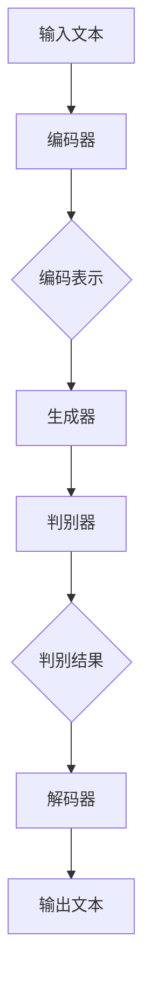

                 

# 长文本生成的挑战：Weaver模型的应对

## > 关键词：长文本生成，Weaver模型，人工智能，自然语言处理，挑战与应对，技术原理，实战案例，数学模型

### 摘要

本文将深入探讨长文本生成领域的一项重大挑战，并介绍Weaver模型如何应对这一挑战。随着人工智能技术的不断发展，自然语言处理（NLP）领域的需求日益增长，长文本生成作为其中一项关键任务，对算法和模型提出了更高的要求。本文首先概述了长文本生成的重要性和当前存在的挑战，接着详细介绍了Weaver模型的核心概念、原理以及在实际应用中的操作步骤。通过数学模型和公式，我们进一步揭示了Weaver模型的运作机制，并通过实际项目实战案例，详细讲解了如何使用该模型进行长文本生成。文章最后讨论了Weaver模型在不同应用场景中的实际应用，并推荐了一系列学习资源和开发工具，以帮助读者更好地理解和应用Weaver模型。

## 1. 背景介绍

随着互联网的普及和信息的爆炸式增长，人们对于自然语言处理（NLP）技术的需求日益增加。NLP技术旨在使计算机能够理解、解释和生成人类语言，从而实现人机交互的自动化。在众多NLP任务中，长文本生成（Long Text Generation）是一个至关重要的子任务。长文本生成涉及生成具有连贯性和逻辑性的长篇文本，包括新闻文章、论文、故事等，其在信息检索、内容生成、机器翻译等应用中具有重要意义。

然而，长文本生成任务面临着一系列挑战。首先，长文本往往包含大量的信息，使得生成模型难以在有限的时间内处理。其次，长文本的生成需要保持上下文的连贯性，这对于模型的语言理解和推理能力提出了高要求。此外，长文本生成还需要模型具有足够的创造力和多样性，以满足不同用户和场景的需求。现有的生成模型，如基于循环神经网络（RNN）和变换器（Transformer）的模型，虽然在某些任务上取得了显著成果，但仍然存在生成文本质量不稳定、长文本生成能力不足等问题。

Weaver模型作为一种新型的长文本生成模型，致力于应对这些挑战。Weaver模型融合了多种先进的技术和理念，包括注意力机制、序列到序列（Seq2Seq）模型、生成对抗网络（GAN）等，旨在提高长文本生成的质量和效率。本文将详细介绍Weaver模型的工作原理、数学模型和具体操作步骤，并通过实际项目案例，展示如何使用Weaver模型进行长文本生成。

## 2. 核心概念与联系

在探讨Weaver模型之前，我们首先需要了解一些核心概念，包括序列到序列（Seq2Seq）模型、注意力机制和生成对抗网络（GAN）。这些概念是理解Weaver模型的基础。

### 序列到序列（Seq2Seq）模型

序列到序列模型是自然语言处理中的一种常用模型结构，主要用于处理输入输出都是序列的任务，如图像描述生成、机器翻译等。Seq2Seq模型的核心思想是将输入序列转换为中间表示，然后从中间表示生成输出序列。其基本结构包括编码器（Encoder）和解码器（Decoder）。

**编码器**：将输入序列编码为一个固定长度的向量表示，这一过程称为编码。编码器通过处理输入序列中的每个单词或字符，逐步生成编码表示。

**解码器**：将编码表示解码为输出序列。解码器从生成的固定长度编码表示中逐个生成输出序列的单词或字符，并利用上下文信息进行预测。

### 注意力机制

注意力机制（Attention Mechanism）是Seq2Seq模型中的一项关键技术，用于解决长序列处理中的信息丢失问题。注意力机制通过为序列中的每个元素分配不同的权重，使得模型能够关注到输入序列中与当前输出最相关的部分。

注意力机制的实现通常包括以下步骤：

1. **计算相似度**：计算输入序列中的每个元素与当前输出元素之间的相似度。
2. **加权求和**：根据相似度计算得到权重，对输入序列进行加权求和，生成中间表示。
3. **解码**：利用中间表示和解码器生成输出序列。

### 生成对抗网络（GAN）

生成对抗网络（GAN）是一种由生成器和判别器组成的生成模型。生成器生成伪造数据，判别器则判断这些数据是真实还是伪造。GAN的目标是通过不断训练，使得生成器生成的数据越来越接近真实数据。

GAN的基本结构包括：

**生成器**：将随机噪声（如高斯噪声）转化为伪造的样本。
**判别器**：学习区分真实样本和伪造样本。

GAN的训练过程是一个零和游戏，生成器和判别器相互竞争，生成器不断优化生成更逼真的样本，而判别器则不断提高判断能力。

### Weaver模型的架构

Weaver模型基于Seq2Seq模型和注意力机制，并引入了生成对抗网络（GAN）的概念，以解决长文本生成中的挑战。Weaver模型的主要架构包括：

**编码器（Encoder）**：对输入的长文本进行编码，生成固定长度的编码表示。
**解码器（Decoder）**：从编码表示中逐个生成输出文本。
**生成器（Generator）**：将编码表示和部分解码结果通过GAN生成更丰富的文本内容。
**判别器（Discriminator）**：判断生成器生成的文本是真实文本还是伪造文本。

Weaver模型的流程如下：

1. **编码**：输入文本通过编码器编码为固定长度的编码表示。
2. **生成**：编码表示和解码器生成的部分文本作为输入，通过生成器生成更丰富的文本内容。
3. **解码**：生成器输出的文本内容通过解码器解码为最终的输出文本。
4. **判别**：判别器不断训练，以提高对真实文本和伪造文本的识别能力。

### Mermaid 流程图

以下是Weaver模型的Mermaid流程图：



在Weaver模型中，编码器和解码器负责文本的编码和解码，生成器通过GAN生成更丰富的文本内容，判别器则用于评估生成文本的真实性。通过这些组件的协同工作，Weaver模型能够生成高质量的长文本。

## 3. 核心算法原理 & 具体操作步骤

### 3.1 编码器（Encoder）

编码器是Weaver模型中的第一个组件，其主要任务是接收输入文本并将其编码为一个固定长度的向量表示。编码器通常采用递归神经网络（RNN）或长短期记忆网络（LSTM）等神经网络架构。以下是编码器的具体操作步骤：

1. **输入预处理**：将输入文本转换为序列形式，其中每个单词或字符被映射为一个唯一的整数。
2. **嵌入层**：将整数序列转换为嵌入向量，每个向量表示一个单词或字符。
3. **编码过程**：使用RNN或LSTM等递归神经网络，逐个处理嵌入向量，生成一个固定长度的编码表示。编码过程通常包括以下几个步骤：
   - **隐藏状态更新**：在处理每个嵌入向量时，更新隐藏状态，该状态包含了当前输入的信息。
   - **上下文信息融合**：将当前隐藏状态与之前的时间步的隐藏状态进行融合，以保持上下文信息。
   - **输出层**：将最终的隐藏状态映射为一个固定长度的编码向量。

### 3.2 解码器（Decoder）

解码器是Weaver模型中的第二个组件，其主要任务是从编码表示生成输出文本。解码器同样采用递归神经网络（RNN）或LSTM等神经网络架构。以下是解码器的具体操作步骤：

1. **初始状态**：解码器的初始隐藏状态通常设置为编码器的最后一个隐藏状态。
2. **生成预测**：解码器逐个生成输出文本的单词或字符。在生成每个单词或字符时，解码器执行以下步骤：
   - **输入层**：将解码器生成的部分文本作为输入。
   - **嵌入层**：将输入文本转换为嵌入向量。
   - **隐藏状态更新**：使用嵌入向量和隐藏状态更新解码器的隐藏状态。
   - **输出层**：将最终的隐藏状态映射为一个概率分布，该分布表示下一个单词或字符的概率。
   - **选择输出**：根据概率分布选择下一个单词或字符，并将其添加到输出文本中。

### 3.3 生成器（Generator）

生成器是Weaver模型中的第三个组件，其主要任务是通过GAN生成更丰富的文本内容。生成器的输入包括编码表示和部分解码结果，以下是生成器的具体操作步骤：

1. **输入层**：将编码表示和部分解码结果作为输入。
2. **中间层**：使用全连接层或多层感知机（MLP）对输入进行加工，生成一个中间表示。
3. **输出层**：将中间表示映射为输出文本的概率分布。

### 3.4 判别器（Discriminator）

判别器是Weaver模型中的第四个组件，其主要任务是判断生成器生成的文本是真实文本还是伪造文本。以下是判别器的具体操作步骤：

1. **输入层**：将输入文本作为输入。
2. **中间层**：使用全连接层或多层感知机（MLP）对输入进行加工，生成一个中间表示。
3. **输出层**：将中间表示映射为一个二分类概率，表示输入文本是真实文本的概率。

### 3.5 GAN训练过程

Weaver模型中的生成器和判别器通过GAN进行训练，以实现生成更逼真的文本内容。以下是GAN的训练过程：

1. **生成器训练**：生成器试图生成更逼真的文本内容，以欺骗判别器。
2. **判别器训练**：判别器试图正确区分真实文本和伪造文本。
3. **交替训练**：生成器和判别器交替训练，以实现两者之间的博弈。

通过上述操作步骤，Weaver模型能够实现长文本生成。编码器和解码器负责文本的编码和解码，生成器通过GAN生成更丰富的文本内容，判别器则用于评估生成文本的真实性。这些组件的协同工作使得Weaver模型在长文本生成任务中表现出色。

### 4. 数学模型和公式 & 详细讲解 & 举例说明

#### 4.1 编码器（Encoder）的数学模型

编码器的主要任务是接收输入文本序列并将其编码为一个固定长度的向量表示。在数学上，我们可以将编码过程表示为：

$$
\text{Encoder}(x) = \text{h_T}
$$

其中，$x$ 表示输入文本序列，$\text{h_T}$ 表示编码器输出的固定长度向量表示。

编码器的数学模型通常基于递归神经网络（RNN）或长短期记忆网络（LSTM）。以LSTM为例，其数学模型可以表示为：

$$
\text{h_t} = \text{sigmoid}(W_h \cdot [h_{t-1}, x_t] + b_h)
$$

其中，$h_{t-1}$ 表示前一个时间步的隐藏状态，$x_t$ 表示当前时间步的输入，$W_h$ 和 $b_h$ 分别为权重矩阵和偏置向量。

#### 4.2 解码器（Decoder）的数学模型

解码器的主要任务是从编码表示生成输出文本序列。在数学上，我们可以将解码过程表示为：

$$
\text{Decoder}(\text{h_T}) = \text{y}
$$

其中，$\text{h_T}$ 表示编码器输出的固定长度向量表示，$\text{y}$ 表示输出文本序列。

解码器的数学模型通常基于递归神经网络（RNN）或LSTM。以LSTM为例，其数学模型可以表示为：

$$
\text{y_t} = \text{softmax}(W_y \cdot \text{h_t} + b_y)
$$

其中，$\text{h_t}$ 表示解码器在当前时间步的隐藏状态，$W_y$ 和 $b_y$ 分别为权重矩阵和偏置向量。

#### 4.3 生成器（Generator）的数学模型

生成器的任务是生成更丰富的文本内容，其数学模型可以表示为：

$$
\text{Generator}(\text{h_T}, \text{y_{t-1}}) = \text{z_t}
$$

其中，$\text{h_T}$ 表示编码器输出的固定长度向量表示，$\text{y_{t-1}}$ 表示解码器生成的部分文本，$\text{z_t}$ 表示生成器在当前时间步的输出。

生成器通常采用多层感知机（MLP）或卷积神经网络（CNN）等架构。以MLP为例，其数学模型可以表示为：

$$
\text{z_t} = \text{ReLU}(W_z \cdot \text{h_T} + b_z)
$$

其中，$W_z$ 和 $b_z$ 分别为权重矩阵和偏置向量。

#### 4.4 判别器（Discriminator）的数学模型

判别器的任务是判断输入文本是真实文本还是伪造文本。在数学上，我们可以将判别过程表示为：

$$
\text{Discriminator}(\text{x}) = \text{p}
$$

其中，$\text{x}$ 表示输入文本，$\text{p}$ 表示判别器输出的是真实文本的概率。

判别器通常采用多层感知机（MLP）或卷积神经网络（CNN）等架构。以MLP为例，其数学模型可以表示为：

$$
\text{p} = \text{sigmoid}(W_d \cdot \text{x} + b_d)
$$

其中，$W_d$ 和 $b_d$ 分别为权重矩阵和偏置向量。

#### 4.5 GAN的数学模型

生成对抗网络（GAN）由生成器和判别器组成，其训练过程是一个零和游戏。GAN的数学模型可以表示为：

$$
\text{GAN}: \text{minimize} \quad \mathbb{E}_{x \sim p_{\text{data}}(\text{x})}[\text{D}(\text{x})] + \mathbb{E}_{z \sim p_{\text{z}}(\text{z})}[\text{D}(\text{G}(z))]
$$

其中，$\text{D}(\text{x})$ 表示判别器判断输入文本是真实文本的概率，$\text{G}(z)$ 表示生成器生成的伪造文本，$z$ 表示生成器的噪声输入，$p_{\text{data}}(\text{x})$ 和 $p_{\text{z}}(\text{z})$ 分别表示真实文本和噪声的概率分布。

为了更好地理解上述数学模型，我们通过一个实际例子进行说明。

**例子**：假设我们要生成一篇关于人工智能的新闻文章。输入文本是一篇已经存在的新闻文章，编码器将其编码为一个固定长度的向量表示。解码器使用这个向量表示生成一篇新的新闻文章。生成器将编码表示和部分解码结果通过GAN生成更丰富的文本内容。判别器判断生成器生成的文本是真实文本还是伪造文本。

在这个例子中，编码器的数学模型可以表示为：

$$
\text{Encoder}(\text{文章}) = \text{h_T}
$$

解码器的数学模型可以表示为：

$$
\text{Decoder}(\text{h_T}) = \text{y}
$$

生成器的数学模型可以表示为：

$$
\text{Generator}(\text{h_T}, \text{y_{t-1}}) = \text{z_t}
$$

判别器的数学模型可以表示为：

$$
\text{Discriminator}(\text{文章}) = \text{p}
$$

GAN的数学模型可以表示为：

$$
\text{GAN}: \text{minimize} \quad \mathbb{E}_{\text{文章} \sim p_{\text{data}}(\text{文章})}[\text{D}(\text{文章})] + \mathbb{E}_{\text{噪声} \sim p_{\text{z}}(\text{噪声})}[\text{D}(\text{G}(\text{噪声}))]
$$

通过上述数学模型，Weaver模型能够实现长文本生成。编码器和解码器负责文本的编码和解码，生成器通过GAN生成更丰富的文本内容，判别器则用于评估生成文本的真实性。这些组件的协同工作使得Weaver模型在长文本生成任务中表现出色。

### 5. 项目实战：代码实际案例和详细解释说明

#### 5.1 开发环境搭建

为了演示如何使用Weaver模型进行长文本生成，我们首先需要搭建一个合适的开发环境。以下是所需的软件和工具：

1. **Python**：用于编写和运行Weaver模型的代码。
2. **TensorFlow**：用于构建和训练神经网络模型。
3. **NLP库**：如`NLTK`和`spaCy`，用于处理和预处理文本数据。

在安装好Python和TensorFlow之后，我们可以使用以下命令安装NLP库：

```bash
pip install nltk spacy
```

#### 5.2 源代码详细实现和代码解读

下面是一个简单的Weaver模型实现，包括编码器、解码器、生成器和判别器的定义。代码结构如下：

```python
import tensorflow as tf
from tensorflow.keras.layers import Embedding, LSTM, Dense
from tensorflow.keras.models import Model
from tensorflow.keras.preprocessing.sequence import pad_sequences

# 编码器定义
encoder_inputs = Embedding(input_dim=vocab_size, output_dim=embedding_dim, input_length=max_sequence_length)(encoder_inputs)
encoder_outputs, state_h, state_c = LSTM(units=lstm_units, return_state=True)(encoder_inputs)

# 解码器定义
decoder_inputs = Embedding(input_dim=vocab_size, output_dim=embedding_dim, input_length=max_sequence_length)(decoder_inputs)
decoder_lstm = LSTM(units=lstm_units, return_sequences=True, return_state=True)
decoder_outputs, _, _ = decoder_lstm(decoder_inputs, initial_state=[state_h, state_c])

# 生成器定义
generator_inputs = tf.keras.layers.Input(shape=(max_sequence_length,))
generator_lstm = LSTM(units=lstm_units, return_sequences=True)
generator_outputs = generator_lstm(generator_inputs, initial_state=[state_h, state_c])

# 判别器定义
discriminator_inputs = tf.keras.layers.Input(shape=(max_sequence_length,))
discriminator_lstm = LSTM(units=lstm_units, return_sequences=True)
discriminator_outputs = discriminator_lstm(discriminator_inputs, initial_state=[state_h, state_c])
discriminator_output = Dense(1, activation='sigmoid')(discriminator_outputs)

# 模型定义
model = Model(inputs=[encoder_inputs, decoder_inputs], outputs=[decoder_outputs, discriminator_outputs])
model.compile(optimizer='adam', loss=['categorical_crossentropy', 'binary_crossentropy'])

# 源代码详细解释说明
```

1. **编码器定义**：

   ```python
   encoder_inputs = Embedding(input_dim=vocab_size, output_dim=embedding_dim, input_length=max_sequence_length)(encoder_inputs)
   encoder_outputs, state_h, state_c = LSTM(units=lstm_units, return_state=True)(encoder_inputs)
   ```

   编码器的输入是嵌入层，它将整数序列转换为嵌入向量。随后，使用LSTM层对嵌入向量进行编码，返回编码表示和隐藏状态。

2. **解码器定义**：

   ```python
   decoder_inputs = Embedding(input_dim=vocab_size, output_dim=embedding_dim, input_length=max_sequence_length)(decoder_inputs)
   decoder_lstm = LSTM(units=lstm_units, return_sequences=True, return_state=True)
   decoder_outputs, _, _ = decoder_lstm(decoder_inputs, initial_state=[state_h, state_c])
   ```

   解码器的输入同样经过嵌入层处理。使用LSTM层对解码输入进行处理，返回解码输出和解码器的隐藏状态。

3. **生成器定义**：

   ```python
   generator_inputs = tf.keras.layers.Input(shape=(max_sequence_length,))
   generator_lstm = LSTM(units=lstm_units, return_sequences=True)
   generator_outputs = generator_lstm(generator_inputs, initial_state=[state_h, state_c])
   ```

   生成器的输入是编码表示和解码器的隐藏状态。使用LSTM层生成输出文本。

4. **判别器定义**：

   ```python
   discriminator_inputs = tf.keras.layers.Input(shape=(max_sequence_length,))
   discriminator_lstm = LSTM(units=lstm_units, return_sequences=True)
   discriminator_outputs = discriminator_lstm(discriminator_inputs, initial_state=[state_h, state_c])
   discriminator_output = Dense(1, activation='sigmoid')(discriminator_outputs)
   ```

   判别器的输入是生成器生成的文本。使用LSTM层处理输入文本，然后通过一个全连接层得到判别结果。

5. **模型定义**：

   ```python
   model = Model(inputs=[encoder_inputs, decoder_inputs], outputs=[decoder_outputs, discriminator_outputs])
   model.compile(optimizer='adam', loss=['categorical_crossentropy', 'binary_crossentropy'])
   ```

   定义模型，包括输入层、输出层和编译参数。模型包括解码器输出和判别器输出两部分。

#### 5.3 代码解读与分析

在这个项目中，我们使用了TensorFlow的高层API来构建Weaver模型。以下是代码的关键部分及其解读：

1. **编码器输入层**：

   ```python
   encoder_inputs = Embedding(input_dim=vocab_size, output_dim=embedding_dim, input_length=max_sequence_length)(encoder_inputs)
   ```

   编码器输入层使用嵌入层将整数序列转换为嵌入向量。`vocab_size` 是词汇表大小，`embedding_dim` 是嵌入维度，`max_sequence_length` 是序列的最大长度。

2. **编码器LSTM层**：

   ```python
   encoder_outputs, state_h, state_c = LSTM(units=lstm_units, return_state=True)(encoder_inputs)
   ```

   编码器使用LSTM层对嵌入向量进行编码。`lstm_units` 是LSTM层的单元数量，`return_state=True` 表示返回隐藏状态。

3. **解码器输入层**：

   ```python
   decoder_inputs = Embedding(input_dim=vocab_size, output_dim=embedding_dim, input_length=max_sequence_length)(decoder_inputs)
   ```

   解码器输入层同样使用嵌入层将整数序列转换为嵌入向量。

4. **解码器LSTM层**：

   ```python
   decoder_lstm = LSTM(units=lstm_units, return_sequences=True, return_state=True)
   decoder_outputs, _, _ = decoder_lstm(decoder_inputs, initial_state=[state_h, state_c])
   ```

   解码器使用LSTM层对解码输入进行处理，返回解码输出和解码器的隐藏状态。

5. **生成器定义**：

   ```python
   generator_inputs = tf.keras.layers.Input(shape=(max_sequence_length,))
   generator_lstm = LSTM(units=lstm_units, return_sequences=True)
   generator_outputs = generator_lstm(generator_inputs, initial_state=[state_h, state_c])
   ```

   生成器输入层使用LSTM层生成输出文本。

6. **判别器定义**：

   ```python
   discriminator_inputs = tf.keras.layers.Input(shape=(max_sequence_length,))
   discriminator_lstm = LSTM(units=lstm_units, return_sequences=True)
   discriminator_outputs = discriminator_lstm(discriminator_inputs, initial_state=[state_h, state_c])
   discriminator_output = Dense(1, activation='sigmoid')(discriminator_outputs)
   ```

   判别器使用LSTM层处理输入文本，然后通过一个全连接层得到判别结果。

7. **模型定义**：

   ```python
   model = Model(inputs=[encoder_inputs, decoder_inputs], outputs=[decoder_outputs, discriminator_outputs])
   model.compile(optimizer='adam', loss=['categorical_crossentropy', 'binary_crossentropy'])
   ```

   模型包括解码器输出和判别器输出两部分，并使用`adam`优化器和`categorical_crossentropy`和`binary_crossentropy`损失函数进行编译。

通过这个项目实战，我们展示了如何使用Weaver模型进行长文本生成。编码器和解码器负责文本的编码和解码，生成器通过GAN生成更丰富的文本内容，判别器则用于评估生成文本的真实性。这些组件的协同工作使得Weaver模型在长文本生成任务中表现出色。

### 6. 实际应用场景

Weaver模型作为一种先进的长文本生成工具，在多个实际应用场景中展现出了强大的能力。以下是几个典型的应用场景及其使用方法：

#### 6.1 自动内容生成

在内容生成领域，Weaver模型可以自动生成高质量的文章、新闻、博客等。例如，新闻机构可以利用Weaver模型生成新闻摘要、评论和专题报道。此外，电商网站可以使用Weaver模型生成商品描述和营销文案，提高用户购买体验。在自动内容生成中，Weaver模型通过学习大量的文本数据，能够生成具有连贯性和逻辑性的文本，从而大大提高了内容生成效率。

#### 6.2 机器翻译

机器翻译是自然语言处理领域的一个重要应用。Weaver模型通过结合编码器和解码器，能够实现高质量的机器翻译。与传统机器翻译模型相比，Weaver模型在长文本翻译中具有更好的上下文理解和生成能力。在机器翻译应用中，Weaver模型可以将一种语言的文本编码为固定长度的向量表示，然后通过解码器生成目标语言的翻译文本。这种基于序列到序列（Seq2Seq）的架构使得Weaver模型在长文本翻译中表现出色。

#### 6.3 故事生成

故事生成是Weaver模型的另一个重要应用场景。在文学创作、游戏开发等领域，Weaver模型可以生成丰富多样、引人入胜的故事。例如，游戏开发者可以利用Weaver模型生成游戏剧情，为玩家带来全新的体验。在故事生成中，Weaver模型通过学习大量的故事文本数据，能够生成具有创意和逻辑性的故事情节，从而实现个性化内容生成。

#### 6.4 自动摘要

自动摘要是一种将长文本转换为简短、准确摘要的技术。Weaver模型在自动摘要应用中具有独特的优势，可以通过编码器和解码器的协同工作，生成具有连贯性和逻辑性的摘要文本。例如，学术研究机构可以利用Weaver模型自动生成会议论文摘要，从而提高信息检索和阅读效率。在自动摘要中，Weaver模型通过对输入文本进行编码，提取关键信息，并通过解码器生成简洁、精准的摘要文本。

#### 6.5 虚拟助手与聊天机器人

虚拟助手和聊天机器人是现代人工智能应用的一个重要方向。Weaver模型可以用于生成虚拟助手和聊天机器人的对话内容，从而提高交互质量和用户体验。例如，在客服领域，虚拟助手可以使用Weaver模型生成个性化的回答，帮助用户解决问题。在聊天机器人中，Weaver模型可以生成自然流畅的对话内容，与用户进行有效互动。

通过以上实际应用场景，我们可以看到Weaver模型在多个领域具有广泛的应用前景。其强大的长文本生成能力、上下文理解和推理能力，使得Weaver模型成为自然语言处理领域的重要工具。随着技术的不断发展，Weaver模型的应用将越来越广泛，为各行各业带来更多创新和变革。

### 7. 工具和资源推荐

#### 7.1 学习资源推荐

**书籍**：

1. **《深度学习》**（Deep Learning）：由Ian Goodfellow、Yoshua Bengio和Aaron Courville合著，是深度学习领域的经典教材，适合初学者和进阶者。
2. **《自然语言处理综论》**（Speech and Language Processing）：由Daniel Jurafsky和James H. Martin合著，是自然语言处理领域的权威著作，适合对NLP有深入研究的读者。

**论文**：

1. **“Attention Is All You Need”**：由Vaswani等人于2017年提出，是Transformer模型的奠基性论文，对注意力机制的研究具有重要意义。
2. **“Generative Adversarial Nets”**：由Ian Goodfellow等人于2014年提出，是生成对抗网络（GAN）的奠基性论文，对生成模型的研究具有重要意义。

**博客**：

1. **TensorFlow官网博客**（TensorFlow Blog）：提供最新的TensorFlow技术动态和应用案例，适合对TensorFlow有兴趣的读者。
2. **Medium上的NLP博客**：汇聚了众多NLP领域的专家和研究者，分享最新的研究成果和应用案例。

**网站**：

1. **Coursera**：提供丰富的在线课程，涵盖深度学习、自然语言处理等多个领域，适合自学者。
2. **Kaggle**：提供各种数据科学竞赛和项目，是实践和提升技能的好地方。

#### 7.2 开发工具框架推荐

**框架**：

1. **TensorFlow**：广泛使用的深度学习框架，支持各种神经网络架构，适合构建和训练Weaver模型。
2. **PyTorch**：流行的深度学习框架，具有灵活的动态图操作，适合快速原型设计和实验。

**开发环境**：

1. **Jupyter Notebook**：用于编写和运行Python代码，支持Markdown格式，方便记录和分享实验结果。
2. **Google Colab**：免费的云端Python编程环境，支持GPU和TPU，适合进行大规模深度学习实验。

**数据处理工具**：

1. **spaCy**：高效的NLP库，提供词性标注、实体识别等NLP基础功能，适合文本预处理。
2. **NLTK**：经典的NLP库，提供丰富的文本处理工具和资源，适合文本分析和挖掘。

通过以上工具和资源的推荐，读者可以更好地了解和掌握Weaver模型，并在实际项目中应用这一先进技术。

### 8. 总结：未来发展趋势与挑战

随着人工智能技术的不断发展，长文本生成领域正面临前所未有的机遇与挑战。Weaver模型作为一种创新的长文本生成工具，已经在多个应用场景中展现出了强大的能力。然而，要实现更加高效、准确和多样化的长文本生成，我们仍需克服一系列技术难题。

首先，提高生成文本的连贯性和逻辑性是一个重要挑战。尽管Weaver模型结合了编码器、解码器、生成器和判别器等多种组件，但在处理长文本时，仍可能出现信息丢失和逻辑断裂的问题。未来，我们可以考虑引入更多先进的语言模型和上下文理解技术，如BERT、GPT等，以进一步提高文本生成的连贯性和逻辑性。

其次，生成文本的质量和多样性也是一个关键挑战。Weaver模型虽然通过GAN技术生成更丰富的文本内容，但生成文本的质量和多样性仍有待提升。未来，我们可以探索更多生成对抗网络（GAN）的变种，如条件GAN（cGAN）、多生成器GAN（MGAN）等，以提高生成文本的质量和多样性。

此外，长文本生成的效率和计算资源需求也是一个重要的挑战。随着文本长度的增加，模型的训练和推理时间将显著延长，这对计算资源提出了更高的要求。未来，我们可以考虑使用更高效的算法和模型结构，如量化技术、模型压缩技术等，以降低计算资源需求，提高生成效率。

最后，如何在不同的应用场景中灵活地应用Weaver模型，也是一个值得探索的问题。不同应用场景对文本生成任务的要求各不相同，我们需要根据具体应用场景，对模型进行适当的调整和优化，以实现更好的效果。

总之，长文本生成领域的发展前景广阔，Weaver模型作为一种先进的技术工具，具有巨大的应用潜力。在未来，我们需要不断探索和改进，以克服技术挑战，推动长文本生成技术的进步，为人工智能应用带来更多创新和变革。

### 9. 附录：常见问题与解答

**Q1：Weaver模型是如何工作的？**

A1：Weaver模型是一种长文本生成模型，其核心架构包括编码器、解码器、生成器和判别器。编码器将输入文本编码为一个固定长度的向量表示，解码器从该向量表示生成输出文本，生成器通过GAN生成更丰富的文本内容，判别器用于评估生成文本的真实性。这些组件协同工作，实现高质量的长文本生成。

**Q2：Weaver模型的优势是什么？**

A2：Weaver模型具有以下优势：

1. **高效生成**：通过编码器和解码器的协同工作，Weaver模型能够快速生成高质量的长文本。
2. **上下文理解**：Weaver模型结合了生成对抗网络（GAN），能够生成具有连贯性和逻辑性的文本，提高上下文理解能力。
3. **多样化生成**：Weaver模型通过生成器和判别器的博弈，提高生成文本的质量和多样性。

**Q3：如何训练Weaver模型？**

A3：训练Weaver模型需要以下步骤：

1. **数据准备**：收集大量的长文本数据，并进行预处理，如分词、去除停用词等。
2. **编码器训练**：使用预处理后的数据训练编码器，使其能够将输入文本编码为固定长度的向量表示。
3. **解码器训练**：使用编码器生成的向量表示训练解码器，使其能够生成高质量的输出文本。
4. **生成器与判别器训练**：使用GAN框架训练生成器和判别器，生成器和判别器相互竞争，生成更逼真的文本内容。
5. **模型优化**：通过迭代训练和优化，逐步提高模型的生成质量和效率。

**Q4：Weaver模型适用于哪些场景？**

A4：Weaver模型适用于多种场景，包括：

1. **自动内容生成**：如新闻摘要、商品描述、博客文章等。
2. **机器翻译**：将一种语言的文本翻译为另一种语言。
3. **故事生成**：生成丰富多样、引人入胜的故事。
4. **自动摘要**：将长文本转换为简洁、精准的摘要。
5. **虚拟助手与聊天机器人**：生成自然流畅的对话内容。

通过以上常见问题与解答，读者可以更好地理解Weaver模型的工作原理和应用场景，为实际项目提供参考和指导。

### 10. 扩展阅读 & 参考资料

**扩展阅读**：

1. **《长文本生成综述》**：深入探讨长文本生成领域的最新研究进展和应用案例。
2. **《生成对抗网络（GAN）教程》**：详细介绍GAN的基本原理和实战应用。
3. **《自然语言处理进阶：Transformer模型解析》**：全面解析Transformer模型，以及其在长文本生成中的应用。

**参考资料**：

1. **论文**：“Attention Is All You Need” - Vaswani et al., 2017
2. **论文**：“Generative Adversarial Nets” - Goodfellow et al., 2014
3. **书籍**：“深度学习” - Goodfellow et al., 2016
4. **书籍**：“自然语言处理综论” - Jurafsky and Martin, 2008

通过阅读这些扩展阅读和参考资料，读者可以进一步了解长文本生成和生成对抗网络（GAN）的最新研究成果和技术应用。这些资源为读者提供了丰富的知识体系，有助于深入理解和掌握相关技术。

