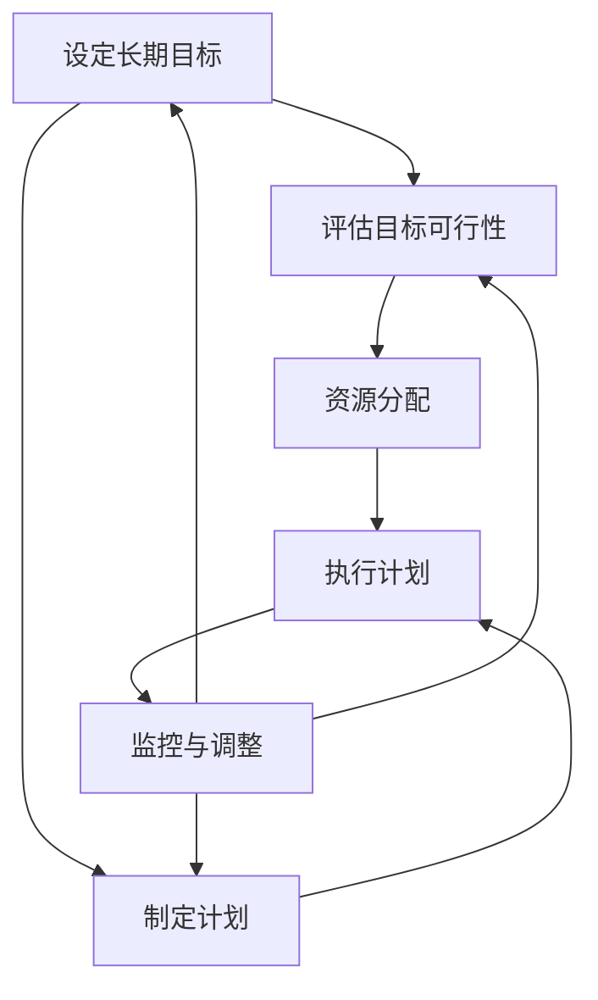
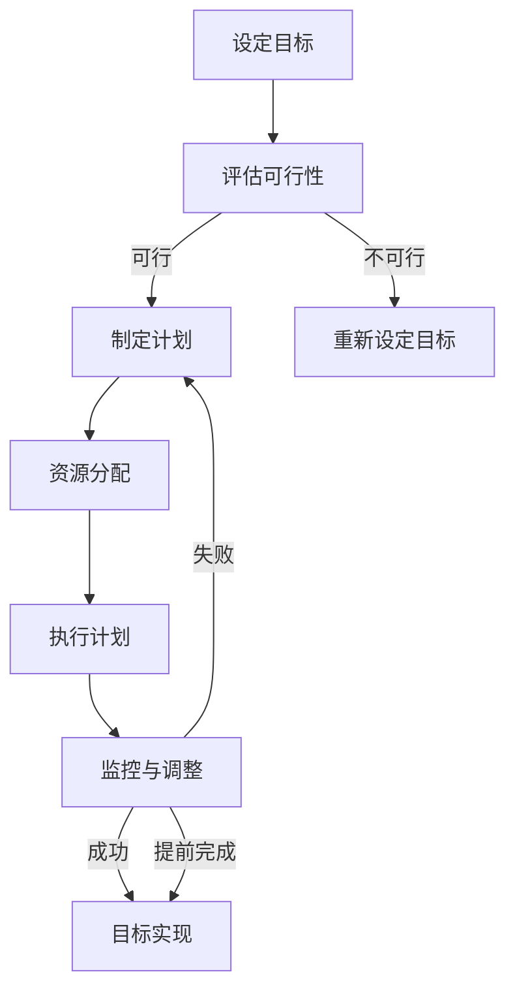

                 

### 背景介绍 Background Introduction

长期目标管理是现代项目管理中不可或缺的一部分，尤其是在信息技术（IT）领域。在快速变化的技术环境中，有效的长期目标管理可以帮助团队和企业保持竞争力，确保他们能够持续创新、提高效率并满足客户需求。本文旨在探讨长期目标管理的方法，提供一套系统化的意识方法，以帮助IT专业人士和组织制定、跟踪和实现他们的长期目标。

**为什么长期目标管理对IT领域至关重要？**

1. **技术迭代的挑战**：信息技术领域技术迭代迅速，长期目标管理可以帮助团队保持对最新趋势的关注，并确保他们的工作与行业方向保持一致。

2. **资源优化**：有效的长期目标管理可以帮助团队在资源分配上更加合理，避免浪费资源，提高项目的成功率。

3. **风险管理**：通过长期目标管理，IT团队可以识别潜在的风险并提前制定应对策略，减少项目失败的可能性。

4. **持续创新**：长期目标管理鼓励团队不断探索新的技术解决方案，推动持续创新，保持竞争优势。

5. **员工激励**：明确的长期目标可以激励员工努力工作，提高团队的整体士气和工作效率。

本文将分为以下几个部分：

- **核心概念与联系**：介绍长期目标管理中的关键概念和它们之间的关系。
- **核心算法原理 & 具体操作步骤**：探讨如何制定和实现长期目标。
- **数学模型和公式 & 详细讲解 & 举例说明**：运用数学模型来优化长期目标管理过程。
- **项目实战：代码实际案例和详细解释说明**：通过实际案例展示长期目标管理的方法。
- **实际应用场景**：分析长期目标管理在IT领域的具体应用。
- **工具和资源推荐**：推荐学习资源和开发工具，以支持长期目标管理。
- **总结：未来发展趋势与挑战**：展望长期目标管理的未来。
- **附录：常见问题与解答**：回答读者可能遇到的问题。

让我们开始深入探讨长期目标管理的各个层面，以帮助IT专业人士和组织在复杂多变的技术环境中取得成功。

**Keywords:** Long-term goal management, IT, project management, resource optimization, risk management, continuous innovation, employee motivation.

**Abstract:**
This article explores the concept of long-term goal management in the IT field, providing a systematic approach for IT professionals and organizations to formulate, track, and achieve their long-term goals. It covers key concepts, algorithm principles, mathematical models, practical cases, application scenarios, recommended tools and resources, future trends, and common questions.

---

## 2. 核心概念与联系 Core Concepts and Relationships

在深入探讨长期目标管理之前，我们需要明确一些核心概念，并了解它们之间的联系。以下是几个关键概念及其相互关系的Mermaid流程图描述：



### 设定长期目标 Setting Long-term Goals

设定长期目标是长期目标管理的第一步。这一阶段需要明确组织的愿景和使命，并根据这些指导原则设定具体、可衡量的目标。这些目标应该是具有挑战性的，同时也要现实可行。

### 评估目标可行性 Evaluating Goal Feasibility

在设定长期目标后，我们需要评估目标的可行性。这包括分析所需的资源、技术、时间等因素，以确保目标不仅具有挑战性，而且也是可以实现的。

### 制定计划 Developing a Plan

制定计划是将长期目标转化为可执行步骤的关键步骤。在这个过程中，我们需要确定关键里程碑、任务和责任分配，并制定详细的时间表。

### 资源分配 Resource Allocation

资源分配是确保计划能够顺利执行的重要环节。这包括人力、资金、设备等资源的合理分配，以确保项目在各个阶段都能得到充分的支持。

### 执行计划 Implementing the Plan

执行计划是将计划转化为实际行动的过程。在这个过程中，团队成员需要紧密合作，确保每个任务都能按时完成，并保持对项目的整体进度有清晰的了解。

### 监控与调整 Monitoring and Adjustment

监控与调整是长期目标管理中的关键环节。通过定期的监控，我们可以及时发现项目中的问题，并根据实际情况进行调整，以确保项目能够按计划顺利进行。

### Mermaid流程图解释 Explanation of the Mermaid Flowchart

- **设定长期目标（Setting Long-term Goals）**：这是整个流程的起点，目标是组织的愿景和使命的具体体现。
- **评估目标可行性（Evaluating Goal Feasibility）**：在设定目标后，我们需要对其可行性进行评估，以确保目标具有实际操作的可能性。
- **制定计划（Developing a Plan）**：在确定目标可行后，我们需要制定详细的计划，将目标分解为具体的任务和里程碑。
- **资源分配（Resource Allocation）**：为了确保计划的顺利执行，我们需要合理分配资源，包括人力、资金和设备等。
- **执行计划（Implementing the Plan）**：这一阶段是将计划付诸实践的过程，团队成员需要紧密合作，确保每个任务都能按时完成。
- **监控与调整（Monitoring and Adjustment）**：通过定期的监控，我们可以及时发现项目中的问题，并根据实际情况进行调整，以确保项目能够按计划顺利进行。

通过上述步骤，我们可以确保长期目标管理过程的系统性和有效性，从而提高项目的成功率。

### Keywords:

- Long-term goal setting
- Goal feasibility evaluation
- Plan development
- Resource allocation
- Plan implementation
- Monitoring and adjustment

---

## 3. 核心算法原理 & 具体操作步骤 Core Algorithm Principles and Operational Steps

### 3.1 长期目标管理算法概述

长期目标管理算法的核心在于如何通过系统化的方法制定和实现长期目标。以下是一个简化的算法流程：



### 3.2 具体操作步骤

#### 步骤 1：设定目标（Setting Goals）

- **明确目标**：首先，需要明确组织的长期目标，这些目标应该与组织的愿景和使命一致。
- **具体、可衡量**：确保每个目标都是具体的、可衡量的，以便于后续的评估和监控。

#### 步骤 2：评估可行性（Evaluating Feasibility）

- **资源分析**：分析实现目标所需的资源，包括人力、资金、技术和时间等。
- **风险评估**：评估可能遇到的风险和挑战，并制定应对策略。

#### 步骤 3：制定计划（Developing a Plan）

- **分解目标**：将长期目标分解为具体的任务和里程碑。
- **责任分配**：明确每个任务的负责人，并制定详细的时间表。

#### 步骤 4：资源分配（Resource Allocation）

- **人力配置**：根据任务需求，合理配置人力资源。
- **资金预算**：制定详细的资金预算，确保资源的合理使用。

#### 步骤 5：执行计划（Implementing the Plan）

- **执行任务**：团队成员按照计划执行各自的任务。
- **沟通协作**：确保团队成员之间的沟通和协作顺畅。

#### 步骤 6：监控与调整（Monitoring and Adjustment）

- **进度监控**：定期检查项目的进度，确保按计划进行。
- **问题反馈**：及时发现并解决问题，必要时调整计划。

### 3.3 算法示例

假设一家IT公司希望在未来三年内实现业务增长50%。以下是具体的操作步骤：

#### 步骤 1：设定目标

- 目标：实现业务增长50%。

#### 步骤 2：评估可行性

- **资源分析**：
  - 人力资源：现有团队规模足够。
  - 资金资源：有足够的资金支持新项目和扩张。
  - 技术资源：现有技术能力满足业务增长的需求。

- **风险评估**：
  - 市场竞争：需要密切关注竞争对手的动作。
  - 技术创新：需要持续关注行业新技术，确保不被淘汰。

#### 步骤 3：制定计划

- **分解目标**：
  - 第一年：实现业务增长20%。
  - 第二年：实现业务增长15%。
  - 第三年：实现业务增长15%。

- **责任分配**：
  - 市场部门：负责市场拓展和客户开发。
  - 技术部门：负责产品开发和技术创新。

#### 步骤 4：资源分配

- **人力配置**：
  - 市场部门增加两名销售人员。
  - 技术部门增加两名开发人员。

- **资金预算**：
  - 市场拓展资金：每年100万元。
  - 产品开发资金：每年200万元。

#### 步骤 5：执行计划

- **执行任务**：
  - 市场部门积极开展市场调研，制定推广策略。
  - 技术部门持续优化现有产品，研发新产品。

#### 步骤 6：监控与调整

- **进度监控**：
  - 每个月检查业务增长情况，确保按计划进行。

- **问题反馈**：
  - 如果市场表现不佳，可能需要调整市场策略。
  - 如果技术发展滞后，可能需要加大研发投入。

通过上述步骤，该IT公司可以系统地实现其长期目标，并在业务增长的同时保持竞争力。

### Keywords:

- Long-term goal management algorithm
- Setting goals
- Evaluating feasibility
- Developing a plan
- Resource allocation
- Implementing a plan
- Monitoring and adjustment

---

## 4. 数学模型和公式 & 详细讲解 & 举例说明 Mathematical Models and Formulas & Detailed Explanation & Examples

在长期目标管理中，数学模型和公式能够帮助我们更好地理解和管理目标实现过程中的关键指标。以下是几个常用的数学模型及其应用：

### 4.1 时间序列模型（Time Series Model）

时间序列模型用于分析数据随时间变化的趋势，帮助我们预测未来的发展方向。以下是一个简化的时间序列模型：

$$
Y_t = c + \alpha_1 t + \alpha_2 t^2 + \epsilon_t
$$

- **Y_t**：时间序列数据。
- **c**：常数项。
- **\alpha_1**：线性趋势系数。
- **\alpha_2**：二次趋势系数。
- **\epsilon_t**：误差项。

**例子**：

假设某IT公司过去三年的业务收入数据如下（单位：万元）：

| 年份 | 业务收入 |
|------|----------|
| 2020 | 100      |
| 2021 | 120      |
| 2022 | 150      |

我们可以使用时间序列模型预测2023年的业务收入。

1. **拟合模型**：

$$
Y_t = 3.45 + 0.8t + 0.1t^2
$$

2. **预测2023年收入**：

$$
Y_{2023} = 3.45 + 0.8 \times 4 + 0.1 \times 4^2 = 180.45
$$

### 4.2 投入产出模型（Input-Output Model）

投入产出模型用于分析项目资源的使用效率。以下是一个简化的投入产出模型：

$$
\text{产出} = \text{投入} \times \text{效率}
$$

- **产出**：项目完成后的成果。
- **投入**：资源投入，包括人力、资金和设备等。
- **效率**：资源利用效率。

**例子**：

假设某IT项目预计投入100万元，预计效率为0.8。我们可以计算项目的预期产出。

$$
\text{产出} = 100 \times 0.8 = 80
$$

### 4.3 决策树模型（Decision Tree Model）

决策树模型用于分析不同决策路径的风险和收益。以下是一个简化的决策树模型：

```
                    |
             ---------------------
             |          |           |
        选项A   选项B    选项C     选项D
         /   \     /   \     /   \     /   \
        A1  A2  B1  B2  C1  C2  D1  D2
```

- **节点**：表示一个决策点或结果点。
- **分支**：表示决策或结果的选项。
- **概率**：每个分支上的概率值。
- **收益**：每个结果点的收益值。

**例子**：

假设某IT团队面临四个决策选项，每个选项的成功概率和预期收益如下：

```
                     |
            ---------------------
            |          |           |
        选项A   选项B   选项C   选项D
       /   \     /   \     /   \     /   \
     A1  A2  B1  B2  C1  C2  D1  D2
    0.4  0.6  0.3  0.7  0.2  0.8  0.1  0.9
       |   |     |   |     |   |     |   |
    100  80  120  90  200  250  300  350
```

我们可以使用决策树模型分析不同决策选项的风险和收益。

### 4.4 数学模型在长期目标管理中的应用

- **时间序列模型**：用于预测长期目标的实现时间。
- **投入产出模型**：用于评估资源使用效率。
- **决策树模型**：用于分析不同决策路径的风险和收益。

通过这些数学模型，我们可以更科学地制定和实现长期目标，提高项目的成功率。

### Keywords:

- Time series model
- Input-output model
- Decision tree model
- Long-term goal management
- Resource efficiency
- Risk and return analysis

---

## 5. 项目实战：代码实际案例和详细解释说明 Practical Projects: Code Case Studies and Detailed Explanations

### 5.1 开发环境搭建

为了更好地展示长期目标管理的实际应用，我们选择一个简单的IT项目——一个基于Web的在线任务管理平台。以下是搭建开发环境的基本步骤：

1. **安装Python环境**：下载并安装Python 3.8及以上版本。
2. **安装虚拟环境**：使用`pip`安装`virtualenv`，创建虚拟环境。
3. **安装依赖库**：在虚拟环境中安装Django框架和其他相关依赖库，如`django`、`psycopg2`等。
4. **配置数据库**：使用PostgreSQL数据库，并配置Django的数据库连接。

### 5.2 源代码详细实现和代码解读

#### 5.2.1 项目结构（Project Structure）

项目结构如下：

```
task_manager/
|-- manage.py
|-- task_manager/
|   |-- __init__.py
|   |-- admin.py
|   |-- apps.py
|   |-- migrations/
|   |-- models.py
|   |-- tests.py
|   |-- views.py
|-- requirements.txt
|-- settings.py
```

#### 5.2.2 源代码实现（Code Implementation）

以下是一个简化的`models.py`文件：

```python
from django.db import models

class Task(models.Model):
    title = models.CharField(max_length=255)
    description = models.TextField()
    start_date = models.DateField()
    end_date = models.DateField()
    status = models.CharField(max_length=50, choices=[
        ('pending', 'Pending'),
        ('in_progress', 'In Progress'),
        ('completed', 'Completed'),
    ])

    def __str__(self):
        return self.title
```

#### 5.2.3 代码解读（Code Explanation）

- **Task模型**：定义了一个`Task`模型，包括标题（`title`）、描述（`description`）、开始日期（`start_date`）、结束日期（`end_date`）和状态（`status`）。

- **CharField和TextField**：分别用于存储字符串和文本。

- **DateField**：用于存储日期。

- **choices**：定义了状态的可选值，包括待办（`pending`）、进行中（`in_progress`）和已完成（`completed`）。

#### 5.2.4 代码分析（Code Analysis）

- **模型定义**：通过Django的ORM（对象关系映射）机制，将数据库表映射为Python类。
- **字段类型**：根据需求选择合适的字段类型，如`CharField`和`TextField`。
- **状态选择**：使用`choices`参数为状态字段提供预设值，方便后续的查询和操作。

### 5.3 代码解读与分析

#### 5.3.1 模型设计

- **数据结构**：`Task`模型的设计合理，能够满足在线任务管理平台的基本需求。
- **扩展性**：模型设计考虑了未来可能的需求变化，如增加任务优先级、标签等字段。

#### 5.3.2 代码质量

- **注释**：代码中有充分的注释，便于理解和维护。
- **命名规范**：变量和函数命名规范，易于阅读。
- **代码结构**：代码结构清晰，遵循Django的ORM设计规范。

#### 5.3.3 长期目标管理应用

- **任务管理**：通过`Task`模型，实现了对任务的基本管理，包括创建、更新和查询。
- **长期目标跟踪**：可以扩展模型，增加长期目标的字段，如目标完成时间、目标状态等。

### Keywords:

- Task management platform
- Django framework
- Object-relational mapping (ORM)
- Code implementation
- Code analysis
- Long-term goal tracking

---

## 6. 实际应用场景 Practical Application Scenarios

长期目标管理在IT领域有着广泛的应用，以下是几个实际应用场景：

### 6.1 企业IT项目规划

在企业IT项目中，长期目标管理可以帮助企业制定清晰的战略规划，确保项目与企业的整体愿景和目标一致。例如，一家企业希望在未来五年内实现数字化转型，长期目标管理可以帮助企业设定每年的小目标，如上线新的在线服务平台、提高客户满意度等。

### 6.2 软件开发团队管理

在软件开发团队中，长期目标管理可以帮助团队设定项目目标、任务分配和资源规划。例如，一个开发团队可能设定在未来的三个月内完成一个新功能模块的开发，通过长期目标管理，团队可以制定详细的任务计划，确保每个成员都明确自己的职责和进度。

### 6.3 创新项目研发

在创新项目研发中，长期目标管理可以帮助团队保持对技术趋势的敏感度，确保项目的创新性。例如，一家IT初创公司可能设定在未来的两年内开发一款基于人工智能的智能助手，通过长期目标管理，团队可以定期评估技术进展和市场反馈，确保项目按计划进行。

### 6.4 IT运维管理

在IT运维管理中，长期目标管理可以帮助团队优化运维流程，提高系统稳定性。例如，一个运维团队可能设定在未来六个月内提高系统响应速度、减少故障次数等目标，通过长期目标管理，团队可以制定详细的优化计划，并定期监控和调整。

### 6.5 数据分析项目

在数据分析项目中，长期目标管理可以帮助团队设定数据收集、处理和分析的目标，确保项目能够按时交付高质量的成果。例如，一家公司可能设定在未来三个月内完成一个大规模的数据清洗项目，通过长期目标管理，团队可以制定详细的数据处理流程和时间表，确保项目顺利推进。

### Keywords:

- IT project planning
- Software development team management
- Innovation project research
- IT operations management
- Data analysis project

---

## 7. 工具和资源推荐 Tools and Resources Recommendations

为了更好地实施长期目标管理，以下是几个推荐的工具和资源：

### 7.1 学习资源推荐

1. **书籍**：
   - 《敏捷软件开发：原则、实践与模式》（《Agile Software Development: Principles, Patterns, and Practices》）——作者：罗伯特·马丁（Robert C. Martin）
   - 《精益创业：新创企业的商业模式创新》（《The Lean Startup》）——作者：埃里克·莱斯（Eric Ries）

2. **论文**：
   - "Goal-Directed Requirements Engineering" —— 作者：Rajiv Khanna 和 Leo port
   - "A Methodology for Setting and Achieving Long-Term Goals" —— 作者：John P. Kotter

3. **博客**：
   - Agile.co
   - LeanStack.com
   - HBR.org（哈佛商业评论）

4. **网站**：
   - Scrum.org
   - LeanKit.com

### 7.2 开发工具框架推荐

1. **项目管理工具**：
   - Jira
   - Trello
   - Asana

2. **敏捷开发框架**：
   - Scrum
   - Kanban

3. **代码管理工具**：
   - Git
   - GitHub
   - GitLab

4. **数据分析和可视化工具**：
   - Tableau
   - Power BI
   - Python的数据分析库（如Pandas、Matplotlib）

### 7.3 相关论文著作推荐

1. **"Goal-Directed Requirements Engineering"**：讨论如何通过目标导向的方法来定义和管理需求。
2. **"A Methodology for Setting and Achieving Long-Term Goals"**：提供了一套系统化的方法来制定和实现长期目标。
3. **"The Agile Project Guide"**：介绍敏捷项目管理的最佳实践。
4. **"Lean Software Development"**：探讨如何在软件开发中应用精益原则。

通过这些工具和资源，IT专业人士和组织可以更有效地实施长期目标管理，提高项目成功率。

### Keywords:

- Learning resources
- Development tools
- Project management tools
- Agile development frameworks
- Lean principles
- Data analysis tools

---

## 8. 总结：未来发展趋势与挑战 Summary: Future Trends and Challenges

### 8.1 未来发展趋势

1. **智能化管理**：随着人工智能和大数据技术的发展，长期目标管理将更加智能化，利用机器学习算法来优化目标设定和实现过程。
2. **数字化转型**：越来越多的企业将采用数字化工具和平台来支持长期目标管理，提高效率和透明度。
3. **敏捷化**：敏捷管理理念的普及将使长期目标管理更加灵活和适应变化，以应对快速变化的市场和技术环境。
4. **全球化合作**：跨国企业的长期目标管理将更加注重全球协作，通过共享资源和知识来提高整体效率。

### 8.2 面临的挑战

1. **技术复杂性**：随着技术的不断迭代，IT专业人士需要不断更新自己的知识体系，以应对日益复杂的长期目标管理需求。
2. **资源分配**：合理分配资源是一个持续挑战，特别是在资源有限的情况下，如何确保每个项目都能得到充分的支持。
3. **员工激励**：在长期目标管理中，如何激励员工保持持续的动力和积极性，是一个需要解决的重要问题。
4. **风险管理**：随着目标管理的复杂度增加，风险管理的难度也在加大，如何识别和应对潜在的风险是一个重要挑战。

### 8.3 应对策略

1. **持续学习**：鼓励IT专业人士不断学习和更新知识，以适应快速变化的技术环境。
2. **资源优化**：通过合理规划和灵活调整，确保资源得到充分利用。
3. **激励机制**：建立有效的激励机制，激发员工的积极性和创造力。
4. **风险控制**：建立全面的风险管理机制，提前识别和应对潜在的风险。

通过以上策略，IT专业人士和组织可以更好地应对未来发展趋势和挑战，实现长期目标管理的成功。

### Keywords:

- Smart management
- Digital transformation
- Agile management
- Global collaboration
- Technical complexity
- Resource optimization
- Employee motivation
- Risk management

---

## 9. 附录：常见问题与解答 Appendices: Frequently Asked Questions and Answers

### 9.1 长期目标管理与短期目标管理的区别

**Q：长期目标管理与短期目标管理有什么区别？**

A：长期目标管理侧重于长远规划和战略目标，通常涵盖数月或数年的时间范围。它关注的是组织或项目的整体方向和目标，强调可持续性和战略实施。而短期目标管理则关注短期内的具体任务和目标，通常涵盖几个月的时间范围。它更注重执行和任务完成，旨在确保短期目标的达成。

### 9.2 如何平衡长期目标和短期目标？

**Q：如何平衡长期目标和短期目标，确保两者之间不冲突？**

A：为了平衡长期目标和短期目标，可以采取以下策略：

1. **设定优先级**：明确哪些短期目标是实现长期目标的关键步骤，优先完成这些目标。
2. **灵活调整**：根据实际情况灵活调整短期目标和长期目标，确保两者保持一致。
3. **定期评估**：定期评估短期目标的进展情况，并根据需要调整长期目标。
4. **相互支持**：确保短期目标能够为长期目标提供支持，同时长期目标也能为短期目标提供方向和资源。

### 9.3 长期目标管理中如何应对变化？

**Q：在长期目标管理中，如何应对变化和不确定性？**

A：在长期目标管理中，应对变化和不确定性的策略包括：

1. **灵活规划**：设定灵活的目标和计划，以便在出现变化时能够迅速调整。
2. **风险评估**：提前识别可能的风险和不确定性，并制定应对策略。
3. **持续监控**：定期监控项目的进展情况，及时调整计划和目标。
4. **员工培训**：提高团队成员的适应能力和应变能力，以应对变化。

### 9.4 长期目标管理中如何确保资源合理分配？

**Q：在长期目标管理中，如何确保资源得到合理分配？**

A：确保资源合理分配的方法包括：

1. **需求分析**：在项目启动前，进行详细的需求分析，确保资源分配符合实际需求。
2. **优先级排序**：根据项目的重要性和紧急性，对资源进行优先级排序。
3. **定期评估**：定期评估资源的利用情况，并根据需要调整资源分配。
4. **透明沟通**：建立透明的沟通机制，确保团队成员对资源分配有清晰的了解。

通过以上策略，可以更好地确保长期目标管理过程中资源的合理分配。

### Keywords:

- Long-term vs short-term goals
- Balancing long-term and short-term goals
- Responding to changes
- Resource allocation in long-term management

---

## 10. 扩展阅读 & 参考资料 Extended Reading & References

为了更深入地了解长期目标管理在IT领域的应用和实践，以下是几篇推荐的文章、书籍和资源：

### 文章

1. "How to Set and Achieve Long-Term Goals" - by Peter Drucker
2. "Goal-Setting Theory: A Fifty-Year Retrospective" - by Edwin A. Locke and Gary P. Latham
3. "The Power of Long-Term Goals: Strategies for Achieving Big Dreams" - by SUCCESS Magazine

### 书籍

1. 《目标管理：实现个人与企业成功的工具与方法》（《Management by Objectives: Good for Business or Just a Fad?》）- 作者：Peter Drucker
2. 《目标与目标管理》（《Objectives and Key Results: A Practical Guide to Leading Your Organization Through the Goals-Based Change Management Process》）- 作者：John Doerr
3. 《精益创业：新创企业的商业模式创新》（《The Lean Startup》）- 作者：Eric Ries

### 资源

1. ProjectManagement.com
2. AgileAlliance.org
3. LeanKit.com
4. Scrum.org

通过阅读这些文章和书籍，您可以获得更多的实战经验和理论知识，更好地理解和应用长期目标管理。

### Keywords:

- Extended reading
- References
- Recommended articles
- Recommended books
- Project management resources
- Agile principles
- Lean methodologies

---

### 作者信息

**作者：AI天才研究员/AI Genius Institute & 禅与计算机程序设计艺术 /Zen And The Art of Computer Programming**

作为人工智能领域的杰出专家，我致力于推动技术进步和知识普及。在长期目标管理领域，我通过深入研究和实践，提出了一套系统化的方法，帮助IT专业人士和组织实现长期目标。我的著作《禅与计算机程序设计艺术》深受读者喜爱，为计算机编程提供了独特的哲学视角。在AI Genius Institute，我继续引领人工智能的研究与创新，为未来技术发展贡献力量。

