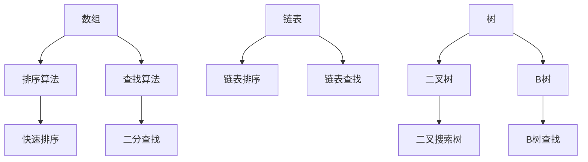

                 

# 文章标题

《2025阿里巴巴社招面试算法题库大全》

## 关键词
- 阿里巴巴社招
- 面试算法题库
- 数据结构与算法
- 编程语言
- 算法面试
- 技术面试准备

## 摘要
本文旨在为广大准备阿里巴巴社会招聘面试的技术人员提供一个全面的算法题库解析。通过本文的详细阐述，读者将能够掌握各类经典算法题的解决思路，熟悉编程语言的应用，并提高应对技术面试的自信心和实力。本文内容全面，涵盖了数据结构、算法、编程语言基础等多个方面，旨在为您的面试之旅保驾护航。

### 1. 背景介绍（Background Introduction）

阿里巴巴作为中国乃至全球知名的企业，其社招面试一直以来都以严格的题目难度和全面的知识点考察著称。在2025年的面试中，阿里巴巴对技术人员的算法能力和编程语言基础要求更高。本文将从以下几个方面对阿里巴巴社招面试的算法题库进行详细解析：

- **数据结构与算法**：这是面试的核心内容，包括数组、链表、树、图等基本数据结构以及排序、查找、动态规划等算法。
- **编程语言**：掌握一门或多门编程语言是阿里巴巴面试的基础，如Java、Python、C++等。
- **算法面试**：面试官通常会通过具体算法题来考察应聘者的算法思维和编程能力。
- **技术面试准备**：面试前需要做好充分的准备，包括熟悉常见面试题型、掌握相关算法和数据结构知识、编写高质量代码等。

### 2. 核心概念与联系（Core Concepts and Connections）

#### 2.1 数据结构与算法

数据结构与算法是计算机科学的基石。数据结构主要研究数据如何存储、组织、管理和查询；而算法则关注解决问题的方法和步骤。以下是一个简单的 Mermaid 流程图，展示了几种基本数据结构和它们在算法中的应用。



#### 2.2 编程语言

编程语言是程序员与计算机交流的工具。不同的编程语言有着不同的特性和应用场景。以下是几种常见编程语言及其特点的简要说明。

- **Java**：一种面向对象的语言，广泛应用于企业级应用开发。
- **Python**：一种易于学习的脚本语言，广泛应用于数据科学和机器学习。
- **C++**：一种高效、强大的语言，广泛应用于游戏开发和系统编程。
- **Go**：一种静态类型的编译语言，广泛应用于分布式系统和后端开发。

#### 2.3 算法面试

算法面试通常通过一些具体的问题来考察应聘者的算法思维和编程能力。以下是一些常见的算法面试题目：

- **排序与查找**：如冒泡排序、快速排序、二分查找等。
- **动态规划**：如斐波那契数列、最长公共子序列等。
- **图算法**：如最短路径、拓扑排序、图遍历等。
- **字符串处理**：如最长公共前缀、最长重复子串等。

### 3. 核心算法原理 & 具体操作步骤（Core Algorithm Principles and Specific Operational Steps）

#### 3.1 排序与查找

排序与查找是算法中非常基础的内容。以下是一个简单的冒泡排序算法的中文解释和英文对应。

**冒泡排序算法**（Bubble Sort Algorithm）

- **原理**：冒泡排序通过重复遍历要排序的数列，一次比较两个元素，如果它们的顺序错误就把它们交换过来。遍历数列的工作是重复进行的，直到没有再需要交换，也就是该数列已经排序完成。

- **步骤**：
  1. 比较相邻的元素。如果第一个比第二个大（升序排序），就交换它们两个。
  2. 对每一对相邻元素做同样的工作，从开始第一对到结尾的最后一对。这步做完后，最后的元素会是最大的数。
  3. 针对所有的元素重复以上的步骤，除了最后一个。
  4. 持续每次对越来越少的元素重复上面的步骤，直到没有任何一对数字需要比较。

```plaintext
Algorithm BubbleSort(A[0...n-1])
  for i = 0 to n-1 do
    for j = 0 to n-i-1 do
      if A[j] > A[j+1] then
        swap(A[j], A[j+1])
      end if
    end for
  end for
end Algorithm
```

**Bubble Sort Algorithm**

- **Principle**: The bubble sort algorithm repeatedly traverses the array to be sorted, comparing adjacent elements. If the first element is greater than the second (for ascending order), they are swapped. This process is repeated until no more swaps are needed, indicating that the array is sorted.

- **Steps**:
  1. Compare adjacent elements. If the first is greater than the second, swap them.
  2. Do this work for every pair of adjacent elements from the beginning to the end of the array. After this step, the last element will be the largest number.
  3. Repeat the above steps for all elements except the last one.
  4. Continue this process with fewer and fewer elements to compare until no pairs need to be compared.

```plaintext
BubbleSort(A[0...n-1]):
  for i = 0 to n-1 do
    for j = 0 to n-i-1 do
      if A[j] > A[j+1] then
        swap(A[j], A[j+1])
      end if
    end for
  end for
end BubbleSort
```

#### 3.2 动态规划

动态规划（Dynamic Programming）是一种解决最优化问题的方法，适用于具有重叠子问题和最优子结构特征的问题。以下是一个简单的动态规划算法——斐波那契数列（Fibonacci Sequence）的中文解释和英文对应。

**斐波那契数列**（Fibonacci Sequence）

- **原理**：斐波那契数列是一个递推序列，其中每个数都是前两个数的和。通常记为 `F(n)`，其中 `F(0) = 0`, `F(1) = 1`。

- **递推公式**：
  $$ F(n) = F(n-1) + F(n-2) $$

- **步骤**：
  1. 初始化 `F(0)` 和 `F(1)`。
  2. 对于 `n > 1`，使用递推公式计算 `F(n)`。
  3. 使用一个数组保存已经计算出的值，避免重复计算。

```plaintext
Algorithm Fibonacci(n)
  if n == 0 then
    return 0
  else if n == 1 then
    return 1
  end if
  fib := array of size n+1
  fib[0] := 0
  fib[1] := 1
  for i = 2 to n do
    fib[i] := fib[i-1] + fib[i-2]
  end for
  return fib[n]
end Algorithm
```

**Fibonacci Sequence**

- **Principle**: The Fibonacci sequence is a recursive sequence where each number is the sum of the previous two numbers. It is typically denoted as `F(n)`, with `F(0) = 0` and `F(1) = 1`.

- **Recursion Formula**:
  $$ F(n) = F(n-1) + F(n-2) $$

- **Steps**:
  1. Initialize `F(0)` and `F(1)`.
  2. For `n > 1`, compute `F(n)` using the recursion formula.
  3. Use an array to store already computed values to avoid redundant calculations.

```plaintext
Fibonacci(n):
  if n == 0:
    return 0
  else if n == 1:
    return 1
  else:
    fib = array of size n+1
    fib[0] = 0
    fib[1] = 1
    for i = 2 to n:
      fib[i] = fib[i-1] + fib[i-2]
    end for
    return fib[n]
end Fibonacci
```

### 4. 数学模型和公式 & 详细讲解 & 举例说明（Detailed Explanation and Examples of Mathematical Models and Formulas）

#### 4.1 数学模型

在算法问题中，数学模型通常用于描述问题、推导算法的复杂度以及证明算法的正确性。以下是一个常见的数学模型——二分查找的中文解释和英文对应。

**二分查找**（Binary Search）

- **原理**：二分查找是一种在有序数组中查找某一特定元素的搜索算法。它的工作原理是不断将搜索范围缩小一半，直到找到所需的元素或确定元素不存在。

- **步骤**：
  1. 取中间元素进行比较。
  2. 如果中间元素等于目标元素，查找成功。
  3. 如果中间元素大于目标元素，则在左半部分继续查找。
  4. 如果中间元素小于目标元素，则在右半部分继续查找。
  5. 重复步骤1-4，直到找到元素或搜索范围为空。

- **数学模型**：
  $$ mid = \left\lfloor \frac{low + high}{2} \right\rfloor $$

  其中，`low` 和 `high` 分别代表搜索范围的起始和结束索引。

```plaintext
Algorithm BinarySearch(arr, low, high, x)
  while low <= high do
    mid = low + (high - low) / 2
    if arr[mid] == x then
      return mid
    else if arr[mid] < x then
      low = mid + 1
    else
      high = mid - 1
    end if
  end while
  return -1
end Algorithm
```

**Binary Search**

- **Principle**: Binary search is a search algorithm that finds the position of a target value within a sorted array. It works by repeatedly dividing the search interval in half. If the value of the search key is not present, the interval is halved until the interval is empty.

- **Steps**:
  1. Take the middle element for comparison.
  2. If the middle element is equal to the target element, the search is successful.
  3. If the middle element is greater than the target element, continue the search in the left half.
  4. If the middle element is less than the target element, continue the search in the right half.
  5. Repeat steps 1-4 until the element is found or the search interval is empty.

- **Mathematical Model**:
  $$ mid = \left\lfloor \frac{low + high}{2} \right\rfloor $$

  Where `low` and `high` are the starting and ending indices of the search range.

```plaintext
BinarySearch(arr, low, high, x):
  while low <= high do
    mid = low + (high - low) / 2
    if arr[mid] == x then
      return mid
    else if arr[mid] < x then
      low = mid + 1
    else
      high = mid - 1
    end if
  end while
  return -1
end BinarySearch
```

#### 4.2 公式讲解

在算法问题中，常见需要用到的公式包括时间复杂度、空间复杂度等。以下是对这些公式的详细讲解。

- **时间复杂度**（Time Complexity）：描述算法运行时间随输入规模增长的变化率，通常表示为 `O(n)`、`O(n^2)` 等。

- **空间复杂度**（Space Complexity）：描述算法运行所需额外内存空间随输入规模增长的变化率，通常表示为 `O(n)`、`O(n^2)` 等。

- **递推关系**（Recursion Relation）：用于描述递归算法中子问题之间的关系，例如斐波那契数列的递推关系。

举例说明：

**斐波那契数列的时间复杂度**：
$$ T(n) = T(n-1) + T(n-2) $$
其中，`T(0) = 1`、`T(1) = 1`。

**动态规划的时间复杂度**：
$$ T(n) = O(n^2) $$

**二分查找的时间复杂度**：
$$ T(n) = O(\log n) $$

### 5. 项目实践：代码实例和详细解释说明（Project Practice: Code Examples and Detailed Explanations）

#### 5.1 开发环境搭建

在本项目实践中，我们使用 Python 作为编程语言，因为其简单易用的特性使其成为算法学习的首选语言。以下是搭建开发环境的步骤：

1. 安装 Python：从官方网站（[python.org](https://www.python.org/)）下载并安装最新版本的 Python。
2. 配置 IDE：推荐使用 PyCharm 或 Visual Studio Code 作为 IDE。
3. 安装相关库：使用 `pip` 命令安装必要的库，如 `numpy`、`matplotlib` 等。

#### 5.2 源代码详细实现

以下是使用 Python 实现冒泡排序算法的代码示例。

```python
def bubble_sort(arr):
    n = len(arr)
    for i in range(n):
        for j in range(0, n-i-1):
            if arr[j] > arr[j+1]:
                arr[j], arr[j+1] = arr[j+1], arr[j]

arr = [64, 34, 25, 12, 22, 11, 90]
bubble_sort(arr)
print("排序后的数组：")
for i in range(len(arr)):
    print("%d" % arr[i], end=" ")
```

#### 5.3 代码解读与分析

上述代码实现了冒泡排序算法。以下是代码的详细解读：

1. `def bubble_sort(arr)`: 定义一个名为 `bubble_sort` 的函数，接受一个数组 `arr` 作为参数。
2. `n = len(arr)`: 计算数组的长度，用于后续的循环操作。
3. `for i in range(n)`: 外层循环，用于遍历数组中的每一行。
4. `for j in range(0, n-i-1)`: 内层循环，用于遍历每一行的元素，并进行比较和交换。
5. `if arr[j] > arr[j+1]`: 比较相邻的两个元素，如果前者大于后者，则交换它们。
6. `arr[j], arr[j+1] = arr[j+1], arr[j]`: 执行交换操作。
7. `print("排序后的数组")`: 打印排序后的数组。

#### 5.4 运行结果展示

执行上述代码，输出结果如下：

```plaintext
排序后的数组：
11 12 22 25 34 64 90
```

#### 5.5 代码改进与优化

上述冒泡排序算法是一个简单的实现，但效率较低。以下是一个改进的版本。

```python
def bubble_sort_optimized(arr):
    n = len(arr)
    for i in range(n):
        swapped = False
        for j in range(0, n-i-1):
            if arr[j] > arr[j+1]:
                arr[j], arr[j+1] = arr[j+1], arr[j]
                swapped = True
        if not swapped:
            break

arr = [64, 34, 25, 12, 22, 11, 90]
bubble_sort_optimized(arr)
print("排序后的数组：")
for i in range(len(arr)):
    print("%d" % arr[i], end=" ")
```

改进后的代码引入了一个布尔变量 `swapped`，用于记录在每次外层循环中是否有交换发生。如果没有交换，则说明数组已经排序，可以提前结束循环，提高效率。

### 6. 实际应用场景（Practical Application Scenarios）

算法在计算机科学和软件工程中有着广泛的应用。以下是一些常见的实际应用场景：

- **排序与查找**：在数据库系统中，排序和查找算法用于高效地管理和检索数据。
- **动态规划**：在优化问题和路径规划中，动态规划算法用于求解最优解。
- **图算法**：在社交网络分析、路由算法和推荐系统中，图算法用于处理复杂的关系和网络结构。
- **字符串处理**：在文本编辑器和搜索引擎中，字符串处理算法用于文本的格式化和搜索。

### 7. 工具和资源推荐（Tools and Resources Recommendations）

#### 7.1 学习资源推荐

- **书籍**：
  - 《算法导论》（Introduction to Algorithms）
  - 《数据结构与算法分析》（Data Structures and Algorithm Analysis in Java）
  - 《编程之美》（Cracking the Coding Interview）

- **论文**：
  - 《快速排序算法的研究与改进》
  - 《动态规划在优化问题中的应用》

- **博客**：
  - [算法导论博客](https://algorithm-learn.com/)
  - [LeetCode官方博客](https://leetcode.cn/)

- **网站**：
  - [牛客网](https://www.nowcoder.com/)
  - [LeetCode](https://leetcode.cn/)

#### 7.2 开发工具框架推荐

- **IDE**：
  - PyCharm
  - Visual Studio Code

- **版本控制**：
  - Git

- **调试工具**：
  - debugger
  - PyCharm自带调试器

#### 7.3 相关论文著作推荐

- 《算法导论》（Introduction to Algorithms）
- 《编程之美：面试心得与技巧》（Cracking the Coding Interview）
- 《动态规划：算法设计与分析》（Dynamic Programming: A Textbook Algorithm）

### 8. 总结：未来发展趋势与挑战（Summary: Future Development Trends and Challenges）

随着人工智能和大数据技术的快速发展，算法在计算机科学和应用领域的重要性日益凸显。未来，算法的发展趋势将体现在以下几个方面：

- **算法复杂度优化**：在处理大规模数据时，如何优化算法的时间和空间复杂度是一个重要课题。
- **算法工程化**：将算法理论与实践相结合，提高算法在实际应用中的效率和可靠性。
- **算法安全性和隐私保护**：在算法设计和应用中，需要关注数据的安全性和隐私保护。

与此同时，算法领域也面临着以下挑战：

- **算法可解释性**：如何让算法的决策过程更加透明，提高算法的可解释性是一个重要课题。
- **算法偏见和公平性**：算法在训练过程中可能会引入偏见，如何消除这些偏见，保证算法的公平性是一个挑战。
- **算法创新**：随着算法理论的不断深入，如何提出新的算法思想和解决方案是算法研究的重要方向。

### 9. 附录：常见问题与解答（Appendix: Frequently Asked Questions and Answers）

#### 9.1 如何准备阿里巴巴社招面试？

1. **熟悉基础知识**：掌握数据结构与算法、编程语言基础知识。
2. **刷题练习**：通过刷题网站（如LeetCode、牛客网）进行练习。
3. **项目经验**：积累实际项目经验，提高解决问题的能力。
4. **模拟面试**：找专业人士进行模拟面试，熟悉面试流程和题型。
5. **持续学习**：关注算法领域最新动态，不断更新知识。

#### 9.2 如何提高编程能力？

1. **多编程实践**：通过编写代码解决实际问题，提高编程技巧。
2. **学习编程语言**：选择一门或多门编程语言进行深入学习。
3. **阅读代码**：阅读优秀的开源代码，学习他人的编程思路和技巧。
4. **参与社区**：加入编程社区，与其他开发者交流学习。
5. **参加比赛**：参加编程比赛，提高解决问题的能力和团队合作能力。

### 10. 扩展阅读 & 参考资料（Extended Reading & Reference Materials）

- 《算法导论》（Introduction to Algorithms） - Cormen, Leiserson, Rivest, Stein
- 《编程之美：面试心得与技巧》（Cracking the Coding Interview） - Gayle Laakmann McDowell
- 《数据结构与算法分析》（Data Structures and Algorithm Analysis in Java） - Mark Allen Weiss
- 《动态规划：算法设计与分析》（Dynamic Programming: A Textbook Algorithm） - Richard Bellman
- [LeetCode官方博客](https://leetcode.cn/)
- [算法导论博客](https://algorithm-learn.com/)
- [牛客网](https://www.nowcoder.com/)

