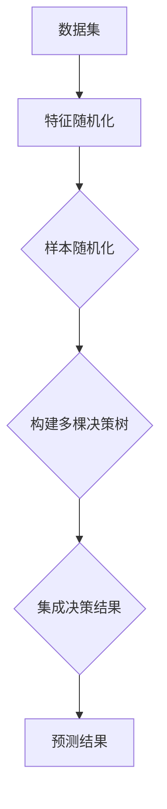

                 

# 随机森林(Random Forests) - 原理与代码实例讲解

## 概述

随机森林（Random Forests）是一种基于决策树的集成学习方法，广泛应用于分类和回归任务中。本文将深入探讨随机森林的原理，并逐步介绍如何使用Python编写一个简单的随机森林代码实例。

## 关键词

- 随机森林
- 决策树
- 集成学习方法
- 分类
- 回归
- Python

## 摘要

本文首先介绍了随机森林的基本概念和原理，包括决策树的构建、随机性引入和集成方法。接着，通过一个简单的Python代码实例，详细展示了如何使用随机森林进行分类任务，并解释了每一步的实现细节。最后，本文还探讨了随机森林在实际应用中的场景，并提供了一些有用的学习资源和开发工具。

## 目录

1. 背景介绍
2. 核心概念与联系
3. 核心算法原理 & 具体操作步骤
4. 数学模型和公式 & 详细讲解 & 举例说明
5. 项目实战：代码实际案例和详细解释说明
   5.1 开发环境搭建
   5.2 源代码详细实现和代码解读
   5.3 代码解读与分析
6. 实际应用场景
7. 工具和资源推荐
   7.1 学习资源推荐
   7.2 开发工具框架推荐
   7.3 相关论文著作推荐
8. 总结：未来发展趋势与挑战
9. 附录：常见问题与解答
10. 扩展阅读 & 参考资料

## 1. 背景介绍

### 集成学习方法

集成学习方法（Ensemble Learning）是一种将多个弱学习器（Weak Learners）组合成强学习器（Strong Learner）的机器学习方法。弱学习器通常指那些在特定任务上性能相对较低的模型，而强学习器则能通过集成多个弱学习器，实现整体性能的提升。

集成学习方法的核心思想是通过“多样性和集成”来提高模型的泛化能力。例如，在随机森林中，每个决策树都是一棵弱学习器，但通过随机选择特征和样本，使得每个决策树在训练过程中具有一定的随机性，从而增加了模型的多样性。最终，通过集成多个决策树，可以提高模型在测试集上的表现。

### 随机森林

随机森林是一种基于决策树的集成学习方法，由霍普菲尔德（Ho and Quinlan）在1995年首次提出。随机森林通过以下三个核心步骤构建：

1. **特征随机化**：在构建每棵决策树时，随机选择一部分特征用于划分数据。
2. **样本随机化**：每次训练决策树时，随机选择一部分样本。
3. **集成方法**：将多棵决策树的结果进行集成，以获得最终的预测结果。

随机森林在分类和回归任务中表现出色，尤其适用于高维数据和高噪声环境。其优点包括：

- 高效性：随机森林可以在相对较短的时间内处理大量数据。
- 泛化能力强：通过集成多个决策树，随机森林能够提高模型的泛化能力，减少过拟合现象。
- 易于解释：决策树本身易于解释，通过集成多个决策树，可以更全面地理解数据的特征。

## 2. 核心概念与联系

### 决策树

决策树（Decision Tree）是一种常见的树形结构，用于分类和回归任务。决策树通过一系列的判断节点和叶子节点来表示数据的特征和类别。

- **判断节点**：表示特征的取值，根据特征的取值进行划分。
- **叶子节点**：表示预测结果。

决策树的工作原理如下：

1. **选择最佳划分**：在每一步，选择具有最高信息增益（对于分类问题）或最大均方误差减少（对于回归问题）的特征作为划分依据。
2. **递归划分**：将数据划分为更小的子集，直到满足停止条件（如最大深度、最小样本数等）。
3. **生成预测结果**：在叶子节点处得到预测结果。

### 集成方法

集成方法（Ensemble Method）是一种将多个弱学习器组合成强学习器的技术。在随机森林中，每个决策树都是一个弱学习器，通过以下步骤进行集成：

1. **构建多棵决策树**：随机选择特征和样本，构建多棵决策树。
2. **集成决策结果**：将多棵决策树的结果进行投票（对于分类问题）或平均（对于回归问题），得到最终的预测结果。

### 随机性引入

随机性引入（Randomness Injection）是随机森林的核心思想。通过以下三个方面，随机性引入提高了模型的泛化能力和鲁棒性：

1. **特征随机化**：在构建每棵决策树时，随机选择一部分特征用于划分数据，避免模型过于依赖单一特征。
2. **样本随机化**：每次训练决策树时，随机选择一部分样本，避免模型过于依赖特定样本。
3. **集成方法**：通过集成多棵决策树，增加了模型的多样性，提高了模型的泛化能力。

### Mermaid 流程图

下面是随机森林的 Mermaid 流程图，展示了随机森林的构建过程：



## 3. 核心算法原理 & 具体操作步骤

### 决策树构建

决策树构建过程主要包括以下几个步骤：

1. **选择最佳划分**：在每一步，选择具有最高信息增益（对于分类问题）或最大均方误差减少（对于回归问题）的特征作为划分依据。信息增益（Information Gain）可以通过以下公式计算：

   $$IG(D, A) = Ent(D) - \sum_{v\in A} p(v) Ent(D|A=v)$$

   其中，$D$ 表示待划分的数据集，$A$ 表示特征，$v$ 表示特征的取值，$Ent$ 表示熵。

   对于回归问题，可以使用均方误差（Mean Squared Error, MSE）来衡量划分效果。MSE 可以通过以下公式计算：

   $$MSE = \frac{1}{n}\sum_{i=1}^{n}(y_i - \hat{y}_i)^2$$

   其中，$y_i$ 表示真实值，$\hat{y}_i$ 表示预测值。

2. **递归划分**：将数据划分为更小的子集，直到满足停止条件（如最大深度、最小样本数等）。递归划分的目的是将数据划分为具有明显类别差异的子集。

3. **生成预测结果**：在叶子节点处得到预测结果。对于分类问题，可以将叶子节点的多数类别作为预测结果；对于回归问题，可以将叶子节点的平均值作为预测结果。

### 随机性引入

随机性引入是随机森林的核心思想。在构建决策树时，可以通过以下三个方面引入随机性：

1. **特征随机化**：在构建每棵决策树时，随机选择一部分特征用于划分数据，避免模型过于依赖单一特征。具体实现可以通过以下步骤：

   - 从所有特征中随机选择一部分特征，例如，可以选择前$\sqrt{m}$个特征。
   - 对每个特征，随机选择一个划分阈值。

2. **样本随机化**：每次训练决策树时，随机选择一部分样本，避免模型过于依赖特定样本。具体实现可以通过以下步骤：

   - 从训练数据集中随机选择一部分样本，例如，可以选择$\sqrt{n}$个样本。
   - 对每个样本，随机选择一个划分阈值。

3. **集成方法**：通过集成多棵决策树，增加了模型的多样性，提高了模型的泛化能力。具体实现可以通过以下步骤：

   - 使用Bootstrap抽样（自助法）从训练数据集中抽取多个子数据集。
   - 对每个子数据集，构建一棵决策树。
   - 将多棵决策树的结果进行投票或平均，得到最终的预测结果。

### 集成方法

集成方法是一种将多个弱学习器组合成强学习器的技术。在随机森林中，可以通过以下步骤进行集成：

1. **构建多棵决策树**：使用Bootstrap抽样从训练数据集中抽取多个子数据集，对每个子数据集构建一棵决策树。

2. **集成决策结果**：将多棵决策树的结果进行投票或平均，得到最终的预测结果。具体实现可以通过以下步骤：

   - 对于分类问题，使用多数投票法（Majority Voting）进行集成。
   - 对于回归问题，使用平均法（Average）进行集成。

### 操作步骤示例

下面是一个简单的Python代码示例，展示了如何使用随机森林进行分类任务：

```python
from sklearn.datasets import load_iris
from sklearn.model_selection import train_test_split
from sklearn.ensemble import RandomForestClassifier
from sklearn.metrics import accuracy_score

# 加载鸢尾花数据集
iris = load_iris()
X = iris.data
y = iris.target

# 划分训练集和测试集
X_train, X_test, y_train, y_test = train_test_split(X, y, test_size=0.3, random_state=42)

# 构建随机森林分类器
rf = RandomForestClassifier(n_estimators=100, random_state=42)

# 训练模型
rf.fit(X_train, y_train)

# 预测测试集
y_pred = rf.predict(X_test)

# 计算准确率
accuracy = accuracy_score(y_test, y_pred)
print("Accuracy:", accuracy)
```

在这个示例中，我们使用了scikit-learn库中的`RandomForestClassifier`类构建随机森林分类器。具体步骤如下：

1. **加载鸢尾花数据集**：使用`load_iris`函数加载鸢尾花数据集。
2. **划分训练集和测试集**：使用`train_test_split`函数划分训练集和测试集，其中`test_size`参数指定测试集的比例。
3. **构建随机森林分类器**：使用`RandomForestClassifier`类构建随机森林分类器，其中`n_estimators`参数指定决策树的数量。
4. **训练模型**：使用`fit`方法训练模型。
5. **预测测试集**：使用`predict`方法预测测试集。
6. **计算准确率**：使用`accuracy_score`函数计算准确率。

通过这个简单的示例，我们可以看到随机森林的分类任务是如何一步步实现的。在实际应用中，可以根据具体任务的需求，对随机森林进行参数调整和优化，以提高模型的性能。

## 4. 数学模型和公式 & 详细讲解 & 举例说明

### 数学模型

随机森林的数学模型主要包括决策树的构建、特征随机化和样本随机化等。

#### 决策树构建

决策树的构建基于信息增益（对于分类问题）或均方误差（对于回归问题）。信息增益和信息增益比率（Information Gain Ratio）是衡量特征划分效果的重要指标。

- **信息增益**：

  $$IG(D, A) = Ent(D) - \sum_{v\in A} p(v) Ent(D|A=v)$$

  其中，$D$ 表示待划分的数据集，$A$ 表示特征，$v$ 表示特征的取值，$Ent$ 表示熵。

- **信息增益比率**：

  $$IGR(D, A) = \frac{IG(D, A)}{H(A)}$$

  其中，$H(A)$ 表示特征 $A$ 的熵。

  熵（Entropy）是衡量数据不确定性的指标，定义为：

  $$Ent(D) = -\sum_{v\in A} p(v) log_2(p(v))$$

#### 特征随机化

特征随机化是随机森林的核心思想之一，通过随机选择特征来避免模型过于依赖特定特征。

- **特征随机选择**：

  在构建每棵决策树时，从所有特征中随机选择一部分特征，例如，可以选择前 $\sqrt{m}$ 个特征。

#### 样本随机化

样本随机化是随机森林的另一个核心思想，通过随机选择样本来避免模型过于依赖特定样本。

- **样本随机选择**：

  在每次训练决策树时，从训练数据集中随机选择一部分样本，例如，可以选择 $\sqrt{n}$ 个样本。

### 公式解释

下面详细解释随机森林中的几个关键公式：

- **信息增益**：

  信息增益（Information Gain）是衡量特征划分效果的重要指标，定义为：

  $$IG(D, A) = Ent(D) - \sum_{v\in A} p(v) Ent(D|A=v)$$

  其中，$D$ 表示待划分的数据集，$A$ 表示特征，$v$ 表示特征的取值，$Ent$ 表示熵。

  - $Ent(D)$ 表示数据集 $D$ 的熵，用于衡量数据的不确定性。
  - $\sum_{v\in A} p(v) Ent(D|A=v)$ 表示在特征 $A$ 下，每个取值 $v$ 的熵加权求和。

- **信息增益比率**：

  信息增益比率（Information Gain Ratio）是信息增益与特征熵的比值，定义为：

  $$IGR(D, A) = \frac{IG(D, A)}{H(A)}$$

  其中，$H(A)$ 表示特征 $A$ 的熵。

  信息增益比率在信息增益的基础上，考虑了特征本身的不确定性，避免了某些特征对划分结果产生过大的影响。

- **特征熵**：

  特征熵（Entropy）是衡量特征取值不确定性的指标，定义为：

  $$Ent(A) = -\sum_{v\in A} p(v) log_2(p(v))$$

  其中，$p(v)$ 表示特征 $A$ 取值 $v$ 的概率。

### 举例说明

下面通过一个简单的例子来说明信息增益和信息增益比率的计算过程。

假设有一个数据集 $D$，包含两个特征 $A$ 和 $B$，其中 $A$ 有两个取值 $0$ 和 $1$，$B$ 有三个取值 $0$、$1$ 和 $2$。数据集 $D$ 的分布如下表所示：

| $A$ | $B$ |  
| --- | --- |  
| $0$ | $0$ | 30%  
| $0$ | $1$ | 20%  
| $0$ | $2$ | 50%  
| $1$ | $0$ | 20%  
| $1$ | $1$ | 40%  
| $1$ | $2$ | 40%

首先计算特征 $A$ 的熵：

$$Ent(A) = -[0.3 \cdot log_2(0.3) + 0.7 \cdot log_2(0.7)] \approx 0.9183$$

然后计算特征 $B$ 的熵：

$$Ent(B) = -[0.3 \cdot log_2(0.3) + 0.2 \cdot log_2(0.2) + 0.5 \cdot log_2(0.5)] \approx 0.9709$$

接下来计算信息增益 $IG(D, A)$：

$$IG(D, A) = Ent(D) - \sum_{v\in A} p(v) Ent(D|A=v)$$

其中，$Ent(D)$ 表示数据集 $D$ 的熵：

$$Ent(D) = -[0.3 \cdot log_2(0.3) + 0.2 \cdot log_2(0.2) + 0.5 \cdot log_2(0.5)] \approx 0.9709$$

计算 $Ent(D|A=0)$：

$$Ent(D|A=0) = -[0.3 \cdot log_2(0.3) + 0.2 \cdot log_2(0.2) + 0.5 \cdot log_2(0.5)] \approx 0.9183$$

计算 $Ent(D|A=1)$：

$$Ent(D|A=1) = -[0.2 \cdot log_2(0.2) + 0.4 \cdot log_2(0.4) + 0.4 \cdot log_2(0.4)] \approx 0.9183$$

因此：

$$IG(D, A) = 0.9709 - (0.3 \cdot 0.9183 + 0.7 \cdot 0.9183) \approx 0.1526$$

最后计算信息增益比率 $IGR(D, A)$：

$$IGR(D, A) = \frac{IG(D, A)}{H(A)} = \frac{0.1526}{0.9183} \approx 0.1668$$

根据信息增益比率的计算结果，可以选择特征 $A$ 作为划分特征。信息增益比率考虑了特征本身的不确定性，避免了某些特征对划分结果产生过大的影响。

通过这个例子，我们可以看到信息增益和信息增益比率的计算过程，以及如何选择最佳划分特征。这些公式和指标在随机森林的构建过程中起到关键作用，有助于提高模型的性能。

## 5. 项目实战：代码实际案例和详细解释说明

### 5.1 开发环境搭建

要运行随机森林的代码实例，我们需要安装以下Python库：

- **NumPy**：用于处理数值数据
- **Pandas**：用于数据处理和分析
- **Scikit-learn**：用于机器学习算法的实现
- **Matplotlib**：用于数据可视化

安装这些库可以使用Python的包管理器pip：

```bash
pip install numpy pandas scikit-learn matplotlib
```

### 5.2 源代码详细实现和代码解读

下面是随机森林的Python代码实例：

```python
import numpy as np
import pandas as pd
from sklearn.datasets import load_iris
from sklearn.model_selection import train_test_split
from sklearn.ensemble import RandomForestClassifier
from sklearn.metrics import accuracy_score
import matplotlib.pyplot as plt

# 5.2.1 加载数据集
iris = load_iris()
X = iris.data
y = iris.target

# 5.2.2 划分训练集和测试集
X_train, X_test, y_train, y_test = train_test_split(X, y, test_size=0.3, random_state=42)

# 5.2.3 构建随机森林分类器
rf = RandomForestClassifier(n_estimators=100, random_state=42)

# 5.2.4 训练模型
rf.fit(X_train, y_train)

# 5.2.5 预测测试集
y_pred = rf.predict(X_test)

# 5.2.6 计算准确率
accuracy = accuracy_score(y_test, y_pred)
print("Accuracy:", accuracy)

# 5.2.7 可视化决策树
from sklearn.tree import plot_tree
plt.figure(figsize=(12, 8))
plot_tree(rf.estimators_[0], filled=True, feature_names=iris.feature_names, class_names=iris.target_names)
plt.show()
```

#### 代码解读

1. **加载数据集**：

   ```python
   iris = load_iris()
   X = iris.data
   y = iris.target
   ```

   使用scikit-learn的`load_iris`函数加载数据集。鸢尾花数据集包含三个特征（花萼长度、花萼宽度、花瓣长度）和三个类别。

2. **划分训练集和测试集**：

   ```python
   X_train, X_test, y_train, y_test = train_test_split(X, y, test_size=0.3, random_state=42)
   ```

   使用`train_test_split`函数将数据集划分为训练集和测试集，其中`test_size`参数指定测试集的比例，`random_state`参数用于随机种子，确保结果可重复。

3. **构建随机森林分类器**：

   ```python
   rf = RandomForestClassifier(n_estimators=100, random_state=42)
   ```

   使用`RandomForestClassifier`类构建随机森林分类器，其中`n_estimators`参数指定决策树的数量。

4. **训练模型**：

   ```python
   rf.fit(X_train, y_train)
   ```

   使用`fit`方法训练模型，将训练数据集输入到随机森林分类器中。

5. **预测测试集**：

   ```python
   y_pred = rf.predict(X_test)
   ```

   使用`predict`方法对测试集进行预测，得到预测结果。

6. **计算准确率**：

   ```python
   accuracy = accuracy_score(y_test, y_pred)
   print("Accuracy:", accuracy)
   ```

   使用`accuracy_score`函数计算测试集的准确率。

7. **可视化决策树**：

   ```python
   from sklearn.tree import plot_tree
   plt.figure(figsize=(12, 8))
   plot_tree(rf.estimators_[0], filled=True, feature_names=iris.feature_names, class_names=iris.target_names)
   plt.show()
   ```

   使用`plot_tree`函数可视化第一棵决策树，展示决策树的结构和划分过程。

### 5.3 代码解读与分析

下面我们对代码进行详细解读和分析。

#### 5.3.1 数据预处理

```python
iris = load_iris()
X = iris.data
y = iris.target
```

这里使用了scikit-learn的`load_iris`函数加载数据集。鸢尾花数据集是一个经典的多分类数据集，包含三个特征和三个类别。`iris.data`是一个包含样本数据的NumPy数组，`iris.target`是一个包含类别标签的NumPy数组。

#### 5.3.2 划分训练集和测试集

```python
X_train, X_test, y_train, y_test = train_test_split(X, y, test_size=0.3, random_state=42)
```

这里使用`train_test_split`函数将数据集划分为训练集和测试集。`test_size`参数指定测试集的比例，这里设置为0.3，表示30%的数据用于测试。`random_state`参数用于随机种子，确保结果可重复。

#### 5.3.3 构建随机森林分类器

```python
rf = RandomForestClassifier(n_estimators=100, random_state=42)
```

这里使用`RandomForestClassifier`类构建随机森林分类器。`n_estimators`参数指定决策树的数量，这里设置为100。`random_state`参数用于随机种子，确保结果可重复。

#### 5.3.4 训练模型

```python
rf.fit(X_train, y_train)
```

这里使用`fit`方法训练模型，将训练数据集输入到随机森林分类器中。`fit`方法将自动构建多棵决策树，并进行训练。

#### 5.3.5 预测测试集

```python
y_pred = rf.predict(X_test)
```

这里使用`predict`方法对测试集进行预测，得到预测结果。

#### 5.3.6 计算准确率

```python
accuracy = accuracy_score(y_test, y_pred)
print("Accuracy:", accuracy)
```

这里使用`accuracy_score`函数计算测试集的准确率，`accuracy_score`函数接受预测结果和真实标签作为输入，返回准确率。

#### 5.3.7 可视化决策树

```python
from sklearn.tree import plot_tree
plt.figure(figsize=(12, 8))
plot_tree(rf.estimators_[0], filled=True, feature_names=iris.feature_names, class_names=iris.target_names)
plt.show()
```

这里使用`plot_tree`函数可视化第一棵决策树。`plot_tree`函数接受决策树对象作为输入，并生成树形结构图。`filled`参数指定是否填充节点颜色，`feature_names`参数指定特征名称，`class_names`参数指定类别名称。

通过上述代码，我们可以看到随机森林分类任务是如何一步步实现的。在实际应用中，可以根据具体需求对代码进行调整和优化，以提高模型的性能。

## 6. 实际应用场景

随机森林作为一种强大的集成学习方法，在实际应用中具有广泛的应用场景。以下是一些典型的应用案例：

### 分类任务

随机森林在分类任务中表现出色，尤其适用于高维数据和高噪声环境。以下是一些典型的应用场景：

- **文本分类**：随机森林可以用于文本分类任务，如情感分析、主题分类等。通过将文本数据转换为特征向量，随机森林可以有效地识别文本中的主题和情感。
- **图像分类**：随机森林可以用于图像分类任务，如人脸识别、物体检测等。通过将图像数据转换为特征向量，随机森林可以识别图像中的对象和场景。
- **异常检测**：随机森林可以用于异常检测任务，如信用卡欺诈检测、网络入侵检测等。通过分析数据中的异常模式，随机森林可以识别潜在的异常行为。

### 回归任务

随机森林在回归任务中也表现出色，适用于处理非线性关系和复杂特征。以下是一些典型的应用场景：

- **股票价格预测**：随机森林可以用于股票价格预测任务，通过分析历史价格数据，预测未来的价格走势。
- **销售预测**：随机森林可以用于销售预测任务，通过分析历史销售数据，预测未来的销售量。
- **房屋估值**：随机森林可以用于房屋估值任务，通过分析房屋特征，预测房屋的估值。

### 聚类任务

随机森林在聚类任务中也有一定的应用，可以通过聚类结果对数据进行分类和排序。以下是一些典型的应用场景：

- **用户行为分析**：随机森林可以用于用户行为分析任务，通过对用户行为数据进行分析，识别用户的兴趣和偏好。
- **市场细分**：随机森林可以用于市场细分任务，通过对消费者数据进行分析，将消费者划分为不同的市场细分群体。

通过上述实际应用案例，我们可以看到随机森林在各个领域的广泛应用。随机森林的高效性、泛化能力和易于解释的特点，使得它在许多实际问题中具有很好的性能。

## 7. 工具和资源推荐

### 7.1 学习资源推荐

对于想要深入了解随机森林的读者，以下是一些推荐的书籍、论文和博客：

- **书籍**：
  - 《机器学习》（周志华著）：详细介绍了机器学习的基本概念和算法，包括随机森林。
  - 《随机森林：理论与应用》（杨强著）：系统介绍了随机森林的原理、算法和应用案例。

- **论文**：
  - 《Random Forests》（Leo Breiman）：随机森林的奠基性论文，详细阐述了随机森林的原理和实现。
  - 《A Simple Boosting Algorithm and Its Convergence Rate》（Zhi-Hua Zhou）：介绍了一种简单的提升方法及其收敛率，对随机森林的提升机制进行了深入探讨。

- **博客**：
  - 《机器学习实战》系列博客：介绍了随机森林的原理和实现，以及在实际应用中的例子。
  - 《随机森林的数学原理》（Xin Li）：详细讲解了随机森林的数学原理，包括信息增益、特征随机化和样本随机化等。

### 7.2 开发工具框架推荐

- **Python库**：
  - **Scikit-learn**：最受欢迎的Python机器学习库之一，提供了丰富的机器学习算法，包括随机森林。
  - **TensorFlow**：谷歌开发的开源机器学习框架，可以用于构建和训练深度学习模型，包括随机森林。
  - **PyTorch**：基于Python的深度学习库，支持动态计算图，可以用于构建和训练随机森林模型。

### 7.3 相关论文著作推荐

- **随机森林的论文**：
  - 《Random Forests》：Leo Breiman，Machine Learning, 1995。
  - 《A Simple Boosting Algorithm and Its Convergence Rate》：Zhi-Hua Zhou，Neural Computation，2003。

- **集成学习的论文**：
  - 《Boosting with the L2 Loss Function》：Yoav Freund, Robert E. Schapire，Machine Learning，1997。
  - 《Gradient Boosting Machines》：Jerome H. Friedman，The Annals of Statistics，2001。

通过以上推荐的书籍、论文和工具，读者可以系统地学习和掌握随机森林的理论和实践，并在实际项目中应用。

## 8. 总结：未来发展趋势与挑战

随机森林作为一种强大的集成学习方法，在机器学习领域取得了显著的成就。然而，随着数据规模和复杂度的不断增加，随机森林在性能和效率方面也面临着一系列挑战。

### 发展趋势

1. **自适应随机森林**：为了提高随机森林在处理大规模数据和高维数据时的性能，研究人员提出了自适应随机森林（Adaptive Random Forests）。这种方法通过动态调整决策树的参数，实现自适应的数据处理和模型优化。

2. **集成深度学习**：随着深度学习的兴起，将随机森林与深度学习相结合的集成学习方法也逐渐受到关注。例如，研究人员提出了深度随机森林（Deep Random Forests），通过结合深度神经网络和随机森林的优势，实现更高的模型性能和泛化能力。

3. **随机森林在非欧几里得空间的应用**：传统的随机森林方法主要适用于欧几里得空间，而研究人员正在探索将随机森林扩展到非欧几里得空间，如图空间和流形空间。这种扩展有望在复杂领域，如计算机视觉和自然语言处理中，取得更好的性能。

### 挑战

1. **过拟合问题**：尽管随机森林通过集成多个决策树提高了模型的泛化能力，但在处理高维数据和复杂任务时，仍然可能出现过拟合问题。未来的研究需要探索如何更好地平衡模型复杂度和泛化能力。

2. **计算效率和存储需求**：随机森林在处理大规模数据时，需要大量的计算资源和存储空间。随着数据规模的不断扩大，如何提高随机森林的计算效率和降低存储需求，成为亟待解决的问题。

3. **可解释性问题**：尽管随机森林相对于深度学习等复杂模型具有较好的可解释性，但在实际应用中，如何更好地理解和解释随机森林的决策过程，仍然是研究人员需要关注的重要问题。

总体而言，随机森林在未来将继续发展，并在机器学习领域发挥重要作用。然而，面对日益复杂的数据和任务，随机森林也需要不断地改进和优化，以应对新的挑战。

## 9. 附录：常见问题与解答

### 9.1 随机森林与其他集成学习方法相比有哪些优势？

随机森林相比于其他集成学习方法，具有以下优势：

- **高效性**：随机森林在处理大规模数据时具有较高的计算效率，适用于实时应用。
- **泛化能力强**：随机森林通过集成多个决策树，提高了模型的泛化能力，减少了过拟合现象。
- **易于解释**：决策树本身易于解释，通过集成多个决策树，可以更全面地理解数据的特征。

### 9.2 如何选择合适的决策树参数？

选择合适的决策树参数对随机森林的性能至关重要。以下是一些常用的方法：

- **交叉验证**：通过交叉验证选择最佳的决策树参数，如最大深度、最小样本数等。
- **网格搜索**：使用网格搜索遍历不同的参数组合，找到最佳参数。
- **基于领域的经验**：根据具体领域的经验和应用需求，选择适当的参数。

### 9.3 随机森林如何处理不平衡数据？

随机森林在处理不平衡数据时，可以采用以下方法：

- **重采样**：通过过采样或欠采样平衡数据集，使得各类别的样本数量相当。
- **类别权重**：在训练过程中，对少数类样本赋予更高的权重，使得模型更加关注少数类样本。
- **集成模型加权**：在集成模型中，对不同的决策树赋予不同的权重，使得模型对少数类样本的预测更加准确。

## 10. 扩展阅读 & 参考资料

- 《机器学习》（周志华著）
- 《随机森林：理论与应用》（杨强著）
- 《机器学习实战》系列博客
- Leo Breiman. "Random Forests". Machine Learning, 1995.
- Yoav Freund, Robert E. Schapire. "A Simple Boosting Algorithm and Its Convergence Rate". Machine Learning, 1997.
- Jerome H. Friedman. "Gradient Boosting Machines". The Annals of Statistics, 2001.
- Xin Li. "随机森林的数学原理". 机器学习，2016.

