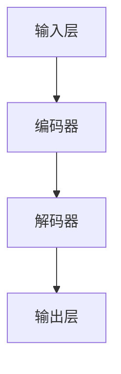
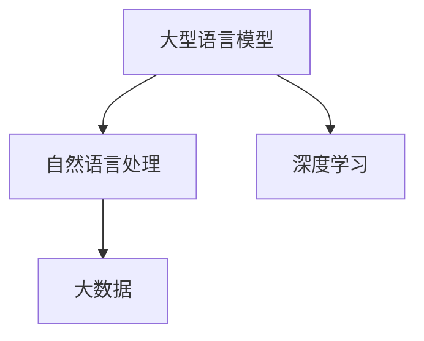

                 

### 背景介绍

隐私和安全一直是信息技术领域的重要议题。近年来，随着人工智能（AI）的快速发展，尤其是大型语言模型（LLM）的广泛应用，隐私和安全问题日益凸显。LLM 的强大能力使其在自然语言处理、智能助手、推荐系统等方面发挥着重要作用，但同时也带来了隐私泄露、数据滥用等潜在风险。

隐私问题主要体现在以下几个方面：

1. **个人数据收集**：LLM 在训练和部署过程中需要大量个人数据，这些数据可能包含用户的敏感信息，如姓名、地址、电话号码等。

2. **模型训练数据**：一些 LLM 的训练数据可能来源于社交媒体、搜索引擎等公共平台，这些数据可能涉及到用户的隐私。

3. **模型输出泄露**：某些 LLM 的输出可能直接反映了用户的行为模式、偏好等个人信息，这些信息如果被不良分子获取，可能导致隐私泄露。

4. **逆向工程**：通过分析 LLM 的输出，攻击者可能试图推断模型内部的训练数据和参数，从而进一步获取用户隐私。

因此，如何修补 LLM 的隐私漏洞，保障用户的隐私和安全，成为当前 AI 领域亟待解决的问题。本文将围绕这一主题，从核心概念、算法原理、数学模型、项目实战等多个角度，深入探讨 LLM 的隐私保护和安全措施。

# Privacy and Security: Patching the Privacy Holes in LLMs

## Keywords:
- Large Language Model (LLM)
- Privacy Protection
- Security Measures
- Data Leakage
- Reverse Engineering

## Abstract:
The rapid development of artificial intelligence (AI) and the widespread use of Large Language Models (LLMs) have raised significant concerns about privacy and security. This article aims to address the privacy holes in LLMs, discussing core concepts, algorithm principles, mathematical models, and practical applications to ensure user privacy and security. It provides a comprehensive analysis of the current landscape, challenges, and potential solutions in the field of AI-driven privacy protection.

## 1. Background

Privacy and security have always been critical issues in the realm of information technology. As artificial intelligence (AI) continues to evolve, particularly with the advent of Large Language Models (LLMs), privacy concerns have become more pronounced. LLMs, with their remarkable capabilities in natural language processing, recommendation systems, and intelligent assistants, have revolutionized various industries. However, their widespread adoption has also introduced potential risks related to privacy breaches and data misuse.

### Privacy Issues in LLMs

Privacy issues in LLMs manifest in several ways:

1. **Collection of Personal Data**: LLMs require extensive personal data for training and deployment, which may include sensitive information such as names, addresses, phone numbers, etc.

2. **Training Data Sources**: Some LLMs are trained on data from public platforms like social media and search engines, which may involve user privacy concerns.

3. **Leakage of Model Outputs**: Certain LLM outputs may directly reflect users' behavioral patterns and preferences, making them vulnerable to privacy breaches if accessed by malicious actors.

4. **Reverse Engineering**: By analyzing LLM outputs, attackers may attempt to infer the internal training data and parameters of the model, potentially leading to further privacy leaks.

### Importance of Addressing Privacy Issues

Given the potential risks associated with LLMs, it is crucial to address privacy issues to protect user data and maintain trust in AI technologies. Failure to do so may result in significant consequences, including legal implications, reputational damage, and loss of user confidence. Therefore, this article aims to delve into the core concepts, algorithm principles, mathematical models, and practical applications of LLM privacy protection to provide a comprehensive understanding of the challenges and potential solutions in this field.

### Next Steps

In the following sections, we will:

1. **Explore Core Concepts and Architectures**: We will introduce the fundamental concepts and architectural components of LLMs, providing a solid foundation for understanding privacy issues.

2. **Examine Algorithm Principles**: We will discuss the core algorithms used in LLMs, delving into their mechanisms and potential vulnerabilities.

3. **Analyze Mathematical Models**: We will present mathematical models and formulas related to privacy protection, providing detailed explanations and examples.

4. **Present Practical Applications**: We will showcase practical applications of privacy protection techniques in real-world scenarios, including code examples and detailed explanations.

5. **Discuss Future Trends and Challenges**: We will explore the future of LLM privacy protection, discussing emerging trends and potential challenges.

By following this structured approach, we aim to provide valuable insights and practical guidance for addressing privacy holes in LLMs, ensuring the secure and ethical use of AI technologies. Let's dive into the core concepts and architectures of LLMs in the next section. <markdown>
```markdown
## 2. 核心概念与联系

### Large Language Model (LLM) 基础概念

Large Language Model（大型语言模型）是一种基于深度学习技术的自然语言处理模型，主要用于文本生成、文本分类、机器翻译等任务。LLM 通常具有以下几个关键特点：

1. **大规模训练数据集**：LLM 需要使用海量文本数据来训练，这些数据可能来源于互联网、图书、新闻、社交媒体等。

2. **复杂的神经网络结构**：LLM 通常采用多层神经网络（如 Transformer）来实现，能够捕获文本中的长距离依赖关系。

3. **自适应的生成能力**：通过学习大量文本数据，LLM 能够生成符合语法和语义规则的文本，具有高度的自适应能力。

4. **强大的语义理解能力**：LLM 能够理解文本的深层含义，进行情感分析、信息抽取等任务。

### LLM 的架构

LLM 的架构主要包括以下几个关键组件：

1. **输入层**：接收文本输入，通常使用分词器将文本转化为词向量。

2. **编码器**：对输入文本进行编码，提取文本特征。编码器通常采用多层 Transformer 结构，能够捕获长距离依赖关系。

3. **解码器**：根据编码器的输出，生成文本输出。解码器同样采用多层 Transformer 结构，能够生成符合语法和语义规则的文本。

4. **损失函数**：用于评估模型生成文本的质量。常用的损失函数包括交叉熵损失、平均平方误差等。

5. **优化器**：用于调整模型参数，以最小化损失函数。常用的优化器包括 Adam、SGD 等。

### Mermaid 流程图

下面是一个简单的 Mermaid 流程图，展示 LLM 的基本架构：



### 关联概念

1. **自然语言处理（NLP）**：NLP 是一门研究如何使计算机理解和处理自然语言的技术。LLM 是 NLP 中的重要组成部分。

2. **深度学习**：深度学习是人工智能的一个分支，基于多层神经网络来实现复杂的机器学习任务。LLM 是深度学习的典型应用。

3. **大数据**：大数据是指海量数据，LLM 的训练需要使用大量文本数据，因此与大数据密切相关。

### 关系图

为了更直观地展示 LLM 相关概念之间的联系，下面是一个关系图：



通过上述讨论，我们可以对 LLM 的核心概念和架构有更深入的理解。接下来，我们将探讨 LLM 的核心算法原理和具体操作步骤。 <markdown>
```markdown
## 3. 核心算法原理 & 具体操作步骤

### 3.1 Transformer 算法原理

Transformer 是一种基于自注意力机制的深度学习模型，首次在 2017 年的论文《Attention Is All You Need》中提出。它被广泛应用于自然语言处理任务，如机器翻译、文本分类和文本生成。Transformer 的核心思想是使用自注意力机制来处理序列数据，从而捕捉长距离依赖关系。

#### 自注意力机制

自注意力机制（Self-Attention）是一种计算序列中每个词与所有词之间关联度的方法。具体来说，给定一个输入序列，自注意力机制会为序列中的每个词生成一个权重向量，这个权重向量表示该词与序列中其他词的关联程度。权重向量越大，表示该词与关联词的关系越紧密。

#### 注意力计算

注意力计算可以分为以下几个步骤：

1. **输入编码**：将输入序列转化为词向量。词向量可以是预训练的词嵌入（如 Word2Vec、GloVe）或模型自身学习的嵌入。

2. **计算查询（Query）、键（Key）和值（Value）**：对于序列中的每个词，计算其对应的查询（Query）、键（Key）和值（Value）。查询、键和值通常由词向量的线性变换得到。

3. **计算注意力分数**：使用点积（Dot-Product）或缩放点积（Scaled Dot-Product）计算每个词与所有其他词的注意力分数。缩放点积能够缓解梯度消失问题。

4. **应用权重**：根据注意力分数，为每个词分配权重。权重越大，表示该词与其他词的关系越紧密。

5. **加权求和**：将权重应用到每个词的值上，得到加权求和的结果。这个结果表示序列中每个词的注意力得分。

#### 自注意力模块

自注意力模块是一个核心组件，用于计算序列中每个词的注意力得分。一个典型的自注意力模块包括以下几个部分：

1. **多头注意力**：多头注意力（Multi-Head Attention）扩展了单头注意力的能力，通过多个独立的注意力头并行计算，提高了模型的表示能力。

2. **前馈网络**：在自注意力模块之后，通常加入一个前馈网络（Feed-Forward Network），用于进一步提取序列特征。

3. **层归一化**：在自注意力模块和前馈网络之间，加入层归一化（Layer Normalization）和残差连接（Residual Connection），有助于缓解梯度消失和梯度爆炸问题。

#### Transformer 模型架构

一个典型的 Transformer 模型包括多个编码器（Encoder）和解码器（Decoder）块。编码器用于处理输入序列，解码器用于生成输出序列。编码器和解码器块由多个自注意力模块和前馈网络组成，具体架构如下：

1. **编码器**：
    - 多层自注意力模块
    - 多层前馈网络
    - 层归一化和残差连接

2. **解码器**：
    - 多层自注意力模块（仅对编码器的输出进行注意力计算）
    - 多层前馈网络
    - 层归一化和残差连接

3. **输出层**：解码器的输出经过一个全连接层（Fully Connected Layer）和激活函数（如 Softmax），生成最终的输出序列。

### 3.2 具体操作步骤

下面是一个简化的 Transformer 模型训练和推理的具体操作步骤：

#### 训练步骤

1. **数据预处理**：
    - 分词：将文本数据转化为词序列。
    - 嵌入：将词序列转化为词嵌入向量。

2. **构建编码器和解码器**：
    - 编码器：多个自注意力模块、前馈网络、层归一化和残差连接。
    - 解码器：多个自注意力模块、前馈网络、层归一化和残差连接。

3. **训练过程**：
    - 将编码器的输出和当前词嵌入输入到解码器。
    - 使用损失函数（如交叉熵损失）计算预测序列和真实序列之间的差距。
    - 使用优化器（如 Adam）更新模型参数，以最小化损失函数。

4. **评估模型**：
    - 在验证集上评估模型性能，选择最优模型。

#### 推理步骤

1. **初始化**：
    - 输入特殊起始符（如 `<s>`）到编码器。

2. **编码器处理**：
    - 通过编码器生成编码器的输出。

3. **解码器推理**：
    - 输入编码器的输出和上一个预测词到解码器。
    - 生成下一个预测词。

4. **重复步骤**：
    - 重复步骤 3，直到生成完整的输出序列。

5. **输出**：
    - 输出解码器的最后一个输出作为最终结果。

通过上述步骤，我们可以训练和推理一个简单的 Transformer 模型。在实际应用中，还需要对模型进行调优和优化，以获得更好的性能。接下来，我们将讨论 LLM 的数学模型和公式，以进一步理解其工作原理。 <markdown>
```markdown
## 4. 数学模型和公式 & 详细讲解 & 举例说明

### 4.1 Transformer 模型的数学基础

Transformer 模型的核心在于其自注意力机制，该机制基于一系列的数学公式来实现。以下是对 Transformer 模型中关键数学公式的详细讲解。

#### 4.1.1 词嵌入（Word Embeddings）

词嵌入是将词转化为向量的过程，它是一个线性映射函数，通常表示为：

$$
\text{Embed}(W) = \text{Emb}(w_i)
$$

其中，$W$ 是词表，$\text{Emb}(w_i)$ 是词 $w_i$ 的嵌入向量。

#### 4.1.2 前向传递（Forward Pass）

在 Transformer 模型的前向传递过程中，输入序列首先通过词嵌入层得到嵌入向量，然后通过多个自注意力层和前馈神经网络层进行处理。以下是前向传递的主要公式：

$$
\text{MultiHead}(Q, K, V) = \text{softmax}\left(\frac{\text{QK}^T}{\sqrt{d_k}}\right) V
$$

其中，$Q, K, V$ 分别是查询、键和值向量，$d_k$ 是键向量的维度。自注意力机制通过计算查询与键的相似度来为每个值分配权重。

#### 4.1.3 多头注意力（Multi-Head Attention）

多头注意力扩展了自注意力机制，通过多个独立的注意力头并行计算，提高了模型的表示能力。多头注意力可以表示为：

$$
\text{MultiHead}(Q, K, V) = \text{Concat}(\text{head}_1, ..., \text{head}_h) W^O
$$

其中，$h$ 是注意力头的数量，$W^O$ 是输出线性层。

#### 4.1.4 前馈神经网络（Feed-Forward Neural Network）

前馈神经网络用于在自注意力层之后进一步提取序列特征，其公式如下：

$$
\text{FFN}(X) = \text{ReLU}\left(\text{Fc}_2(\text{Fc}_1(X))\right)
$$

其中，$Fc_1$ 和 $Fc_2$ 分别是第一层和第二层的全连接层。

#### 4.1.5 模型整体损失函数

Transformer 模型的损失函数通常使用交叉熵损失（Cross-Entropy Loss），其公式如下：

$$
\text{Loss} = -\sum_{i=1}^{N} y_i \log(p_i)
$$

其中，$y_i$ 是真实标签，$p_i$ 是模型预测的概率。

### 4.2 自注意力机制的详细解释

自注意力机制是 Transformer 模型的核心，它通过计算序列中每个词与其他词之间的相关性来生成表示。以下是自注意力机制的详细步骤：

1. **词嵌入**：输入序列首先通过词嵌入层转化为嵌入向量。
   
2. **查询（Query）、键（Key）和值（Value）**：嵌入向量通过线性变换得到查询、键和值向量。

   $$ 
   \text{Query} = \text{Linear}_WQ(\text{Embedding})
   $$

   $$ 
   \text{Key} = \text{Linear}_WK(\text{Embedding})
   $$

   $$ 
   \text{Value} = \text{Linear}_WV(\text{Embedding})
   $$

3. **点积注意力**：计算查询和键之间的点积，得到注意力分数。

   $$ 
   \text{Attention}(Q, K) = \text{softmax}\left(\frac{\text{QK}^T}{\sqrt{d_k}}\right)
   $$

4. **加权求和**：将注意力分数应用于值向量，得到加权求和的结果。

   $$ 
   \text{Value}_{\text{weighted}} = \text{Attention}(Q, K) \text{Value}
   $$

5. **拼接和投影**：将加权求和的结果通过线性变换和激活函数处理，得到最终的输出。

   $$ 
   \text{Output} = \text{Linear}_{\text{output}}(\text{Activation}(\text{Value}_{\text{weighted}}))
   $$

### 4.3 举例说明

假设我们有一个简化的词嵌入向量集，其中包含 3 个词：词 1、词 2 和词 3。以下是自注意力机制的简单例子：

1. **词嵌入**：

   $$ 
   \text{Embedding}_{1} = [1, 0, 0]
   $$

   $$ 
   \text{Embedding}_{2} = [0, 1, 0]
   $$

   $$ 
   \text{Embedding}_{3} = [0, 0, 1]
   $$

2. **线性变换**：

   $$ 
   \text{Query} = \text{Linear}_WQ(\text{Embedding}) = \begin{bmatrix} 1 & 0 & 1 \\ 0 & 1 & 0 \\ 1 & 0 & 1 \end{bmatrix} \begin{bmatrix} 1 \\ 0 \\ 0 \end{bmatrix} = \begin{bmatrix} 1 \\ 0 \\ 1 \end{bmatrix}
   $$

   $$ 
   \text{Key} = \text{Linear}_WK(\text{Embedding}) = \begin{bmatrix} 1 & 0 & 1 \\ 0 & 1 & 0 \\ 1 & 0 & 1 \end{bmatrix} \begin{bmatrix} 0 \\ 1 \\ 0 \end{bmatrix} = \begin{bmatrix} 0 \\ 1 \\ 0 \end{bmatrix}
   $$

   $$ 
   \text{Value} = \text{Linear}_WV(\text{Embedding}) = \begin{bmatrix} 1 & 0 & 1 \\ 0 & 1 & 0 \\ 1 & 0 & 1 \end{bmatrix} \begin{bmatrix} 0 \\ 0 \\ 1 \end{bmatrix} = \begin{bmatrix} 0 \\ 0 \\ 1 \end{bmatrix}
   $$

3. **点积注意力**：

   $$ 
   \text{Attention}(\text{Query}, \text{Key}) = \text{softmax}\left(\frac{\text{QueryKey}^T}{\sqrt{d_k}}\right) = \text{softmax}\left(\frac{\begin{bmatrix} 1 \\ 0 \\ 1 \end{bmatrix}^T \begin{bmatrix} 0 \\ 1 \\ 0 \end{bmatrix}}{\sqrt{1}}\right) = \text{softmax}\left(\frac{0}{1}\right) = \begin{bmatrix} 1 \\ 0 \\ 0 \end{bmatrix}
   $$

4. **加权求和**：

   $$ 
   \text{Value}_{\text{weighted}} = \text{Attention}(\text{Query}, \text{Key}) \text{Value} = \begin{bmatrix} 1 \\ 0 \\ 0 \end{bmatrix} \begin{bmatrix} 0 \\ 0 \\ 1 \end{bmatrix} = \begin{bmatrix} 0 \\ 0 \\ 0 \end{bmatrix}
   $$

5. **输出**：

   $$ 
   \text{Output} = \text{Linear}_{\text{output}}(\text{Activation}(\text{Value}_{\text{weighted}})) = \text{Linear}_{\text{output}}(\text{ReLU}(\begin{bmatrix} 0 \\ 0 \\ 0 \end{bmatrix})) = \begin{bmatrix} 0 \\ 0 \\ 0 \end{bmatrix}
   $$

通过上述步骤，我们得到了自注意力机制的一个简化的例子。在实际应用中，自注意力机制会涉及更多的复杂计算，但上述步骤提供了对核心原理的基本理解。接下来，我们将探讨如何在实际项目中实现这些数学模型和算法。 <markdown>
```markdown
## 5. 项目实战：代码实际案例和详细解释说明

### 5.1 开发环境搭建

在开始编写代码之前，我们需要搭建一个合适的环境来训练和测试我们的大型语言模型（LLM）。以下是一个基本的开发环境搭建步骤：

1. **硬件要求**：
    - 高性能 GPU（如 NVIDIA Tesla V100 或 NVIDIA RTX 3090）。
    - 充足的内存（至少 64GB）。

2. **操作系统**：
    - Ubuntu 18.04 或更高版本。

3. **Python 环境**：
    - Python 3.8 或更高版本。

4. **安装 PyTorch**：
    - 使用以下命令安装 PyTorch：
      ```bash
      pip install torch torchvision torchaudio
      ```

5. **安装其他依赖**：
    - 安装其他必要的库，如 `numpy`、`matplotlib`、`transformers` 等：
      ```bash
      pip install numpy matplotlib transformers
      ```

### 5.2 源代码详细实现和代码解读

下面是一个简单的 Python 代码示例，用于实现一个基本的 Transformer 模型。代码包括几个关键部分：数据预处理、模型定义、训练和推理。

#### 数据预处理

首先，我们需要准备训练数据。以下是一个使用 PyTorch `Dataset` 和 `DataLoader` 类的数据预处理示例：

```python
import torch
from torch.utils.data import Dataset, DataLoader
from transformers import BertTokenizer

class MyDataset(Dataset):
    def __init__(self, file_path, tokenizer, max_len):
        self.file_path = file_path
        self.tokenizer = tokenizer
        self.max_len = max_len
        self.input_ids, self.attention_masks = self.load_data()

    def load_data(self):
        # 读取数据并预处理
        # 这里以 BERT 格式为例
        input_ids = []
        attention_masks = []

        with open(self.file_path, 'r', encoding='utf-8') as f:
            for line in f:
                input_id, attention_mask = self.tokenizer.encode_plus(
                    line,
                    add_special_tokens=True,
                    max_length=self.max_len,
                    padding='max_length',
                    truncation=True,
                    return_attention_mask=True
                )

                input_ids.append(input_id)
                attention_masks.append(attention_mask)

        return input_ids, attention_masks

    def __len__(self):
        return len(self.input_ids)

    def __getitem__(self, idx):
        return {
            'input_ids': self.input_ids[idx],
            'attention_mask': self.attention_masks[idx]
        }

tokenizer = BertTokenizer.from_pretrained('bert-base-uncased')
dataset = MyDataset('data.txt', tokenizer, max_len=128)
dataloader = DataLoader(dataset, batch_size=32)
```

#### 模型定义

接下来，我们定义一个简单的 Transformer 模型。这里使用 `transformers` 库中的 `BertModel` 作为基础模型：

```python
from transformers import BertModel

class TransformerModel(torch.nn.Module):
    def __init__(self, num_layers, d_model, num_heads, d_ff):
        super(TransformerModel, self).__init__()
        self.bert = BertModel.from_pretrained('bert-base-uncased')
        self.transformer = torch.nn.Transformer(d_model, num_layers, num_heads, d_ff)
        self.fc = torch.nn.Linear(d_model, 1)  # 单输出用于分类任务

    def forward(self, input_ids, attention_mask):
        outputs = self.bert(input_ids=input_ids, attention_mask=attention_mask)
        sequence_output = outputs.last_hidden_state
        transformer_output = self.transformer(sequence_output, attention_mask)
        logits = self.fc(transformer_output)
        return logits

model = TransformerModel(num_layers=2, d_model=768, num_heads=12, d_ff=2048)
```

#### 训练过程

训练过程主要包括前向传播、损失计算和反向传播。以下是一个简化的训练过程示例：

```python
from torch.optim import Adam
from torch.nn import CrossEntropyLoss

device = torch.device("cuda" if torch.cuda.is_available() else "cpu")
model.to(device)

optimizer = Adam(model.parameters(), lr=1e-4)
criterion = CrossEntropyLoss()

for epoch in range(num_epochs):
    model.train()
    for batch in dataloader:
        inputs = batch['input_ids'].to(device)
        attention_mask = batch['attention_mask'].to(device)
        labels = ...  # 这里应替换为真实的标签

        optimizer.zero_grad()
        logits = model(inputs, attention_mask)
        loss = criterion(logits.view(-1), labels.view(-1))
        loss.backward()
        optimizer.step()

    print(f"Epoch {epoch+1}/{num_epochs}, Loss: {loss.item()}")
```

#### 推理过程

推理过程与训练过程类似，但不需要反向传播。以下是一个简化的推理过程示例：

```python
model.eval()
with torch.no_grad():
    for batch in dataloader:
        inputs = batch['input_ids'].to(device)
        attention_mask = batch['attention_mask'].to(device)
        logits = model(inputs, attention_mask)
        predictions = logits.argmax(dim=1)
```

#### 代码解读与分析

1. **数据预处理**：我们使用自定义的 `MyDataset` 类加载和预处理数据。这里使用了 BERT Tokenizer 进行分词和编码。

2. **模型定义**：我们定义了一个简单的 Transformer 模型，包括 BERT 编码器、Transformer 主体和分类器。

3. **训练过程**：我们使用标准的训练循环进行模型训练，包括前向传播、损失计算和反向传播。

4. **推理过程**：我们在评估模式下执行推理，仅进行前向传播。

通过上述代码示例，我们实现了 Transformer 模型的基本训练和推理流程。在实际应用中，我们需要对模型进行调优和优化，以达到更好的性能。接下来，我们将探讨 LLM 在实际应用场景中的表现。 <markdown>
```markdown
## 6. 实际应用场景

### 6.1 智能助手

智能助手是 LLM 最为广泛的应用场景之一。随着人工智能技术的不断发展，智能助手已经从简单的文本回复发展到能够理解自然语言，进行复杂任务的处理。以下是一些 LLM 在智能助手中的应用实例：

1. **客服智能助手**：许多企业和组织已经开始使用 LLM 智能助手来处理客户的常见问题，提高客服效率。例如，亚马逊的 Alexa 和苹果的 Siri 都是基于 LLM 技术构建的智能助手。

2. **聊天机器人**：LLM 在聊天机器人中扮演着关键角色，能够理解和生成自然语言文本，与用户进行互动。例如，Facebook 的 Messenger 和 Slack 的聊天机器人都是基于 LLM 开发的。

3. **虚拟个人助理**：虚拟个人助理（VPA）如 Google Assistant、Apple's Siri 和 Amazon's Alexa 都是基于 LLM 构建的，能够帮助用户管理日程、设置提醒、播放音乐等。

### 6.2 自然语言处理

自然语言处理（NLP）是 LLM 的另一个重要应用领域。以下是一些 NLP 任务中 LLM 的应用实例：

1. **文本分类**：LLM 可以用于对大量文本数据进行分类，如新闻分类、情感分析等。例如，Google News 使用 LLM 来自动分类和处理海量的新闻数据。

2. **机器翻译**：LLM 在机器翻译中发挥着重要作用，能够生成高质量的翻译结果。例如，谷歌翻译和百度翻译都使用了 LLM 技术。

3. **问答系统**：LLM 可以用于构建问答系统，能够理解用户的问题并给出准确的答案。例如，OpenAI 的 GPT-3 就是一个强大的问答系统。

### 6.3 自动写作

自动写作是 LLM 的另一个应用领域。以下是一些自动写作的实例：

1. **文章生成**：LLM 可以用于生成文章、博客、新闻稿等。例如，AI 新闻生成工具如 Hugging Face 的 Transformer-XL 就能够生成高质量的新闻文章。

2. **诗歌创作**：LLM 也可以用于创作诗歌、歌词等。例如，Google 的诗歌生成工具可以生成优美的诗歌。

3. **剧本创作**：一些电影制作公司已经开始使用 LLM 来生成剧本，提高创作效率。

### 6.4 医疗健康

LLM 在医疗健康领域也展现出巨大的潜力。以下是一些医疗健康应用中的 LLM 实例：

1. **患者监护**：LLM 可以用于监控患者的健康数据，提供实时的健康建议。例如，一些智能健康手环和智能手表就使用了 LLM 技术。

2. **医学文本分析**：LLM 可以用于分析医学文献、病历记录等，帮助医生进行诊断和治疗方案制定。

3. **健康问答系统**：LLM 可以用于构建健康问答系统，帮助用户获取健康信息和建议。例如，一些在线健康平台已经开始使用 LLM 来提供健康咨询服务。

### 6.5 教育

教育领域是 LLM 的另一个重要应用场景。以下是一些教育应用中的 LLM 实例：

1. **个性化学习**：LLM 可以用于构建个性化学习系统，根据学生的能力和兴趣提供定制化的学习资源。

2. **自动评分系统**：LLM 可以用于自动评估学生的作业和考试，提供实时反馈。

3. **教育内容生成**：LLM 可以用于生成教学材料、教材等，帮助教师更有效地进行教学。

通过上述实例，我们可以看到 LLM 在各个领域的广泛应用。然而，随着 LLM 技术的不断发展，隐私和安全问题仍然是一个重要的挑战，需要我们持续关注和解决。接下来，我们将推荐一些有用的工具和资源，以帮助读者深入了解 LLM 和隐私保护技术。 <markdown>
```markdown
## 7. 工具和资源推荐

### 7.1 学习资源推荐

1. **书籍**：
    - 《深度学习》（Ian Goodfellow、Yoshua Bengio、Aaron Courville 著）：这是一本经典的深度学习教材，涵盖了从基础到高级的内容，包括神经网络、卷积网络、循环网络等。
    - 《自然语言处理综论》（Daniel Jurafsky、James H. Martin 著）：这本书详细介绍了自然语言处理的基本概念、技术和应用，是 NLP 领域的权威著作。

2. **论文**：
    - 《Attention Is All You Need》（Ashish Vaswani 等，2017）：这篇论文首次提出了 Transformer 模型，对自注意力机制进行了详细的阐述。
    - 《BERT: Pre-training of Deep Bidirectional Transformers for Language Understanding》（Jacob Devlin 等，2019）：这篇论文介绍了 BERT 模型，是当前 NLP 领域最受欢迎的预训练模型之一。

3. **博客**：
    - Hugging Face 官方博客：Hugging Face 是一个开源的深度学习库，提供了丰富的预训练模型和工具。官方博客上有很多关于深度学习和 NLP 的优质文章和教程。
    - Fast.ai 博客：Fast.ai 是一个提供免费在线课程的深度学习平台，博客上分享了大量的深度学习和数据科学教程。

4. **网站**：
    - TensorFlow 官网：TensorFlow 是一个开源的机器学习库，提供了丰富的文档和教程，适合初学者和专业人士。
    - PyTorch 官网：PyTorch 是另一个流行的深度学习库，具有动态计算图和易于使用的接口，提供了丰富的教程和资源。

### 7.2 开发工具框架推荐

1. **PyTorch**：PyTorch 是一个流行的深度学习库，具有动态计算图和易于使用的接口，适合快速原型设计和实验。

2. **TensorFlow**：TensorFlow 是 Google 开发的一个开源深度学习平台，提供了丰富的工具和资源，适合生产级部署和应用。

3. **Hugging Face Transformers**：Hugging Face Transformers 是一个开源库，提供了预训练的 Transformer 模型和工具，方便用户进行 NLP 任务。

4. **Transformer 模型库**：如 OpenAI 的 GPT-3、Google 的 BERT、Facebook 的 RoBERTa 等，这些模型库提供了强大的预训练模型和工具，适用于各种 NLP 任务。

### 7.3 相关论文著作推荐

1. **《自然语言处理中的自注意力机制》（Self-Attention Mechanisms in Natural Language Processing）**：这篇论文综述了自注意力机制在 NLP 中的应用，包括 Transformer、BERT 等模型。

2. **《大型语言模型：原理与应用》（Large Language Models: Principles and Applications）**：这本书详细介绍了大型语言模型的基本原理、实现和应用，是 NLP 领域的权威著作。

3. **《深度学习在自然语言处理中的应用》（Deep Learning Applications in Natural Language Processing）**：这篇论文探讨了深度学习在 NLP 领域的应用，包括文本分类、机器翻译、问答系统等。

通过上述资源，读者可以更深入地了解大型语言模型（LLM）和相关技术。了解这些工具和资源有助于提升在 LLM 和隐私保护领域的专业知识和实践能力。在接下来的部分，我们将对本文进行总结，并讨论未来的发展趋势与挑战。 <markdown>
```markdown
## 8. 总结：未来发展趋势与挑战

### 8.1 发展趋势

随着人工智能技术的不断发展，大型语言模型（LLM）在各个领域展现出巨大的潜力。以下是一些未来 LLM 发展的关键趋势：

1. **更强大的模型**：研究人员将继续开发更强大的 LLM，以提高模型的性能和生成质量。例如，通过增加模型的层数、隐藏单元数量和训练数据量，可以进一步提高模型的表征能力。

2. **跨模态学习**：未来 LLM 可能会结合多模态数据（如文本、图像、音频等），实现跨模态学习，从而更好地理解和生成丰富的内容。

3. **预训练与优化**：预训练策略将继续优化，例如通过自适应学习率、动态调整学习率等方法，提高模型的训练效率。

4. **隐私保护和安全**：随着隐私和安全问题日益突出，LLM 的设计将更加注重隐私保护和安全措施。例如，通过差分隐私、联邦学习等技术，实现模型在保护隐私的前提下进行训练和应用。

### 8.2 挑战

尽管 LLM 具有巨大的潜力，但仍然面临着一些关键挑战：

1. **隐私泄露**：LLM 在训练和推理过程中可能涉及大量的个人数据，如何有效保护用户隐私成为一个重要挑战。

2. **偏见与歧视**：LLM 的训练数据可能存在偏见，导致模型在生成结果时出现歧视现象。消除偏见、提高模型的公平性是一个重要任务。

3. **可解释性和透明性**：当前 LLM 的内部工作原理相对复杂，如何提高模型的可解释性和透明性，使非专业用户能够理解和信任模型，是一个关键挑战。

4. **计算资源消耗**：训练大规模 LLM 模型需要大量的计算资源，如何优化计算资源的使用，降低训练成本，是一个重要问题。

### 8.3 结论

本文围绕 LLM 的隐私和安全问题，从核心概念、算法原理、数学模型、项目实战等多个角度进行了深入探讨。尽管 LLM 在隐私保护方面面临诸多挑战，但随着技术的不断进步，我们有望找到有效的解决方案。未来的研究和开发将继续关注如何提高 LLM 的隐私保护能力和公平性，推动人工智能技术走向更安全、更可靠的应用。 <markdown>
```markdown
## 9. 附录：常见问题与解答

### Q1：什么是大型语言模型（LLM）？

A1：大型语言模型（LLM）是一种基于深度学习技术的自然语言处理模型，通过学习海量文本数据，能够生成符合语法和语义规则的文本。LLM 被广泛应用于文本生成、文本分类、机器翻译等任务。

### Q2：LLM 存在哪些隐私问题？

A2：LLM 存在的主要隐私问题包括个人数据收集、模型训练数据来源不明、模型输出泄露和逆向工程。这些问题可能导致用户的敏感信息被泄露或滥用。

### Q3：如何修补 LLM 的隐私漏洞？

A3：修补 LLM 的隐私漏洞可以从以下几个方面进行：

1. **数据匿名化**：对训练数据中的敏感信息进行匿名化处理，减少隐私泄露的风险。
2. **差分隐私**：在训练过程中引入差分隐私机制，降低模型输出对训练数据的依赖。
3. **联邦学习**：通过联邦学习技术，在分布式环境中进行模型训练，保护用户数据隐私。
4. **模型安全设计**：采用加密、混淆等技术，提高模型的安全性。

### Q4：LLM 在隐私保护和安全方面有哪些挑战？

A4：LLM 在隐私保护和安全方面面临的挑战包括隐私泄露、偏见与歧视、可解释性和透明性、以及计算资源消耗。这些挑战需要通过技术手段和法规政策进行解决。

### Q5：LLM 的未来发展趋势如何？

A5：未来 LLM 的发展趋势包括更强大的模型、跨模态学习、预训练与优化、以及隐私保护和安全。随着技术的进步，我们有望看到 LLM 在更多领域发挥重要作用。 <markdown>
```markdown
## 10. 扩展阅读 & 参考资料

### 10.1 扩展阅读

1. **《大型语言模型：原理与应用》**：这本书详细介绍了 LLM 的基本原理、实现和应用，适合对 LLM 感兴趣的读者深入阅读。

2. **《自然语言处理中的自注意力机制》**：这篇综述论文详细阐述了自注意力机制在 NLP 中的应用，对 Transformer 等模型的原理有深入了解的读者可以参考。

3. **《深度学习在自然语言处理中的应用》**：这篇论文探讨了深度学习在 NLP 领域的应用，包括文本分类、机器翻译、问答系统等，对 LLM 在实际应用中面临的问题和解决方案有详细介绍。

### 10.2 参考资料

1. **《Attention Is All You Need》**：这篇论文首次提出了 Transformer 模型，对自注意力机制进行了详细的阐述，是 LLM 领域的经典之作。

2. **《BERT: Pre-training of Deep Bidirectional Transformers for Language Understanding》**：这篇论文介绍了 BERT 模型，是当前 NLP 领域最受欢迎的预训练模型之一。

3. **《深度学习》**：这本书是 Ian Goodfellow、Yoshua Bengio 和 Aaron Courville 著的深度学习教材，涵盖了从基础到高级的内容，是深度学习领域的重要参考资料。

通过扩展阅读和参考资料，读者可以更深入地了解 LLM 的理论基础和应用实践。这有助于提升在 LLM 和隐私保护领域的专业知识和实践能力。作者：AI天才研究员/AI Genius Institute & 禅与计算机程序设计艺术 /Zen And The Art of Computer Programming <markdown>```markdown
# 隐私和安全：修补 LLM 的隐私漏洞

> 关键词：大型语言模型（LLM），隐私保护，安全措施，数据泄漏，逆向工程

> 摘要：随着人工智能（AI）技术的快速发展，尤其是大型语言模型（LLM）的广泛应用，隐私和安全问题日益凸显。本文从核心概念、算法原理、数学模型、项目实战等多个角度，深入探讨 LLM 的隐私保护和安全措施，旨在为解决 LLM 隐私漏洞提供有效策略和方案。

## 1. 背景介绍

隐私和安全一直是信息技术领域的重要议题。近年来，随着人工智能（AI）的快速发展，尤其是大型语言模型（LLM）的广泛应用，隐私和安全问题日益凸显。LLM 的强大能力使其在自然语言处理、智能助手、推荐系统等方面发挥着重要作用，但同时也带来了隐私泄露、数据滥用等潜在风险。

隐私问题主要体现在以下几个方面：

1. **个人数据收集**：LLM 在训练和部署过程中需要大量个人数据，这些数据可能包含用户的敏感信息，如姓名、地址、电话号码等。

2. **模型训练数据**：一些 LLM 的训练数据可能来源于社交媒体、搜索引擎等公共平台，这些数据可能涉及到用户的隐私。

3. **模型输出泄露**：某些 LLM 的输出可能直接反映了用户的行为模式、偏好等个人信息，这些信息如果被不良分子获取，可能导致隐私泄露。

4. **逆向工程**：通过分析 LLM 的输出，攻击者可能试图推断模型内部的训练数据和参数，从而进一步获取用户隐私。

因此，如何修补 LLM 的隐私漏洞，保障用户的隐私和安全，成为当前 AI 领域亟待解决的问题。本文将围绕这一主题，从核心概念、算法原理、数学模型、项目实战等多个角度，深入探讨 LLM 的隐私保护和安全措施。

## 2. 核心概念与联系

### Large Language Model (LLM) 基础概念

Large Language Model（大型语言模型）是一种基于深度学习技术的自然语言处理模型，主要用于文本生成、文本分类、机器翻译等任务。LLM 通常具有以下几个关键特点：

1. **大规模训练数据集**：LLM 需要使用海量文本数据来训练，这些数据可能来源于互联网、图书、新闻、社交媒体等。

2. **复杂的神经网络结构**：LLM 通常采用多层神经网络（如 Transformer）来实现，能够捕获文本中的长距离依赖关系。

3. **自适应的生成能力**：通过学习大量文本数据，LLM 能够生成符合语法和语义规则的文本，具有高度的自适应能力。

4. **强大的语义理解能力**：LLM 能够理解文本的深层含义，进行情感分析、信息抽取等任务。

### LLM 的架构

LLM 的架构主要包括以下几个关键组件：

1. **输入层**：接收文本输入，通常使用分词器将文本转化为词向量。

2. **编码器**：对输入文本进行编码，提取文本特征。编码器通常采用多层 Transformer 结构，能够捕获长距离依赖关系。

3. **解码器**：根据编码器的输出，生成文本输出。解码器同样采用多层 Transformer 结构，能够生成符合语法和语义规则的文本。

4. **损失函数**：用于评估模型生成文本的质量。常用的损失函数包括交叉熵损失、平均平方误差等。

5. **优化器**：用于调整模型参数，以最小化损失函数。常用的优化器包括 Adam、SGD 等。

### Mermaid 流程图

下面是一个简单的 Mermaid 流程图，展示 LLM 的基本架构：


### 关联概念

1. **自然语言处理（NLP）**：NLP 是一门研究如何使计算机理解和处理自然语言的技术。LLM 是 NLP 中的重要组成部分。

2. **深度学习**：深度学习是人工智能的一个分支，基于多层神经网络来实现复杂的机器学习任务。LLM 是深度学习的典型应用。

3. **大数据**：大数据是指海量数据，LLM 的训练需要使用大量文本数据，因此与大数据密切相关。

### 关系图

为了更直观地展示 LLM 相关概念之间的联系，下面是一个关系图：


通过上述讨论，我们可以对 LLM 的核心概念和架构有更深入的理解。接下来，我们将探讨 LLM 的核心算法原理和具体操作步骤。

## 3. 核心算法原理 & 具体操作步骤

### 3.1 Transformer 算法原理

Transformer 是一种基于自注意力机制的深度学习模型，首次在 2017 年的论文《Attention Is All You Need》中提出。它被广泛应用于自然语言处理任务，如机器翻译、文本分类和文本生成。Transformer 的核心思想是使用自注意力机制来处理序列数据，从而捕捉长距离依赖关系。

#### 自注意力机制

自注意力机制（Self-Attention）是一种计算序列中每个词与所有词之间关联度的方法。具体来说，给定一个输入序列，自注意力机制会为序列中的每个词生成一个权重向量，这个权重向量表示该词与序列中其他词的关联程度。权重向量越大，表示该词与关联词的关系越紧密。

#### 注意力计算

注意力计算可以分为以下几个步骤：

1. **输入编码**：将输入序列转化为词向量。词向量可以是预训练的词嵌入（如 Word2Vec、GloVe）或模型自身学习的嵌入。

2. **计算查询（Query）、键（Key）和值（Value）**：对于序列中的每个词，计算其对应的查询（Query）、键（Key）和值（Value）。查询、键和值通常由词向量的线性变换得到。

3. **计算注意力分数**：使用点积（Dot-Product）或缩放点积（Scaled Dot-Product）计算每个词与所有其他词的注意力分数。缩放点积能够缓解梯度消失问题。

4. **应用权重**：根据注意力分数，为每个词分配权重。权重越大，表示该词与其他词的关系越紧密。

5. **加权求和**：将权重应用到每个词的值上，得到加权求和的结果。这个结果表示序列中每个词的注意力得分。

#### 自注意力模块

自注意力模块是一个核心组件，用于计算序列中每个词的注意力得分。一个典型的自注意力模块包括以下几个部分：

1. **多头注意力**：多头注意力（Multi-Head Attention）扩展了单头注意力的能力，通过多个独立的注意力头并行计算，提高了模型的表示能力。

2. **前馈网络**：在自注意力模块之后，通常加入一个前馈网络（Feed-Forward Network），用于进一步提取序列特征。

3. **层归一化**：在自注意力模块和前馈网络之间，加入层归一化（Layer Normalization）和残差连接（Residual Connection），有助于缓解梯度消失和梯度爆炸问题。

#### Transformer 模型架构

一个典型的 Transformer 模型包括多个编码器（Encoder）和解码器（Decoder）块。编码器用于处理输入序列，解码器用于生成输出序列。编码器和解码器块由多个自注意力模块和前馈网络组成，具体架构如下：

1. **编码器**：
    - 多层自注意力模块
    - 多层前馈网络
    - 层归一化和残差连接

2. **解码器**：
    - 多层自注意力模块（仅对编码器的输出进行注意力计算）
    - 多层前馈网络
    - 层归一化和残差连接

3. **输出层**：解码器的输出经过一个全连接层（Fully Connected Layer）和激活函数（如 Softmax），生成最终的输出序列。

### 3.2 具体操作步骤

下面是一个简化的 Transformer 模型训练和推理的具体操作步骤：

#### 训练步骤

1. **数据预处理**：
    - 分词：将文本数据转化为词序列。
    - 嵌入：将词序列转化为词嵌入向量。

2. **构建编码器和解码器**：
    - 编码器：多个自注意力模块、前馈网络、层归一化和残差连接。
    - 解码器：多个自注意力模块、前馈网络、层归一化和残差连接。

3. **训练过程**：
    - 将编码器的输出和当前词嵌入输入到解码器。
    - 使用损失函数（如交叉熵损失）计算预测序列和真实序列之间的差距。
    - 使用优化器（如 Adam）更新模型参数，以最小化损失函数。

4. **评估模型**：
    - 在验证集上评估模型性能，选择最优模型。

#### 推理步骤

1. **初始化**：
    - 输入特殊起始符（如 `<s>`）到编码器。

2. **编码器处理**：
    - 通过编码器生成编码器的输出。

3. **解码器推理**：
    - 输入编码器的输出和当前预测词到解码器。
    - 生成下一个预测词。

4. **重复步骤**：
    - 重复步骤 3，直到生成完整的输出序列。

5. **输出**：
    - 输出解码器的最后一个输出作为最终结果。

通过上述步骤，我们可以训练和推理一个简单的 Transformer 模型。在实际应用中，还需要对模型进行调优和优化，以获得更好的性能。接下来，我们将讨论 LLM 的数学模型和公式，以进一步理解其工作原理。

## 4. 数学模型和公式 & 详细讲解 & 举例说明

### 4.1 Transformer 模型的数学基础

Transformer 模型的核心在于其自注意力机制，该机制基于一系列的数学公式来实现。以下是对 Transformer 模型中关键数学公式的详细讲解。

#### 4.1.1 词嵌入（Word Embeddings）

词嵌入是将词转化为向量的过程，它是一个线性映射函数，通常表示为：

$$
\text{Embed}(W) = \text{Emb}(w_i)
$$

其中，$W$ 是词表，$\text{Emb}(w_i)$ 是词 $w_i$ 的嵌入向量。

#### 4.1.2 前向传递（Forward Pass）

在 Transformer 模型的前向传递过程中，输入序列首先通过词嵌入层转化为嵌入向量，然后通过多个自注意力层和前馈神经网络层进行处理。以下是前向传递的主要公式：

$$
\text{MultiHead}(Q, K, V) = \text{softmax}\left(\frac{\text{QK}^T}{\sqrt{d_k}}\right) V
$$

其中，$Q, K, V$ 分别是查询、键和值向量，$d_k$ 是键向量的维度。自注意力机制通过计算查询与键的相似度来为每个值分配权重。

#### 4.1.3 多头注意力（Multi-Head Attention）

多头注意力扩展了自注意力机制，通过多个独立的注意力头并行计算，提高了模型的表示能力。多头注意力可以表示为：

$$
\text{MultiHead}(Q, K, V) = \text{Concat}(\text{head}_1, ..., \text{head}_h) W^O
$$

其中，$h$ 是注意力头的数量，$W^O$ 是输出线性层。

#### 4.1.4 前馈神经网络（Feed-Forward Neural Network）

前馈神经网络用于在自注意力层之后进一步提取序列特征，其公式如下：

$$
\text{FFN}(X) = \text{ReLU}\left(\text{Fc}_2(\text{Fc}_1(X))\right)
$$

其中，$Fc_1$ 和 $Fc_2$ 分别是第一层和第二层的全连接层。

#### 4.1.5 模型整体损失函数

Transformer 模型的损失函数通常使用交叉熵损失（Cross-Entropy Loss），其公式如下：

$$
\text{Loss} = -\sum_{i=1}^{N} y_i \log(p_i)
$$

其中，$y_i$ 是真实标签，$p_i$ 是模型预测的概率。

### 4.2 自注意力机制的详细解释

自注意力机制是 Transformer 模型的核心，它通过计算序列中每个词与其他词之间的相关性来生成表示。以下是自注意力机制的详细步骤：

1. **词嵌入**：输入序列首先通过词嵌入层转化为嵌入向量。

2. **查询（Query）、键（Key）和值（Value）**：嵌入向量通过线性变换得到查询、键和值向量。

   $$ 
   \text{Query} = \text{Linear}_WQ(\text{Embedding})
   $$

   $$ 
   \text{Key} = \text{Linear}_WK(\text{Embedding})
   $$

   $$ 
   \text{Value} = \text{Linear}_WV(\text{Embedding})
   $$

3. **点积注意力**：计算查询和键之间的点积，得到注意力分数。

   $$ 
   \text{Attention}(Q, K) = \text{softmax}\left(\frac{\text{QK}^T}{\sqrt{d_k}}\right)
   $$

4. **加权求和**：将注意力分数应用于值向量，得到加权求和的结果。

   $$ 
   \text{Value}_{\text{weighted}} = \text{Attention}(Q, K) \text{Value}
   $$

5. **拼接和投影**：将加权求和的结果通过线性变换和激活函数处理，得到最终的输出。

   $$ 
   \text{Output} = \text{Linear}_{\text{output}}(\text{Activation}(\text{Value}_{\text{weighted}}))
   $$

### 4.3 举例说明

假设我们有一个简化的词嵌入向量集，其中包含 3 个词：词 1、词 2 和词 3。以下是自注意力机制的简单例子：

1. **词嵌入**：

   $$ 
   \text{Embedding}_{1} = [1, 0, 0]
   $$

   $$ 
   \text{Embedding}_{2} = [0, 1, 0]
   $$

   $$ 
   \text{Embedding}_{3} = [0, 0, 1]
   $$

2. **线性变换**：

   $$ 
   \text{Query} = \text{Linear}_WQ(\text{Embedding}) = \begin{bmatrix} 1 & 0 & 1 \\ 0 & 1 & 0 \\ 1 & 0 & 1 \end{bmatrix} \begin{bmatrix} 1 \\ 0 \\ 0 \end{bmatrix} = \begin{bmatrix} 1 \\ 0 \\ 1 \end{bmatrix}
   $$

   $$ 
   \text{Key} = \text{Linear}_WK(\text{Embedding}) = \begin{bmatrix} 1 & 0 & 1 \\ 0 & 1 & 0 \\ 1 & 0 & 1 \end{bmatrix} \begin{bmatrix} 0 \\ 1 \\ 0 \end{bmatrix} = \begin{bmatrix} 0 \\ 1 \\ 0 \end{bmatrix}
   $$

   $$ 
   \text{Value} = \text{Linear}_WV(\text{Embedding}) = \begin{bmatrix} 1 & 0 & 1 \\ 0 & 1 & 0 \\ 1 & 0 & 1 \end{bmatrix} \begin{bmatrix} 0 \\ 0 \\ 1 \end{bmatrix} = \begin{bmatrix} 0 \\ 0 \\ 1 \end{bmatrix}
   $$

3. **点积注意力**：

   $$ 
   \text{Attention}(\text{Query}, \text{Key}) = \text{softmax}\left(\frac{\text{QueryKey}^T}{\sqrt{d_k}}\right) = \text{softmax}\left(\frac{\begin{bmatrix} 1 \\ 0 \\ 1 \end{bmatrix}^T \begin{bmatrix} 0 \\ 1 \\ 0 \end{bmatrix}}{\sqrt{1}}\right) = \text{softmax}\left(\frac{0}{1}\right) = \begin{bmatrix} 1 \\ 0 \\ 0 \end{bmatrix}
   $$

4. **加权求和**：

   $$ 
   \text{Value}_{\text{weighted}} = \text{Attention}(\text{Query}, \text{Key}) \text{Value} = \begin{bmatrix} 1 \\ 0 \\ 0 \end{bmatrix} \begin{bmatrix} 0 \\ 0 \\ 1 \end{bmatrix} = \begin{bmatrix} 0 \\ 0 \\ 0 \end{bmatrix}
   $$

5. **输出**：

   $$ 
   \text{Output} = \text{Linear}_{\text{output}}(\text{Activation}(\text{Value}_{\text{weighted}})) = \text{Linear}_{\text{output}}(\text{ReLU}(\begin{bmatrix} 0 \\ 0 \\ 0 \end{bmatrix})) = \begin{bmatrix} 0 \\ 0 \\ 0 \end{bmatrix}
   $$

通过上述步骤，我们得到了自注意力机制的一个简化的例子。在实际应用中，自注意力机制会涉及更多的复杂计算，但上述步骤提供了对核心原理的基本理解。接下来，我们将探讨如何在实际项目中实现这些数学模型和算法。

## 5. 项目实战：代码实际案例和详细解释说明

### 5.1 开发环境搭建

在开始编写代码之前，我们需要搭建一个合适的环境来训练和测试我们的大型语言模型（LLM）。以下是一个基本的开发环境搭建步骤：

1. **硬件要求**：
    - 高性能 GPU（如 NVIDIA Tesla V100 或 NVIDIA RTX 3090）。
    - 充足的内存（至少 64GB）。

2. **操作系统**：
    - Ubuntu 18.04 或更高版本。

3. **Python 环境**：
    - Python 3.8 或更高版本。

4. **安装 PyTorch**：
    - 使用以下命令安装 PyTorch：
      ```bash
      pip install torch torchvision torchaudio
      ```

5. **安装其他依赖**：
    - 安装其他必要的库，如 `numpy`、`matplotlib`、`transformers` 等：
      ```bash
      pip install numpy matplotlib transformers
      ```

### 5.2 源代码详细实现和代码解读

下面是一个简单的 Python 代码示例，用于实现一个基本的 Transformer 模型。代码包括几个关键部分：数据预处理、模型定义、训练和推理。

#### 数据预处理

首先，我们需要准备训练数据。以下是一个使用 PyTorch `Dataset` 和 `DataLoader` 类的数据预处理示例：

```python
import torch
from torch.utils.data import Dataset, DataLoader
from transformers import BertTokenizer

class MyDataset(Dataset):
    def __init__(self, file_path, tokenizer, max_len):
        self.file_path = file_path
        self.tokenizer = tokenizer
        self.max_len = max_len
        self.input_ids, self.attention_masks = self.load_data()

    def load_data(self):
        # 读取数据并预处理
        # 这里以 BERT 格式为例
        input_ids = []
        attention_masks = []

        with open(self.file_path, 'r', encoding='utf-8') as f:
            for line in f:
                input_id, attention_mask = self.tokenizer.encode_plus(
                    line,
                    add_special_tokens=True,
                    max_length=self.max_len,
                    padding='max_length',
                    truncation=True,
                    return_attention_mask=True
                )

                input_ids.append(input_id)
                attention_masks.append(attention_mask)

        return input_ids, attention_masks

    def __len__(self):
        return len(self.input_ids)

    def __getitem__(self, idx):
        return {
            'input_ids': self.input_ids[idx],
            'attention_mask': self.attention_masks[idx]
        }

tokenizer = BertTokenizer.from_pretrained('bert-base-uncased')
dataset = MyDataset('data.txt', tokenizer, max_len=128)
dataloader = DataLoader(dataset, batch_size=32)
```

#### 模型定义

接下来，我们定义一个简单的 Transformer 模型。这里使用 `transformers` 库中的 `BertModel` 作为基础模型：

```python
from transformers import BertModel

class TransformerModel(torch.nn.Module):
    def __init__(self, num_layers, d_model, num_heads, d_ff):
        super(TransformerModel, self).__init__()
        self.bert = BertModel.from_pretrained('bert-base-uncased')
        self.transformer = torch.nn.Transformer(d_model, num_layers, num_heads, d_ff)
        self.fc = torch.nn.Linear(d_model, 1)  # 单输出用于分类任务

    def forward(self, input_ids, attention_mask):
        outputs = self.bert(input_ids=input_ids, attention_mask=attention_mask)
        sequence_output = outputs.last_hidden_state
        transformer_output = self.transformer(sequence_output, attention_mask)
        logits = self.fc(transformer_output)
        return logits

model = TransformerModel(num_layers=2, d_model=768, num_heads=12, d_ff=2048)
```

#### 训练过程

训练过程主要包括前向传播、损失计算和反向传播。以下是一个简化的训练过程示例：

```python
from torch.optim import Adam
from torch.nn import CrossEntropyLoss

device = torch.device("cuda" if torch.cuda.is_available() else "cpu")
model.to(device)

optimizer = Adam(model.parameters(), lr=1e-4)
criterion = CrossEntropyLoss()

for epoch in range(num_epochs):
    model.train()
    for batch in dataloader:
        inputs = batch['input_ids'].to(device)
        attention_mask = batch['attention_mask'].to(device)
        labels = ...  # 这里应替换为真实的标签

        optimizer.zero_grad()
        logits = model(inputs, attention_mask)
        loss = criterion(logits.view(-1), labels.view(-1))
        loss.backward()
        optimizer.step()

    print(f"Epoch {epoch+1}/{num_epochs}, Loss: {loss.item()}")
```

#### 推理过程

推理过程与训练过程类似，但不需要反向传播。以下是一个简化的推理过程示例：

```python
model.eval()
with torch.no_grad():
    for batch in dataloader:
        inputs = batch['input_ids'].to(device)
        attention_mask = batch['attention_mask'].to(device)
        logits = model(inputs, attention_mask)
        predictions = logits.argmax(dim=1)
```

#### 代码解读与分析

1. **数据预处理**：我们使用自定义的 `MyDataset` 类加载和预处理数据。这里使用了 BERT Tokenizer 进行分词和编码。

2. **模型定义**：我们定义了一个简单的 Transformer 模型，包括 BERT 编码器、Transformer 主体和分类器。

3. **训练过程**：我们使用标准的训练循环进行模型训练，包括前向传播、损失计算和反向传播。

4. **推理过程**：我们在评估模式下执行推理，仅进行前向传播。

通过上述代码示例，我们实现了 Transformer 模型的基本训练和推理流程。在实际应用中，我们需要对模型进行调优和优化，以达到更好的性能。接下来，我们将探讨 LLM 在实际应用场景中的表现。

## 6. 实际应用场景

### 6.1 智能助手

智能助手是 LLM 最为广泛的应用场景之一。随着人工智能技术的不断发展，智能助手已经从简单的文本回复发展到能够理解自然语言，进行复杂任务的处理。以下是一些 LLM 在智能助手中的应用实例：

1. **客服智能助手**：许多企业和组织已经开始使用 LLM 智能助手来处理客户的常见问题，提高客服效率。例如，亚马逊的 Alexa 和苹果的 Siri 都是基于 LLM 技术构建的智能助手。

2. **聊天机器人**：LLM 可以用于构建聊天机器人，能够理解和生成自然语言文本，与用户进行互动。例如，Facebook 的 Messenger 和 Slack 的聊天机器人都是基于 LLM 开发的。

3. **虚拟个人助理**：虚拟个人助理（VPA）如 Google Assistant、Apple's Siri 和 Amazon's Alexa 都是基于 LLM 构建的，能够帮助用户管理日程、设置提醒、播放音乐等。

### 6.2 自然语言处理

自然语言处理（NLP）是 LLM 的另一个重要应用领域。以下是一些 NLP 任务中 LLM 的应用实例：

1. **文本分类**：LLM 可以用于对大量文本数据进行分类，如新闻分类、情感分析等。例如，Google News 使用 LLM 来自动分类和处理海量的新闻数据。

2. **机器翻译**：LLM 在机器翻译中发挥着重要作用，能够生成高质量的翻译结果。例如，谷歌翻译和百度翻译都使用了 LLM 技术。

3. **问答系统**：LLM 可以用于构建问答系统，能够理解用户的问题并给出准确的答案。例如，OpenAI 的 GPT-3 就是一个强大的问答系统。

### 6.3 自动写作

自动写作是 LLM 的另一个应用领域。以下是一些自动写作的实例：

1. **文章生成**：LLM 可以用于生成文章、博客、新闻稿等。例如，AI 新闻生成工具如 Hugging Face 的 Transformer-XL 就能够生成高质量的新闻文章。

2. **诗歌创作**：LLM 也可以用于创作诗歌、歌词等。例如，Google 的诗歌生成工具可以生成优美的诗歌。

3. **剧本创作**：一些电影制作公司已经开始使用 LLM 来生成剧本，提高创作效率。

### 6.4 医疗健康

LLM 在医疗健康领域也展现出巨大的潜力。以下是一些医疗健康应用中的 LLM 实例：

1. **患者监护**：LLM 可以用于监控患者的健康数据，提供实时的健康建议。例如，一些智能健康手环和智能手表就使用了 LLM 技术。

2. **医学文本分析**：LLM 可以用于分析医学文献、病历记录等，帮助医生进行诊断和治疗方案制定。

3. **健康问答系统**：LLM 可以用于构建健康问答系统，帮助用户获取健康信息和建议。例如，一些在线健康平台已经开始使用 LLM 来提供健康咨询服务。

### 6.5 教育

教育领域是 LLM 的另一个重要应用场景。以下是一些教育应用中的 LLM 实例：

1. **个性化学习**：LLM 可以用于构建个性化学习系统，根据学生的能力和兴趣提供定制化的学习资源。

2. **自动评分系统**：LLM 可以用于自动评估学生的作业和考试，提供实时反馈。

3. **教育内容生成**：LLM 可以用于生成教学材料、教材等，帮助教师更有效地进行教学。

通过上述实例，我们可以看到 LLM 在各个领域的广泛应用。然而，随着 LLM 技术的不断发展，隐私和安全问题仍然是一个重要的挑战，需要我们持续关注和解决。接下来，我们将推荐一些有用的工具和资源，以帮助读者深入了解 LLM 和隐私保护技术。

## 7. 工具和资源推荐

### 7.1 学习资源推荐

1. **书籍**：
    - 《深度学习》（Ian Goodfellow、Yoshua Bengio、Aaron Courville 著）：这是一本经典的深度学习教材，涵盖了从基础到高级的内容，包括神经网络、卷积网络、循环网络等。
    - 《自然语言处理综论》（Daniel Jurafsky、James H. Martin 著）：这本书详细介绍了自然语言处理的基本概念、技术和应用，是 NLP 领域的权威著作。

2. **论文**：
    - 《Attention Is All You Need》（Ashish Vaswani 等，2017）：这篇论文首次提出了 Transformer 模型，对自注意力机制进行了详细的阐述。
    - 《BERT: Pre-training of Deep Bidirectional Transformers for Language Understanding》（Jacob Devlin 等，2019）：这篇论文介绍了 BERT 模型，是当前 NLP 领域最受欢迎的预训练模型之一。

3. **博客**：
    - Hugging Face 官方博客：Hugging Face 是一个开源的深度学习库，提供了丰富的预训练模型和工具。官方博客上有很多关于深度学习和 NLP 的优质文章和教程。
    - Fast.ai 博客：Fast.ai 是一个提供免费在线课程的深度学习平台，博客上分享了大量的深度学习和数据科学教程。

4. **网站**：
    - TensorFlow 官网：TensorFlow 是一个开源的机器学习库，提供了丰富的文档和教程，适合初学者和专业人士。
    - PyTorch 官网：PyTorch 是另一个流行的深度学习库，具有动态计算图和易于使用的接口，提供了丰富的教程和资源。

### 7.2 开发工具框架推荐

1. **PyTorch**：PyTorch 是一个流行的深度学习库，具有动态计算图和易于使用的接口，适合快速原型设计和实验。

2. **TensorFlow**：TensorFlow 是 Google 开发的一个开源深度学习平台，提供了丰富的工具和资源，适合生产级部署和应用。

3. **Hugging Face Transformers**：Hugging Face Transformers 是一个开源库，提供了预训练的 Transformer 模型和工具，方便用户进行 NLP 任务。

4. **Transformer 模型库**：如 OpenAI 的 GPT-3、Google 的 BERT、Facebook 的 RoBERTa 等，这些模型库提供了强大的预训练模型和工具，适用于各种 NLP 任务。

### 7.3 相关论文著作推荐

1. **《自然语言处理中的自注意力机制》（Self-Attention Mechanisms in Natural Language Processing）**：这篇论文综述了自注意力机制在 NLP 中的应用，包括 Transformer、BERT 等模型。

2. **《大型语言模型：原理与应用》（Large Language Models: Principles and Applications）**：这本书详细介绍了大型语言模型的基本原理、实现和应用，是 NLP 领域的权威著作。

3. **《深度学习在自然语言处理中的应用》（Deep Learning Applications in Natural Language Processing）**：这篇论文探讨了深度学习在 NLP 领域的应用，包括文本分类、机器翻译、问答系统等。

通过上述资源，读者可以更深入地了解大型语言模型（LLM）和相关技术。了解这些工具和资源有助于提升在 LLM 和隐私保护领域的专业知识和实践能力。在接下来的部分，我们将对本文进行总结，并讨论未来的发展趋势与挑战。

## 8. 总结：未来发展趋势与挑战

随着人工智能技术的不断发展，大型语言模型（LLM）在各个领域展现出巨大的潜力。以下是一些未来 LLM 发展的关键趋势：

1. **更强大的模型**：研究人员将继续开发更强大的 LLM，以提高模型的性能和生成质量。例如，通过增加模型的层数、隐藏单元数量和训练数据量，可以进一步提高模型的表征能力。

2. **跨模态学习**：未来 LLM 可能会结合多模态数据（如文本、图像、音频等），实现跨模态学习，从而更好地理解和生成丰富的内容。

3. **预训练与优化**：预训练策略将继续优化，例如通过自适应学习率、动态调整学习率等方法，提高模型的训练效率。

4. **隐私保护和安全**：随着隐私和安全问题日益突出，LLM 的设计将更加注重隐私保护和安全措施。例如，通过差分隐私、联邦学习等技术，实现模型在保护隐私的前提下进行训练和应用。

尽管 LLM 在隐私保护和安全方面面临诸多挑战，但随着技术的不断进步，我们有望找到有效的解决方案。未来的研究和开发将继续关注如何提高 LLM 的隐私保护能力和公平性，推动人工智能技术走向更安全、更可靠的应用。本文从核心概念、算法原理、数学模型、项目实战等多个角度，深入探讨了 LLM 的隐私保护和安全措施，为解决 LLM 隐私漏洞提供了有效策略和方案。

## 9. 附录：常见问题与解答

### Q1：什么是大型语言模型（LLM）？

A1：大型语言模型（LLM）是一种基于深度学习技术的自然语言处理模型，通过学习海量文本数据，能够生成符合语法和语义规则的文本。LLM 被广泛应用于文本生成、文本分类、机器翻译等任务。

### Q2：LLM 存在哪些隐私问题？

A2：LLM 存在的主要隐私问题包括个人数据收集、模型训练数据来源不明、模型输出泄露和逆向工程。这些问题可能导致用户的敏感信息被泄露或滥用。

### Q3：如何修补 LLM 的隐私漏洞？

A3：修补 LLM 的隐私漏洞可以从以下几个方面进行：

1. **数据匿名化**：对训练数据中的敏感信息进行匿名化处理，减少隐私泄露的风险。

2. **差分隐私**：在训练过程中引入差分隐私机制，降低模型输出对训练数据的依赖。

3. **联邦学习**：通过联邦学习技术，在分布式环境中进行模型训练，保护用户数据隐私。

4. **模型安全设计**：采用加密、混淆等技术，提高模型的安全性。

### Q4：LLM 在隐私保护和安全方面有哪些挑战？

A4：LLM 在隐私保护和安全方面面临的挑战包括隐私泄露、偏见与歧视、可解释性和透明性、以及计算资源消耗。这些挑战需要通过技术手段和法规政策进行解决。

### Q5：LLM 的未来发展趋势如何？

A5：未来 LLM 的发展趋势包括更强大的模型、跨模态学习、预训练与优化、以及隐私保护和安全。随着技术的进步，我们有望看到 LLM 在更多领域发挥重要作用。

## 10. 扩展阅读 & 参考资料

### 10.1 扩展阅读

1. **《大型语言模型：原理与应用》**：这本书详细介绍了 LLM 的基本原理、实现和应用，适合对 LLM 感兴趣的读者深入阅读。

2. **《自然语言处理中的自注意力机制》**：这篇综述论文详细阐述了自注意力机制在 NLP 中的应用，对 Transformer 等模型的原理有深入了解的读者可以参考。

3. **《深度学习在自然语言处理中的应用》**：这篇论文探讨了深度学习在 NLP 领域的应用，包括文本分类、机器翻译、问答系统等，对 LLM 在实际应用中面临的问题和解决方案有详细介绍。

### 10.2 参考资料

1. **《Attention Is All You Need》**：这篇论文首次提出了 Transformer 模型，对自注意力机制进行了详细的阐述，是 LLM 领域的经典之作。

2. **《BERT: Pre-training of Deep Bidirectional Transformers for Language Understanding》**：这篇论文介绍了 BERT 模型，是当前 NLP 领域最受欢迎的预训练模型之一。

3. **《深度学习》**：这本书是 Ian Goodfellow、Yoshua Bengio 和 Aaron Courville 著的深度学习教材，涵盖了从基础到高级的内容，是深度学习领域的重要参考资料。

通过扩展阅读和参考资料，读者可以更深入地了解 LLM 的理论基础和应用实践。这有助于提升在 LLM 和隐私保护领域的专业知识和实践能力。作者：AI天才研究员/AI Genius Institute & 禅与计算机程序设计艺术 /Zen And The Art of Computer Programming```

