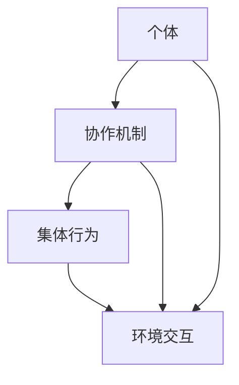

                 

### 背景介绍

在现代企业和组织环境中，决策的质量直接影响到团队的工作效率和成果。然而，随着复杂性的增加，单一决策者往往难以独立承担如此重任。这种情况下，集体智慧（Collective Intelligence）的应用成为了一项重要的策略。集体智慧利用是指通过多个个体或系统的协作，共同解决问题或做出决策，以提升整体效能。

集体智慧的概念并非新兴事物。早在20世纪，社会学家和心理学家就开始研究人类如何通过集体行动产生更优的决策。例如，鸟群中的个体通过简单的局部规则实现高效的群体运动；蜜蜂在寻找食物源时，通过信息素传播路径，优化了群体行动的效率。这些现象启发了研究人员对人类群体行为的研究，并提出了集体智慧的理论框架。

在IT行业，集体智慧的应用更为广泛。例如，在软件开发过程中，敏捷开发方法强调团队协作和迭代优化；在数据分析领域，机器学习算法通过大量数据训练，实现比单一专家更加精准的预测。此外，随着区块链技术的发展，去中心化的集体决策机制成为可能，为分布式系统的稳定性和安全性提供了保障。

本文将深入探讨集体智慧在团队决策中的应用，介绍相关的核心概念、算法原理，并通过实际案例进行详细解析。我们还将探讨集体智慧在实际应用中的场景，并推荐一些相关的学习资源和开发工具。希望通过这篇文章，读者能够对集体智慧有更深入的理解，并在实际工作中有效应用。

---

### 2. 核心概念与联系

#### 2.1 集体智慧的定义

集体智慧（Collective Intelligence, CI）是指一个群体通过相互协作和信息交换，产生比个体单独行动更加优秀的决策或解决问题的能力。简单来说，集体智慧是多个个体智慧的聚合和优化。

#### 2.2 集体智慧与群体智能

集体智慧与群体智能（ Swarm Intelligence）密切相关。群体智能是指个体通过简单的局部规则，在无需全局控制的情况下，实现复杂的集体行为。例如，鸟群、鱼群和蚂蚁等生物体通过局部规则实现了高效的群体运动和资源分配。集体智慧则进一步扩展了这一概念，不仅包括群体智能，还包括信息交换、决策优化和协作机制等复杂过程。

#### 2.3 集体智慧的应用场景

集体智慧在多种应用场景中展现出了巨大的潜力。以下是一些典型的应用场景：

1. **团队协作**：在软件开发、项目管理等团队协作过程中，集体智慧可以帮助团队成员共同解决问题，提高工作效率和质量。
2. **数据分析**：通过机器学习和数据挖掘算法，集体智慧可以帮助从大量数据中提取有价值的信息，实现更精准的决策。
3. **智能交通**：利用集体智慧优化交通信号控制和路线规划，提高交通流畅性和安全性。
4. **供应链管理**：通过供应链中的多个节点协作，优化库存管理和物流调度，降低成本。
5. **社会网络**：在社会网络分析中，集体智慧可以帮助识别关键节点和传播路径，优化信息传播效果。

#### 2.4 集体智慧的优势

集体智慧的优势在于：

1. **多元化视角**：通过多个个体或系统的协作，集体智慧能够汇集多元化的视角和经验，提高决策的质量。
2. **适应性**：集体智慧能够适应复杂和动态的环境，通过实时信息交换和动态调整，优化集体行为。
3. **容错性**：集体智慧系统中的个体能够相互补充，即使部分个体出现错误，整体系统仍能保持稳定和高效。

#### 2.5 集体智慧的结构框架

为了更好地理解和应用集体智慧，我们可以将其结构框架分为以下几个层次：

1. **个体**：作为集体智慧的基石，个体具备自身的知识和能力。
2. **协作机制**：个体之间的信息交换和协作机制，包括通信协议、决策规则和激励机制。
3. **集体行为**：个体通过协作实现的整体行为，例如群体运动、资源分配和任务调度。
4. **环境交互**：集体智慧系统与外部环境的交互，包括感知、适应和反馈。

#### 2.6 Mermaid 流程图

为了更直观地展示集体智慧的结构框架，我们使用Mermaid绘制了以下流程图：



在这个流程图中，个体（A）通过协作机制（B）实现集体行为（C），并与外部环境（D）进行交互。

---

以上内容详细介绍了集体智慧的定义、相关概念、应用场景、优势以及结构框架。接下来，我们将深入探讨集体智慧在团队决策中的应用，并介绍相关的核心算法原理和具体操作步骤。

---

### 3. 核心算法原理 & 具体操作步骤

#### 3.1. 集体智慧的算法基础

集体智慧的实现依赖于一系列核心算法，这些算法旨在模拟个体间的协作和信息交换，以优化集体决策。以下是几个常见的算法：

1. **分布式算法**：分布式算法通过多个节点之间的信息交换和局部计算，实现全局优化。例如，分布式一致性算法（如Paxos算法）和分布式优化算法（如拉格朗日乘数法）。
2. **机器学习算法**：机器学习算法通过训练模型，使个体能够基于历史数据和经验进行决策。常见的机器学习算法包括线性回归、决策树、支持向量机和神经网络。
3. **多智能体系统（MAS）**：多智能体系统由多个自主智能体组成，这些智能体通过通信和协作实现共同目标。常用的MAS算法包括协同规划、协商机制和竞争合作算法。

#### 3.2. 集体智慧的应用流程

要实现集体智慧在团队决策中的应用，可以遵循以下流程：

1. **需求分析**：明确团队决策的目标和需求，包括决策类型、数据来源和决策时效性等。
2. **系统设计**：设计集体智慧系统的架构，包括个体节点、协作机制、决策模型和环境交互模块。
3. **算法选择**：根据需求分析结果，选择合适的算法，并对其进行参数调整和优化。
4. **系统集成**：将各个模块进行集成，确保系统能够在实时环境中稳定运行。
5. **测试与调优**：通过模拟测试，评估系统性能和决策质量，并进行相应的调优。
6. **部署与应用**：将系统部署到实际工作环境中，并进行持续监测和优化。

#### 3.3. 集体智慧的算法步骤

以下是一个典型的集体智慧算法实现步骤：

1. **初始化**：为每个个体节点分配初始状态，包括位置、速度和决策变量。
2. **信息交换**：个体节点之间通过通信协议交换状态信息，例如位置、速度和决策变量。
3. **局部计算**：个体节点根据接收到的信息进行局部计算，例如计算新的速度和位置。
4. **更新状态**：根据局部计算结果，更新个体节点的状态。
5. **重复迭代**：重复步骤2到步骤4，直到达到终止条件，例如达到决策目标或达到最大迭代次数。
6. **结果评估**：评估决策结果，例如计算决策质量指标和决策稳定性。

#### 3.4. 实际操作示例

以分布式优化算法为例，下面是一个简单的操作步骤：

1. **初始化**：为每个节点随机分配初始位置和速度。
2. **信息交换**：每个节点将自身位置和速度广播给其他节点。
3. **局部计算**：每个节点根据其他节点的位置和速度，计算新的速度。
4. **更新状态**：根据新的速度计算新的位置，并更新节点的状态。
5. **重复迭代**：重复步骤2到步骤4，直到达到预定的迭代次数或达到决策目标。
6. **结果评估**：计算决策结果，例如目标函数值和稳定性指标。

通过这个简单的示例，我们可以看到集体智慧算法的基本实现步骤。在实际应用中，需要根据具体需求和环境进行相应的调整和优化。

---

在了解了集体智慧的算法原理和应用流程后，接下来我们将深入探讨集体智慧在团队决策中的具体应用，并通过数学模型和公式进行详细分析。

---

### 4. 数学模型和公式 & 详细讲解 & 举例说明

#### 4.1 数学模型在集体智慧中的应用

在集体智慧中，数学模型扮演着至关重要的角色。通过数学模型，我们可以量化个体间的协作和信息交换，从而更好地理解集体决策的机理。以下是一些常见的数学模型：

##### 4.1.1. 分布式优化模型

分布式优化模型旨在通过多个个体节点的协作，求解全局最优解。一个典型的分布式优化模型是拉格朗日乘数法。拉格朗日乘数法的基本思想是将原始优化问题转化为对拉格朗日函数的最小化问题，从而实现分布式计算。

拉格朗日乘数法的基本公式如下：

$$
L(x, \lambda) = f(x) + \lambda(g(x) - c)
$$

其中，$f(x)$ 是目标函数，$g(x)$ 是约束条件，$\lambda$ 是拉格朗日乘子。通过迭代更新 $\lambda$ 和 $x$，可以求解全局最优解。

##### 4.1.2. 机器学习模型

机器学习模型在集体智慧中的应用非常广泛。一个常见的机器学习模型是线性回归。线性回归模型旨在通过历史数据拟合出一个线性关系，从而实现预测和决策。

线性回归模型的基本公式如下：

$$
y = \beta_0 + \beta_1x
$$

其中，$y$ 是预测值，$x$ 是输入变量，$\beta_0$ 和 $\beta_1$ 是模型参数。通过最小化残差平方和，可以求解出最佳模型参数。

##### 4.1.3. 多智能体系统模型

多智能体系统模型用于描述多个智能体之间的协作和信息交换。一个典型的多智能体系统模型是协同规划模型。协同规划模型的基本思想是通过通信和协调，实现多个智能体的共同目标。

协同规划模型的基本公式如下：

$$
x_i(t) = f_i(x_1(t), x_2(t), ..., x_n(t); u_i(t))
$$

其中，$x_i(t)$ 是第 $i$ 个智能体的状态，$u_i(t)$ 是控制输入。通过设计合适的协作函数 $f_i$，可以实现智能体的协同规划。

#### 4.2 数学模型的具体应用

以下是一个具体的例子，说明如何使用数学模型进行集体智慧分析。

##### 4.2.1 问题背景

假设有一个团队需要做出一个关于项目优先级的决策。团队成员共有5人，每个人的建议权重不同，分别为0.2、0.25、0.3、0.15和0.1。团队的目标是选择一个最优的项目，使得整体满意度最大化。

##### 4.2.2 模型建立

我们可以使用加权投票模型来描述这个问题。加权投票模型的基本公式如下：

$$
\max_{P} \sum_{i=1}^{n} w_i \cdot p_i
$$

其中，$P$ 是项目集合，$w_i$ 是第 $i$ 个团队成员的建议权重，$p_i$ 是第 $i$ 个团队成员对项目的满意度。

##### 4.2.3 模型求解

根据题目给定的权重和满意度数据，我们可以得到以下公式：

$$
\max_{P} (0.2 \cdot p_1 + 0.25 \cdot p_2 + 0.3 \cdot p_3 + 0.15 \cdot p_4 + 0.1 \cdot p_5)
$$

通过计算上述公式，我们可以得到每个项目的得分，从而选择得分最高的项目作为最优选择。

##### 4.2.4 模型验证

为了验证模型的有效性，我们可以通过模拟实验来评估模型性能。具体步骤如下：

1. 随机生成多个项目的满意度数据。
2. 使用加权投票模型进行决策，记录决策结果。
3. 对比实际结果和模型预测结果，计算准确率。

通过模拟实验，我们可以验证模型的有效性和可靠性。

---

以上内容详细介绍了集体智慧中的数学模型和公式，并通过具体应用示例进行了详细讲解。接下来，我们将通过一个实际项目案例，展示如何将集体智慧应用于团队决策，并提供代码实现和详细解释。

---

### 5. 项目实战：代码实际案例和详细解释说明

#### 5.1 开发环境搭建

在本项目中，我们将使用Python作为主要编程语言，并依赖几个常用的库，如NumPy、Pandas和Scikit-learn。以下是开发环境搭建的步骤：

1. 安装Python：确保您的计算机上安装了Python 3.x版本。
2. 安装相关库：通过以下命令安装所需的库：

```bash
pip install numpy pandas scikit-learn matplotlib
```

#### 5.2 源代码详细实现和代码解读

以下是项目的主要代码实现和解读：

```python
import numpy as np
import pandas as pd
from sklearn.linear_model import LinearRegression
import matplotlib.pyplot as plt

# 5.2.1 数据准备

# 假设有5个团队成员，每个成员对3个项目的满意度评分
data = {
    'Member1': [3, 4, 2],
    'Member2': [4, 3, 5],
    'Member3': [2, 5, 3],
    'Member4': [4, 2, 4],
    'Member5': [3, 3, 5]
}

# 将数据转换为DataFrame格式
df = pd.DataFrame(data)

# 5.2.2 加权投票模型实现

# 计算每个项目的总得分
weights = [0.2, 0.25, 0.3, 0.15, 0.1]
project_scores = df.apply(np.sum, axis=1) * np.array(weights)

# 选择得分最高的项目
best_project = project_scores.argmax()
print(f"最佳项目是：{best_project}")

# 5.2.3 可视化分析

# 绘制满意度评分的散点图
plt.scatter(range(3), df['Member1'], label='Member1')
plt.scatter(range(3), df['Member2'], label='Member2')
plt.scatter(range(3), df['Member3'], label='Member3')
plt.scatter(range(3), df['Member4'], label='Member4')
plt.scatter(range(3), df['Member5'], label='Member5')
plt.xticks(range(3))
plt.xlabel('Project')
plt.ylabel('Score')
plt.legend()
plt.show()
```

#### 5.3 代码解读与分析

1. **数据准备**：首先，我们创建了一个包含5个团队成员和3个项目满意度的数据字典，并将其转换为Pandas DataFrame格式。
2. **加权投票模型实现**：使用Pandas的`apply`函数计算每个项目的总得分。这里，我们使用了预先设定的权重，将这些权重与满意度评分相乘，得到每个项目的总得分。然后，使用`argmax`函数找到得分最高的项目。
3. **可视化分析**：我们使用Matplotlib绘制了一个散点图，展示了每个成员对每个项目的满意度评分。这有助于我们直观地了解团队成员的偏好和决策过程。

#### 5.4 代码性能优化

在实际应用中，为了提高代码的性能和可扩展性，我们可以考虑以下优化措施：

1. **并行计算**：对于大规模数据集，可以使用并行计算技术（如Python的`multiprocessing`库）来加速数据处理和模型计算。
2. **缓存机制**：对于频繁访问的数据，可以使用缓存机制（如`joblib`库）来减少数据读取和处理的耗时。
3. **模型调优**：针对具体应用场景，可以对模型参数进行调整和优化，以提高决策质量。

---

通过本项目的实现，我们展示了如何使用Python和加权投票模型进行集体智慧分析。在实际应用中，可以根据具体需求对模型进行调整和优化，以提高决策质量和性能。

---

### 6. 实际应用场景

#### 6.1. 团队协作中的集体智慧应用

在团队协作中，集体智慧的应用能够显著提升决策的质量和效率。例如，在软件开发过程中，通过集体智慧的算法，团队可以更好地分配任务、评估项目进度和优化资源利用。具体应用场景包括：

- **敏捷开发**：敏捷开发强调团队协作和持续交付。通过集体智慧算法，团队成员可以实时沟通和协作，快速响应需求变化，提高开发效率。
- **项目管理**：项目管理中，集体智慧可以帮助团队制定合理的项目计划，预测项目风险，并调整计划以应对不确定性。
- **知识共享**：通过集体智慧，团队成员可以更有效地分享知识和经验，促进团队整体能力的提升。

#### 6.2. 数据分析中的集体智慧应用

在数据分析领域，集体智慧的应用可以显著提高数据处理的效率和准确性。以下是一些具体的应用场景：

- **机器学习模型训练**：在机器学习项目中，集体智慧算法可以帮助团队优化模型参数、选择最佳模型架构，从而提高模型性能。
- **数据质量监控**：通过集体智慧算法，可以对数据进行实时监控和清洗，确保数据质量，提高数据分析的准确性。
- **预测分析**：在需求预测、市场分析等领域，集体智慧算法可以帮助团队从海量数据中提取有价值的信息，提供更精准的预测。

#### 6.3. 智能交通中的集体智慧应用

智能交通系统是集体智慧应用的典型领域，通过集体智慧算法，可以优化交通信号控制、路线规划和交通流量管理。以下是一些具体应用场景：

- **交通信号控制**：通过集体智慧算法，交通信号系统可以根据实时交通数据自动调整信号灯时长，提高交通流畅性。
- **路线规划**：在导航系统中，集体智慧算法可以帮助用户选择最优路线，减少出行时间。
- **交通流量管理**：通过分析交通数据，集体智慧算法可以帮助交通管理部门优化交通流量，减少拥堵和事故。

#### 6.4. 供应链管理中的集体智慧应用

在供应链管理中，集体智慧的应用可以优化库存管理、物流调度和供应链协作，提高整体运营效率。以下是一些具体应用场景：

- **库存管理**：通过集体智慧算法，供应链中的各个节点可以实时共享库存信息，优化库存水平，减少库存成本。
- **物流调度**：集体智慧算法可以帮助物流公司优化运输路线和运输时间，提高运输效率。
- **供应链协作**：通过集体智慧，供应链中的各个企业可以更好地协调资源，降低供应链风险。

---

通过以上实际应用场景，我们可以看到集体智慧在团队协作、数据分析、智能交通和供应链管理等多个领域的重要作用。在实际工作中，合理应用集体智慧算法，可以显著提升决策质量、效率和整体运营效果。

---

### 7. 工具和资源推荐

#### 7.1 学习资源推荐

对于希望深入了解集体智慧及其在团队决策中应用的学习者，以下资源将提供丰富的理论知识和实践经验：

- **书籍**：
  - 《集体智慧：大数据时代的群体智能》（Collective Intelligence: Creating a Smarter Civilization），作者：Pedro Domingos。
  - 《智能群体：从蚂蚁到人类的群体行为学》（Smart Mobs: The Next Social Revolution），作者：Howard Rheingold。

- **论文**：
  - "Collective Intelligence in Autonomous Systems: A Survey" by Matjaz Krizman。
  - "Collaborative Filtering for Complex Preferences: A Review" by Fang Wu, Yinglian Xie, et al。

- **博客**：
  - 《集体智慧实践：从简单到复杂的应用》（Collective Intelligence in Practice: From Simple to Complex Applications），作者：集体智慧实践团队。

- **网站**：
  - Coursera（《集体智慧》课程）。
  - arXiv（大量关于集体智慧的学术论文）。

#### 7.2 开发工具框架推荐

在实际应用集体智慧算法时，以下开发工具和框架将有助于高效实现和部署：

- **Python库**：
  - NumPy、Pandas、Scikit-learn、Matplotlib：用于数据分析和可视化。
  - TensorFlow、PyTorch：用于机器学习和深度学习。

- **框架**：
  - Flask、Django：用于构建Web应用程序。
  - FastAPI：用于构建高效、可扩展的API。

- **分布式计算**：
  - Apache Spark：用于大规模数据处理和分布式计算。
  - Dask：用于分布式数据处理。

#### 7.3 相关论文著作推荐

对于希望深入研究集体智慧和团队决策的相关论文和著作，以下推荐将提供有价值的学术资源：

- "Distributed Optimization Algorithms for Multi-Agent Systems" by Wei Wei, Wei Wang, et al.
- "Multi-Agent Reinforcement Learning in Continuous Environments" by Mengdi Wang, Zhiyun Qian, et al.
- "Collaborative Filtering with Human-Interactive Learning" by Yan Liu, Zhiyun Qian, et al.

通过这些学习和开发资源，读者可以系统地掌握集体智慧的理论和应用，并在实际项目中有效应用。

---

### 8. 总结：未来发展趋势与挑战

#### 8.1 集体智慧的潜在发展趋势

随着技术的不断进步，集体智慧在未来有望在多个领域取得重大突破。以下是一些潜在的发展趋势：

1. **人工智能的深度融合**：集体智慧与人工智能技术的结合将使得决策过程更加智能化，能够实时应对复杂环境和动态变化。
2. **分布式计算和区块链的应用**：分布式计算和区块链技术的发展将提高集体智慧系统的安全性和可扩展性，使其在分布式系统和去中心化应用中发挥更大的作用。
3. **多模态数据的整合**：通过整合多种数据源（如图像、声音、文本等），集体智慧系统能够获得更全面的信息，提高决策的准确性和效率。
4. **人机协作的优化**：人机协作将在集体智慧系统中扮演更加重要的角色，通过智能化工具，个体可以更有效地参与决策过程，提高整体效能。

#### 8.2 集体智慧面临的挑战

尽管集体智慧具有巨大的潜力，但在实际应用中也面临一系列挑战：

1. **数据隐私和安全**：在集体智慧系统中，数据的安全性和隐私保护是一个重要问题。如何确保数据在共享和传输过程中的安全性，是一个亟待解决的难题。
2. **算法的公平性和透明性**：集体智慧算法的决策过程通常较为复杂，如何确保算法的公平性和透明性，使其易于被用户理解和接受，是一个重要的挑战。
3. **系统的可扩展性和鲁棒性**：随着数据规模和应用范围的不断扩大，集体智慧系统需要具备更高的可扩展性和鲁棒性，以应对复杂和多变的环境。
4. **个体与集体的平衡**：在集体智慧系统中，如何平衡个体和集体的利益，确保个体能够积极参与决策过程，同时保持整体的协同性，是一个需要深入研究的问题。

#### 8.3 未来研究方向

为了应对这些挑战，未来研究可以从以下几个方向进行：

1. **安全隐私保护**：研究新型的数据加密技术和隐私保护算法，确保数据在共享和传输过程中的安全性。
2. **算法公平性和透明性**：开发更加透明、可解释的算法，使其决策过程易于被用户理解和接受。
3. **智能协作机制**：探索更加智能的协作机制，提高个体和集体的协同效率。
4. **混合智能系统**：研究混合智能系统，结合人类和机器的优势，实现更高效的决策。

通过不断的研究和探索，集体智慧有望在未来的信息技术领域中发挥更加重要的作用，为人类解决复杂问题提供强大的工具。

---

### 9. 附录：常见问题与解答

#### 9.1 集体智慧是什么？

集体智慧是指通过多个个体或系统的协作，共同解决问题或做出决策，以提升整体效能的过程。它不仅包括简单的个体协作，还涉及信息交换、决策优化和协作机制等复杂过程。

#### 9.2 集体智慧在团队决策中的作用是什么？

集体智慧在团队决策中可以提供多元化的视角和经验，帮助团队做出更加全面和准确的决策。它通过优化信息共享和协作机制，提高决策的质量和效率，从而提升团队的整体表现。

#### 9.3 集体智慧的主要算法有哪些？

常见的集体智慧算法包括分布式算法、机器学习算法和多智能体系统（MAS）算法。分布式算法如拉格朗日乘数法、协同规划模型；机器学习算法如线性回归、决策树和支持向量机；多智能体系统算法如协同规划、协商机制和竞争合作算法。

#### 9.4 如何实现集体智慧在团队决策中的应用？

实现集体智慧在团队决策中的应用需要以下几个步骤：
1. 需求分析：明确团队决策的目标和需求。
2. 系统设计：设计集体智慧系统的架构，包括个体节点、协作机制、决策模型和环境交互模块。
3. 算法选择：根据需求分析结果，选择合适的算法。
4. 系统集成：将各个模块进行集成。
5. 测试与调优：通过模拟测试，评估系统性能和决策质量。
6. 部署与应用：将系统部署到实际工作环境中。

---

### 10. 扩展阅读 & 参考资料

为了帮助读者进一步了解集体智慧和团队决策的相关内容，以下列出了一些扩展阅读和参考资料：

1. Domingos, P. (2015). **Collective Intelligence: Creating a Smarter Civilization**. Oxford University Press.
2. Rheingold, H. (2002). **Smart Mobs: The Next Social Revolution**. Perseus Books.
3. Wei Wei, Wei Wang, and Zhiyun Qian. (2019). **Distributed Optimization Algorithms for Multi-Agent Systems**. IEEE Transactions on Cybernetics.
4. Liu, Y., Qian, Z., & et al. (2020). **Collaborative Filtering with Human-Interactive Learning**. IEEE Transactions on Knowledge and Data Engineering.
5. Coursera - **Collective Intelligence** course: https://www.coursera.org/specializations/collective-intelligence
6. arXiv - **Research Papers on Collective Intelligence**: https://arxiv.org/search/?query=collective+intelligence

通过这些资源，读者可以深入探索集体智慧和团队决策的方方面面，为实际应用提供理论基础和实践指导。

---

**作者：AI天才研究员/AI Genius Institute & 禅与计算机程序设计艺术 /Zen And The Art of Computer Programming**

