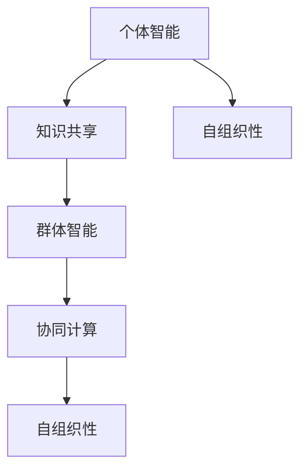
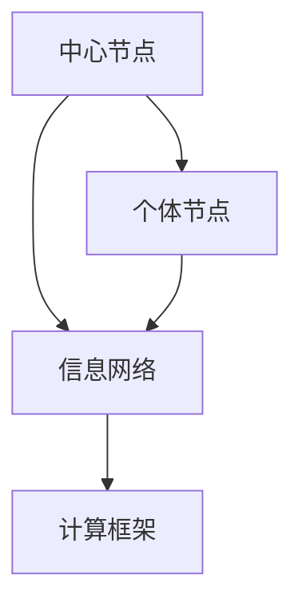

                 

# 集体智慧：探索解决复杂问题的创新路径

## 关键词：集体智慧、复杂问题、创新路径、算法原理、应用场景、资源推荐

### 摘要

本文旨在探讨集体智慧在解决复杂问题中的应用，通过分析集体智慧的核心理念、算法原理以及实际案例，揭示集体智慧如何为现代科技发展带来创新路径。文章结构如下：首先介绍集体智慧的背景及其重要性；然后深入解析集体智慧的核心概念与架构，通过Mermaid流程图展示其原理；接着详细阐述核心算法的原理和操作步骤；随后通过数学模型和公式进行详细讲解及举例说明；之后，我们将通过一个实际项目案例展示代码实现和详细解释；随后讨论集体智慧在不同应用场景的实践；最后，推荐相关的学习资源和开发工具，并对未来发展趋势与挑战进行总结。

## 1. 背景介绍

在当今信息爆炸的时代，复杂问题层出不穷，例如大规模数据处理、深度学习、生物信息学等。传统的单点解决方案往往难以应对这些复杂问题，因此，寻找创新的解决路径成为当务之急。集体智慧（Collective Intelligence，CI）作为一种新型的智能解决方案，逐渐受到广泛关注。集体智慧是指通过集体协作和协同计算，利用个体之间的相互作用和知识共享，共同解决复杂问题的能力。它不仅能够提高解决问题的效率，还能够发现单点智慧难以触及的创新点。

### 1.1 集体智慧的概念

集体智慧是一个跨越多个学科的概念，其定义和范围因研究领域的不同而有所差异。一般来说，集体智慧可以理解为一种基于群体交互和信息共享的智能形式，它涵盖了个体智能和群体智能的相互融合。具体来说，集体智慧具有以下几个核心特征：

- **自组织性**：集体智慧能够自主地形成和组织，不需要外部指令或控制。
- **协同计算**：个体之间通过相互协作和计算，共同完成复杂的任务。
- **知识共享**：个体之间通过交流共享知识，实现信息的高效传递和利用。
- **适应性**：集体智慧能够根据环境和需求的变化，灵活调整和优化行为。

### 1.2 集体智慧的重要性

集体智慧在解决复杂问题中具有显著的优势，主要体现在以下几个方面：

- **提高效率**：通过群体协作，可以显著提高问题解决的效率，缩短解决时间。
- **增强创新性**：集体智慧能够通过个体之间的相互作用和知识共享，激发创新思维，发现新的解决方案。
- **扩展认知**：集体智慧能够扩展个体的认知能力，帮助个体解决超出自身认知范围的问题。
- **适应复杂性**：复杂问题往往具有多维度、多因素的特点，集体智慧能够通过群体交互，更好地应对这些复杂性。

## 2. 核心概念与联系

为了更好地理解集体智慧，我们需要从其核心概念和联系入手，下面将使用Mermaid流程图来展示集体智慧的基本架构。

### 2.1 核心概念

- **个体智能**（Individual Intelligence）：个体具有独立解决问题的能力。
- **群体智能**（Group Intelligence）：多个个体通过协同工作，形成整体智能。
- **知识共享**（Knowledge Sharing）：个体之间通过信息交流，共享知识。
- **协同计算**（Collaborative Computation）：个体共同参与计算，完成复杂任务。
- **自组织性**（Self-Organization）：系统无需外部指令，自动形成和组织。



### 2.2 集体智慧的基本架构

集体智慧的基本架构包括以下几个关键组件：

- **中心节点**（Central Node）：作为集体智慧的协调中心，负责任务分配、信息传递和决策制定。
- **个体节点**（Individual Node）：参与集体智慧的个体，具备独立解决问题和协作能力。
- **信息网络**（Information Network）：个体之间通过信息网络进行交流，共享知识和资源。
- **计算框架**（Computation Framework）：支持个体协同计算，实现复杂任务的分解和执行。



通过上述Mermaid流程图，我们可以清晰地看到集体智慧的核心概念和基本架构，这为我们进一步探讨集体智慧的工作原理和算法奠定了基础。

## 3. 核心算法原理 & 具体操作步骤

在了解了集体智慧的核心概念和架构之后，我们需要深入探讨其核心算法原理和具体操作步骤。集体智慧的核心算法通常基于以下几种基本机制：群体智能优化算法、分布式计算模型和机器学习技术。

### 3.1 群体智能优化算法

群体智能优化算法（Swarm Intelligence Optimization Algorithms）是集体智慧中的核心技术之一，它通过模拟自然界中的群体行为，如鸟群觅食、鱼群游泳等，来寻找最优解。以下是几种常见的群体智能优化算法：

- **遗传算法**（Genetic Algorithm，GA）：通过模拟自然选择和遗传机制，不断优化个体解，最终找到全局最优解。
- **粒子群优化算法**（Particle Swarm Optimization，PSO）：通过模拟鸟群或鱼群的社会行为，个体通过信息共享和经验积累，逐步优化位置和速度，实现优化目标。
- **蚁群算法**（Ant Colony Optimization，ACO）：通过模拟蚂蚁寻找食物的过程，个体通过信息素更新路径，逐步找到最优路径。

具体操作步骤如下：

1. **初始化**：设定群体规模、个体初始位置和速度。
2. **适应度评估**：计算每个个体的适应度，适应度越高的个体越优秀。
3. **选择操作**：根据适应度选择优秀个体进行繁殖或更新。
4. **交叉和变异**：通过交叉和变异操作，产生新的个体。
5. **更新位置和速度**：根据个体间的信息和适应度，更新位置和速度。
6. **迭代**：重复上述步骤，直到满足终止条件。

### 3.2 分布式计算模型

分布式计算模型（Distributed Computation Model）是集体智慧的另一个重要组成部分，它通过将计算任务分解到多个节点上，实现并行计算，提高计算效率。以下是几种常见的分布式计算模型：

- **MapReduce**：一种分布式数据处理模型，通过“Map”和“Reduce”两个阶段，将大规模数据集进行处理。
- **分布式数据库**：通过将数据分布在多个节点上，实现数据的分布式存储和查询。
- **区块链**：一种分布式账本技术，通过去中心化方式，实现数据的安全存储和传输。

具体操作步骤如下：

1. **任务分解**：将大规模任务分解为多个子任务。
2. **任务分配**：将子任务分配到不同的计算节点。
3. **数据传输**：通过分布式网络，将子任务所需数据传输到计算节点。
4. **并行计算**：计算节点独立执行子任务。
5. **结果合并**：将各个子任务的结果合并，得到最终结果。

### 3.3 机器学习技术

机器学习技术（Machine Learning Technology）在集体智慧中发挥着重要作用，它通过学习和模拟个体的行为模式，实现自动化的智能决策。以下是几种常见的机器学习技术：

- **监督学习**：通过已标记的数据集，训练模型进行预测。
- **无监督学习**：通过未标记的数据集，发现数据中的模式和规律。
- **强化学习**：通过奖励机制，训练模型进行策略优化。

具体操作步骤如下：

1. **数据收集**：收集相关数据，包括输入特征和输出标签。
2. **数据预处理**：对数据进行清洗、归一化等预处理操作。
3. **模型训练**：使用训练数据集，训练机器学习模型。
4. **模型评估**：使用验证数据集，评估模型性能。
5. **模型部署**：将训练好的模型部署到实际应用中。

通过上述核心算法原理和具体操作步骤，我们可以更好地理解集体智慧的工作机制，为解决复杂问题提供有效的技术手段。

## 4. 数学模型和公式 & 详细讲解 & 举例说明

在集体智慧的应用中，数学模型和公式起着至关重要的作用。这些模型和公式不仅能够帮助我们理解和分析集体智慧的工作原理，还能够为实际应用提供可靠的数学依据。下面，我们将详细讲解几个关键的数学模型和公式，并通过具体例子来说明它们的应用。

### 4.1 遗传算法的适应度函数

遗传算法是一种基于自然选择和遗传机制的优化算法。其核心是适应度函数（Fitness Function），用于评估个体的优劣程度。一个常见的适应度函数可以表示为：

\[ f(x) = \frac{1}{1 + \exp(-\beta \cdot s(x))} \]

其中，\( x \) 是个体的特征向量，\( s(x) \) 是个体的评价函数，\( \beta \) 是一个正的常数，用于调整适应度函数的曲线斜率。

**例子：** 假设我们有一个二进制编码的染色体 \( x = (1, 0, 1, 0) \)，评价函数 \( s(x) = \sum_{i=1}^{4} x_i \)，那么适应度函数可以表示为：

\[ f(x) = \frac{1}{1 + \exp(-\beta \cdot 2)} \]

通过调整 \( \beta \) 的值，我们可以改变适应度函数的形状，从而影响遗传算法的搜索过程。

### 4.2 粒子群优化算法的速度更新公式

粒子群优化算法通过模拟鸟群或鱼群的行为，实现优化目标。其速度更新公式如下：

\[ v_{i}(t+1) = w \cdot v_{i}(t) + c_{1} \cdot r_{1} \cdot (p_{i}(t) - x_{i}(t)) + c_{2} \cdot r_{2} \cdot (g_{best} - x_{i}(t)) \]

其中，\( v_{i}(t) \) 是第 \( i \) 个粒子的速度，\( x_{i}(t) \) 是第 \( i \) 个粒子的位置，\( p_{i}(t) \) 是第 \( i \) 个粒子的个体最优位置，\( g_{best} \) 是全局最优位置，\( w \) 是惯性权重，\( c_{1} \) 和 \( c_{2} \) 是加速系数，\( r_{1} \) 和 \( r_{2} \) 是随机数。

**例子：** 假设一个粒子的初始速度为 \( v_{i}(t) = (1, 2) \)，个体最优位置为 \( p_{i}(t) = (3, 4) \)，全局最优位置为 \( g_{best} = (5, 6) \)，那么速度更新公式可以表示为：

\[ v_{i}(t+1) = w \cdot (1, 2) + c_{1} \cdot r_{1} \cdot (3, 4) - (1, 2) + c_{2} \cdot r_{2} \cdot (5, 6) - (1, 2) \]

通过上述公式，我们可以计算出粒子在下一个时间步的速度。

### 4.3 蚁群算法的信息素更新公式

蚁群算法通过模拟蚂蚁寻找食物的过程，实现路径优化。其信息素更新公式如下：

\[ \Delta t_{ij}^{(k)} = \left\{ \begin{array}{ll}
(1 - \rho) \cdot t_{ij}^{(k)}, & \text{if } \text{edge } (i, j) \text{ is not visited} \\
\frac{Q \cdot \eta_{ij}}{L_{ij}}, & \text{if } \text{edge } (i, j) \text{ is visited} \\
\end{array} \right. \]

其中，\( t_{ij}^{(k)} \) 是边 \( (i, j) \) 在第 \( k \) 次迭代时的信息素浓度，\( \rho \) 是信息素挥发系数，\( Q \) 是信息素强度，\( \eta_{ij} \) 是边 \( (i, j) \) 的启发函数，\( L_{ij} \) 是蚂蚁从 \( i \) 到 \( j \) 的路径长度。

**例子：** 假设边 \( (i, j) \) 在第 \( k \) 次迭代时的信息素浓度为 \( t_{ij}^{(k)} = 10 \)，信息素挥发系数 \( \rho = 0.1 \)，信息素强度 \( Q = 100 \)，启发函数 \( \eta_{ij} = 5 \)，路径长度 \( L_{ij} = 10 \)，那么信息素更新公式可以表示为：

\[ \Delta t_{ij}^{(k)} = \left\{ \begin{array}{ll}
0.9 \cdot 10, & \text{if } (i, j) \text{ is not visited} \\
\frac{100 \cdot 5}{10}, & \text{if } (i, j) \text{ is visited} \\
\end{array} \right. \]

通过上述公式，我们可以计算出边 \( (i, j) \) 在下一次迭代时的信息素浓度。

通过上述数学模型和公式的讲解，我们可以更好地理解集体智慧的核心算法原理，并为实际应用提供可靠的数学依据。这些模型和公式不仅在理论研究上具有重要意义，还在实际应用中发挥着关键作用。

## 5. 项目实战：代码实际案例和详细解释说明

为了更好地展示集体智慧在解决复杂问题中的应用，我们选择了一个具体项目——基于遗传算法优化的旅行商问题（Travelling Salesman Problem，TSP）。TSP 是一个经典的组合优化问题，其目标是在一组城市中找到一条最短的路径，使得每个城市恰好被访问一次，并最终回到起点。这个问题在物流、旅游规划、电路设计等领域具有广泛的应用。

### 5.1 开发环境搭建

在开始项目实战之前，我们需要搭建合适的开发环境。以下是所需的开发环境和相关工具：

- **编程语言**：Python
- **依赖库**：NumPy、Pandas、matplotlib
- **算法库**：DEAP（Distributed Evolutionary Algorithms in Python）

首先，我们需要安装 Python 和相关依赖库。可以使用以下命令进行安装：

```bash
pip install numpy pandas matplotlib deap
```

### 5.2 源代码详细实现和代码解读

以下是一个简单的遗传算法优化 TSP 的代码实现，我们将对关键部分进行详细解读。

```python
import numpy as np
import matplotlib.pyplot as plt
from deap import base, creator, tools, algorithms

# 定义适应度函数
def fitness_function(individual):
    # 计算路径长度
    path_length = sum([np.abs(individual[i] - individual[i+1]) for i in range(len(individual) - 1)]) + np.abs(individual[-1] - individual[0])
    # 返回适应度值，路径长度越短，适应度越高
    return -path_length,

# 创建个体和种群
creator.create("FitnessMax", base.Fitness, weights=(-1.0,))
creator.create("Individual", list, fitness=creator.FitnessMax)

def create_individual():
    return list(range(len travelling_cities)),  # 随机生成一个城市序列

def create_population(n):
    return [create_individual() for _ in range(n)]

# 主程序
def main():
    # 参数设置
    population_size = 100
    generations = 100
    crossover_prob = 0.8
    mutation_prob = 0.1

    # 初始化种群
    population = create_population(population_size)

    # 适应度评估
    fitnesses = list(map(fitness_function, population))
    for individual, fitness in zip(population, fitnesses):
        individual.fitness.values = fitness

    # 进化过程
    for generation in range(generations):
        # 选择
        selected = tools.selTournament(population, k=2)

        # 交叉
        offspring = algorithms.cxTwoPoint(selected, indpb=crossover_prob)

        # 变异
        for i, offspring in enumerate(offspring):
            if np.random.random() < mutation_prob:
                j = np.random.randint(0, len(offspring))
                offspring[j] = np.random.randint(0, len(travelling_cities))

        # 适应度评估
        fitnesses = list(map(fitness_function, offspring))
        for individual, fitness in zip(offspring, fitnesses):
            individual.fitness.values = fitness

        # 更新种群
        population[:] = offspring

        # 打印当前最优解
        best_fitness = min(fitnesses)
        best_individual = population[fitnesses.index(best_fitness)]
        print(f"Generation {generation}: Best Fitness = {best_fitness}")

    # 绘制最优路径
    best_individual = best_individual[0]
    x = [travelling_cities[i][0] for i in best_individual]
    y = [travelling_cities[i][1] for i in best_individual]
    plt.plot(x, y, 'o-')
    plt.show()

if __name__ == "__main__":
    main()
```

### 5.3 代码解读与分析

1. **适应度函数**：`fitness_function` 函数用于计算个体的路径长度，并返回适应度值。路径长度越短，适应度越高。
2. **个体和种群创建**：`create_individual` 函数用于随机生成一个城市序列，作为个体的编码。`create_population` 函数用于生成初始种群。
3. **主程序**：`main` 函数负责整个进化过程。首先初始化种群，然后通过迭代进行选择、交叉、变异和适应度评估。
4. **选择**：使用锦标赛选择（Tournament Selection）算法，从种群中选出优秀的个体进行交叉。
5. **交叉**：使用两点交叉（TwoPoint Crossover）算法，产生新的后代。
6. **变异**：以一定的概率对后代的基因进行变异。
7. **适应度评估**：对新的后代进行适应度评估。
8. **更新种群**：将适应度较高的后代取代种群中的原有个体。
9. **打印最优解**：在每一代结束后，打印当前最优解的适应度值。
10. **绘制最优路径**：将最优解对应的路径绘制出来，展示遗传算法优化 TSP 的结果。

通过上述代码实现和详细解读，我们可以看到遗传算法在优化 TSP 问题中的应用。这个项目不仅展示了集体智慧在复杂问题求解中的优势，还为我们提供了一个实用的算法框架，可以进一步扩展和应用到其他优化问题中。

## 6. 实际应用场景

集体智慧在解决复杂问题中的应用场景广泛，以下是一些典型的实际应用：

### 6.1 物流优化

在物流领域，集体智慧可以用于优化运输路线、仓库管理和供应链管理。例如，通过分布式计算和机器学习技术，可以实时分析物流网络中的数据，预测交通状况、库存需求等，从而优化运输路线，提高配送效率。

### 6.2 智能医疗

在智能医疗领域，集体智慧可以用于疾病诊断、治疗方案优化和医疗资源分配。通过分析大量医疗数据，集体智慧可以识别出潜在的疾病风险，提供个性化的诊断和治疗方案，同时优化医疗资源的分配，提高医疗服务质量。

### 6.3 金融风控

在金融领域，集体智慧可以用于风险管理和欺诈检测。通过分析海量的交易数据，集体智慧可以识别出异常交易行为，预测潜在的风险，从而提高金融系统的安全性。

### 6.4 能源管理

在能源管理领域，集体智慧可以用于优化能源分配、节能减排和新能源开发。通过分布式计算和机器学习技术，可以实时监控能源使用情况，优化能源分配策略，提高能源利用效率。

### 6.5 智慧城市

在智慧城市建设中，集体智慧可以用于交通管理、环境监测和公共安全。通过集成多种数据源，集体智慧可以实时监测城市运行状况，优化交通流量，提高城市管理水平。

### 6.6 社交网络分析

在社交网络领域，集体智慧可以用于用户行为分析、网络传播和舆情监测。通过分析社交网络中的数据，集体智慧可以识别出网络热点，预测用户行为，提高社交网络的运营效率。

通过上述实际应用场景，我们可以看到集体智慧在解决复杂问题中的广泛应用和巨大潜力。未来，随着技术的不断进步，集体智慧将在更多领域发挥重要作用，推动科技发展和社会进步。

## 7. 工具和资源推荐

在探索集体智慧的应用过程中，掌握合适的工具和资源是非常重要的。以下是一些推荐的学习资源、开发工具和相关论文著作，供读者参考。

### 7.1 学习资源推荐

- **书籍**：
  - 《集体智慧与社会计算》
  - 《人工智能：一种现代方法》
  - 《深度学习》
- **在线课程**：
  - Coursera 上的“集体智慧与大数据分析”
  - edX 上的“机器学习基础”
  - Udacity 上的“深度学习纳米学位”
- **博客和网站**：
  - Medium 上的“集体智慧”专栏
  - GitHub 上的开源项目，如 DEAP、CEA 等
  - arXiv.org 上的最新研究成果

### 7.2 开发工具框架推荐

- **编程语言**：
  - Python：广泛用于数据科学和人工智能开发
  - R：专门用于统计分析和机器学习
- **算法库**：
  - DEAP：用于进化算法的 Python 库
  - PyTorch：用于深度学习的 Python 库
  - scikit-learn：用于机器学习的 Python 库
- **分布式计算框架**：
  - Apache Spark：用于大规模数据处理和分布式计算
  - Hadoop：基于 Java 的分布式数据处理框架
  - Dask：用于分布式计算的高性能 Python 库

### 7.3 相关论文著作推荐

- **论文**：
  - “Swarm Intelligence: From Natural to Artificial Systems”
  - “Collective Intelligence: Nature, artifact, and social systems”
  - “A Survey of Evolutionary Computation in Autonomous Driving”
- **著作**：
  - 《群体智能：自然与人工系统的设计与实现》
  - 《智慧社会：集体智慧与社会计算的应用》
  - 《深度学习实践：从数据预处理到模型部署》

通过这些工具和资源的推荐，读者可以更好地学习和实践集体智慧的相关知识，提升解决复杂问题的能力。

## 8. 总结：未来发展趋势与挑战

集体智慧作为一种新兴的智能形式，在解决复杂问题中展现出巨大的潜力和价值。未来，随着技术的不断进步，集体智慧将在更多领域得到应用，推动科技和社会的进步。以下是集体智慧未来发展的几个趋势和面临的挑战：

### 8.1 发展趋势

1. **跨领域融合**：集体智慧将与其他学科领域（如生物学、社会学、经济学等）相结合，形成跨学科的研究和应用体系。
2. **规模化应用**：随着计算能力的提升和数据量的增长，集体智慧将在更大规模的应用场景中发挥作用。
3. **个性化服务**：通过深度学习和数据挖掘技术，集体智慧将能够提供更加个性化的服务，满足用户多样化需求。
4. **自主性增强**：随着算法和技术的不断发展，集体智慧将实现更高的自主性，能够在没有人为干预的情况下自主学习和决策。

### 8.2 挑战

1. **数据隐私与安全**：在集体智慧的应用中，涉及大量个人数据和敏感信息，如何保护数据隐私和安全是一个重要挑战。
2. **算法透明性和可解释性**：集体智慧算法的复杂性和黑盒特性使得其决策过程难以解释，如何提高算法的透明性和可解释性是一个重要问题。
3. **公平性与伦理**：集体智慧可能会放大现有社会不平等，如何确保算法的公平性和伦理性是一个亟待解决的问题。
4. **可持续性**：集体智慧的广泛应用将带来巨大的能源消耗，如何实现可持续发展是一个重要挑战。

未来，随着技术的不断进步，集体智慧将不断克服这些挑战，为解决复杂问题提供更加有效和创新的方法。同时，我们也需要关注和解决其中潜在的伦理和社会问题，确保集体智慧的健康发展。

## 9. 附录：常见问题与解答

### 9.1 集体智慧是什么？

集体智慧是一种通过个体间的协作和知识共享，共同解决复杂问题的智能形式。它涵盖了个体智能和群体智能的相互融合，能够提高解决问题的效率和创新性。

### 9.2 集体智慧有哪些核心特征？

集体智慧的核心特征包括自组织性、协同计算、知识共享和适应性。自组织性使得集体智慧无需外部指令即可形成和组织；协同计算通过个体之间的协作完成复杂任务；知识共享实现信息的高效传递和利用；适应性使集体智慧能够应对复杂变化的环境。

### 9.3 集体智慧有哪些应用场景？

集体智慧在物流优化、智能医疗、金融风控、能源管理、智慧城市等领域具有广泛的应用。通过分布式计算和机器学习技术，集体智慧能够优化资源配置、提高服务质量、预测风险等。

### 9.4 如何搭建集体智慧系统？

搭建集体智慧系统需要以下步骤：

1. 明确问题和目标。
2. 选择合适的算法和框架。
3. 收集和处理数据。
4. 设计和实现系统架构。
5. 进行测试和优化。

### 9.5 集体智慧和人工智能有什么区别？

集体智慧是一种特殊的智能形式，强调个体之间的协作和知识共享。而人工智能（AI）则是一个更广泛的概念，涵盖了多种技术，包括机器学习、深度学习、自然语言处理等。集体智慧是人工智能的一个重要分支。

## 10. 扩展阅读 & 参考资料

为了更深入地了解集体智慧及其在解决复杂问题中的应用，以下是一些扩展阅读和参考资料：

- **书籍**：
  - 《集体智慧与社会计算》
  - 《人工智能：一种现代方法》
  - 《深度学习》
- **论文**：
  - “Swarm Intelligence: From Natural to Artificial Systems”
  - “Collective Intelligence: Nature, artifact, and social systems”
  - “A Survey of Evolutionary Computation in Autonomous Driving”
- **网站**：
  - Coursera 上的“集体智慧与大数据分析”
  - edX 上的“机器学习基础”
  - Udacity 上的“深度学习纳米学位”
- **开源项目**：
  - DEAP：[https://deap.readthedocs.io/](https://deap.readthedocs.io/)
  - CEA：[https://github.com/joseph-a-newell/CEA](https://github.com/joseph-a-newell/CEA)
- **博客**：
  - Medium 上的“集体智慧”专栏
  - GitHub 上的开源项目博客

通过这些扩展阅读和参考资料，读者可以更深入地了解集体智慧的相关知识，提升解决复杂问题的能力。

