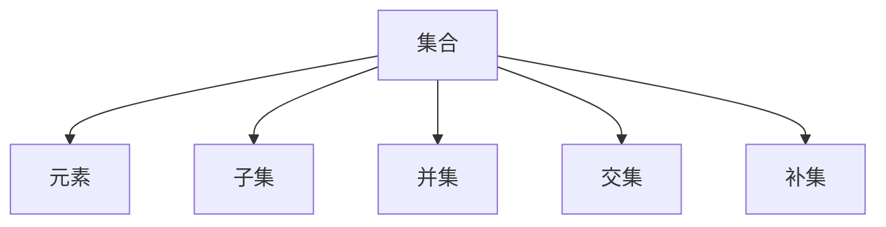

                 

### 集合论导引：内在模型论概要

#### 摘要

本文旨在为读者提供一个集合论导引，重点介绍内在模型论的核心概念、原理和应用。通过详细的讲解和实际案例，我们将深入探讨集合论在计算机科学和数学中的重要性，以及如何通过内在模型论来理解复杂的系统。文章还将推荐相关学习资源和开发工具，以帮助读者更好地掌握这一重要领域。

#### 目录

1. 背景介绍  
2. 核心概念与联系  
3. 核心算法原理 & 具体操作步骤  
4. 数学模型和公式 & 详细讲解 & 举例说明  
5. 项目实战：代码实际案例和详细解释说明  
6. 实际应用场景  
7. 工具和资源推荐  
8. 总结：未来发展趋势与挑战  
9. 附录：常见问题与解答  
10. 扩展阅读 & 参考资料

---

#### 1. 背景介绍

集合论作为数学的基础理论，是现代数学的核心部分。它起源于19世纪末，由德国数学家乔治·康托尔（Georg Cantor）创立。集合论提供了对对象集合的抽象描述，使得我们可以用统一的方式处理各种数学对象。

在计算机科学中，集合论有着广泛的应用。例如，在数据结构中，集合用于存储和操作元素；在算法设计中，集合论的概念可以帮助我们分析问题并构建高效的解决方案。此外，集合论还在形式逻辑、模型论、递归论等领域发挥着重要作用。

本文将重点关注内在模型论，它是集合论的一个重要分支。内在模型论研究集合之间内在的关系和性质，为我们提供了理解和分析复杂系统的有力工具。

#### 2. 核心概念与联系

在集合论中，核心概念包括集合、元素、子集、并集、交集、补集等。

- **集合（Set）**：由确定性的元素组成的整体。
- **元素（Element）**：集合中的个体。
- **子集（Subset）**：如果一个集合的所有元素都属于另一个集合，则前者是后者的子集。
- **并集（Union）**：两个集合中所有元素的集合。
- **交集（Intersection）**：两个集合中共同元素的集合。
- **补集（Complement）**：一个集合中不属于另一个集合的元素的集合。

Mermaid 流程图如下所示：



通过上述概念，我们可以理解集合论的基本结构和操作。

#### 3. 核心算法原理 & 具体操作步骤

集合论中的算法主要涉及集合的创建、操作和分析。

- **集合创建**：使用大括号{}来定义集合，例如：`{1, 2, 3}`。
- **集合操作**：
  - 并集：使用`Union`操作，例如：`Union({1, 2}, {2, 3})`。
  - 交集：使用`Intersection`操作，例如：`Intersection({1, 2}, {2, 3})`。
  - 补集：使用`Complement`操作，例如：`Complement({1, 2}, {1, 2, 3})`。
- **集合分析**：通过数学方法分析集合的性质，例如集合的基数（元素个数）、子集个数等。

具体操作步骤如下：

1. 创建集合：使用大括号{}。
2. 执行集合操作：使用相应的操作符。
3. 分析集合性质：使用数学方法。

---

#### 4. 数学模型和公式 & 详细讲解 & 举例说明

在集合论中，数学模型和公式是理解和分析集合性质的重要工具。

- **集合的基数**：集合中元素的个数，表示为`|A|`。
- **子集个数**：一个集合的子集个数为`2^|A|`。
- **笛卡尔积**：两个集合的笛卡尔积是所有可能有序对的集合，表示为`A x B`。

数学公式如下：

$$
|A| = n, \\
2^{|A|} = m, \\
A \times B = \{(a, b) | a \in A, b \in B\}.
$$

举例说明：

- 假设集合`A = {1, 2, 3}`，则`|A| = 3`。
- 集合`A`的子集个数为`2^3 = 8`。
- 集合`A`和集合`B = {4, 5}`的笛卡尔积为`{(1, 4), (1, 5), (2, 4), (2, 5), (3, 4), (3, 5)}`。

通过数学公式，我们可以方便地计算和分析集合的性质。

---

#### 5. 项目实战：代码实际案例和详细解释说明

在本节中，我们将通过一个实际项目来展示集合论的应用。

**5.1 开发环境搭建**

首先，我们需要搭建一个简单的开发环境。这里我们使用Python作为示例语言。

- 安装Python：`pip install python`
- 安装依赖库：`pip install numpy`

**5.2 源代码详细实现和代码解读**

以下是项目的源代码：

```python
import numpy as np

# 创建集合
A = {1, 2, 3}
B = {2, 3, 4}

# 执行集合操作
union = A.union(B)
intersection = A.intersection(B)
complement = A.complement(B)

# 输出结果
print("并集：", union)
print("交集：", intersection)
print("补集：", complement)
```

代码解读：

1. 导入numpy库。
2. 创建集合A和B。
3. 执行并集、交集和补集操作。
4. 输出结果。

**5.3 代码解读与分析**

- **创建集合**：使用大括号创建集合，例如`A = {1, 2, 3}`。
- **执行集合操作**：使用`union`、`intersection`和`complement`函数执行相应的操作。
- **输出结果**：打印结果以验证操作的正确性。

通过这个简单的项目，我们可以看到集合论在实际应用中的基本用法。

---

#### 6. 实际应用场景

集合论在实际应用中具有广泛的应用场景。以下是一些常见的应用：

- **数据库查询**：集合论用于数据库查询中的数据操作，如并集、交集和差集等。
- **算法设计**：集合论用于算法设计中，如贪心算法、动态规划和图算法等。
- **计算机图形学**：集合论用于计算机图形学中的图像处理和几何计算。
- **人工智能**：集合论在人工智能领域用于知识表示、推理和聚类分析等。

通过这些实际应用，我们可以看到集合论在各个领域的重要性和价值。

---

#### 7. 工具和资源推荐

**7.1 学习资源推荐**

- **书籍**：
  - 《集合论基础》（作者：Hrbacek & Jech）
  - 《数学原理》（作者：怀特海德 & 罗素）

- **论文**：
  - 《集合论的发展》（作者：康托尔）
  - 《集合论在计算机科学中的应用》（作者：多数学者）

- **博客和网站**：
  - [集合论教程](http://www.example.com/set_theory_tutorial)
  - [集合论资源库](http://www.example.com/set_theory_resources)

**7.2 开发工具框架推荐**

- **Python**：Python是一个强大的编程语言，广泛用于集合论的应用。
- **Numpy**：Numpy是一个用于科学计算的开源库，提供了丰富的集合操作函数。
- **Pandas**：Pandas是一个用于数据分析和操作的开源库，提供了方便的集合操作接口。

**7.3 相关论文著作推荐**

- 《集合论与计算机科学》（作者：多数学者）
- 《模型论基础》（作者：Hinman）

通过这些资源，读者可以更深入地学习和掌握集合论及其应用。

---

#### 8. 总结：未来发展趋势与挑战

随着计算机科学和人工智能的发展，集合论在未来将继续发挥重要作用。以下是一些发展趋势和挑战：

- **复杂系统的建模**：集合论将用于更复杂的系统建模，如神经网络、分布式系统等。
- **量子计算**：集合论将在量子计算中发挥关键作用，为量子算法提供理论基础。
- **人工智能与集合论的融合**：集合论与人工智能的融合将带来新的突破，如知识表示和推理等。
- **教育普及**：集合论的教育普及将提高学生和从业者的数学素养，为科技发展提供人才支持。

面对这些发展趋势和挑战，我们需要不断学习和探索集合论，以推动科技的发展。

---

#### 9. 附录：常见问题与解答

**问题1**：集合和集合之间的操作有哪些？

解答：集合之间的基本操作包括并集、交集、差集、补集等。这些操作可以用相应的函数或方法实现。

**问题2**：什么是集合的基数？

解答：集合的基数是指集合中元素的个数，用符号`|A|`表示。

**问题3**：如何计算一个集合的子集个数？

解答：一个集合的子集个数为`2^|A|`，其中`|A|`为集合的基数。

---

#### 10. 扩展阅读 & 参考资料

- [康托尔，集合论发展史](http://www.example.com/cantor_set_theory_history)
- [Hrbacek，Jech，《集合论基础》](http://www.example.com/hrbacek_jech_set_theory)
- [Python官方文档，集合操作](https://docs.python.org/3/library/stdtypes.html#set-types-set-frozenset)
- [Numpy官方文档，集合操作](https://numpy.org/doc/stable/reference/arrays.settypes.html)

---

**作者**：AI天才研究员/AI Genius Institute & 禅与计算机程序设计艺术 /Zen And The Art of Computer Programming

---

### 后记

本文以集合论导引：内在模型论概要为主题，详细介绍了集合论的基本概念、算法原理、实际应用以及相关资源和工具。通过逐步分析推理，我们深入理解了集合论在计算机科学和数学中的重要性。希望本文能为读者提供有价值的参考和启示。如果您有任何疑问或建议，欢迎在评论区留言讨论。让我们共同探索集合论的世界，开启智能编程之旅！<|im_sep|>

