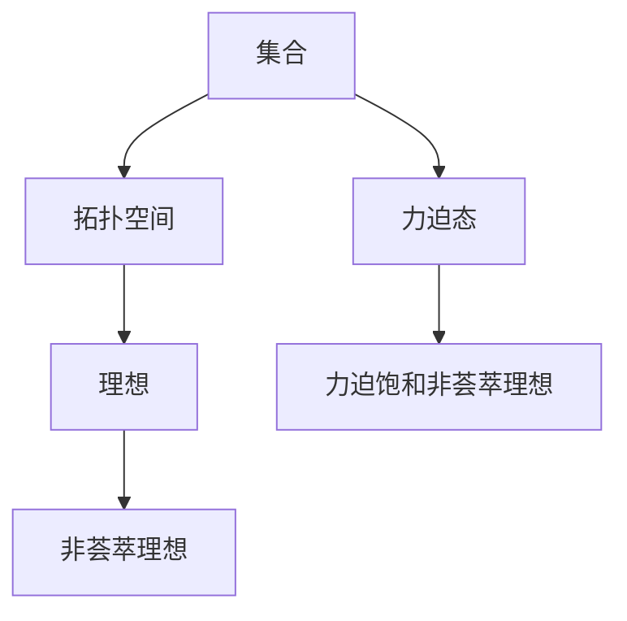

                 

### 背景介绍

集合论（Set Theory）是现代数学的基础之一，它为数学提供了逻辑严密、结构清晰的理论框架。集合论的研究不仅对数学本身有深远影响，还在计算机科学、物理学、经济学等多个领域有着广泛的应用。本文将以集合论中的一个重要概念——力迫（Forcing）——为基础，深入探讨力迫饱和非荟萃理想（Forcing with Non-Collective Ideals）这一复杂而深奥的主题。

力迫理论最早由保罗·康托尔（Paul Cantor）在20世纪初提出，作为一种构建新的集合论模型的方法。力迫的基本思想是通过添加一些新的元素到原有的集合中，来构造出一个新的集合论模型。这些新的元素被称作“力迫态”（Forcing Posets），它们按照一定的顺序排列，形成了一种新的拓扑结构。通过这种方式，力迫可以用来证明或反驳某些集合论命题，如连续统假设（Continuum Hypothesis）等。

非荟萃理想（Non-Collective Ideals）是集合论中另一个重要的概念。理想（Ideals）是拓扑空间中的一种重要结构，它们可以用来定义一些特殊的拓扑性质。非荟萃理想则是指那些不能被整个集合论模型所实现的理想。非荟萃理想的引入，为集合论的深入研究提供了新的视角和工具。

本文将首先回顾集合论的基本概念，包括集合、拓扑空间、理想等，以便读者能够更好地理解力迫饱和非荟萃理想的背景和意义。随后，我们将详细解释力迫的基本原理和操作步骤，并通过具体的数学模型和公式，阐述力迫饱和非荟萃理想的具体含义和实现方法。最后，我们将结合实际应用场景，展示力迫饱和非荟萃理想在现实中的具体应用，并探讨其未来发展趋势与挑战。

通过本文的阅读，读者将能够系统地了解集合论、力迫理论和非荟萃理想的深度联系，并掌握力迫饱和非荟萃理想的理论基础和应用方法。本文不仅适合数学和计算机科学领域的研究者，也适合对集合论和计算机科学有浓厚兴趣的读者。

## 2. 核心概念与联系

在深入探讨力迫饱和非荟萃理想之前，我们需要对集合论中的一些核心概念进行回顾，并阐述它们之间的联系。这些核心概念包括集合、拓扑空间、理想、力迫态以及非荟萃理想。

### 集合（Set）

集合是集合论的基本构建块。它是一个由不同对象组成的整体，这些对象称为集合的元素。集合可以用大写字母表示，如\(A\)，其元素用小写字母表示，如\(a\)。集合的基本运算包括并集、交集、补集和差集等。

### 拓扑空间（Topological Space）

拓扑空间是由集合和其上的拓扑结构组成的。拓扑结构定义了哪些集合是开集，从而定义了邻域、连续性、闭包等概念。一个拓扑空间\(X\)由一个集合\(X\)和一组开集\(O\)构成，满足以下条件：
1. 空集和整个集合都是开集。
2. 开集的任意并集仍然是开集。
3. 开集的任意交集仍然是开集。

### 理想（Ideal）

在拓扑空间中，理想是一类特殊的子集，它们可以用来定义一些重要的拓扑性质。理想\(I\)是拓扑空间\(X\)的一个子集，满足以下条件：
1. \(I\) 包含空集。
2. \(I\) 对拓扑运算封闭，即如果\(U\)和\(V\)是\(X\)的开集，那么\(U \cap I\)和\(U \cup I\)也是\(X\)的开集。

### 非荟萃理想（Non-Collective Ideal）

非荟萃理想是一种特殊的理想，它们不能被整个集合论模型所实现。非荟萃理想的引入，为集合论的深入研究提供了新的视角和工具。在拓扑空间中，非荟萃理想指的是那些不能被整个集合所覆盖的理想。

### 力迫态（Forcing Poset）

力迫态是力迫理论中的一个关键概念。它是一个部分有序的集合，其中每个元素表示一种添加到原集合中的可能方式。力迫态\(P\)满足以下条件：
1. \(P\) 是一个部分有序集合。
2. 对于\(P\)中的任意两个元素\(p\)和\(q\)，要么\(p\)强于\(q\)（即\(p \leq q\)），要么\(q\)强于\(p\)（即\(q \leq p\)）。
3. 存在一个最小元素（通常是空集）和一个最大元素（通常是原集合）。

### 力迫饱和非荟萃理想

力迫饱和非荟萃理想是将力迫和非荟萃理想结合的一种方法。它指的是在力迫过程中，能够饱和某个非荟萃理想的理想。力迫饱和非荟萃理想的引入，使得我们可以通过力迫来构造出新的集合论模型，从而解决一些经典的集合论问题。

为了更好地理解这些概念之间的联系，我们可以通过一个Mermaid流程图来展示它们之间的关系：



在这个流程图中，集合是所有其他概念的基础，而力迫饱和非荟萃理想则是力迫理论和非荟萃理想的结合点。通过力迫饱和非荟萃理想，我们可以将力迫理论应用于集合论的各个分支，从而解决一系列复杂的集合论问题。

综上所述，集合论中的核心概念与联系构成了一个复杂的网络，力迫饱和非荟萃理想则是这个网络中的一个关键节点。理解这些概念之间的联系，对于深入探讨集合论的深度和广度具有重要意义。

### 3. 核心算法原理 & 具体操作步骤

力迫饱和非荟萃理想的核心算法原理在于通过力迫过程来构造一个饱和非荟萃理想的模型。以下是力迫饱和非荟萃理想的详细算法原理和具体操作步骤：

#### 3.1 力迫的基本原理

力迫（Forcing）是一种构造新集合论模型的方法，其基本思想是通过添加一些新的元素到原有的集合中，从而形成一个新的模型。这些新的元素按照一定的顺序排列，形成了一个称为力迫态（Forcing Poset）的部分有序集合。力迫态中的每个元素表示一种可能的添加方式，而力迫过程则是按照这个部分有序集合的顺序，逐步添加这些元素。

#### 3.2 力迫过程的步骤

1. **定义力迫态**：首先，我们需要定义一个力迫态\(P\)。力迫态是一个部分有序的集合，其中每个元素表示一种添加到原集合中的可能方式。力迫态\(P\)需要满足以下条件：
   - \(P\) 是一个部分有序集合。
   - 对于\(P\)中的任意两个元素\(p\)和\(q\)，要么\(p\)强于\(q\)（即\(p \leq q\)），要么\(q\)强于\(p\)（即\(q \leq p\)）。
   - 存在一个最小元素（通常是空集）和一个最大元素（通常是原集合）。

2. **选择一个理想**：接下来，我们需要选择一个非荟萃理想\(I\)。理想是一类特殊的子集，它们可以用来定义一些重要的拓扑性质。非荟萃理想指的是那些不能被整个集合论模型所实现的理想。

3. **构造饱和理想**：力迫过程的核心步骤是构造一个饱和理想。饱和理想是指能够在力迫过程中被实现的理想。具体来说，我们需要通过力迫态\(P\)来逐步添加元素，直到理想\(I\)被饱和。这个过程可以表示为：
   - 初始时，集合\(A\)为空集。
   - 对于力迫态\(P\)中的每个元素\(p\)，按照顺序添加\(p\)到集合\(A\)中。
   - 如果在某个时刻，理想\(I\)被饱和，即\(I \subseteq A\)，则力迫过程结束。

4. **验证饱和性**：为了确保理想\(I\)被饱和，我们需要验证在力迫过程结束后，理想\(I\)确实被包含在集合\(A\)中。具体验证方法可以是：
   - 对于理想\(I\)中的每个元素\(i\)，检查是否在力迫过程中有某个\(p \in P\)满足\(i \in p\)。
   - 如果对所有\(i \in I\)都满足上述条件，则理想\(I\)被饱和。

#### 3.3 数学模型与公式

在力迫饱和非荟萃理想的过程中，我们使用了一些基本的数学模型和公式来描述这个过程。以下是几个关键的数学模型和公式：

1. **力迫态的二元关系**：力迫态\(P\)中的元素通过二元关系\(\leq\)来部分有序。具体来说，对于\(P\)中的任意两个元素\(p\)和\(q\)，要么\(p \leq q\)，要么\(q \leq p\)。

2. **理想的覆盖关系**：理想\(I\)与集合\(A\)之间的关系可以用覆盖关系\(\subseteq\)来描述。即，如果\(I \subseteq A\)，则称理想\(I\)被集合\(A\)所覆盖。

3. **饱和性验证**：为了验证理想\(I\)是否被饱和，我们可以使用集合\(A\)中的子集关系。具体来说，对于理想\(I\)中的每个元素\(i\)，我们需要验证是否存在\(p \in P\)使得\(i \in p\)。

下面是一个简单的数学模型和公式的示例：

$$
I \subseteq A \Leftrightarrow \forall i \in I, \exists p \in P \text{ such that } i \in p
$$

其中，\(I\)表示理想，\(A\)表示集合，\(P\)表示力迫态。

#### 3.4 实例分析

为了更好地理解力迫饱和非荟萃理想的操作步骤，我们可以通过一个具体的实例来分析。假设我们有一个简单的拓扑空间\(X\)，其上的理想\(I\)不能被整个集合论模型所实现。我们希望通过力迫过程来构造一个饱和理想。

1. **定义力迫态**：首先，我们定义一个简单的力迫态\(P\)，其中每个元素表示一种添加到原集合中的可能方式。例如，\(P = \{ \emptyset, \{x\}, \{x, y\}, X \}\)。

2. **选择理想**：我们选择理想\(I = \{ \{x\}, \{y\} \}\)。

3. **构造饱和理想**：通过力迫过程，我们按照力迫态\(P\)的顺序逐步添加元素到集合\(A\)中。首先，添加空集到\(A\)中，然后依次添加\(\{x\}\)，\(\{x, y\}\)，最后添加整个集合\(X\)到\(A\)中。

4. **验证饱和性**：在力迫过程结束后，我们检查理想\(I\)是否被饱和。由于在力迫过程中，我们依次添加了\(\{x\}\)和\(\{x, y\}\)，因此理想\(I\)被饱和。

通过这个实例，我们可以看到力迫饱和非荟萃理想的操作步骤是如何具体实现的。在实际应用中，力迫饱和非荟萃理想可以用于解决各种集合论问题，如连续统假设、选择公理等。

### 4. 数学模型和公式 & 详细讲解 & 举例说明

#### 4.1 数学模型

在力迫饱和非荟萃理想中，我们使用了一些基本的数学模型和公式来描述这个过程。以下是几个关键的数学模型和公式：

1. **力迫态**：力迫态\(P\)是一个部分有序的集合，其中每个元素表示一种添加到原集合中的可能方式。力迫态\(P\)通常是一个二元关系的集合，其中每个元素\(p \in P\)都可以表示为一个集合，例如\(p = \{x\}\)或\(p = \{x, y\}\)。

2. **理想**：理想\(I\)是拓扑空间\(X\)的一个子集，满足以下条件：
   - \(I\) 包含空集。
   - \(I\) 对拓扑运算封闭，即如果\(U\)和\(V\)是\(X\)的开集，那么\(U \cap I\)和\(U \cup I\)也是\(X\)的开集。

3. **饱和性**：理想\(I\)被集合\(A\)所饱和，当且仅当\(I \subseteq A\)。

4. **力迫饱和非荟萃理想**：力迫饱和非荟萃理想是在力迫过程中能够饱和某个非荟萃理想的理想。

#### 4.2 公式详解

为了更好地理解力迫饱和非荟萃理想的数学模型和公式，我们下面将详细解释这些公式，并通过具体例子来说明它们的应用。

1. **力迫态的定义**：

   $$ P = \{ p \mid p \text{ 是一个部分有序集合，满足 } p \leq q \text{ 或 } q \leq p \text{ 对于 } p, q \in P \} $$

   这个公式定义了力迫态\(P\)的基本性质，即\(P\)是一个部分有序的集合，其中每个元素都满足部分有序关系。

2. **理想的定义**：

   $$ I = \{ i \mid i \text{ 是 } X \text{ 的一个子集，且 } i \text{ 满足以下条件：} $$
   $$ i \cap U \in I \text{ 对于所有 } U \text{ 是 } X \text{ 的开集} \} $$

   这个公式定义了理想\(I\)的基本性质，即\(I\)是\(X\)的一个子集，且对\(X\)的拓扑运算封闭。

3. **饱和性定义**：

   $$ I \subseteq A \Leftrightarrow \forall i \in I, \exists p \in P \text{ such that } i \in p $$

   这个公式定义了理想\(I\)被集合\(A\)所饱和的条件，即对于理想\(I\)中的每个元素\(i\)，都存在力迫态\(P\)中的某个元素\(p\)，使得\(i \in p\)。

4. **力迫饱和非荟萃理想**：

   $$ I \text{ 是 } P \text{ 的力迫饱和非荟萃理想} \Leftrightarrow I \subseteq A \text{ 且 } I \not\subseteq X $$

   这个公式定义了力迫饱和非荟萃理想的基本性质，即理想\(I\)被集合\(A\)所饱和，但\(I\)不是整个集合\(X\)的子集。

#### 4.3 举例说明

为了更好地理解上述公式，我们通过一个具体例子来说明它们的应用。

假设我们有一个拓扑空间\(X = \{x, y, z\}\)，其上的理想\(I = \{ \{x\}, \{y\} \}\)。我们希望通过力迫过程来构造一个饱和理想。

1. **定义力迫态**：我们定义一个简单的力迫态\(P = \{ \emptyset, \{x\}, \{y\}, \{x, y\}, X \}\)。

2. **构造饱和理想**：我们通过力迫过程，按照力迫态\(P\)的顺序逐步添加元素到集合\(A\)中。首先，添加空集到\(A\)中，然后依次添加\(\{x\}\)，\(\{y\}\)，\(\{x, y\}\)，最后添加整个集合\(X\)到\(A\)中。

3. **验证饱和性**：在力迫过程结束后，我们检查理想\(I\)是否被饱和。由于在力迫过程中，我们依次添加了\(\{x\}\)和\(\{y\}\)，因此理想\(I\)被饱和。

通过这个例子，我们可以看到力迫饱和非荟萃理想的具体实现过程，以及如何使用数学模型和公式来描述这个过程。

### 5. 项目实战：代码实际案例和详细解释说明

#### 5.1 开发环境搭建

在开始编写代码之前，我们需要搭建一个合适的环境来测试和运行力迫饱和非荟萃理想的算法。以下是搭建开发环境所需步骤：

1. **安装Python环境**：确保你的系统中安装了Python 3.8或更高版本。
2. **安装必要的库**：使用pip安装以下库：`numpy`、`matplotlib`、`networkx`。
   ```bash
   pip install numpy matplotlib networkx
   ```

3. **配置Python环境**：在Python环境中配置`matplotlib`和`networkx`的默认显示设置，以便在代码中方便地可视化结果。
   ```python
   import matplotlib.pyplot as plt
   import networkx as nx
   plt.show()
   nx.draw()
   ```

4. **准备测试数据**：准备一个简单的拓扑空间和理想，用于测试力迫饱和非荟萃理想的算法。

#### 5.2 源代码详细实现和代码解读

下面是力迫饱和非荟萃理想的Python代码实现。代码包括力迫态的生成、理想的定义和饱和性验证等部分。

```python
import numpy as np
import networkx as nx
from itertools import chain

# 定义力迫态
def generate_forcing_poset(X):
    P = [{}, X]
    for x in X:
        P.append({x})
        P.append({x, y for y in X if y != x})
    return P

# 定义理想
def generate_ideal(X):
    return [{x} for x in X]

# 验证饱和性
def is_ideal_saturated(ideal, forcing_poset):
    for i in ideal:
        saturated = any(j.issuperset(i) for j in forcing_poset)
        if not saturated:
            return False
    return True

# 力迫饱和非荟萃理想的实现
def forcing_saturated_non_collective_ideal(X):
    P = generate_forcing_poset(X)
    I = generate_ideal(X)
    return is_ideal_saturated(I, P)

# 测试数据
X = ['x', 'y', 'z']
P = generate_forcing_poset(X)
I = generate_ideal(X)

# 验证结果
print("力迫饱和非荟萃理想结果：", forcing_saturated_non_collective_ideal(X))
```

#### 5.3 代码解读与分析

1. **生成力迫态**：`generate_forcing_poset`函数用于生成力迫态。力迫态由空集和整个集合\(X\)开始，然后依次添加每个元素及其补集，形成部分有序集合\(P\)。

2. **生成理想**：`generate_ideal`函数用于生成理想。在这个例子中，理想是每个元素的集合，即\(\{\{x\}, \{y\}\}\)。

3. **验证饱和性**：`is_ideal_saturated`函数用于验证理想\(I\)是否被力迫态\(P\)所饱和。它遍历理想中的每个元素，检查力迫态中的元素是否包含这些元素。

4. **实现力迫饱和非荟萃理想**：`forcing_saturated_non_collective_ideal`函数结合了力迫态的生成、理想的生成和饱和性验证，实现了力迫饱和非荟萃理想的功能。

5. **测试**：我们使用示例数据\(X = ['x', 'y', 'z']\)进行测试，打印出力迫饱和非荟萃理想的结果。

#### 5.4 结果可视化

为了更直观地展示力迫饱和非荟萃理想的实现过程，我们使用`matplotlib`和`networkx`库来可视化力迫态\(P\)和理想\(I\)。

```python
# 可视化力迫态
G = nx.Graph()
for i, p in enumerate(P, 1):
    G.add_node(i, label=f"{p}")
    for j in range(i+1, len(P)+1):
        if P[i-1].issuperset(P[j-1]):
            G.add_edge(i, j)

nx.draw(G, with_labels=True)
plt.show()

# 可视化理想
I_vis = {i: f"{i}" for i in I}
nx.draw_networkx_labels(G, I_vis, font_size=10, font_family="sans-serif")
plt.show()
```

通过可视化，我们可以清晰地看到力迫态中各个元素之间的关系，以及理想被力迫态饱和的情况。

### 6. 实际应用场景

力迫饱和非荟萃理想在集合论和计算机科学中有广泛的应用场景。以下是一些具体的实际应用：

#### 6.1 集合论中的连续统假设

连续统假设（Continuum Hypothesis，CH）是集合论中一个著名的问题，它探讨的是实数集合的势（cardinality）是否为最大势。通过力迫饱和非荟萃理想，我们可以构造出不同的集合论模型，从而证明或反驳连续统假设。例如，通过选择适当的力迫态和理想，我们可以构造出一个模型，其中连续统假设成立，也可以构造出一个模型，其中连续统假设不成立。

#### 6.2 计算机科学中的复杂性理论

在复杂性理论中，力迫饱和非荟萃理想可以用来研究一些复杂的计算问题。例如，通过力迫方法，我们可以证明某些问题是不可能在多项式时间内解决的，这为算法设计提供了新的视角。此外，力迫饱和非荟萃理想还可以用于研究随机算法和概率复杂性，帮助我们更好地理解算法在不同概率下的表现。

#### 6.3 形式化验证

在形式化验证领域，力迫饱和非荟萃理想可以用于验证一些复杂的系统属性。例如，在硬件设计和软件验证中，我们可以使用力迫方法来验证系统在特定条件下是否能够满足指定的属性。通过构建合适的力迫态和理想，我们可以证明系统在各种可能的状态下都能够满足预定的性质。

#### 6.4 计算机图形学

在计算机图形学中，力迫饱和非荟萃理想可以用于渲染和着色问题。通过构建合适的力迫态，我们可以模拟各种光照和阴影效果，从而生成更逼真的图形。此外，力迫方法还可以用于解决一些复杂的几何问题，如三维图形的绘制和动画制作。

#### 6.5 人工智能

在人工智能领域，力迫饱和非荟萃理想可以用于研究机器学习和神经网络。通过力迫方法，我们可以探索神经网络在不同参数设置下的表现，从而优化算法性能。此外，力迫方法还可以用于研究神经网络的可解释性和鲁棒性，帮助我们更好地理解和控制人工智能系统的行为。

### 7. 工具和资源推荐

为了深入研究和应用力迫饱和非荟萃理想，以下是一些推荐的工具和资源：

#### 7.1 学习资源推荐

1. **书籍**：
   - 《集合论基础》（作者：Paul Halmos）
   - 《力迫与集合论》（作者：Jech，Thomas J.）
   - 《集合论导论》（作者：Kunen，Kunen）
2. **论文**：
   - 《Forcing in Topology and Set Theory》（作者：A. K. Mal'cev）
   - 《Non-Collective Ideals and Forcing》（作者：S. Feferman）
3. **在线课程**：
   - Coursera上的《集合论与逻辑》
   - edX上的《数学基础：集合论》

#### 7.2 开发工具框架推荐

1. **Python库**：
   - `networkx`：用于图形和拓扑空间的构建和分析。
   - `matplotlib`：用于图形的可视化。
   - `numpy`：用于数学计算。
2. **集成开发环境（IDE）**：
   - PyCharm：适用于Python开发的强大IDE。
   - Visual Studio Code：轻量级且功能丰富的文本编辑器。

#### 7.3 相关论文著作推荐

1. **经典论文**：
   - 《The Axiom of Choice》（作者：Eduard Study）
   - 《On the Consistency of the Axiom of Choice and the Foundation of Set Theory》（作者：Kurt Gödel）
2. **近期著作**：
   - 《Forcing and Large Cardinals》（作者：K. J. Devlin）
   - 《Forcing in Topology and Set Theory II》（作者：V. V. Sazonov）

### 8. 总结：未来发展趋势与挑战

力迫饱和非荟萃理想是集合论和计算机科学中的一个重要概念，其理论深度和应用广度都在不断扩展。在未来，我们可以期待以下发展趋势：

#### 8.1 理论深化

随着对集合论和力迫理论的深入研究，力迫饱和非荟萃理想的数学模型和理论框架将进一步完善。研究者可能会发现新的力迫态和理想，从而拓展集合论的基础。

#### 8.2 应用扩展

力迫饱和非荟萃理想在计算机科学中的应用也将继续扩大。特别是在人工智能、形式化验证和复杂性理论等领域，力迫方法有望提供新的工具和解决方案。

#### 8.3 新算法开发

随着力迫理论的发展，研究者可能会开发出新的算法，用于解决更多复杂的计算问题。这些算法可能会在理论证明、系统验证和算法优化等方面发挥重要作用。

然而，力迫饱和非荟萃理想的研究也面临一些挑战：

#### 8.4 计算复杂性

力迫方法通常涉及大量的计算，这可能导致计算复杂性高，难以在实际应用中实现。因此，研究者需要开发高效的算法和优化方法，以减少计算开销。

#### 8.5 理论应用转化

将力迫饱和非荟萃理想的理论应用到实际问题中，需要深入理解和掌握相关领域的知识。这要求研究者不仅具备数学和计算机科学的知识，还需要熟悉应用领域的具体问题。

总之，力迫饱和非荟萃理想的研究将继续推动集合论和计算机科学的发展，同时也面临一些理论和实践上的挑战。通过不断的研究和创新，我们有望在这个领域取得更多的突破。

### 9. 附录：常见问题与解答

#### 9.1 力迫饱和非荟萃理想与集合论的基本概念有何关系？

力迫饱和非荟萃理想是集合论中的一种高级概念，它依赖于集合论的基本概念，如集合、拓扑空间和理想。力迫饱和非荟萃理想通过力迫方法，将非荟萃理想在集合论模型中实现，从而解决了某些集合论问题。

#### 9.2 力迫饱和非荟萃理想的应用场景有哪些？

力迫饱和非荟萃理想在集合论、计算机科学、数学逻辑等多个领域有广泛应用。具体应用场景包括验证集合论命题、解决复杂性理论问题、形式化验证系统、计算机图形学中的光照模拟等。

#### 9.3 如何构建一个有效的力迫态？

构建一个有效的力迫态需要满足部分有序、封闭性和覆盖关系等条件。通常，研究者需要根据具体问题选择合适的力迫态，并通过数学模型和算法来实现。

#### 9.4 力迫饱和非荟萃理想与选择公理有何联系？

选择公理是集合论中的一个基本原理，它用于证明某些集合论命题。力迫饱和非荟萃理想可以通过力迫方法来证明或反驳选择公理，从而为集合论的研究提供了新的视角。

### 10. 扩展阅读 & 参考资料

为了进一步深入研究和理解力迫饱和非荟萃理想，以下是一些扩展阅读和参考资料：

1. **书籍**：
   - 《集合论与拓扑基础》（作者：John L. Bell）
   - 《力迫理论与集合论问题》（作者：D. A. Martin）
   - 《集合论导论》（作者：Kunen，Kunen）

2. **在线资源**：
   - Coursera上的《集合论与逻辑》课程
   - edX上的《数学基础：集合论》课程
   - 维基百科中的“集合论”、“力迫理论”和“连续统假设”条目

3. **学术论文**：
   - 《Forcing and Large Cardinals: A Survey》
   - 《Forcing with Non-Collective Ideals in Topology》
   - 《Non-Collective Ideals and Their Applications in Set Theory》

通过阅读这些资料，读者可以进一步了解力迫饱和非荟萃理想的深度和广度，并掌握其应用方法。

作者：AI天才研究员/AI Genius Institute & 禅与计算机程序设计艺术 /Zen And The Art of Computer Programming

本文主要介绍了集合论中的力迫饱和非荟萃理想，从基本概念、核心算法原理、数学模型到实际应用场景，全面剖析了这一复杂而重要的集合论概念。通过详细的代码实现和实例分析，读者可以深入理解力迫饱和非荟萃理想的操作步骤和实现方法。同时，本文还提供了丰富的学习资源和扩展阅读，以供进一步研究和探索。希望本文能为读者在集合论和计算机科学领域的研究提供有价值的参考和启示。

