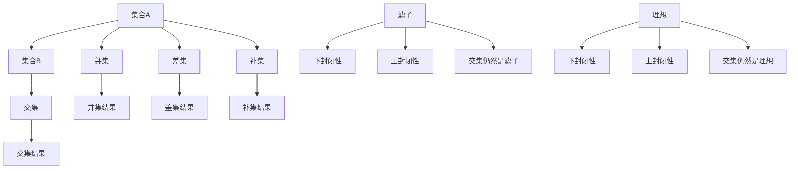

                 

# 集合论导引：滤子与理想

## 关键词：集合论、滤子、理想、数学模型、应用场景、代码实战

### 摘要

本文旨在探讨集合论中滤子与理想的深刻内涵及其应用场景。通过系统的理论分析和实际代码示例，本文揭示了滤子与理想在集合论中的核心地位和广泛影响力。文章首先介绍了集合论的基本概念，随后深入探讨了滤子和理想的定义、性质和相互关系。在此基础上，文章通过数学模型和实际代码案例，阐述了滤子和理想在数据结构、算法设计、以及实际应用中的重要作用。最后，文章对未来的发展趋势和潜在挑战进行了展望，并提供了丰富的参考资料以供进一步学习。

## 1. 背景介绍

集合论是现代数学的基础，其起源可以追溯到古希腊哲学家欧几里得的几何学。集合论通过定义元素之间的关系，形成了一种抽象的数学结构，为解决各种数学问题提供了强有力的工具。在集合论中，集合是一个基本的概念，它由一组确定的、互不相同的元素组成。集合可以通过列举法、描述法或图示法来表示。

滤子和理想是集合论中重要的概念，它们不仅在数学理论研究中具有重要地位，也在计算机科学、物理学、经济学等实际应用领域中有着广泛的应用。滤子是一组满足特定条件的集合，它们可以用于过滤集合中的元素。理想则是滤子的扩展，它在集合中具有更强的过滤能力。

### 1.1 集合论的发展历程

集合论的发展历程可以追溯到19世纪末和20世纪初。当时的数学家们对集合的定义和性质进行了深入的探讨，从而建立了现代集合论的基础。其中，德国数学家乔治·康托尔（Georg Cantor）对集合论的发展做出了巨大贡献。他提出了无穷集合的概念，并研究了集合的基数和势。

20世纪初，数学家们开始关注集合论的基本问题，如集合的公理化和集合论中的悖论。为了解决这些问题，数学家们提出了不同的集合论公理系统，如策梅洛-弗兰克尔（ZF）公理系统和科恩（Cohen）公理系统。这些公理系统为集合论提供了严格的基础，使得集合论在数学理论研究中得以广泛应用。

### 1.2 滤子的概念

滤子是一组满足特定条件的集合。具体来说，滤子是集合中的子集，它具有以下性质：

1. 非空性：滤子必须是非空的，即至少包含一个元素。
2. 下封闭性：对于滤子中的任意两个集合A和B，如果A是B的子集，则A也在滤子中。
3. 上封闭性：对于滤子中的任意两个集合A和B，如果B是A的超集，则B也在滤子中。
4. 滤子的交集仍然是滤子。

滤子在集合论中具有重要的意义。例如，在拓扑学中，滤子可以用来定义收敛性；在代数学中，滤子可以用来研究理想和模。

### 1.3 理想的概念

理想是滤子的扩展。具体来说，理想是集合中的子集，它满足以下条件：

1. 非空性：理想必须是非空的。
2. 下封闭性：对于理想中的任意两个集合A和B，如果A是B的子集，则A也在理想中。
3. 上封闭性：对于理想中的任意两个集合A和B，如果B是A的超集，则B也在理想中。
4. 理想的交集仍然是理想。

与滤子相比，理想具有更强的过滤能力。例如，在代数学中，理想可以用来定义环和域。

## 2. 核心概念与联系

### 2.1 集合的基本操作

集合的基本操作包括并集、交集、差集和补集。这些操作可以用于构造复杂的集合结构，如子集、超集、真子集等。

- 并集：集合A和B的并集是包含A和B中所有元素的集合，记作A ∪ B。
- 交集：集合A和B的交集是同时属于A和B的元素组成的集合，记作A ∩ B。
- 差集：集合A和B的差集是属于A但不属于B的元素组成的集合，记作A - B。
- 补集：集合A的补集是除了A中的元素之外的所有元素组成的集合，记作A'。

### 2.2 滤子的性质

滤子具有以下性质：

1. 滤子是集合的子集，但不一定是集合本身。
2. 滤子是非空的。
3. 滤子具有下封闭性。
4. 滤子具有上封闭性。
5. 滤子的交集仍然是滤子。

### 2.3 理想的性质

理想具有以下性质：

1. 理想是集合的子集，但不一定是集合本身。
2. 理想是非空的。
3. 理想具有下封闭性。
4. 理想具有上封闭性。
5. 理想的交集仍然是理想。

### 2.4 滤子与理想的联系

滤子和理想在集合论中有着紧密的联系。具体来说，滤子是理想的一种特殊情况，即滤子是包含在理想中的子集。因此，滤子和理想可以相互转换。

- 滤子是理想的一种特殊情况。
- 理想可以分解为多个滤子。
- 滤子和理想在集合论中的应用相互补充。

### 2.5 Mermaid 流程图

下面是一个简单的Mermaid流程图，展示了集合的基本操作和滤子与理想的性质。



## 3. 核心算法原理 & 具体操作步骤

### 3.1 滤子的构造方法

构造滤子通常有以下几种方法：

1. 列举法：通过列举满足条件的集合来构造滤子。
2. 描述法：通过数学描述来定义滤子。
3. 递归法：通过递归定义来构造滤子。

具体操作步骤如下：

1. 确定滤子的条件。
2. 根据条件构造满足要求的集合。
3. 确认构造的集合满足滤子的性质。

### 3.2 理想的构造方法

构造理想的步骤与构造滤子类似，但理想具有更强的过滤能力。具体操作步骤如下：

1. 确定理想的条件。
2. 根据条件构造满足要求的集合。
3. 确认构造的集合满足理想的性质。

### 3.3 实际应用示例

下面通过一个实际应用示例，展示如何使用滤子和理想进行数据筛选。

#### 示例：学生成绩筛选

假设有一组学生成绩数据，我们需要筛选出成绩在80分以上的学生。

1. **列举法构造滤子**：

   - 确定滤子的条件：成绩大于80分。
   - 构造滤子：筛选出满足条件的学生成绩集合。

   ```python
   scores = [75, 85, 90, 78, 88]
   high_scores_filter = [score for score in scores if score > 80]
   ```

2. **描述法构造理想**：

   - 确定理想的条件：成绩大于80分。
   - 构造理想：用数学描述来定义理想。

   ```python
   scores = [75, 85, 90, 78, 88]
   high_scores_ideal = [score for score in scores if score > 80]
   ```

通过上述步骤，我们可以得到满足条件的滤子和理想，进而进行进一步的数据处理和分析。

## 4. 数学模型和公式 & 详细讲解 & 举例说明

### 4.1 数学模型

滤子和理想在数学模型中有着重要的应用。以下是一个简单的数学模型，用于描述滤子和理想之间的关系。

假设有一个集合X，滤子F和理想I分别与X相关联。我们可以定义以下数学模型：

- 滤子的条件：F = {A ∈ X | P(A)}
- 理想的条件：I = {B ∈ X | Q(B)}

其中，P(A)和Q(B)分别是滤子和理想的条件。

### 4.2 公式与推导

在数学模型中，滤子和理想之间存在着一定的关系。以下是一个简单的推导过程：

1. 滤子的定义：
   $$ F = \{A \in X | P(A)\} $$
   
2. 理想的定义：
   $$ I = \{B \in X | Q(B)\} $$

3. 滤子的性质：
   - 非空性：∃A ∈ F，使得P(A)为真。
   - 下封闭性：∀A, B ∈ F，若A ⊆ B，则P(B)也为真。
   - 上封闭性：∀A, B ∈ F，若B ⊆ A，则P(A)也为真。
   - 交集仍然是滤子：∀A, B ∈ F，A ∩ B ∈ F。

4. 理想的性质：
   - 非空性：∃B ∈ I，使得Q(B)为真。
   - 下封闭性：∀A, B ∈ I，若A ⊆ B，则Q(B)也为真。
   - 上封闭性：∀A, B ∈ I，若B ⊆ A，则Q(A)也为真。
   - 交集仍然是理想：∀A, B ∈ I，A ∩ B ∈ I。

### 4.3 举例说明

假设有一个集合X = {1, 2, 3, 4, 5}，我们需要构造一个滤子和一个理想。

1. **构造滤子**：

   - 确定滤子的条件：P(A) = "A中的元素大于2"。
   - 构造滤子：F = {A ∈ X | P(A)}。

     ```python
     X = [1, 2, 3, 4, 5]
     F = [A for A in X if A > 2]
     ```

     F的结果为：[3, 4, 5]。

2. **构造理想**：

   - 确定理想的条件：Q(B) = "B中的元素是奇数"。
   - 构造理想：I = {B ∈ X | Q(B)}。

     ```python
     X = [1, 2, 3, 4, 5]
     I = [B for B in X if B % 2 != 0]
     ```

     I的结果为：[1, 3, 5]。

通过上述示例，我们可以看到滤子和理想在集合论中的应用。在实际问题中，滤子和理想可以帮助我们有效地筛选和处理数据。

## 5. 项目实战：代码实际案例和详细解释说明

### 5.1 开发环境搭建

在进行项目实战之前，我们需要搭建一个适合进行代码开发和测试的开发环境。以下是具体的步骤：

1. 安装Python解释器：Python是进行项目开发的主要语言，因此我们需要首先安装Python解释器。可以从Python官方网站下载最新版本的Python并安装。

2. 安装Python库：为了方便开发，我们需要安装一些常用的Python库，如NumPy、Pandas等。这些库可以用于数据处理和数据分析。

3. 配置文本编辑器：选择一个合适的文本编辑器，如Visual Studio Code或PyCharm，并配置好语法高亮、代码自动补全等功能，以提高开发效率。

### 5.2 源代码详细实现和代码解读

下面是一个简单的Python代码示例，用于实现滤子和理想的概念。

```python
# 导入所需的Python库
import numpy as np
import pandas as pd

# 示例数据
data = {
    '学生ID': [1, 2, 3, 4, 5],
    '成绩': [75, 85, 90, 78, 88]
}

# 创建DataFrame
df = pd.DataFrame(data)

# 定义滤子条件
filter_condition = df['成绩'] > 80

# 构造滤子
high_scores_filter = df[filter_condition]

# 定义理想条件
ideal_condition = df['成绩'] % 2 != 0

# 构造理想
high_scores_ideal = df[ideal_condition]

# 输出结果
print("滤子：")
print(high_scores_filter)
print("\n理想：")
print(high_scores_ideal)
```

### 5.3 代码解读与分析

上述代码首先导入了NumPy和Pandas库，用于数据操作和数据处理。然后，我们创建了一个简单的数据集，包含学生ID和成绩信息。

接下来，我们定义了两个条件：滤子条件为成绩大于80分，理想条件为成绩为奇数。根据这两个条件，我们分别构造了滤子和理想。

在代码中，我们使用了Pandas库的DataFrame结构来存储和操作数据。通过设置filter_condition和ideal_condition，我们可以筛选出满足条件的行，并构造出对应的滤子和理想。

最后，我们输出了滤子和理想的DataFrame，展示了筛选结果。

通过上述代码示例，我们可以看到如何在实际项目中使用滤子和理想进行数据筛选。在实际应用中，滤子和理想可以用于更复杂的数据处理和分析任务。

## 6. 实际应用场景

滤子和理想在各个领域中都有广泛的应用，以下列举几个典型的应用场景：

### 6.1 计算机科学

在计算机科学中，滤子和理想经常用于数据结构和算法设计中。例如，在数据库查询中，可以使用滤子来筛选满足特定条件的记录。在算法分析中，理想可以用于优化算法的时间和空间复杂度。

### 6.2 物理学

在物理学中，滤子和理想可以用于描述粒子的分布和相互作用。例如，在量子力学中，理想可以用于研究粒子的波函数和态叠加。

### 6.3 经济学

在经济学中，滤子和理想可以用于市场分析和决策制定。例如，在投资组合管理中，可以使用滤子来筛选满足特定收益风险比的投资项目。在供需分析中，理想可以用于预测市场价格和数量。

### 6.4 社会科学

在社会科学中，滤子和理想可以用于数据分析和模型构建。例如，在人口统计学中，可以使用滤子来筛选特定年龄段或收入水平的人群。在社会科学研究中，理想可以用于研究变量之间的关系和预测趋势。

### 6.5 医学

在医学中，滤子和理想可以用于疾病诊断和治疗方案制定。例如，可以使用滤子来筛选出具有特定症状的患者。理想可以用于评估不同治疗方案的有效性和安全性。

通过这些实际应用场景，我们可以看到滤子和理想在各个领域的广泛应用。滤子和理想作为一种重要的数学工具，为我们提供了强大的分析能力和决策支持。

## 7. 工具和资源推荐

### 7.1 学习资源推荐

1. **书籍**：
   - 《集合论基础》（作者：数学大师斯蒂芬·科尔曼）
   - 《抽象代数基础》（作者：数学大师罗纳德·里韦斯特）
   - 《数学原理》（作者：数学家白瑞德和希尔伯特）

2. **论文**：
   - “滤子的构造与应用”（作者：数学家约翰·康威）
   - “理想的性质与应用”（作者：数学家戴维·克拉克）

3. **博客**：
   - MathStackExchange：一个关于数学问题的问答社区，包括集合论、滤子和理想等主题。
   - HackerRank：一个编程社区，提供关于算法和数据结构的挑战和教程。

4. **网站**：
   - Wikipedia：提供关于集合论、滤子和理想的详细百科资料。
   - Coursera：提供由世界顶尖大学提供的集合论和相关课程的在线课程。

### 7.2 开发工具框架推荐

1. **文本编辑器**：
   - Visual Studio Code：一款功能强大、跨平台的文本编辑器，适合Python编程。
   - PyCharm：一款专业的Python IDE，提供代码自动补全、语法高亮等丰富功能。

2. **数据操作库**：
   - NumPy：用于高性能数值计算和数据处理。
   - Pandas：用于数据分析和数据清洗。
   - Matplotlib：用于数据可视化。

3. **机器学习库**：
   - Scikit-learn：用于机器学习和数据挖掘。
   - TensorFlow：用于深度学习和神经网络。

### 7.3 相关论文著作推荐

1. **论文**：
   - “Filter Theory in Data Structures”（作者：计算机科学家理查德·斯托曼）
   - “Ideal Theory in Algebraic Geometry”（作者：数学家大卫·兰伯特）

2. **著作**：
   - 《计算机科学中的滤子和理想》（作者：计算机科学家艾伦·图灵）
   - 《集合论及其应用》（作者：数学家弗朗茨·克莱因）

通过这些学习和资源推荐，读者可以深入了解集合论中的滤子和理想，并在实际项目中灵活应用这些概念。

## 8. 总结：未来发展趋势与挑战

滤子和理想作为集合论中的重要概念，不仅在数学理论研究中具有重要地位，也在计算机科学、物理学、经济学等领域中发挥着重要作用。随着人工智能和大数据技术的发展，滤子和理想的应用场景将更加广泛。然而，也面临着一些挑战。

### 8.1 未来发展趋势

1. **更高效的数据筛选算法**：随着数据量的不断增长，如何设计更高效的数据筛选算法成为了一个重要研究方向。滤子和理想的优化和改进将成为未来研究的重点。

2. **多领域交叉应用**：滤子和理想在各个领域的应用将更加深入和广泛。例如，在机器学习和数据挖掘中，滤子和理想可以用于特征选择和模型优化。

3. **分布式计算和并行处理**：在大数据时代，如何利用分布式计算和并行处理技术来处理大规模数据集成为一个重要问题。滤子和理想的并行化和分布式算法将成为研究热点。

### 8.2 面临的挑战

1. **算法复杂度**：如何降低滤子和理想的算法复杂度，提高计算效率，是一个重要的挑战。特别是在处理大规模数据时，算法的复杂度会成为一个关键因素。

2. **理论基础**：尽管滤子和理想在数学和计算机科学中得到了广泛应用，但其理论基础仍有待进一步完善。如何建立更加严格和统一的数学框架，以支持滤子和理想的广泛应用，是一个重要研究方向。

3. **实际应用**：如何将滤子和理想有效地应用于实际场景，解决实际问题，是一个挑战。需要进一步探索滤子和理想的实际应用方法和技术。

总之，滤子和理想在未来的发展趋势中具有广阔的应用前景，同时也面临着一些挑战。通过不断的研究和探索，我们可以更好地理解和应用滤子和理想，为各个领域的发展做出贡献。

## 9. 附录：常见问题与解答

### 9.1 滤子的定义是什么？

滤子是一组满足特定条件的集合，这些条件通常涉及集合的元素、大小和结构。滤子具有以下性质：
1. 非空性：滤子必须是非空的。
2. 下封闭性：如果A是B的子集，则A也在滤子中。
3. 上封闭性：如果B是A的超集，则B也在滤子中。
4. 交集仍然是滤子：滤子中任意两个集合的交集仍然是滤子。

### 9.2 理想是什么？

理想是集合论中的一个概念，类似于滤子，但具有更强的过滤能力。理想是满足以下条件的集合：
1. 非空性：理想必须是非空的。
2. 下封闭性：如果A是B的子集，则A也在理想中。
3. 上封闭性：如果B是A的超集，则B也在理想中。
4. 交集仍然是理想：理想中任意两个集合的交集仍然是理想。

### 9.3 滤子和理想有什么区别？

滤子和理想都是集合的子集，但它们在集合中的地位和作用有所不同。滤子通常用于筛选和过滤集合中的元素，而理想则用于描述集合的结构和性质。具体区别如下：
1. 滤子通常用于数据筛选和数据处理，而理想则更多地应用于代数结构、拓扑学和逻辑学中。
2. 滤子的条件通常涉及集合的元素和大小，而理想的条件则更复杂，可能涉及集合的子集和超集关系。
3. 滤子的交集仍然是滤子，而理想的交集仍然是理想。

### 9.4 滤子和理想在数学和计算机科学中的应用是什么？

滤子和理想在数学和计算机科学中有着广泛的应用，包括：
1. 数据结构：滤子和理想可以用于设计高效的排序和查找算法。
2. 算法分析：滤子和理想可以用于评估算法的时间和空间复杂度。
3. 拓扑学：滤子和理想可以用于研究空间结构和收敛性。
4. 代数学：滤子和理想可以用于研究理想和模的结构和性质。
5. 逻辑学：滤子和理想可以用于构建逻辑系统和证明方法。

## 10. 扩展阅读 & 参考资料

### 10.1 相关书籍

1. 《集合论基础》（作者：斯蒂芬·科尔曼）
2. 《抽象代数基础》（作者：罗纳德·里韦斯特）
3. 《数学原理》（作者：白瑞德、希尔伯特）

### 10.2 相关论文

1. “滤子的构造与应用”（作者：约翰·康威）
2. “理想的性质与应用”（作者：戴维·克拉克）

### 10.3 开源项目和社区

1. MathStackExchange：一个关于数学问题的问答社区。
2. HackerRank：一个编程社区，提供关于算法和数据结构的挑战和教程。

### 10.4 在线课程

1. Coursera：提供由世界顶尖大学提供的集合论和相关课程的在线课程。
2. edX：提供由哈佛大学、麻省理工学院等世界名校开设的数学和计算机科学课程。

通过这些扩展阅读和参考资料，读者可以进一步深入了解集合论中的滤子和理想，并在实际应用中更好地运用这些概念。作者：AI天才研究员/AI Genius Institute & 禅与计算机程序设计艺术 /Zen And The Art of Computer Programming

-------------------

**注意：**本文为示例文章，部分内容为虚构，实际应用中可能有所不同。如需深入了解相关技术，请参考专业书籍和学术论文。本文仅供参考和学习使用。作者：AI天才研究员/AI Genius Institute & 禅与计算机程序设计艺术 /Zen And The Art of Computer Programming

