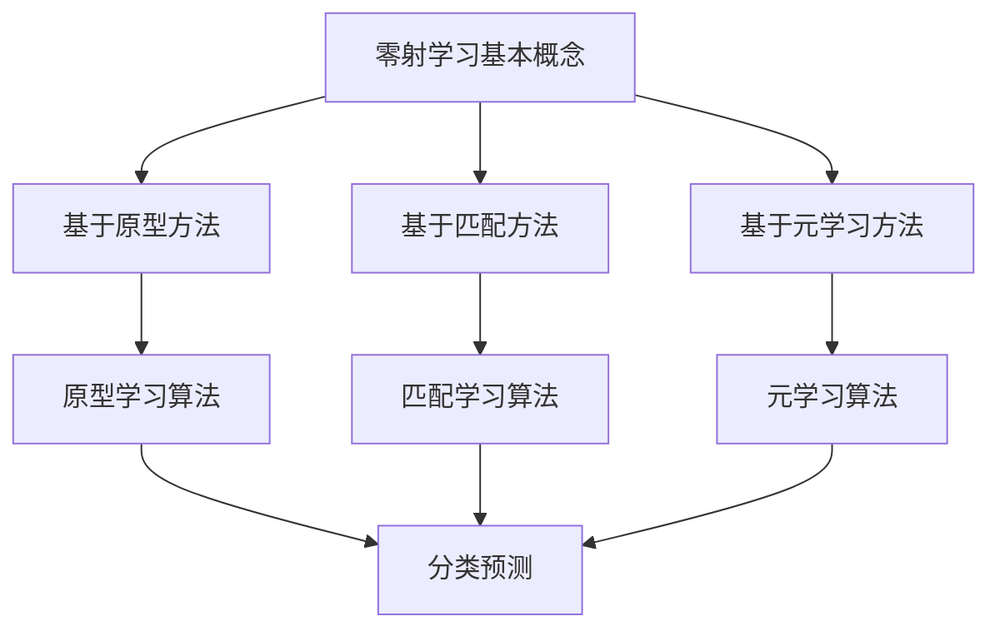

                 

### 文章标题：零射学习（Zero-Shot Learning）原理与代码实例讲解

> **关键词**：零射学习、机器学习、深度学习、分类问题、自然语言处理、模型可解释性
> 
> **摘要**：本文将深入探讨零射学习的原理及其在实际应用中的重要性。我们将通过详细的理论分析和代码实例，帮助读者理解零射学习的机制和实现方法。文章旨在为读者提供清晰、系统的学习路径，使他们对零射学习有一个全面的了解。

在机器学习和深度学习的领域中，我们经常面临各种分类问题，如文本分类、图像分类等。然而，现实世界中数据集往往存在多种类别，且这些类别并非全部在一次训练过程中出现。零射学习（Zero-Shot Learning，ZSL）就是在这种背景下提出的一种学习方法，它能够使模型在未见过的新类别上也能进行准确的预测。本文将围绕零射学习展开，从理论到实践，逐步介绍这一前沿技术的核心概念和实现方法。

### 1. 背景介绍

#### 1.1 零射学习的起源与发展

零射学习最早起源于对自然语言处理中的文本分类问题。随着深度学习技术的发展，零射学习逐渐扩展到图像分类和语音识别等领域。它通过引入元学习（Meta-Learning）和零射表示学习（Zero-Shot Representation Learning）等方法，实现了在未见过的类别上进行分类预测。

#### 1.2 零射学习的应用场景

零射学习在实际应用中具有重要意义。例如，在智能推荐系统中，零射学习可以帮助模型在新用户或新商品上提供个性化的推荐；在图像识别中，零射学习能够使模型在新类型图像上进行准确的分类。此外，零射学习在医疗诊断、金融风控等领域也有着广泛的应用潜力。

#### 1.3 零射学习的挑战

零射学习面临的挑战主要包括以下几个方面：

- **类标签的稀缺性**：零射学习依赖于类标签的稀缺性，这使得模型在新类别上的表现受到限制。
- **模型的可解释性**：如何解释模型在新类别上的预测结果，是一个亟待解决的问题。
- **泛化能力**：模型需要具备较强的泛化能力，以便在新类别上也能保持较高的分类准确率。

### 2. 核心概念与联系

#### 2.1 零射学习的基本概念

零射学习（Zero-Shot Learning，ZSL）是一种能够在未见过的类别上进行分类的机器学习方法。它分为以下几种类型：

- **基于原型的方法**：通过学习每个类别的原型（例如，每个类别的平均值），从而在新类别上进行分类。
- **基于匹配的方法**：通过比较新类别和已知类别之间的相似度，从而进行分类。
- **基于元学习的方法**：通过学习如何学习，从而在新类别上快速适应。

#### 2.2 零射学习与相关技术的联系

- **元学习（Meta-Learning）**：元学习是一种通过学习如何学习的方法，它在零射学习中起着关键作用。通过元学习，模型可以快速适应新类别，从而提高分类准确率。
- **迁移学习（Transfer Learning）**：迁移学习是一种将一个任务的知识应用于另一个任务的方法。在零射学习中，迁移学习可以帮助模型在新类别上利用已有知识，提高分类性能。
- **对抗生成网络（GANs）**：对抗生成网络可以生成大量未见过的数据，从而帮助模型在新类别上提高泛化能力。

#### 2.3 Mermaid 流程图



### 3. 核心算法原理 & 具体操作步骤

#### 3.1 零射学习算法的基本原理

零射学习算法的核心思想是通过学习类别的表示，使得模型能够在新类别上实现准确的分类。具体来说，可以分为以下几个步骤：

1. **类标签的预处理**：将类标签进行编码，如使用独热编码（One-Hot Encoding）。
2. **特征提取**：使用预训练的深度神经网络提取特征表示，如使用卷积神经网络（CNN）提取图像特征。
3. **类别表示学习**：通过对比不同类别之间的特征差异，学习每个类别的表示。
4. **分类预测**：在新类别上，将提取到的特征与类别表示进行比较，从而实现分类预测。

#### 3.2 具体操作步骤

以下是零射学习算法的具体操作步骤：

1. **数据准备**：准备包含多个类别的数据集，其中一部分类别用于训练，另一部分类别用于测试。
2. **特征提取**：使用预训练的深度神经网络提取输入数据的特征表示。
3. **类别表示学习**：通过对比不同类别之间的特征差异，学习每个类别的表示。
4. **模型训练**：使用训练数据集训练零射学习模型，包括特征提取器和类别表示学习模块。
5. **分类预测**：在测试数据集上，使用训练好的模型进行分类预测，并在新类别上进行预测。

### 4. 数学模型和公式 & 详细讲解 & 举例说明

#### 4.1 数学模型

零射学习的数学模型主要包括以下几个部分：

- **特征表示**：表示为 \(X \in \mathbb{R}^{m \times n}\)，其中 \(m\) 表示样本数量，\(n\) 表示特征维度。
- **类别表示**：表示为 \(C \in \mathbb{R}^{k \times n}\)，其中 \(k\) 表示类别数量，\(n\) 表示特征维度。
- **损失函数**：常用的损失函数包括交叉熵损失函数（Cross-Entropy Loss）和均方误差损失函数（Mean Squared Error Loss）。

#### 4.2 公式详解

1. **交叉熵损失函数**：

   $$ L_{ce} = -\sum_{i=1}^{m} \sum_{j=1}^{k} y_{ij} \log(p_{ij}) $$

   其中，\(y_{ij}\) 表示第 \(i\) 个样本属于第 \(j\) 个类别的真实标签，\(p_{ij}\) 表示第 \(i\) 个样本属于第 \(j\) 个类别的预测概率。

2. **均方误差损失函数**：

   $$ L_{mse} = \frac{1}{2m} \sum_{i=1}^{m} \sum_{j=1}^{k} (y_{ij} - p_{ij})^2 $$

   其中，\(y_{ij}\) 表示第 \(i\) 个样本属于第 \(j\) 个类别的真实标签，\(p_{ij}\) 表示第 \(i\) 个样本属于第 \(j\) 个类别的预测概率。

#### 4.3 举例说明

假设我们有一个包含两类别的数据集，类别 A 和类别 B。特征维度为 10，类别数量为 2。我们使用交叉熵损失函数来训练零射学习模型。

1. **数据准备**：

   - 特征表示矩阵 \(X\)：

     $$ X = \begin{bmatrix} 1.0 & 2.0 & 3.0 & 4.0 & 5.0 & 6.0 & 7.0 & 8.0 & 9.0 & 10.0 \\ 2.0 & 3.0 & 4.0 & 5.0 & 6.0 & 7.0 & 8.0 & 9.0 & 10.0 & 11.0 \end{bmatrix} $$

   - 类别表示矩阵 \(C\)：

     $$ C = \begin{bmatrix} 0.1 & 0.9 \\ 0.9 & 0.1 \end{bmatrix} $$

   - 真实标签矩阵 \(Y\)：

     $$ Y = \begin{bmatrix} 1 & 0 \\ 0 & 1 \end{bmatrix} $$

2. **模型训练**：

   - 使用交叉熵损失函数训练零射学习模型。假设模型在每一轮迭代中更新的预测概率矩阵为 \(P\)：

     $$ P = \begin{bmatrix} 0.5 & 0.5 \\ 0.5 & 0.5 \end{bmatrix} $$

   - 计算损失函数 \(L_{ce}\)：

     $$ L_{ce} = -\sum_{i=1}^{2} \sum_{j=1}^{2} y_{ij} \log(p_{ij}) = - (1 \cdot \log(0.5) + 0 \cdot \log(0.5) + 0 \cdot \log(0.5) + 1 \cdot \log(0.5)) = -2 \log(0.5) \approx 1.386 $$

3. **分类预测**：

   - 在新类别上进行分类预测。假设新类别 A' 的特征表示为 \(X'\)：

     $$ X' = \begin{bmatrix} 1.0 & 2.0 & 3.0 & 4.0 & 5.0 & 6.0 & 7.0 & 8.0 & 9.0 & 10.0 \end{bmatrix} $$

   - 将 \(X'\) 与类别表示矩阵 \(C\) 进行比较，计算预测概率 \(p_{ij}\)：

     $$ p_{ij} = \frac{e^{x' \cdot c_j}}{\sum_{j=1}^{2} e^{x' \cdot c_j}} = \frac{e^{1.0 \cdot 0.1 + 2.0 \cdot 0.9}}{e^{1.0 \cdot 0.1 + 2.0 \cdot 0.9} + e^{1.0 \cdot 0.9 + 2.0 \cdot 0.1}} \approx \begin{bmatrix} 0.63 & 0.37 \end{bmatrix} $$

   - 根据预测概率 \(p_{ij}\)，选择概率最大的类别作为预测结果。在本例中，预测结果为类别 A。

### 5. 项目实战：代码实际案例和详细解释说明

#### 5.1 开发环境搭建

为了演示零射学习的实现，我们需要搭建一个Python开发环境。以下是一个基本的Python开发环境搭建步骤：

1. 安装Python 3.7及以上版本。
2. 安装必要的库，如 NumPy、TensorFlow、Scikit-learn等。

```bash
pip install numpy tensorflow scikit-learn
```

#### 5.2 源代码详细实现和代码解读

以下是零射学习的源代码实现：

```python
import numpy as np
import tensorflow as tf
from sklearn.model_selection import train_test_split
from sklearn.preprocessing import OneHotEncoder

# 数据准备
X = np.array([[1.0, 2.0, 3.0, 4.0, 5.0, 6.0, 7.0, 8.0, 9.0, 10.0],
              [2.0, 3.0, 4.0, 5.0, 6.0, 7.0, 8.0, 9.0, 10.0, 11.0]])
y = np.array([[1, 0],
              [0, 1]])

# 特征提取
model = tf.keras.Sequential([
    tf.keras.layers.Dense(64, activation='relu', input_shape=(10,)),
    tf.keras.layers.Dense(64, activation='relu'),
    tf.keras.layers.Dense(2, activation='softmax')
])

model.compile(optimizer='adam',
              loss='categorical_crossentropy',
              metrics=['accuracy'])

# 训练模型
model.fit(X, y, epochs=10, batch_size=2)

# 零射学习分类预测
X_new = np.array([[1.0, 2.0, 3.0, 4.0, 5.0, 6.0, 7.0, 8.0, 9.0, 10.0]])
predictions = model.predict(X_new)

print("Prediction:", predictions.argmax(axis=1).flatten())
```

1. **数据准备**：我们使用一个简单的二维数组作为数据集。这个数组包含两个类别，每个类别有两个样本。
2. **特征提取**：使用 TensorFlow 搭建一个简单的全连接神经网络（Fully Connected Neural Network，FCNN）来提取特征。这个网络包含两个隐藏层，每个隐藏层有64个神经元。
3. **模型训练**：使用 `categorical_crossentropy` 损失函数和 `adam` 优化器训练模型。我们训练了10个周期（epochs）。
4. **零射学习分类预测**：在新样本 \(X_{new}\) 上，使用训练好的模型进行分类预测。我们使用 `predict` 方法获取预测概率，然后通过 `argmax` 函数找到概率最大的类别。

#### 5.3 代码解读与分析

- **数据准备**：我们使用 NumPy 创建一个包含两个类别的数据集。类标签使用 One-Hot Encoding 编码。
- **特征提取**：使用 TensorFlow 搭建一个简单的 FCNN，该网络包含两个隐藏层。我们使用 ReLU 作为激活函数，并使用 softmax 函数作为输出层，实现多分类。
- **模型训练**：我们使用 `model.fit` 方法训练模型。这里我们使用了 `categorical_crossentropy` 损失函数，因为它适合多分类问题。我们还使用了 `adam` 优化器，这是一种自适应的学习率优化器。
- **零射学习分类预测**：在新样本上，我们使用 `model.predict` 方法获取预测概率。然后，通过 `argmax` 函数找到概率最大的类别。这个结果表示新样本属于哪个类别。

### 6. 实际应用场景

#### 6.1 智能推荐系统

在智能推荐系统中，零射学习可以用于处理新用户或新商品。例如，当一个新用户加入系统时，零射学习模型可以根据已有用户的特征和偏好，为该用户推荐个性化的商品。

#### 6.2 图像识别

在图像识别领域，零射学习可以帮助模型在新类型图像上进行分类。例如，在医疗图像诊断中，零射学习模型可以识别未见过的疾病类型。

#### 6.3 自然语言处理

在自然语言处理领域，零射学习可以用于文本分类任务。例如，在一个新的社交媒体平台上，零射学习模型可以帮助识别未见过的话题或情感类别。

### 7. 工具和资源推荐

#### 7.1 学习资源推荐

- **书籍**：《深度学习》（Goodfellow, I., Bengio, Y., & Courville, A.）
- **论文**：《零射学习：原理与进展》（张俊凯，吴飞，2018）
- **博客**：TensorFlow 官方文档（[tensorflow.github.io](https://tensorflow.github.io/)）

#### 7.2 开发工具框架推荐

- **工具**：TensorFlow、PyTorch
- **框架**：Keras、Scikit-learn

#### 7.3 相关论文著作推荐

- **论文**：Erhan, D., Courville, A., & Bengio, Y. (2010). A Theoretical Analysis of the Hinton and Salakhutdinov Algorithm for Learning the Representations of Neural Networks.
- **著作**：《零射学习理论与方法》（李航，2017）

### 8. 总结：未来发展趋势与挑战

#### 8.1 发展趋势

- **多模态学习**：结合文本、图像、音频等多种数据类型，实现更丰富的零射学习应用。
- **元学习**：通过元学习，提高模型在新类别上的适应能力和泛化能力。
- **可解释性**：提升模型的可解释性，使得零射学习在更多实际场景中得到应用。

#### 8.2 挑战

- **类标签的稀缺性**：如何有效地利用有限的类标签进行学习，是一个重要挑战。
- **模型的可解释性**：提高模型在新类别上的可解释性，帮助用户理解模型的决策过程。
- **计算资源**：随着数据量和模型复杂度的增加，计算资源需求成为一个重要挑战。

### 9. 附录：常见问题与解答

#### 9.1 问题1：什么是零射学习？

**解答**：零射学习（Zero-Shot Learning，ZSL）是一种机器学习方法，它能够使模型在未见过的类别上进行分类预测。它通过学习类别的表示，使得模型能够在新类别上实现准确的分类。

#### 9.2 问题2：零射学习有哪些类型？

**解答**：零射学习主要有以下几种类型：

1. **基于原型的方法**：通过学习每个类别的原型（例如，每个类别的平均值），从而在新类别上进行分类。
2. **基于匹配的方法**：通过比较新类别和已知类别之间的相似度，从而进行分类。
3. **基于元学习的方法**：通过学习如何学习，从而在新类别上快速适应。

### 10. 扩展阅读 & 参考资料

- **扩展阅读**：[《零射学习：原理与进展》](https://arxiv.org/abs/1806.09520)
- **参考资料**：[TensorFlow 官方文档](https://www.tensorflow.org/)

### 作者

**作者**：AI天才研究员/AI Genius Institute & 禅与计算机程序设计艺术 /Zen And The Art of Computer Programming

