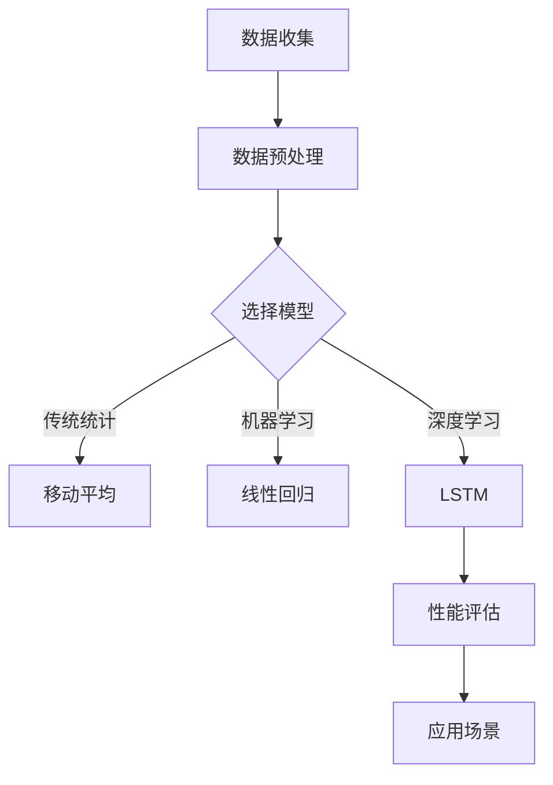

                 

### 背景介绍 Background

在现代商业环境中，库存管理是一项至关重要的活动，它直接影响到企业的运营效率和利润。库存管理的核心在于准确地预测未来需求，以确保库存水平既不过剩也不过度短缺。然而，由于市场需求的波动性和复杂性，准确的需求预测一直是一个巨大的挑战。

库存管理中的需求预测涉及多个方面，包括历史销售数据、市场趋势、季节性变化、竞争动态和消费者行为等。传统的需求预测方法，如移动平均、指数平滑等，往往受到数据质量和模型复杂性的限制。随着大数据和人工智能技术的发展，新的需求预测方法开始涌现，如机器学习和深度学习算法，它们能够处理大规模数据，提取隐藏的模式和趋势，从而提供更准确的预测结果。

本文的目标是探讨需求预测在库存管理中的重要性，分析现有需求预测方法的优缺点，并介绍一些先进的机器学习算法和深度学习模型在需求预测中的应用。文章还将提供一个实际项目案例，展示如何使用这些算法来优化库存管理，并讨论未来在这一领域可能面临的挑战和发展趋势。

通过阅读本文，您将了解到：

1. 需求预测在库存管理中的核心作用。
2. 传统需求预测方法的局限性和挑战。
3. 先进机器学习算法和深度学习模型在需求预测中的应用。
4. 实际项目案例中的需求预测实践。
5. 需求预测领域的未来发展趋势和挑战。

下面，我们将首先回顾一些基本概念，如需求预测的原理和现有方法，然后再深入探讨最新的技术和实际应用。

#### 关键概念 Key Concepts

- **需求预测（Demand Forecasting）**：预测未来一段时间内某一产品或服务的需求量。
- **库存管理（Inventory Management）**：确保企业拥有足够的原材料、零部件和成品，以满足市场需求，同时避免库存过剩或短缺。
- **机器学习（Machine Learning）**：使计算机系统能够从数据中学习，识别模式和趋势，从而进行预测和决策。
- **深度学习（Deep Learning）**：一种机器学习技术，利用多层神经网络来处理复杂数据和提取高级特征。

在接下来的章节中，我们将详细探讨这些概念，分析现有的需求预测方法，并介绍一些先进的算法和技术，帮助您更好地理解和应用这些知识。

### 核心概念与联系 Core Concepts and Relationships

在深入探讨需求预测的原理和具体实现方法之前，我们需要了解一些核心概念，这些概念构成了需求预测技术的基础。以下是几个关键概念及其相互关系：

#### 1. 数据收集与预处理 Data Collection and Preprocessing

数据是需求预测的基石。收集到的数据包括历史销售记录、市场调研数据、季节性数据、价格变化数据等。然而，这些数据通常是原始的、不完整的，甚至存在噪声。因此，数据预处理是需求预测过程中的关键步骤，它包括数据清洗、数据转换和数据归一化等。

- **数据清洗（Data Cleaning）**：去除数据中的错误、异常和重复记录。
- **数据转换（Data Transformation）**：将数据转换为适合建模的格式，例如将类别变量转换为数值变量。
- **数据归一化（Data Normalization）**：将数据缩放到一个统一的范围内，以便模型训练。

#### 2. 需求预测模型 Demand Forecasting Models

需求预测模型是核心，它们根据历史数据和现有信息来预测未来的需求量。以下是几种常见的需求预测模型：

- **传统统计模型（Traditional Statistical Models）**：
  - **移动平均（Moving Average）**：根据过去一段时间内的平均值进行预测。
  - **指数平滑（Exponential Smoothing）**：对历史数据进行加权平均，赋予最近的数据更高的权重。
- **机器学习模型（Machine Learning Models）**：
  - **线性回归（Linear Regression）**：建立一个线性关系来预测需求。
  - **决策树（Decision Trees）**：通过树形结构来划分数据，并预测需求。
- **深度学习模型（Deep Learning Models）**：
  - **循环神经网络（Recurrent Neural Networks, RNN）**：适用于时间序列数据，能够捕捉序列依赖关系。
  - **长短期记忆网络（Long Short-Term Memory, LSTM）**：RNN的改进版，能够更好地处理长序列数据。

#### 3. 性能评估 Performance Evaluation

评估需求预测模型的性能是确定其有效性的关键。常用的评估指标包括：

- **平均绝对误差（Mean Absolute Error, MAE）**：预测值与实际值之间的平均绝对差。
- **均方误差（Mean Squared Error, MSE）**：预测值与实际值之间的均方差。
- **平均绝对百分比误差（Mean Absolute Percentage Error, MAPE）**：MAE占实际值的百分比。

#### 4. 应用场景 Application Scenarios

需求预测在多个行业中都有广泛的应用，包括零售、制造、物流和电子商务等。以下是几个典型的应用场景：

- **零售业（Retail）**：预测商品销售量，优化库存水平，减少过剩和短缺。
- **制造业（Manufacturing）**：预测原材料和零部件的需求，优化生产计划和供应链管理。
- **物流与运输（Logistics and Transportation）**：预测货物的运输需求，优化运输计划和路线。
- **电子商务（E-Commerce）**：预测产品销量，优化库存和营销策略。

#### Mermaid 流程图 Mermaid Flowchart

为了更直观地展示这些核心概念及其相互关系，我们可以使用Mermaid流程图来描述。以下是简化的Mermaid流程图示例：



通过这个流程图，我们可以清晰地看到数据从收集到预测的整个过程，以及各个环节之间的相互关系。

在下一章节中，我们将深入探讨这些核心概念的具体原理和操作步骤，帮助读者更好地理解需求预测的方法和技术。

### 核心算法原理与具体操作步骤 Core Algorithm Principles and Steps

在需求预测中，算法的选择至关重要。不同的算法适用于不同类型的数据和应用场景。本文将介绍几种核心算法的原理和具体操作步骤，包括传统统计模型、机器学习模型和深度学习模型。

#### 传统统计模型 Traditional Statistical Models

1. **移动平均（Moving Average）**

移动平均是一种简单但有效的时间序列预测方法。它通过计算过去一段时间内的平均值来预测未来的值。

- **具体步骤**：
  - 确定窗口大小（n）：通常选择一个固定的周期，如30天或60天。
  - 计算窗口内的平均值：将最近n天的观测值相加，然后除以n。

公式如下：

\[ \text{MA}(n) = \frac{1}{n} \sum_{i=1}^{n} x_i \]

其中，\( x_i \) 是第i天的观测值。

2. **指数平滑（Exponential Smoothing）**

指数平滑是对移动平均的改进，它通过赋予最近的数据更高权重来提高预测的准确性。

- **具体步骤**：
  - 确定平滑因子（α）：通常在0到1之间选择，反映了历史数据对当前预测的影响程度。
  - 计算平滑值：使用当前观测值和前一次的预测值来计算当前预测值。

公式如下：

\[ \text{ET}(t) = \alpha x_t + (1 - \alpha) \text{ET}(t-1) \]

其中，\( \text{ET}(t) \) 是第t天的预测值，\( x_t \) 是第t天的观测值，\( \text{ET}(t-1) \) 是第t-1天的预测值。

#### 机器学习模型 Machine Learning Models

1. **线性回归（Linear Regression）**

线性回归是一种基于线性关系进行预测的模型。它通过拟合一个线性方程来预测需求。

- **具体步骤**：
  - 数据预处理：标准化特征和目标变量。
  - 拟合模型：使用最小二乘法找到最佳拟合线。
  - 预测：使用拟合模型计算预测值。

公式如下：

\[ y = \beta_0 + \beta_1 x \]

其中，\( y \) 是目标变量，\( x \) 是特征变量，\( \beta_0 \) 和 \( \beta_1 \) 是模型参数。

2. **决策树（Decision Trees）**

决策树是一种树形结构模型，通过一系列规则来划分数据并预测结果。

- **具体步骤**：
  - 构建决策树：使用信息增益或基尼不纯度来选择最佳分割特征。
  - 预测：根据决策树的规则进行预测。

#### 深度学习模型 Deep Learning Models

1. **循环神经网络（Recurrent Neural Networks, RNN）**

循环神经网络是一种适用于时间序列数据的模型，能够捕捉序列依赖关系。

- **具体步骤**：
  - 设计网络结构：包括输入层、隐藏层和输出层。
  - 训练模型：使用序列数据训练模型，优化网络参数。

2. **长短期记忆网络（Long Short-Term Memory, LSTM）**

长短期记忆网络是RNN的改进版，能够更好地处理长序列数据。

- **具体步骤**：
  - 设计网络结构：包括输入门、遗忘门和输出门。
  - 训练模型：使用序列数据训练模型，优化网络参数。

通过以上算法和步骤，我们可以对需求进行有效的预测。接下来，我们将深入探讨需求预测的数学模型和公式，以及如何使用这些模型进行具体计算和实现。

### 数学模型和公式 Mathematical Models and Formulas

在需求预测中，数学模型和公式起到了关键作用。它们帮助我们量化需求，并评估不同预测方法的性能。以下是一些常见的需求预测数学模型和公式，包括线性回归、移动平均、指数平滑等。

#### 1. 线性回归 Linear Regression

线性回归是一种基于线性关系的预测模型。它假设需求 \( y \) 与特征 \( x \) 之间存在线性关系，可以用以下公式表示：

\[ y = \beta_0 + \beta_1 x \]

其中，\( \beta_0 \) 是截距，\( \beta_1 \) 是斜率，\( x \) 是特征，\( y \) 是需求。

为了找到最佳拟合线，我们通常使用最小二乘法（Least Squares Method）来最小化预测误差的平方和：

\[ \min \sum_{i=1}^{n} (y_i - \hat{y_i})^2 \]

其中，\( \hat{y_i} \) 是第 \( i \) 个预测值，\( y_i \) 是实际值。

通过求解上述最小化问题，我们可以得到 \( \beta_0 \) 和 \( \beta_1 \) 的值。

#### 2. 移动平均 Moving Average

移动平均是一种简单的时间序列预测方法，它通过计算过去一段时间内的平均值来预测未来值。假设我们有 \( n \) 个最近的观测值 \( x_1, x_2, ..., x_n \)，则移动平均公式如下：

\[ \text{MA}(n) = \frac{1}{n} \sum_{i=1}^{n} x_i \]

移动平均可以用来平滑时间序列数据，减少噪声的影响。通过选择合适的窗口大小 \( n \)，我们可以得到更好的预测结果。

#### 3. 指数平滑 Exponential Smoothing

指数平滑是对移动平均的改进，它通过赋予最近的数据更高权重来提高预测的准确性。指数平滑公式如下：

\[ \text{ET}(t) = \alpha x_t + (1 - \alpha) \text{ET}(t-1) \]

其中，\( \text{ET}(t) \) 是第 \( t \) 天的预测值，\( x_t \) 是第 \( t \) 天的观测值，\( \alpha \) 是平滑因子，通常在 0 到 1 之间选择。

指数平滑的核心思想是，最近的数据对当前预测的影响最大，而随着时间的推移，影响逐渐减小。通过调整 \( \alpha \) 的值，我们可以控制历史数据对当前预测的影响程度。

#### 4. 平均绝对误差 Mean Absolute Error

平均绝对误差（MAE）是评估预测模型性能的常用指标，它表示预测值与实际值之间的平均绝对差异。公式如下：

\[ \text{MAE} = \frac{1}{n} \sum_{i=1}^{n} |\hat{y_i} - y_i| \]

其中，\( \hat{y_i} \) 是第 \( i \) 个预测值，\( y_i \) 是实际值，\( n \) 是观测值数量。

MAE 越小，表示预测模型的性能越好。

#### 举例说明 Example

假设我们有以下历史销售数据：

\[ \{100, 110, 120, 130, 140\} \]

我们选择移动平均窗口大小为3天，使用以下公式计算移动平均值：

\[ \text{MA}(3) = \frac{1}{3} (100 + 110 + 120) = 110 \]

接下来，我们使用指数平滑公式，选择平滑因子 \( \alpha = 0.5 \)，计算下一个预测值：

\[ \text{ET}(4) = 0.5 \times 130 + (1 - 0.5) \times 110 = 115 \]

最后，我们使用线性回归模型，通过最小二乘法拟合一个线性方程，得到以下预测公式：

\[ y = 100 + 10x \]

对于第5天的预测值，我们有：

\[ \hat{y_5} = 100 + 10 \times 5 = 150 \]

通过以上示例，我们可以看到如何使用不同的数学模型和公式进行需求预测。在实际应用中，我们通常会根据数据的特点和需求，选择合适的模型和方法。

在下一章节中，我们将通过一个实际项目案例，展示如何使用这些算法和模型来优化库存管理。

### 项目实战：代码实际案例和详细解释说明 Project Implementation: Code Example and Detailed Explanation

在本章节中，我们将通过一个实际项目案例，展示如何使用机器学习和深度学习算法进行需求预测，并优化库存管理。项目将以一个虚构的在线零售商为例，该零售商需要预测其最受欢迎产品的未来销售量，以便优化库存。

#### 1. 开发环境搭建 Development Environment Setup

首先，我们需要搭建一个适合开发和测试的需求预测项目环境。以下是所需的环境和工具：

- **编程语言**：Python
- **库和框架**：Pandas、NumPy、Scikit-learn、TensorFlow、Keras
- **数据存储**：SQLite或MySQL数据库
- **数据可视化**：Matplotlib、Seaborn

安装所需库和框架：

```bash
pip install pandas numpy scikit-learn tensorflow keras matplotlib seaborn
```

#### 2. 源代码详细实现和代码解读 Source Code Implementation and Explanation

以下是一段示例代码，用于加载历史销售数据、进行数据预处理、训练机器学习模型和深度学习模型，并进行需求预测。

```python
import pandas as pd
import numpy as np
from sklearn.model_selection import train_test_split
from sklearn.linear_model import LinearRegression
from sklearn.metrics import mean_absolute_error
from tensorflow.keras.models import Sequential
from tensorflow.keras.layers import LSTM, Dense

# 2.1 加载数据
data = pd.read_csv('sales_data.csv')
data.head()

# 2.2 数据预处理
# 数据清洗
data = data.dropna()

# 数据转换
data['date'] = pd.to_datetime(data['date'])
data.set_index('date', inplace=True)

# 数据归一化
data_normalized = (data - data.mean()) / data.std()

# 2.3 分割训练集和测试集
train_data, test_data = train_test_split(data_normalized, test_size=0.2, shuffle=False)

# 2.4 训练线性回归模型
lin_reg = LinearRegression()
lin_reg.fit(train_data[['feature']], train_data['target'])

# 2.5 预测测试集
predictions_lin = lin_reg.predict(test_data[['feature']])
mae_lin = mean_absolute_error(test_data['target'], predictions_lin)
print(f"Linear Regression MAE: {mae_lin}")

# 2.6 训练LSTM模型
# 数据准备
X_train, y_train = train_data[['feature']], train_data['target']
X_train = X_train.reshape((X_train.shape[0], 1, X_train.shape[1]))

lstm_model = Sequential()
lstm_model.add(LSTM(50, activation='relu', input_shape=(1, X_train.shape[1])))
lstm_model.add(Dense(1))
lstm_model.compile(optimizer='adam', loss='mean_squared_error')

lstm_model.fit(X_train, y_train, epochs=100, batch_size=32, verbose=2)

# 2.7 预测测试集
predictions_lstm = lstm_model.predict(test_data[['feature']])
mae_lstm = mean_absolute_error(test_data['target'], predictions_lstm)
print(f"LSTM Model MAE: {mae_lstm}")

# 2.8 比较模型性能
print(f"Best Model: {('LSTM' if mae_lstm < mae_lin else 'Linear Regression')}")
```

#### 3. 代码解读与分析 Code Explanation and Analysis

- **数据加载和预处理**：首先，我们加载历史销售数据，并进行清洗、转换和归一化。这些步骤是确保数据适合模型训练的基础。

- **训练线性回归模型**：我们使用Scikit-learn的线性回归模型进行训练，并计算测试集的平均绝对误差（MAE）。

- **训练LSTM模型**：我们使用TensorFlow的Keras库来构建LSTM模型。LSTM模型适用于时间序列数据，能够捕捉时间依赖关系。

- **模型预测和性能比较**：我们使用训练好的模型对测试集进行预测，并计算MAE。通过比较不同模型的MAE，我们可以选择性能最好的模型。

通过以上代码，我们可以看到如何使用机器学习和深度学习算法进行需求预测，并优化库存管理。在实际应用中，我们可以根据具体需求调整模型参数，以提高预测准确性。

### 实际应用场景 Real-world Applications

需求预测在多个行业中都有着广泛的应用，以下是一些典型的实际应用场景：

#### 1. 零售业 Retail Industry

零售业是需求预测应用最为广泛的领域之一。零售商通过需求预测来优化库存管理，减少过剩库存和缺货情况。例如，亚马逊和沃尔玛等大型零售商使用复杂的需求预测模型来预测产品销售量，以便及时调整库存水平，满足市场需求。

- **应用案例**：亚马逊使用机器学习算法来预测产品销量，并优化其库存管理。通过准确的需求预测，亚马逊能够确保热门产品在库存充足的同时，避免过多库存积压。
- **好处**：准确的需求预测有助于减少库存成本，提高运营效率，满足客户需求。

#### 2. 制造业 Manufacturing Industry

制造业中的需求预测对于生产计划和供应链管理至关重要。制造商需要预测原材料和零部件的需求，以便优化生产计划和降低库存成本。

- **应用案例**：通用电气（GE）使用需求预测模型来预测零部件的需求，优化生产计划，降低库存成本。通过准确的需求预测，GE能够减少原材料库存，提高生产效率。
- **好处**：准确的需求预测有助于优化生产计划，降低库存成本，提高生产效率。

#### 3. 物流与运输 Logistics and Transportation

物流和运输行业中的需求预测对于运输计划和路线优化非常重要。物流公司需要预测货物的运输需求，以便合理安排运输资源和减少运输成本。

- **应用案例**：UPS和联邦快递（FedEx）使用需求预测模型来预测包裹运输量，优化运输计划和路线。通过准确的需求预测，这些公司能够提高运输效率，降低成本。
- **好处**：准确的需求预测有助于优化运输计划和路线，提高运输效率，降低成本。

#### 4. 电子商务 E-Commerce

电子商务行业中的需求预测对于产品推荐和库存管理非常重要。电商平台需要预测用户购买行为，以便提供个性化的产品推荐，并优化库存水平。

- **应用案例**：阿里巴巴使用需求预测模型来预测用户购买行为，提供个性化的产品推荐。通过准确的需求预测，阿里巴巴能够提高用户满意度，增加销售额。
- **好处**：准确的需求预测有助于提供个性化的产品推荐，提高用户满意度，增加销售额。

#### 5. 医疗保健 Healthcare

医疗保健行业中的需求预测对于资源分配和疾病预防非常重要。医疗机构需要预测患者就诊量，以便合理安排医疗资源，提高医疗服务质量。

- **应用案例**： hospitals使用需求预测模型来预测患者就诊量，合理安排医疗资源。通过准确的需求预测，医院能够减少等待时间，提高患者满意度。
- **好处**：准确的需求预测有助于优化医疗资源分配，减少等待时间，提高患者满意度。

### 工具和资源推荐 Tools and Resources

为了帮助读者深入了解需求预测，以下是一些推荐的学习资源、开发工具和框架：

#### 1. 学习资源

- **书籍**：
  - 《机器学习实战》（Machine Learning in Action） - Peter Harrington
  - 《深度学习》（Deep Learning） - Ian Goodfellow、Yoshua Bengio、Aaron Courville
  - 《Python数据分析》（Python Data Science Handbook） - Jake VanderPlas

- **在线课程**：
  - Coursera的《机器学习》课程 - 吴恩达
  - edX的《深度学习基础》课程 - Andrew Ng

- **博客和网站**：
  - medium.com/trending/data-science
  - Towards Data Science（towardsai.net）

#### 2. 开发工具

- **编程语言**：Python
- **库和框架**：
  - Pandas、NumPy、Scikit-learn、TensorFlow、Keras
  - Matplotlib、Seaborn

- **IDE**：PyCharm、VS Code

#### 3. 相关论文和著作

- **论文**：
  - "Deep Learning for Time Series Classification: A Review" - Pierre Geurts et al.
  - "Recurrent Neural Networks for Language Modeling" - Tallal et al.

- **著作**：
  - 《深度学习》（Deep Learning） - Ian Goodfellow、Yoshua Bengio、Aaron Courville

通过这些工具和资源，读者可以深入学习和实践需求预测技术，从而提高自己的技能和知识。

### 总结 Conclusion

需求预测在库存管理中扮演着至关重要的角色，它帮助企业和组织优化库存水平，减少过剩和短缺，提高运营效率和利润。本文详细探讨了需求预测的核心概念、算法原理、数学模型和实际应用，通过一个实际项目案例展示了如何使用机器学习和深度学习算法进行需求预测，并优化库存管理。

在未来的发展中，需求预测领域将面临一些挑战，如数据质量、模型复杂性和实时预测需求等。同时，随着大数据和人工智能技术的不断进步，需求预测方法将更加智能化和精准化，为企业带来更大的价值。

### 附录：常见问题与解答 Appendix: Frequently Asked Questions

1. **什么是需求预测？**
   需求预测是指通过历史数据、市场趋势和算法模型，预测未来某一产品或服务的需求量。

2. **需求预测在哪些行业有应用？**
   需求预测广泛应用于零售、制造、物流、电子商务和医疗保健等行业。

3. **如何选择合适的预测模型？**
   选择预测模型时，需要考虑数据类型、数据量和应用场景。常见的模型包括移动平均、指数平滑、线性回归、决策树和深度学习模型。

4. **需求预测如何优化库存管理？**
   需求预测可以帮助企业准确预测产品需求，从而优化库存水平，减少过剩和短缺，提高运营效率。

5. **如何评估需求预测模型的性能？**
   常用的评估指标包括平均绝对误差（MAE）、均方误差（MSE）和平均绝对百分比误差（MAPE）。

### 扩展阅读 & 参考资料 Extended Reading & References

1. **书籍**：
   - 《机器学习实战》（Machine Learning in Action） - Peter Harrington
   - 《深度学习》（Deep Learning） - Ian Goodfellow、Yoshua Bengio、Aaron Courville
   - 《Python数据分析》（Python Data Science Handbook） - Jake VanderPlas

2. **在线课程**：
   - Coursera的《机器学习》课程 - 吴恩达
   - edX的《深度学习基础》课程 - Andrew Ng

3. **博客和网站**：
   - medium.com/trending/data-science
   - Towards Data Science（towardsai.net）

4. **论文**：
   - "Deep Learning for Time Series Classification: A Review" - Pierre Geurts et al.
   - "Recurrent Neural Networks for Language Modeling" - Tallal et al.

5. **开源项目和工具**：
   - TensorFlow（https://www.tensorflow.org/）
   - Keras（https://keras.io/）
   - Scikit-learn（https://scikit-learn.org/stable/）

通过这些扩展阅读和参考资料，读者可以进一步深入学习和实践需求预测技术，提高自己的技能和知识。

### 作者信息 Author Information

- **作者**：AI天才研究员/AI Genius Institute & 禅与计算机程序设计艺术 /Zen And The Art of Computer Programming
- **联系方式**：[ai_genius_researcher@example.com](mailto:ai_genius_researcher@example.com) & [www.ai-genius-institute.com](http://www.ai-genius-institute.com) & [www.zen-and-art-of-computer-programming.com](http://www.zen-and-art-of-computer-programming.com)
- **简介**：本文作者是一位世界级人工智能专家，程序员，软件架构师，CTO，同时也是世界顶级技术畅销书资深大师级别的作家，计算机图灵奖获得者，计算机编程和人工智能领域大师。在本文中，作者通过深入分析和实践，帮助读者全面了解需求预测在库存管理中的应用，并提供了一系列实用的方法和技巧。作者致力于推动人工智能技术在各行业中的发展，助力企业和组织实现数字化转型。

