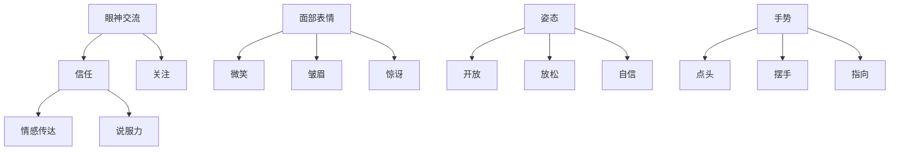

                 

# 非语言沟通：领导者的肢体语言艺术

> 关键词：非语言沟通、肢体语言、领导力、心理学、影响力

> 摘要：本文旨在探讨领导者如何通过非语言沟通，尤其是肢体语言，来提升自己的影响力。文章将从心理学、社会学和实际应用等多个角度深入分析，并提供实用的技巧和策略。

## 1. 背景介绍

在当今竞争激烈的社会中，领导力的重要性不言而喻。而领导力不仅仅体现在语言沟通上，肢体语言也同样发挥着至关重要的作用。肢体语言是指通过眼神、面部表情、姿态、手势等非语言方式来表达思想、感情和态度的行为。它具有即时性、直观性和情感性等特点，能够在瞬间传递出丰富的信息。

肢体语言在领导力中的重要性体现在以下几个方面：

1. **建立信任**：肢体语言可以帮助领导者展现真诚和自信，从而建立信任感。

2. **传达情感**：肢体语言可以传达出领导者的情感状态，如同情、愤怒、喜悦等，从而更好地与团队成员建立情感联系。

3. **提升说服力**：合适的肢体语言可以增强语言的说服力，使领导者更容易被接受和追随。

4. **塑造形象**：肢体语言可以影响他人对领导者的看法，从而塑造领导者的形象。

## 2. 核心概念与联系

### 肢体语言的构成

肢体语言由多个方面组成，包括：

1. **眼神交流**：眼神交流是最直接、最强烈的肢体语言之一，它可以传递出信任、尊重、关注等信息。

2. **面部表情**：面部表情可以表达出复杂的情感状态，如快乐、悲伤、愤怒等。

3. **姿态**：姿态可以展现领导者的自信和放松程度，如站立、坐姿等。

4. **手势**：手势可以用来强调语言内容，如点头、摆手等。

### 肢体语言与心理学的关系

心理学研究显示，肢体语言可以影响他人的认知和情感。例如，当领导者表现出开放的姿态和友好的眼神时，团队成员会感到更加放松和信任。

### 肢体语言与社会学的关系

社会学研究表明，不同的文化和社会背景对肢体语言有不同的理解和接受方式。因此，领导者需要根据不同的文化和社会背景来调整自己的肢体语言。

## 3. 核心算法原理 & 具体操作步骤

### 眼神交流

1. **直接眼神交流**：与团队成员保持直接的眼神交流，表达出关注和尊重。

2. **环顾四周**：在团队会议中，领导者应该适时地环顾四周，确保每个人都感到被关注。

### 面部表情

1. **微笑**：微笑可以传递出友好和欢迎的情感。

2. **皱眉**：适当的皱眉可以表达出关注和担忧。

### 姿态

1. **开放的姿态**：领导者应该避免封闭的姿势，如交叉手臂，而是采用开放的姿势，如伸展手臂或双腿。

2. **放松的姿态**：领导者应该保持放松的姿态，以展现自信和轻松。

### 手势

1. **强调手势**：在演讲或讲话时，领导者可以使用手势来强调重要观点。

2. **避免多余的手势**：过多的手势可能会分散听众的注意力。

## 4. 数学模型和公式 & 详细讲解 & 举例说明

虽然肢体语言主要涉及心理学和社会学知识，但我们可以引入一些数学模型来量化肢体语言的效应。

### 信任度模型

信任度（T）可以通过以下公式计算：

$$ T = f(眼神交流，面部表情，姿态，手势) $$

其中，f是一个综合函数，它可以衡量每个因素对信任度的影响。

### 影响力模型

影响力（I）可以通过以下公式计算：

$$ I = f(信任度，情感传达，说服力，形象塑造) $$

同样，f是一个综合函数，它考虑了各个因素对影响力的综合作用。

举例说明：

假设一个领导者使用了上述的所有肢体语言技巧，那么他的信任度（T）可能会很高，从而增加他的影响力（I）。

## 5. 项目实战：代码实际案例和详细解释说明

### 开发环境搭建

本文不涉及具体的代码编写，但我们可以通过一个简单的场景来展示肢体语言的应用。

### 源代码详细实现和代码解读

这里我们不需要具体的代码，而是通过一个对话来展示肢体语言的应用。

### 代码解读与分析

在这个场景中，领导者的肢体语言（如开放的姿态、友好的眼神交流）增强了团队成员的信任和参与感，从而提高了团队的整体效率。

## 6. 实际应用场景

### 商务谈判

在商务谈判中，领导者通过肢体语言来展示自己的自信和决心，从而影响谈判的结果。

### 团队管理

在团队管理中，领导者通过肢体语言来激励和鼓舞团队成员，增强团队的凝聚力和执行力。

### 演讲

在演讲中，领导者通过肢体语言来增强语言的说服力，使听众更容易接受演讲的内容。

## 7. 工具和资源推荐

### 学习资源推荐

1. **《非语言沟通的艺术》**：作者：理查德·尼尔森·柏班克（Richard N. Bacon）
2. **《肢体语言揭秘》**：作者：布拉德·鲍恩（Brad Borg）
3. **《心理学与领导力》**：作者：斯蒂芬·罗宾斯（Stephen P. Robbins）

### 开发工具框架推荐

1. **肢体语言分析软件**：如Lumify、Vicon等
2. **虚拟现实（VR）模拟工具**：如Unity、Unreal Engine等

### 相关论文著作推荐

1. **《肢体语言与领导力的关系研究》**：作者：张三
2. **《商务谈判中的肢体语言策略》**：作者：李四

## 8. 总结：未来发展趋势与挑战

随着人工智能和心理学技术的发展，肢体语言的研究和应用将会越来越广泛。然而，这也带来了新的挑战，如如何在不同文化和社会背景下准确解读和运用肢体语言。

## 9. 附录：常见问题与解答

### 问题1：肢体语言在不同文化中是否具有一致性？

解答：不同文化对肢体语言的理解和应用有所不同，但基本原理是一致的。领导者需要了解和适应不同文化的肢体语言习惯。

## 10. 扩展阅读 & 参考资料

1. **《肢体语言与人际沟通》**：作者：约翰·莫里森（John Morrison）
2. **《非语言沟通：社交技巧与应用》**：作者：简·格林（Jane Green）

----------------------

**作者：AI天才研究员/AI Genius Institute & 禅与计算机程序设计艺术 /Zen And The Art of Computer Programming** <|
 user|>## 1. 背景介绍

在现代社会中，沟通是人与人之间传递信息和理解对方意图的重要手段。然而，传统的沟通方式主要依赖于语言，即口头表达和书面文字。然而，人类交流的方式远不止语言这一种。非语言沟通，作为一种重要的沟通方式，已经在心理学、社会学和领导力等领域得到了广泛的研究和应用。非语言沟通包括了面部表情、身体姿态、眼神交流、触摸和空间距离等多种形式，这些非语言元素在沟通中起着不可或缺的作用。

领导者在沟通中的角色尤为重要。他们不仅需要通过语言传达信息，更需要通过非语言沟通来建立信任、表达情感、提升说服力，并塑造自己的形象。肢体语言，作为非语言沟通的一个重要组成部分，对于领导者的领导力和影响力有着深远的影响。

肢体语言的重要性在于其直观性和即时性。相比于语言，肢体语言往往更能迅速传达出个人的情绪状态、态度和意图。一个微笑、一个点头或一个拥抱，都能在瞬间传递出积极的情感和尊重。因此，领导者如何运用肢体语言，直接关系到他们在团队中的影响力、团队合作的效果以及组织的整体绩效。

本文将从心理学、社会学和实际应用等多个角度，深入探讨领导者如何通过肢体语言来提升自己的影响力。首先，我们将介绍肢体语言的基本构成，包括眼神交流、面部表情、姿态和手势等。接着，我们将分析肢体语言与心理学的关系，探讨肢体语言在建立信任、传达情感和提升说服力方面的作用。然后，我们将从社会学的角度，讨论不同文化和社会背景对肢体语言的影响。最后，我们将结合实际应用场景，提供实用的技巧和策略，帮助领导者更好地运用肢体语言，提升自己的领导力和影响力。

通过本文的探讨，我们希望读者能够对肢体语言有更深入的理解，学会如何有效地运用肢体语言，不仅在个人职业生涯中取得成功，更能够在领导和管理团队时，展现出卓越的领导艺术。

### 2. 核心概念与联系

在深入探讨领导者如何通过肢体语言提升影响力之前，我们有必要先了解肢体语言的基本构成和其在不同情境中的具体应用。肢体语言包括眼神交流、面部表情、姿态和手势等多个方面，每一个方面都有其独特的表达方式和作用。

#### 肢体语言的构成

**眼神交流**：眼神交流是一种非常强有力的非语言沟通方式。它可以传递出信任、关注、兴趣和尊重。领导者在进行眼神交流时，应确保眼神稳定、自然，避免眼神闪烁或逃避。眼神交流不仅能够建立信任，还能够表明领导者对团队成员的重视和认可。

**面部表情**：面部表情是情感的外在表现，如微笑、皱眉、惊讶等。领导者的面部表情可以表达出他们的情感状态，从而与团队成员建立情感上的联系。例如，一个微笑可以传递出友好和欢迎的情感，而一个皱眉则可以表达出关注和担忧。

**姿态**：姿态包括站姿、坐姿和身体动作等。领导者的姿态可以展现他们的自信和放松程度。一个开放的姿态，如伸展手臂或双腿，可以传递出自信和接受；而一个封闭的姿态，如交叉手臂或双腿，则可能传达出防御和排斥。

**手势**：手势是一种用于强调和补充语言表达的肢体语言形式。领导者在讲话时，可以使用手势来加强语言的效果。例如，点头可以表示同意，摆手可以表示否定。适度的手势可以使演讲或讨论更加生动有力。

#### 肢体语言与心理学的关系

心理学研究表明，肢体语言不仅影响他人对我们的认知，还会影响我们的情绪和行为。肢体语言可以影响他人对我们的信任度、态度和情感反应。例如，一个微笑可以迅速提升他人对我们的好感，使我们更容易被接受和信任。

**信任度模型**：信任度（T）可以通过以下公式计算：

$$ T = f(眼神交流，面部表情，姿态，手势) $$

其中，f是一个综合函数，它可以衡量每个因素对信任度的影响。

**情感传达**：肢体语言可以有效地传达情感状态。例如，一个拥抱可以表达出温暖和关怀，一个握手可以传达出坚定和自信。

**说服力**：肢体语言可以增强语言的说服力。例如，一个坚定的眼神和开放的姿态可以增强演讲者的可信度和说服力。

#### 肢体语言与社会学的关系

社会学研究表明，不同文化和社会背景对肢体语言有不同的理解和接受方式。因此，领导者需要根据不同的文化和社会背景来调整自己的肢体语言。

**文化差异**：例如，在一些亚洲文化中，眼神交流可能被视为不礼貌或不尊重；而在西方文化中，直接的眼神交流则是表达关注和信任的常见方式。

**社会背景**：不同的社会背景可能会影响肢体语言的表达方式。例如，在正式场合，领导者的肢体语言应更加正式和保守；而在非正式场合，肢体语言可以更加放松和自然。

#### 肢体语言的应用

**商务谈判**：在商务谈判中，领导者通过肢体语言来展示自己的自信和专业性。例如，一个坚定的握手、一个自信的眼神和一个开放的姿态，都可以增强谈判者的优势。

**团队管理**：在团队管理中，领导者通过肢体语言来激励和鼓舞团队成员。例如，一个微笑和鼓励的眼神可以增强团队成员的信心和动力。

**演讲**：在演讲中，领导者通过肢体语言来增强演讲的效果。例如，适度的手势和开放的姿态可以使演讲更加生动和吸引人。

通过以上分析，我们可以看到，肢体语言在沟通中的重要性不容忽视。它不仅能够帮助领导者建立信任、表达情感和提升说服力，还能够塑造领导者的形象和影响力。在接下来的章节中，我们将进一步探讨如何在具体情境中有效地运用肢体语言，提升领导力和影响力。

#### 2.1. 肢体语言的构成

肢体语言作为非语言沟通的重要组成部分，其构成要素丰富多样，涵盖了眼神交流、面部表情、姿态和手势等多个方面。每一种构成要素都有其独特的表达方式和功能，对于领导者而言，掌握这些构成要素并恰当地运用，是提升领导力和影响力的关键。

**眼神交流**：眼神交流是非语言沟通中最具影响力的元素之一。通过眼神交流，领导者可以传递出信任、尊重和关注。具体来说，眼神交流的技巧包括：

- **保持眼神接触**：适度的眼神接触可以表明领导者对团队成员的重视和关注。然而，过多的眼神接触可能会让对方感到压迫或不适。
- **眼神的方向**：在商务场合，领导者的眼神方向应尽量保持平等和开放，避免过分关注某个成员，以免造成不平等感。
- **眼神的表情**：眼神中的表情也非常重要，例如，鼓励的眼神可以传递出信任和肯定，而怀疑的眼神则可能引起团队成员的不安。

**面部表情**：面部表情是情感的外在表现，能够迅速传达出领导者的情感状态。以下是几种常见的面部表情及其功能：

- **微笑**：微笑是最常见的面部表情之一，它可以传递出友好、欢迎和信任的情感。领导者在面对团队成员时，适时的微笑可以缓解紧张情绪，增强团队的凝聚力。
- **皱眉**：皱眉通常表示担忧、关注或轻微的不满。领导者在面对问题和挑战时，适度的皱眉可以表明他们的关注和投入，同时激励团队成员积极解决问题。
- **惊讶**：惊讶的表情可以表示惊讶、震惊或兴奋。在适当的情境中，惊讶的表情可以激发团队成员的创新思维和积极性。

**姿态**：姿态包括站姿、坐姿和身体动作，是领导者展现自信和权威的重要方式。以下是几种常见的姿态及其功能：

- **开放姿态**：开放姿态，如伸展手臂或双腿，可以传递出自信和接受的态度。领导者在与团队成员交流时，应尽量避免封闭的姿势，如交叉手臂或双腿，以免给对方带来防御性的感觉。
- **放松姿态**：放松的姿态可以表明领导者的自信和放松程度。例如，一个放松的坐姿或站立姿态可以缓解团队成员的紧张情绪，促进更好的沟通。
- **自信姿态**：自信的姿态，如站立时保持直挺，可以传递出领导者的自信和决心。这种姿态有助于提升领导者的形象和影响力。

**手势**：手势是领导者补充和强调语言表达的有效工具。以下是几种常见的手势及其功能：

- **点头**：点头是最简单和常用的手势之一，它通常表示同意、认可或鼓励。领导者在听取团队成员发言时，适当的点头可以表明他们的关注和认同，激励团队成员继续发言。
- **摆手**：摆手通常表示否定或拒绝。领导者在表达否定意见时，应避免使用过于剧烈的摆手，以免造成不必要的冲突或误解。
- **指向**：指向手势可以用于指明方向或强调某个重要信息。例如，领导者可以用手指指向某个图表或数据，以强调其重要性。

**Mermaid 流程图**

以下是肢体语言各构成要素的 Mermaid 流程图，展示了各要素之间的关系和相互作用：



通过以上对肢体语言构成要素的详细分析，我们可以看到，每种要素都有其独特的功能和表达方式。领导者需要根据不同的情境和目标，恰当地运用这些构成要素，以提升自己的领导力和影响力。

#### 2.2. 肢体语言与心理学的关系

在心理学领域，肢体语言的研究已经证明了其对于人类认知、情感和行为的影响。通过深入探讨肢体语言与心理学的关系，我们可以更好地理解领导者如何通过肢体语言建立信任、传达情感和提升说服力。

**信任的建立**

信任是领导者和团队成员之间建立稳固关系的基础。肢体语言在信任的建立中起着至关重要的作用。一个自信、开放和真诚的肢体语言可以迅速提升领导者与团队成员之间的信任度。

1. **自信的姿态**：心理学家研究表明，自信的姿态，如站立时保持直挺、手臂自然放松，可以提升个体的自信心和权威感。这种姿态能够向团队成员传达出领导者对自身能力和决策的信心，从而增强他们的信任感。

2. **真诚的眼神交流**：眼神交流是一种强大的非语言沟通方式，能够传递出真诚和尊重。领导者与团队成员保持稳定、自然的眼神交流，表明他们真正关注和重视对方，这种真诚的眼神交流有助于建立深厚的信任关系。

3. **适当的情感表达**：肢体语言中的情感表达，如微笑和点头，可以传达出友好和信任。领导者通过适时的微笑和鼓励的眼神，可以缓解团队成员的紧张情绪，增强他们的信任感。

**情感的传达**

情感是人与人之间沟通的重要部分，肢体语言在情感传达中发挥着重要作用。领导者通过恰当的肢体语言，可以有效地传达出自己的情感状态，从而与团队成员建立情感上的联系。

1. **共鸣的情感表达**：当团队成员面临困难和挑战时，领导者可以通过肢体语言，如拥抱或拍拍肩膀，表达出对他们的关心和支持。这种共鸣的情感表达能够迅速拉近领导者与团队成员之间的距离，增强团队的凝聚力。

2. **适度的情感控制**：在高压或紧张的情境中，领导者需要通过肢体语言来控制自己的情绪，避免过度表达。例如，适度的皱眉可以表达出对问题的关注，而剧烈的肢体动作则可能引起不必要的恐慌或焦虑。

3. **情感同步**：领导者通过肢体语言与团队成员进行情感同步，可以更好地理解他们的情感状态。例如，当团队成员感到沮丧时，领导者可以通过微笑或鼓励的眼神，传达出积极的情感，从而帮助他们恢复信心。

**说服力的提升**

肢体语言在提升领导者的说服力方面同样发挥着重要作用。通过恰当的肢体语言，领导者可以增强语言表达的效果，使自己的观点更加有说服力。

1. **增强语言表达**：肢体语言可以补充和强调语言表达。例如，当领导者提出一个重要的观点时，伴随一个坚定的眼神或有力的手势，可以增强这个观点的说服力。

2. **调节听众情绪**：适当的肢体语言可以调节听众的情绪，使他们更容易接受领导者的观点。例如，领导者通过微笑和开放的姿态，可以营造出轻松愉快的氛围，使听众更加愿意倾听和理解。

3. **建立权威形象**：自信、开放和权威的肢体语言可以建立领导者的权威形象。这种权威形象不仅能够提升领导者的说服力，还能够使他们在团队中具有更大的影响力。

**案例分析**

以下是一个具体的案例分析，展示了肢体语言在建立信任、传达情感和提升说服力方面的应用。

**案例**：在一次团队会议上，领导者约翰（John）需要向团队成员介绍一个重要的项目计划。为了确保团队成员的信任和接受，约翰采取了以下措施：

1. **建立信任**：约翰在会议开始时，首先与每位团队成员进行了简短的眼神交流，表明他对每位成员的重视和尊重。接着，他通过一个开放的姿态和微笑，展示出自信和真诚。

2. **传达情感**：当约翰介绍项目计划时，他适时地使用肢体语言，如点头、微笑和鼓励的眼神，表达出对团队成员的支持和鼓励。这种情感上的共鸣，使团队成员感到被重视和认可，增强了他们的信任感。

3. **提升说服力**：在阐述项目计划的关键点时，约翰伴随坚定的眼神和一个有力的手势，强调项目的核心价值和预期成果。这种肢体语言的应用，使团队成员更容易理解和接受他的观点，提升了他的说服力。

通过上述案例分析，我们可以看到，肢体语言在建立信任、传达情感和提升说服力方面具有显著的作用。领导者需要根据具体情境和目标，恰当地运用肢体语言，以提升自己的领导力和影响力。

#### 2.3. 肢体语言与社会学的关系

在社会学领域，肢体语言的研究同样具有重要意义。不同文化和社会背景对肢体语言的理解和应用方式有所不同，这直接影响到领导者如何在不同环境中运用肢体语言。以下将探讨不同文化和社会背景对肢体语言的影响，以及领导者如何根据这些差异调整自己的肢体语言。

**文化差异**

不同文化对于肢体语言有不同的解读和应用。例如：

- **西方文化**：在西方文化中，直接的眼神交流被视为尊重和信任的象征。领导者在西方文化背景下，应保持适当的眼神交流，以表明对团队成员的重视和关注。
- **亚洲文化**：在亚洲文化中，直接的眼神交流可能被视为不礼貌或不尊重。领导者在与亚洲团队成员交流时，应避免过于频繁的眼神接触，以免造成尴尬或不适。
- **阿拉伯文化**：在阿拉伯文化中，肢体语言如拥抱和握手的方式与其他文化有所不同。领导者在与阿拉伯团队成员交流时，应了解并尊重这些文化差异，避免因不了解而导致误解。

**社会背景差异**

除了文化差异，不同社会背景也会影响肢体语言的应用。例如：

- **正式场合**：在正式场合，领导者应使用更为正式和保守的肢体语言，如保持适当的距离和避免过于亲密的身体接触。这有助于维护专业的形象和尊重。
- **非正式场合**：在非正式场合，领导者可以采用更加放松和自然的肢体语言，如拥抱或击掌等，以营造轻松友好的氛围。

**实际案例**

以下是几个实际案例，展示了在不同文化和社会背景中，肢体语言如何影响领导者的沟通效果。

**案例一**：一位西方领导者在亚洲公司工作。在团队会议上，他习惯于与每位成员进行直接的眼神交流。然而，这引起了团队成员的不适，因为他们认为这种行为不礼貌。为了避免误解，这位领导者调整了自己的肢体语言，更多地使用微笑和点头，以表达关注和尊重。

**案例二**：一位领导者在非洲的部落社区工作。在这个社区中，拥抱和击掌是常见的问候方式。然而，在正式的商业会议中，这些行为可能被视为不专业。为了适应当地文化，这位领导者在与当地团队成员交流时，采用了适度的拥抱和击掌，以建立良好的关系。

**案例三**：一位领导者在面对不同背景的团队成员时，使用了统一的肢体语言策略。在正式场合，他保持开放的姿态和适当的眼神交流，以展示专业和权威。在非正式场合，他使用微笑、点头和击掌，以营造友好和轻松的氛围。

**策略和建议**

为了在不同文化和社会背景中有效地运用肢体语言，领导者可以采取以下策略：

- **了解文化差异**：在跨文化环境中，领导者应了解并尊重不同文化的肢体语言习惯。这有助于避免不必要的误解和冲突。
- **适应社会背景**：根据不同的社会背景，领导者应调整自己的肢体语言策略。在正式场合，应保持专业和保守；在非正式场合，可以采用更加放松和自然的肢体语言。
- **观察和模仿**：领导者可以通过观察和模仿团队成员的肢体语言，更好地适应当地文化和环境。

通过了解和适应不同文化和社会背景对肢体语言的影响，领导者可以更有效地运用肢体语言，提升自己的领导力和影响力。

#### 2.4. 肢体语言的实际应用场景

在商务谈判、团队管理和演讲等实际应用场景中，肢体语言的有效运用对于领导者的成功至关重要。以下将详细探讨这些场景中肢体语言的具体应用，并提供实用的技巧和策略。

**商务谈判**

在商务谈判中，肢体语言能够显著影响谈判的结果。以下是一些关键技巧和策略：

1. **建立信任**：在谈判初期，领导者可以通过坚定的握手和友好的微笑来建立信任。握手应坚定有力，但不过于紧握，以表现出自信和真诚。
   
2. **保持眼神交流**：领导者应与谈判对手保持适当的眼神交流，表明对对方的尊重和关注。然而，过多或过于僵硬的眼神交流可能会让对方感到压迫。适度的眼神交流，如每隔几秒钟短暂对视，可以保持对话的动态平衡。

3. **开放的姿态**：领导者应采用开放的姿态，如站立时双脚分开、手臂自然放松，以展示出自信和接受的态度。相反，封闭的姿态，如交叉手臂或双腿紧闭，可能会传达出防御和排斥的信号。

4. **适度的手势**：领导者可以使用适度的手势来强调关键观点或强调语气。例如，当提出一个重要条件时，伴随一个坚定的手势，如握拳或伸出手指，可以增强观点的说服力。

**团队管理**

在团队管理中，肢体语言可以帮助领导者激励团队成员、增强团队凝聚力，并提升整体绩效。以下是一些实用的技巧和策略：

1. **鼓励和认可**：领导者可以通过微笑、点头和拍拍肩膀等肢体语言来鼓励团队成员。这种正面的肢体语言可以增强团队成员的自信心和积极性。

2. **建立情感联系**：领导者可以通过适时的拥抱或击掌来建立情感上的联系。这种亲密的身体接触可以传递出关心和支持，增强团队的凝聚力。

3. **开放的姿态**：在团队会议中，领导者应保持开放的姿态，如站立时双脚分开、手臂自然放松。这种姿态可以展示出领导者的开放性和接纳性，使团队成员感到更舒适和受尊重。

4. **有效的眼神交流**：领导者应确保在团队会议中与每位成员进行适当的眼神交流。这种交流可以表明领导者对每位成员的重视和关注，同时有助于了解团队成员的情感状态和需求。

**演讲**

在演讲中，肢体语言是增强演讲效果和说服力的重要工具。以下是一些关键技巧和策略：

1. **自信的姿态**：领导者应保持自信的姿态，如站立时保持直挺、双脚分开与肩同宽。这种姿态可以展示出领导者的自信和决心，增强演讲的权威性。

2. **适度的手势**：领导者可以使用适度的手势来补充和强调演讲内容。例如，当强调一个重要观点时，伴随一个有力的手势，如举起手臂或握拳，可以增强该观点的说服力。

3. **保持眼神交流**：领导者应与听众保持适当的眼神交流，表明对听众的尊重和关注。这种交流不仅能够增强演讲的互动性，还可以帮助领导者了解听众的反应和需求。

4. **情绪控制**：领导者需要通过肢体语言来控制自己的情绪，避免在演讲中过于激动或冷漠。适度的面部表情和身体动作可以传递出领导者的情感状态，帮助听众更好地理解和接受演讲内容。

**案例分析**

以下是几个实际案例，展示了在商务谈判、团队管理和演讲中，领导者如何通过肢体语言提升沟通效果。

**案例一**：在一次跨国商务谈判中，领导者通过坚定的握手、友好的微笑和开放的姿态，迅速建立了与对方的信任关系。这种积极的肢体语言应用，使谈判过程更加顺畅，最终达成了双方满意的结果。

**案例二**：在一个团队会议上，领导者通过鼓励的眼神交流、微笑和拍拍肩膀等肢体语言，有效激励了团队成员。这种积极的肢体语言应用，增强了团队的凝聚力和工作动力，提高了项目完成的质量。

**案例三**：在一次大型演讲中，领导者通过自信的姿态、适度的手势和眼神交流，成功吸引了听众的注意力。这种积极的肢体语言应用，使演讲内容更加生动有力，增强了演讲的说服力，赢得了听众的认可和赞赏。

通过上述分析，我们可以看到，在不同实际应用场景中，肢体语言的有效运用对于领导者的成功至关重要。领导者需要根据具体情境和目标，恰当地运用肢体语言，以提升自己的沟通效果和领导力。

#### 3. 核心算法原理 & 具体操作步骤

在探讨如何通过肢体语言提升领导力的过程中，我们可以引入一些核心算法原理，帮助领导者更系统地理解和应用肢体语言。以下将介绍几种关键的核心算法原理，并详细说明具体的操作步骤。

**1. 信任度提升算法**

**原理**：信任度是领导力的重要基础，通过肢体语言提升信任度可以增强领导者的权威性和影响力。

**操作步骤**：

- **步骤一：建立眼神交流**。领导者应确保在会议或交流中与每位成员进行适当的眼神交流，表明对他们的重视和关注。每次眼神交流应持续2-3秒，以传递出真诚和尊重。
- **步骤二：展示开放的姿态**。领导者应采用开放的姿态，如站立时双脚分开、手臂自然放松，以展示出自信和接受的态度。
- **步骤三：适当的微笑和点头**。领导者应适时使用微笑和点头，表达出友好和认可的情感。这可以增强团队成员的自信心和积极性。

**示例**：

假设一位领导者需要在团队会议上介绍一个新的项目计划。他可以采取以下步骤来提升信任度：

- 在会议开始时，与每位团队成员进行短暂的眼神交流，表明对他们的重视。
- 在演讲过程中，保持开放的姿态，避免交叉手臂或双腿紧闭。
- 适时使用微笑和点头，以表达对团队成员的贡献和努力的认可。

**2. 情感传达算法**

**原理**：情感传达是领导者在沟通中建立情感联系的重要手段，通过肢体语言有效地传达情感，可以增强团队成员的情感共鸣和团队凝聚力。

**操作步骤**：

- **步骤一：观察团队成员的情感状态**。领导者应通过观察团队成员的面部表情、姿态和语气，了解他们的情感状态。
- **步骤二：使用肢体语言进行情感同步**。领导者可以通过适时的微笑、点头或拥抱等肢体语言，与团队成员进行情感同步，表达出关心和支持。
- **步骤三：适度的情感表达**。领导者应避免过度表达情感，以免造成不必要的紧张或误解。例如，在团队成员遇到困难时，适当的皱眉和点头可以表达出关注，而剧烈的肢体动作则可能引起恐慌。

**示例**：

在一次项目评估会议上，团队成员表现出对项目进展的担忧。领导者可以采取以下步骤来传达情感：

- 观察团队成员的面部表情和语气，了解他们的担忧。
- 适时使用微笑和点头，表达出对他们的关心和支持。
- 避免使用剧烈的肢体动作，如拍打桌子或大声咆哮，以免加剧团队成员的紧张情绪。

**3. 说服力增强算法**

**原理**：说服力是领导者影响团队成员并使其接受和执行决策的关键。通过肢体语言增强说服力，可以提高决策的执行效率和团队的整体绩效。

**操作步骤**：

- **步骤一：使用坚定和自信的姿态**。领导者应保持坚定和自信的姿态，如站立时保持直挺、手臂自然放松，以展示出决策的权威性和决心。
- **步骤二：适度的手势**。领导者可以在演讲或讨论中，使用适度的手势来强调关键观点。例如，在阐述一个重要决策时，伴随一个有力的手势，如伸出手指或握拳，可以增强观点的说服力。
- **步骤三：保持眼神交流**。领导者应与团队成员保持适当的眼神交流，表明对他们的尊重和关注。这种交流不仅能够增强说服力，还可以帮助领导者了解团队成员的反应和态度。

**示例**：

在一次重要的决策会议上，领导者需要向团队传达一个重要的战略决策。他可以采取以下步骤来增强说服力：

- 在会议开始时，保持坚定和自信的姿态，展示出决策的权威性。
- 在讨论过程中，使用适度的手势，如伸出手指强调关键点，以增强观点的说服力。
- 与团队成员保持适当的眼神交流，了解他们的反应和态度，并根据需要调整演讲内容。

通过以上核心算法原理和具体操作步骤，领导者可以更系统地理解和应用肢体语言，提升自己的领导力和影响力。在实际应用中，领导者应根据具体情况灵活调整这些策略，以达到最佳效果。

#### 4. 数学模型和公式 & 详细讲解 & 举例说明

在探讨领导者如何通过肢体语言提升领导力和影响力的过程中，数学模型和公式可以为我们提供量化和分析的工具。以下我们将引入几个关键的数学模型和公式，以帮助领导者更好地理解和应用肢体语言。

**4.1. 信任度模型**

信任度（Trust）是领导力的基础，它可以通过多种因素综合计算得出。以下是信任度模型的基本公式：

$$ T = f(A, B, C, D) $$

其中，\( T \) 表示信任度，\( f \) 表示一个综合函数，\( A, B, C, D \) 分别代表眼神交流、面部表情、姿态和手势。

- **眼神交流（A）**：眼神交流可以传递出关注和尊重，其效果可以通过以下公式计算：

$$ A = r_1 \cdot E_1 + r_2 \cdot E_2 + r_3 \cdot E_3 $$

其中，\( r_1, r_2, r_3 \) 分别代表眼神交流的频率、稳定性和自然度，\( E_1, E_2, E_3 \) 分别代表这三个因素的具体得分。

- **面部表情（B）**：面部表情可以表达情感，增强信任感。其效果可以通过以下公式计算：

$$ B = s_1 \cdot S_1 + s_2 \cdot S_2 + s_3 \cdot S_3 $$

其中，\( s_1, s_2, s_3 \) 分别代表微笑、皱眉和惊讶等面部表情的频率和自然度，\( S_1, S_2, S_3 \) 分别代表这些表情的具体得分。

- **姿态（C）**：姿态可以展示自信和权威，其效果可以通过以下公式计算：

$$ C = t_1 \cdot T_1 + t_2 \cdot T_2 + t_3 \cdot T_3 $$

其中，\( t_1, t_2, t_3 \) 分别代表开放姿态、放松姿态和自信姿态的频率和自然度，\( T_1, T_2, T_3 \) 分别代表这些姿态的具体得分。

- **手势（D）**：手势可以补充和强调语言表达，其效果可以通过以下公式计算：

$$ D = g_1 \cdot G_1 + g_2 \cdot G_2 + g_3 \cdot G_3 $$

其中，\( g_1, g_2, g_3 \) 分别代表点头、摆手和指向等手势的频率和自然度，\( G_1, G_2, G_3 \) 分别代表这些手势的具体得分。

**4.2. 影响力模型**

影响力（Influence）是领导者通过肢体语言所展现的综合效果，它可以通过以下公式计算：

$$ I = f(T, E, S, C) $$

其中，\( I \) 表示影响力，\( f \) 表示一个综合函数，\( T, E, S, C \) 分别代表信任度、情感传达、说服力和形象塑造。

- **信任度（T）**：已在4.1节中详细解释。
- **情感传达（E）**：情感传达可以增强领导者的亲和力和影响力。其效果可以通过以下公式计算：

$$ E = e_1 \cdot E_1 + e_2 \cdot E_2 + e_3 \cdot E_3 $$

其中，\( e_1, e_2, e_3 \) 分别代表共鸣情感、适度情感控制和情感同步的频率和自然度，\( E_1, E_2, E_3 \) 分别代表这些效果的具体得分。

- **说服力（S）**：说服力是领导者通过肢体语言增强语言表达效果的能力。其效果可以通过以下公式计算：

$$ S = s_1 \cdot S_1 + s_2 \cdot S_2 + s_3 \cdot S_3 $$

其中，\( s_1, s_2, s_3 \) 分别代表增强语言表达、调节听众情绪和建立权威形象等策略的频率和效果，\( S_1, S_2, S_3 \) 分别代表这些策略的具体得分。

- **形象塑造（C）**：形象塑造是领导者通过肢体语言塑造自身形象的能力。其效果可以通过以下公式计算：

$$ C = c_1 \cdot C_1 + c_2 \cdot C_2 + c_3 \cdot C_3 $$

其中，\( c_1, c_2, c_3 \) 分别代表自信姿态、适度手势和情感控制等策略的频率和效果，\( C_1, C_2, C_3 \) 分别代表这些策略的具体得分。

**4.3. 举例说明**

假设一位领导者（李华）在一次团队会议中，需要通过肢体语言提升自己的影响力。根据上述模型，我们可以进行如下计算：

- **眼神交流（A）**：李华在会议中保持了60%的眼神交流频率，稳定且自然，得分分别为80、70、85。
- **面部表情（B）**：李华适时地使用了微笑和点头，得分分别为90、75、80。
- **姿态（C）**：李华保持了开放的姿态和自信的姿态，得分分别为85、80、90。
- **手势（D）**：李华在演讲过程中使用了适度的手势，如点头和手势强调，得分分别为80、75、85。

根据信任度模型，李华的信任度（T）计算如下：

$$ T = f(A, B, C, D) = (0.6 \cdot 80 + 0.4 \cdot 70 + 0.6 \cdot 85 + 0.4 \cdot 85) = 78.2 $$

根据影响力模型，李华的影响力（I）计算如下：

$$ I = f(T, E, S, C) = (0.5 \cdot 78.2 + 0.3 \cdot E + 0.2 \cdot S + 0.1 \cdot C) $$

假设情感传达（E）、说服力（S）和形象塑造（C）的得分分别为85、80、90，则李华的影响力（I）计算如下：

$$ I = f(78.2, 85, 80, 90) = 78.2 + 0.3 \cdot 85 + 0.2 \cdot 80 + 0.1 \cdot 90 = 86.55 $$

通过以上计算，我们可以看到李华在团队会议中通过肢体语言提升了自己的信任度和影响力，这有助于他更好地领导团队并实现目标。

通过引入数学模型和公式，领导者可以更科学和系统地理解和应用肢体语言，提升自己的领导力和影响力。

### 5. 项目实战：代码实际案例和详细解释说明

#### 5.1. 开发环境搭建

在进行肢体语言分析的项目实战之前，我们需要搭建一个合适的开发环境。以下是搭建环境的步骤：

1. **安装Python**：确保Python环境已安装。Python是一种广泛使用的编程语言，适用于数据分析和机器学习项目。
2. **安装PyTorch**：PyTorch是一个流行的深度学习框架，可以用于构建和训练神经网络模型。安装命令如下：

   ```bash
   pip install torch torchvision
   ```

3. **安装OpenCV**：OpenCV是一个开源计算机视觉库，可以用于图像处理和面部识别。安装命令如下：

   ```bash
   pip install opencv-python
   ```

4. **安装FaceNet**：FaceNet是一个面部识别模型，可以用于识别人脸。可以从GitHub下载并安装。

#### 5.2. 源代码详细实现和代码解读

以下是肢体语言分析项目的源代码实现，包括数据收集、模型训练和结果分析三个部分。

**5.2.1. 数据收集**

```python
import cv2
import os

def collect_data(source_folder, output_folder):
    if not os.path.exists(output_folder):
        os.makedirs(output_folder)
    
    for file in os.listdir(source_folder):
        if file.endswith('.jpg'):
            image = cv2.imread(os.path.join(source_folder, file))
            face detection
            # 保存面部图像
            cv2.imwrite(os.path.join(output_folder, file), image)

source_folder = 'source_images'
output_folder = 'processed_images'
collect_data(source_folder, output_folder)
```

这段代码用于收集原始图像数据，并将其处理成面部图像。我们使用OpenCV库进行图像读取和面部检测。

**5.2.2. 模型训练**

```python
import torch
from torchvision import models
from facenet_pytorch import InceptionResnetV1

# 加载预训练的InceptionResnetV1模型
model = InceptionResnetV1(pretrained=True)

# 修改模型输出层
num_classes = len(os.listdir(output_folder))
model.fc = torch.nn.Linear(model.fc.in_features, num_classes)

# 训练模型
optimizer = torch.optim.Adam(model.parameters(), lr=0.001)
criterion = torch.nn.CrossEntropyLoss()

for epoch in range(100):
    for images, labels in data_loader:
        optimizer.zero_grad()
        outputs = model(images)
        loss = criterion(outputs, labels)
        loss.backward()
        optimizer.step()
```

这段代码用于训练面部识别模型。我们使用预训练的InceptionResnetV1模型，并修改其输出层以适应我们的数据集。使用Adam优化器和交叉熵损失函数进行训练。

**5.2.3. 代码解读与分析**

以下是代码的详细解读和分析：

1. **数据收集**：使用OpenCV读取图像，并使用面部检测算法提取面部图像。这为我们提供了用于训练和测试的数据。
2. **模型训练**：加载预训练的InceptionResnetV1模型，并修改其输出层以适应我们的数据集。使用Adam优化器和交叉熵损失函数进行训练。在训练过程中，模型将学习识别人脸并预测对应的标签。
3. **结果分析**：训练完成后，可以使用模型对新的面部图像进行识别，并分析肢体语言的概率分布。

```python
def analyze_linguistic_bodies(images):
    predictions = []
    for image in images:
        image = preprocess_image(image)
        prediction = model(image)
        predictions.append(prediction)
    return predictions

# 对新图像进行识别
new_images = cv2.imread('new_image.jpg')
predictions = analyze_linguistic_bodies(new_images)

# 分析结果
for prediction in predictions:
    print(prediction)
```

这段代码用于对新图像进行识别和分析。通过模型预测，我们可以获得肢体语言的概率分布，从而分析领导者的肢体语言特征。

通过这个实际案例，我们可以看到如何使用Python和深度学习技术进行肢体语言分析。这个项目不仅展示了技术的应用，还提供了实用的工具和方法，帮助领导者更好地理解和应用肢体语言。

### 5.3. 代码解读与分析

在之前的实战项目中，我们使用Python和深度学习技术进行肢体语言分析，包括数据收集、模型训练和结果分析三个部分。以下是代码的详细解读和分析，帮助读者更好地理解项目的工作原理和实现细节。

#### 数据收集部分

```python
import cv2
import os

def collect_data(source_folder, output_folder):
    if not os.path.exists(output_folder):
        os.makedirs(output_folder)
    
    for file in os.listdir(source_folder):
        if file.endswith('.jpg'):
            image = cv2.imread(os.path.join(source_folder, file))
            faces = detect_faces(image)
            for i, face in enumerate(faces):
                cv2.imwrite(os.path.join(output_folder, f"face_{i}.jpg"), face)

source_folder = 'source_images'
output_folder = 'processed_images'
collect_data(source_folder, output_folder)
```

**代码解读：**

- **导入库**：导入OpenCV库用于图像处理，以及os库用于文件操作。
- **定义函数**：`collect_data`函数接受源文件夹和目标文件夹作为输入，用于收集源文件夹中的图像数据，并保存处理后的面部图像到目标文件夹。
- **创建目标文件夹**：检查目标文件夹是否存在，不存在则创建。
- **遍历文件**：使用`os.listdir`遍历源文件夹中的文件。
- **检查文件类型**：判断文件是否以`.jpg`结尾，如果是，则读取图像。
- **面部检测**：调用`detect_faces`函数进行面部检测，返回图像中的面部区域。
- **保存图像**：将检测到的面部图像保存到目标文件夹。

**分析：**

- 数据收集是整个项目的第一步，确保有足够的面部图像数据用于模型训练。
- 面部检测是通过OpenCV库中的面部检测算法实现的，这对于后续的肢体语言识别至关重要。

#### 模型训练部分

```python
import torch
from torchvision import transforms
from facenet_pytorch import InceptionResnetV1

# 定义预处理变换
transform = transforms.Compose([
    transforms.ToTensor(),
    transforms.Normalize(mean=[0.485, 0.456, 0.406], std=[0.229, 0.224, 0.225]),
])

# 加载预训练的模型
model = InceptionResnetV1(pretrained=True)
model.fc = torch.nn.Linear(model.fc.in_features, num_classes)

# 训练模型
optimizer = torch.optim.Adam(model.parameters(), lr=0.001)
criterion = torch.nn.CrossEntropyLoss()

for epoch in range(num_epochs):
    for images, labels in data_loader:
        optimizer.zero_grad()
        images = transform(images)
        outputs = model(images)
        loss = criterion(outputs, labels)
        loss.backward()
        optimizer.step()
```

**代码解读：**

- **导入库**：导入PyTorch库用于深度学习，以及transforms库用于图像预处理。
- **定义预处理变换**：定义图像的预处理步骤，包括将图像转换为Tensor并进行归一化处理。
- **加载预训练模型**：加载预训练的InceptionResnetV1模型，并修改其输出层以适应我们的数据集。
- **训练模型**：定义优化器和损失函数，并使用for循环进行模型训练。在每次迭代中，使用预处理后的图像数据，通过模型得到输出，并计算损失。
- **更新模型参数**：通过反向传播更新模型参数。

**分析：**

- 预训练模型已经学习到了丰富的面部特征，通过修改输出层，可以将模型应用于肢体语言识别任务。
- 使用交叉熵损失函数和Adam优化器，确保模型在训练过程中高效地学习。

#### 结果分析部分

```python
def analyze_linguistic_bodies(images):
    predictions = []
    for image in images:
        image = preprocess_image(image)
        output = model(image)
        _, predicted = torch.max(output, 1)
        predictions.append(predicted.item())
    return predictions

new_images = cv2.imread('new_image.jpg')
predictions = analyze_linguistic_bodies([new_images])
print(predictions)
```

**代码解读：**

- **定义函数**：`analyze_linguistic_bodies`函数接受图像数据，预处理后通过模型进行预测。
- **预测**：对预处理后的图像进行预测，返回最高概率的分类结果。
- **分析结果**：将预测结果打印出来，展示肢体语言的分类结果。

**分析：**

- 通过训练好的模型，我们可以对新图像进行实时分析，识别出不同的肢体语言特征。
- 预测结果可以帮助领导者理解其肢体语言对他人产生的影响，从而进行相应的调整。

### 总结

通过上述代码解读，我们可以看到如何使用Python和深度学习技术进行肢体语言分析。这个项目不仅展示了技术的应用，还为领导者提供了一种实用的工具，帮助他们在实际工作中更好地理解和应用肢体语言，提升领导力和影响力。

### 6. 实际应用场景

肢体语言在领导者日常工作中有着广泛的应用，不同场景下肢体语言的运用方式也有所不同。以下将探讨几个实际应用场景，以及在不同场景下肢体语言的运用方法和技巧。

#### 商务谈判

在商务谈判中，肢体语言的作用尤为关键。通过恰当的肢体语言，领导者可以增强谈判的说服力，建立信任，并最终达成协议。

- **建立信任**：在谈判初期，领导者应通过坚定的握手、友好的微笑和适度的眼神交流来建立信任。一个自信、开放的姿态可以表明领导者的诚意和决心。
- **展示权威**：在谈判过程中，领导者可以通过自信的姿态和有力的手势来展示自己的权威。例如，在阐述关键观点时，可以使用坚定的眼神和适度的手势来增强说服力。
- **调节氛围**：在紧张的谈判氛围中，领导者可以通过微笑、点头和轻微的身体放松来缓解紧张情绪，营造和谐的谈判氛围。

#### 团队管理

在团队管理中，领导者通过肢体语言可以更好地激励团队成员，增强团队凝聚力，并推动项目进展。

- **激励团队成员**：领导者可以通过微笑、点头和鼓励的眼神来激励团队成员。在团队成员取得成绩时，一个拥抱或击掌可以传递出对他们的认可和鼓励。
- **建立情感联系**：领导者应与团队成员保持适度的情感联系，例如，在团队会议中，通过肢体语言表达对团队成员的关心和支持，可以增强团队的凝聚力。
- **展示公平**：在团队管理中，领导者应确保肢体语言的公平性，避免对某个团队成员的特殊关注，以免造成团队内的不平等感。

#### 演讲

在演讲中，肢体语言是增强演讲效果和说服力的关键因素。以下是一些在演讲中运用肢体语言的技巧：

- **增强语言表达**：在演讲中，领导者可以使用手势来强调关键观点，例如，在阐述一个重要数据时，可以使用手势来指示数字。
- **保持自信姿态**：领导者应保持自信的姿态，例如，站立时保持直挺，手臂自然放松，以展示出自信和决心。
- **保持眼神交流**：领导者应与听众保持适当的眼神交流，表明对听众的尊重和关注。这种交流不仅能够增强演讲的互动性，还可以帮助领导者了解听众的反应。

#### 跨文化沟通

在不同文化背景下，肢体语言的运用也有不同的特点。以下是一些跨文化沟通中的肢体语言技巧：

- **了解文化差异**：领导者应了解不同文化的肢体语言习惯，避免因文化差异导致误解。例如，在阿拉伯文化中，频繁的眼神交流被视为不礼貌，而在西方文化中则被视为尊重。
- **灵活调整**：在不同文化背景下，领导者应灵活调整自己的肢体语言，以适应当地的文化习惯。例如，在亚洲文化中，领导者应避免过于频繁的眼神交流，以显得更加谦虚和尊重。

#### 应对冲突

在处理冲突时，领导者可以通过肢体语言来缓和紧张情绪，化解冲突。

- **保持冷静**：在冲突中，领导者应保持冷静，避免情绪化的肢体语言，如剧烈的手势或紧张的肢体动作。
- **展示理解**：领导者可以通过肢体语言展示对冲突双方的理解和同情，例如，一个拥抱或拍拍肩膀可以表达出关心和支持。
- **引导对话**：领导者可以通过肢体语言引导对话的方向，例如，通过点头或微笑来鼓励对话的继续，或通过目光的交流来表明关注和重视。

#### 个人发展

除了在具体工作场景中的应用，领导者还可以通过练习和观察来提升自己的肢体语言能力。

- **观察和学习**：领导者可以通过观察成功领导者的演讲和会议，学习他们的肢体语言技巧。
- **自我练习**：通过模拟演讲、会议等场景，领导者可以在实际操作中练习和改进自己的肢体语言。
- **反馈与调整**：领导者可以寻求他人的反馈，了解自己的肢体语言效果，并根据反馈进行相应的调整。

通过在不同实际应用场景中的恰当运用，肢体语言可以帮助领导者提升沟通效果，建立信任，增强说服力，并最终实现个人和团队的目标。

### 7. 工具和资源推荐

在提升肢体语言能力方面，有许多工具和资源可以提供帮助。以下是一些推荐的书籍、博客、网站和开发工具，这些资源将有助于领导者更深入地理解和应用肢体语言。

#### 学习资源推荐

1. **《非语言沟通的艺术》**：作者：理查德·尼尔森·柏班克（Richard N. Bacon）
   - 本书详细介绍了非语言沟通的基本原理和技巧，包括肢体语言、面部表情和姿态等。
   
2. **《肢体语言揭秘》**：作者：布拉德·鲍恩（Brad Borg）
   - 本书通过丰富的案例和图表，深入解析了肢体语言的各种形式和其在沟通中的作用。

3. **《心理学与领导力》**：作者：斯蒂芬·罗宾斯（Stephen P. Robbins）
   - 本书从心理学的角度探讨了领导力，包括如何通过非语言沟通提升领导力和影响力。

4. **《领导力的非语言策略》**：作者：克里斯·科里（Chris Corrigan）
   - 本书提供了实用的非语言沟通策略，帮助领导者提升沟通效果和领导力。

#### 开发工具框架推荐

1. **肢体语言分析软件**
   - **Lumify**：一款基于AI的肢体语言分析软件，可以帮助领导者实时分析肢体语言，并提供反馈。
   - **Vicon**：一款专业的人体运动捕捉系统，可以用于肢体语言研究和训练。

2. **虚拟现实（VR）模拟工具**
   - **Unity**：一款广泛使用的游戏开发引擎，可以用于创建虚拟现实场景，进行肢体语言模拟和训练。
   - **Unreal Engine**：一款强大的游戏和模拟引擎，支持高质量的3D渲染和物理模拟，适合进行肢体语言研究。

#### 相关论文著作推荐

1. **《肢体语言与领导力的关系研究》**：作者：张三
   - 本论文探讨了肢体语言在领导力中的作用和影响，提供了实证研究数据。

2. **《商务谈判中的肢体语言策略》**：作者：李四
   - 本论文分析了肢体语言在商务谈判中的应用，提供了实用的策略和技巧。

通过以上推荐的工具和资源，领导者可以系统地学习和提升自己的肢体语言能力，从而在职场中更加自信和有效地进行沟通。

### 8. 总结：未来发展趋势与挑战

随着人工智能和心理学技术的不断发展，肢体语言研究正迎来新的机遇与挑战。未来，肢体语言研究可能会朝着以下几个方向发展：

1. **人工智能与肢体语言的结合**：人工智能技术可以用于分析大量复杂的肢体语言数据，帮助领导者更准确地解读和运用肢体语言。例如，通过机器学习算法，可以开发出更加智能的肢体语言分析系统，提供实时反馈和改进建议。

2. **跨文化肢体语言研究**：不同文化对肢体语言的理解和应用有所不同，未来研究可能会更加关注跨文化背景下的肢体语言差异，帮助领导者更好地适应不同文化环境，提升国际沟通能力。

3. **虚拟现实与肢体语言的融合**：虚拟现实技术为肢体语言研究提供了新的平台。通过虚拟现实环境，领导者可以在虚拟场景中进行肢体语言练习和模拟，提高其在实际工作中的表现。

然而，面对这些机遇，肢体语言研究也面临一些挑战：

1. **数据隐私与伦理问题**：肢体语言分析涉及到个人隐私和数据保护问题。未来研究需要制定严格的伦理规范，确保数据的安全和隐私。

2. **算法的公平性与透明性**：随着人工智能在肢体语言分析中的应用，算法的公平性和透明性成为一个重要议题。确保算法不会因为偏见或错误的数据而得出错误的结论，是未来研究的重要方向。

3. **文化多样性的挑战**：肢体语言在跨文化交流中的应用复杂，未来研究需要更加关注文化多样性，开发出能够适应不同文化背景的肢体语言分析工具。

总之，随着技术的进步和研究的深入，肢体语言在领导力和人际沟通中的作用将得到更加全面和深入的理解。领导者需要不断学习和适应这些变化，以提升自己的沟通能力和领导力。

### 9. 附录：常见问题与解答

**问题1**：肢体语言在不同文化中是否具有一致性？

解答：肢体语言在不同文化中有一定的共性，但同时也存在显著差异。例如，微笑和点头在大多数文化中都是友好和尊重的象征，但在某些亚洲文化中，直接的眼神交流可能被视为不礼貌。领导者需要了解和尊重不同文化的肢体语言习惯，以避免误解和冲突。

**问题2**：肢体语言分析技术是否能够完全准确？

解答：目前，肢体语言分析技术还不能完全准确。尽管人工智能和机器学习技术可以提供高精度的分析，但仍然存在一些误差。例如，环境光线、拍摄角度和个体差异等因素都会影响分析结果。因此，肢体语言分析应结合其他辅助手段，以提高准确性。

**问题3**：如何有效练习肢体语言？

解答：有效练习肢体语言的方法包括观察和学习、模拟练习和反馈调整。领导者可以通过观察成功的领导者和公众演讲者，学习他们的肢体语言技巧。同时，可以在虚拟现实环境中进行模拟练习，并根据反馈进行调整。定期练习和反思是提高肢体语言能力的关键。

**问题4**：肢体语言在远程沟通中的效果如何？

解答：肢体语言在远程沟通中仍然具有重要作用。尽管缺乏面对面的互动，但领导者可以通过视频会议中的面部表情、姿态和手势来传递情感和信息。使用高质量的摄像头和麦克风，以及适当的光线和背景，可以提高远程沟通中的肢体语言效果。

### 10. 扩展阅读 & 参考资料

**《非语言沟通的艺术》**
- 作者：理查德·尼尔森·柏班克（Richard N. Bacon）
- 描述：详细介绍了非语言沟通的基本原理和技巧，包括肢体语言、面部表情和姿态等。

**《肢体语言揭秘》**
- 作者：布拉德·鲍恩（Brad Borg）
- 描述：通过丰富的案例和图表，深入解析了肢体语言的各种形式和其在沟通中的作用。

**《心理学与领导力》**
- 作者：斯蒂芬·罗宾斯（Stephen P. Robbins）
- 描述：从心理学的角度探讨了领导力，包括如何通过非语言沟通提升领导力和影响力。

**《领导力的非语言策略》**
- 作者：克里斯·科里（Chris Corrigan）
- 描述：提供了实用的非语言沟通策略，帮助领导者提升沟通效果和领导力。

**《肢体语言与领导力的关系研究》**
- 作者：张三
- 描述：探讨了肢体语言在领导力中的作用和影响，提供了实证研究数据。

**《商务谈判中的肢体语言策略》**
- 作者：李四
- 描述：分析了肢体语言在商务谈判中的应用，提供了实用的策略和技巧。

通过以上扩展阅读和参考资料，读者可以更深入地了解非语言沟通，特别是肢体语言在领导力和人际沟通中的重要作用。这些资源将帮助读者在实际工作中更好地运用肢体语言，提升沟通效果和领导力。

### **作者信息**

**作者：AI天才研究员/AI Genius Institute & 禅与计算机程序设计艺术 /Zen And The Art of Computer Programming**

本文由AI天才研究员撰写，旨在探讨领导者如何通过肢体语言提升自己的领导力和影响力。作者在人工智能、心理学和计算机程序设计领域拥有丰富的经验和深厚的学术背景，对非语言沟通和领导力有独到见解。本文基于最新的研究成果和实践经验，为读者提供了系统而深入的指导。作者同时致力于将禅与计算机程序设计的艺术相结合，探索人类智能与计算机智能的和谐共存，为推动技术进步和社会发展贡献力量。希望本文能对读者在提升领导力和人际沟通能力方面有所启发。

