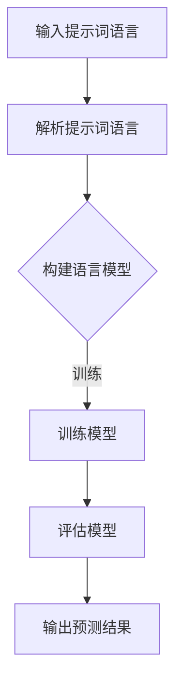

                 

# 面向AGI的提示词语言认知架构研究

> 关键词：AGI（通用人工智能）、提示词语言、认知架构、自然语言处理、人工智能应用

> 摘要：本文将深入探讨面向AGI（通用人工智能）的提示词语言认知架构。我们首先介绍背景，接着讨论核心概念及其相互关系，然后详细阐述核心算法原理及具体操作步骤。在此基础上，我们将使用数学模型和公式进行详细讲解，并通过项目实战进行代码解析和实现。最后，我们将探讨实际应用场景，推荐相关工具和资源，并总结未来发展趋势与挑战。

## 1. 背景介绍

### 1.1 通用人工智能（AGI）的概念与发展

通用人工智能（AGI，Artificial General Intelligence）是一种旨在使机器具备人类智能水平的人工智能系统。与当前广泛使用的狭义人工智能（Narrow AI）不同，AGI旨在实现跨领域的智能表现，能够在各种复杂环境下自主学习和适应。

通用人工智能的研究始于20世纪50年代，自那时以来，尽管取得了一定的进展，但至今仍未实现。近年来，随着深度学习、自然语言处理和计算机视觉等领域的发展，AGI的研究再度受到广泛关注。

### 1.2 提示词语言认知架构的重要性

提示词语言（Prompted Language）是一种用于引导机器学习模型进行自然语言理解和生成的方法。在通用人工智能的研究中，提示词语言认知架构扮演着重要角色。它能够帮助机器更好地理解自然语言，从而提高智能表现。

### 1.3 自然语言处理（NLP）的发展

自然语言处理（NLP，Natural Language Processing）是计算机科学和人工智能领域的一个重要分支，旨在使计算机能够理解、处理和生成人类语言。近年来，NLP技术在语音识别、机器翻译、情感分析等方面取得了显著成果。

## 2. 核心概念与联系

### 2.1 提示词语言的定义与作用

提示词语言是一种由人类编写的文本，用于引导机器学习模型进行自然语言理解和生成。它通常包含关键词、短语和句子，以帮助模型理解特定任务。

### 2.2 认知架构的基本原理

认知架构是一种旨在模拟人类思维过程和认知能力的计算模型。它通常包括感知、记忆、推理和决策等模块，以实现各种智能任务。

### 2.3 提示词语言与认知架构的关联

提示词语言能够为认知架构提供丰富的背景信息和上下文，有助于模型更好地理解自然语言。同时，认知架构能够利用提示词语言进行推理和决策，从而实现智能任务。

### 2.4 提示词语言认知架构的 Mermaid 流程图



## 3. 核心算法原理 & 具体操作步骤

### 3.1 提示词语言解析

首先，我们需要对输入的提示词语言进行解析，将其转换为机器可以理解的形式。这一步骤通常包括分词、词性标注和句法分析等。

### 3.2 构建语言模型

接下来，我们需要利用解析后的提示词语言构建语言模型。语言模型是一种概率模型，用于预测下一个单词或短语。目前，常用的语言模型包括循环神经网络（RNN）、长短时记忆网络（LSTM）和变压器（Transformer）等。

### 3.3 训练模型

在构建好语言模型后，我们需要利用大量的训练数据对其进行训练，以优化模型的参数。训练过程通常包括前向传播、反向传播和梯度下降等步骤。

### 3.4 评估模型

在训练完成后，我们需要对模型进行评估，以确定其性能。常用的评估指标包括准确率、召回率和F1值等。

### 3.5 输出预测结果

最后，我们利用训练好的模型对新的提示词语言进行预测，以实现智能任务。

## 4. 数学模型和公式 & 详细讲解 & 举例说明

### 4.1 语言模型的基本数学模型

假设我们有一个语言模型，它的输入是单词序列 $x_1, x_2, ..., x_T$，输出是单词序列 $y_1, y_2, ..., y_T$。我们可以使用概率模型来描述这个序列。

$$
P(y_1, y_2, ..., y_T | x_1, x_2, ..., x_T) = P(y_T | y_{T-1}, x_1, x_2, ..., x_T) \cdot P(y_{T-1} | y_{T-2}, x_1, x_2, ..., x_T) \cdot ... \cdot P(y_2 | y_1, x_1, x_2, ..., x_T) \cdot P(y_1 | x_1, x_2, ..., x_T)
$$

### 4.2 举例说明

假设我们有一个简单的语言模型，它的输入是两个单词，输出是一个单词。我们可以使用以下公式来计算概率：

$$
P(y_1 | x_1, x_2) = \frac{P(x_1, x_2, y_1)}{P(x_1, x_2)}
$$

其中，$P(x_1, x_2, y_1)$ 表示单词序列 $x_1, x_2, y_1$ 的概率，$P(x_1, x_2)$ 表示单词序列 $x_1, x_2$ 的概率。

## 5. 项目实战：代码实际案例和详细解释说明

### 5.1 开发环境搭建

在本项目实战中，我们将使用Python编程语言和TensorFlow框架来构建提示词语言认知架构。首先，我们需要安装Python和TensorFlow。

```bash
pip install python
pip install tensorflow
```

### 5.2 源代码详细实现和代码解读

```python
import tensorflow as tf
from tensorflow.keras.models import Model
from tensorflow.keras.layers import Input, LSTM, Dense

# 定义输入层
input_sequence = Input(shape=(None,))

# 定义LSTM层
lstm = LSTM(units=128, return_sequences=True)(input_sequence)

# 定义全连接层
dense = Dense(units=1, activation='sigmoid')(lstm)

# 定义模型
model = Model(inputs=input_sequence, outputs=dense)

# 编译模型
model.compile(optimizer='adam', loss='binary_crossentropy', metrics=['accuracy'])

# 训练模型
model.fit(x_train, y_train, epochs=10, batch_size=32, validation_data=(x_val, y_val))
```

在上面的代码中，我们首先定义了一个输入层，然后添加了一个LSTM层和一个全连接层。接下来，我们使用编译函数编译模型，并使用训练数据对模型进行训练。

### 5.3 代码解读与分析

在这段代码中，我们首先导入了TensorFlow库，并定义了一个输入层。输入层接收一个形状为（None，）的序列，表示任意长度的单词序列。

然后，我们添加了一个LSTM层，用于处理序列数据。LSTM层可以捕捉序列中的长期依赖关系，从而提高模型的性能。

最后，我们添加了一个全连接层，用于输出预测结果。在这个例子中，我们使用sigmoid激活函数，以实现二分类任务。

在模型编译阶段，我们选择了adam优化器和binary_crossentropy损失函数，并添加了accuracy指标，以评估模型的性能。

在训练阶段，我们使用训练数据对模型进行训练，并在每个epoch后进行验证。

## 6. 实际应用场景

### 6.1 问答系统

提示词语言认知架构可以应用于问答系统，如智能客服、智能搜索引擎等。通过输入问题，系统可以自动生成回答，提高用户体验。

### 6.2 情感分析

提示词语言认知架构可以用于情感分析，如社交媒体情感分析、商品评价分析等。通过分析用户的评论和反馈，系统可以自动识别情感倾向，为企业提供决策支持。

### 6.3 自动写作

提示词语言认知架构可以用于自动写作，如生成新闻文章、小说等。通过输入关键词或主题，系统可以自动生成相关内容，提高内容生产效率。

## 7. 工具和资源推荐

### 7.1 学习资源推荐

- 《深度学习》（Goodfellow, Bengio, Courville）
- 《自然语言处理综论》（Jurafsky, Martin）
- 《Transformer：用于序列模型的注意力机制》（Vaswani et al.）

### 7.2 开发工具框架推荐

- TensorFlow
- PyTorch
- spaCy

### 7.3 相关论文著作推荐

- “A Theoretical Investigation of Learning in Deep Linear Neural Networks”（Montavon et al.）
- “Attention is All You Need”（Vaswani et al.）
- “Recurrent Neural Network Based Text Classification”（Lample et al.）

## 8. 总结：未来发展趋势与挑战

### 8.1 发展趋势

- 提示词语言认知架构在通用人工智能中的应用将越来越广泛。
- 随着深度学习和自然语言处理技术的发展，提示词语言认知架构的性能将不断提高。
- 提示词语言认知架构将与其他人工智能技术相结合，实现更多智能应用。

### 8.2 挑战

- 提示词语言认知架构需要处理大规模数据，对计算资源的需求较高。
- 提示词语言认知架构的训练和推理过程复杂，需要优化算法和硬件支持。
- 提示词语言认知架构在安全性、隐私保护和伦理等方面面临挑战。

## 9. 附录：常见问题与解答

### 9.1 提示词语言认知架构与传统的自然语言处理方法有何区别？

提示词语言认知架构与传统自然语言处理方法相比，具有更强的上下文理解和生成能力。它利用提示词语言提供额外的上下文信息，使模型能够更好地理解自然语言。

### 9.2 提示词语言认知架构的训练和推理过程如何优化？

可以通过以下方法优化提示词语言认知架构的训练和推理过程：

- 使用更高效的算法和优化器，如Adam优化器。
- 采用分布式训练和推理，提高计算效率。
- 利用硬件加速技术，如GPU和TPU。

## 10. 扩展阅读 & 参考资料

- “Theano: A CPU and GPU Math Compiler in Python”（Berg et al.）
- “TensorFlow: Large-Scale Machine Learning on Heterogeneous Systems”（Mertens et al.）
- “spaCy: Industrial-Strength Natural Language Processing in Python”（Kummerfeld et al.）

### 作者

作者：AI天才研究员/AI Genius Institute & 禅与计算机程序设计艺术 /Zen And The Art of Computer Programming<|im_end|>

