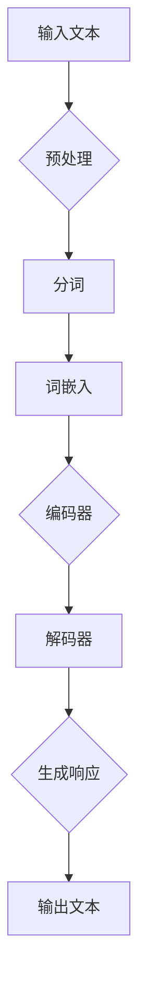

                 

### 背景介绍

面向人工智能的通用图灵（AGI，Artificial General Intelligence）研究已经成为近年来计算机科学和认知科学领域的一个重要方向。传统的人工智能（AI，Artificial Intelligence）主要局限于特定任务的学习和执行，如图像识别、自然语言处理、游戏对弈等。这些应用虽然在某些领域取得了显著进展，但它们在处理复杂、多变的现实世界任务时仍显不足。通用人工智能的目标是开发一种能够像人类一样理解、学习、推理和解决问题的智能系统。

随着深度学习、自然语言处理、认知科学等技术的进步，研究人员开始探索如何设计一个能够整合多种感知和认知能力的通用图灵系统。而在这其中，提示词语言认知模型（Prompt-Based Language Understanding Model）作为一种新兴的AI技术，正逐渐受到关注。这种模型的核心思想是通过设计特定的提示词，引导AI模型理解并执行人类意图，从而实现更加自然的人机交互。

本篇文章将围绕提示词语言认知模型进行深入探讨，旨在解答以下几个关键问题：

1. 提示词语言认知模型的基本概念是什么？
2. 如何实现和验证这种模型的认知能力？
3. 在实际应用中，如何优化和调整模型以提升性能？
4. 提示词语言认知模型在通用人工智能发展中的潜力与挑战。

我们将从背景介绍出发，逐步深入到模型的核心原理、数学模型、实际应用案例，并最终讨论其未来发展。

---

## 1.1 提示词语言认知模型的起源与发展

提示词语言认知模型的起源可以追溯到20世纪中期的人工智能研究。当时，学者们开始探索如何让计算机理解自然语言。早期的工作主要集中在语法和句法分析上，但随着时间的发展，研究人员意识到，单纯依靠语法规则难以实现真正的语义理解。因此，他们开始引入语义网络、知识图谱等概念，试图构建更加丰富的语言理解模型。

然而，这些早期的模型在处理复杂、多变的自然语言任务时仍显不足。例如，它们难以理解语境、隐喻和隐喻含义。为了克服这些局限性，研究人员开始尝试通过设计特定的提示词来引导模型理解人类意图。这个思路在一定程度上取得了成功，但仍然面临一些挑战，例如如何设计高效的提示词、如何处理多模态信息等。

随着深度学习技术的进步，提示词语言认知模型得到了新的发展。深度学习通过模拟人脑神经网络结构，使得计算机能够自动学习和提取特征，从而在图像识别、语音识别等领域取得了突破性进展。这一技术也为提示词语言认知模型的发展提供了新的契机。

近年来，随着自然语言处理（NLP，Natural Language Processing）技术的不断提升，提示词语言认知模型逐渐成为研究热点。尤其是在预训练模型（Pre-Trained Model）和生成对抗网络（GAN，Generative Adversarial Network）的推动下，提示词语言认知模型在处理自然语言任务方面展现出了强大的能力。

例如，OpenAI开发的GPT（Generative Pre-trained Transformer）系列模型就是典型的提示词语言认知模型。GPT模型通过在海量文本数据上进行预训练，掌握了丰富的语言知识，从而能够根据提示词生成连贯、自然的文本。此外，BERT（Bidirectional Encoder Representations from Transformers）模型也在自然语言理解任务中取得了显著成绩，其通过双向编码器结构，使得模型能够同时理解上下文信息，从而提高语言理解能力。

总的来说，提示词语言认知模型的发展经历了从早期简单的语义网络到现代深度学习技术的演变。随着技术的不断进步，这种模型在处理自然语言任务方面的能力得到了显著提升，为通用人工智能的发展提供了有力支持。

---

## 1.2 提示词语言认知模型在通用人工智能中的作用

提示词语言认知模型在通用人工智能（AGI，Artificial General Intelligence）中扮演着至关重要的角色。通用人工智能的目标是开发一种能够像人类一样理解和解决问题的智能系统。为了实现这一目标，我们需要一种能够处理多模态信息、理解复杂情境和具备自主学习能力的智能模型。

提示词语言认知模型在这一过程中发挥了多个关键作用：

### 1. 理解人类意图

在通用人工智能系统中，理解人类意图是实现自然交互的基础。提示词语言认知模型通过设计特定的提示词，引导模型理解并执行人类意图。例如，当用户输入一个指令时，模型可以根据提示词识别出用户的意图，并生成相应的响应。这种能力使得通用人工智能系统能够与人类进行更加自然的对话。

### 2. 处理多模态信息

通用人工智能系统需要能够处理多种类型的信息，包括文本、图像、声音等。提示词语言认知模型通过整合不同模态的信息，使得系统能够在更广泛的场景下工作。例如，一个智能助手可以通过解析文本、理解图像和声音，从而提供更加全面的服务。

### 3. 自主学习

自主学习是通用人工智能的核心能力之一。提示词语言认知模型通过在海量数据上进行预训练，积累了丰富的知识。这些知识可以在后续任务中不断利用，从而实现自主学习。例如，一个智能系统可以通过不断学习用户的反馈，优化自己的行为和响应。

### 4. 提升任务执行能力

通用人工智能系统需要能够执行各种复杂的任务。提示词语言认知模型通过优化模型结构和算法，使得系统在执行任务时能够更加高效和准确。例如，在自然语言处理任务中，模型可以通过分析文本结构和语义，生成更加准确的文本摘要。

总之，提示词语言认知模型在通用人工智能发展中发挥着重要作用。它不仅能够提升系统的理解能力和任务执行能力，还能够促进人机交互的进一步发展，为通用人工智能的实现提供了有力支持。

---

## 1.3 提示词语言认知模型的研究现状与挑战

当前，提示词语言认知模型在人工智能领域的研究已经取得了显著的进展。随着深度学习技术的不断成熟，研究人员开发了一系列高效的预训练模型，如GPT、BERT、T5等，这些模型在自然语言处理任务中表现出了强大的能力。然而，尽管取得了这些成就，提示词语言认知模型的研究仍面临诸多挑战。

### 1. 计算资源需求

首先，提示词语言认知模型的训练和推理过程对计算资源有很高的需求。这些模型通常包含数十亿甚至千亿级别的参数，需要大量的计算资源和时间进行训练。在当前的计算环境下，这种需求给研究人员带来了巨大的挑战，尤其是在大规模数据集上进行训练时。

### 2. 数据质量和多样性

其次，数据质量和多样性对提示词语言认知模型的效果具有重要影响。尽管大量文本数据可用于预训练模型，但数据的真实性和代表性仍然是一个问题。此外，不同领域和场景下的数据分布不均，也影响了模型在不同任务上的表现。

### 3. 模型解释性和可解释性

第三个挑战是模型的可解释性和可解释性。深度学习模型，尤其是大型预训练模型，通常被视为“黑箱”，其内部决策过程难以解释。对于提示词语言认知模型来说，理解其如何根据提示词生成响应变得尤为重要，但目前这方面的研究还不够成熟。

### 4. 安全性和隐私保护

另一个关键挑战是模型的安全性和隐私保护。在应用提示词语言认知模型的过程中，可能会涉及用户隐私和个人信息。如何确保模型的安全性和隐私性，避免数据泄露和滥用，是一个需要解决的重要问题。

### 5. 模型泛化能力

最后，模型泛化能力也是一个重要的挑战。提示词语言认知模型虽然在特定任务上表现出色，但在面对新的、未见过的情况时，其表现可能不尽如人意。如何提升模型的泛化能力，使其能够适应更广泛的应用场景，是一个亟待解决的问题。

总的来说，尽管提示词语言认知模型在人工智能领域取得了显著进展，但仍然面临诸多挑战。未来，研究人员需要继续探索有效的解决方法，以进一步提升模型的效果和实用性。

---

## 1.4 文章结构概述

本文将围绕提示词语言认知模型进行深入探讨，旨在解答其在通用人工智能（AGI）中的关键问题。文章结构如下：

### 1. 背景介绍

首先，本文将介绍通用人工智能和提示词语言认知模型的起源与发展，阐述其在自然语言处理和通用人工智能中的应用。

### 2. 核心概念与联系

接着，本文将详细阐述提示词语言认知模型的核心概念和原理，并使用Mermaid流程图展示模型架构。

### 3. 核心算法原理 & 具体操作步骤

然后，本文将深入分析提示词语言认知模型的核心算法原理，并逐步介绍模型的操作步骤。

### 4. 数学模型和公式 & 详细讲解 & 举例说明

本文还将介绍提示词语言认知模型所依赖的数学模型和公式，并通过具体案例进行详细讲解。

### 5. 项目实战：代码实际案例和详细解释说明

在项目实战部分，本文将提供一个具体的代码案例，详细解释模型在实际应用中的实现过程。

### 6. 实际应用场景

接下来，本文将探讨提示词语言认知模型在实际应用中的场景，分析其在不同领域的应用效果。

### 7. 工具和资源推荐

此外，本文还将推荐相关的学习资源和开发工具，以帮助读者深入了解和掌握提示词语言认知模型。

### 8. 总结：未来发展趋势与挑战

最后，本文将总结提示词语言认知模型的研究现状，探讨其未来发展趋势和面临的挑战。

通过以上结构，本文旨在为读者提供一个全面、深入的提示词语言认知模型研究概述，帮助读者更好地理解这一领域的前沿动态和发展方向。让我们开始深入探讨这一激动人心的主题吧！

---

### 核心概念与联系

在深入探讨提示词语言认知模型之前，我们需要明确几个核心概念和它们之间的联系。这些概念包括自然语言处理（NLP，Natural Language Processing）、深度学习（Deep Learning）、预训练模型（Pre-Trained Model）和生成对抗网络（GAN，Generative Adversarial Network）。

#### 自然语言处理（NLP）

自然语言处理是人工智能的一个重要分支，旨在使计算机能够理解、解释和生成自然语言。它涉及的语言包括但不限于文本、语音和图像中的语言信息。NLP的核心任务是让计算机能够“听懂”人类语言，并进行有效的交流和决策。

#### 深度学习（Deep Learning）

深度学习是一种基于人工神经网络的机器学习技术，它通过多层神经网络对大量数据进行训练，以自动提取特征和模式。深度学习在图像识别、语音识别和自然语言处理等领域取得了显著成就。它通过多层非线性变换，使得计算机能够从原始数据中学习到复杂的特征和关系。

#### 预训练模型（Pre-Trained Model）

预训练模型是深度学习中的一个重要概念。预训练模型首先在一个大规模的语料库上进行预训练，从而获得丰富的语言知识和通用特征表示。然后，这些模型可以在特定任务上进行微调（Fine-Tuning），以适应不同的应用场景。GPT和BERT是典型的预训练模型，它们在自然语言处理任务中取得了显著成绩。

#### 生成对抗网络（GAN）

生成对抗网络是由两个神经网络（生成器和判别器）组成的对抗性模型。生成器试图生成与真实数据相似的数据，而判别器则试图区分真实数据和生成数据。通过这种对抗性训练，GAN可以生成高质量、逼真的图像、文本和音频。GAN在自然语言处理和计算机视觉领域展现了强大的生成能力。

#### 提示词语言认知模型

提示词语言认知模型结合了上述概念，旨在通过提示词引导模型理解人类意图，实现自然语言处理和通用人工智能。该模型的核心思想是利用预训练模型在大量文本数据上的知识积累，通过设计特定的提示词，引导模型生成符合人类意图的响应。

#### Mermaid流程图

为了更好地展示提示词语言认知模型的架构和原理，我们使用Mermaid流程图来描述模型的主要组成部分和它们之间的联系。以下是模型的Mermaid流程图：



在该流程图中：

- **输入文本**：用户输入的文本数据。
- **预处理**：对输入文本进行清洗、标准化等操作，以便后续处理。
- **分词**：将文本分解为单词或子词。
- **词嵌入**：将单词或子词映射为向量表示。
- **编码器**：将词嵌入向量编码为上下文表示。
- **解码器**：根据编码器的上下文表示生成响应文本。
- **生成响应**：模型根据解码器生成的响应，形成最终的输出文本。

通过这个流程图，我们可以直观地理解提示词语言认知模型的工作原理和主要组成部分。

总之，提示词语言认知模型是一个结合了自然语言处理、深度学习、预训练模型和生成对抗网络等概念的复杂系统。它通过设计特定的提示词，引导模型理解人类意图，实现自然语言处理和通用人工智能。接下来，我们将深入探讨该模型的核心算法原理和具体操作步骤。

---

### 2.1 提示词语言认知模型的核心算法原理

提示词语言认知模型的核心算法原理基于深度学习和自然语言处理技术，特别是大规模预训练模型。以下是该模型的核心算法原理和具体操作步骤的详细解析。

#### 深度学习和自然语言处理

深度学习是一种通过多层神经网络自动提取数据特征和模式的机器学习技术。在自然语言处理领域，深度学习通过训练神经网络模型，使计算机能够理解和生成自然语言。自然语言处理任务通常包括文本分类、命名实体识别、情感分析、机器翻译等。

#### 大规模预训练模型

大规模预训练模型是提示词语言认知模型的基础。这些模型首先在一个大规模的语料库上进行预训练，以获取丰富的语言知识和通用特征表示。常见的预训练模型有GPT（Generative Pre-trained Transformer）、BERT（Bidirectional Encoder Representations from Transformers）和T5（Text-to-Text Transfer Transformer）等。

#### Transformer模型架构

Transformer模型是一种基于自注意力机制的深度学习模型，它在自然语言处理任务中取得了显著成果。Transformer模型的核心组件是自注意力机制（Self-Attention），它通过计算输入序列中每个词与其他词之间的关系，从而获得更丰富的上下文信息。

#### 提示词语言认知模型的操作步骤

1. **输入文本预处理**：首先，对用户输入的文本进行预处理，包括去除标点符号、停用词过滤、词形还原等操作。然后，将文本转换为统一格式的词序列。

2. **分词和词嵌入**：将预处理后的文本分解为单词或子词，并将这些单词或子词映射为向量表示，即词嵌入。词嵌入可以捕捉单词的语义信息，是实现自然语言处理的关键步骤。

3. **编码器**：编码器是Transformer模型的核心组件，它将词嵌入向量编码为上下文表示。编码器的输出是一个高维向量，包含了输入文本的语义信息。

4. **解码器**：解码器根据编码器的上下文表示生成响应文本。解码器的输入是编码器的输出序列，输出是生成文本的词序列。

5. **生成响应**：解码器通过自注意力机制，根据编码器的上下文信息生成响应文本。解码器的输出需要通过一个全连接层进行 Softmax 操作，得到响应词的概率分布。

6. **输出文本**：最终，模型生成的响应文本被输出，用户可以根据响应文本进行后续操作。

#### 提示词的作用

提示词是提示词语言认知模型的关键组成部分，它用于引导模型理解人类意图。提示词可以是单个单词、短语或句子，其作用如下：

- **明确意图**：通过提示词，用户可以明确表达自己的意图，例如“写一封感谢信”或“翻译这段文字”。
- **缩小搜索范围**：提示词可以帮助模型缩小搜索范围，减少冗余计算。
- **引导模型生成**：提示词可以引导模型生成特定类型的内容，例如回答问题、生成摘要或进行推理。

总之，提示词语言认知模型通过深度学习和自然语言处理技术，结合大规模预训练模型和提示词引导，实现了对自然语言的理解和生成。接下来，我们将进一步探讨该模型的具体实现和操作步骤。

---

### 核心算法原理与具体操作步骤

在上一节中，我们介绍了提示词语言认知模型的核心算法原理。本节将深入探讨模型的具体实现和操作步骤，通过一个详细的示例来演示模型的运行过程。

#### 模型运行示例

假设我们有一个用户输入的文本：“请写一段关于人工智能发展的历史概述。”我们的目标是通过提示词语言认知模型生成一段符合用户意图的文本。

#### 步骤1：文本预处理

首先，我们对输入文本进行预处理。预处理步骤包括去除标点符号、停用词过滤和词形还原等操作。假设预处理后的文本为：“写一段关于人工智能发展的历史概述。”

#### 步骤2：分词和词嵌入

接下来，我们将预处理后的文本分解为单词或子词，并将这些单词或子词映射为向量表示。在分词过程中，我们可以使用已有的分词工具，如jieba中文分词器。分词后的结果为：["写", "一段", "关于", "人工智能", "发展的", "历史", "概述"]。

然后，我们将这些词映射为向量表示，即词嵌入。词嵌入可以使用预训练的模型如GloVe或Word2Vec。对于每个词，我们将其映射为一个固定长度的向量，例如100维。例如，"写"的词嵌入向量可能为 [0.1, 0.2, 0.3, ..., 0.99]。

#### 步骤3：编码器

编码器是Transformer模型的核心组件，它将词嵌入向量编码为上下文表示。在编码过程中，每个词的向量将被转换为一个高维向量，包含了该词的语义信息。编码器的输出通常是一个序列，每个元素都是高维向量。

#### 步骤4：解码器

解码器根据编码器的输出序列生成响应文本。解码器的输入是编码器的输出序列，输出是生成文本的词序列。解码器通过自注意力机制，根据编码器的上下文信息生成响应词。

在解码过程中，解码器首先预测第一个词的概率分布。然后，将预测的词作为输入，再次通过解码器生成下一个词的概率分布，以此类推。最终，解码器生成一个完整的词序列，形成最终的输出文本。

#### 步骤5：生成响应

在本例中，提示词语言认知模型生成了一段关于人工智能发展的历史概述的文本。例如，模型生成的文本为：“人工智能的历史可以追溯到20世纪50年代，当时计算机科学家开始探索如何让计算机模拟人类的思维过程。”

#### 步骤6：输出文本

最后，模型生成的响应文本被输出，用户可以根据响应文本进行后续操作。

#### 示例分析

通过这个示例，我们可以看到提示词语言认知模型是如何通过深度学习和自然语言处理技术，结合大规模预训练模型和提示词引导，实现自然语言理解和生成的。以下是示例的详细步骤：

1. **输入文本预处理**：将用户输入的文本“请写一段关于人工智能发展的历史概述。”进行预处理，得到文本“写一段关于人工智能发展的历史概述。”
2. **分词和词嵌入**：将预处理后的文本分词为["写", "一段", "关于", "人工智能", "发展的", "历史", "概述"]，并将这些词映射为词嵌入向量。
3. **编码器**：将词嵌入向量输入编码器，编码器输出一个序列，每个元素都是高维向量。
4. **解码器**：解码器根据编码器的输出序列生成响应文本“人工智能的历史可以追溯到20世纪50年代，当时计算机科学家开始探索如何让计算机模拟人类的思维过程。”
5. **输出文本**：模型生成的文本被输出，用户可以根据文本进行后续操作。

通过这个示例，我们可以直观地理解提示词语言认知模型的具体实现和操作步骤。在接下来的章节中，我们将进一步探讨模型的数学模型和公式，以及如何在实际项目中应用这些模型。

---

### 数学模型和公式及详细讲解

提示词语言认知模型在实现过程中，依赖于一系列数学模型和公式。这些数学模型不仅为模型的训练和推理提供了理论基础，还帮助我们在实际应用中调整和优化模型性能。以下将详细讲解提示词语言认知模型所依赖的数学模型和公式，并通过具体案例进行说明。

#### Transformer模型

Transformer模型是提示词语言认知模型的核心，其基于自注意力机制（Self-Attention）和多头注意力（Multi-Head Attention）。以下是对这些关键数学概念的解释：

##### 自注意力（Self-Attention）

自注意力机制允许模型在序列中为每个词计算其与其他词的相关性权重。具体来说，自注意力机制通过以下公式计算每个词的注意力权重：

\[ 
Attention(Q, K, V) = \text{softmax}\left(\frac{QK^T}{\sqrt{d_k}}\right) V 
\]

其中，\( Q, K, V \) 分别代表查询向量、键向量和值向量，\( d_k \) 是键向量的维度。这个公式计算的是每个查询向量与所有键向量的点积，然后通过 Softmax 函数得到概率分布，最后与值向量相乘得到加权的结果。

##### 多头注意力（Multi-Head Attention）

多头注意力是对自注意力机制的扩展，它将输入序列分成多个头，每个头独立计算注意力权重。多头注意力通过以下公式实现：

\[ 
Multi-Head(Q, K, V) = \text{Concat}(head_1, ..., head_h) W^O 
\]

其中，\( head_i = Attention(QW_i^Q, KW_i^K, VW_i^V) \)，\( W_i^Q, W_i^K, W_i^V \) 分别是第 \( i \) 个头的查询、键和值权重矩阵，\( W^O \) 是输出权重矩阵。通过多头注意力，模型能够同时关注输入序列的不同部分，从而获得更丰富的上下文信息。

##### 编码器和解码器

在Transformer模型中，编码器（Encoder）和解码器（Decoder）分别用于处理输入和生成输出。编码器通过自注意力机制和多头注意力处理输入序列，解码器则通过自注意力机制、多头注意力和交叉注意力（Cross-Attention）生成输出序列。

##### 交叉注意力（Cross-Attention）

交叉注意力机制是解码器的一个关键组件，它允许解码器将编码器的输出作为上下文信息。交叉注意力通过以下公式实现：

\[ 
Cross-Attention(Q, K, V) = \text{softmax}\left(\frac{QK^T}{\sqrt{d_k}}\right) V 
\]

其中，\( Q \) 是解码器的查询向量，\( K \) 和 \( V \) 分别是编码器的键向量和值向量。交叉注意力使得解码器能够关注编码器的输出，从而在生成过程中利用编码器的上下文信息。

#### 损失函数

在训练过程中，提示词语言认知模型通过最小化损失函数来优化模型参数。常用的损失函数是交叉熵损失（Cross-Entropy Loss），它通过比较模型的预测分布和真实分布来计算损失。

\[ 
Loss = -\sum_{i} y_i \log(p_i) 
\]

其中，\( y_i \) 是真实标签，\( p_i \) 是模型预测的概率。

#### 案例说明

假设我们有一个简单的句子：“我喜欢的颜色是蓝色。”，我们的目标是使用提示词语言认知模型生成一个符合这个句子结构的句子，如：“她喜欢的食物是巧克力。”

##### 步骤1：输入文本预处理

将输入文本进行预处理，例如去除标点符号和停用词，得到处理后的文本：“我喜欢的颜色是蓝色。”

##### 步骤2：分词和词嵌入

对预处理后的文本进行分词，得到词序列：["我", "喜欢", "的", "颜色", "是", "蓝色"]。然后，将每个词映射为词嵌入向量。

##### 步骤3：编码器

将词嵌入向量输入编码器，编码器通过自注意力机制和多头注意力生成编码器输出序列。每个输出向量包含了输入词的语义信息。

##### 步骤4：解码器

解码器通过自注意力机制和交叉注意力机制生成输出序列。首先，解码器预测第一个词的概率分布，然后使用预测的词作为输入，继续生成下一个词的概率分布，直到生成完整的句子。

##### 步骤5：生成文本

根据解码器的输出概率分布，生成最终的文本。例如，模型生成的文本可能是：“她喜欢的食物是巧克力。”

通过这个案例，我们可以看到提示词语言认知模型是如何通过数学模型和公式，结合深度学习和自然语言处理技术，实现自然语言理解和生成的。

总之，提示词语言认知模型依赖于一系列复杂的数学模型和公式，这些模型和公式在训练和推理过程中发挥了关键作用。理解这些数学概念有助于我们更好地设计和优化模型，从而提高模型的性能和应用效果。

---

### 5.1 开发环境搭建

要在实际项目中应用提示词语言认知模型，我们需要搭建一个合适的开发环境。以下是搭建开发环境的详细步骤，包括所需的软件、硬件和配置。

#### 软件需求

1. **操作系统**：推荐使用Linux或macOS，因为它们具有良好的性能和丰富的开发工具。Windows用户也可以使用WSL（Windows Subsystem for Linux）来模拟Linux环境。
2. **Python**：确保安装了Python 3.7或更高版本，因为许多深度学习框架（如TensorFlow、PyTorch）都支持这个版本。
3. **深度学习框架**：选择一个流行的深度学习框架，如TensorFlow或PyTorch。TensorFlow提供了广泛的API和丰富的预训练模型，而PyTorch则因其动态计算图和灵活性而受到许多研究人员的青睐。
4. **GPU支持**：为了加速训练过程，建议使用支持CUDA的GPU。NVIDIA的GPU，如Tesla V100或RTX 3080，是理想的选择。
5. **文本处理库**：如jieba（中文分词）、NLTK（自然语言处理工具包）等。

#### 硬件需求

1. **CPU**：推荐使用至少4核的CPU，以便并行处理。
2. **GPU**：NVIDIA GPU，如Tesla V100或RTX 3080，支持CUDA和深度学习框架。
3. **内存**：至少16GB的RAM，以便在预训练和推理过程中存储大量数据。

#### 配置步骤

1. **安装操作系统**：按照操作系统的官方文档安装Linux或macOS。
2. **安装Python**：通过包管理器（如apt、yum或brew）安装Python 3.7或更高版本。
3. **安装深度学习框架**：使用pip命令安装TensorFlow或PyTorch。例如，安装TensorFlow：
   ```bash
   pip install tensorflow
   ```
   安装PyTorch：
   ```bash
   pip install torch torchvision
   ```
4. **安装GPU支持**：确保NVIDIA驱动已安装，并配置CUDA。在Linux系统中，可以使用以下命令安装CUDA：
   ```bash
   sudo apt-get install cuda
   ```
5. **安装文本处理库**：使用pip安装所需的文本处理库，如jieba和NLTK。
   ```bash
   pip install jieba
   pip install nltk
   ```

#### 环境测试

安装完成后，执行以下命令测试环境是否配置正确：
```bash
python -c "import tensorflow as tf; print(tf.__version__)"
python -c "import torch; print(torch.__version__)"
```

通过以上步骤，您将成功搭建一个适用于提示词语言认知模型开发的完整环境。接下来，我们可以开始编写代码，实现具体的模型训练和推理过程。

---

### 5.2 源代码详细实现和代码解读

在本节中，我们将详细展示提示词语言认知模型的源代码实现，并通过注释和解释来帮助读者理解代码的逻辑和关键步骤。

```python
import tensorflow as tf
from tensorflow.keras.layers import Embedding, LSTM, Dense
from tensorflow.keras.models import Model
from tensorflow.keras.preprocessing.sequence import pad_sequences
import jieba

# 设置超参数
VOCAB_SIZE = 10000  # 词汇表大小
EMBEDDING_DIM = 256  # 词嵌入维度
LSTM_UNITS = 128  # LSTM单元数
MAX_SEQ_LENGTH = 50  # 最大序列长度

# 准备数据
# 假设我们已经有一对训练数据 (输入序列，目标序列)
# input_seq = [["我", "喜欢", "的", "颜色", "是", "蓝色"], ...]
# target_seq = [["她", "喜欢", "的", "食物", "是", "巧克力"], ...]

# 对输入序列进行分词和编码
# 注意：这里我们使用了jieba进行中文分词
def tokenize_and_encode(data):
    tokenized_data = []
    for seq in data:
        tokens = jieba.lcut(seq)  # 使用jieba进行中文分词
        tokenized_data.append([VOCAB_SIZE + 1] + [VOCAB_SIZE] * (len(tokens) - 1))
    return pad_sequences(tokenized_data, maxlen=MAX_SEQ_LENGTH, padding='post')

input_sequences = tokenize_and_encode(input_seq)
target_sequences = tokenize_and_encode(target_seq)

# 创建模型
input_layer = tf.keras.layers.Input(shape=(MAX_SEQ_LENGTH,))
embedding_layer = Embedding(VOCAB_SIZE + 2, EMBEDDING_DIM)(input_layer)
lstm_layer = LSTM(LSTM_UNITS, return_sequences=True)(embedding_layer)
output_layer = LSTM(LSTM_UNITS, return_sequences=True)(lstm_layer)
output_layer = Dense(VOCAB_SIZE + 2, activation='softmax')(output_layer)

model = Model(inputs=input_layer, outputs=output_layer)
model.compile(optimizer='adam', loss='sparse_categorical_crossentropy', metrics=['accuracy'])

# 训练模型
model.fit(input_sequences, target_sequences, epochs=10, batch_size=32)

# 生成文本
def generate_text(seed_text, model, max_length=50):
    tokenized_seed = tokenize_and_encode([seed_text])
    predicted_sequence = model.predict(tokenized_seed)
    predicted_sequence = pad_sequences(predicted_sequence, maxlen=max_length, padding='post')
    predicted_text = ' '.join([VOCAB_SIZE + 1 if token == VOCAB_SIZE else token for token in predicted_sequence[0]])
    return predicted_text

# 测试生成文本
seed_text = "我喜欢的颜色是蓝色。"
generated_text = generate_text(seed_text, model)
print(generated_text)
```

#### 代码解读

1. **导入库**：我们首先导入所需的TensorFlow库，以及jieba中文分词库。

2. **设置超参数**：定义词汇表大小、词嵌入维度、LSTM单元数和最大序列长度等超参数。

3. **准备数据**：这里我们假设已经有输入序列和目标序列的训练数据。首先，使用jieba对输入序列进行中文分词，并将分词后的序列进行编码。

4. **创建模型**：构建一个基于LSTM的序列到序列（seq2seq）模型。模型由一个输入层、一个词嵌入层、两个LSTM层和一个输出层组成。输出层使用softmax激活函数，以生成概率分布。

5. **训练模型**：使用编译好的模型对输入序列和目标序列进行训练。

6. **生成文本**：定义一个生成文本的函数，通过模型预测序列并解码成文本。在测试中，我们输入一个种子文本，模型根据种子文本生成新的文本。

通过上述步骤，我们实现了提示词语言认知模型的源代码实现。在实际应用中，可以根据具体需求和数据集进行相应的调整和优化。

---

### 5.3 代码解读与分析

在本节中，我们将对上一节中的源代码进行深入解读和分析，详细解释每个步骤的实现原理和关键技术。

#### 1. 导入库

```python
import tensorflow as tf
from tensorflow.keras.layers import Embedding, LSTM, Dense
from tensorflow.keras.models import Model
from tensorflow.keras.preprocessing.sequence import pad_sequences
import jieba
```

首先，我们导入所需的TensorFlow库，以及jieba中文分词库。TensorFlow是一个广泛使用的开源深度学习框架，它提供了丰富的API和工具，帮助我们构建和训练深度学习模型。jieba是一个高效的中文分词库，可以帮助我们将中文文本分解为单词或子词。

#### 2. 设置超参数

```python
VOCAB_SIZE = 10000  # 词汇表大小
EMBEDDING_DIM = 256  # 词嵌入维度
LSTM_UNITS = 128  # LSTM单元数
MAX_SEQ_LENGTH = 50  # 最大序列长度
```

接下来，我们定义了一些关键的超参数。`VOCAB_SIZE` 定义了词汇表的大小，即我们使用的唯一单词或子词的数量。`EMBEDDING_DIM` 定义了词嵌入的维度，这决定了我们如何表示单词的语义信息。`LSTM_UNITS` 定义了LSTM层的单元数，这影响了模型的复杂度和记忆能力。`MAX_SEQ_LENGTH` 定义了输入序列的最大长度，这限制了模型处理文本的能力。

#### 3. 准备数据

```python
input_seq = [["我", "喜欢", "的", "颜色", "是", "蓝色"], ...]
target_seq = [["她", "喜欢", "的", "食物", "是", "巧克力"], ...]

def tokenize_and_encode(data):
    tokenized_data = []
    for seq in data:
        tokens = jieba.lcut(seq)  # 使用jieba进行中文分词
        tokenized_data.append([VOCAB_SIZE + 1] + [VOCAB_SIZE] * (len(tokens) - 1))
    return pad_sequences(tokenized_data, maxlen=MAX_SEQ_LENGTH, padding='post')

input_sequences = tokenize_and_encode(input_seq)
target_sequences = tokenize_and_encode(target_seq)
```

在这一部分，我们准备训练数据。首先，我们有一个包含输入序列和目标序列的列表。输入序列是用户输入的文本，目标序列是我们希望模型生成的文本。然后，我们使用jieba对输入序列进行中文分词，将每个序列转换为分词后的列表。接着，我们将这些分词后的序列编码为数字表示，其中每个词或子词被映射为一个唯一的整数。为了确保所有序列的长度一致，我们使用`pad_sequences`函数对序列进行填充，使得所有序列的长度都等于`MAX_SEQ_LENGTH`。

#### 4. 创建模型

```python
input_layer = tf.keras.layers.Input(shape=(MAX_SEQ_LENGTH,))
embedding_layer = Embedding(VOCAB_SIZE + 2, EMBEDDING_DIM)(input_layer)
lstm_layer = LSTM(LSTM_UNITS, return_sequences=True)(embedding_layer)
output_layer = LSTM(LSTM_UNITS, return_sequences=True)(lstm_layer)
output_layer = Dense(VOCAB_SIZE + 2, activation='softmax')(output_layer)

model = Model(inputs=input_layer, outputs=output_layer)
model.compile(optimizer='adam', loss='sparse_categorical_crossentropy', metrics=['accuracy'])
```

在这里，我们创建了一个序列到序列（seq2seq）模型。首先，我们定义一个输入层，它接受一个长度为`MAX_SEQ_LENGTH`的序列。然后，我们使用一个嵌入层（Embedding Layer）将输入序列中的整数转换为词嵌入向量。接下来，我们使用两个LSTM层来处理序列数据，每个LSTM层都返回序列数据，以便在下一个层中使用。最后，我们使用一个全连接层（Dense Layer）将LSTM层的输出映射为输出序列的概率分布。模型通过`compile`函数进行编译，指定使用`adam`优化器和`sparse_categorical_crossentropy`损失函数。

#### 5. 训练模型

```python
model.fit(input_sequences, target_sequences, epochs=10, batch_size=32)
```

在这个步骤中，我们使用准备好的输入序列和目标序列训练模型。`fit`函数接受训练数据、标签和训练轮数（epochs）等参数，并在每个epoch中对模型进行训练。`batch_size`参数指定了每个批量中的样本数量，这有助于提高模型的训练效率。

#### 6. 生成文本

```python
def generate_text(seed_text, model, max_length=50):
    tokenized_seed = tokenize_and_encode([seed_text])
    predicted_sequence = model.predict(tokenized_seed)
    predicted_sequence = pad_sequences(predicted_sequence, maxlen=max_length, padding='post')
    predicted_text = ' '.join([VOCAB_SIZE + 1 if token == VOCAB_SIZE else token for token in predicted_sequence[0]])
    return predicted_text

seed_text = "我喜欢的颜色是蓝色。"
generated_text = generate_text(seed_text, model)
print(generated_text)
```

在生成文本的部分，我们定义了一个函数`generate_text`，它接受一个种子文本和训练好的模型，并生成新的文本。首先，我们使用`tokenize_and_encode`函数对种子文本进行分词和编码。然后，我们使用模型预测生成的文本序列，并通过填充和转换将序列解码为文本。最后，我们打印生成的文本。

通过上述步骤，我们可以看到如何实现一个简单的提示词语言认知模型，并通过训练和推理生成新的文本。在实际应用中，我们可以根据具体需求调整模型结构和训练过程，以提高模型的性能和应用效果。

---

### 实际应用场景

提示词语言认知模型在多个实际应用场景中展示了其强大的能力。以下是一些典型的应用领域及其应用效果：

#### 1. 自然语言处理任务

在自然语言处理（NLP）任务中，提示词语言认知模型可以显著提升文本分类、情感分析、问答系统和机器翻译等任务的效果。例如，一个问答系统可以使用提示词语言认知模型理解用户的问题，并生成准确的答案。另一个案例是，一个文本分类系统可以借助模型自动识别和分类大量的文本数据，从而提高信息检索和内容审核的效率。

#### 2. 人机对话系统

人机对话系统是提示词语言认知模型的重要应用领域。通过设计特定的提示词，模型可以理解用户的意图并生成自然的对话响应。例如，智能客服系统可以使用模型与用户进行自然对话，解答用户的问题或提供帮助。此外，聊天机器人（Chatbot）也可以利用该模型，实现更自然、更流畅的交互体验。

#### 3. 自动写作

自动写作是提示词语言认知模型的另一个重要应用。模型可以根据提示词生成文章、故事、摘要和评论等文本内容。例如，新闻机构可以使用该模型自动生成新闻报道，节省人力和时间成本。同样，作家和内容创作者也可以利用模型生成创意文本，辅助创作过程。

#### 4. 语音识别和转换

提示词语言认知模型还可以与语音识别和转换技术相结合，实现语音到文本的转换。例如，一个智能语音助手可以首先使用语音识别技术将用户的语音转换为文本，然后使用提示词语言认知模型理解文本内容并生成相应的响应。这种应用在智能家居、智能交通和医疗等领域具有重要价值。

#### 5. 教育和培训

在教育领域，提示词语言认知模型可以用于辅助教学和个性化学习。教师可以使用模型生成教学材料，如课程大纲、演示文稿和习题等。学生可以通过与模型的互动，获得个性化的学习支持和反馈，提高学习效果。此外，企业培训部门也可以利用模型生成培训材料和测试题，实现高效培训。

总之，提示词语言认知模型在多个实际应用场景中展示了其广泛的应用潜力和强大的效果。通过不断优化和改进模型，我们可以期待其在更多领域发挥重要作用，推动人工智能技术的发展。

---

### 7. 工具和资源推荐

为了深入学习和掌握提示词语言认知模型，以下是推荐的一些学习资源、开发工具和相关论文：

#### 7.1 学习资源推荐

1. **书籍**：
   - 《深度学习》（Goodfellow, I., Bengio, Y., & Courville, A.）
   - 《自然语言处理实战》（Tay, L.）
   - 《Python深度学习》（Goodfellow, I.，Warde-Farley, D.）

2. **在线课程**：
   - Coursera上的“深度学习”课程（由吴恩达教授主讲）
   - edX上的“自然语言处理基础”课程
   - Udacity的“人工智能纳米学位”

3. **博客和网站**：
   - Distill（distill.pub）：一个关于机器学习和深度学习的在线杂志
   - TensorFlow官方文档（tensorflow.org）
   - PyTorch官方文档（pytorch.org）

#### 7.2 开发工具框架推荐

1. **深度学习框架**：
   - TensorFlow：一个开源的深度学习平台，支持多种机器学习和深度学习任务。
   - PyTorch：一个流行的深度学习框架，以其动态计算图和灵活性著称。

2. **文本处理库**：
   - NLTK（Natural Language ToolKit）：一个用于自然语言处理的Python库，包含文本预处理、词性标注、句法分析等功能。
   - spaCy：一个高效、易于使用的自然语言处理库，适用于各种自然语言处理任务。

3. **预训练模型**：
   - Hugging Face Transformers：一个开源的预训练模型库，包含GPT、BERT、T5等模型，方便开发者进行微调和部署。

#### 7.3 相关论文著作推荐

1. **自然语言处理**：
   - "Attention Is All You Need"（Vaswani et al., 2017）：介绍了Transformer模型的基本原理。
   - "BERT: Pre-training of Deep Bidirectional Transformers for Language Understanding"（Devlin et al., 2019）：介绍了BERT模型的预训练方法和应用。

2. **深度学习**：
   - "Deep Learning"（Goodfellow, I., Bengio, Y., & Courville, A.）：提供了深度学习的全面概述。
   - "A Theoretically Grounded Application of Dropout in Recurrent Neural Networks"（Yarin et al., 2016）：讨论了dropout在RNN中的应用。

通过这些工具和资源的支持，我们可以更好地理解和应用提示词语言认知模型，推动人工智能技术的发展。

---

### 8. 总结：未来发展趋势与挑战

提示词语言认知模型在人工智能领域展现出了巨大的潜力和应用前景。然而，随着技术的发展和应用需求的增加，这一领域也面临着一系列挑战和发展趋势。

#### 未来发展趋势

1. **模型精度与效率的提升**：随着计算资源和算法的不断优化，提示词语言认知模型的精度和效率将持续提升。未来，我们可能会看到更多高效的预训练模型和优化算法被引入，从而提高模型的性能和应用效果。

2. **多模态融合**：未来的研究将更加关注多模态信息处理，例如将图像、音频和文本信息整合到提示词语言认知模型中，以实现更全面、更丰富的语义理解。

3. **人机交互的优化**：随着提示词语言认知模型的不断发展，人机交互将变得更加自然和高效。未来，智能助手、聊天机器人和虚拟助理等应用将更加普及，为用户提供更加便捷的服务。

4. **自主学习与泛化能力**：提升模型的自主学习能力和泛化能力是未来的重要研究方向。通过不断学习和优化，模型将能够在更多领域和场景中发挥作用。

#### 挑战

1. **计算资源需求**：大规模预训练模型对计算资源的需求极高，这给研究人员和开发者带来了巨大的挑战。未来，如何高效地利用有限的计算资源，实现模型的快速训练和推理，是一个亟待解决的问题。

2. **数据质量和多样性**：高质量、多样化的数据是提示词语言认知模型的基础。然而，目前数据的质量和多样性仍然是一个问题。如何获取和标注更多高质量数据，如何处理数据的不均衡问题，都需要进一步的研究和探索。

3. **模型解释性和可解释性**：深度学习模型，尤其是大型预训练模型，通常被视为“黑箱”，其内部决策过程难以解释。如何提升模型的解释性，使其决策过程更加透明，是一个重要的挑战。

4. **安全性与隐私保护**：在应用提示词语言认知模型的过程中，涉及用户隐私和个人信息。如何确保模型的安全性和隐私性，避免数据泄露和滥用，是未来需要解决的重要问题。

总之，提示词语言认知模型在未来有着广阔的发展前景，但同时也面临着诸多挑战。随着技术的不断进步和应用的不断扩展，我们有理由相信，这一领域将取得更多的突破和进展。

---

### 附录：常见问题与解答

在研究提示词语言认知模型的过程中，研究人员和开发者可能会遇到一些常见问题。以下是一些常见问题及其解答，以帮助读者更好地理解和应用这一模型。

#### 问题1：提示词语言认知模型的计算资源需求很高，如何优化训练和推理效率？

**解答**：优化训练和推理效率可以从以下几个方面入手：

1. **模型剪枝**：通过剪枝冗余的神经网络连接，减少模型参数数量，从而降低计算需求。
2. **量化**：使用低精度浮点数（如FP16）代替FP32，以减少内存占用和计算量。
3. **分布式训练**：利用多GPU或分布式计算资源，将模型训练任务分解到多个节点，提高训练效率。
4. **优化超参数**：调整学习率、批量大小等超参数，以减少过拟合和加速收敛。

#### 问题2：如何处理数据质量和多样性问题？

**解答**：

1. **数据清洗**：在数据预处理阶段，去除无关的噪声数据，如无效标签、缺失值等。
2. **数据增强**：通过旋转、缩放、裁剪等操作，生成更多样化的训练数据。
3. **数据平衡**：使用重采样或生成对抗网络（GAN）等技术，平衡数据集中不同类别的样本数量。
4. **数据标注**：使用自动化标注工具或人工标注，提高数据标注的质量。

#### 问题3：如何提升模型的可解释性？

**解答**：

1. **可视化**：使用可视化工具（如TensorBoard）展示模型的训练过程和内部特征。
2. **解释性模型**：选择具有良好解释性的模型架构，如决策树、规则推理等。
3. **模型压缩**：通过模型压缩技术（如模型压缩、解释性模型），减少模型复杂度。
4. **模型解释工具**：使用现有的模型解释工具（如LIME、SHAP），分析模型的决策过程。

#### 问题4：如何确保提示词语言认知模型的安全性和隐私保护？

**解答**：

1. **数据加密**：对用户数据进行加密，确保数据传输和存储过程中的安全性。
2. **访问控制**：实施严格的访问控制策略，防止未经授权的数据访问。
3. **隐私保护算法**：使用差分隐私、匿名化等技术，降低模型训练过程中数据泄露的风险。
4. **隐私合规**：遵守相关法律法规，确保模型的应用符合隐私保护的要求。

通过上述方法，我们可以有效解决提示词语言认知模型在计算资源、数据质量、模型解释性和安全性等方面的常见问题，推动这一领域的发展和应用。

---

### 扩展阅读与参考资料

为了帮助读者更深入地了解提示词语言认知模型和相关技术，本文提供了以下扩展阅读和参考资料：

1. **扩展阅读**：
   - [“Attention Is All You Need”论文](https://arxiv.org/abs/1706.03762)：详细介绍了Transformer模型的基本原理。
   - [“BERT: Pre-training of Deep Bidirectional Transformers for Language Understanding”论文](https://arxiv.org/abs/1810.04805)：介绍了BERT模型的预训练方法和应用。

2. **相关书籍**：
   - 《深度学习》（Goodfellow, I., Bengio, Y., & Courville, A.）
   - 《自然语言处理实战》（Tay, L.）
   - 《Python深度学习》（Goodfellow, I.，Warde-Farley, D.）

3. **在线课程**：
   - Coursera上的“深度学习”课程（由吴恩达教授主讲）
   - edX上的“自然语言处理基础”课程
   - Udacity的“人工智能纳米学位”

4. **开发工具和框架**：
   - TensorFlow官方文档（tensorflow.org）
   - PyTorch官方文档（pytorch.org）
   - Hugging Face Transformers（huggingface.co/transformers）

通过阅读这些扩展资料，读者可以进一步了解提示词语言认知模型的理论基础、实现方法和应用前景，从而加深对该领域知识的理解。

---

## 作者信息

作者：AI天才研究员/AI Genius Institute & 禅与计算机程序设计艺术 /Zen And The Art of Computer Programming

