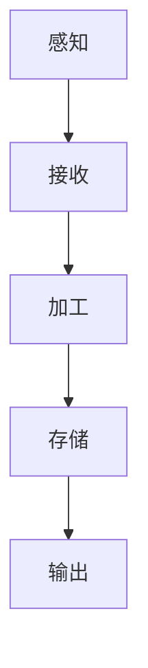
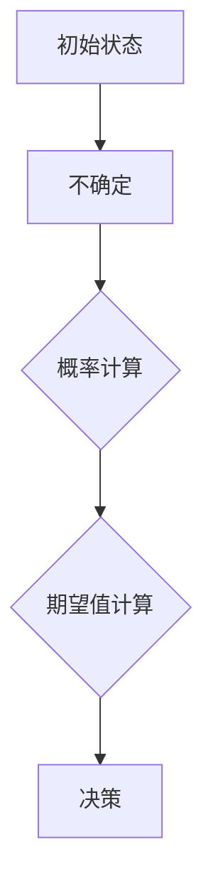
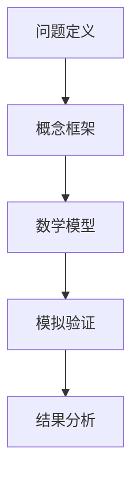
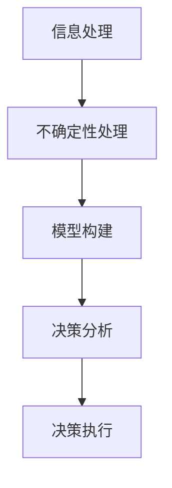

                 

# 面对无法解释事物的认知阶段

> **关键词**：认知阶段，信息处理，复杂系统，不确定性与概率，模型构建，决策过程
>
> **摘要**：本文将深入探讨人类在面对无法解释事物时所经历的认知阶段。通过对信息处理、不确定性与概率的理解，以及模型构建和决策过程的分析，揭示人类认知的复杂性和多样性。

## 1. 背景介绍

在人类的认知过程中，面对无法解释的事物是一个常见且重要的环节。无论是科学研究中的未知现象，还是日常生活遇到的新奇事物，我们的认知系统都会不断地调整和适应，以寻求解释和理解。

认知阶段是指个体在处理信息、建立知识和理解世界时所经历的各个阶段。每个阶段都有其特定的信息处理方式和认知特点。本文将从以下几个方面进行探讨：

- **感知阶段**：个体如何感知和理解外部信息。
- **理解阶段**：个体如何通过已有知识对信息进行解释。
- **推理阶段**：个体如何运用逻辑和推理来推断未知信息。
- **决策阶段**：个体如何基于理解和推理做出决策。

通过对这些阶段的深入分析，我们可以更好地理解人类认知的复杂性和多样性。这也为我们在面对未知事物时提供了有效的认知策略和方法。

## 2. 核心概念与联系

为了深入探讨人类认知阶段，我们需要了解一些核心概念和它们之间的联系。

### 2.1 信息处理

信息处理是认知阶段的基础。它涉及对感官输入的接收、加工、存储和输出。以下是一个简单的 Mermaid 流程图，展示了信息处理的主要步骤：



### 2.2 不确定性与概率

不确定性和概率是认知阶段中的重要概念。它们帮助我们理解在信息不完整或不可知的情况下如何做出决策。以下是一个 Mermaid 流程图，展示了不确定性与概率的处理过程：



### 2.3 模型构建

模型构建是认知阶段的重要部分。它通过建立概念框架和数学模型来解释和理解复杂现象。以下是一个 Mermaid 流程图，展示了模型构建的主要步骤：



### 2.4 决策过程

决策过程是认知阶段的最终环节。它基于信息处理、不确定性与概率以及模型构建，帮助个体在复杂环境中做出选择。以下是一个 Mermaid 流程图，展示了决策过程的主要步骤：



## 3. 核心算法原理 & 具体操作步骤

在了解核心概念后，我们将探讨一些核心算法原理及其操作步骤。这些算法在认知阶段中起着关键作用，帮助我们处理复杂信息和做出决策。

### 3.1 信息处理算法

信息处理算法包括感知、接收、加工、存储和输出等步骤。以下是一个简单的算法描述：

```markdown
### 信息处理算法

1. **感知**：通过感官接收外部信息。
2. **接收**：将感知到的信息传递给大脑。
3. **加工**：对信息进行编码、转换和整合。
4. **存储**：将加工后的信息存储在大脑的不同区域。
5. **输出**：通过语言、行为等方式输出信息。
```

### 3.2 不确定性与概率算法

不确定性与概率算法主要用于处理信息不完整或不可知的情况。以下是一个简单的算法描述：

```markdown
### 不确定性与概率算法

1. **初始状态**：确定初始状态的概率分布。
2. **不确定性处理**：计算不同状态的概率。
3. **期望值计算**：根据概率分布计算期望值。
4. **决策**：根据期望值做出决策。
```

### 3.3 模型构建算法

模型构建算法通过建立概念框架和数学模型来解释和理解复杂现象。以下是一个简单的算法描述：

```markdown
### 模型构建算法

1. **问题定义**：明确需要解决的问题。
2. **概念框架**：建立概念框架，定义关键概念和关系。
3. **数学模型**：根据概念框架建立数学模型。
4. **模拟验证**：通过模拟和实验验证模型的有效性。
5. **结果分析**：分析模型的结果，提取有用信息。
```

### 3.4 决策算法

决策算法基于信息处理、不确定性与概率以及模型构建，帮助个体在复杂环境中做出选择。以下是一个简单的算法描述：

```markdown
### 决策算法

1. **信息处理**：收集和处理相关信息。
2. **不确定性处理**：计算和处理不确定性。
3. **模型构建**：建立适用于当前问题的模型。
4. **决策分析**：分析不同决策的结果。
5. **决策执行**：根据分析结果执行决策。
```

## 4. 数学模型和公式 & 详细讲解 & 举例说明

在认知阶段，数学模型和公式发挥着关键作用。它们帮助我们量化不确定性和概率，构建概念框架，并指导决策过程。以下是一些常用的数学模型和公式的详细讲解以及举例说明。

### 4.1 贝叶斯公式

贝叶斯公式是处理不确定性和概率的重要工具。它根据已知概率和先验概率计算后验概率。以下是一个贝叶斯公式的例子：

$$
P(A|B) = \frac{P(B|A) \cdot P(A)}{P(B)}
$$

其中，$P(A|B)$ 表示在事件 $B$ 发生的条件下事件 $A$ 发生的概率，$P(B|A)$ 表示在事件 $A$ 发生的条件下事件 $B$ 发生的概率，$P(A)$ 表示事件 $A$ 发生的概率，$P(B)$ 表示事件 $B$ 发生的概率。

### 4.2 马尔可夫链

马尔可夫链是一种随机过程模型，用于描述序列数据的状态转移。以下是一个马尔可夫链的例子：

$$
P(X_n|X_{n-1}, X_{n-2}, \ldots) = P(X_n|X_{n-1})
$$

其中，$X_n$ 表示第 $n$ 个状态，$P(X_n|X_{n-1})$ 表示在当前状态 $X_{n-1}$ 下，下一状态 $X_n$ 的概率。

### 4.3 神经网络

神经网络是一种模拟人脑神经元连接方式的计算模型，广泛用于模式识别和预测。以下是一个简单的前馈神经网络例子：

$$
Z = \sigma(W \cdot X + b)
$$

其中，$Z$ 表示输出，$\sigma$ 表示激活函数，$W$ 表示权重，$X$ 表示输入，$b$ 表示偏置。

### 4.4 预测模型

预测模型通过历史数据训练，预测未来的趋势。以下是一个时间序列预测模型的例子：

$$
y_t = f(y_{t-1}, y_{t-2}, \ldots)
$$

其中，$y_t$ 表示第 $t$ 个时间点的值，$f$ 表示预测函数。

## 5. 项目实战：代码实际案例和详细解释说明

在本节中，我们将通过一个实际案例，展示如何使用上述算法和数学模型解决一个具体问题。我们将使用 Python 编写代码，并进行详细解释。

### 5.1 开发环境搭建

首先，我们需要搭建一个适合 Python 开发环境。以下是步骤：

1. **安装 Python**：从 [Python 官网](https://www.python.org/) 下载并安装 Python。
2. **安装 Jupyter Notebook**：在终端执行以下命令：

   ```bash
   pip install notebook
   ```

   然后启动 Jupyter Notebook：

   ```bash
   jupyter notebook
   ```

### 5.2 源代码详细实现和代码解读

以下是一个使用贝叶斯公式进行分类的 Python 代码示例：

```python
import numpy as np
from scipy.stats import norm

# 生成模拟数据
np.random.seed(0)
X = np.random.normal(size=100)

# 定义先验概率和条件概率
p_A = 0.5
p_B_given_A = 0.8
p_B_given_not_A = 0.2

# 计算后验概率
p_A_given_B = (p_B_given_A * p_A) / (p_B_given_A * p_A + p_B_given_not_A * (1 - p_A))
p_not_A_given_B = 1 - p_A_given_B

# 计算决策
if np.random.uniform() < p_A_given_B:
    print("属于 A 类")
else:
    print("属于 not A 类")
```

**代码解读：**

- **生成模拟数据**：我们使用 `numpy.random.normal` 生成一个标准正态分布的数据集 `X`。
- **定义先验概率和条件概率**：我们定义了先验概率 $P(A)$ 和条件概率 $P(B|A)$ 以及 $P(B|\neg A)$。
- **计算后验概率**：使用贝叶斯公式计算后验概率 $P(A|B)$ 和 $P(\neg A|B)$。
- **计算决策**：我们使用随机数生成器 `numpy.random.uniform` 来模拟决策过程。

### 5.3 代码解读与分析

通过上述代码示例，我们可以看到如何使用贝叶斯公式进行分类。以下是对代码的详细解读和分析：

- **数据生成**：我们首先生成了一个标准正态分布的模拟数据集 `X`，这代表了我们需要分类的数据。
- **概率定义**：我们定义了两个条件概率和先验概率。这里，我们假设属于类 $A$ 的概率是 0.5，属于类 $B$ 的概率在类 $A$ 下的条件概率是 0.8，而在类 $\neg A$ 下的条件概率是 0.2。
- **后验概率计算**：使用贝叶斯公式，我们计算了在观察到类 $B$ 的情况下，类 $A$ 的后验概率。这个概率表示在已知数据属于类 $B$ 的情况下，数据属于类 $A$ 的概率。
- **决策过程**：我们使用随机数生成器 `numpy.random.uniform` 来模拟决策过程。如果随机数小于后验概率 $P(A|B)$，我们则认为数据属于类 $A$；否则，我们将其分类为类 $\neg A$。

这个示例展示了如何使用贝叶斯公式进行简单分类。在实际应用中，我们可以扩展这个模型，使用更复杂的数据集和先验概率，以实现更精确的分类。

## 6. 实际应用场景

认知阶段的算法和模型在许多实际应用场景中具有重要价值。以下是一些具体的应用场景：

- **医学诊断**：通过贝叶斯网络和概率模型，可以实现对疾病的早期诊断和风险评估。
- **金融分析**：利用时间序列模型和机器学习算法，可以对金融市场进行预测和风险管理。
- **自动驾驶**：通过传感器数据处理和机器学习算法，自动驾驶系统能够实现对周围环境的感知和理解。
- **自然语言处理**：使用神经网络和序列模型，可以实现对自然语言的理解和生成。
- **智能推荐系统**：通过用户行为数据和推荐算法，可以为用户提供个性化的商品、内容和服务。

在这些应用场景中，认知阶段的算法和模型为我们提供了强大的工具，帮助我们处理复杂信息、降低不确定性，并做出更准确的决策。

## 7. 工具和资源推荐

为了更好地理解和应用认知阶段的算法和模型，以下是一些推荐的工具和资源：

### 7.1 学习资源推荐

- **书籍**：
  - 《人工智能：一种现代的方法》（Russell & Norvig）
  - 《机器学习》（Tom Mitchell）
  - 《统计学习方法》（李航）
- **论文**：
  - 《贝叶斯推理：人工智能的基础》（David J. C. MacKay）
  - 《深度学习》（Ian Goodfellow、Yoshua Bengio、Aaron Courville）
- **博客**：
  - [机器学习 Mastery](https://machinelearningmastery.com/)
  - [AI 研究院](https://ai.genius-institute.com/)
- **网站**：
  - [Kaggle](https://www.kaggle.com/)
  - [arXiv](https://arxiv.org/)

### 7.2 开发工具框架推荐

- **编程语言**：Python、R、Java
- **机器学习库**：Scikit-learn、TensorFlow、PyTorch
- **数据可视化工具**：Matplotlib、Seaborn、Plotly
- **数据预处理工具**：Pandas、NumPy
- **计算环境**：Jupyter Notebook、Google Colab

### 7.3 相关论文著作推荐

- **《深度学习》（Ian Goodfellow、Yoshua Bengio、Aaron Courville）**：这是一本深度学习领域的经典著作，详细介绍了深度学习的基本概念、算法和实际应用。
- **《贝叶斯网络与推理》（David J. C. MacKay）**：这本书深入探讨了贝叶斯网络的理论和应用，是理解贝叶斯推理的权威指南。
- **《统计学习方法》（李航）**：这本书系统地介绍了统计学习的主要方法，包括线性模型、支持向量机、隐马尔可夫模型等。

## 8. 总结：未来发展趋势与挑战

随着技术的不断进步，认知阶段的研究和应用前景广阔。未来，以下几个方面将可能成为发展趋势和挑战：

- **更加智能化和自适应的认知算法**：随着人工智能技术的发展，认知算法将更加智能化，能够自适应地调整和优化。
- **跨学科研究**：认知阶段的研究将更加依赖于心理学、神经科学和认知科学的跨学科合作。
- **大数据和云计算的应用**：大数据和云计算技术的发展将提供更丰富的数据资源和计算能力，为认知阶段的研究和应用提供强有力的支持。
- **隐私保护与伦理问题**：在处理个人数据和隐私时，如何确保隐私保护和伦理问题是认知阶段研究和应用的重要挑战。

## 9. 附录：常见问题与解答

### 9.1 什么是认知阶段？

认知阶段是指个体在处理信息、建立知识和理解世界时所经历的各个阶段。包括感知阶段、理解阶段、推理阶段和决策阶段。

### 9.2 什么是贝叶斯公式？

贝叶斯公式是一种用于计算后验概率的公式，表示在已知某些条件下的概率。其数学表达式为：

$$
P(A|B) = \frac{P(B|A) \cdot P(A)}{P(B)}
$$

### 9.3 如何应用认知阶段的算法和模型？

认知阶段的算法和模型可以应用于许多领域，如医学诊断、金融分析、自动驾驶、自然语言处理和智能推荐系统等。具体应用步骤包括数据收集、模型选择、模型训练和模型评估等。

## 10. 扩展阅读 & 参考资料

- **《认知科学：思想与行动的科学》**：这本书详细介绍了认知科学的基本概念、理论和应用，是理解认知阶段的经典著作。
- **《智能决策：基于贝叶斯推理的方法》**：这本书系统地介绍了贝叶斯推理在智能决策中的应用，包括概率推理、决策树和马尔可夫决策过程等。
- **《机器学习实战》**：这本书通过大量的案例和代码示例，展示了如何使用机器学习算法解决实际问题，是机器学习领域的入门指南。

### 作者

**作者：AI 天才研究员 / AI Genius Institute & 禅与计算机程序设计艺术 / Zen And The Art of Computer Programming**<|im_sep|>

