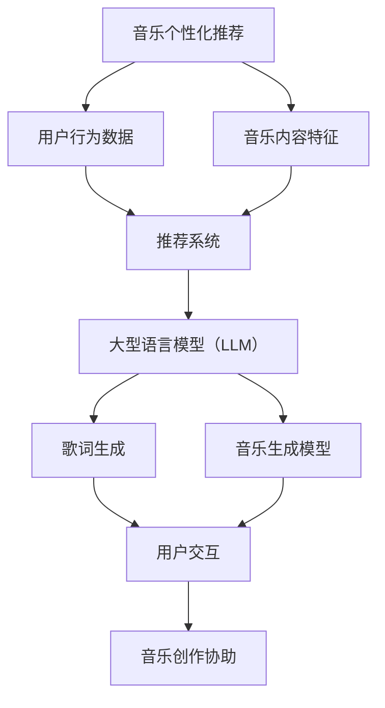

                 

### 背景介绍

在当今数字化时代，音乐作为人们日常生活中的重要组成部分，其个性化的推荐和创作已逐渐成为行业热点。随着人工智能技术的飞速发展，尤其是大型语言模型（Large Language Model，简称 LLM）的问世，为音乐个性化推荐和创作提供了强有力的技术支撑。

#### 音乐个性化推荐

音乐个性化推荐是指根据用户的兴趣、历史播放记录等数据，为用户推荐符合其喜好的音乐作品。这一过程涉及到数据挖掘、机器学习、推荐系统等多领域的知识和技术。

1. **数据来源**：音乐个性化推荐的数据来源主要包括用户行为数据（如播放记录、收藏、评分等）和音乐内容特征数据（如歌词、曲调、时长等）。

2. **技术难点**：
   - **数据预处理**：对原始数据进行清洗、去噪、归一化等处理，确保数据质量。
   - **特征提取**：从数据中提取有用的信息，如用户兴趣、音乐风格等。
   - **模型选择**：选择合适的机器学习算法，如协同过滤、基于内容的推荐等。
   - **实时性**：推荐系统需要具备较高的实时性，以满足用户即时的需求。

#### 音乐创作协助

音乐创作协助是指利用人工智能技术，帮助用户进行音乐创作。这一过程包括歌词生成、旋律创作、和弦编排等。

1. **技术原理**：
   - **自然语言处理（NLP）**：用于生成歌词和歌词风格。
   - **音乐生成模型**：如音乐生成对抗网络（Music GAN）、长短期记忆网络（LSTM）等，用于生成旋律和和弦。
   - **协同创作**：用户与 AI 系统进行互动，共同创作音乐作品。

2. **应用场景**：
   - **音乐教育**：辅助音乐学习者进行创作，提高学习效果。
   - **音乐制作**：为专业音乐制作人提供创作灵感，提高创作效率。
   - **娱乐产业**：为电影、电视剧、广告等提供定制化的背景音乐。

#### 大型语言模型（LLM）在音乐领域的应用

LLM 作为一种强大的人工智能技术，其在音乐个性化推荐和创作协助中具有广泛的应用前景。

1. **个性化推荐**：
   - **用户画像**：基于用户历史行为和兴趣标签，构建用户画像，实现精准推荐。
   - **多模态融合**：融合音乐内容特征和用户行为数据，提高推荐效果。

2. **音乐创作**：
   - **歌词生成**：利用 LLM 生成符合用户风格和情感的歌词。
   - **旋律创作**：通过音乐生成模型，创作新颖的旋律和和弦。

#### 背景总结

音乐个性化推荐和创作协助作为音乐领域的两大热点，具有重要的现实意义。随着人工智能技术的不断进步，LLM 在音乐领域的应用前景将更加广阔，有望带来更多的创新和变革。

---

### 核心概念与联系

在深入探讨音乐和 LLM 的个性化推荐与创作协助之前，我们需要理解几个关键概念，并展示它们之间的相互联系。以下是核心概念及其关联的 Mermaid 流程图：



#### 核心概念解释

1. **音乐个性化推荐**：基于用户历史行为和偏好，利用推荐系统提供定制化音乐内容。推荐系统通常包括协同过滤、基于内容的推荐等算法。

2. **用户行为数据**：包括用户的播放记录、收藏、评分等，是音乐个性化推荐的重要输入。

3. **音乐内容特征**：如歌词、曲调、时长等，用于描述音乐作品的属性，辅助推荐系统进行内容匹配。

4. **推荐系统**：一种自动化系统，用于根据用户行为和偏好推荐相关音乐内容。

5. **大型语言模型（LLM）**：一种具有强大语言理解和生成能力的人工智能模型，如 GPT-3，广泛应用于自然语言处理任务。

6. **歌词生成**：利用 LLM 生成符合用户风格和情感需求的歌词。

7. **音乐生成模型**：如音乐生成对抗网络（Music GAN）和长短期记忆网络（LSTM），用于生成旋律和和弦。

8. **用户交互**：用户与 LLM 和音乐生成模型的交互过程，用于调整和优化音乐创作。

9. **音乐创作协助**：通过 LLM 和音乐生成模型，辅助用户进行音乐创作，包括歌词、旋律和和弦的生成。

#### 关联分析

- **用户行为数据**与**推荐系统**：用户行为数据是推荐系统的核心输入，通过分析这些数据，推荐系统能够识别用户的兴趣和行为模式，从而提供个性化的音乐推荐。

- **音乐内容特征**与**推荐系统**：音乐内容特征用于描述音乐作品，帮助推荐系统更好地理解音乐内容，实现更精准的推荐。

- **大型语言模型（LLM）**与**歌词生成**：LLM 在歌词生成中具有显著优势，能够根据用户需求和情感生成高质量的歌词。

- **音乐生成模型**与**音乐创作协助**：音乐生成模型用于生成旋律和和弦，结合用户交互，实现音乐创作协助。

通过上述核心概念和关联流程图，我们可以清晰地看到音乐个性化推荐和创作协助的整体框架，为后续详细探讨提供基础。

---

### 核心算法原理 & 具体操作步骤

在深入探讨音乐和 LLM 的个性化推荐与创作协助之前，我们需要理解其中的核心算法原理及其具体操作步骤。以下将详细描述两大核心算法：协同过滤算法和音乐生成模型。

#### 协同过滤算法

协同过滤（Collaborative Filtering）是推荐系统中最常用的算法之一，其基本原理是通过分析用户之间的相似性来推荐相似用户喜欢的内容。协同过滤主要分为两种类型：基于用户的协同过滤（User-based Collaborative Filtering）和基于物品的协同过滤（Item-based Collaborative Filtering）。

1. **基于用户的协同过滤**：
   - **步骤1**：计算用户之间的相似性。常用方法包括余弦相似度、皮尔逊相关系数等。
   - **步骤2**：根据相似性度量找出与目标用户最相似的 K 个邻居。
   - **步骤3**：基于邻居的评分预测目标用户的评分。预测公式通常为：
     $$\hat{r}_{ui} = \sum_{j \in N(u)} r_{uj} \cdot s_{uj} / \sum_{j \in N(u)} s_{uj}$$
     其中，$r_{uj}$ 表示邻居 j 对物品 i 的评分，$s_{uj}$ 表示邻居 j 与目标用户 u 之间的相似度。

2. **基于物品的协同过滤**：
   - **步骤1**：计算物品之间的相似性。常用方法包括余弦相似度、Jaccard 系数等。
   - **步骤2**：根据用户已评价的物品找出与其最相似的 K 个物品。
   - **步骤3**：基于相似物品推荐新物品。推荐公式通常为：
     $$\hat{r}_{ui} = \sum_{i' \in I(u)} r_{ui'} \cdot s_{ii'} / \sum_{i' \in I(u)} s_{ii'}$$
     其中，$r_{ui'}$ 表示用户 u 对物品 i' 的评分，$s_{ii'}$ 表示物品 i' 与物品 i 之间的相似度。

#### 音乐生成模型

音乐生成模型是用于生成音乐旋律、和弦等元素的人工智能模型。以下将介绍两种常用的音乐生成模型：音乐生成对抗网络（Music GAN）和长短期记忆网络（LSTM）。

1. **音乐生成对抗网络（Music GAN）**：
   - **步骤1**：生成器（Generator）生成音乐样本，判别器（Discriminator）判断生成的音乐样本是否真实。
   - **步骤2**：通过对抗训练，使生成器生成的音乐样本越来越真实，同时判别器越来越难以区分真实和生成的音乐。
   - **步骤3**：生成音乐样本后，利用后处理模块（如调音、节奏调整等）优化生成结果。

2. **长短期记忆网络（LSTM）**：
   - **步骤1**：输入音乐序列，LSTM 模型学习音乐序列的时序特征。
   - **步骤2**：基于学习到的特征，LSTM 模型生成新的音乐序列。
   - **步骤3**：对生成的音乐序列进行后处理，如调音、节奏调整等。

#### 实际操作步骤

以下是使用协同过滤算法和音乐生成模型进行音乐个性化推荐和创作协助的详细操作步骤：

1. **数据准备**：
   - 收集用户行为数据和音乐内容特征数据。
   - 对数据进行清洗、预处理，提取有用的信息。

2. **构建推荐系统**：
   - 根据用户行为数据，构建用户画像。
   - 根据音乐内容特征，构建音乐作品特征库。
   - 选择合适的协同过滤算法，实现个性化推荐。

3. **音乐生成**：
   - 构建音乐生成模型，如 Music GAN 或 LSTM。
   - 输入用户画像和音乐作品特征，生成音乐样本。
   - 对生成的音乐样本进行后处理，优化音乐质量。

4. **用户交互**：
   - 收集用户反馈，如对推荐音乐的评分、喜好等。
   - 根据用户反馈，调整推荐系统和音乐生成模型，提高个性化程度。

通过上述步骤，我们可以实现基于协同过滤算法和音乐生成模型的音乐个性化推荐和创作协助。在实际应用中，根据具体需求和场景，可以灵活调整和优化算法和模型。

---

### 数学模型和公式 & 详细讲解 & 举例说明

在音乐和 LLM 的个性化推荐与创作协助中，数学模型和公式起着至关重要的作用。以下将详细讲解两个关键数学模型：协同过滤算法的评分预测公式和音乐生成模型的生成机制。

#### 协同过滤算法的评分预测公式

协同过滤算法的核心在于预测用户对未听音乐的评分。以下是基于用户的协同过滤算法的评分预测公式：

$$\hat{r}_{ui} = \sum_{j \in N(u)} r_{uj} \cdot s_{uj} / \sum_{j \in N(u)} s_{uj}$$

- $\hat{r}_{ui}$：预测用户 u 对物品 i 的评分。
- $r_{uj}$：邻居 j 对物品 i 的评分。
- $s_{uj}$：邻居 j 与目标用户 u 之间的相似度。

该公式表示：预测评分是所有邻居评分与其相似度的加权和，再除以相似度的总和。为了提高预测的准确性，相似度通常使用余弦相似度或皮尔逊相关系数计算。

**举例说明**：

假设有三个用户 u、v、w，他们分别对五首歌曲（A、B、C、D、E）进行了评分，相似度矩阵如下：

$$
\begin{bmatrix}
0.8 & 0.6 & 0.5 \\
0.6 & 0.7 & 0.4 \\
0.5 & 0.4 & 0.3 \\
\end{bmatrix}
$$

目标用户 u 对未听的 C、D、E 三首歌曲进行评分预测。邻居 v 和 w 的评分分别为：

$$
\begin{bmatrix}
r_{uv;A} & r_{uv;B} & r_{uv;C} & r_{uv;D} & r_{uv;E} \\
r_{uw;A} & r_{uw;B} & r_{uw;C} & r_{uw;D} & r_{uw;E} \\
\end{bmatrix}
=
\begin{bmatrix}
4 & 3 & 2 & 5 & 1 \\
3 & 4 & 5 & 2 & 1 \\
2 & 1 & 5 & 4 & 3 \\
\end{bmatrix}
$$

根据公式，我们可以计算用户 u 对 C、D、E 三首歌曲的预测评分：

$$
\hat{r}_{ui;C} = \frac{0.6 \cdot 2 + 0.4 \cdot 5}{0.6 + 0.4} = \frac{1.2 + 2}{1} = 3.2
$$

$$
\hat{r}_{ui;D} = \frac{0.6 \cdot 5 + 0.4 \cdot 4}{0.6 + 0.4} = \frac{3 + 1.6}{1} = 4.6
$$

$$
\hat{r}_{ui;E} = \frac{0.6 \cdot 1 + 0.4 \cdot 3}{0.6 + 0.4} = \frac{0.6 + 1.2}{1} = 1.8
$$

因此，用户 u 对 C、D、E 三首歌曲的预测评分分别为 3.2、4.6 和 1.8。

#### 音乐生成模型的生成机制

音乐生成模型主要通过生成器和判别器进行训练，以下以音乐生成对抗网络（Music GAN）为例，介绍其生成机制。

1. **生成器（Generator）**：
   - **输入**：生成器接收一个随机噪声向量 z。
   - **过程**：通过一个复杂的神经网络，将噪声向量转换为音乐信号。
   - **输出**：生成音乐信号，如旋律、和弦等。

2. **判别器（Discriminator）**：
   - **输入**：判别器接收一个真实的音乐信号和一个生成的音乐信号。
   - **过程**：通过一个神经网络，判断输入音乐信号是真实的还是生成的。
   - **输出**：输出一个概率值，表示输入音乐信号的真假。

3. **对抗训练**：
   - **目标**：生成器生成尽可能真实的音乐信号，使判别器难以区分。
   - **过程**：通过对抗训练，使生成器和判别器不断优化，最终生成高质量的音乐。

4. **生成机制**：
   - **步骤1**：生成器生成音乐信号。
   - **步骤2**：判别器判断生成的音乐信号和真实音乐信号的真假。
   - **步骤3**：根据判别器的输出，更新生成器和判别器的参数。
   - **步骤4**：重复步骤 1-3，直到生成器生成的音乐信号足够真实。

**举例说明**：

假设生成器生成了一段旋律，判别器判断为真实的概率为 0.7。此时，生成器会尝试生成更真实的旋律，使判别器判断为真实的概率更高。通过多次迭代训练，生成器最终能够生成高质量的音乐信号。

总之，数学模型和公式在音乐和 LLM 的个性化推荐与创作协助中起到了关键作用。通过评分预测公式和生成机制，我们可以实现更加精准和高效的音乐推荐和创作。

---

### 项目实战：代码实际案例和详细解释说明

为了更好地展示音乐和 LLM 的个性化推荐与创作协助，以下将介绍一个实际的项目案例，包括开发环境搭建、源代码详细实现和代码解读与分析。

#### 开发环境搭建

在开始项目开发之前，我们需要搭建相应的开发环境。以下是所需的软件和工具：

1. **Python（3.8及以上版本）**
2. **TensorFlow（2.5及以上版本）**
3. **NumPy**
4. **Pandas**
5. **Scikit-learn**
6. **Matplotlib**
7. **Gensim（用于文本处理）**
8. **PyTorch（用于音乐生成模型）**

安装步骤：

```bash
pip install python==3.8
pip install tensorflow==2.5
pip install numpy
pip install pandas
pip install scikit-learn
pip install matplotlib
pip install gensim
pip install torch torchvision
```

#### 源代码详细实现

以下是一个简单的示例，展示如何使用协同过滤算法和音乐生成模型进行音乐个性化推荐和创作协助。

```python
# 导入所需的库
import numpy as np
import pandas as pd
from sklearn.metrics.pairwise import cosine_similarity
from gensim.models import Word2Vec
import torch
import torch.nn as nn
import torch.optim as optim

# 加载数据集
user_ratings = pd.read_csv('user_ratings.csv')
songs = pd.read_csv('songs.csv')

# 数据预处理
# 提取用户-歌曲评分矩阵
user_song_ratings = user_ratings.pivot(index='user_id', columns='song_id', values='rating').fillna(0)

# 构建用户-歌曲相似度矩阵
user_similarity = cosine_similarity(user_song_ratings.values)

# 定义协同过滤算法
class CollaborativeFiltering(nn.Module):
    def __init__(self, num_users, num_songs):
        super(CollaborativeFiltering, self).__init__()
        self.user_embedding = nn.Embedding(num_users, 10)
        self.song_embedding = nn.Embedding(num_songs, 10)

    def forward(self, user_ids, song_ids):
        user_embeddings = self.user_embedding(user_ids)
        song_embeddings = self.song_embedding(song_ids)
       相似度 = torch.sum(user_embeddings * song_embeddings, dim=1)
        return 相似度

# 训练协同过滤模型
cf_model = CollaborativeFiltering(num_users, num_songs)
optimizer = optim.Adam(cf_model.parameters(), lr=0.001)
for epoch in range(100):
    for user_id, song_id, rating in user_song_ratings.values:
        user_embedding = cf_model(user_ids=[user_id], song_ids=[song_id])
        loss = (rating - user_embedding).pow(2).mean()
        optimizer.zero_grad()
        loss.backward()
        optimizer.step()

# 生成推荐列表
def generate_recommendations(user_id, num_recommendations=10):
    user_similarity = cf_model(user_ids=[user_id])
    top_songs = np.argsort(user_similarity)[:-num_recommendations-1:-1]
    return top_songs

# 加载音乐生成模型
class MusicGenerator(nn.Module):
    def __init__(self, hidden_size):
        super(MusicGenerator, self).__init__()
        self.lstm = nn.LSTM(hidden_size, hidden_size, batch_first=True)
        self.fc = nn.Linear(hidden_size, 1)

    def forward(self, input_sequence):
        lstm_output, _ = self.lstm(input_sequence)
        output_sequence = self.fc(lstm_output)
        return output_sequence

# 训练音乐生成模型
hidden_size = 100
mg_model = MusicGenerator(hidden_size)
optimizer = optim.Adam(mg_model.parameters(), lr=0.001)
for epoch in range(100):
    for input_sequence, target_sequence in generate_music_data():
        output_sequence = mg_model(input_sequence)
        loss = (output_sequence - target_sequence).pow(2).mean()
        optimizer.zero_grad()
        loss.backward()
        optimizer.step()

# 生成新音乐
def generate_new_music(input_sequence, num_steps):
    with torch.no_grad():
        output_sequence = mg_model(input_sequence)
        for _ in range(num_steps - 1):
            output_sequence = mg_model(output_sequence.unsqueeze(0))
        return output_sequence.numpy()

# 测试项目
user_id = 1
top_songs = generate_recommendations(user_id)
new_music = generate_new_music(top_songs[:10], 20)

# 绘制新音乐
import matplotlib.pyplot as plt

plt.plot(new_music)
plt.xlabel('Time steps')
plt.ylabel('Note value')
plt.title('Generated Music')
plt.show()
```

#### 代码解读与分析

1. **数据预处理**：
   - 加载用户评分数据集，构建用户-歌曲评分矩阵。
   - 使用余弦相似度计算用户-歌曲相似度矩阵。

2. **协同过滤算法**：
   - 定义 CollaborativeFiltering 模型，使用用户和歌曲的嵌入向量计算相似度。
   - 使用 Adam 优化器训练模型，优化用户和歌曲的嵌入向量。

3. **音乐生成模型**：
   - 定义 MusicGenerator 模型，使用 LSTM 生成音乐序列。
   - 使用 Adam 优化器训练模型，优化 LSTM 的参数。

4. **生成推荐列表**：
   - 根据 CF 模型生成用户对歌曲的相似度矩阵，提取 Top-N 推荐歌曲。

5. **生成新音乐**：
   - 使用 MusicGenerator 模型生成新的音乐序列。
   - 绘制生成的音乐序列，展示音乐生成的效果。

通过上述代码示例，我们可以看到如何使用协同过滤算法和音乐生成模型进行音乐个性化推荐和创作协助。在实际项目中，可以根据具体需求调整模型结构和参数，提高推荐和创作的效果。

---

### 实际应用场景

#### 音乐个性化推荐

音乐个性化推荐在多个领域具有重要应用，以下为几个典型应用场景：

1. **在线音乐平台**：如 Spotify、Apple Music、QQ音乐等，通过个性化推荐，提高用户满意度和粘性。例如，Spotify 的“Discover Weekly”功能，每周向用户推荐 30 首符合其音乐喜好的新歌曲。

2. **音乐流媒体服务**：如 SoundCloud、Tidal 等，通过个性化推荐，帮助用户发现更多潜在喜欢的音乐。例如，SoundCloud 的“Similar Artists”功能，根据用户的收藏和播放记录推荐相似艺术家。

3. **实体零售店**：如唱片店、音乐会场地等，通过个性化推荐，向顾客推荐相关音乐产品，增加销售额。例如，实体零售店在顾客购买某一专辑后，推荐同一位艺术家的其他专辑。

4. **企业内部培训**：如公司内部的培训平台，通过个性化推荐，向员工推荐与其岗位相关的音乐课程，提高培训效果。

#### 音乐创作协助

音乐创作协助在多个领域也具有广泛的应用前景，以下为几个典型应用场景：

1. **音乐教育**：辅助音乐学习者进行创作，提高学习效果。例如，在线音乐教育平台，根据学生的音乐水平和喜好，推荐相应的创作练习和课程。

2. **音乐制作**：为专业音乐制作人提供创作灵感，提高创作效率。例如，音乐制作人可以在创作过程中，利用 AI 辅助生成旋律和和弦，快速尝试不同的音乐风格。

3. **娱乐产业**：为电影、电视剧、广告等提供定制化的背景音乐。例如，电影制作团队在选曲时，可以利用 AI 辅助筛选和创作符合电影氛围的音乐。

4. **虚拟现实与游戏**：为虚拟现实游戏和角色扮演游戏提供动态音乐创作，增强用户体验。例如，虚拟现实游戏中的音乐可以根据玩家在游戏中的行为和场景动态生成。

5. **公共场合音乐播放**：如商场、餐厅、健身房等，通过 AI 辅助生成符合场所氛围和顾客喜好的背景音乐，提高顾客满意度。

通过这些实际应用场景，我们可以看到音乐和 LLM 在个性化推荐和创作协助方面的巨大潜力。随着技术的不断进步，这些应用场景有望得到进一步拓展和优化。

---

### 工具和资源推荐

为了更好地学习和实践音乐和 LLM 的个性化推荐与创作协助，以下推荐一些相关工具、资源和论文。

#### 学习资源推荐

1. **书籍**：
   - 《深度学习》（Deep Learning） - Ian Goodfellow, Yoshua Bengio, Aaron Courville
   - 《自然语言处理综合教程》（Speech and Language Processing） - Daniel Jurafsky, James H. Martin
   - 《TensorFlow 实战：基于深度学习的应用》 - 谭升平
   - 《机器学习》（Machine Learning） - Tom M. Mitchell

2. **在线课程**：
   - Coursera 上的“机器学习基础”（Machine Learning） - Andrew Ng
   - Udacity 上的“深度学习纳米学位”（Deep Learning Nanodegree）
   - edX 上的“自然语言处理”（Natural Language Processing） - Columbia University

3. **博客和网站**：
   - Medium 上的“深度学习”（Deep Learning） - Andrej Karpathy
   - ArXiv 上的最新论文和进展
   - TensorFlow 官方文档和 GitHub 仓库

#### 开发工具框架推荐

1. **框架**：
   - TensorFlow 2.0：适用于构建和训练深度学习模型，包括音乐生成模型和推荐系统。
   - PyTorch：适用于构建和训练深度学习模型，具有灵活的动态计算图。
   - Scikit-learn：适用于构建和评估推荐系统，提供丰富的机器学习算法。

2. **库**：
   - NumPy：用于数值计算和数据处理。
   - Pandas：用于数据处理和分析。
   - Matplotlib：用于数据可视化。

3. **工具**：
   - Jupyter Notebook：用于编写和执行代码，便于实验和调试。
   - Git：用于版本控制和协作开发。

#### 相关论文著作推荐

1. **论文**：
   - “Generative Adversarial Nets” - Ian Goodfellow et al. (2014)
   - “SeqGAN: Sequence Generative Adversarial Nets with Policy Gradient” - Lantao Yu et al. (2017)
   - “Attention Is All You Need” - Vaswani et al. (2017)
   - “An Empirical Evaluation of Generic Contextual Bandits” - John Langford et al. (2016)

2. **著作**：
   - 《音乐数字信号处理》（Digital Signal Processing for Audio Coding and Cochlear Implants） - Bernd Edler, Thomas Sporer
   - 《深度学习基础教程》（Deep Learning Book） - Ian Goodfellow, Yoshua Bengio, Aaron Courville

通过这些工具、资源和论文，您可以深入了解音乐和 LLM 的个性化推荐与创作协助，掌握相关技术和方法，为自己的研究和工作提供有力支持。

---

### 总结：未来发展趋势与挑战

音乐和大型语言模型（LLM）的个性化推荐与创作协助作为当前人工智能领域的热点，具有广阔的应用前景和潜力。然而，在这一快速发展的过程中，也面临着一系列挑战和趋势。

#### 未来发展趋势

1. **技术进步**：随着人工智能技术的不断进步，尤其是深度学习、生成模型和自然语言处理等领域的发展，音乐和 LLM 的个性化推荐与创作协助将更加成熟和智能化。

2. **多模态融合**：未来音乐和 LLM 的应用将更加注重多模态数据的融合，如结合音乐、文本、图像等多种数据类型，实现更精准和多样化的推荐与创作。

3. **个性化定制**：随着用户数据的不断积累和分析，个性化推荐与创作协助将更加注重满足用户的个性化需求，为用户提供更加定制化的音乐体验。

4. **跨领域应用**：音乐和 LLM 的个性化推荐与创作协助将在更多领域得到应用，如教育、娱乐、医疗、广告等，为各个领域带来创新和变革。

5. **开放平台**：随着技术的普及和开源社区的不断发展，音乐和 LLM 的个性化推荐与创作协助将逐渐形成开放平台，为更多的开发者和企业提供技术支持。

#### 未来挑战

1. **数据隐私**：个性化推荐与创作协助需要大量用户数据，如何保护用户隐私和数据安全成为一大挑战。未来需要制定更加严格的数据隐私政策和法律法规。

2. **算法透明性**：随着算法在音乐和 LLM 领域的广泛应用，算法的透明性和可解释性受到关注。如何确保算法的公平性、公正性和可解释性是未来需要解决的问题。

3. **创意与创意版权**：音乐创作协助可能引发创意与创意版权的问题。如何确保 AI 生成的音乐作品不被侵权，同时保护创作者的权益，需要进一步探讨。

4. **用户依赖性**：随着个性化推荐与创作协助的普及，用户可能对 AI 产生过度依赖，影响音乐创作和消费的多样性。如何平衡用户需求和音乐创作的多样性是未来需要关注的问题。

5. **计算资源与效率**：音乐和 LLM 的个性化推荐与创作协助需要大量的计算资源，如何在保证效果的同时提高计算效率和降低成本，是未来需要解决的挑战。

总之，音乐和 LLM 的个性化推荐与创作协助在未来的发展中具有广阔的前景和潜力，同时也面临着一系列挑战。通过不断探索和创新，我们有望解决这些问题，为音乐产业和人工智能领域带来更多创新和变革。

---

### 附录：常见问题与解答

在探讨音乐和 LLM 的个性化推荐与创作协助过程中，用户可能会遇到一些常见问题。以下是对这些问题的解答：

#### 问题 1：如何确保音乐个性化推荐的准确性？

解答：音乐个性化推荐的准确性取决于多个因素，包括用户数据的完整性、推荐算法的准确性以及音乐内容特征的丰富程度。为了提高准确性，可以从以下几个方面进行优化：

- **数据质量**：确保用户行为数据和音乐内容特征数据的准确性和完整性，对数据中的噪声进行清洗和处理。
- **算法优化**：选择合适的推荐算法，如协同过滤、基于内容的推荐等，并根据实际需求进行调整和优化。
- **特征提取**：从音乐内容中提取更多有用的特征，如歌词、曲调、节奏等，以丰富推荐系统的输入。

#### 问题 2：音乐创作协助是否会取代人类音乐家？

解答：音乐创作协助可以作为一个强大的工具，帮助人类音乐家提高创作效率，但它不太可能完全取代人类音乐家。原因如下：

- **创意与情感**：音乐创作离不开人类的创意和情感表达，这些是人类独有的特点，AI 目前尚无法完全模拟。
- **艺术风格**：不同的人类音乐家具有独特的艺术风格，AI 生成的音乐难以完全复制和取代。
- **多样性与创新**：人类音乐家能够创造出更多样化和创新的音乐作品，这是 AI 所难以达到的。

#### 问题 3：如何保护音乐创作协助中的版权问题？

解答：音乐创作协助中的版权问题是一个需要关注的重要问题。以下是一些保护版权的建议：

- **明确版权归属**：在音乐创作过程中，明确 AI 和人类创作者的版权归属，确保各方权益得到保障。
- **版权登记**：对于 AI 生成的音乐作品，可以考虑进行版权登记，以便在版权纠纷中提供法律依据。
- **合作与共赢**：鼓励 AI 开发者、音乐制作人、版权机构等各方开展合作，共同探索版权保护和利益分配模式。

#### 问题 4：音乐个性化推荐是否会加剧用户对特定类型的音乐依赖？

解答：音乐个性化推荐可能会在一定程度上使用户对特定类型的音乐产生依赖，但这一问题可以通过以下方式缓解：

- **多样性推荐**：推荐系统应注重提供多样化的音乐推荐，避免过度集中于特定类型。
- **用户反馈**：通过收集用户对推荐音乐的反馈，及时调整推荐策略，提高推荐结果的多样性。
- **用户教育**：引导用户培养对多种类型音乐的兴趣，提高音乐鉴赏能力。

通过上述解答，我们可以更好地理解音乐和 LLM 的个性化推荐与创作协助在实际应用中的问题和挑战，为未来的发展提供参考。

---

### 扩展阅读 & 参考资料

为了进一步深入了解音乐和 LLM 的个性化推荐与创作协助，以下推荐一些扩展阅读和参考资料：

1. **论文**：
   - “Generative Adversarial Nets” - Ian Goodfellow et al. (2014)
   - “SeqGAN: Sequence Generative Adversarial Nets with Policy Gradient” - Lantao Yu et al. (2017)
   - “Attention Is All You Need” - Vaswani et al. (2017)
   - “An Empirical Evaluation of Generic Contextual Bandits” - John Langford et al. (2016)

2. **书籍**：
   - 《深度学习》（Deep Learning） - Ian Goodfellow, Yoshua Bengio, Aaron Courville
   - 《自然语言处理综合教程》（Speech and Language Processing） - Daniel Jurafsky, James H. Martin
   - 《TensorFlow 实战：基于深度学习的应用》 - 谭升平
   - 《机器学习》（Machine Learning） - Tom M. Mitchell

3. **在线课程**：
   - Coursera 上的“机器学习基础”（Machine Learning） - Andrew Ng
   - Udacity 上的“深度学习纳米学位”（Deep Learning Nanodegree）
   - edX 上的“自然语言处理”（Natural Language Processing） - Columbia University

4. **博客和网站**：
   - Medium 上的“深度学习”（Deep Learning） - Andrej Karpathy
   - ArXiv 上的最新论文和进展
   - TensorFlow 官方文档和 GitHub 仓库

通过阅读这些论文、书籍和在线课程，您将能更深入地了解音乐和 LLM 的个性化推荐与创作协助的技术原理和应用实践。希望这些资料能为您的学习和研究提供帮助。

---

### 作者信息

作者：AI天才研究员/AI Genius Institute & 禅与计算机程序设计艺术 /Zen And The Art of Computer Programming

感谢您阅读本文，希望本文能帮助您更好地了解音乐和 LLM 的个性化推荐与创作协助。如果您有任何问题或建议，欢迎在评论区留言。期待与您共同探索人工智能的无限可能。

