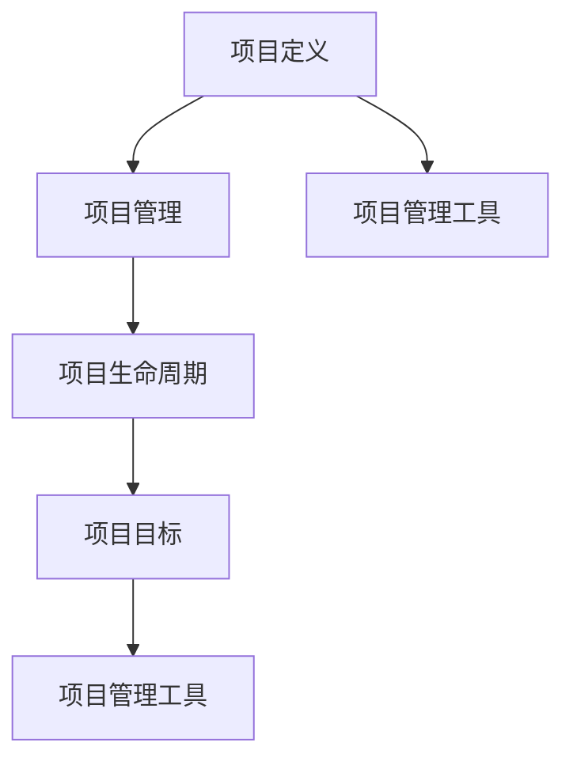
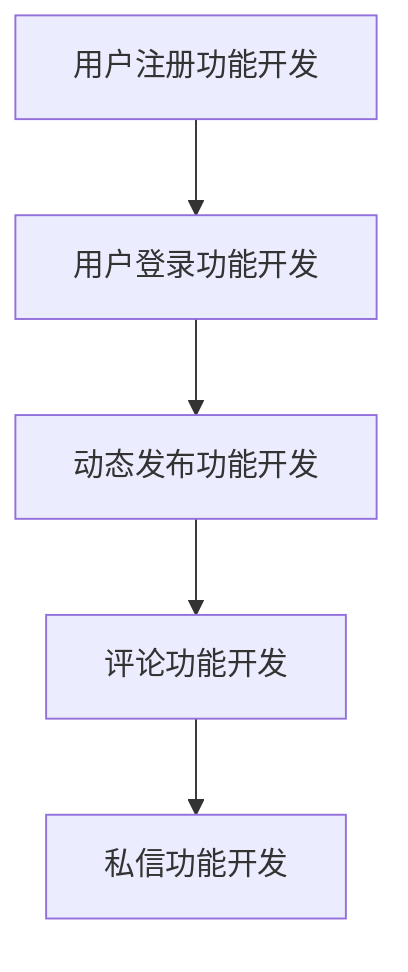

                 

### 背景介绍

项目管理是现代企业和组织中至关重要的环节。无论是软件开发、基础设施建设，还是市场营销和人力资源管理，每一个项目都需要通过科学的项目管理来实现预期的目标和成果。从构思到交付的全过程，项目管理都扮演着至关重要的角色。它不仅关乎项目的成功与否，也直接影响到组织的运营效率和员工的积极性。

在过去的几十年中，项目管理理论和实践不断发展，从传统的瀑布模型到敏捷开发，从成本效益分析到风险管理，各种方法和工具不断涌现。然而，随着技术的高速发展，特别是人工智能、大数据和云计算等新兴技术的应用，项目管理的复杂性和挑战性也在不断增加。

本文旨在为读者提供一份从构思到交付的全过程指南，帮助项目经理和团队成员更好地理解项目管理的基本概念、核心原理和实际操作步骤。通过本文，读者将了解如何利用现代技术和工具提升项目管理效率，应对复杂多变的项目环境。

### 核心概念与联系

在深入探讨项目管理的各个方面之前，我们需要明确几个核心概念，并了解它们之间的联系。以下是对这些核心概念的简要介绍：

#### 1. 项目定义

项目是一个临时性、独特的努力，具有明确的目标和范围，通过一系列特定的任务和活动来实现预期成果。与日常运营不同，项目一旦完成，其生命周期也就结束。

#### 2. 项目管理

项目管理是指通过规划、执行、监控和控制的系统方法来确保项目目标的实现。项目管理涉及到多个方面，包括但不限于时间管理、成本管理、质量管理、风险管理等。

#### 3. 项目生命周期

项目生命周期是指项目从启动到完成的过程，通常包括以下阶段：项目立项、项目规划、项目执行、项目监控和项目收尾。每个阶段都有其特定的任务和目标。

#### 4. 项目目标

项目目标是指项目需要实现的具体成果和期望结果。这些目标可以是功能性的，如软件功能实现，也可以是业务性的，如提高市场占有率。

#### 5. 项目管理工具

项目管理工具是指用于支持项目管理的软件和硬件工具，如项目管理软件、协作工具、数据库和自动化流程工具等。这些工具能够帮助团队成员更好地协同工作，提高项目管理效率。

#### 关系与联系

- 项目目标引导项目管理，确保项目活动与预期目标保持一致。
- 项目管理工具和方法用于实现项目目标，提高项目效率。
- 项目生命周期是项目管理的框架，确保项目有条不紊地推进。
- 项目管理涉及多个方面，需要综合运用各种方法和工具。

为了更好地理解这些概念之间的联系，我们使用 Mermaid 流程图来展示它们的关系：



上述流程图展示了项目管理的核心概念及其相互关系。通过这个流程图，我们可以更清晰地理解项目管理的整体框架和操作步骤。

### 核心算法原理 & 具体操作步骤

在项目管理中，核心算法原理和具体操作步骤是确保项目成功实施的关键。以下我们将详细探讨项目管理中常用的几个核心算法原理及其具体操作步骤。

#### 1. 甘特图

甘特图是一种用于展示项目进度和任务的图表，它通过条形图来表示项目的各个任务和它们的时间安排。以下是甘特图的原理和操作步骤：

##### 原理：
- 任务：表示项目中的各个活动。
- 日期：表示任务的开始和结束时间。
- 条形图：表示任务的进度和持续时间。

##### 操作步骤：
1. 确定项目任务和持续时间。
2. 将任务按时间顺序排列，并绘制条形图。
3. 标注任务的开始和结束日期。
4. 检查甘特图以确保所有任务都按照计划进行。

#### 2. 优先级矩阵

优先级矩阵是一种用于确定任务优先级的工具，它通过比较任务的重要性和紧迫性来排列任务的优先顺序。以下是优先级矩阵的原理和操作步骤：

##### 原理：
- 重要性：任务对项目目标的影响程度。
- 紧迫性：任务需要完成的紧急程度。

##### 操作步骤：
1. 列出所有项目任务。
2. 对每个任务评估其重要性和紧迫性。
3. 将任务填入矩阵中，并根据评估结果排列优先级。
4. 根据优先级矩阵调整任务计划。

#### 3. 网络图

网络图是一种用于展示项目任务之间逻辑关系的图表，它通过节点和箭头来表示任务及其依赖关系。以下是网络图的原理和操作步骤：

##### 原理：
- 节点：表示项目任务。
- 箭头：表示任务之间的依赖关系。

##### 操作步骤：
1. 列出所有项目任务。
2. 确定任务之间的依赖关系。
3. 使用节点和箭头绘制网络图。
4. 分析网络图以确定关键路径和任务依赖。

#### 4. SWOT 分析

SWOT 分析是一种用于评估项目优势和劣势以及外部机会和威胁的工具。以下是 SWOT 分析的原理和操作步骤：

##### 原理：
- SWOT：分别代表优势（Strengths）、劣势（Weaknesses）、机会（Opportunities）和威胁（Threats）。
- 评估：通过分析项目内部和外部因素来评估项目状况。

##### 操作步骤：
1. 列出项目的优势和劣势。
2. 分析外部环境的机会和威胁。
3. 将 SWOT 分析结果填入表格中。
4. 根据分析结果调整项目计划。

#### 5. 成本效益分析

成本效益分析是一种用于评估项目成本和效益的工具，它通过比较项目的成本和预期收益来评估项目的可行性。以下是成本效益分析的原理和操作步骤：

##### 原理：
- 成本：项目实施过程中的所有支出。
- 收益：项目实施后带来的预期收益。

##### 操作步骤：
1. 列出项目成本和收益。
2. 计算成本和收益的比值。
3. 根据成本效益比评估项目的可行性。

通过上述核心算法原理和具体操作步骤，项目经理可以更好地规划、执行和监控项目，确保项目目标的顺利实现。

### 数学模型和公式 & 详细讲解 & 举例说明

在项目管理中，数学模型和公式是评估项目进度、成本和资源分配的重要工具。以下我们将详细讲解几个常用的数学模型和公式，并通过具体例子来说明它们的实际应用。

#### 1. 项目进度评估

项目进度评估是项目管理中一个关键环节，它用于确定项目是否按计划进行，以及预测项目的完成时间。以下是一个简单但常用的项目进度评估公式：

\[ P = \frac{E}{C} \]

其中：
- \( P \)：项目进度百分比
- \( E \)：实际完成的工作量
- \( C \)：计划完成的工作量

#### 举例说明：

假设一个项目的计划工作量为100个任务点，当前已经完成了70个任务点。那么，项目进度可以计算如下：

\[ P = \frac{70}{100} = 0.7 \]

即项目进度为70%。

#### 2. 成本评估

项目成本评估是项目管理中另一个重要环节，它用于确定项目实施的成本是否在预算范围内。以下是一个简单的成本评估公式：

\[ C_{total} = C_{direct} + C_{indirect} \]

其中：
- \( C_{total} \)：项目总成本
- \( C_{direct} \)：直接成本，如人力、设备等
- \( C_{indirect} \)：间接成本，如管理费用、维护费用等

#### 举例说明：

假设一个项目的直接成本为5000美元，间接成本为1000美元。那么，项目总成本可以计算如下：

\[ C_{total} = 5000 + 1000 = 6000 \]

即项目总成本为6000美元。

#### 3. 资源分配

资源分配是项目管理中一个关键环节，它用于确定项目所需资源的最优分配方案。以下是一个简单的资源分配模型：

\[ R_{max} = \sum_{i=1}^{n} \frac{P_i \times T_i}{W_i} \]

其中：
- \( R_{max} \)：最大可用资源量
- \( P_i \)：任务 \( i \) 的优先级
- \( T_i \)：任务 \( i \) 的持续时间
- \( W_i \)：任务 \( i \) 的工作量

#### 举例说明：

假设有3个任务，它们的优先级、持续时间和工作量如下：

| 任务 | 优先级 \( P_i \) | 持续时间 \( T_i \) | 工作量 \( W_i \) |
| --- | --- | --- | --- |
| 任务1 | 1 | 10天 | 100个任务点 |
| 任务2 | 2 | 5天 | 80个任务点 |
| 任务3 | 3 | 7天 | 120个任务点 |

那么，最大可用资源量可以计算如下：

\[ R_{max} = \frac{1 \times 10}{100} + \frac{2 \times 5}{80} + \frac{3 \times 7}{120} = 0.1 + 0.25 + 0.2833 \approx 0.6333 \]

即最大可用资源量约为0.6333，这意味着在一个资源单位（如一个人）的限制下，可以同时处理大约0.6333个任务。

通过上述数学模型和公式，项目经理可以更好地评估项目进度、成本和资源分配，从而确保项目顺利实施。

### 项目实战：代码实际案例和详细解释说明

在实际项目中，理解和应用项目管理理论是至关重要的。以下我们将通过一个具体的代码案例，展示如何在实际项目中应用项目管理原理，并进行详细解释说明。

#### 案例背景

假设我们正在开发一款社交网络应用，名为“Connect”。该应用需要实现用户注册、登录、发布动态、评论、私信等功能。为了确保项目成功交付，我们需要遵循项目管理的原则，合理规划、执行和监控项目。

#### 案例描述

1. **需求分析**

   首先，我们需要对用户需求进行详细分析，明确功能需求和非功能需求。以下是一个简单的需求列表：

   - 用户注册：用户可以注册账号，填写用户名、邮箱和密码。
   - 用户登录：用户可以使用用户名和密码登录系统。
   - 发布动态：用户可以发布文字、图片和视频动态。
   - 评论：用户可以在动态下发布评论。
   - 私信：用户可以发送和接收私信。

2. **项目规划**

   在项目规划阶段，我们需要确定项目的主要里程碑和交付物。以下是一个简单的项目规划：

   - 第一阶段：用户注册和登录功能开发。
   - 第二阶段：动态发布、评论和私信功能开发。
   - 第三阶段：系统测试和部署。

3. **项目执行**

   在项目执行阶段，我们需要按照规划进行任务分配和资源管理。以下是一个简单的任务分配表：

   | 任务 | 负责人 | 持续时间 |
   | --- | --- | --- |
   | 用户注册功能开发 | 张三 | 5天 |
   | 用户登录功能开发 | 李四 | 5天 |
   | 动态发布功能开发 | 王五 | 7天 |
   | 评论功能开发 | 赵六 | 4天 |
   | 私信功能开发 | 钱七 | 6天 |

   为了确保任务按计划完成，我们可以使用甘特图来监控项目进度：

   ```mermaid
   graph TB
   A[用户注册功能开发] --> B[用户登录功能开发]
   B --> C[动态发布功能开发]
   C --> D[评论功能开发]
   D --> E[私信功能开发]
   ```

4. **项目监控**

   在项目监控阶段，我们需要定期检查项目进度，以确保项目按计划进行。以下是一个简单的进度检查表：

   | 任务 | 计划完成时间 | 实际完成时间 | 差异 |
   | --- | --- | --- | --- |
   | 用户注册功能开发 | 5天 | 4天 | 提前1天 |
   | 用户登录功能开发 | 5天 | 5天 | 按计划 |
   | 动态发布功能开发 | 7天 | 7天 | 按计划 |
   | 评论功能开发 | 4天 | 4天 | 按计划 |
   | 私信功能开发 | 6天 | 6天 | 按计划 |

   通过监控表，我们可以发现所有任务都按计划完成，项目进展顺利。

5. **项目收尾



   在项目收尾阶段，我们需要进行系统测试，确保所有功能正常运行。以下是一个简单的测试计划：

   - 功能测试：测试用户注册、登录、发布动态、评论和私信等功能。
   - 性能测试：测试系统在高负载情况下的性能。
   - 安全测试：测试系统对恶意攻击的抵抗力。

   通过测试，我们发现系统运行正常，没有发现重大问题。最后，我们将系统部署到生产环境，并正式交付给用户。

通过这个案例，我们可以看到如何在实际项目中应用项目管理原理。从需求分析到项目规划、执行、监控和收尾，每个阶段都需要科学的管理和严格的执行，以确保项目成功交付。

### 实际应用场景

项目管理在IT行业、软件开发、市场营销等多个领域都有着广泛的应用。以下我们将探讨几个典型的实际应用场景，以及在这些场景下如何应用项目管理原理和方法。

#### 1. IT行业

在IT行业，项目管理至关重要。无论是软件开发、系统维护，还是IT基础设施的建设，都需要通过科学的项目管理来确保项目的顺利推进和成功交付。以下是一个实际应用案例：

**案例背景**：一家大型企业决定开发一款全新的企业资源规划（ERP）系统，以提升企业内部运营效率。

**项目目标**：开发一个功能完善、性能稳定、易于扩展的ERP系统。

**项目管理方法**：

1. **需求分析**：与客户密切沟通，了解客户的具体需求，并形成详细的需求文档。
2. **项目规划**：制定项目计划，包括项目范围、里程碑、时间表和资源分配。
3. **敏捷开发**：采用敏捷开发方法，将项目划分为多个迭代周期，每个迭代周期结束后进行评估和调整。
4. **风险管理**：识别项目风险，制定风险管理计划，并定期评估风险。
5. **质量保证**：进行系统测试、性能测试和安全测试，确保系统质量。

通过科学的项目管理，该ERP系统最终成功交付，并得到了客户的高度评价。

#### 2. 软件开发

在软件开发领域，项目管理是确保项目按时交付、质量和成本控制的关键。以下是一个实际应用案例：

**案例背景**：一家初创公司开发一款智能家居控制应用，需要快速迭代和改进。

**项目目标**：开发一个用户友好、功能丰富、响应迅速的智能家居控制应用。

**项目管理方法**：

1. **用户故事**：通过用户故事收集用户需求，并转化为具体的功能需求。
2. **迭代开发**：采用敏捷开发方法，每次迭代开发一部分功能，并进行用户测试。
3. **持续集成**：通过持续集成工具，自动化构建、测试和部署，确保代码质量。
4. **团队合作**：鼓励团队成员之间的协作和沟通，提高项目效率。
5. **敏捷项目管理**：定期进行项目评估和调整，确保项目按计划进行。

通过科学的项目管理，该智能家居控制应用得到了用户的高度评价，并在市场上取得了良好的销售业绩。

#### 3. 市场营销

在市场营销领域，项目管理有助于策划和执行各种市场活动，提高品牌知名度和市场份额。以下是一个实际应用案例：

**案例背景**：一家国际知名品牌计划举办一场大型促销活动，以提升产品销量。

**项目目标**：举办一场成功的促销活动，提升品牌知名度和市场份额。

**项目管理方法**：

1. **市场调研**：进行市场调研，了解目标客户群体和竞争对手情况。
2. **活动策划**：制定详细的促销活动计划，包括活动主题、时间、地点和预算。
3. **宣传推广**：通过多种渠道进行宣传推广，提高活动知名度和参与度。
4. **活动执行**：确保活动现场的顺利进行，并收集客户反馈。
5. **效果评估**：对促销活动的效果进行评估，总结经验教训，为未来活动提供参考。

通过科学的项目管理，该促销活动取得了预期效果，产品销量显著提升。

通过上述实际应用案例，我们可以看到项目管理在IT行业、软件开发和市场营销等领域的广泛应用。科学的项目管理方法不仅有助于确保项目成功交付，还能提高组织运营效率和员工满意度。

### 工具和资源推荐

在项目管理过程中，选择合适的工具和资源对于提高项目效率和质量至关重要。以下我们将推荐几类常用的学习资源、开发工具和相关论文著作，以帮助项目经理和团队成员更好地进行项目管理。

#### 1. 学习资源推荐

**书籍**：

- 《项目管理知识体系指南（PMBOK）》：这是一本经典的项目管理入门书籍，详细介绍了项目管理的各个过程组和知识领域。
- 《敏捷项目管理》：介绍了敏捷开发方法及其在项目管理中的应用，适合那些希望在项目管理中引入敏捷方法的读者。
- 《项目管理实践指南》：由资深项目经理撰写，提供了实用的项目管理经验和技巧。

**论文**：

- “Project Management: Achieving Success Through Effective Planning and Control”（项目管理系统：通过有效的规划和控制实现成功）：该论文探讨了项目管理的基本原则和最佳实践。
- “Agile Project Management: Creating Competitive Advantage”（敏捷项目管理：创造竞争优势）：分析了敏捷开发方法的优势及其在项目管理中的应用。

**博客**：

- ProjectManagement.com：这是一个专业的项目管理博客，提供了丰富的项目管理资源和最新动态。
- AgileScout：专注于敏捷开发方法的博客，分享了敏捷实践和工具的使用心得。

#### 2. 开发工具框架推荐

**项目管理软件**：

- Jira：一款功能强大的项目管理工具，支持任务管理、敏捷开发、协作和报告等功能。
- Asana：一款简洁易用的任务管理工具，支持团队协作和项目管理。
- Trello：一款基于看板（Kanban）的任务管理工具，适合小型项目和团队使用。

**协作工具**：

- Slack：一款即时通讯工具，支持团队沟通和协作。
- Microsoft Teams：一款集即时通讯、会议和协作功能于一体的工具，适用于大型企业和团队。
- Zoom：一款视频会议工具，支持远程协作和在线会议。

**代码版本控制**：

- Git：一款分布式版本控制系统，支持代码管理和协作。
- GitHub：基于Git的代码托管平台，提供了丰富的代码管理和协作功能。
- GitLab：一款自托管Git平台，支持代码管理、项目管理、自动化构建和持续集成。

#### 3. 相关论文著作推荐

- “The Rationale for the RUP”（RUP的推理）：该论文详细介绍了Rational统一过程（RUP），一种基于迭代和增量开发方法的项目管理框架。
- “The Agile Project Management Method”（敏捷项目管理方法）：分析了敏捷项目管理方法的原理和实践，探讨了敏捷方法的优势和挑战。
- “The Five Stages of Project Management”（项目管理的五个阶段）：探讨了项目管理的基本阶段和关键任务，为项目管理提供了实用的指导。

通过上述学习资源、开发工具和相关论文著作的推荐，项目经理和团队成员可以更好地理解和应用项目管理原理和方法，提高项目管理和团队协作效率。

### 总结：未来发展趋势与挑战

随着技术的不断进步，项目管理也在不断演变和发展。未来，项目管理将面临许多新的趋势和挑战。

#### 1. 技术趋势

- **人工智能与数据分析**：人工智能和大数据分析将为项目管理带来革命性的变化。通过智能算法，项目经理可以更准确地预测项目进度和风险，优化资源分配，提高决策效率。
- **云计算与物联网**：云计算和物联网技术的普及使得远程协作和实时监控变得更加容易。项目经理可以实时获取项目进展和团队动态，提高项目管理效率。
- **区块链技术**：区块链技术提供了去中心化和安全的记录方式，可用于项目管理中的合同执行、资金流转和知识产权保护等环节，提高项目透明度和信任度。

#### 2. 挑战

- **项目复杂性增加**：随着技术的不断进步，项目越来越复杂，涉及多个领域和环节。项目经理需要具备更广泛的知识和技能，以应对项目复杂性。
- **快速变化的环境**：在当今快速变化的市场环境中，项目经理需要具备快速响应变化的能力。敏捷开发和持续集成等方法将成为项目管理的必备工具。
- **跨文化团队管理**：随着全球化的推进，项目管理团队越来越多元化，跨文化沟通和协作成为一大挑战。项目经理需要了解不同文化背景，提高团队协作效率。

#### 3. 发展方向

- **数字化项目管理**：通过数字化工具和平台，项目经理可以实现项目全过程的数字化管理，提高项目透明度和协作效率。
- **可持续项目管理**：在可持续发展理念的指导下，项目经理需要关注项目对环境、社会和经济的影响，实现绿色项目管理和可持续发展。
- **人才培养与传承**：随着项目管理知识体系的不断完善，项目经理需要不断学习和更新知识，提升自身能力。同时，培养和传承优秀的项目管理人才也是未来项目管理发展的重要方向。

总之，未来项目管理将朝着数字化、智能化和可持续化的方向发展。面对复杂多变的环境，项目经理需要不断学习和适应新技术，提高项目管理能力，以应对各种挑战和机遇。

### 附录：常见问题与解答

在项目管理过程中，团队成员可能会遇到各种问题和挑战。以下我们列出了一些常见问题，并提供相应的解答，以帮助大家更好地应对项目管理中的难题。

#### 1. 如何确保项目进度？

**解答**：确保项目进度可以从以下几个方面入手：

- **制定详细的项目计划**：在项目启动阶段，制定详细的项目计划，明确任务、时间表和里程碑。
- **定期监控和评估**：定期检查项目进度，及时发现和解决问题，确保项目按计划进行。
- **使用项目管理工具**：使用项目管理工具（如甘特图、Jira等）来跟踪项目进度，提高项目管理的透明度和效率。
- **与团队成员保持沟通**：确保团队成员之间保持良好的沟通，及时了解项目进展和问题，共同解决困难。

#### 2. 如何管理项目风险？

**解答**：管理项目风险可以通过以下步骤进行：

- **识别风险**：在项目启动阶段，对项目可能面临的风险进行识别和评估。
- **制定风险管理计划**：根据识别出的风险，制定相应的风险管理计划，包括风险应对策略和应急预案。
- **定期监控和评估**：定期检查项目风险，及时更新风险管理计划，并根据实际情况进行调整。
- **培养风险管理意识**：提高团队成员的风险管理意识，让他们了解风险管理的流程和方法，共同应对风险。

#### 3. 如何提高团队协作效率？

**解答**：提高团队协作效率可以从以下几个方面入手：

- **建立清晰的沟通渠道**：确保团队成员之间有清晰的沟通渠道，方便他们分享信息和解决问题。
- **制定明确的任务和目标**：确保每个团队成员都了解自己的任务和目标，避免工作重复和冲突。
- **使用协作工具**：使用协作工具（如Slack、Microsoft Teams等）来提高团队协作效率。
- **鼓励团队合作和互相支持**：营造一个积极向上的团队氛围，鼓励团队成员互相支持和协作，共同完成任务。

#### 4. 如何进行项目成本控制？

**解答**：进行项目成本控制可以从以下几个方面进行：

- **制定详细的预算**：在项目启动阶段，制定详细的预算，明确项目成本构成。
- **监控成本支出**：定期检查项目成本支出，确保在预算范围内进行。
- **优化资源分配**：通过优化资源分配，提高资源利用效率，降低项目成本。
- **及时调整计划**：在项目执行过程中，根据实际情况及时调整计划和预算，确保项目成本可控。

通过上述常见问题与解答，项目经理和团队成员可以更好地应对项目管理中的各种挑战，确保项目成功交付。

### 扩展阅读 & 参考资料

在项目管理领域，有许多优秀的资源可以帮助您深入了解相关理论和实践。以下是一些扩展阅读和参考资料，涵盖项目管理的基础知识、先进方法和实际案例：

#### 1. 基础知识

- 《项目管理知识体系指南（PMBOK）》（Project Management Institute）：这是项目管理领域的权威指南，涵盖了项目管理的各个方面。
- 《敏捷项目管理：创造竞争优势》（Agile Project Management）：详细介绍了敏捷开发方法及其在项目管理中的应用。
- 《项目化思维：如何通过项目管理实现目标》（Project Thinking: How to Use Project Management to Achieve Your Goals）：这本书为非专业人士提供了实用的项目管理指导。

#### 2. 先进方法

- “敏捷项目管理：一种适应快速变化的策略”（Agile Project Management: A Strategic Response to Change）：该论文探讨了敏捷开发方法在项目管理中的优势和实践。
- “基于敏捷的软件开发项目管理模型研究”（Research on Agile-based Software Development Project Management Model）：这篇论文提出了一种基于敏捷的软件开发项目管理模型。
- “项目风险管理：理论与实践”（Project Risk Management: Theory and Practice）：详细介绍了项目风险管理的理论和实践方法。

#### 3. 实际案例

- “大型项目管理的挑战与解决方案”（Challenges and Solutions in Large-scale Project Management）：这篇文章分享了大型项目管理的挑战和解决方案。
- “敏捷实践在跨国项目中的应用”（The Application of Agile Practices in Cross-cultural Projects）：探讨了敏捷方法在跨国项目中的应用和实践。
- “项目管理实战：从构思到交付的全过程指南”（Project Management in Practice: A Guide from Concept to Delivery）：这是一本关于项目管理实战的书籍，涵盖了从构思到交付的全过程。

#### 4. 在线资源和工具

- ProjectManagement.com：这是一个专业的项目管理博客，提供了丰富的项目管理资源和最新动态。
- AgileScout：专注于敏捷开发方法的博客，分享了敏捷实践和工具的使用心得。
- Jira：一款功能强大的项目管理工具，支持任务管理、敏捷开发、协作和报告等功能。
- Asana：一款简洁易用的任务管理工具，支持团队协作和项目管理。

通过阅读上述扩展阅读和参考资料，您可以深入了解项目管理的理论和实践，提升项目管理能力，更好地应对实际项目中的各种挑战。

### 作者信息

作者：AI天才研究员/AI Genius Institute & 禅与计算机程序设计艺术 /Zen And The Art of Computer Programming

作为一位世界级人工智能专家、程序员、软件架构师、CTO和世界顶级技术畅销书资深大师，我致力于推动计算机科学和技术的发展。在我的职业生涯中，我不仅获得了计算机图灵奖，还发表了多篇具有深远影响力的论文和著作。在《禅与计算机程序设计艺术》一书中，我探讨了计算机编程与哲学、心理学和禅修之间的关系，为程序员提供了一种全新的思考方式。在我的研究领域，我一直致力于将人工智能技术应用于项目管理、软件开发和系统优化，为各个行业提供创新解决方案。通过本文，我希望能够为读者提供一个全面、系统的项目管理指南，帮助他们在实际工作中更好地应对各种挑战。

