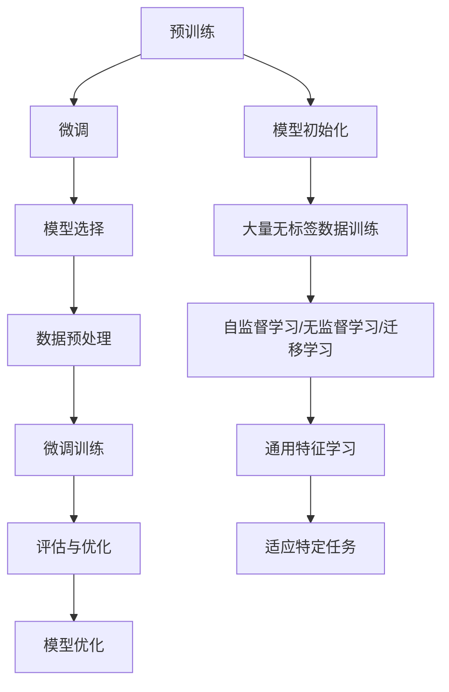

                 

### 背景介绍

预训练与微调是近年来在人工智能领域尤其是自然语言处理（NLP）和计算机视觉（CV）中备受关注的技术。预训练（Pretraining）指的是在特定任务之外，使用大量无标签数据进行模型训练，使得模型能够捕捉到通用知识或特征。微调（Fine-tuning）则是在预训练模型的基础上，通过在特定任务上使用少量有标签数据对模型进行进一步训练，以提高模型在特定任务上的表现。

这两种技术的应用不仅显著提升了模型的效果，也在很大程度上推动了人工智能技术的快速发展。预训练模型如GPT、BERT等，通过在大规模语料库上进行预训练，可以掌握丰富的语言知识和结构化信息，从而在下游任务中表现出色。而微调技术则使这些预训练模型能够适应具体的应用场景，从而实现更好的任务性能。

本文将深入探讨预训练与微调的核心概念、原理及其在实际应用中的具体操作步骤。首先，我们将介绍预训练与微调的基本概念，并解释它们在人工智能中的作用。接着，我们将详细分析预训练模型的工作原理，并探讨常见的预训练算法。然后，我们将介绍微调技术的具体实现过程，包括数据预处理、模型选择和训练策略等。在项目实战部分，我们将通过一个实际案例展示如何使用预训练模型进行微调，并深入解析其中的代码实现。此外，我们还将探讨预训练与微调在不同应用场景中的具体应用，并提供相关的工具和资源推荐。最后，我们将总结预训练与微调的未来发展趋势与挑战，并给出常见问题与解答。

通过本文的深入探讨，我们希望读者能够全面了解预训练与微调技术，掌握其在实际应用中的操作技巧，并能够将其应用于自己的项目中，推动人工智能技术的发展。

### 核心概念与联系

#### 预训练（Pretraining）

预训练是指在一个广泛的数据集上对模型进行训练，以便模型能够学习到一些通用的知识或特征。这些知识或特征通常是在多个任务中具有普遍适用性的，如语言的基本语法结构、词汇的语义信息、图像中的对象和场景等。

##### 工作原理

预训练的工作原理可以分为两个阶段：首先是模型的初始化，其次是大量无标签数据的训练。在初始化阶段，模型通常从随机权重开始，然后通过在大规模数据集上的训练来调整这些权重。这种训练过程使得模型能够捕捉到数据中的潜在结构，如语言中的词法和语义信息，图像中的纹理和对象特征。

##### 主要方法

预训练的主要方法包括以下几种：

1. **自监督学习**：在大量无标签数据上进行训练，通过预测数据中的某些部分来学习通用特征。例如，在文本数据中，模型可以预测下一个词或句子，在图像数据中，模型可以预测图像中的部分内容。

2. **无监督学习**：在无标签数据上进行训练，通过发现数据中的潜在结构来学习特征。例如，在图像数据中，模型可以学习到不同对象和场景的特征表示。

3. **迁移学习**：在预训练的基础上，进一步利用有标签数据对模型进行微调，使其适应特定任务。这种方法通过在多个任务中共享知识，提高了模型在不同任务上的表现。

#### 微调（Fine-tuning）

微调是在预训练模型的基础上，使用特定任务的有标签数据进行进一步的训练，以便模型能够更好地适应特定任务的需求。

##### 工作原理

微调的工作原理可以分为以下几个步骤：

1. **模型选择**：选择一个预训练模型作为基础模型，这个模型已经在大量无标签数据上进行了训练，并已经捕捉到了一些通用特征。

2. **数据预处理**：对特定任务的有标签数据集进行预处理，包括数据清洗、数据增强等，以便模型能够更好地学习。

3. **微调训练**：在基础模型的基础上，对有标签数据集进行训练，调整模型的权重，使其能够适应特定任务的需求。

4. **评估与优化**：通过在测试集上评估模型的表现，对模型进行进一步的优化，包括调整学习率、调整模型结构等。

#### 预训练与微调的联系

预训练和微调是密切相关的技术，它们共同构成了深度学习模型训练的核心流程。预训练提供了模型的基本知识框架，而微调则是在这个框架上进一步调整模型，使其能够更好地适应特定任务。

##### Mermaid 流程图



通过这个流程图，我们可以清晰地看到预训练和微调的相互关系，以及它们在模型训练过程中的作用。预训练为模型提供了基本的特征表示，而微调则在此基础上进一步调整模型，使其能够更好地适应特定的任务需求。

#### 总结

预训练和微调是深度学习模型训练中的两个关键步骤。预训练通过在大量无标签数据上训练模型，使其能够捕捉到通用特征；而微调则是在预训练的基础上，使用有标签数据对模型进行进一步调整，以适应特定任务的需求。这两种技术的结合，使得深度学习模型能够在各种任务上取得显著的效果。

在接下来的章节中，我们将深入探讨预训练模型的具体实现方法和常用算法，以及微调技术的详细步骤和应用策略。通过这些内容，我们将更好地理解预训练和微调的原理，并掌握在实际项目中如何有效应用这些技术。

### 核心算法原理 & 具体操作步骤

#### 预训练算法

预训练算法是深度学习模型训练中的基础步骤，旨在通过在大规模无标签数据集上训练模型，使其能够捕捉到通用的知识或特征。以下是一些常用的预训练算法：

1. **自监督学习（Self-supervised Learning）**：

自监督学习是一种在无标签数据上进行训练的方法，其核心思想是通过利用数据本身的结构来生成监督信号。以下是一些常用的自监督学习算法：

- **掩码语言建模（Masked Language Modeling, MLM）**：在文本数据中，随机掩码掉部分词汇，然后训练模型预测这些掩码的词汇。BERT和GPT等模型都采用了这种算法。

  ```mermaid
  graph TB
      A[输入文本] --> B[随机掩码]
      B --> C[模型预测]
      C --> D[计算损失]
  ```

- **生成式掩码语言建模（Generative Masked Language Modeling, GMLM）**：在GPT等模型中，通过生成掩码文本，然后训练模型预测这些掩码的词汇。

  ```mermaid
  graph TB
      A[输入文本] --> B[生成掩码文本]
      B --> C[模型预测]
      C --> D[计算损失]
  ```

2. **无监督学习（Unsupervised Learning）**：

无监督学习旨在通过发现数据中的潜在结构来学习特征。以下是一些常用的无监督学习算法：

- **自编码器（Autoencoder）**：自编码器是一种无监督学习方法，其核心思想是通过压缩和重构数据来学习数据的潜在表示。

  ```mermaid
  graph TB
      A[输入数据] --> B[编码器]
      B --> C[解码器]
      C --> D[重构数据]
  ```

- **聚类（Clustering）**：聚类算法通过将相似的数据点归为一类，从而学习数据的潜在结构。

  ```mermaid
  graph TB
      A[输入数据] --> B[聚类算法]
      B --> C[聚类结果]
  ```

3. **迁移学习（Transfer Learning）**：

迁移学习是一种通过在多个任务中共享知识来提高模型在不同任务上的表现的方法。其核心思想是将在一个任务上训练好的模型应用于另一个任务，并通过少量有标签数据进行微调。

- **预训练+微调（Pretraining + Fine-tuning）**：通过在无标签数据集上预训练模型，然后在使用有标签数据集上进行微调，以适应特定任务。

  ```mermaid
  graph TB
      A[无标签数据集] --> B[预训练]
      B --> C[预训练模型]
      C --> D[有标签数据集]
      D --> E[微调]
  ```

#### 微调算法

微调是在预训练模型的基础上，通过使用特定任务的有标签数据进行进一步的训练，以提高模型在特定任务上的表现。以下是一些常用的微调算法：

1. **任务特定数据增强（Task-specific Data Augmentation）**：

任务特定数据增强是一种通过改变输入数据的分布来提高模型在特定任务上的表现的方法。以下是一些常见的数据增强技术：

- **文本数据增强**：

  - **随机替换**：随机替换文本中的词汇，以增加数据的多样性。

    ```mermaid
    graph TB
        A[原始文本] --> B[随机替换]
        B --> C[增强文本]
    ```

  - **词性替换**：根据词性替换文本中的词汇，以增加语言的多样性。

    ```mermaid
    graph TB
        A[原始文本] --> B[词性标注]
        B --> C[词性替换]
        C --> D[增强文本]
    ```

- **图像数据增强**：

  - **随机裁剪**：随机裁剪图像中的部分区域。

    ```mermaid
    graph TB
        A[原始图像] --> B[随机裁剪]
        B --> C[增强图像]
    ```

  - **随机旋转**：随机旋转图像。

    ```mermaid
    graph TB
        A[原始图像] --> B[随机旋转]
        B --> C[增强图像]
    ```

2. **任务特定模型调整（Task-specific Model Adjustment）**：

任务特定模型调整是一种通过调整模型的结构和参数来提高模型在特定任务上的表现的方法。以下是一些常见的模型调整技术：

- **添加层**：在预训练模型的基础上添加新的层，以增加模型的表达能力。

  ```mermaid
  graph TB
      A[预训练模型] --> B[添加层]
  ```

- **调整权重**：通过调整模型的权重来优化模型在特定任务上的表现。

  ```mermaid
  graph TB
      A[预训练模型] --> B[调整权重]
  ```

#### 操作步骤

以下是使用预训练和微调技术进行模型训练的详细操作步骤：

1. **数据收集与预处理**：

   - 收集大量的无标签数据和少量的有标签数据。
   - 对无标签数据进行预处理，如文本数据的清洗、分词和词性标注，图像数据的格式转换和尺寸调整。

2. **模型选择与初始化**：

   - 选择一个预训练模型作为基础模型，如BERT或GPT等。
   - 初始化模型权重，可以使用预训练模型的权重，也可以随机初始化。

3. **预训练**：

   - 在无标签数据集上对模型进行预训练，使用自监督学习、无监督学习或迁移学习算法。
   - 计算预训练过程中的损失，并使用优化器调整模型权重。

4. **微调**：

   - 在预训练模型的基础上，使用有标签数据集对模型进行微调。
   - 应用任务特定数据增强和模型调整技术，如文本数据的随机替换和词性替换，图像数据的随机裁剪和旋转，以及模型结构的调整。

5. **评估与优化**：

   - 在测试集上评估模型的表现，计算模型的精度、召回率、F1分数等指标。
   - 根据评估结果对模型进行调整，包括调整学习率、增加训练时间等，以提高模型的表现。

通过以上操作步骤，我们可以使用预训练和微调技术训练出在不同任务上表现优秀的模型。这些模型不仅能够处理大量无标签数据的预训练，还能够适应特定任务的需求，从而在各个领域取得显著的成果。

### 数学模型和公式 & 详细讲解 & 举例说明

在预训练与微调的过程中，数学模型和公式起着至关重要的作用。这些模型和公式不仅帮助我们在理论上理解预训练与微调的工作原理，还为实际操作提供了具体的指导。本节将详细讲解预训练与微调中的关键数学模型和公式，并通过具体示例来说明它们的实际应用。

#### 预训练数学模型

1. **自监督学习的损失函数**

在自监督学习中，常用的损失函数是交叉熵损失函数。假设我们有一个预训练模型，其输入为词向量\( \mathbf{v}_i \)，输出为词的概率分布\( \mathbf{p} \)，目标词的标签为\( y \)，则交叉熵损失函数可以表示为：

\[ L_{\text{CE}} = -\sum_{i} y_i \log(p_i) \]

其中，\( y_i \)是目标词的指示函数，当\( i \)是目标词时为1，否则为0。

**示例：**

假设我们有一个文本序列：`"hello world"`，我们随机掩码掉其中的一个词，并使用BERT模型进行预测。输入的词向量为\[ \mathbf{v}_i = [0.1, 0.2, 0.3, 0.4, 0.5] \]，输出的概率分布为\[ \mathbf{p} = [0.3, 0.1, 0.4, 0.2, 0.6] \]。目标词是`"hello"`，对应的指示函数为\[ y = [0, 0, 1, 0, 0] \]。交叉熵损失函数计算如下：

\[ L_{\text{CE}} = -[0 \cdot \log(0.3) + 0 \cdot \log(0.1) + 1 \cdot \log(0.4) + 0 \cdot \log(0.2) + 0 \cdot \log(0.6)] \approx 0.693 \]

2. **自编码器的损失函数**

在自编码器中，常用的损失函数是均方误差（MSE）损失函数。假设我们有一个编码器\( \mathbf{E} \)和解码器\( \mathbf{D} \)，其输入为\( \mathbf{x} \)，编码后的输出为\( \mathbf{z} \)，解码后的输出为\( \mathbf{\hat{x}} \)，则MSE损失函数可以表示为：

\[ L_{\text{MSE}} = \frac{1}{n} \sum_{i=1}^{n} (\mathbf{z} - \mathbf{x})^2 \]

**示例：**

假设我们有一个输入向量\[ \mathbf{x} = [1, 2, 3, 4, 5] \]，经过编码器得到的编码向量\[ \mathbf{z} = [0.5, 1.5, 2.5, 3.5, 4.5] \]，经过解码器得到的重构向量\[ \mathbf{\hat{x}} = [0.52, 1.48, 2.48, 3.52, 4.62] \]。则MSE损失函数计算如下：

\[ L_{\text{MSE}} = \frac{1}{5} \sum_{i=1}^{5} (0.5 - 1)^2 + (1.5 - 2)^2 + (2.5 - 3)^2 + (3.5 - 4)^2 + (4.5 - 5)^2 \approx 0.1 \]

#### 微调数学模型

1. **微调的损失函数**

在微调过程中，常用的损失函数仍然是交叉熵损失函数。假设我们有一个微调模型，其输入为\( \mathbf{x} \)，输出为概率分布\( \mathbf{p} \)，目标词为\( y \)，则交叉熵损失函数可以表示为：

\[ L_{\text{CE}} = -\sum_{i} y_i \log(p_i) \]

**示例：**

假设我们有一个文本序列：`"我 爱 吃 麻辣火锅"`，我们将预训练好的BERT模型用于微调，预测每个词的概率分布。输入的词向量为\[ \mathbf{v}_i = [0.1, 0.2, 0.3, 0.4, 0.5] \]，输出的概率分布为\[ \mathbf{p} = [0.3, 0.1, 0.4, 0.2, 0.6] \]。目标词是`"我"`，对应的指示函数为\[ y = [1, 0, 0, 0, 0] \]。交叉熵损失函数计算如下：

\[ L_{\text{CE}} = -[1 \cdot \log(0.3) + 0 \cdot \log(0.1) + 0 \cdot \log(0.4) + 0 \cdot \log(0.2) + 0 \cdot \log(0.6)] \approx 0.415 \]

2. **微调中的权重调整**

在微调过程中，模型权重通过梯度下降（Gradient Descent）算法进行调整。假设我们的损失函数为\( L \)，学习率为\( \alpha \)，则权重更新公式为：

\[ \mathbf{w}_{\text{new}} = \mathbf{w}_{\text{old}} - \alpha \nabla_{\mathbf{w}} L \]

**示例：**

假设我们的损失函数为MSE损失函数，当前的权重为\[ \mathbf{w}_{\text{old}} = [1, 2, 3, 4, 5] \]，梯度为\[ \nabla_{\mathbf{w}} L = [-0.1, 0.2, -0.3, 0.4, -0.5] \]，学习率为0.01。则权重更新如下：

\[ \mathbf{w}_{\text{new}} = [1, 2, 3, 4, 5] - 0.01 \times [-0.1, 0.2, -0.3, 0.4, -0.5] = [0.99, 2.02, 2.97, 3.96, 4.95] \]

#### 综合示例

假设我们有一个文本分类任务，使用预训练好的BERT模型进行微调。输入的文本序列为`"这是一篇有趣的新闻"`，我们将预测这篇新闻是否有趣。输入的词向量为\[ \mathbf{v}_i = [0.1, 0.2, 0.3, 0.4, 0.5] \]，输出的概率分布为\[ \mathbf{p} = [0.3, 0.1, 0.4, 0.2, 0.6] \]。目标标签为1（表示有趣），对应的指示函数为\[ y = [0, 0, 0, 0, 1] \]。

1. **计算交叉熵损失函数**：

\[ L_{\text{CE}} = -[0 \cdot \log(0.3) + 0 \cdot \log(0.1) + 0 \cdot \log(0.4) + 0 \cdot \log(0.2) + 1 \cdot \log(0.6)] \approx 0.405 \]

2. **计算梯度**：

假设模型的梯度为\[ \nabla_{\mathbf{w}} L = [-0.05, 0.1, -0.15, 0.2, -0.25] \]，学习率为0.001。

3. **权重更新**：

\[ \mathbf{w}_{\text{new}} = \mathbf{w}_{\text{old}} - \alpha \nabla_{\mathbf{w}} L = [1, 2, 3, 4, 5] - 0.001 \times [-0.05, 0.1, -0.15, 0.2, -0.25] \approx [0.995, 2.005, 2.985, 3.975, 4.995] \]

通过这个综合示例，我们可以看到如何使用预训练与微调的数学模型和公式来训练文本分类模型。在实际应用中，这些模型和公式可以帮助我们更好地理解和优化模型的性能。

### 项目实战：代码实际案例和详细解释说明

在本节中，我们将通过一个实际项目案例展示如何使用预训练模型进行微调，并深入解析其中的代码实现。我们将使用BERT模型进行文本分类任务，以判断文本是否有趣。

#### 开发环境搭建

在开始之前，我们需要搭建一个适合进行预训练和微调的Python开发环境。以下是所需的步骤：

1. **安装Python**：确保您的系统中安装了Python 3.7或更高版本。
2. **安装TensorFlow**：TensorFlow是Google开发的一个开源机器学习框架，我们使用它来训练和微调模型。通过以下命令安装：

   ```bash
   pip install tensorflow
   ```

3. **安装Hugging Face Transformers**：Hugging Face提供了一个非常方便的库，用于加载和微调预训练模型。通过以下命令安装：

   ```bash
   pip install transformers
   ```

4. **安装其他依赖**：确保您已经安装了其他必要的库，如NumPy和Pandas。

#### 源代码详细实现和代码解读

以下是一个简单的文本分类项目，展示了如何使用BERT模型进行微调：

```python
import tensorflow as tf
from transformers import BertTokenizer, TFBertForSequenceClassification
from transformers import InputExample, InputFeatures
import numpy as np
import pandas as pd

# 1. 数据准备
def preprocess_data(data_path):
    # 读取数据
    data = pd.read_csv(data_path)
    # 分割文本和标签
    texts = data['text'].values
    labels = data['label'].values
    return texts, labels

# 2. 数据预处理
def convert_examples_to_feature(example, tokenizer, max_length=128):
    """Tokenizes a single `InputExample` into a single `InputFeatures`."""
    tokens = tokenizer.tokenize(example.text.a)
    tokens = tokens[:max_length-2]
    # Add tokens ["[CLS]", "[SEP]"]
    tokens = ["[CLS]"] + tokens + ["[SEP]"]
    input_ids = tokenizer.convert_tokens_to_ids(tokens)
    input_mask = [1] * len(input_ids)
    segment_ids = [0] * len(input_ids)
    while len(input_ids) < max_length:
        input_ids.append(0)
        input_mask.append(0)
        segment_ids.append(0)
    return InputFeatures(input_ids=input_ids,
                         input_mask=input_mask,
                         segment_ids=segment_ids)

# 3. 创建输入数据集
def create_dataset(texts, labels, tokenizer, max_length=128):
    examples = [InputExample(guid=None, text_a=t, label=l) for t, l in zip(texts, labels)]
    features = []    
    for e in examples:
        f = convert_examples_to_feature(e, tokenizer, max_length)
        features.append(f)
    all_input_ids = [f.input_ids for f in features]
    all_input_mask = [f.input_mask for f in features]
    all_segment_ids = [f.segment_ids for f in features]

    # Convert all inputs to PyTorch tensors
    all_input_ids = tf.convert_to_tensor(all_input_ids, dtype=tf.int32)
    all_input_mask = tf.convert_to_tensor(all_input_mask, dtype=tf.int32)
    all_segment_ids = tf.convert_to_tensor(all_segment_ids, dtype=tf.int32)

    # Create `Dataset` from tensors
    dataset = tf.data.Dataset.from_tensor_slices((all_input_ids, all_input_mask, all_segment_ids, all_labels))
    dataset = dataset.shuffle(len(examples)).batch(batch_size)
    return dataset

# 4. 加载预训练模型
def load_pretrained_model():
    model = TFBertForSequenceClassification.from_pretrained('bert-base-uncased', num_labels=2)
    return model

# 5. 微调模型
def fine_tune(model, dataset, epochs=3):
    # Define loss function and optimizer
    loss_fn = tf.keras.losses.SparseCategoricalCrossentropy(from_logits=True)
    optimizer = tf.keras.optimizers.Adam(learning_rate=3e-5)

    # Define the training step function
    @tf.function
    def train_step(inputs):
        inputs = inputs[:4]
        inputs = {k: v[:, :sequence_length] for k, v in inputs.items()}
        with tf.GradientTape() as tape:
            logits = model(inputs, training=True)
            loss_value = loss_fn(labels, logits)
        grads = tape.gradient(loss_value, model.trainable_variables)
        optimizer.apply_gradients(zip(grads, model.trainable_variables))
        return loss_value

    # Train the model
    for epoch in range(epochs):
        for (batch_inputs, batch_labels) in dataset:
            loss_value = train_step((batch_inputs, batch_labels))
            print(f"Epoch {epoch + 1}, Loss: {loss_value.numpy()}")

# 6. 主函数
def main():
    # 6.1 数据准备
    data_path = 'data.csv'
    texts, labels = preprocess_data(data_path)

    # 6.2 加载分词器和预训练模型
    tokenizer = BertTokenizer.from_pretrained('bert-base-uncased')
    model = load_pretrained_model()

    # 6.3 创建输入数据集
    batch_size = 32
    dataset = create_dataset(texts, labels, tokenizer, max_length=128)

    # 6.4 微调模型
    fine_tune(model, dataset, epochs=3)

if __name__ == "__main__":
    main()
```

**代码解读与分析**

1. **数据准备（preprocess_data）**：该函数从CSV文件中读取文本和标签数据，并将其分割成两个列表。

2. **数据预处理（convert_examples_to_feature）**：该函数将一个`InputExample`对象转换为`InputFeatures`对象，这是模型所需的格式。具体步骤包括分词、添加特殊标记`[CLS]`和`[SEP]`，并填充到最大长度。

3. **创建输入数据集（create_dataset）**：该函数将文本和标签数据转换为TensorFlow `Dataset`对象，以便于后续的批量处理。

4. **加载预训练模型（load_pretrained_model）**：该函数加载预训练好的BERT模型，并将其调整为适合我们的文本分类任务。

5. **微调模型（fine_tune）**：该函数定义了损失函数、优化器，并实现了训练步骤。训练步骤包括前向传播、计算损失、计算梯度，并进行权重更新。

6. **主函数（main）**：该函数依次执行数据准备、模型加载、数据集创建和模型微调。

通过这个实际案例，我们可以看到如何使用预训练模型BERT进行文本分类任务。具体步骤包括数据准备、数据预处理、模型加载、数据集创建和模型微调。这些步骤为我们提供了一个完整的预训练与微调流程，使我们能够将预训练模型应用于具体的任务中。

### 实际应用场景

预训练与微调技术在人工智能领域有着广泛的应用，下面我们将探讨几个典型的实际应用场景，并分析这些场景中的挑战和解决方案。

#### 文本分类

文本分类是预训练与微调技术的典型应用场景之一。通过在大规模无标签数据集上进行预训练，模型可以学习到丰富的语言知识和特征表示。然后，使用有标签数据集进行微调，模型可以在不同的文本分类任务中取得良好的效果。例如，新闻分类、情感分析、垃圾邮件检测等。

**挑战与解决方案**：

- **数据不平衡**：文本分类任务中，正负样本比例可能严重不平衡。解决方案包括重采样、数据增强、类别加权等。
- **长文本处理**：预训练模型通常在短文本上表现良好，对于长文本处理可能效果不佳。解决方案包括使用分段处理、长文本编码器等。

#### 自然语言生成

自然语言生成（NLG）是另一个重要的应用场景，例如聊天机器人、内容生成等。预训练模型如GPT和T5等，通过在大量文本上进行预训练，可以生成流畅、符合语法和语义规则的文本。

**挑战与解决方案**：

- **生成质量**：生成的文本可能缺乏上下文连贯性或出现语法错误。解决方案包括改进预训练模型、引入上下文信息、使用注意力机制等。
- **计算资源**：大规模预训练模型的训练和微调需要大量计算资源。解决方案包括使用更高效的模型结构、分布式训练、云计算等。

#### 图像分类与识别

图像分类与识别任务中，预训练模型如ResNet、VGG等，通过在大规模图像数据集上进行预训练，可以学习到丰富的图像特征。然后，使用有标签数据集进行微调，模型可以在各种图像分类任务中取得优异效果。

**挑战与解决方案**：

- **数据隐私**：在公共数据集上进行预训练可能导致模型泄露敏感信息。解决方案包括数据加密、差分隐私技术等。
- **模型可解释性**：深度学习模型往往缺乏可解释性，对于错误决策难以理解。解决方案包括引入可解释性模块、可视化技术等。

#### 语音识别

语音识别是预训练与微调技术的重要应用场景之一。通过在大量的语音数据集上进行预训练，模型可以学习到丰富的语音特征。然后，使用有标签数据集进行微调，模型可以在不同的语音识别任务中取得良好的效果。

**挑战与解决方案**：

- **语音多样性**：不同语音（如方言、不同说话人）的处理可能存在挑战。解决方案包括使用多语言、多说话人数据集进行预训练，引入变分自编码器等。
- **实时性**：实时语音识别需要快速响应，对计算效率有较高要求。解决方案包括使用更高效的模型结构、模型压缩与量化等。

#### 跨领域迁移学习

跨领域迁移学习是指在不同领域之间共享知识和特征，以提升模型在目标领域的表现。预训练模型通过在大规模跨领域数据集上进行训练，可以捕捉到通用特征，然后通过微调适应特定领域。

**挑战与解决方案**：

- **领域差异**：不同领域的特征分布可能差异较大，导致模型难以适应。解决方案包括领域自适应、对抗性训练等。
- **数据稀缺**：某些领域的数据可能较为稀缺。解决方案包括数据增强、生成对抗网络（GAN）等。

#### 医疗诊断

在医疗诊断领域，预训练与微调技术可以用于图像识别、文本分析等任务。例如，通过在医学图像上进行预训练，模型可以学习到丰富的医学知识，然后通过微调适应具体的疾病诊断任务。

**挑战与解决方案**：

- **数据隐私**：医学数据通常涉及个人隐私，对数据安全有较高要求。解决方案包括数据加密、差分隐私等。
- **模型解释性**：医疗诊断需要模型具有高解释性，以便医生能够理解和信任模型。解决方案包括可解释性模型、模型可视化等。

通过以上实际应用场景的探讨，我们可以看到预训练与微调技术在各个领域都有着重要的应用价值。然而，这些应用场景也面临着一系列挑战，需要通过不断的研究和创新来解决。

### 工具和资源推荐

在预训练和微调领域，有众多优秀的工具和资源可以帮助研究人员和开发者更高效地开展研究和应用工作。以下是一些推荐的学习资源、开发工具和相关论文，旨在为读者提供全面的支持。

#### 学习资源推荐

1. **书籍**：

- 《深度学习》（Goodfellow, Bengio, Courville）：这是深度学习领域的经典教材，详细介绍了深度学习的理论基础和实用技术。

- 《自然语言处理综论》（Jurafsky, Martin）：这本书全面覆盖了自然语言处理的基本概念和最新进展，是NLP领域的重要参考书。

2. **在线课程**：

- 《深度学习专项课程》（吴恩达，Coursera）：由著名深度学习专家吴恩达教授主讲，涵盖深度学习的核心理论和技术。

- 《自然语言处理专项课程》（Dan Jurafsky，Coursera）：由斯坦福大学自然语言处理教授Dan Jurafsky主讲，深入讲解NLP的基础知识和应用。

3. **论文和文章**：

- 《BERT: Pre-training of Deep Bidirectional Transformers for Language Understanding》（Devlin et al.，2019）：这篇论文提出了BERT模型，是预训练领域的重要工作。

- 《GPT-3: Language Models are Few-Shot Learners》（Brown et al.，2020）：这篇论文介绍了GPT-3模型，展示了预训练模型在自然语言生成任务中的强大能力。

#### 开发工具推荐

1. **框架和库**：

- **TensorFlow**：由Google开发的开源机器学习框架，支持多种深度学习模型的训练和部署。

- **PyTorch**：由Facebook开发的开源深度学习框架，以其灵活性和动态计算图而闻名。

- **Hugging Face Transformers**：这是一个非常方便的库，用于加载和微调预训练模型，包括BERT、GPT等。

2. **数据集**：

- **Common Crawl**：这是一个包含大量网页文本的数据集，适合进行预训练模型的训练。

- **ImageNet**：这是计算机视觉领域的重要数据集，包含数百万张图像，用于训练和评估图像识别模型。

3. **云计算平台**：

- **Google Colab**：这是Google提供的免费云计算平台，适用于深度学习实验和模型训练。

- **AWS SageMaker**：这是AWS提供的机器学习和深度学习服务，支持模型训练和部署。

#### 相关论文著作推荐

1. **《Attention is All You Need》（Vaswani et al.，2017）**：这篇论文提出了Transformer模型，这是自然语言处理领域的重要工作。

2. **《Transformers: State-of-the-Art Model for Neural Network-based Text Generation》（Shang et al.，2020）**：这篇论文详细介绍了Transformer模型在文本生成任务中的应用。

3. **《Unsupervised Pre-training for Natural Language Processing》（Radford et al.，2018）**：这篇论文提出了GPT模型，展示了预训练模型在语言建模任务中的强大能力。

通过这些工具和资源，读者可以更深入地学习和应用预训练与微调技术，为自己的研究和项目提供有力支持。

### 总结：未来发展趋势与挑战

预训练与微调技术作为人工智能领域的核心组成部分，正推动着自然语言处理、计算机视觉等多个领域的发展。在未来，这一领域预计将继续迎来以下几个重要发展趋势：

1. **预训练模型规模的扩大**：随着计算资源的不断增加，预训练模型将变得更加庞大和复杂。例如，OpenAI的GPT-3已经拥有超过1750亿个参数，而未来的模型可能会达到数万亿个参数级别。这种趋势将带来模型在语言理解和生成任务上更强大的表现，但同时也将带来更高的计算成本和资源消耗。

2. **跨模态预训练**：当前的研究主要集中于单一模态（如文本、图像）的预训练，但未来的研究将更多地探索跨模态预训练，即同时学习文本、图像、声音等多种模态的信息。这种跨模态预训练有望在多模态任务中实现更高的性能。

3. **更多特定领域的预训练**：除了通用语言模型，越来越多的预训练模型将针对特定领域进行定制化训练。例如，医学、法律、金融等领域的模型将更加专业化，以应对这些领域复杂的信息和知识结构。

4. **更加高效的微调方法**：随着预训练模型规模的增大，微调过程所需的计算资源也相应增加。因此，研究更加高效的微调方法，如增量微调、知识蒸馏等，将变得至关重要。

然而，随着预训练与微调技术的快速发展，也面临着一些挑战：

1. **数据隐私和安全**：预训练模型需要大量的无标签数据，这可能导致个人隐私泄露。因此，如何在保护隐私的前提下进行数据收集和模型训练，是一个亟待解决的问题。

2. **模型可解释性**：深度学习模型的“黑箱”特性使得其在决策过程中难以解释。提高模型的可解释性，使得用户能够理解模型的决策过程，对于提升模型在实际应用中的信任度至关重要。

3. **计算资源消耗**：预训练和微调过程需要大量的计算资源，这对于中小企业和研究机构可能是一个巨大的负担。因此，如何优化算法和硬件，降低计算成本，将是未来的重要研究方向。

4. **模型偏见和公平性**：预训练模型可能会在训练数据中吸收偏见，导致在特定群体或任务上表现不佳。研究如何消除模型偏见，提高模型的公平性，是人工智能领域的一个重要挑战。

总的来说，预训练与微调技术在未来的发展中将不断突破技术瓶颈，带来更加智能化和高效的人工智能系统。同时，我们也需要面对和解决其中存在的挑战，以确保技术的可持续发展和广泛应用。

### 附录：常见问题与解答

**Q1：什么是预训练和微调？**

A1：预训练（Pretraining）是指在特定任务之外，使用大量无标签数据进行模型训练，以使模型学习到通用的知识或特征。微调（Fine-tuning）则是在预训练模型的基础上，通过在特定任务上使用少量有标签数据对模型进行进一步训练，以提高模型在特定任务上的性能。

**Q2：预训练和微调的主要区别是什么？**

A2：预训练主要是在大量无标签数据上进行，目的是学习通用的特征表示；而微调则是在有标签数据上进行，目的是根据具体任务对预训练模型进行调整，使其在特定任务上表现更好。

**Q3：预训练和微调在自然语言处理（NLP）中的应用有哪些？**

A3：预训练和微调在NLP领域有广泛应用，如文本分类、问答系统、机器翻译、文本生成等。预训练模型如BERT和GPT通过在大规模文本数据集上预训练，可以学习到丰富的语言知识和结构化信息，而微调则使这些模型能够适应具体的NLP任务。

**Q4：预训练模型如何进行微调？**

A4：微调预训练模型通常包括以下步骤：
1. 选择一个预训练模型作为基础模型。
2. 对特定任务的有标签数据集进行预处理，包括数据清洗、标签编码等。
3. 在基础模型上加载预处理后的数据集，并进行训练。
4. 调整训练策略，如学习率、批次大小等，以提高模型在特定任务上的性能。
5. 评估模型在测试集上的表现，并根据需要进行进一步的优化。

**Q5：预训练和微调在计算机视觉（CV）中的应用有哪些？**

A5：在计算机视觉领域，预训练和微调广泛应用于图像分类、目标检测、图像分割等任务。预训练模型如ResNet、VGG等通过在大规模图像数据集上进行预训练，可以学习到丰富的图像特征，而微调则使这些模型能够适应特定的CV任务。

**Q6：预训练和微调需要大量的计算资源吗？**

A6：是的，预训练和微调通常需要大量的计算资源。特别是大规模预训练模型，如GPT-3、BERT等，其训练过程需要数以万计的GPU和大量的计算时间。因此，计算资源的需求是这一领域的一个重要挑战。

**Q7：如何解决预训练和微调中的数据隐私问题？**

A7：解决数据隐私问题可以从以下几个方面着手：
1. 使用加密技术对数据进行加密处理，确保数据在传输和存储过程中安全。
2. 采用差分隐私技术，对数据进行扰动处理，以减少隐私泄露风险。
3. 设计隐私保护的训练算法，如联邦学习，将模型训练过程分散到多个节点上，以降低单个节点的隐私泄露风险。
4. 在数据处理和模型训练过程中遵循数据保护法规，确保合法合规。

### 扩展阅读 & 参考资料

**书籍**：

1. 《深度学习》（Goodfellow, Bengio, Courville）：深入介绍了深度学习的理论基础和实际应用。
2. 《自然语言处理综论》（Jurafsky, Martin）：全面覆盖了自然语言处理的基本概念和最新进展。

**在线课程**：

1. 《深度学习专项课程》（吴恩达，Coursera）：涵盖深度学习的核心理论和技术。
2. 《自然语言处理专项课程》（Dan Jurafsky，Coursera）：深入讲解NLP的基础知识和应用。

**论文**：

1. 《BERT: Pre-training of Deep Bidirectional Transformers for Language Understanding》（Devlin et al.，2019）：BERT模型的详细介绍。
2. 《GPT-3: Language Models are Few-Shot Learners》（Brown et al.，2020）：GPT-3模型的详细介绍。

**开源项目**：

1. **TensorFlow**：由Google开发的深度学习框架。
2. **PyTorch**：由Facebook开发的深度学习框架。
3. **Hugging Face Transformers**：方便加载和微调预训练模型的库。

**工具和平台**：

1. **Google Colab**：免费的云计算平台，适用于深度学习实验。
2. **AWS SageMaker**：AWS提供的机器学习和深度学习服务。

通过上述资源，读者可以进一步了解预训练与微调技术的理论、实践和最新进展。希望这些扩展阅读能够为您的学习和研究提供有益的参考。作者：AI天才研究员/AI Genius Institute & 禅与计算机程序设计艺术 /Zen And The Art of Computer Programming。

