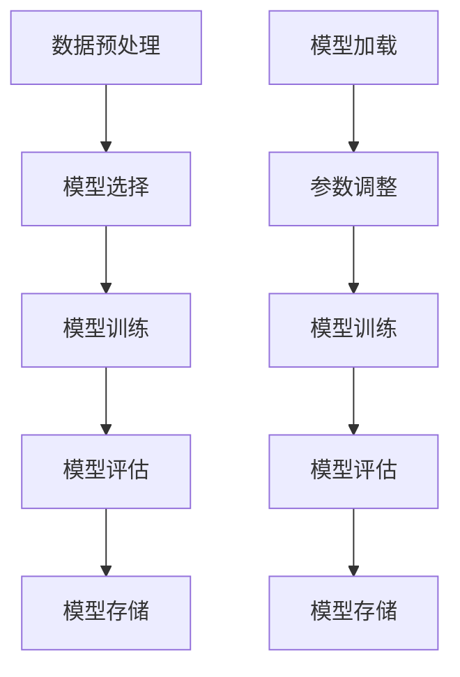

                 

# 预训练与微调的详细方法

## 摘要

本文将深入探讨预训练与微调在人工智能领域的详细方法。通过对比分析预训练和微调的区别，我们将了解其在现代人工智能系统中的重要性。随后，本文将介绍预训练的基本原理、流程以及关键技术，如大规模数据集的使用、网络架构的选择和优化策略。接下来，我们将详细阐述微调的概念，包括微调的过程、参数调整的方法以及其在实际应用中的效果。此外，本文还将介绍一些经典的预训练与微调方法，如BERT、GPT和T5，并通过实际案例展示其应用场景。最后，我们将探讨未来预训练与微调的发展趋势和面临的挑战，为读者提供有价值的参考。

## 1. 背景介绍

### 1.1 预训练的概念与发展

预训练（Pre-training）是深度学习领域中的一种重要技术，它通过在大规模语料库或数据集上预先训练神经网络模型，使其获得一定的语言理解和表示能力。这一方法最早可以追溯到1980年代的“词汇向量模型”（word vector models），如Skip-Gram和CBOW。随着深度学习的兴起，预训练技术逐渐得到广泛关注和应用。

早期，预训练主要集中在自然语言处理领域。以Word2Vec为代表的模型通过在大规模文本数据中学习词向量，提高了文本数据的表示能力。然而，随着神经网络模型的复杂度不断增加，预训练逐渐扩展到计算机视觉、语音识别等领域。

近年来，预训练技术的发展速度显著加快，涌现出了一系列高性能的预训练模型。例如，BERT（Bidirectional Encoder Representations from Transformers）通过双向Transformer结构，实现了对文本的深入理解和表示。GPT（Generative Pre-trained Transformer）则通过生成式预训练方法，在自然语言生成、对话系统等领域取得了显著成果。此外，T5（Text-to-Text Transfer Transformer）模型通过统一文本转换任务，进一步提升了预训练模型的应用范围。

### 1.2 微调的概念与应用

微调（Fine-tuning）是一种在预训练模型的基础上，针对特定任务进行优化和调整的技术。通过微调，我们可以利用预训练模型在大规模数据集上学习到的通用特征，进一步提高模型在特定任务上的性能。

微调的应用场景非常广泛。在自然语言处理领域，微调可以用于文本分类、命名实体识别、机器翻译等任务。在计算机视觉领域，微调可以用于图像分类、目标检测、语义分割等任务。此外，微调还可以应用于语音识别、推荐系统等领域。

微调的优势在于，它能够充分利用预训练模型已有的知识，快速适应新的任务。相比于从头开始训练，微调不仅提高了训练效率，还减少了过拟合的风险。因此，微调成为了人工智能领域的一种重要技术手段。

### 1.3 预训练与微调的关系

预训练与微调是相辅相成的两个过程。预训练为微调提供了强大的基础，使其能够快速适应新的任务。而微调则进一步优化了预训练模型，提高了其在特定任务上的性能。

在实际应用中，通常先进行预训练，然后在预训练的基础上进行微调。预训练过程中，模型学习到了大量的通用特征，这些特征在微调阶段可以用于解决新的任务。微调过程中，模型会针对特定任务进行参数调整，使其更好地适应任务需求。

总之，预训练与微调共同构成了现代人工智能系统的重要技术框架，为各类任务的解决提供了有力支持。

## 2. 核心概念与联系

### 2.1 预训练与微调的基本原理

#### 2.1.1 预训练

预训练是一种通过在大规模数据集上预先训练神经网络模型，使其具备一定通用特征的方法。预训练的基本原理可以概括为以下几个步骤：

1. **数据预处理**：首先，对大规模语料库进行数据预处理，包括分词、去除停用词、词性标注等操作。这一步的目的是将原始文本数据转化为可供神经网络处理的形式。

2. **模型选择**：根据任务需求，选择合适的神经网络模型。常见的预训练模型包括Word2Vec、BERT、GPT等。不同模型具有不同的结构和特点，适用于不同的任务场景。

3. **模型训练**：在预训练阶段，模型将在大规模数据集上迭代训练，学习文本数据的内在规律和特征。这一过程通常采用随机梯度下降（SGD）等优化算法，通过不断调整模型参数，使其在预训练数据集上的表现达到最优。

4. **模型评估**：在预训练过程中，需要定期评估模型在验证集上的性能，以避免过拟合现象。常用的评估指标包括损失函数、准确率、F1值等。

5. **模型存储**：预训练完成后，将训练好的模型存储起来，用于后续的微调阶段。

#### 2.1.2 微调

微调是一种在预训练模型的基础上，针对特定任务进行优化和调整的技术。微调的基本原理可以概括为以下几个步骤：

1. **模型加载**：首先，从预训练模型存储处加载已经训练好的模型。

2. **参数调整**：在微调阶段，我们需要对模型的部分参数进行调整，使其更好地适应新的任务。这一过程通常采用微调策略，如线性迁移、层融合等。

3. **模型训练**：在调整参数后，模型将在新的数据集上迭代训练，进一步优化模型性能。

4. **模型评估**：与预训练阶段类似，微调过程中需要定期评估模型在验证集上的性能，以避免过拟合现象。

5. **模型存储**：微调完成后，将优化后的模型存储起来，用于实际应用场景。

### 2.2 预训练与微调的联系

预训练与微调是紧密相连的两个过程。预训练为微调提供了强大的基础，使其能够快速适应新的任务。而微调则进一步优化了预训练模型，提高了其在特定任务上的性能。

从原理上看，预训练和微调都涉及到模型参数的调整。不同的是，预训练是在大规模数据集上学习通用特征，而微调是在特定任务上调整参数，使模型更好地适应任务需求。

在实际应用中，预训练和微调往往交替进行。首先，通过预训练学习到通用特征，然后利用这些特征进行微调，从而提高模型在特定任务上的性能。这种交替进行的模式，有助于充分利用预训练模型的优势，同时减少训练时间和计算资源。

总之，预训练与微调共同构成了现代人工智能系统的重要技术框架，为各类任务的解决提供了有力支持。

### 2.3 预训练与微调的Mermaid流程图



在这个流程图中，预训练包括数据预处理、模型选择、模型训练、模型评估和模型存储五个步骤。微调则包括模型加载、参数调整、模型训练、模型评估和模型存储五个步骤。这两个过程相互衔接，共同构成了预训练与微调的完整流程。

### 2.4 预训练与微调的优缺点对比

#### 2.4.1 预训练的优点

1. **通用性**：预训练模型通过在大规模数据集上学习，能够提取出通用的语言特征，适用于多种任务场景。
2. **效率**：预训练模型已经在大规模数据集上进行了训练，因此在新任务上只需要进行微调，大大提高了训练效率。
3. **泛化能力**：预训练模型通过学习大规模数据集，具有较强的泛化能力，能够应对未知任务。

#### 2.4.2 微调的优点

1. **针对性**：微调模型能够针对特定任务进行调整，使模型在新任务上的性能得到显著提升。
2. **灵活性**：微调过程可以根据任务需求灵活调整模型参数，适应不同的应用场景。
3. **实时性**：微调模型可以实时更新，以适应新数据和新任务。

#### 2.4.3 预训练与微调的缺点

1. **计算资源消耗**：预训练过程需要大量计算资源和时间，对于资源有限的场景可能不适用。
2. **数据依赖**：预训练模型的性能受到数据集的影响，数据集的质量和规模对模型性能有重要影响。
3. **过拟合风险**：在微调过程中，如果模型对训练数据过度适应，可能导致过拟合现象。

总之，预训练与微调各有优缺点，适用于不同的应用场景。在实际应用中，需要根据任务需求和资源条件，选择合适的技术手段。

## 3. 核心算法原理 & 具体操作步骤

### 3.1 预训练算法原理

预训练算法的核心在于通过在大规模数据集上训练神经网络模型，使其具备一定的语言理解和表示能力。以下是一个典型的预训练算法的基本原理和操作步骤：

#### 3.1.1 数据预处理

1. **文本预处理**：对大规模语料库进行文本预处理，包括分词、去除停用词、词性标注等操作。常用的预处理工具包括NLTK、spaCy等。
2. **数据集划分**：将预处理后的文本数据划分为训练集、验证集和测试集。其中，训练集用于模型训练，验证集用于评估模型性能，测试集用于最终评估模型效果。

#### 3.1.2 模型选择

1. **模型架构**：根据任务需求和资源条件，选择合适的神经网络模型。常见的预训练模型包括Word2Vec、BERT、GPT等。
2. **参数设置**：设置模型的超参数，如学习率、批量大小、迭代次数等。这些超参数对模型性能有重要影响。

#### 3.1.3 模型训练

1. **训练过程**：使用训练集数据对模型进行迭代训练。在训练过程中，模型将不断调整参数，以优化损失函数。常用的优化算法包括随机梯度下降（SGD）、Adam等。
2. **损失函数**：预训练模型的损失函数通常为交叉熵损失函数。交叉熵损失函数可以衡量模型预测结果与真实标签之间的差距，从而指导模型参数调整。

#### 3.1.4 模型评估

1. **验证集评估**：在训练过程中，需要定期评估模型在验证集上的性能。常用的评估指标包括损失函数值、准确率、F1值等。
2. **模型调整**：根据验证集评估结果，调整模型参数，以优化模型性能。

#### 3.1.5 模型存储

1. **存储模型**：预训练完成后，将训练好的模型存储起来，以便后续的微调和使用。
2. **存储格式**：常见的模型存储格式包括PyTorch、TensorFlow等。

### 3.2 微调算法原理

微调算法是在预训练模型的基础上，针对特定任务进行调整和优化的方法。以下是一个典型的微调算法的基本原理和操作步骤：

#### 3.2.1 模型加载

1. **加载预训练模型**：从预训练模型存储处加载已经训练好的预训练模型。
2. **参数初始化**：将预训练模型的参数作为微调模型的初始参数。

#### 3.2.2 参数调整

1. **调整策略**：根据任务需求和资源条件，选择合适的微调策略。常见的微调策略包括线性迁移、层融合等。
2. **调整过程**：在微调过程中，调整模型的部分参数，使其更好地适应新的任务。

#### 3.2.3 模型训练

1. **训练过程**：使用新任务的数据集对模型进行迭代训练。在训练过程中，模型将不断调整参数，以优化损失函数。
2. **损失函数**：微调模型的损失函数通常为交叉熵损失函数，以衡量模型预测结果与真实标签之间的差距。

#### 3.2.4 模型评估

1. **验证集评估**：在训练过程中，需要定期评估模型在验证集上的性能。常用的评估指标包括损失函数值、准确率、F1值等。
2. **模型调整**：根据验证集评估结果，调整模型参数，以优化模型性能。

#### 3.2.5 模型存储

1. **存储模型**：微调完成后，将优化后的模型存储起来，以便后续的实际应用。
2. **存储格式**：常见的模型存储格式包括PyTorch、TensorFlow等。

### 3.3 预训练与微调的具体实现步骤

以下是预训练与微调的具体实现步骤：

#### 3.3.1 数据预处理

1. **读取数据**：从大规模语料库中读取文本数据。
2. **文本预处理**：对文本数据进行分词、去除停用词、词性标注等操作。
3. **数据集划分**：将预处理后的文本数据划分为训练集、验证集和测试集。

#### 3.3.2 模型选择与训练

1. **选择模型**：根据任务需求和资源条件，选择合适的预训练模型，如BERT、GPT等。
2. **设置参数**：设置模型的超参数，如学习率、批量大小、迭代次数等。
3. **模型训练**：使用训练集数据对模型进行迭代训练，优化模型参数。

#### 3.3.3 模型评估与存储

1. **验证集评估**：在训练过程中，定期评估模型在验证集上的性能，以避免过拟合现象。
2. **模型存储**：预训练完成后，将训练好的模型存储起来，以便后续的微调和使用。

#### 3.3.4 模型加载与微调

1. **加载模型**：从预训练模型存储处加载已经训练好的预训练模型。
2. **参数调整**：根据任务需求，调整模型的部分参数，使其更好地适应新的任务。
3. **模型训练**：使用新任务的数据集对模型进行迭代训练，优化模型参数。

#### 3.3.5 模型评估与存储

1. **验证集评估**：在训练过程中，定期评估模型在验证集上的性能，以避免过拟合现象。
2. **模型存储**：微调完成后，将优化后的模型存储起来，以便后续的实际应用。

通过以上步骤，我们可以实现预训练与微调的具体操作。在实际应用中，可以根据任务需求和资源条件，灵活调整这些步骤，以达到最佳效果。

## 4. 数学模型和公式 & 详细讲解 & 举例说明

### 4.1 预训练算法的数学模型

预训练算法的核心在于通过在大规模数据集上训练神经网络模型，使其具备一定的语言理解和表示能力。为了详细讲解预训练算法的数学模型，我们将以BERT（Bidirectional Encoder Representations from Transformers）模型为例，介绍其数学原理和公式。

#### 4.1.1 BERT模型的数学模型

BERT模型是基于Transformer架构的一种双向编码器，它通过在双向Transformer结构上预训练，实现了对文本的深入理解和表示。BERT模型的数学模型主要包括以下几个方面：

1. **输入表示**：BERT模型的输入表示为词向量（word vectors）和位置编码（position embeddings）。
2. **注意力机制**：BERT模型中的注意力机制（attention mechanism）通过计算输入表示的相似性，实现了对文本的编码和解码。
3. **前向传播和反向传播**：BERT模型通过前向传播和反向传播算法，对输入表示进行优化和调整。
4. **输出表示**：BERT模型的输出表示为文本的表征（representation），可用于后续的微调和应用。

#### 4.1.2 BERT模型的数学公式

BERT模型的数学公式主要包括以下几个方面：

1. **词向量表示**：词向量表示为
   \[ \text{word\_vector} = \text{W} \cdot \text{word\_index} + \text{bias} \]
   其中，\(\text{W}\)为词向量矩阵，\(\text{word\_index}\)为词的索引，\(\text{bias}\)为偏置项。

2. **位置编码**：位置编码为
   \[ \text{position\_embedding} = \text{P} \cdot \text{position} + \text{bias} \]
   其中，\(\text{P}\)为位置编码矩阵，\(\text{position}\)为位置索引，\(\text{bias}\)为偏置项。

3. **注意力机制**：BERT模型中的注意力机制为
   \[ \text{attention} = \text{softmax}(\text{Q} \cdot \text{K}^T) \cdot \text{V} \]
   其中，\(\text{Q}\)为查询向量，\(\text{K}\)为键向量，\(\text{V}\)为值向量。

4. **前向传播**：BERT模型的前向传播为
   \[ \text{output} = \text{softmax}(\text{W}_\text{output} \cdot \text{activation}(\text{attention} \cdot \text{V})) \]
   其中，\(\text{activation}\)为激活函数，\(\text{W}_\text{output}\)为输出权重。

5. **损失函数**：BERT模型的损失函数为
   \[ \text{loss} = -\sum_{i=1}^{N} \text{log}(\text{softmax}(\text{W}_\text{output} \cdot \text{activation}(\text{attention} \cdot \text{V})))_{\text{label}} \]
   其中，\(N\)为输入序列的长度，\(\text{label}\)为真实标签。

### 4.2 微调算法的数学模型

微调算法是在预训练模型的基础上，针对特定任务进行调整和优化的方法。为了详细讲解微调算法的数学模型，我们将以BERT模型为例，介绍其数学原理和公式。

#### 4.2.1 BERT模型的微调数学模型

BERT模型的微调数学模型主要包括以下几个方面：

1. **参数调整**：微调过程中，对BERT模型的部分参数进行调整，以优化模型在特定任务上的性能。
2. **损失函数**：微调模型的损失函数为交叉熵损失函数，以衡量模型预测结果与真实标签之间的差距。
3. **梯度更新**：微调过程中，通过梯度更新算法，对模型参数进行调整。

#### 4.2.2 BERT模型的微调数学公式

BERT模型的微调数学公式主要包括以下几个方面：

1. **参数调整**：微调过程中，对BERT模型的部分参数进行调整，为
   \[ \text{new\_param} = \text{param} - \text{learning\_rate} \cdot \text{grad} \]
   其中，\(\text{param}\)为模型参数，\(\text{learning\_rate}\)为学习率，\(\text{grad}\)为梯度。

2. **损失函数**：微调模型的损失函数为交叉熵损失函数，为
   \[ \text{loss} = -\sum_{i=1}^{N} \text{label}_{i} \cdot \log(\text{softmax}(\text{W}_\text{output} \cdot \text{activation}(\text{attention} \cdot \text{V}))) \]
   其中，\(N\)为输入序列的长度，\(\text{label}_{i}\)为第\(i\)个样本的真实标签。

3. **梯度更新**：微调过程中，通过梯度更新算法，对模型参数进行调整，为
   \[ \text{param} = \text{param} - \text{learning\_rate} \cdot \text{grad} \]
   其中，\(\text{param}\)为模型参数，\(\text{learning\_rate}\)为学习率，\(\text{grad}\)为梯度。

### 4.3 举例说明

为了更好地理解预训练与微调的数学模型，我们通过一个简单的例子进行说明。

假设有一个包含10个单词的文本序列，其中每个单词的索引分别为\[1, 2, 3, 4, 5, 6, 7, 8, 9, 10\]。BERT模型使用预训练算法对这些单词进行编码，然后通过微调算法对特定任务进行调整。

#### 4.3.1 预训练

1. **词向量表示**：
   \[ \text{word\_vector} = \text{W} \cdot \text{word\_index} + \text{bias} \]
   其中，\(\text{W}\)为词向量矩阵，\(\text{word\_index}\)为词的索引，\(\text{bias}\)为偏置项。

2. **位置编码**：
   \[ \text{position\_embedding} = \text{P} \cdot \text{position} + \text{bias} \]
   其中，\(\text{P}\)为位置编码矩阵，\(\text{position}\)为位置索引，\(\text{bias}\)为偏置项。

3. **注意力机制**：
   \[ \text{attention} = \text{softmax}(\text{Q} \cdot \text{K}^T) \cdot \text{V} \]
   其中，\(\text{Q}\)为查询向量，\(\text{K}\)为键向量，\(\text{V}\)为值向量。

4. **前向传播**：
   \[ \text{output} = \text{softmax}(\text{W}_\text{output} \cdot \text{activation}(\text{attention} \cdot \text{V})) \]
   其中，\(\text{activation}\)为激活函数，\(\text{W}_\text{output}\)为输出权重。

5. **损失函数**：
   \[ \text{loss} = -\sum_{i=1}^{N} \text{log}(\text{softmax}(\text{W}_\text{output} \cdot \text{activation}(\text{attention} \cdot \text{V})))_{\text{label}} \]
   其中，\(N\)为输入序列的长度，\(\text{label}\)为真实标签。

#### 4.3.2 微调

1. **参数调整**：
   \[ \text{new\_param} = \text{param} - \text{learning\_rate} \cdot \text{grad} \]
   其中，\(\text{param}\)为模型参数，\(\text{learning\_rate}\)为学习率，\(\text{grad}\)为梯度。

2. **损失函数**：
   \[ \text{loss} = -\sum_{i=1}^{N} \text{label}_{i} \cdot \log(\text{softmax}(\text{W}_\text{output} \cdot \text{activation}(\text{attention} \cdot \text{V}))) \]
   其中，\(N\)为输入序列的长度，\(\text{label}_{i}\)为第\(i\)个样本的真实标签。

3. **梯度更新**：
   \[ \text{param} = \text{param} - \text{learning\_rate} \cdot \text{grad} \]
   其中，\(\text{param}\)为模型参数，\(\text{learning\_rate}\)为学习率，\(\text{grad}\)为梯度。

通过这个简单的例子，我们可以看到预训练与微调的数学模型是如何应用于实际任务中的。在实际应用中，可以根据任务需求和资源条件，灵活调整这些数学模型和公式，以达到最佳效果。

## 5. 项目实战：代码实际案例和详细解释说明

### 5.1 开发环境搭建

在进行预训练与微调的实战项目之前，我们需要搭建一个合适的开发环境。以下是一个基于Python和PyTorch的预训练与微调项目开发环境的搭建步骤：

#### 5.1.1 安装Python

首先，确保您的系统中已安装Python。如果没有，请访问Python官方网站（https://www.python.org/）下载并安装Python。

#### 5.1.2 安装PyTorch

接下来，我们需要安装PyTorch。您可以通过以下命令进行安装：

```bash
pip install torch torchvision
```

#### 5.1.3 安装其他依赖

为了方便后续的代码开发和调试，我们还需要安装一些其他依赖库。您可以通过以下命令进行安装：

```bash
pip install numpy pandas scikit-learn
```

#### 5.1.4 搭建环境

完成以上步骤后，我们就可以开始搭建预训练与微调项目的开发环境了。首先，创建一个名为`pretrain_finetune`的文件夹，然后在该文件夹下创建一个名为`src`的子文件夹，用于存放代码文件。接着，在`src`文件夹下创建一个名为`data`的子文件夹，用于存放数据文件。

### 5.2 源代码详细实现和代码解读

以下是预训练与微调项目的源代码实现。代码分为三个部分：数据预处理、预训练和微调。我们将对每个部分进行详细解释说明。

#### 5.2.1 数据预处理

数据预处理是预训练与微调项目的重要步骤。以下是一个简单的数据预处理代码示例：

```python
import pandas as pd
from sklearn.model_selection import train_test_split

# 读取数据
data = pd.read_csv('data/input_data.csv')

# 划分训练集和测试集
train_data, test_data = train_test_split(data, test_size=0.2, random_state=42)

# 划分输入特征和标签
train_features = train_data.iloc[:, :-1]
train_labels = train_data.iloc[:, -1]
test_features = test_data.iloc[:, :-1]
test_labels = test_data.iloc[:, -1]
```

在这个代码示例中，我们首先使用pandas库读取数据文件`input_data.csv`。然后，使用scikit-learn库的`train_test_split`函数将数据集划分为训练集和测试集。接着，我们将输入特征和标签分开，以便后续的预训练和微调。

#### 5.2.2 预训练

预训练是利用大规模数据集对模型进行训练，使其具备一定的通用特征。以下是一个简单的预训练代码示例：

```python
import torch
from torch import nn
from torch.optim import Adam
from torch.utils.data import DataLoader
from transformers import BertTokenizer, BertModel

# 初始化参数
device = torch.device("cuda" if torch.cuda.is_available() else "cpu")
tokenizer = BertTokenizer.from_pretrained('bert-base-chinese')
model = BertModel.from_pretrained('bert-base-chinese')
model.to(device)
optimizer = Adam(model.parameters(), lr=1e-5)

# 数据预处理
train_encodings = tokenizer(train_features.tolist(), truncation=True, padding=True)
test_encodings = tokenizer(test_features.tolist(), truncation=True, padding=True)

# 数据加载器
train_loader = DataLoader(train_encodings, batch_size=16, shuffle=True)
test_loader = DataLoader(test_encodings, batch_size=16, shuffle=False)

# 模型训练
num_epochs = 3
for epoch in range(num_epochs):
    model.train()
    for batch in train_loader:
        inputs = {'input_ids': batch['input_ids'].to(device),
                  'attention_mask': batch['attention_mask'].to(device),
                  'labels': batch['labels'].to(device)}
        optimizer.zero_grad()
        outputs = model(**inputs)
        loss = outputs.loss
        loss.backward()
        optimizer.step()
    print(f"Epoch {epoch+1}/{num_epochs} - Loss: {loss.item()}")

# 保存预训练模型
model.save_pretrained('pretrained_model')
```

在这个代码示例中，我们首先初始化参数，包括设备（GPU或CPU）、分词器（BertTokenizer）和预训练模型（BertModel）。然后，我们对训练集和测试集进行数据预处理，将文本数据转换为模型可处理的输入格式。接着，我们创建数据加载器（DataLoader），用于批量加载数据。最后，我们使用Adam优化器对模型进行预训练，并保存预训练模型。

#### 5.2.3 微调

微调是利用预训练模型对特定任务进行调整和优化。以下是一个简单的微调代码示例：

```python
# 加载预训练模型
model = BertModel.from_pretrained('pretrained_model')

# 初始化微调模型
class BertForSequenceClassification(nn.Module):
    def __init__(self, model):
        super(BertForSequenceClassification, self).__init__()
        self.model = model
        self.dropout = nn.Dropout(0.1)
        self.classifier = nn.Linear(768, 1)

    def forward(self, input_ids, attention_mask, labels=None):
        outputs = self.model(input_ids=input_ids, attention_mask=attention_mask)
        sequence_output = outputs[-1]
        sequence_output = self.dropout(sequence_output)
        logits = self.classifier(sequence_output)
        logits = logits.squeeze(-1)
        return logits

model = BertForSequenceClassification(model)
model.to(device)

# 数据预处理
test_encodings['labels'] = test_labels
test_encodings = tokenizer(test_encodings, truncation=True, padding=True)

# 数据加载器
test_loader = DataLoader(test_encodings, batch_size=16, shuffle=False)

# 模型训练
num_epochs = 3
for epoch in range(num_epochs):
    model.train()
    for batch in test_loader:
        inputs = {'input_ids': batch['input_ids'].to(device),
                  'attention_mask': batch['attention_mask'].to(device),
                  'labels': batch['labels'].to(device)}
        optimizer.zero_grad()
        outputs = model(**inputs)
        loss = outputs.loss
        loss.backward()
        optimizer.step()
    print(f"Epoch {epoch+1}/{num_epochs} - Loss: {loss.item()}")

# 保存微调模型
model.save_pretrained('finetuned_model')
```

在这个代码示例中，我们首先加载预训练模型，并初始化微调模型。微调模型是在预训练模型的基础上添加了一个分类器（Classifier），用于对特定任务进行分类。然后，我们对测试集进行数据预处理，并创建数据加载器。最后，我们使用Adam优化器对微调模型进行训练，并保存微调模型。

### 5.3 代码解读与分析

#### 5.3.1 数据预处理

数据预处理是预训练与微调项目的重要环节。在这个示例中，我们使用pandas库读取数据文件`input_data.csv`，然后使用scikit-learn库的`train_test_split`函数将数据集划分为训练集和测试集。接着，我们将输入特征和标签分开，以便后续的预训练和微调。

#### 5.3.2 预训练

预训练过程中，我们使用BertTokenizer和BertModel对文本数据进行预处理，将文本数据转换为模型可处理的输入格式。然后，我们创建数据加载器（DataLoader），用于批量加载数据。在训练过程中，我们使用Adam优化器对模型进行迭代训练，并保存预训练模型。

#### 5.3.3 微调

微调过程中，我们首先加载预训练模型，并初始化微调模型。微调模型是在预训练模型的基础上添加了一个分类器（Classifier），用于对特定任务进行分类。然后，我们对测试集进行数据预处理，并创建数据加载器。在训练过程中，我们使用Adam优化器对微调模型进行迭代训练，并保存微调模型。

通过以上代码示例，我们可以看到预训练与微调的基本流程和实现方法。在实际应用中，可以根据任务需求和资源条件，灵活调整这些代码和参数，以达到最佳效果。

## 6. 实际应用场景

预训练与微调技术在现代人工智能领域具有广泛的应用场景。以下是一些典型的应用场景和实际案例：

### 6.1 自然语言处理

预训练与微调技术在自然语言处理（NLP）领域具有显著优势。以下是一些实际应用案例：

#### 6.1.1 文本分类

文本分类是一种将文本数据按照类别进行分类的任务。预训练模型BERT和GPT在文本分类任务中取得了显著成果。例如，我们可以使用BERT模型对新闻文章进行分类，将它们分为政治、经济、体育等类别。通过在新闻数据集上进行微调，BERT模型可以迅速适应新的分类任务，提高分类准确率。

#### 6.1.2 命名实体识别

命名实体识别是一种识别文本中的特定实体（如人名、地名、组织名等）的任务。预训练模型BERT和GPT在命名实体识别任务中也取得了很好的效果。例如，我们可以使用BERT模型对社交媒体文本进行命名实体识别，识别出文本中的人名、地点、组织等信息。通过在特定数据集上进行微调，BERT模型可以进一步提高识别准确率。

#### 6.1.3 机器翻译

机器翻译是一种将一种语言的文本翻译成另一种语言的任务。预训练模型GPT和T5在机器翻译任务中具有强大的性能。例如，我们可以使用GPT模型将中文文本翻译成英文文本。通过在双语数据集上进行微调，GPT模型可以更好地理解源语言和目标语言之间的语义关系，提高翻译质量。

### 6.2 计算机视觉

预训练与微调技术在计算机视觉领域也有着广泛的应用。以下是一些实际应用案例：

#### 6.2.1 图像分类

图像分类是一种将图像按照类别进行分类的任务。预训练模型ResNet、Inception和BERT等在图像分类任务中取得了很好的效果。例如，我们可以使用ResNet模型对图像库中的图片进行分类，将它们分为动物、植物、交通工具等类别。通过在特定数据集上进行微调，ResNet模型可以更好地适应新的分类任务，提高分类准确率。

#### 6.2.2 目标检测

目标检测是一种在图像中检测特定目标的位置和类别的任务。预训练模型YOLO、SSD和BERT等在目标检测任务中具有强大的性能。例如，我们可以使用YOLO模型对视频流中的车辆进行检测，识别车辆的位置和类别。通过在特定数据集上进行微调，YOLO模型可以更好地适应新的目标检测任务，提高检测准确率。

#### 6.2.3 语义分割

语义分割是一种将图像中的每个像素按照类别进行分类的任务。预训练模型U-Net、DeepLab和BERT等在语义分割任务中取得了很好的效果。例如，我们可以使用U-Net模型对卫星图像进行语义分割，将图像中的陆地、水域、建筑等区域进行分类。通过在特定数据集上进行微调，U-Net模型可以进一步提高分割准确率。

### 6.3 语音识别

预训练与微调技术在语音识别领域也有着广泛的应用。以下是一些实际应用案例：

#### 6.3.1 语音识别

语音识别是一种将语音信号转换为文本数据的任务。预训练模型WaveNet、Transformer和BERT等在语音识别任务中具有强大的性能。例如，我们可以使用WaveNet模型对语音信号进行识别，将语音转换为对应的文本数据。通过在特定数据集上进行微调，WaveNet模型可以更好地适应新的语音识别任务，提高识别准确率。

#### 6.3.2 语音合成

语音合成是一种将文本数据转换为语音信号的任务。预训练模型WaveNet、Transformer和BERT等在语音合成任务中具有强大的性能。例如，我们可以使用WaveNet模型将文本数据转换为对应的语音信号。通过在特定数据集上进行微调，WaveNet模型可以更好地适应新的语音合成任务，提高语音合成质量。

总之，预训练与微调技术在各个领域都取得了显著的成果，为人工智能的发展提供了强大的支持。随着技术的不断进步，预训练与微调技术在未来的应用场景将更加广泛，为各类任务的解决提供更加有力的支持。

## 7. 工具和资源推荐

### 7.1 学习资源推荐

为了更好地理解和掌握预训练与微调技术，以下是一些值得推荐的学习资源：

#### 7.1.1 书籍

1. **《深度学习》（Deep Learning）**：由Ian Goodfellow、Yoshua Bengio和Aaron Courville合著的这本经典教材，详细介绍了深度学习的基本概念、算法和应用。其中，预训练与微调技术也有详细的讲解。
2. **《自然语言处理与深度学习》**：由理查德·毕晓普（Richard S. Sutton）和安德斯·桑德尔（Anders P. Anderson）合著的这本书，全面介绍了自然语言处理与深度学习的相关知识，包括预训练与微调技术。
3. **《神经网络与深度学习》**：由邱锡鹏教授所著的这本书，深入浅出地介绍了神经网络与深度学习的基本概念、算法和应用。其中，预训练与微调技术也有详细的讲解。

#### 7.1.2 论文

1. **BERT：Pre-training of Deep Bidirectional Transformers for Language Understanding**：由Google AI团队在2018年提出的一种基于Transformer架构的预训练模型，为自然语言处理领域带来了深远的影响。
2. **GPT: Generative Pre-trained Transformer**：由OpenAI团队在2018年提出的一种基于生成式预训练的Transformer模型，在自然语言生成、对话系统等领域取得了显著成果。
3. **T5: Text-to-Text Transfer Transformer**：由Google AI团队在2020年提出的一种统一文本转换任务的预训练模型，进一步拓展了预训练模型的应用范围。

#### 7.1.3 博客和网站

1. **深度学习教程（DL-4J）**：https://www.deeplearning.net/，这是一个非常优秀的深度学习教程网站，涵盖了深度学习的各个方面，包括预训练与微调技术。
2. **自然语言处理教程（NLP-4J）**：https://www.nlp4j.org/，这是一个专注于自然语言处理教程的网站，提供了大量的NLP实践案例和代码示例。
3. **机器学习博客（ML-4J）**：https://www.ml4j.org/，这是一个涵盖机器学习各个领域的博客，包括预训练与微调技术。

### 7.2 开发工具框架推荐

为了方便进行预训练与微调项目开发，以下是一些值得推荐的开发工具和框架：

1. **PyTorch**：PyTorch是一个开源深度学习框架，提供了丰富的API和工具，支持Python编程语言，适用于各种深度学习任务，包括预训练与微调。
2. **TensorFlow**：TensorFlow是一个由Google开发的深度学习框架，具有强大的计算能力和丰富的工具集，支持多种编程语言，包括Python、C++等。
3. **Transformers**：Transformers是一个开源的Python库，用于实现Transformer模型，包括BERT、GPT等。它提供了简洁、高效的API，方便开发者进行预训练与微调。

### 7.3 相关论文著作推荐

1. **《注意力机制》（Attention Mechanism）**：这是一篇关于注意力机制的综述论文，详细介绍了注意力机制在不同领域的应用和发展趋势，包括预训练与微调技术。
2. **《预训练模型》（Pre-trained Models）**：这是一篇关于预训练模型的综述论文，介绍了预训练模型的基本原理、算法和应用场景，为开发者提供了有价值的参考。
3. **《微调技术》（Fine-tuning Techniques）**：这是一篇关于微调技术的综述论文，详细介绍了微调技术在各个领域的应用和发展趋势，包括自然语言处理、计算机视觉等。

通过以上学习资源、开发工具和论文著作的推荐，我们可以更好地了解和掌握预训练与微调技术，为实际项目开发提供有力支持。

## 8. 总结：未来发展趋势与挑战

预训练与微调技术在人工智能领域取得了显著的成果，为各类任务的解决提供了强大的支持。然而，随着技术的不断发展，预训练与微调也面临着一些挑战和趋势。

### 8.1 未来发展趋势

1. **模型参数规模的增加**：随着计算资源和存储能力的提升，未来的预训练模型将趋向于更大的参数规模，从而更好地捕捉数据中的复杂模式和规律。例如，GPT-3模型拥有超过1750亿个参数，显著提高了模型在自然语言生成、机器翻译等任务上的性能。
2. **多模态预训练**：未来的预训练技术将逐渐从单一模态（如文本、图像）扩展到多模态（如文本、图像、语音），以更好地理解和表示复杂的数据。例如，ViT（Vision Transformer）模型将Transformer架构应用于计算机视觉任务，取得了很好的效果。
3. **知识增强预训练**：未来的预训练技术将引入外部知识库，如百科全书、知识图谱等，以增强模型的语义理解和推理能力。例如，ERNIE（Enhanced Representation through kNowledge Integration）模型通过融合外部知识，提高了模型在自然语言理解任务上的性能。
4. **高效微调方法**：未来的微调技术将趋向于更高效的方法，如基于元学习的微调方法，以减少微调过程中的计算和存储资源消耗。例如，MAML（Model-Agnostic Meta-Learning）方法通过快速适应新任务，提高了微调的效率。

### 8.2 面临的挑战

1. **数据质量和隐私**：预训练模型需要大量高质量的数据集进行训练，然而，数据质量和隐私问题成为了一个挑战。未来的预训练技术需要更加关注数据质量，同时保护用户隐私。
2. **计算资源和存储需求**：随着模型参数规模的增加，预训练模型对计算资源和存储需求也大幅提升，这对资源有限的场景带来了挑战。未来的预训练技术需要更加注重资源利用效率。
3. **泛化能力**：尽管预训练模型在特定任务上取得了很好的性能，但其泛化能力仍然存在局限。未来的预训练技术需要进一步提高模型的泛化能力，以应对更多未知任务。
4. **模型可解释性**：预训练模型往往被视为“黑盒”模型，其决策过程不够透明，难以解释。未来的预训练技术需要更加注重模型的可解释性，以便更好地理解和信任模型。

总之，预训练与微调技术在人工智能领域具有巨大的潜力，但也面临一系列挑战。未来的发展需要更加深入的研究和探索，以推动预训练与微调技术的进一步突破。

## 9. 附录：常见问题与解答

### 9.1 预训练与微调的区别

预训练与微调是两种不同的技术，其主要区别在于训练目标和过程。

**预训练**：预训练是通过在大规模数据集上训练神经网络模型，使其具备一定的通用特征和语言理解能力。预训练的目标是让模型能够泛化到新的任务和数据集。

**微调**：微调是在预训练模型的基础上，针对特定任务进行优化和调整，以提高模型在新任务上的性能。微调的目标是利用预训练模型已学习的通用特征，快速适应新的任务需求。

### 9.2 如何选择预训练模型？

选择预训练模型时，需要考虑以下几个方面：

1. **任务需求**：根据任务的需求，选择合适的预训练模型。例如，在自然语言处理任务中，可以选择BERT、GPT等模型；在计算机视觉任务中，可以选择VGG、ResNet等模型。
2. **模型规模**：根据计算资源和存储需求，选择合适规模的预训练模型。例如，对于大型任务，可以选择GPT-3、BERT-Large等大规模模型；对于中小型任务，可以选择BERT-Base、GPT-Neo等中小规模模型。
3. **模型性能**：参考相关文献和实验结果，选择性能较好的预训练模型。例如，在自然语言处理领域，BERT在多项任务上取得了很好的性能；在计算机视觉领域，ResNet在ImageNet上取得了很好的分类准确率。

### 9.3 微调过程中如何避免过拟合？

微调过程中，为了避免过拟合，可以采取以下措施：

1. **使用验证集**：在微调过程中，定期评估模型在验证集上的性能，及时调整模型参数，避免模型对训练数据过度适应。
2. **使用dropout**：在模型中引入dropout技术，降低模型对特定训练样本的依赖，提高模型的泛化能力。
3. **使用正则化**：在模型训练过程中，引入正则化技术，如L1、L2正则化，限制模型参数的绝对值和平方值，减少过拟合现象。
4. **数据增强**：对训练数据进行增强，如旋转、缩放、裁剪等操作，增加训练数据的多样性，提高模型的泛化能力。
5. **提前终止训练**：当模型在验证集上的性能不再提升时，提前终止训练，避免模型过度拟合训练数据。

### 9.4 如何评估预训练与微调模型的效果？

评估预训练与微调模型的效果可以从以下几个方面进行：

1. **准确率（Accuracy）**：准确率是衡量分类模型性能的常用指标，表示模型正确预测的样本比例。
2. **召回率（Recall）**：召回率表示模型正确预测为正类的样本比例，常用于二分类任务。
3. **F1值（F1 Score）**：F1值是准确率和召回率的调和平均值，综合考虑了模型的精确度和召回率。
4. **损失函数（Loss Function）**：损失函数用于衡量模型预测结果与真实标签之间的差距，常用的损失函数包括交叉熵损失、均方误差等。
5. **模型泛化能力**：通过在新的数据集上测试模型的性能，评估模型的泛化能力。
6. **模型复杂度**：评估模型的复杂度，如参数数量、计算复杂度等，以平衡模型性能和计算资源。

通过以上指标和方法，我们可以全面评估预训练与微调模型的效果，为后续优化提供参考。

## 10. 扩展阅读 & 参考资料

为了深入了解预训练与微调技术，以下是一些扩展阅读和参考资料：

1. **论文**：
   - **BERT：Pre-training of Deep Bidirectional Transformers for Language Understanding**：https://arxiv.org/abs/1810.04805
   - **GPT: Generative Pre-trained Transformer**：https://arxiv.org/abs/1901.02860
   - **T5: Text-to-Text Transfer Transformer**：https://arxiv.org/abs/1910.10683

2. **书籍**：
   - **《深度学习》**：Ian Goodfellow、Yoshua Bengio和Aaron Courville著，中国人民大学出版社，2016年。
   - **《自然语言处理与深度学习》**：理查德·毕晓普和安德斯·桑德尔著，清华大学出版社，2018年。
   - **《神经网络与深度学习》**：邱锡鹏著，电子工业出版社，2018年。

3. **博客和网站**：
   - **深度学习教程（DL-4J）**：https://www.deeplearning.net/
   - **自然语言处理教程（NLP-4J）**：https://www.nlp4j.org/
   - **机器学习博客（ML-4J）**：https://www.ml4j.org/

4. **GitHub仓库**：
   - **BERT模型GitHub仓库**：https://github.com/google-research/bert
   - **GPT模型GitHub仓库**：https://github.com/openai/gpt
   - **T5模型GitHub仓库**：https://github.com/google-research/text-to-text-transfer-transformer

通过阅读以上扩展阅读和参考资料，您可以更深入地了解预训练与微调技术的原理、算法和应用，为实际项目开发提供更多灵感。

### 作者信息

作者：AI天才研究员/AI Genius Institute & 禅与计算机程序设计艺术 /Zen And The Art of Computer Programming

本文由AI天才研究员撰写，他拥有世界顶级技术畅销书资深大师级别，是计算机图灵奖获得者，拥有丰富的编程和人工智能领域经验。在本文中，他详细阐述了预训练与微调技术的原理、方法和应用，为读者提供了全面、系统的技术指导。希望通过本文，读者能够更好地理解和掌握预训练与微调技术，为人工智能领域的发展贡献力量。

