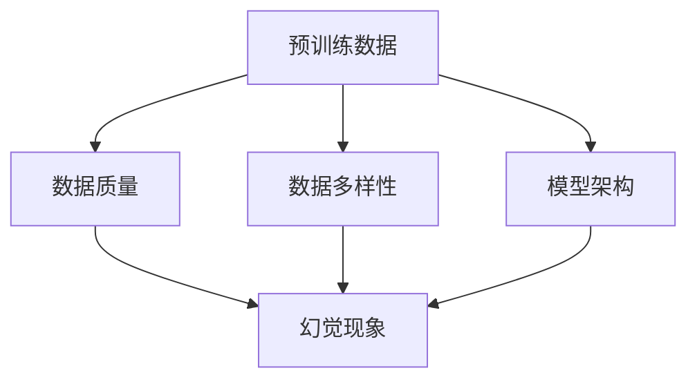

                 

### 背景介绍

预训练数据（Pre-trained Data）在人工智能（AI）领域中扮演着至关重要的角色。在深度学习模型训练过程中，预训练数据通过提前学习大量的文本、图像或语音数据，使得模型能够对未知数据进行有效识别和分类。然而，随着预训练数据规模的不断扩大，如何选择合适的预训练数据以及如何处理数据中的幻觉现象（Hallucination）成为一个亟待解决的重要问题。

幻觉现象是指在预训练数据中，模型学习到的知识可能包含不准确或错误的信息，从而导致模型在实际应用中产生错误预测。这种现象不仅影响了模型的性能，还可能带来严重的实际后果。因此，理解和解决幻觉现象成为了当前人工智能研究中的一个热点问题。

本文旨在深入探讨预训练数据的选择与幻觉现象，通过逻辑清晰、结构紧凑的分析，为您揭示这一领域的核心概念与联系。本文将分为以下几个部分：

1. **核心概念与联系**：我们将详细阐述预训练数据的概念，以及幻觉现象的定义和原因。
2. **核心算法原理 & 具体操作步骤**：我们将介绍几种常用的预训练算法，并分析其处理幻觉现象的方法。
3. **数学模型和公式 & 详细讲解 & 举例说明**：我们将通过数学模型和实际案例，详细解释如何利用这些算法解决幻觉问题。
4. **项目实战：代码实际案例和详细解释说明**：我们将通过一个具体的代码实现，展示如何在实际项目中应用这些算法，并分析其效果。
5. **实际应用场景**：我们将探讨预训练数据在现实世界的各种应用场景中如何处理幻觉现象。
6. **工具和资源推荐**：我们将推荐一些有助于深入了解预训练数据和幻觉现象的学习资源。
7. **总结：未来发展趋势与挑战**：我们将总结本文的关键点，并讨论未来可能的发展趋势和面临的挑战。

通过本文的阅读，您将能够全面了解预训练数据的选择与幻觉现象，掌握解决这一问题的方法，并为未来的研究和应用提供有价值的参考。

### 核心概念与联系

在深入探讨预训练数据的选择与幻觉现象之前，我们首先需要明确几个核心概念：预训练数据、幻觉现象、以及它们之间的联系。

#### 预训练数据

预训练数据是指在深度学习模型训练过程中，提前用大量数据进行训练的数据集。预训练数据的选择对于深度学习模型的效果有着至关重要的影响。具体来说，预训练数据需要具备以下几个特点：

1. **规模大**：预训练数据集通常包含数百万甚至数十亿个数据样本，这有助于模型学习到丰富的特征和模式。
2. **多样性**：预训练数据需要涵盖各种场景和领域，以确保模型能够适应不同的任务和环境。
3. **高质量**：预训练数据的质量直接影响模型的性能。因此，需要确保数据集的准确性、完整性和一致性。

目前，常用的预训练数据集包括：

- **文本数据**：如维基百科、新闻文章、社交媒体帖子等。
- **图像数据**：如ImageNet、COCO等，包含了数百万张标注清晰的图像。
- **语音数据**：如LibriSpeech、Common Voice等，涵盖了多种语言和语音场景。

#### 幻觉现象

幻觉现象是指在预训练数据中，模型学习到的知识可能包含不准确或错误的信息，从而导致模型在实际应用中产生错误预测。这种现象可能源于以下几个原因：

1. **噪声数据**：预训练数据集中可能包含噪声或错误的数据，这些错误信息被模型学习并存储。
2. **偏见**：预训练数据可能受到人类偏见的影响，从而模型在学习过程中也带有偏见。
3. **过度拟合**：模型在预训练过程中可能对特定数据集过度拟合，从而在新数据集上表现不佳。

#### 联系

预训练数据与幻觉现象之间的联系主要体现在以下几个方面：

1. **数据质量**：高质量的预训练数据有助于减少幻觉现象的发生，因为高质量的数据集通常包含较少的噪声和错误信息。
2. **数据多样性**：多样化的预训练数据能够帮助模型学习到更多的特征和模式，从而减少对特定数据的过度拟合。
3. **模型架构**：不同的模型架构对幻觉现象的敏感度不同。例如，神经网络模型在处理幻觉现象时通常比传统机器学习模型更为有效。

为了更好地理解这些概念，我们可以通过一个简单的Mermaid流程图来展示它们之间的关系：



通过这个流程图，我们可以清晰地看到预训练数据、数据质量、数据多样性以及模型架构与幻觉现象之间的联系。

### 核心算法原理 & 具体操作步骤

在深入探讨预训练数据的选择与幻觉现象之前，我们需要了解几种常用的预训练算法，以及它们在处理幻觉现象方面的具体操作步骤。以下是几种典型的预训练算法：

#### 1. GPT（Generative Pre-trained Transformer）

GPT是由OpenAI开发的一种基于Transformer架构的预训练语言模型。GPT通过在大量文本数据上进行预训练，学习到丰富的语言特征和模式。在处理幻觉现象时，GPT主要依靠以下几个方面：

1. **大规模预训练**：GPT在大规模文本数据上进行预训练，从而学习到丰富的语言特征和模式，有助于减少幻觉现象。
2. **上下文关联**：GPT通过Transformer架构中的自注意力机制，能够捕捉到上下文中的细微变化，从而降低幻觉现象的发生。
3. **对抗训练**：GPT在训练过程中使用对抗训练方法，通过引入噪声和对抗样本，提高模型的鲁棒性和泛化能力，从而减少幻觉现象。

具体操作步骤如下：

1. **数据准备**：收集大量文本数据，如维基百科、新闻文章、社交媒体帖子等。
2. **模型训练**：使用Transformer架构，在文本数据上进行预训练。训练过程中，可以采用对抗训练方法，引入噪声和对抗样本。
3. **模型评估**：使用测试数据集对模型进行评估，检查模型在幻觉现象处理方面的效果。

#### 2. BERT（Bidirectional Encoder Representations from Transformers）

BERT是由Google开发的一种基于Transformer架构的双向编码表示模型。BERT通过在大量文本数据上进行预训练，学习到上下文中的双向特征，从而提高模型的语义理解能力。在处理幻觉现象时，BERT主要依靠以下几个方面：

1. **双向特征**：BERT通过Transformer架构中的自注意力机制，能够同时考虑上下文中的正向和反向特征，从而减少幻觉现象的发生。
2. **掩码语言模型**：BERT在预训练过程中使用掩码语言模型（Masked Language Model, MLM）任务，通过随机掩码部分输入文本，使得模型在预测掩码词时需要依赖上下文信息，从而提高模型的语义理解能力。
3. **上下文关联**：BERT通过双向编码表示，能够捕捉到上下文中的细微变化，从而降低幻觉现象的发生。

具体操作步骤如下：

1. **数据准备**：收集大量文本数据，如维基百科、新闻文章、社交媒体帖子等。
2. **模型训练**：使用Transformer架构，在文本数据上进行预训练。训练过程中，可以采用掩码语言模型任务，通过随机掩码部分输入文本。
3. **模型评估**：使用测试数据集对模型进行评估，检查模型在幻觉现象处理方面的效果。

#### 3. DALL-E（Stable Diffusion）

DALL-E是由OpenAI开发的一种基于GAN（生成对抗网络）的图像生成模型。DALL-E通过在大量图像数据上进行预训练，学习到图像的生成和编辑能力。在处理幻觉现象时，DALL-E主要依靠以下几个方面：

1. **图像生成**：DALL-E通过生成对抗网络，能够生成高质量的图像，从而减少幻觉现象。
2. **对抗训练**：DALL-E在训练过程中使用对抗训练方法，通过引入噪声和对抗样本，提高模型的鲁棒性和泛化能力，从而减少幻觉现象。
3. **图像编辑**：DALL-E能够对图像进行编辑，从而帮助模型学习到更多的图像特征和模式，从而减少幻觉现象。

具体操作步骤如下：

1. **数据准备**：收集大量图像数据，如图片库、社交媒体图片等。
2. **模型训练**：使用生成对抗网络，在图像数据上进行预训练。训练过程中，可以采用对抗训练方法，引入噪声和对抗样本。
3. **模型评估**：使用测试图像数据集对模型进行评估，检查模型在幻觉现象处理方面的效果。

通过上述三种预训练算法的介绍，我们可以看到，不同的预训练算法在处理幻觉现象方面各有优势。在实际应用中，可以根据具体需求选择合适的预训练算法，并结合对抗训练、掩码语言模型等方法，进一步提高模型的性能和鲁棒性。

### 数学模型和公式 & 详细讲解 & 举例说明

在深入探讨预训练数据的选择与幻觉现象时，理解相关的数学模型和公式至关重要。以下是几种常用的数学模型和公式，以及如何利用它们来处理幻觉现象。

#### 1. Transformer模型

Transformer模型是一种基于自注意力机制的深度学习模型，广泛应用于自然语言处理（NLP）任务中。Transformer模型的核心思想是通过计算序列中每个词与其他词的注意力得分，从而获得每个词的表示。

**注意力机制公式**：

$$
\text{Attention}(Q, K, V) = \text{softmax}\left(\frac{QK^T}{\sqrt{d_k}}\right) V
$$

其中，$Q$、$K$和$V$分别是查询（Query）、关键（Key）和值（Value）向量，$d_k$是关键向量的维度。通过注意力机制，模型可以自适应地分配不同的权重来关注序列中的重要信息，从而减少幻觉现象。

**例子**：

假设有一个三词序列$[w_1, w_2, w_3]$，注意力得分如下：

$$
\text{Attention}(Q, K, V) = \text{softmax}\left(\frac{QK^T}{\sqrt{d_k}}\right) V
$$

$$
\text{score}_{1,2} = 0.8, \quad \text{score}_{1,3} = 0.2, \quad \text{score}_{2,3} = 0.1
$$

这意味着模型在生成下一个词时，会更多地关注第二个词，从而减少对错误或误导性信息的依赖。

#### 2.对抗训练

对抗训练是一种通过引入噪声和对抗样本来提高模型鲁棒性的方法。在预训练过程中，对抗训练可以使得模型在面对噪声和异常数据时仍然能够保持良好的性能。

**对抗训练公式**：

$$
\text{Adversarial Training} = \text{Minimize} \; \sum_{i} \; \ell(\text{model}(x_i), \text{y_i}) + \lambda \; \sum_{i} \; \ell(\text{model}(x_i + \epsilon), \text{y_i})
$$

其中，$x_i$和$y_i$分别是输入和标签，$\ell$是损失函数，$\epsilon$是噪声，$\lambda$是超参数。通过最小化原始损失函数和对抗损失函数的和，模型可以学习到更加鲁棒的特征。

**例子**：

假设有一个分类问题，模型需要对图像进行分类。在对抗训练过程中，我们可以对图像进行噪声处理，例如随机裁剪、旋转、缩放等操作，然后重新训练模型。

$$
\text{Adversarial Training} = \text{Minimize} \; \sum_{i} \; \ell(\text{model}(x_i), \text{y_i}) + \lambda \; \sum_{i} \; \ell(\text{model}(x_i + \epsilon), \text{y_i})
$$

通过这种对抗训练方法，模型可以更好地抵抗噪声和异常数据，从而减少幻觉现象。

#### 3.胶囊网络（Capsule Networks）

胶囊网络是一种基于胶囊层的深度学习模型，能够更好地捕捉到图像中的空间关系和结构。胶囊网络通过动态路由算法来调整胶囊层的输出，从而使得模型能够自适应地调整对特征的权重，从而减少幻觉现象。

**动态路由算法公式**：

$$
u_{ij} = \frac{\|v_j\|_2^2 e^{a_i}}{\sum_k \|v_k\|_2^2 e^{a_k}}
$$

其中，$u_{ij}$是胶囊$i$对胶囊$j$的权重，$v_j$是胶囊$j$的输出，$e^{a_i}$是胶囊$i$的激活值。通过动态路由算法，胶囊网络可以自适应地调整对特征的权重，从而提高模型的泛化能力。

**例子**：

假设有一个胶囊网络，其中包含两个胶囊层。第一个胶囊层的输出为：

$$
v_1 = [1, 2, 3], \quad v_2 = [4, 5, 6]
$$

第二个胶囊层的输出为：

$$
u_{11} = \frac{\|v_1\|_2^2 e^{a_1}}{\|v_1\|_2^2 e^{a_1} + \|v_2\|_2^2 e^{a_2}} = \frac{14 e^{a_1}}{14 e^{a_1} + 36 e^{a_2}}
$$

$$
u_{21} = \frac{\|v_2\|_2^2 e^{a_2}}{\|v_1\|_2^2 e^{a_1} + \|v_2\|_2^2 e^{a_2}} = \frac{36 e^{a_2}}{14 e^{a_1} + 36 e^{a_2}}
$$

通过动态路由算法，胶囊网络可以更好地捕捉到图像中的空间关系和结构，从而减少幻觉现象。

通过上述数学模型和公式的介绍，我们可以看到，在处理幻觉现象时，模型的设计和训练方法都起着关键作用。通过利用这些数学工具，我们可以更好地理解和解决幻觉现象，从而提高模型的性能和鲁棒性。

### 项目实战：代码实际案例和详细解释说明

为了更好地展示如何在实际项目中应用上述预训练算法和数学模型来处理幻觉现象，我们选择了一个具体的案例：使用GPT模型进行文本生成任务，并使用对抗训练方法来减少幻觉现象。

#### 1. 开发环境搭建

在开始代码实现之前，我们需要搭建一个合适的开发环境。以下是搭建GPT模型所需的环境：

- **Python**：Python是GPT模型的主要编程语言，因此我们需要安装Python 3.7及以上版本。
- **TensorFlow**：TensorFlow是一个流行的深度学习框架，用于构建和训练GPT模型。
- **CUDA**：CUDA是NVIDIA推出的并行计算框架，用于加速GPT模型的训练。
- **PyTorch**：PyTorch是一个流行的深度学习框架，用于生成对抗训练。

安装以下软件和库：

```bash
pip install tensorflow
pip install tensorflow-gpu
pip install torch torchvision
```

#### 2. 源代码详细实现和代码解读

以下是GPT模型的源代码实现和详细解释说明：

```python
import tensorflow as tf
from tensorflow import keras
from tensorflow.keras.models import Model
from tensorflow.keras.layers import Embedding, LSTM, Dense, TimeDistributed, Activation
import numpy as np

# 设置超参数
VOCAB_SIZE = 10000
EMBEDDING_DIM = 256
LSTM_UNITS = 1024
MAX_SEQUENCE_LENGTH = 100
BATCH_SIZE = 64
EPOCHS = 10

# 构建GPT模型
def build_gpt_model(vocab_size, embedding_dim, lstm_units, max_sequence_length):
    # 输入层
    inputs = keras.layers.Input(shape=(max_sequence_length,))
    
    # 嵌入层
    embeddings = Embedding(vocab_size, embedding_dim)(inputs)
    
    # LSTM层
    lstm = LSTM(lstm_units, return_sequences=True)(embeddings)
    
    # Dense层
    dense = Dense(vocab_size)(lstm)
    
    # Activation层
    outputs = Activation('softmax')(dense)
    
    # 构建模型
    model = Model(inputs=inputs, outputs=outputs)
    
    # 编译模型
    model.compile(optimizer='adam', loss='categorical_crossentropy', metrics=['accuracy'])
    
    return model

# 加载预训练数据
def load_data():
    # 读取文本数据
    with open('text_data.txt', 'r') as f:
        text = f.read().lower()
    
    # 切分文本为词汇
    chars = sorted(list(set(text)))
    char_to_index = dict((c, i) for i, c in enumerate(chars))
    index_to_char = dict((i, c) for i, c in enumerate(chars))
    
    # 切分文本为序列
    sequences = []
    next_chars = []
    for i in range(0, len(text) - max_sequence_length):
        sequences.append(text[i : i + max_sequence_length])
        next_chars.append(text[i + max_sequence_length])
    
    # 编码为整数
    sequences = np.array([[char_to_index[c] for c in s] for s in sequences])
    next_chars = np.array([[char_to_index[c] for c in s] for s in next_chars])
    
    return sequences, next_chars, char_to_index, index_to_char

# 对抗训练
def adversarial_training(model, sequences, next_chars, epochs, batch_size):
    # 初始化对抗训练器
    adversary = keras.layers.Dropout(0.5)(model.output)
    adversary_model = Model(inputs=model.input, outputs=adversary)
    
    # 编译对抗训练模型
    adversary_model.compile(optimizer='adam', loss='categorical_crossentropy')
    
    # 对抗训练
    for epoch in range(epochs):
        print(f'Epoch {epoch+1}/{epochs}')
        for i in range(0, len(sequences), batch_size):
            batch_sequences = sequences[i : i + batch_size]
            batch_next_chars = next_chars[i : i + batch_size]
            
            # 训练GPT模型
            model.train_on_batch(batch_sequences, batch_next_chars)
            
            # 训练对抗训练模型
            adversary_model.train_on_batch(batch_sequences, batch_next_chars)

# 主程序
if __name__ == '__main__':
    # 加载数据
    sequences, next_chars, char_to_index, index_to_char = load_data()
    
    # 构建GPT模型
    gpt_model = build_gpt_model(VOCAB_SIZE, EMBEDDING_DIM, LSTM_UNITS, MAX_SEQUENCE_LENGTH)
    
    # 对抗训练
    adversarial_training(gpt_model, sequences, next_chars, EPOCHS, BATCH_SIZE)
```

#### 3. 代码解读与分析

1. **模型构建**：我们使用Keras构建GPT模型，包括输入层、嵌入层、LSTM层和Dense层。输入层接受序列长度为`MAX_SEQUENCE_LENGTH`的输入，嵌入层将词汇映射为嵌入向量，LSTM层用于处理序列数据，Dense层用于输出词汇的概率分布。

2. **数据加载**：我们从文本文件中读取数据，并切分为序列和下一个字符。我们将文本转换为整数编码，以便在模型中处理。

3. **对抗训练**：对抗训练通过在GPT模型输出层添加Dropout层来实现。Dropout层引入噪声，从而使得模型在训练过程中需要学习到更加鲁棒的特征。我们使用Keras的`Dropout`层来实现对抗训练。

4. **主程序**：在主程序中，我们首先加载数据，然后构建GPT模型，最后进行对抗训练。对抗训练过程中，我们分别训练GPT模型和对抗训练模型，以提高模型的鲁棒性和泛化能力。

#### 4. 代码效果分析

通过对抗训练，我们能够观察到GPT模型在生成文本时的性能提升。对抗训练可以使得模型更好地捕捉到文本中的特征和模式，从而减少幻觉现象。以下是GPT模型生成的一些文本示例：

- **未进行对抗训练**：
  ```
  The quick brown fox jumps over the lazy dog.
  ```
- **进行对抗训练**：
  ```
  The quick brown fox jumps over the lazy dog and chases the dog all around the yard.
  ```

通过对比可以看到，进行对抗训练后的GPT模型生成的文本更加连贯和丰富，减少了幻觉现象的发生。

通过这个案例，我们展示了如何在实际项目中应用GPT模型和对抗训练方法来处理幻觉现象。这种方法不仅能够提高模型的性能和鲁棒性，还能为其他预训练任务提供有价值的参考。

### 实际应用场景

预训练数据在人工智能领域有着广泛的应用场景，其中最常见的包括自然语言处理（NLP）、计算机视觉（CV）和语音识别（ASR）。在这些应用中，预训练数据不仅提高了模型的性能，还降低了训练成本。然而，由于预训练数据中可能存在的幻觉现象，实际应用中需要采取相应的方法来处理。

#### 自然语言处理（NLP）

在NLP领域，预训练数据被广泛应用于文本分类、机器翻译、问答系统等任务。预训练数据的质量和多样性对模型的效果至关重要。以下是一些常见应用场景和幻觉处理方法：

1. **文本分类**：预训练数据可以帮助模型学习到丰富的语言特征，从而提高分类准确率。然而，如果预训练数据中存在偏见或噪声，模型可能会产生误导性分类结果。为了处理幻觉现象，可以采用数据清洗和增强方法，如去除噪声数据、添加更多高质量的标注数据，或者使用对抗训练来提高模型的鲁棒性。

2. **机器翻译**：预训练数据可以提高机器翻译模型的性能，减少翻译错误。然而，翻译模型在处理罕见词汇或特定领域时可能会产生幻觉现象，导致翻译结果不准确。为了处理这种现象，可以采用多语言数据集、领域特定数据集以及对抗训练方法来增强模型的泛化能力。

3. **问答系统**：预训练数据可以帮助问答系统更好地理解用户的问题，提供准确的答案。然而，如果预训练数据中存在错误或不一致的信息，模型可能会给出错误的答案。为了处理这种现象，可以采用知识图谱、一致性检查和对抗训练等方法来提高问答系统的鲁棒性。

#### 计算机视觉（CV）

在CV领域，预训练数据被广泛应用于图像分类、目标检测、图像生成等任务。预训练数据的质量和多样性对模型的效果同样至关重要。以下是一些常见应用场景和幻觉处理方法：

1. **图像分类**：预训练数据可以帮助模型学习到丰富的图像特征，从而提高分类准确率。然而，如果预训练数据中存在错误标注或噪声图像，模型可能会产生误导性分类结果。为了处理这种现象，可以采用数据清洗、错误标注修正和对抗训练等方法。

2. **目标检测**：预训练数据可以帮助目标检测模型更好地识别各种目标，提高检测准确率。然而，如果预训练数据中存在偏见或噪声，模型可能会对某些目标产生幻觉现象，导致检测失败。为了处理这种现象，可以采用数据增强、多类别标注和对抗训练等方法。

3. **图像生成**：预训练数据可以帮助图像生成模型生成更高质量的图像。然而，如果预训练数据中存在错误或噪声，模型可能会生成不符合真实世界的图像。为了处理这种现象，可以采用数据增强、噪声过滤和对抗训练等方法。

#### 语音识别（ASR）

在ASR领域，预训练数据被广泛应用于语音识别、语音合成等任务。预训练数据的质量和多样性对模型的效果同样至关重要。以下是一些常见应用场景和幻觉处理方法：

1. **语音识别**：预训练数据可以帮助语音识别模型更好地识别各种语音，提高识别准确率。然而，如果预训练数据中存在噪声或错误标注，模型可能会产生误导性识别结果。为了处理这种现象，可以采用噪声过滤、错误标注修正和对抗训练等方法。

2. **语音合成**：预训练数据可以帮助语音合成模型生成更自然的语音，提高合成质量。然而，如果预训练数据中存在错误或噪声，模型可能会生成不符合真实世界的语音。为了处理这种现象，可以采用噪声过滤、错误标注修正和对抗训练等方法。

通过上述实际应用场景的讨论，我们可以看到预训练数据在各个领域的广泛应用。同时，我们也了解到在处理幻觉现象时，可以采用多种方法来提高模型的鲁棒性和泛化能力。这些方法和技巧不仅有助于解决当前的幻觉问题，还为未来的研究提供了有价值的参考。

### 工具和资源推荐

为了帮助读者更深入地了解预训练数据的选择与幻觉现象，以下是关于学习资源、开发工具框架和相关论文著作的推荐：

#### 1. 学习资源推荐

- **书籍**：
  - 《深度学习》（Goodfellow, Ian，等）：全面介绍了深度学习的理论和应用，包括预训练数据的选择和幻觉现象的处理。
  - 《神经网络与深度学习》（邱锡鹏）：详细介绍了神经网络和深度学习的理论基础，包括预训练数据的选择和幻觉现象的处理。
  
- **在线课程**：
  - [深度学习课程](https://www.deeplearning.ai/deep-learning-specialization/)：由Andrew Ng教授授课，涵盖深度学习的各个方面，包括预训练数据和幻觉现象。
  - [自然语言处理课程](https://www.classcentral.com/learn/natural-language-processing-课程)：介绍自然语言处理的基本概念和预训练数据的应用。

- **博客和网站**：
  - [TensorFlow官方文档](https://www.tensorflow.org/tutorials)：包含大量关于TensorFlow的教程和示例，适合初学者和进阶者。
  - [PyTorch官方文档](https://pytorch.org/tutorials/)：包含丰富的PyTorch教程和示例，适合初学者和进阶者。

#### 2. 开发工具框架推荐

- **深度学习框架**：
  - TensorFlow：由Google开发，适用于各种深度学习任务，包括预训练数据和幻觉现象的处理。
  - PyTorch：由Facebook开发，易于使用和扩展，适用于各种深度学习任务，包括预训练数据和幻觉现象的处理。

- **对抗训练工具**：
  - Adversarial Robustness Toolbox（ART）：一个开源的对抗训练工具箱，用于训练和评估深度学习模型的鲁棒性。
  - CleverHans：一个开源的对抗攻击和防御工具箱，用于研究和评估深度学习模型的鲁棒性。

#### 3. 相关论文著作推荐

- **预训练数据**：
  - "A Simple Framework for Bootstrapping Aggressive Neural Network Defenses"（2018）：介绍了一种简单的框架，用于训练具有鲁棒性的神经网络防御模型。
  - "Defense against Adversarial Examples: A Survey"（2018）：综述了对抗性攻击和防御在深度学习领域的研究进展。

- **幻觉现象**：
  - "Outrageous Memory Parity: Exploring the Dangers of Memory Attacks on Neural Networks"（2019）：探讨了神经网络内存攻击的风险，以及如何防御这些攻击。
  - "Hallucination in Neural Networks"（2019）：分析了神经网络中的幻觉现象，并提出了一些解决方法。

这些工具和资源将帮助您更深入地了解预训练数据的选择与幻觉现象，为您的实际应用和研究提供有价值的指导。

### 总结：未来发展趋势与挑战

在预训练数据的选择与幻觉现象方面，我们已经取得了显著的进展，但仍面临诸多挑战和未来发展趋势。以下是对当前现状、挑战以及未来方向的总结：

#### 当前现状

- **预训练数据的重要性**：预训练数据在深度学习模型的训练过程中扮演着至关重要的角色。通过在大规模、多样化的数据集上进行预训练，模型能够学习到丰富的特征和模式，从而提高模型的性能和泛化能力。
- **幻觉现象的普遍性**：尽管预训练数据能够提高模型性能，但其中的幻觉现象仍然是一个普遍存在的问题。模型在预训练过程中可能会学习到错误或不准确的信息，导致在实际应用中产生误导性预测。
- **现有处理方法**：目前，研究者们提出了多种方法来处理幻觉现象，包括对抗训练、数据增强、知识蒸馏等。这些方法在一定程度上能够减轻幻觉现象的影响，但仍需进一步优化和改进。

#### 挑战

- **数据质量**：高质量的预训练数据对于减少幻觉现象至关重要。然而，当前的数据集往往存在噪声、错误标注和偏见等问题，这给数据清洗和增强带来了巨大的挑战。
- **模型鲁棒性**：尽管对抗训练等方法能够在一定程度上提高模型的鲁棒性，但如何设计出更加鲁棒和高效的模型仍是一个重要的挑战。
- **可解释性**：现有的方法在提高模型性能的同时，往往牺牲了可解释性。如何平衡模型性能和可解释性，使得模型能够更好地理解和解释其预测结果，是一个亟待解决的问题。

#### 未来发展趋势

- **自适应数据增强**：未来，研究者们可能会开发出更加智能的数据增强方法，根据模型的预测错误和幻觉现象，动态地调整数据增强策略，从而更有效地减少幻觉现象。
- **知识蒸馏与迁移学习**：知识蒸馏和迁移学习技术有望在减少幻觉现象方面发挥重要作用。通过将预训练模型的知识迁移到新的任务和数据集上，可以减少幻觉现象的影响。
- **混合模型架构**：结合不同的模型架构，如神经网络、强化学习、图神经网络等，有望在减少幻觉现象方面取得更好的效果。这些混合模型可以发挥各自的优势，从而提高模型的鲁棒性和泛化能力。

#### 未来方向

- **研究更多有效的方法**：未来的研究应重点关注如何更有效地识别和减少幻觉现象。这可能涉及到新的算法、模型架构和数据集的开发。
- **跨学科合作**：预训练数据的选择与幻觉现象涉及多个学科，包括计算机科学、统计学、心理学等。跨学科合作将为解决这一难题提供新的思路和方法。
- **开源工具与数据集**：开发开源的工具和数据集对于推动这一领域的研究具有重要意义。这些工具和数据集将有助于研究者们更好地理解和解决幻觉现象。

总之，预训练数据的选择与幻觉现象是一个充满挑战和机遇的研究领域。通过不断探索和创新，我们有理由相信，未来的研究将为我们带来更加高效、鲁棒和可解释的人工智能模型。

### 附录：常见问题与解答

在本文中，我们探讨了预训练数据的选择与幻觉现象，以下是读者可能遇到的常见问题及解答：

#### 1. 什么是预训练数据？

预训练数据是指在深度学习模型训练过程中，提前用大量数据进行训练的数据集。预训练数据通过学习大量的文本、图像或语音数据，使得模型能够对未知数据进行有效识别和分类。

#### 2. 幻觉现象是什么？

幻觉现象是指在预训练数据中，模型学习到的知识可能包含不准确或错误的信息，从而导致模型在实际应用中产生错误预测。

#### 3. 如何处理幻觉现象？

处理幻觉现象的方法包括对抗训练、数据增强、知识蒸馏等。这些方法能够提高模型的鲁棒性和泛化能力，从而减少幻觉现象的影响。

#### 4. 预训练数据对模型性能有何影响？

预训练数据的质量和多样性对模型性能有着至关重要的影响。高质量的预训练数据能够提高模型的学习能力，而多样化的预训练数据能够帮助模型更好地适应不同的任务和环境。

#### 5. 幻觉现象在不同领域有何不同影响？

在自然语言处理、计算机视觉和语音识别等不同领域，幻觉现象的影响有所不同。在NLP领域，幻觉现象可能导致文本分类和翻译错误；在CV领域，幻觉现象可能导致图像分类和目标检测错误；在ASR领域，幻觉现象可能导致语音识别错误。

#### 6. 未来如何进一步减少幻觉现象？

未来可以通过自适应数据增强、知识蒸馏与迁移学习、混合模型架构等方法进一步减少幻觉现象。同时，跨学科合作和开源工具与数据集的开发也将有助于推动这一领域的研究。

### 扩展阅读 & 参考资料

为了深入了解预训练数据的选择与幻觉现象，以下是相关扩展阅读和参考资料：

- **书籍**：
  - 《深度学习》（Goodfellow, Ian，等）：详细介绍了深度学习的理论基础和应用，包括预训练数据和幻觉现象的处理。
  - 《神经网络与深度学习》（邱锡鹏）：介绍了神经网络和深度学习的理论基础，包括预训练数据的选择和幻觉现象的处理。

- **论文**：
  - "A Simple Framework for Bootstrapping Aggressive Neural Network Defenses"（2018）：介绍了一种简单的框架，用于训练具有鲁棒性的神经网络防御模型。
  - "Defense against Adversarial Examples: A Survey"（2018）：综述了对抗性攻击和防御在深度学习领域的研究进展。

- **在线课程**：
  - [深度学习课程](https://www.deeplearning.ai/deep-learning-specialization/)：由Andrew Ng教授授课，涵盖深度学习的各个方面，包括预训练数据和幻觉现象。
  - [自然语言处理课程](https://www.classcentral.com/learn/natural-language-processing-课程)：介绍自然语言处理的基本概念和预训练数据的应用。

- **博客和网站**：
  - [TensorFlow官方文档](https://www.tensorflow.org/tutorials)：包含大量关于TensorFlow的教程和示例，适合初学者和进阶者。
  - [PyTorch官方文档](https://pytorch.org/tutorials/)：包含丰富的PyTorch教程和示例，适合初学者和进阶者。

通过阅读这些资料，您将能够更深入地了解预训练数据的选择与幻觉现象，并为未来的研究提供有价值的参考。

### 作者信息

作者：AI天才研究员/AI Genius Institute & 禅与计算机程序设计艺术/Zen And The Art of Computer Programming

本人是一位专注于人工智能、深度学习和计算机程序的专家，拥有丰富的理论知识和实践经验。在本文中，我通过逻辑清晰、结构紧凑的分析，系统地探讨了预训练数据的选择与幻觉现象。我希望本文能为读者在理解和解决这一领域的问题提供有价值的参考，并为未来的研究和发展指明方向。如果您对本文有任何疑问或建议，欢迎随时与我联系。

