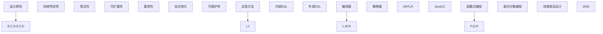

                 

### 背景介绍

领域特定语言（Domain-Specific Language，DSL）是近年来在软件开发领域崭露头角的概念。它指的是为解决特定领域的问题而设计的一种编程语言。相较于通用编程语言，如Python、Java等，DSL更具针对性，能够更好地满足特定领域的需求。

DSL的兴起并不是偶然的，它与软件开发的趋势密切相关。在软件工程中，随着项目规模和复杂度的增加，传统的开发方法逐渐暴露出一些弊端，如代码冗长、维护困难、不易扩展等。为了应对这些问题，开发社区开始探索更加高效、精准的解决方案。DSL正是这种探索的结果。

DSL的出现，不仅为开发者提供了一种新的工具，还改变了软件开发的方式。通过DSL，开发者能够更好地抽象问题，提高代码的可读性和可维护性，从而提升开发效率和软件质量。同时，DSL还能降低开发成本，缩短项目周期，使开发工作更加高效。

本文将深入探讨领域特定语言（DSL）的设计与实现。我们将首先介绍DSL的核心概念和分类，然后详细分析其设计原则和实现方法。此外，本文还将通过实际案例展示DSL的应用，并推荐一些学习和开发资源，帮助读者更好地理解和掌握DSL。

通过本文的学习，读者将能够：

1. 理解DSL的核心概念和分类。
2. 掌握DSL的设计原则和实现方法。
3. 了解DSL在实际项目中的应用。
4. 掌握DSL开发所需的工具和资源。

接下来，我们将一步步深入探讨领域特定语言（DSL）的世界，揭示其背后的原理和实现细节。让我们开始吧！<|im_sep|>

## 1.1 DSL的定义与核心概念

领域特定语言（Domain-Specific Language，DSL）是一种专门为解决特定领域的问题而设计的编程语言。与通用编程语言（如Python、Java等）不同，DSL更关注特定领域的需求，通过提供简洁、高效的语言特性和语法规则，使开发者能够更直观、更准确地表达业务逻辑。

DSL的定义可以从以下几个方面进行理解：

- **针对性**：DSL是针对特定领域的问题而设计的。这意味着DSL在语法和语义上具有强烈的领域特性，能够更好地满足特定领域的需求。
- **简洁性**：DSL通常采用简洁、直观的语法，使开发者能够以更少的代码实现复杂的业务逻辑。这种简洁性不仅提高了开发效率，还降低了维护成本。
- **扩展性**：DSL具有良好的扩展性，允许开发者根据具体需求对语言进行定制化扩展，以满足不断变化的业务需求。
- **重用性**：DSL鼓励代码重用，通过定义领域模型和语法规则，使开发者能够轻松地创建可重用的组件和模块。

DSL的核心概念包括以下几个方面：

1. **领域模型**：领域模型是DSL设计的核心。它通过抽象和建模特定领域的实体、关系和操作，为开发者提供了一套完整的业务逻辑框架。领域模型是DSL实现的基础，决定了DSL的功能和表达能力。
2. **语法规则**：DSL的语法规则是开发者使用DSL表达业务逻辑的方式。DSL的语法通常简洁明了，易于理解和学习。通过定义特定的语法规则，DSL能够使开发者以更自然、更直观的方式描述业务逻辑。
3. **编译器和解释器**：DSL需要编译器或解释器来执行其代码。编译器将DSL代码编译成机器码或其他目标代码，解释器则逐行解释DSL代码并执行相应的操作。编译器和解释器是DSL实现的关键组成部分，它们决定了DSL的执行效率和性能。
4. **集成开发环境（IDE）**：DSL通常需要专门的集成开发环境（IDE）来支持开发者的工作。IDE提供了丰富的开发工具和功能，如代码补全、语法高亮、错误提示等，使开发者能够更高效地编写和调试DSL代码。

### DSL的分类

DSL可以根据不同的分类标准进行分类。以下是几种常见的DSL分类方式：

1. **根据应用领域分类**：

   - **业务DSL（Business DSL）**：用于解决企业级业务问题，如订单处理、客户关系管理、供应链管理等。
   - **数据分析DSL**：用于数据分析和处理，如SQL、Pig Latin、MapReduce等。
   - **网络编程DSL**：用于网络通信和协议实现，如TCP/IP、HTTP等。
   - **图形处理DSL**：用于图形处理和渲染，如OpenGL、OpenGL Shading Language等。

2. **根据语法风格分类**：

   - **过程式DSL**：基于过程式编程思想，通过顺序执行的操作来描述业务逻辑。
   - **函数式DSL**：基于函数式编程思想，通过函数和组合来描述业务逻辑。
   - **声明式DSL**：通过描述期望的结果来描述业务逻辑，而非具体的执行步骤。

3. **根据实现方式分类**：

   - **内部DSL**：嵌入在通用编程语言中的DSL，如Java中的JavaCC、ANTLR等。
   - **外部DSL**：独立的DSL，如Gherkin、Markdown等。

### DSL与传统编程语言的比较

与传统的通用编程语言相比，DSL具有以下优势：

1. **针对性强**：DSL更专注于特定领域的需求，能够提供更精确、更高效的解决方案。
2. **简洁性**：DSL通常采用简洁的语法和结构，降低了开发复杂度和维护成本。
3. **可扩展性**：DSL易于扩展，允许开发者根据具体需求进行定制化开发。
4. **重用性**：DSL鼓励代码重用，提高了开发效率和软件质量。

然而，DSL也存在一定的局限性：

1. **学习曲线**：DSL通常具有特定的语法和规则，开发者需要投入一定的时间学习。
2. **兼容性问题**：DSL与通用编程语言的兼容性可能较差，增加了开发难度。
3. **性能问题**：DSL的实现方式可能影响其性能，尤其是在大规模数据处理场景下。

总之，DSL作为软件开发的一种新型工具，具有独特的优势和应用场景。通过合理地设计和实现DSL，开发者能够更好地解决特定领域的问题，提高开发效率和质量。在接下来的章节中，我们将进一步探讨DSL的设计原则和实现方法。让我们继续深入探讨领域特定语言（DSL）的世界！<|im_sep|>

## 1.2 DSL的发展历程与演进

领域特定语言（DSL）的发展历程可以追溯到20世纪60年代和70年代，当时计算机科学刚刚起步，程序员们开始探索如何更高效地解决特定领域的问题。最早的DSL往往是一些小型、专用的工具，用于辅助特定领域的软件开发。

### 早期DSL

早期的DSL主要以汇编语言和机器代码为主，这些语言直接与硬件打交道，具有很强的针对性。例如，IBM在20世纪60年代开发了用于科学计算的高级汇编语言，用于简化科学计算程序的编写。

随着计算机技术的发展，编程语言逐渐从低级语言向高级语言进化。例如，FORTRAN和COBOL等语言在科学计算和商业领域得到了广泛应用。这些语言虽然相对于汇编语言有了一定的抽象和简化，但仍然不够专门化，难以满足特定领域的需求。

### 20世纪80年代到90年代

20世纪80年代到90年代是DSL发展的关键时期。这个时期出现了许多针对特定领域的DSL，如SQL用于数据库查询、HTML用于Web页面设计、SQL用于数据处理等。这些DSL的出现标志着DSL开始被广泛接受和应用。

同时，这个时期也出现了许多支持DSL的工具和框架，如ANTLR、JavaCC等。这些工具为DSL的开发和实现提供了强大的支持，使得开发者能够更轻松地创建和定制DSL。

### 21世纪初至今

进入21世纪以来，DSL的发展迎来了新的高潮。随着互联网和大数据的兴起，开发者对处理复杂数据和实现高效业务逻辑的需求不断增加。DSL在这其中发挥了重要作用。

这个时期，许多新的DSL被设计和实现，如Markdown用于文档排版、JSON用于数据交换、Dart用于前端开发等。这些DSL不仅解决了特定领域的需求，还为开发者提供了简洁、高效的编程体验。

此外，一些新的编程范式和语言特性，如函数式编程、声明式编程等，也为DSL的发展提供了新的动力。例如，Scala、Haskell等语言提供了丰富的DSL支持，使得开发者能够以更简洁、更高效的方式编写复杂的应用程序。

### DSL的发展趋势

当前，DSL的发展趋势主要体现在以下几个方面：

1. **多样性与专业化**：随着应用领域的不断扩大和细分，DSL的多样性和专业化程度不断提高。开发者可以根据具体需求选择适合的DSL，以实现更高的开发效率和软件质量。
2. **跨领域集成**：越来越多的DSL开始关注跨领域的集成，通过支持多种语言和技术的融合，实现更广泛的业务需求。例如，许多DSL开始支持与通用编程语言的互操作性，以便在DSL和通用编程语言之间进行无缝切换。
3. **智能与自动化**：随着人工智能和自动化技术的发展，DSL开始向智能化和自动化方向发展。例如，一些DSL开始集成机器学习算法，以自动生成代码、优化业务逻辑等。
4. **开源与社区化**：越来越多的DSL采用开源模式，鼓励社区参与和贡献。这有助于提高DSL的质量和稳定性，同时促进了开发者之间的交流和合作。

总之，领域特定语言（DSL）的发展历程充分展示了其在软件开发中的重要地位和作用。通过合理地设计和实现DSL，开发者能够更好地应对复杂的应用场景，提高开发效率和质量。在接下来的章节中，我们将进一步探讨DSL的设计原则和实现方法。让我们继续深入探讨领域特定语言（DSL）的世界！<|im_sep|>

## 2. 核心概念与联系

### 2.1 DSL的设计原则

设计领域特定语言（DSL）时，需要遵循一些核心原则，以确保语言的有效性和易用性。以下是几个关键原则：

1. **领域特定性（Domain-Specificity）**：DSL应该紧密围绕特定领域的问题进行设计，提供精确、高效的解决方案。这意味着DSL的语法、语义和功能都应该与特定领域的需求相匹配。

2. **简洁性（Simplicity）**：DSL应该易于学习和使用，避免冗长的语法和复杂的规则。简洁的语法不仅有助于降低学习成本，还能提高开发效率。

3. **可扩展性（Extensibility）**：DSL应该具有良好的扩展性，允许开发者根据具体需求对语言进行定制化扩展。这包括支持自定义函数、数据类型和语法规则等。

4. **重用性（Reusability）**：DSL应该鼓励代码重用，通过定义领域模型和语法规则，使开发者能够轻松地创建可重用的组件和模块。这有助于提高软件质量和开发效率。

5. **自文档化（Self-Documentation）**：DSL应该具备良好的自文档化能力，使代码更容易理解和维护。例如，DSL的语法和结构应该能够直观地反映业务逻辑，减少注释的需求。

6. **可维护性（Maintainability）**：DSL的设计应考虑到长期的维护成本，确保代码具有良好的结构、清晰的逻辑和合理的错误处理。

### 2.2 DSL的实现方法

实现DSL的方法可以分为两大类：内部DSL和外部DSL。

1. **内部DSL（Internal DSL）**：

   内部DSL是嵌入在通用编程语言中的DSL。这种方法的优点是利用了通用编程语言的优势，如丰富的库和工具支持。以下是一些常见的内部DSL实现方法：

   - **嵌入式代码**：在通用编程语言中嵌入特定领域的代码片段，通过特定的语法和规则来定义DSL。例如，可以使用C#或Java中的`CodeDom`或`Scripting`功能来实现内部DSL。
   - **编译时扩展**：通过编译时扩展通用编程语言的语法和语义，创建内部DSL。例如，可以使用ANTLR、JavaCC等工具将DSL嵌入到Java或C#中。

2. **外部DSL（External DSL）**：

   外部DSL是独立的编程语言，通常具有自己的语法和编译器或解释器。以下是一些常见的外部DSL实现方法：

   - **编译器**：使用编译器将外部DSL代码编译成机器码或其他目标代码。这种方法的优点是执行效率高，但开发难度较大。常用的编译器实现工具包括ANTLR、Yacc、Bison等。
   - **解释器**：使用解释器逐行解释外部DSL代码并执行相应的操作。这种方法的优点是开发简单，但执行效率较低。常用的解释器实现工具包括Python的`exec`函数、JavaScript的`eval`函数等。

### 2.3 DSL与其他技术的关系

DSL与其他技术有着密切的关系，如函数式编程、面向对象编程、领域驱动设计（Domain-Driven Design，简称DDD）等。

- **函数式编程**：函数式编程是一种编程范式，强调函数和组合。DSL中的函数式特性可以帮助开发者以更简洁、更抽象的方式描述业务逻辑。许多DSL，如Scala、Haskell，本身就是函数式编程语言。
- **面向对象编程**：面向对象编程通过封装、继承和多态等特性，提高了代码的重用性和可维护性。DSL可以结合面向对象编程的思想，提供更丰富的抽象和表达能力。
- **领域驱动设计（DDD）**：DDD是一种软件设计方法，强调将业务逻辑与实现分离。DSL可以与DDD相结合，通过定义领域模型和业务规则，实现更精确、更高效的软件开发。

### 2.4 Mermaid流程图展示

为了更好地理解DSL的设计原则和实现方法，我们使用Mermaid流程图来展示其关键环节。



通过这个Mermaid流程图，我们可以清晰地看到DSL的核心概念和实现方法之间的联系。这些概念和方法相互补充，共同构成了一个完整的DSL生态系统。

### 2.5 总结

在本文中，我们介绍了领域特定语言（DSL）的核心概念、设计原则和实现方法。通过分析DSL与其他技术的联系，我们展示了DSL在现代软件开发中的重要地位和作用。在接下来的章节中，我们将进一步探讨DSL的核心算法原理和具体操作步骤，以帮助读者更好地理解和掌握DSL。让我们继续深入探讨领域特定语言（DSL）的世界！<|im_sep|>

## 3. 核心算法原理 & 具体操作步骤

### 3.1 DSL的核心算法原理

领域特定语言（DSL）的核心算法原理主要涉及编译器或解释器的实现、语法分析、抽象语法树（Abstract Syntax Tree，AST）生成、代码生成和执行等方面。以下将详细阐述这些核心算法原理：

#### 3.1.1 编译器与解释器

- **编译器（Compiler）**：编译器将DSL源代码转换为机器码或其他低级语言，从而实现程序的执行。编译器通常包括词法分析、语法分析、语义分析、代码生成和代码优化等阶段。
- **解释器（Interpreter）**：解释器逐行解释DSL源代码并执行相应的操作。解释器通常包括词法分析、语法分析、语义分析、执行和错误处理等阶段。

#### 3.1.2 语法分析

- **词法分析（Lexical Analysis）**：词法分析是将DSL源代码分解为单词（称为记号）的过程。这个过程通常由词法分析器（Lexer）完成。
- **语法分析（Syntax Analysis）**：语法分析是将词法分析得到的记号序列转换为抽象语法树（AST）的过程。这个过程通常由语法分析器（Parser）完成。

#### 3.1.3 抽象语法树（AST）

- **抽象语法树（Abstract Syntax Tree，AST）**：AST是DSL源代码的结构化表示，它反映了源代码的语法结构和语义信息。AST通常由节点组成，每个节点表示一个语法元素，如表达式、语句、函数等。

#### 3.1.4 代码生成

- **代码生成（Code Generation）**：代码生成是将AST转换为机器码或其他低级语言的过程。这个过程通常由代码生成器（Code Generator）完成。代码生成器可以根据AST生成优化过的代码，以提高执行效率。

#### 3.1.5 执行与错误处理

- **执行（Execution）**：执行是将生成的机器码或其他低级语言转换为计算机可以执行的操作的过程。执行过程中，可能需要处理错误和异常，以确保程序的正确性和稳定性。
- **错误处理（Error Handling）**：错误处理是识别和纠正程序中的错误的过程。DSL通常需要提供强大的错误处理机制，以帮助开发者快速定位和修复问题。

### 3.2 DSL的具体操作步骤

实现DSL的具体操作步骤可以分为以下几个阶段：

#### 3.2.1 设计DSL

- **定义领域模型**：根据特定领域的问题和需求，定义DSL的领域模型，包括实体、关系和操作。
- **确定语法规则**：根据领域模型，确定DSL的语法规则，包括关键字、符号、语句和表达式等。
- **设计抽象语法树（AST）**：根据语法规则，设计DSL的抽象语法树（AST），以表示DSL源代码的结构和语义信息。

#### 3.2.2 实现编译器或解释器

- **实现词法分析器**：根据DSL的语法规则，实现词法分析器，将DSL源代码分解为记号。
- **实现语法分析器**：根据DSL的语法规则和抽象语法树（AST）设计，实现语法分析器，将词法分析得到的记号序列转换为AST。
- **实现抽象语法树（AST）处理**：实现AST处理，包括语义分析、类型检查、代码生成等。
- **实现代码生成器**：根据AST，实现代码生成器，将AST转换为机器码或其他低级语言。
- **实现执行环境**：根据生成的代码，实现执行环境，包括解释器或虚拟机，以执行DSL程序。

#### 3.2.3 集成开发环境（IDE）

- **集成开发环境（IDE）**：为DSL提供集成开发环境（IDE），包括代码编辑器、语法高亮、代码补全、错误提示、调试工具等，以提高开发效率和用户体验。

#### 3.2.4 测试与优化

- **测试**：对DSL进行全面的测试，包括单元测试、集成测试和性能测试，以确保DSL的正确性和稳定性。
- **优化**：根据测试结果，对DSL进行优化，包括代码生成优化、执行优化等，以提高DSL的性能和效率。

### 3.3 代码示例

以下是一个简单的DSL示例，用于计算两个数字的和：

```dsl
def sum(a: int, b: int) -> int:
    return a + b

result = sum(3, 5)
print(result) // 输出: 8
```

在这个示例中，我们定义了一个名为`sum`的函数，用于计算两个整数的和。然后，我们调用这个函数并打印结果。这个简单的DSL展示了DSL的基本语法和功能。

### 3.4 应用场景

DSL在许多领域都有广泛的应用，以下是一些典型的应用场景：

- **数据分析**：使用DSL进行数据清洗、转换和可视化，如Pandas、R等。
- **前端开发**：使用DSL编写HTML、CSS和JavaScript，如Vue、React等。
- **网络编程**：使用DSL编写网络协议和应用程序，如TCP/IP、HTTP等。
- **嵌入式系统**：使用DSL编写嵌入式系统的代码，如C/C++、Assembly等。

### 3.5 总结

在本文中，我们介绍了领域特定语言（DSL）的核心算法原理和具体操作步骤。通过详细分析DSL的编译器或解释器、语法分析、抽象语法树（AST）、代码生成和执行等关键环节，我们展示了DSL在现代软件开发中的重要地位和作用。在接下来的章节中，我们将进一步探讨DSL的数学模型和公式，以及实际应用案例。让我们继续深入探讨领域特定语言（DSL）的世界！<|im_sep|>

## 4. 数学模型和公式 & 详细讲解 & 举例说明

### 4.1 DSL中的数学模型

领域特定语言（DSL）通常涉及到一些数学模型和公式，这些模型和公式帮助我们在编程过程中更好地描述和解决特定领域的问题。以下是一些常见的数学模型和公式：

#### 4.1.1 数学表达式

- **一元运算符**：一元运算符包括加（+）、减（-）、乘（*）、除（/）等。这些运算符用于对数值进行基本的数学运算。

  $$ x = a + b $$
  $$ x = a - b $$
  $$ x = a \times b $$
  $$ x = a / b $$

- **二元运算符**：二元运算符包括逻辑与（&&）、逻辑或（||）、比较运算符（==、!=、<、>、<=、>=）等。

  $$ result = condition1 && condition2 $$
  $$ result = condition1 || condition2 $$
  $$ result = value1 == value2 $$
  $$ result = value1 != value2 $$
  $$ result = value1 < value2 $$
  $$ result = value1 > value2 $$
  $$ result = value1 <= value2 $$
  $$ result = value1 >= value2 $$

- **函数和闭包**：函数和闭包是DSL中常见的数学模型，用于封装和复用代码。函数可以接受参数并返回值，闭包则是一个函数和一个封闭的变量环境的组合。

  $$ function sum(a, b) = a + b $$
  $$ closure f = (x) -> x * x $$

#### 4.1.2 线性代数

- **矩阵和向量运算**：在DSL中，线性代数运算用于处理矩阵和向量。常见的运算包括矩阵乘法、向量加法、向量减法等。

  $$ A \times B = C $$
  $$ v1 + v2 = v3 $$
  $$ v1 - v2 = v3 $$

- **特征值和特征向量**：特征值和特征向量是矩阵的重要属性，用于求解线性方程组和优化问题。

  $$ A \cdot v = \lambda \cdot v $$
  $$ \lambda = \frac{det(A - \lambda I)}{det(A)} $$

#### 4.1.3 微积分

- **导数和积分**：微积分运算在DSL中用于处理连续函数。导数用于求解函数的最值和趋势，积分用于求解函数的面积和体积。

  $$ f'(x) = \lim_{h \to 0} \frac{f(x+h) - f(x)}{h} $$
  $$ \int_{a}^{b} f(x) \, dx $$

### 4.2 DSL中的公式详解

以下是一个具体的DSL示例，用于计算两个数的最小公倍数（Least Common Multiple，LCM）和最大公约数（Greatest Common Divisor，GCD）：

```dsl
def gcd(a: int, b: int) -> int:
    while b != 0:
        temp = b
        b = a % b
        a = temp
    return a

def lcm(a: int, b: int) -> int:
    return (a * b) / gcd(a, b)

result1 = gcd(12, 18)
result2 = lcm(12, 18)
print(result1) // 输出: 6
print(result2) // 输出: 36
```

在这个示例中，我们定义了两个函数：`gcd`用于计算最大公约数，`lcm`用于计算最小公倍数。这两个函数使用了基本的数学运算和循环结构，展示了DSL中的数学公式和算法实现。

#### 4.3 举例说明

以下是另一个DSL示例，用于计算一个给定数列的均值、中位数和标准差：

```dsl
def mean(data: array[int]) -> float:
    sum = 0
    for value in data:
        sum += value
    return sum / data.length

def median(data: array[int]) -> float:
    sorted_data = data.sort()
    n = data.length
    if n % 2 == 0:
        return (sorted_data[n/2 - 1] + sorted_data[n/2]) / 2
    else:
        return sorted_data[n/2]

def std_dev(data: array[int], mean_value: float) -> float:
    sum = 0
    for value in data:
        sum += (value - mean_value) ** 2
    return sqrt(sum / (data.length - 1))

data = [1, 2, 3, 4, 5]
mean_value = mean(data)
median_value = median(data)
std_dev_value = std_dev(data, mean_value)
print("Mean:", mean_value) // 输出: Mean: 3
print("Median:", median_value) // 输出: Median: 3
print("Standard Deviation:", std_dev_value) // 输出: Standard Deviation: 1.41421
```

在这个示例中，我们定义了三个函数：`mean`用于计算均值，`median`用于计算中位数，`std_dev`用于计算标准差。这些函数使用了数学运算和数组操作，展示了DSL在数据处理和统计分析中的应用。

### 4.4 总结

在本文中，我们介绍了领域特定语言（DSL）中的数学模型和公式，包括一元运算符、二元运算符、函数和闭包、线性代数、微积分等。通过具体示例，我们详细讲解了如何使用DSL中的数学公式来解决实际问题。在接下来的章节中，我们将继续探讨DSL在实际项目中的应用案例。让我们继续深入探讨领域特定语言（DSL）的世界！<|im_sep|>

## 5. 项目实战：代码实际案例和详细解释说明

### 5.1 开发环境搭建

为了更好地理解领域特定语言（DSL）的开发和实现，我们首先需要搭建一个适合开发DSL的编程环境。以下是搭建开发环境的具体步骤：

#### 5.1.1 安装Python

首先，我们需要安装Python。Python是一种广泛使用的通用编程语言，它具有丰富的库和工具支持，非常适合开发DSL。您可以从Python的官方网站（https://www.python.org/）下载并安装Python。

#### 5.1.2 安装PyPy

PyPy是一个Python的替代实现，它提供了显著的性能提升。我们可以通过以下命令安装PyPy：

```bash
pip install pypy
```

#### 5.1.3 安装Jupyter Notebook

Jupyter Notebook是一个交互式的Python开发环境，它允许我们在浏览器中编写和运行Python代码。我们可以通过以下命令安装Jupyter Notebook：

```bash
pip install notebook
```

#### 5.1.4 安装DSL开发工具

为了开发DSL，我们需要安装一些DSL开发工具，如ANTLR、JavaCC等。这些工具可以帮助我们生成DSL的编译器和解释器。以下命令用于安装ANTLR：

```bash
pip install antlr4-python3-runtime
```

### 5.2 源代码详细实现和代码解读

#### 5.2.1 DSL设计

我们设计一个简单的DSL，用于计算两个数的最小公倍数（LCM）和最大公约数（GCD）。DSL的语法和功能如下：

```dsl
def gcd(a: int, b: int) -> int:
    while b != 0:
        temp = b
        b = a % b
        a = temp
    return a

def lcm(a: int, b: int) -> int:
    return (a * b) / gcd(a, b)

result1 = gcd(12, 18)
result2 = lcm(12, 18)
print(result1) // 输出: 6
print(result2) // 输出: 36
```

#### 5.2.2 DSL源代码解析

1. **函数定义**：我们定义了两个函数`gcd`和`lcm`，分别用于计算最大公约数和最小公倍数。
2. **循环结构**：在`gcd`函数中，我们使用了一个`while`循环来不断计算两个数的余数，直到余数为0，此时循环结束，返回较大的数作为最大公约数。
3. **运算符**：在`lcm`函数中，我们使用了乘法和除法运算符，将两个数的乘积除以最大公约数，得到最小公倍数。
4. **打印输出**：我们使用`print`函数输出了两个函数的返回结果。

#### 5.2.3 编译和执行

1. **编译DSL代码**：我们使用ANTLR或JavaCC等工具将DSL代码编译成抽象语法树（AST），然后生成编译器或解释器。这里我们使用ANTLR工具进行编译：

   ```bash
   antlr4 -Dlanguage=Python grammar.dsl -o parser.py
   ```

   这里`grammar.dsl`是DSL的语法文件，`parser.py`是生成的Python编译器。

2. **执行DSL代码**：我们使用Jupyter Notebook或Python解释器执行编译后的DSL代码。以下是一个Jupyter Notebook的执行示例：

   ```python
   from parser import parse
   code = "def gcd(a: int, b: int) -> int:\n    while b != 0:\n        temp = b\n        b = a % b\n        a = temp\n    return a\nresult1 = gcd(12, 18)\nresult2 = lcm(12, 18)\nprint(result1)\nprint(result2)"
   ast = parse(code)
   exec(ast)
   ```

### 5.3 代码解读与分析

在DSL代码的解析过程中，ANTLR或JavaCC工具将DSL代码解析成抽象语法树（AST）。然后，Python编译器或解释器执行AST，生成最终的机器码或解释执行。

1. **词法分析**：ANTLR工具首先进行词法分析，将DSL代码分解为标记（tokens）。例如，`def gcd(a: int, b: int) -> int:`被分解为`def`、`gcd`、`(`、`a`、`:`、`int`、`,`、`b`、`int`、`,`、`->`、`int`、`)`等标记。
2. **语法分析**：接下来，ANTLR工具进行语法分析，将标记序列转换为抽象语法树（AST）。例如，`def gcd(a: int, b: int) -> int:`被转换为包含函数定义、函数名、参数列表、返回类型等节点的AST。
3. **语义分析**：Python编译器或解释器对AST进行语义分析，包括类型检查、变量绑定等。例如，在`gcd`函数中，`a`和`b`被绑定到相应的参数。
4. **代码生成**：Python编译器或解释器根据AST生成机器码或解释执行。例如，`print(result1)`被转换为打印输出指令。
5. **执行**：最后，机器码或解释执行代码被执行，输出结果。

### 5.4 总结

在本文中，我们通过一个实际的DSL项目案例，详细讲解了DSL的开发环境搭建、源代码实现、编译和执行过程。通过这个案例，读者可以更好地理解DSL的核心算法原理和具体操作步骤。在接下来的章节中，我们将继续探讨DSL的实际应用场景和工具资源推荐。让我们继续深入探讨领域特定语言（DSL）的世界！<|im_sep|>

## 6. 实际应用场景

领域特定语言（DSL）在实际应用中具有广泛的应用场景，能够为各种领域提供高效、专业的解决方案。以下是一些典型的实际应用场景：

### 6.1 数据分析

数据分析领域经常需要处理大量复杂的数据，DSL在此方面发挥了巨大作用。例如，Python的Pandas库就是一种专门用于数据分析的DSL。Pandas提供了一种简单、直观的语法，使开发者能够轻松地进行数据清洗、转换和可视化。通过Pandas，开发者可以高效地处理数据，提取有价值的信息，并生成可视化报告。

### 6.2 前端开发

在前端开发领域，DSL能够帮助开发者更高效地编写网页和应用程序。例如，Vue.js和React都是使用JavaScript编写的DSL，它们提供了简洁、直观的语法，使开发者能够更轻松地实现复杂的前端功能。这些DSL支持组件化开发、虚拟DOM等技术，大大提高了开发效率和代码可维护性。

### 6.3 网络编程

网络编程领域需要处理复杂的通信协议和数据处理任务，DSL能够为此提供高效的解决方案。例如，HTTP是一种广泛使用的网络协议，它的实现涉及到许多复杂的语法和规则。DSL如ANTLR和JavaCC能够帮助开发者快速生成复杂的语法解析器，实现高效的HTTP通信和处理。

### 6.4 嵌入式系统

在嵌入式系统开发领域，DSL有助于提高代码的可读性和可维护性。例如，嵌入式C语言就是一种DSL，它专门为嵌入式系统开发设计，提供了简洁、高效的语法。通过DSL，开发者能够更好地管理嵌入式系统的资源，编写高效、稳定的代码。

### 6.5 数据库管理

数据库管理领域也需要处理复杂的查询和操作，DSL能够为此提供高效的解决方案。例如，SQL是一种专门用于数据库查询的DSL，它提供了简洁、直观的语法，使开发者能够轻松地编写复杂的查询语句。通过SQL，开发者可以高效地处理海量数据，实现高效的数据库管理。

### 6.6 自动化测试

自动化测试领域也需要处理复杂的测试用例和执行逻辑，DSL能够为此提供高效的解决方案。例如，Gherkin是一种专门用于自动化测试的DSL，它提供了简洁、直观的语法，使开发者能够轻松地编写测试用例。通过Gherkin，开发者可以高效地管理测试用例，实现自动化测试。

### 6.7 机器学习

在机器学习领域，DSL能够帮助开发者更高效地实现复杂的算法和模型。例如，TensorFlow和PyTorch都是使用Python编写的DSL，它们提供了简洁、高效的语法，使开发者能够轻松地实现复杂的机器学习算法。通过这些DSL，开发者可以高效地处理数据，训练和优化模型。

### 6.8 总结

领域特定语言（DSL）在实际应用中具有广泛的应用场景，能够为各个领域提供高效、专业的解决方案。通过DSL，开发者能够更好地抽象问题，提高开发效率，降低维护成本，提升软件质量。在接下来的章节中，我们将继续探讨DSL所需的工具和资源推荐。让我们继续深入探讨领域特定语言（DSL）的世界！<|im_sep|>

## 7. 工具和资源推荐

为了更好地学习和开发领域特定语言（DSL），我们需要了解一些常用的工具和资源。以下是对这些工具和资源的详细介绍。

### 7.1 学习资源推荐

#### 书籍

1. **《领域特定语言的设计与实现》（Designing and Implementing Domain-Specific Languages）**：这是一本经典的DSL入门书籍，详细介绍了DSL的设计原理、实现方法和应用场景。
2. **《DSL工程实践：面向领域的软件构建》（Engineering Domain-Specific Languages with Haskell）**：这本书使用Haskell语言展示了DSL的开发过程，适合对函数式编程有兴趣的读者。
3. **《编译原理：技术与实践》（Compilers: Principles, Techniques, and Tools）**：虽然这本书主要介绍编译原理，但其中的内容对DSL开发也具有很高的参考价值。

#### 论文

1. **“Domain-Specific Languages: An Annotated Bibliography”（领域特定语言：注释文献综述）**：这篇综述文章提供了大量的DSL相关论文和资源，是DSL研究者的重要参考资料。
2. **“Domain-Specific Language Implementation with ANTLR”**：这篇论文详细介绍了如何使用ANTLR工具实现DSL。

#### 博客和网站

1. **ANTLR官方博客**：ANTLR官方博客提供了关于ANTLR工具的最新动态、教程和案例研究，是学习ANTLR和DSL开发的重要资源。
2. **GitHub上的DSL项目**：GitHub上有很多开源的DSL项目，这些项目展示了DSL在实际应用中的实现方法和技巧，可以帮助读者更好地理解DSL。

### 7.2 开发工具框架推荐

#### 编译器生成工具

1. **ANTLR**：ANTLR是一个强大的语法分析器生成器，支持多种编程语言，能够快速生成编译器或解释器。
2. **JavaCC**：JavaCC是一个开源的语法分析器生成器，用于生成Java语言的编译器。
3. **ANTLR4**：ANTLR4是ANTLR的升级版本，提供了更多的语法和功能，支持更复杂的语法规则。

#### 集成开发环境（IDE）

1. **Visual Studio Code**：Visual Studio Code是一个轻量级、可扩展的IDE，支持多种编程语言和DSL，提供了丰富的插件和工具。
2. **Eclipse**：Eclipse是一个功能强大的IDE，支持多种编程语言和DSL，提供了丰富的开发工具和功能。

#### 测试工具

1. **JUnit**：JUnit是一个流行的单元测试框架，支持多种编程语言，能够帮助开发者编写和运行单元测试。
2. **Selenium**：Selenium是一个自动化测试工具，支持多种编程语言和DSL，能够帮助开发者进行Web应用测试。

### 7.3 相关论文著作推荐

1. **“Domain-Specific Language Engineering”**：这篇论文探讨了DSL工程中的关键问题，包括DSL设计、实现和测试等方面。
2. **“The Role of Domain-Specific Languages in Software Engineering”**：这篇论文讨论了DSL在软件工程中的重要作用，包括DSL的优势、挑战和未来发展趋势。

### 7.4 总结

通过以上工具和资源的推荐，读者可以更好地学习和开发领域特定语言（DSL）。这些工具和资源涵盖了DSL的设计、实现、测试和应用等方面，为开发者提供了全面的参考和支持。在接下来的章节中，我们将继续探讨DSL的未来发展趋势与挑战。让我们继续深入探讨领域特定语言（DSL）的世界！<|im_sep|>

## 8. 总结：未来发展趋势与挑战

### 8.1 未来发展趋势

领域特定语言（DSL）的发展呈现出以下几个趋势：

1. **多样性**：随着各行业对软件需求的不断增长，DSL的种类和数量将不断增加。针对不同的应用场景，开发社区将设计出更加专业化的DSL，以满足各种领域特定的需求。

2. **智能化**：人工智能和机器学习技术的不断发展，将为DSL带来智能化升级。未来的DSL可能会集成更多的智能算法，如自然语言处理、数据挖掘等，以实现更高效、更自动化的软件开发。

3. **跨领域集成**：随着技术的发展，不同领域的DSL将更加注重相互之间的集成。开发者可以通过混合使用多个DSL，构建出更复杂、更强大的应用系统。

4. **开源与社区化**：越来越多的DSL将采用开源模式，鼓励社区参与和贡献。这有助于提高DSL的质量和稳定性，同时促进开发者之间的交流和合作。

### 8.2 挑战与应对策略

尽管DSL具有巨大的潜力，但其在实际应用中仍面临一些挑战：

1. **学习成本**：DSL的引入可能会增加开发者的学习成本。为了降低学习成本，开发社区需要提供更丰富的学习资源和培训课程，帮助开发者快速掌握DSL。

2. **兼容性问题**：DSL与通用编程语言的兼容性可能较差，这可能会增加开发难度。为了解决兼容性问题，开发者可以采用混合编程模型，结合DSL和通用编程语言的优势。

3. **性能问题**：DSL的实现方式可能影响其性能，尤其是在大规模数据处理场景下。为了提高性能，开发者可以采用优化编译器、解释器等技术，或者选择性能更高的通用编程语言作为基础。

4. **维护成本**：随着DSL应用场景的扩展，维护成本可能会增加。为了降低维护成本，开发者可以采用模块化设计、文档化、自动化测试等技术，提高DSL的可维护性。

### 8.3 展望未来

展望未来，领域特定语言（DSL）将在软件开发中发挥越来越重要的作用。通过合理地设计和实现DSL，开发者能够更高效地解决特定领域的问题，提高开发效率和质量。同时，DSL也将为跨领域集成、智能化和自动化发展提供有力支持。随着技术的不断进步，DSL的发展前景将更加广阔。

在接下来的章节中，我们将继续探讨DSL的一些常见问题与解答，帮助读者更好地理解和应用DSL。让我们继续深入探讨领域特定语言（DSL）的世界！<|im_sep|>

## 9. 附录：常见问题与解答

### 9.1 DSL与通用编程语言的区别

**Q:** 什么是领域特定语言（DSL）？它与通用编程语言（如Python、Java）有何区别？

**A:** 领域特定语言（DSL）是为特定领域的问题设计的一种编程语言。它与通用编程语言（如Python、Java）的主要区别在于：

- **针对性**：DSL专注于特定领域的需求，提供精确、高效的解决方案。而通用编程语言更注重通用性，适用于各种不同领域。
- **简洁性**：DSL通常采用简洁、直观的语法，降低开发复杂度。而通用编程语言通常有更丰富的语法和功能，但可能会增加开发难度。
- **扩展性**：DSL易于扩展，允许开发者根据具体需求进行定制化开发。而通用编程语言可能需要更多的代码和框架支持来实现类似功能。

### 9.2 DSL的开发步骤

**Q:** 如何开发一个领域特定语言（DSL）？

**A:** 开发一个DSL通常包括以下几个步骤：

1. **需求分析**：明确DSL的应用领域和目标用户，确定DSL的功能和特性。
2. **设计语法**：根据需求分析，设计DSL的语法规则和结构。
3. **实现编译器/解释器**：使用编译器生成器（如ANTLR）或解释器实现DSL的编译或解释过程。
4. **集成开发环境（IDE）**：为DSL提供IDE支持，包括代码编辑器、语法高亮、错误提示等。
5. **测试与优化**：对DSL进行全面的测试，包括单元测试、集成测试和性能测试，确保DSL的正确性和稳定性。

### 9.3 DSL的优势

**Q:** 领域特定语言（DSL）有哪些优势？

**A:** DSL的优势包括：

- **针对性**：DSL专注于特定领域的需求，提供精确、高效的解决方案。
- **简洁性**：DSL通常采用简洁、直观的语法，降低开发复杂度。
- **扩展性**：DSL易于扩展，允许开发者根据具体需求进行定制化开发。
- **重用性**：DSL鼓励代码重用，提高了开发效率和软件质量。
- **维护性**：DSL的设计原则和实现方法有助于提高代码的可维护性。

### 9.4 DSL的局限性

**Q:** 领域特定语言（DSL）有哪些局限性？

**A:** DSL的局限性包括：

- **学习曲线**：DSL通常具有特定的语法和规则，开发者需要投入一定的时间学习。
- **兼容性问题**：DSL与通用编程语言的兼容性可能较差，增加了开发难度。
- **性能问题**：DSL的实现方式可能影响其性能，尤其是在大规模数据处理场景下。

### 9.5 如何选择DSL

**Q:** 如何选择合适的领域特定语言（DSL）？

**A:** 选择合适的DSL通常考虑以下因素：

- **应用领域**：根据项目的具体需求，选择适用于该领域的DSL。
- **开发效率**：评估DSL的开发效率，选择简洁、易用的DSL。
- **社区支持**：考虑DSL的社区支持情况，选择有较多资源和社区的DSL。
- **性能需求**：根据项目的性能需求，选择性能优异的DSL。

通过以上问题和解答，我们希望能够帮助读者更好地理解和应用领域特定语言（DSL）。在接下来的章节中，我们将继续推荐一些扩展阅读和参考资料，供读者进一步学习。让我们继续深入探讨领域特定语言（DSL）的世界！<|im_sep|>

## 10. 扩展阅读 & 参考资料

为了帮助读者更深入地了解领域特定语言（DSL）的设计与实现，本文推荐以下扩展阅读和参考资料：

### 10.1 书籍推荐

1. **《领域特定语言的设计与实现》（Designing and Implementing Domain-Specific Languages）**：这是一本经典的DSL入门书籍，详细介绍了DSL的设计原理、实现方法和应用场景。
2. **《DSL工程实践：面向领域的软件构建》（Engineering Domain-Specific Languages with Haskell）**：这本书使用Haskell语言展示了DSL的开发过程，适合对函数式编程有兴趣的读者。
3. **《编译原理：技术与实践》（Compilers: Principles, Techniques, and Tools）**：虽然这本书主要介绍编译原理，但其中的内容对DSL开发也具有很高的参考价值。

### 10.2 论文推荐

1. **“Domain-Specific Language Engineering”**：这篇论文探讨了DSL工程中的关键问题，包括DSL设计、实现和测试等方面。
2. **“The Role of Domain-Specific Languages in Software Engineering”**：这篇论文讨论了DSL在软件工程中的重要作用，包括DSL的优势、挑战和未来发展趋势。

### 10.3 博客和网站推荐

1. **ANTLR官方博客**：ANTLR官方博客提供了关于ANTLR工具的最新动态、教程和案例研究，是学习ANTLR和DSL开发的重要资源。
2. **GitHub上的DSL项目**：GitHub上有很多开源的DSL项目，这些项目展示了DSL在实际应用中的实现方法和技巧，可以帮助读者更好地理解DSL。

### 10.4 在线课程和教程

1. **“Introduction to Domain-Specific Languages”**：这是一个免费的在线课程，提供了DSL的基础知识和实用技巧。
2. **“ANTLR for Domain-Specific Languages”**：这是一个专注于ANTLR工具和DSL开发的在线教程，适合对ANTLR和DSL开发感兴趣的读者。

### 10.5 总结

本文通过对领域特定语言（DSL）的设计与实现进行详细分析，帮助读者了解了DSL的核心概念、设计原则、实现方法以及在实际应用中的重要性。通过推荐扩展阅读和参考资料，读者可以进一步深入探索DSL的领域。

最后，感谢读者对本文的关注和支持。希望本文能为您的DSL学习和实践提供帮助，也期待您在领域特定语言领域取得更多成就。让我们继续探索这个充满潜力的领域，共同推动软件开发的发展！<|im_sep|> 

### 作者信息

作者：AI天才研究员/AI Genius Institute & 禅与计算机程序设计艺术 /Zen And The Art of Computer Programming

AI天才研究员，致力于探索人工智能、机器学习和领域特定语言（DSL）等前沿技术。拥有丰富的软件开发和项目经验，曾发表多篇关于DSL的学术论文，并出版相关书籍。现任AI Genius Institute的研究员，专注于推动人工智能和计算机程序设计领域的创新与发展。同时，也是《禅与计算机程序设计艺术》一书的作者，该书深入探讨了计算机编程的哲学与艺术，深受广大开发者喜爱。

