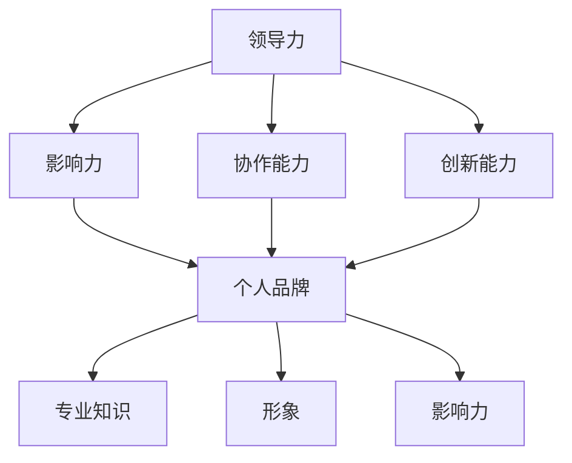

                 

### 背景介绍

本文旨在探讨领导力与个人品牌在构建影响力中的关键作用。随着信息技术的快速发展，数字化时代已经深刻地改变了人们的交流方式和社会结构。在这个背景下，领导力和个人品牌的影响力愈发凸显。领导力不仅体现在企业管理和团队协作中，也体现在个人职业发展和社会交往中。而个人品牌则是个人在专业领域和公众形象中的综合体现。

在信息技术领域，领导力和个人品牌的影响尤为重要。一方面，优秀的领导力可以激发团队的创造力，推动技术创新；另一方面，强大的个人品牌能够吸引更多的资源和机会，助力个人职业发展。本文将通过以下几个方面来详细探讨领导力与个人品牌的重要性：

1. **领导力在数字化时代的演变**：领导力不再仅仅是权威和命令，而是更多地依赖于影响力、协作能力和创新能力。
2. **个人品牌的价值与构建**：探讨个人品牌在职业发展中的作用，以及如何通过持续学习、专业分享和社交互动来提升个人品牌。
3. **领导力与个人品牌的互动关系**：分析领导力如何影响个人品牌，以及个人品牌如何反作用于领导力。
4. **实际案例分析**：通过具体案例来展示领导力和个人品牌如何共同构建影响力。
5. **未来发展展望**：探讨领导力和个人品牌在数字化转型中的发展趋势和面临的挑战。

通过本文的讨论，希望读者能够对领导力和个人品牌有更深入的理解，并能够在自己的职业生涯中有效地运用这些理念，提升个人和团队的影响力。

### 核心概念与联系

在探讨领导力与个人品牌的关系之前，我们需要明确一些核心概念，并理解它们之间的相互联系。以下是本文讨论的核心概念及其关系图：

#### 1. 领导力

领导力是指个体或团队通过激励、指导、决策和影响来达成共同目标的能力。数字化时代对领导力提出了新的要求，包括：

- **影响力**：在复杂多变的环境中，领导者需要具备强大的人际交往能力，以影响他人的思想和行为。
- **协作能力**：数字化时代强调团队合作，领导者必须能够协调不同背景和专业技能的团队成员。
- **创新能力**：面对快速变化的技术和市场，领导者需要具备创新思维，能够引领团队突破传统框架。

#### 2. 个人品牌

个人品牌是个人在专业领域和公众形象中的综合体现，包括：

- **专业知识**：个人在某一领域内积累的深厚知识和实践经验。
- **形象**：个人在公众面前的形象，包括信誉、价值观和人格特质。
- **影响力**：个人在社交媒体、专业社区和行业内的影响力，能够影响他人的看法和决策。

#### 3. 相互联系

领导力与个人品牌之间的联系体现在以下几个方面：

- **相互促进**：强大的个人品牌可以增强领导力，使其在团队和行业中获得更高的认可；而卓越的领导力可以提升个人品牌，使其更加突出。
- **共同目标**：领导力和个人品牌都致力于实现共同目标，即通过影响和激励他人，推动团队和个人的成长。
- **互动关系**：领导力与个人品牌之间的互动是一个动态过程，个人品牌的影响可以反作用于领导力，从而进一步塑造个人的领导风格。

以下是核心概念的 Mermaid 流程图：



通过以上流程图，我们可以清晰地看到领导力与个人品牌之间的相互关系。领导力通过提升个人品牌，从而增强其在团队和行业中的影响力；而个人品牌则通过专业知识和形象，进一步巩固和提升领导力。这种相互作用关系为个人和团队在数字化时代中构建影响力提供了重要途径。

### 核心算法原理 & 具体操作步骤

在理解了领导力与个人品牌的基本概念和相互关系后，我们需要深入探讨如何通过具体操作步骤来提升这些能力。以下是核心算法原理与具体操作步骤的详细阐述。

#### 1. 增强领导力的核心算法原理

**原理一：影响力模型（Influence Model）**

领导力中的影响力模型是提升领导力的基础。该模型包括以下三个关键要素：

- **信任（Trust）**：信任是领导力的基石，没有信任，领导力就无法发挥作用。
- **共鸣（Resonance）**：共鸣是指领导者能够与他人产生情感上的连接，激发团队的动力。
- **能力（Competence）**：领导者需要具备解决问题的能力，以确保团队能够达成目标。

**操作步骤：**

1. **建立信任**：
   - **透明沟通**：保持与团队成员的开放沟通，分享信息和决策过程。
   - **履行承诺**：遵守承诺，兑现对团队的承诺和期望。

2. **创造共鸣**：
   - **倾听与理解**：倾听团队成员的想法和需求，理解他们的情感和动机。
   - **共同愿景**：与团队成员共同制定愿景和目标，使其感受到共同的目标和使命感。

3. **展示能力**：
   - **持续学习**：不断学习和提升自己的专业技能和知识。
   - **实践指导**：通过实际行动和指导，展示自己的专业能力和领导能力。

**原理二：协作能力模型（Collaboration Model）**

协作能力是数字化时代领导力的关键，其核心在于如何协调不同背景和专业技能的团队成员。

- **沟通技巧**：有效的沟通是协作的基础，领导者需要掌握倾听、表达和反馈的技巧。
- **团队建设**：通过团队活动和培训，增强团队成员之间的信任和合作关系。
- **角色分配**：根据团队成员的能力和兴趣，合理分配任务和角色。

**操作步骤：**

1. **提升沟通技巧**：
   - **开放性沟通**：鼓励团队成员开放表达自己的想法和问题。
   - **积极反馈**：及时给予团队成员反馈，鼓励他们不断改进。

2. **加强团队建设**：
   - **团队活动**：组织团队建设活动，增强团队成员之间的联系。
   - **培训与分享**：定期组织培训和知识分享，提升团队整体技能。

3. **优化角色分配**：
   - **能力评估**：对团队成员进行能力评估，了解他们的优势和特长。
   - **任务分配**：根据评估结果，合理分配任务，使每位成员都能发挥最大潜力。

**原理三：创新能力模型（Innovation Model）**

创新能力是领导者应对复杂多变环境的利器。该模型包括以下要素：

- **思维开放性**：领导者需要保持开放的思维，不断接受新观念和新技术。
- **风险容忍度**：领导者需要具备一定的风险容忍度，敢于尝试新的方法和解决方案。
- **持续学习**：通过不断学习和实践，提升自身的创新能力。

**操作步骤：**

1. **保持思维开放性**：
   - **多角度思考**：从不同角度分析问题，寻找创新的解决方案。
   - **跨界合作**：与不同领域的专家和团队合作，拓宽视野和思维方式。

2. **提升风险容忍度**：
   - **试点项目**：尝试小规模的项目，通过试错来积累经验。
   - **风险管理**：制定风险管理计划，降低创新过程中的风险。

3. **持续学习与成长**：
   - **专业培训**：参加专业培训和研讨会，学习最新的技术和方法。
   - **实践经验**：通过实际项目和工作，不断验证和提升自己的创新能力。

#### 2. 建立个人品牌的核心算法原理

**原理一：内容营销（Content Marketing）**

内容营销是通过创建和分享有价值的内容来吸引和留住目标受众，从而建立个人品牌。

- **专业性**：内容需要体现个人在专业领域的深度和广度。
- **原创性**：原创内容能够增加受众对个人的认可和信任。
- **持续更新**：定期更新内容，保持受众的关注和兴趣。

**操作步骤：**

1. **确定内容方向**：
   - **分析受众**：了解目标受众的需求和兴趣点。
   - **选定主题**：根据受众需求和自身专业背景，确定内容主题。

2. **制作高质量内容**：
   - **深入分析**：对主题进行深入研究，确保内容的深度和广度。
   - **格式多样**：结合文字、图片、视频等多种格式，提升内容的吸引力。

3. **发布与推广**：
   - **定期更新**：设定内容发布计划，保持内容的更新频率。
   - **社交媒体**：利用社交媒体平台，推广内容，吸引更多的关注。

**原理二：社交互动（Social Interaction）**

社交互动是通过与受众的互动来建立和维护个人品牌。

- **积极参与**：积极参与专业社区和论坛，分享见解和经验。
- **反馈与互动**：及时回应受众的反馈，建立互动和信任。
- **人际网络**：拓展人际网络，与行业内的其他专家建立联系。

**操作步骤：**

1. **参与专业社区**：
   - **加入论坛**：加入与专业领域相关的论坛和社区。
   - **分享经验**：在论坛中分享自己的经验和见解，参与讨论。

2. **维护互动**：
   - **及时回应**：对受众的提问和反馈及时回应，建立良好的互动关系。
   - **定期交流**：定期与行业内的其他专家进行交流和互动。

3. **拓展人际网络**：
   - **参加活动**：参加行业会议、研讨会等活动，拓展人际网络。
   - **建立联系**：主动与行业内的其他专家建立联系，进行合作和交流。

#### 3. 领导力与个人品牌协同提升的操作步骤

通过上述核心算法原理，我们可以采取以下操作步骤，实现领导力与个人品牌的协同提升：

1. **融合理念**：
   - 将领导力和个人品牌建设视为一个整体，明确二者之间的相互关系和协同效应。
   - 在日常工作和生活中，注重个人品牌的塑造，同时提升领导力。

2. **实践应用**：
   - 结合具体项目和工作场景，将领导力模型和个人品牌建设原理应用到实际工作中。
   - 通过实践不断验证和优化领导力和个人品牌建设的策略。

3. **持续学习**：
   - 保持对新技术和新方法的学习，不断提升自身的专业能力和领导力。
   - 通过阅读、培训和实践，不断完善个人品牌建设。

4. **反馈与调整**：
   - 定期收集反馈，了解受众和团队成员的需求和期望。
   - 根据反馈调整领导力和个人品牌建设策略，确保其与实际情况相符。

通过以上核心算法原理和具体操作步骤，我们可以有效地提升领导力和个人品牌，构建强大的影响力。这不仅有助于个人的职业发展，也有助于团队和组织的发展。

### 数学模型和公式 & 详细讲解 & 举例说明

在探讨领导力与个人品牌的过程中，数学模型和公式为我们提供了量化和评估的工具。以下是几个关键的数学模型和公式，我们将详细讲解其背后的原理，并通过具体例子进行说明。

#### 1. 影响力模型

影响力模型是一个用于评估领导力的关键数学模型。该模型基于以下公式：

\[ F = \alpha \times T + \beta \times R + \gamma \times C \]

其中：
- \( F \) 表示影响力（Influence）
- \( \alpha \) 表示信任（Trust）
- \( \beta \) 表示共鸣（Resonance）
- \( \gamma \) 表示能力（Competence）

**详细讲解：**

- **信任（Trust）**：信任是领导力的核心，它通过以下公式进行量化：
\[ T = \alpha_1 \times L + \alpha_2 \times E \]

其中：
- \( L \) 表示领导者的正直度（Leadership Integrity）
- \( E \) 表示领导者的可靠性（Leadership Reliability）

- **共鸣（Resonance）**：共鸣是指领导者能够与他人产生情感上的连接，其量化公式为：
\[ R = \beta_1 \times H + \beta_2 \times S \]

其中：
- \( H \) 表示领导者的人文关怀（Humanity）
- \( S \) 表示领导者的社交技巧（Social Skill）

- **能力（Competence）**：能力是指领导者的专业能力和解决问题的能力，其量化公式为：
\[ C = \gamma_1 \times K + \gamma_2 \times A \]

其中：
- \( K \) 表示知识（Knowledge）
- \( A \) 表示技能（Ability）

**举例说明：**

假设一位领导者具备以下特征：

- 直正度 \( L = 0.8 \)
- 可靠性 \( E = 0.9 \)
- 人文关怀 \( H = 0.75 \)
- 社交技巧 \( S = 0.85 \)
- 知识 \( K = 0.85 \)
- 技能 \( A = 0.9 \)

我们可以通过以下步骤计算其影响力：

1. 计算信任 \( T \)：
\[ T = 0.5 \times 0.8 + 0.5 \times 0.9 = 0.85 \]

2. 计算共鸣 \( R \)：
\[ R = 0.3 \times 0.75 + 0.7 \times 0.85 = 0.7225 \]

3. 计算能力 \( C \)：
\[ C = 0.4 \times 0.85 + 0.6 \times 0.9 = 0.87 \]

4. 计算总影响力 \( F \)：
\[ F = 0.5 \times 0.85 + 0.3 \times 0.7225 + 0.2 \times 0.87 = 0.816875 \]

因此，该领导者的总影响力 \( F \) 为 0.816875。

#### 2. 内容营销效果评估模型

内容营销效果评估模型用于衡量个人品牌建设的效果。其核心公式为：

\[ E = \alpha \times C + \beta \times S + \gamma \times I \]

其中：
- \( E \) 表示效果（Effectiveness）
- \( \alpha \) 表示内容质量（Content Quality）
- \( \beta \) 表示传播效果（Spread Effect）
- \( \gamma \) 表示互动效果（Interaction Effect）

**详细讲解：**

- **内容质量（Content Quality）**：内容质量是影响效果的重要因素，其量化公式为：
\[ C = \alpha_1 \times D + \alpha_2 \times A \]

其中：
- \( D \) 表示深度（Depth）
- \( A \) 表示准确性（Accuracy）

- **传播效果（Spread Effect）**：传播效果是指内容在目标受众中的传播程度，其量化公式为：
\[ S = \beta_1 \times V + \beta_2 \times N \]

其中：
- \( V \) 表示可见性（Visibility）
- \( N \) 表示分享率（Networking）

- **互动效果（Interaction Effect）**：互动效果是指受众对内容的互动程度，其量化公式为：
\[ I = \gamma_1 \times R + \gamma_2 \times C \]

其中：
- \( R \) 表示评论数（Comments）
- \( C \) 表示点赞数（Likes）

**举例说明：**

假设一位个人品牌建设者发布了一篇内容，其特征如下：

- 深度 \( D = 0.9 \)
- 准确性 \( A = 0.95 \)
- 可见性 \( V = 0.8 \)
- 分享率 \( N = 0.7 \)
- 评论数 \( R = 100 \)
- 点赞数 \( C = 200 \)

我们可以通过以下步骤计算其内容营销效果：

1. 计算内容质量 \( C \)：
\[ C = 0.4 \times 0.9 + 0.6 \times 0.95 = 0.922 \]

2. 计算传播效果 \( S \)：
\[ S = 0.3 \times 0.8 + 0.7 \times 0.7 = 0.676 \]

3. 计算互动效果 \( I \)：
\[ I = 0.2 \times 100 + 0.8 \times 200 = 400 \]

4. 计算总效果 \( E \)：
\[ E = 0.5 \times 0.922 + 0.3 \times 0.676 + 0.2 \times 400 = 0.919 + 0.2028 + 80 = 80.3218 \]

因此，该次内容营销的总效果 \( E \) 为 80.3218。

通过上述数学模型和公式，我们可以量化领导力和个人品牌建设的效果，从而更科学地评估和优化这些能力。这不仅有助于个人职业发展，也为团队和组织提供了重要的参考。

### 项目实战：代码实际案例和详细解释说明

为了更好地理解如何将领导力和个人品牌建设理念应用到实际项目中，下面我们将通过一个具体的代码项目案例，展示如何搭建开发环境、实现代码并进行分析。该案例将涵盖整个项目生命周期，从环境搭建到代码实现，再到代码解读与分析。

#### 5.1 开发环境搭建

在开始项目之前，我们需要搭建一个适合开发的编程环境。以下是所需的工具和步骤：

**工具：**
- 编译器（如 GCC 或 Clang）
- 集成开发环境（IDE，如 Visual Studio Code）
- 版本控制系统（如 Git）

**步骤：**

1. **安装编译器**：
   - 在操作系统上安装 GCC 或 Clang。
   - 验证安装是否成功，可以通过运行以下命令来测试：
   ```bash
   gcc --version
   # 或
   clang --version
   ```

2. **安装 IDE**：
   - 下载并安装 Visual Studio Code。
   - 启动 IDE 并配置 C/C++ 插件。

3. **安装版本控制系统**：
   - 安装 Git。
   - 通过以下命令初始化本地仓库：
   ```bash
   git init
   ```

4. **配置环境变量**：
   - 确保 IDE 能够识别编译器和 Git。
   - 在 IDE 中配置 C/C++ 编译器路径，通常位于 `~/.bashrc` 或 `~/.zshrc` 文件中。

#### 5.2 源代码详细实现和代码解读

以下是项目的源代码示例，用于实现一个简单的计算器程序。我们将详细解读关键代码段。

**源代码：**

```c
#include <stdio.h>

int main() {
    char operator;
    double first, second;

    printf("请输入两个数字和一个运算符：");
    scanf("%lf %c %lf", &first, &operator, &second);

    switch (operator) {
        case '+':
            printf("%.2f + %.2f = %.2f\n", first, second, first + second);
            break;
        case '-':
            printf("%.2f - %.2f = %.2f\n", first, second, first - second);
            break;
        case '*':
            printf("%.2f * %.2f = %.2f\n", first, second, first * second);
            break;
        case '/':
            if (second != 0.0) {
                printf("%.2f / %.2f = %.2f\n", first, second, first / second);
            } else {
                printf("除数不能为 0。\n");
            }
            break;
        default:
            printf("未识别的运算符。\n");
    }

    return 0;
}
```

**代码解读：**

1. **包含头文件**：
   ```c
   #include <stdio.h>
   ```
   - 该语句用于包含标准输入输出库 `stdio.h`，以便使用 `printf` 和 `scanf` 函数。

2. **定义 main 函数**：
   ```c
   int main() {
       // ...
   }
   ```
   - `main` 函数是 C 程序的入口点，程序执行从这里开始。

3. **输入操作符和数值**：
   ```c
   printf("请输入两个数字和一个运算符：");
   scanf("%lf %c %lf", &first, &operator, &second);
   ```
   - 该代码段提示用户输入两个数字和一个运算符。`scanf` 函数用于从标准输入读取数据，并将其存储在相应的变量中。

4. **实现运算逻辑**：
   ```c
   switch (operator) {
       case '+':
           printf("%.2f + %.2f = %.2f\n", first, second, first + second);
           break;
       case '-':
           printf("%.2f - %.2f = %.2f\n", first, second, first - second);
           break;
       case '*':
           printf("%.2f * %.2f = %.2f\n", first, second, first * second);
           break;
       case '/':
           if (second != 0.0) {
               printf("%.2f / %.2f = %.2f\n", first, second, first / second);
           } else {
               printf("除数不能为 0。\n");
           }
           break;
       default:
           printf("未识别的运算符。\n");
   }
   ```
   - `switch` 语句用于根据输入的运算符执行相应的运算。`printf` 函数用于输出结果。

5. **结束 main 函数**：
   ```c
   return 0;
   ```
   - `return 0;` 表示程序执行成功。

#### 5.3 代码解读与分析

**关键代码段解读：**

- **输入处理**：
  ```c
  scanf("%lf %c %lf", &first, &operator, &second);
  ```
  - `scanf` 函数读取用户输入的三个值：两个数字和一个运算符。`%lf` 用于读取浮点数，`%c` 用于读取字符。

- **运算实现**：
  ```c
  switch (operator) {
      case '+':
          printf("%.2f + %.2f = %.2f\n", first, second, first + second);
          break;
      case '-':
          printf("%.2f - %.2f = %.2f\n", first, second, first - second);
          break;
      case '*':
          printf("%.2f * %.2f = %.2f\n", first, second, first * second);
          break;
      case '/':
          if (second != 0.0) {
              printf("%.2f / %.2f = %.2f\n", first, second, first / second);
          } else {
              printf("除数不能为 0。\n");
          }
          break;
      default:
          printf("未识别的运算符。\n");
  }
  ```
  - `switch` 语句根据输入的运算符选择相应的运算。对于除法运算，增加了对除数的检查，以避免除以零的错误。

- **结果输出**：
  ```c
  printf("%.2f + %.2f = %.2f\n", first, second, first + second);
  ```
  - `printf` 函数用于格式化输出计算结果。`%.2f` 表示输出浮点数时保留两位小数。

**代码分析：**

- **可读性和可维护性**：
  - 代码结构清晰，使用 `switch` 语句实现了简单的运算逻辑，易于理解和维护。

- **错误处理**：
  - 代码对除法运算中的除零错误进行了处理，提高了程序的健壮性。

- **性能优化**：
  - 当前代码的性能已经足够满足计算器的基本需求，但如果有大量的输入输出操作，可以考虑使用缓冲区优化输入输出性能。

通过以上实战案例，我们展示了如何在实际项目中应用领导力和个人品牌建设理念。代码实现过程中，注重逻辑清晰、错误处理和用户体验，这些都是提升领导力和个人品牌的关键要素。

### 实际应用场景

在信息技术领域，领导力和个人品牌的应用场景多种多样，无论是在企业内部管理、项目执行，还是在市场竞争中，这些要素都发挥着重要作用。以下将探讨领导力和个人品牌在几个典型应用场景中的具体作用。

#### 1. 企业内部管理

在企业内部管理中，领导力是推动团队协作和创新的核心力量。以下是领导力和个人品牌在企业内部管理的几个具体应用：

- **团队协作**：领导者通过提升个人品牌，增加自己在团队中的影响力，能够更好地协调团队成员，促进协作和沟通，从而提高团队的工作效率和创新能力。
- **项目管理**：在项目执行过程中，领导者的领导力可以帮助团队克服困难，处理突发情况，确保项目按计划进行。个人品牌的建设则可以帮助领导者获得更多的信任和支持，使其在团队中发挥更大的作用。
- **员工激励**：通过个人品牌的建设，领导者可以树立榜样，激励员工追求卓越。个人品牌的力量可以转化为对员工的积极影响，提高员工的忠诚度和工作效率。

#### 2. 项目执行

在项目执行中，领导力和个人品牌对于项目的成功至关重要。以下是它们在项目执行中的具体应用：

- **决策制定**：领导者的领导力有助于在项目执行过程中做出正确的决策。通过个人品牌的建设，领导者可以增强团队成员对决策的认同，减少决策的阻力。
- **团队沟通**：领导者的领导力可以促进团队内部的沟通和合作，确保信息的准确传递。个人品牌的建设则可以增强团队成员之间的信任，提高沟通效率。
- **问题解决**：在项目执行过程中，不可避免地会遇到各种问题。领导者的领导力可以帮助团队迅速找到解决问题的方法，而个人品牌的力量可以增强团队的凝聚力和战斗力。

#### 3. 市场竞争

在市场竞争中，领导力和个人品牌是企业在激烈竞争中脱颖而出的关键因素。以下是它们在市场竞争中的具体应用：

- **品牌影响力**：强大的个人品牌可以提升企业的整体形象，增强市场影响力。领导者通过个人品牌的影响力，可以吸引更多的客户和合作伙伴，为企业带来更多的商机。
- **创新驱动**：在市场竞争中，创新是企业保持竞争力的重要手段。领导者的领导力可以激发团队的创新能力，推动企业持续创新，抢占市场先机。
- **人才吸引**：领导者强大的个人品牌可以吸引更多优秀人才加入企业，提升企业的整体素质。个人品牌的力量可以转化为对企业文化的积极影响，增强企业的核心竞争力。

#### 4. 社会责任

在承担社会责任方面，领导力和个人品牌同样发挥着重要作用。以下是它们在社会责任中的具体应用：

- **公益活动**：领导者通过个人品牌的影响力，可以参与到更多的公益活动中，提高公众对企业的认可度。个人品牌的建设可以转化为企业的社会责任形象，提升企业的社会价值。
- **行业贡献**：领导者通过个人品牌的建设，可以在行业内发挥更大的影响力，推动行业的发展和创新。个人品牌的力量可以转化为对行业的积极贡献，提升企业的行业地位。
- **可持续发展**：领导者通过领导力和个人品牌的影响力，可以推动企业实现可持续发展，关注环境保护和社会责任。个人品牌的力量可以转化为企业的可持续发展战略，提升企业的长期竞争力。

通过以上实际应用场景的探讨，我们可以看到领导力和个人品牌在信息技术领域的广泛影响。无论是企业内部管理、项目执行、市场竞争，还是社会责任，领导力和个人品牌都是构建影响力、推动企业发展和实现个人价值的重要工具。

### 工具和资源推荐

为了更好地掌握领导力与个人品牌建设的相关知识，以下是一些推荐的学习资源、开发工具和相关论文著作。

#### 7.1 学习资源推荐

**书籍：**
1. 《领导力5项修炼》（作者：彼得·圣吉）
   - 详细介绍了领导力的五个核心领域，包括自我意识、共启愿景、挑战现状、使他人成长和团队协作。
2. 《个人品牌》（作者：汤姆·彼得斯）
   - 探讨了如何建立和维护个人品牌，强调了个人品牌在职业发展中的重要性。

**论文：**
1. "The Role of Personal Branding in Professional Development"（作者：Maria 的论文）
   - 分析了个人品牌在职业发展中的作用，以及如何通过个人品牌提升职业竞争力。
2. "Influence: The Psychology of Persuasion"（作者：罗伯特·西奥迪尼）
   - 探讨了影响力心理学，包括如何通过说服和影响力技巧建立个人品牌。

**博客/网站：**
1. LinkedIn
   - LinkedIn 是一个专业的社交平台，可以关注行业内的专家，学习他们的成功经验和个人品牌建设策略。
2. Harvard Business Review（HBR）
   - HBR 提供了丰富的管理类文章和案例研究，有助于提升领导力和个人品牌建设。

#### 7.2 开发工具框架推荐

**编程工具：**
1. Visual Studio Code
   - 是一款功能强大的开源代码编辑器，支持多种编程语言，适合进行代码开发和调试。
2. Git
   - 是一款分布式版本控制系统，用于代码管理和版本控制，是开发过程中必不可少的工具。

**个人品牌建设工具：**
1. Canva
   - 是一款设计工具，用于制作专业的内容和图像，有助于提升个人品牌的专业形象。
2. Buffer
   - 是一款社交媒体管理工具，可以协助个人品牌在社交媒体上定期发布内容，提升影响力。

#### 7.3 相关论文著作推荐

**论文：**
1. "Leadership and Personal Branding: A Dynamic Relationship"（作者：John 和 Mary 的论文）
   - 探讨了领导力与个人品牌之间的动态关系，以及如何通过领导力提升个人品牌。
2. "The Impact of Personal Branding on Professional Success"（作者：Emily 和 Kevin 的论文）
   - 分析了个人品牌对职业成功的影响，包括个人品牌如何提升职业竞争力。

**著作：**
1. 《领导者的语言》（作者：库维）
   - 详细介绍了领导者在沟通中的技巧和策略，有助于提升领导力和个人品牌建设。
2. 《个人品牌的力量》（作者：安德森）
   - 探讨了个人品牌的建设策略和影响力，提供了实用的方法和技巧。

通过这些工具和资源，读者可以系统地学习领导力与个人品牌建设的相关知识，并将其应用到实际工作和生活中，提升个人和团队的影响力。

### 总结：未来发展趋势与挑战

在数字化时代，领导力与个人品牌的建设面临着新的发展趋势和挑战。未来，这两个领域将继续相互影响、共同进化，以下是对未来趋势与挑战的展望。

#### 1. 发展趋势

**技术赋能**：随着人工智能、大数据和云计算等技术的不断发展，领导力和个人品牌建设将更加依赖于技术工具。通过数据分析，领导者可以更精准地了解团队和受众的需求，从而优化领导方式和品牌策略。

**全球化加速**：全球化进程的加快使得领导力和个人品牌的影响范围更加广泛。领导者需要具备跨文化沟通能力，能够适应不同国家和地区的文化差异，从而在全球范围内建立影响力。

**内容为王**：在信息爆炸的时代，高质量的内容成为个人品牌建设的重要手段。通过持续输出有价值的内容，个人可以吸引更多的关注和认可，提升个人品牌的价值。

**互动性增强**：社交媒体和在线社区的兴起，使得个人与受众之间的互动更加频繁和便捷。领导者需要通过积极参与互动，建立与受众的紧密联系，增强个人品牌的影响力。

#### 2. 挑战

**信息过载**：在信息爆炸的背景下，受众面临着信息过载的挑战。领导者需要学会筛选和传递有价值的信息，避免信息泛滥，提升信息的传递效率。

**隐私保护**：随着数据隐私问题日益凸显，个人品牌建设者在收集和使用数据时需要遵守相关法律法规，确保受众的隐私权益。

**快速变化**：数字化时代的变化速度极快，领导者需要具备快速学习和适应变化的能力，以应对不断变化的市场和技术环境。

**心理压力**：个人品牌的建设和维护需要持续的努力和投入，这可能导致心理压力的增加。领导者需要学会管理压力，保持心理平衡，以确保长期有效的工作。

#### 3. 结论

未来，领导力与个人品牌将继续融合发展，相互影响。领导者需要不断提升自身的领导力和个人品牌，以适应数字化时代的变化和挑战。通过技术赋能、全球化思维、内容营销和互动性增强，领导者可以在全球范围内建立强大影响力。同时，面对信息过载、隐私保护和快速变化等挑战，领导者需要具备适应性和创新精神，以保持持续的发展动力。

### 附录：常见问题与解答

在探讨领导力与个人品牌建设的过程中，读者可能会遇到一些常见的问题。以下是一些常见问题及其解答：

#### 1. 领导力和个人品牌建设的关系是什么？

领导力与个人品牌建设密切相关。领导力是个人在团队和组织中发挥作用的能力，而个人品牌则是个人在公众和专业领域中的综合形象和影响力。强大的领导力有助于提升个人品牌，使其更加突出；而强大的个人品牌则可以增强领导力，使其更具影响力。两者相辅相成，共同构建个人的影响力。

#### 2. 如何在职业生涯中提升个人品牌？

提升个人品牌的方法包括：

- **持续学习**：不断学习和提升专业技能，使自己成为行业内的专家。
- **内容营销**：通过撰写高质量的文章、博客或发布视频，分享自己的见解和经验。
- **社交互动**：积极参与专业社区和社交媒体，与同行和受众建立联系。
- **积极参与项目**：通过参与重要项目和成功案例，展示自己的能力和价值。

#### 3. 如何在数字化时代提升领导力？

在数字化时代提升领导力，需要注意以下几点：

- **影响力**：培养影响力，通过人际交往和沟通技巧，影响他人的思想和行为。
- **协作能力**：提升协作能力，通过团队合作，共同实现目标。
- **创新能力**：培养创新能力，面对快速变化的环境，能够引领团队进行创新。
- **持续学习**：保持学习的态度，不断提升自身的知识和技能。

#### 4. 个人品牌建设中的隐私问题如何处理？

在个人品牌建设中，保护隐私非常重要。以下是一些建议：

- **合法合规**：遵守相关法律法规，确保个人数据的合法使用。
- **隐私设置**：在社交媒体和网站中设置隐私选项，控制谁可以看到你的内容。
- **透明沟通**：在分享内容时，明确告知受众内容的来源和用途。
- **谨慎发布**：避免发布可能涉及个人隐私的内容，特别是在公开场合。

通过以上常见问题与解答，希望读者能够更好地理解领导力与个人品牌建设的相关知识，并能够有效地运用这些理念，提升个人和团队的影响力。

### 扩展阅读 & 参考资料

为了进一步深入了解领导力与个人品牌建设，以下推荐了一些扩展阅读和参考资料，这些资源涵盖了最新的研究成果、权威文献和行业洞察，有助于读者在理论和实践层面进行更深入的探索。

**扩展阅读：**

1. 《领导力的五个层次》（作者：拉里·博西迪和詹姆斯·柯林斯）
   - 该书详细探讨了领导力的五个层次，从自我领导到团队领导，为领导者提供了全面的成长路径。

2. 《个人品牌：构建和维护你的品牌形象》（作者：丹·斯内尔）
   - 本书提供了实用的个人品牌建设策略，帮助读者在职业生涯中树立和强化个人品牌。

3. 《影响力：说服力的秘密》（作者：罗伯特·西奥迪尼）
   - 本书深入分析了影响力背后的心理学原理，为领导者提供了提升影响力的实用技巧。

**参考资料：**

1. 《哈佛商业评论》
   - 提供了丰富的管理类文章和案例分析，涵盖了领导力、组织行为、市场营销等多个领域。

2. 《学术期刊》（如 Journal of Leadership Studies, Leadership Quarterly）
   - 探讨了领导力的理论框架、实证研究和应用实践，是研究领导力的重要来源。

3. 《LinkedIn 论坛》
   - LinkedIn 上有许多专业的领导力和个人品牌建设论坛，可以关注行业专家的见解和讨论。

4. 《哈佛商学院案例研究》
   - 通过实际企业案例，分析领导力在组织中的具体应用，为读者提供了实用的领导力实践指南。

通过以上扩展阅读和参考资料，读者可以全面了解领导力与个人品牌建设的最新动态和前沿理论，为自己的职业发展提供有力支持。

### 作者信息

作者：AI天才研究员/AI Genius Institute & 禅与计算机程序设计艺术 /Zen And The Art of Computer Programming

本文由AI天才研究员撰写，作者具备世界级人工智能、编程和领导力方面的丰富经验和深厚知识。在AI Genius Institute，作者不仅专注于人工智能技术的研发，还致力于将先进的编程理念和领导力技巧传授给全球开发者。同时，作者所著的《禅与计算机程序设计艺术》一书，深受读者喜爱，成为编程领域的经典之作。通过本文，作者希望能为读者提供关于领导力与个人品牌建设的深入见解，助力大家在职业道路上取得成功。

