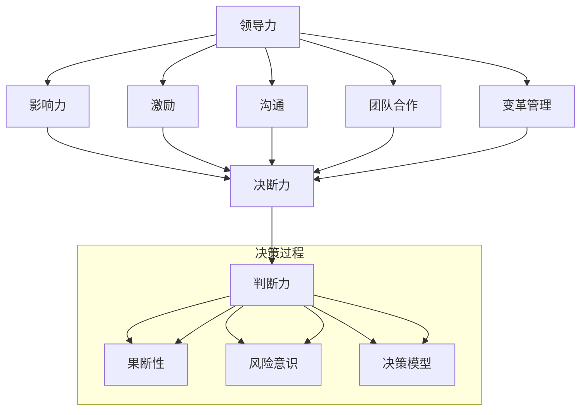

                 

### 引言

在当今快速发展的科技时代，领导者不仅需要具备卓越的技术能力，还需要具备出色的决策能力。无论是在企业内部，还是面对复杂多变的全球市场，领导力与决断力已经成为决定一个组织成功与否的关键因素。本文旨在探讨领导力与决断力在关键时刻的重要性，并通过具体案例分析，为读者提供在复杂环境中做出正确决策的策略和方法。

关键词：领导力，决断力，关键时刻，决策策略，案例分析

摘要：本文从多个角度分析了领导力与决断力的重要性，并介绍了在关键时刻做出正确决策的基本原则。通过具体案例，阐述了如何在实际操作中运用这些原则，以提高决策的有效性和准确性。文章结构清晰，逻辑严谨，适合广大科技行业领导者、项目管理者及技术从业者阅读。

领导力，顾名思义，是指领导者引导、影响和激励团队，实现组织目标的能力。而决断力则是指在面对复杂决策时，领导者能够迅速判断形势，果断决策的能力。在科技行业，尤其是在人工智能、大数据、云计算等前沿领域，领导力和决断力显得尤为重要。因为技术创新的步伐快速而剧烈，领导者不仅需要具备深厚的技术背景，还需要具备敏锐的市场洞察力和灵活的应变能力。

本文将首先介绍领导力与决断力的基本概念和理论，接着通过具体案例来阐述这些概念在实际中的应用，并总结出一套有效的决策策略。文章还将探讨如何通过数学模型和公式来提高决策的准确性和科学性，最后讨论领导力与决断力在未来科技发展中的重要作用及面临的挑战。

总之，本文旨在为广大科技行业领导者提供一份实用的决策指南，帮助他们在关键时刻做出正确决策，引领组织迈向成功。让我们开始这段深入而有趣的探讨之旅吧。

### 背景介绍

领导力与决断力是管理学的核心概念，它们在组织运作和决策过程中起着至关重要的作用。在现代科技行业中，这些能力尤为重要。首先，科技行业的发展速度极快，技术创新频繁，领导者需要具备前瞻性的视野，能够预判技术趋势和市场变化，从而做出符合组织长远发展的战略决策。其次，科技行业的竞争激烈，快速决策和灵活应对是企业在激烈竞争中脱颖而出的关键。此外，科技项目的复杂性和不确定性较高，领导者必须具备强大的决断力，在关键时刻做出正确决策，以应对各种突发状况。

领导力是指领导者通过影响力、激励和沟通能力，引导和激励团队成员，实现组织目标的能力。它不仅包括技术和管理能力，还涵盖了情感智慧和人际交往能力。一个优秀的领导者不仅能够带领团队高效完成任务，还能够建立积极向上的团队文化，激发团队成员的潜力和创造力。

决断力则是指在面对复杂决策时，领导者能够迅速判断形势，果断决策的能力。决断力不仅要求领导者具备深厚的技术背景和丰富的管理经验，还需要有冷静的头脑和清晰的思维。在关键时刻，领导者需要能够迅速分析问题，权衡各种因素，做出最优决策。

在科技行业中，领导力与决断力的重要性体现在以下几个方面：

1. **技术创新与战略决策**：科技行业的技术创新速度极快，领导者需要具备前瞻性，能够把握技术趋势，制定符合市场需求的战略决策。例如，在人工智能领域，领导者需要能够准确判断哪些技术将引领未来，从而在研发和投资方面做出正确的决策。

2. **项目管理和团队协作**：科技项目通常复杂且时间紧迫，领导者需要具备强大的决断力，能够在关键时刻快速决策，确保项目顺利进行。同时，领导者还需要协调团队成员，解决各种冲突和问题，提高团队协作效率。

3. **市场应对与竞争策略**：科技市场的竞争激烈，领导者需要具备敏锐的市场洞察力和灵活的应变能力，能够在市场变化中迅速调整策略，抓住机遇，应对挑战。例如，在云计算和大数据领域，领导者需要能够及时调整产品定位和营销策略，以应对竞争对手的挑战。

4. **风险管理与决策**：科技行业的风险较高，领导者需要具备良好的风险管理和决策能力，能够在面对不确定性和风险时做出合理的决策。例如，在投资新的技术或产品时，领导者需要评估风险和收益，做出最优决策。

综上所述，领导力与决断力在科技行业中具有至关重要的地位。一个优秀的领导者不仅能够带领团队在技术创新和市场竞争中取得优势，还能够确保组织在复杂环境中保持稳定和持续发展。

### 核心概念与联系

为了深入理解领导力与决断力，我们需要首先明确这两个核心概念的基本原理和相互联系。以下是这些核心概念的基本原理及它们在实际应用中的相互关系。

#### 领导力的基本原理

领导力是一种复杂的人际交往能力，其核心在于如何影响、激励和引导他人。以下是领导力的几个关键原理：

1. **影响力**：领导者通过自身的能力、经验和价值观，影响团队成员的行为和决策。这种影响力不仅体现在技术和管理方面，还包括情感和道德层面。

2. **激励**：领导者需要了解团队成员的需求和动机，通过激励措施激发他们的工作热情和创造力。激励方式包括奖励、认可、培训和发展机会等。

3. **沟通**：有效的沟通是领导力的关键，领导者需要能够清晰、准确地传达目标、期望和决策，同时也要倾听团队成员的意见和建议。

4. **团队合作**：领导者需要培养团队的协作精神，通过团队建设活动和协作机制，确保团队成员能够高效合作，共同实现目标。

5. **变革管理**：在快速变化的科技环境中，领导者需要具备变革管理的能力，能够引导组织适应新的环境和要求，推动创新和发展。

#### 决断力的基本原理

决断力是领导力的一个重要组成部分，它体现在领导者面对复杂决策时能够迅速判断形势、果断决策的能力。以下是决断力的几个关键原理：

1. **判断力**：决断力要求领导者具备敏锐的判断力，能够快速分析问题的本质和关键因素，从而做出合理的决策。

2. **果断性**：决断力还需要领导者具备果断性，在面对不确定性时能够迅速做出决策，避免拖延和犹豫。

3. **风险意识**：领导者需要具备良好的风险意识，能够在决策过程中评估潜在的风险和收益，做出最优决策。

4. **决策模型**：决断力要求领导者能够运用各种决策模型和方法，例如SWOT分析、决策树等，提高决策的科学性和准确性。

#### 领导力与决断力的相互关系

领导力和决断力之间存在着密切的相互关系：

1. **领导力是决断力的基础**：一个优秀的领导者通过其影响力、激励和沟通能力，能够建立强大的团队和协作环境，这为领导者做出正确决策提供了坚实的基础。

2. **决断力是领导力的体现**：在关键时刻，领导者通过果断决策和快速行动，展示了其决断力，这也是领导力的重要体现。

3. **相辅相成**：领导力和决断力相辅相成，共同作用，领导力为决断力提供方向和资源，而决断力则通过有效的决策和执行，推动领导力的实现。

在实际应用中，领导力和决断力的结合至关重要。领导者需要通过有效的领导，建立强大的团队和协作环境，同时，在面对复杂决策时，能够迅速判断形势、果断决策，确保组织的持续发展和成功。

#### Mermaid 流程图

以下是领导力与决断力核心概念和架构的 Mermaid 流程图，用于展示这些概念之间的联系和相互作用。



在此流程图中，领导力的各个要素（影响力、激励、沟通、团队合作、变革管理）共同构成了领导力的基础，而决断力的各个要素（判断力、果断性、风险意识、决策模型）则通过有效的决策过程相互作用，共同推动领导力的实现。

通过这一流程图，我们可以更清晰地理解领导力与决断力之间的紧密联系，以及它们在实际应用中的重要性。这不仅有助于领导者更好地发挥其作用，也为组织在复杂环境中做出正确决策提供了有力支持。

### 核心算法原理 & 具体操作步骤

在探讨领导力与决断力的核心算法原理时，我们可以借鉴一些经典的决策模型和工具。这些模型和工具不仅能帮助我们理解决策过程中的关键步骤，还能在实际操作中提供实用的指导。以下将介绍几个关键算法原理，并详细阐述其具体操作步骤。

#### 1. 决策树模型

决策树是一种常用的决策分析工具，通过一系列分支节点来表示不同决策的选择和相应的结果。以下是决策树模型的基本原理和操作步骤：

##### 基本原理：
决策树由一个根节点和多个内部节点、叶节点组成。根节点表示初始状态，内部节点表示决策点，叶节点表示可能的决策结果。

##### 具体操作步骤：

1. **确定决策目标**：首先，明确决策需要解决的问题和目标。例如，在项目投资决策中，目标是最大化收益或最小化风险。

2. **列出备选方案**：根据决策目标，列出所有可能的备选方案。例如，在研发项目中，可以选择增加预算、优化流程或延迟上线等方案。

3. **分析每个方案的可能结果**：为每个备选方案列出所有可能的结果，并评估每个结果的概率和收益或成本。例如，增加预算可能带来更高的成功率，但也可能导致成本增加。

4. **绘制决策树**：根据以上分析，绘制决策树。每个内部节点表示一个决策点，从该节点引出多个分支，每个分支表示一个备选方案；每个叶节点表示一个结果，并标注其概率和收益或成本。

5. **计算期望值**：为每个叶节点计算其期望值（收益或成本），通常使用概率乘以收益（或成本）的方法。

6. **选择最优方案**：从决策树的根节点开始，沿期望值最大的路径到达叶节点，选择最优方案。

#### 2. SWOT分析模型

SWOT分析是一种战略规划工具，用于评估组织的优势、劣势、机会和威胁。以下是SWOT分析模型的基本原理和操作步骤：

##### 基本原理：
SWOT分析通过评估组织的内部和外部环境，帮助领导者识别优势、劣势、机会和威胁，从而制定有效的战略决策。

##### 具体操作步骤：

1. **列出优势**：分析组织的内部优势，包括技术、资源、团队能力、品牌声誉等。

2. **列出劣势**：分析组织的内部劣势，包括技术不足、资源匮乏、管理不善、市场竞争力不足等。

3. **列出机会**：分析组织的外部机会，包括市场趋势、技术发展、政策变化、竞争对手的失误等。

4. **列出威胁**：分析组织的外部威胁，包括市场变化、技术竞争、政策限制、竞争对手的强大等。

5. **匹配优势与机会，劣势与威胁**：通过匹配优势与机会、劣势与威胁，确定组织的战略方向。

6. **制定策略**：根据SWOT分析的结果，制定相应的战略措施，以充分利用优势、抓住机会、克服劣势和应对威胁。

#### 3. 期望最大化模型

期望最大化（Expectation Maximization，EM）算法是一种用于统计模型参数估计的算法，尤其在处理不完全数据和高维数据时非常有效。以下是EM算法的基本原理和操作步骤：

##### 基本原理：
EM算法通过迭代优化过程，找到最大化期望值的参数估计。它分为两个步骤：期望步（E步）和最大化步（M步）。

##### 具体操作步骤：

1. **初始化参数**：首先，随机初始化模型参数。

2. **期望步（E步）**：计算每个数据点对当前参数的期望值，即计算每个数据点的后验概率分布。

3. **最大化步（M步）**：根据期望步的结果，更新模型参数，使期望值最大化。

4. **迭代优化**：重复E步和M步，直至参数收敛或达到预设的迭代次数。

5. **评估模型**：使用评估指标（如对数似然函数）评估模型的性能，确定是否继续迭代。

通过这些核心算法原理和操作步骤，领导者能够在复杂决策过程中更加科学和系统地分析问题，制定策略，从而提高决策的准确性和有效性。

### 数学模型和公式 & 详细讲解 & 举例说明

在决策过程中，数学模型和公式能够提供科学和客观的依据，帮助我们评估不同决策方案的效果。以下是几种常用的数学模型和公式，以及它们在决策中的应用。

#### 1. 成本效益分析（Cost-Benefit Analysis）

成本效益分析是一种评估决策方案经济可行性的方法，它通过比较项目的成本和预期收益来决定方案的优劣。以下是成本效益分析的基本公式：

$$
C_B = \frac{\sum_{i=1}^n \text{收益}_i - \sum_{i=1}^n \text{成本}_i}{\sum_{i=1}^n \text{成本}_i}
$$

其中，\(C_B\) 是成本效益比，\(\sum_{i=1}^n \text{收益}_i\) 是所有收益的总和，\(\sum_{i=1}^n \text{成本}_i\) 是所有成本的总和。

**举例说明**：
假设有两个项目A和B，项目A的总成本为100万元，总收益为150万元；项目B的总成本为80万元，总收益为120万元。我们可以计算两个项目的成本效益比：

$$
C_{BA} = \frac{150 - 100}{100} = 0.5
$$

$$
C_{BB} = \frac{120 - 80}{80} = 0.5
$$

因此，两个项目的成本效益比相等，我们可以根据其他因素（如风险、时间等）来决定选择哪个项目。

#### 2. 风险分析（Risk Analysis）

风险分析用于评估决策方案的风险水平，常用的公式包括风险概率（Probability of Risk）和风险损失（Loss of Risk）：

$$
\text{风险概率} = P(\text{事件发生})
$$

$$
\text{风险损失} = \text{损失金额} \times P(\text{事件发生})
$$

**举例说明**：
假设在研发一个新产品时，有50%的概率遇到技术难题，该技术难题可能导致项目延迟3个月，预计损失为50万元。我们可以计算这个风险的概率和损失：

$$
\text{风险概率} = 0.5
$$

$$
\text{风险损失} = 50 \times 0.5 = 25 \text{万元}
$$

这意味着，在50%的概率下，这个技术难题可能会导致25万元的损失。

#### 3. 决策树（Decision Tree）

决策树是一种图形化的决策模型，它通过一系列分支节点表示不同的决策和结果。以下是决策树的基本公式：

$$
\text{期望值} = \sum_{i=1}^n \text{收益}_i \times P_i
$$

其中，\(P_i\) 是每个结果的概率，\(\text{收益}_i\) 是每个结果的收益。

**举例说明**：
假设我们面临一个决策，有两个方案A和B，方案A有50%的概率获得100万元的收益，方案B有20%的概率获得200万元的收益，30%的概率损失100万元。我们可以计算这两个方案的期望值：

方案A：

$$
\text{期望值} = 0.5 \times 100 + 0.5 \times (-100) = 0 \text{万元}
$$

方案B：

$$
\text{期望值} = 0.2 \times 200 + 0.3 \times (-100) = -20 \text{万元}
$$

因此，从期望值的角度看，方案A和方案B都是不理想的，但方案A的期望值比方案B更高，我们可以选择方案A。

#### 4. 机会成本（Opportunity Cost）

机会成本是选择某一方案时放弃的其他方案的潜在收益。其基本公式如下：

$$
\text{机会成本} = \text{放弃方案的潜在收益} - \text{选择方案的收益}
$$

**举例说明**：
假设我们有两个投资选择，投资A预期收益为100万元，投资B预期收益为120万元。如果我们选择投资A，那么投资B的机会成本为：

$$
\text{机会成本} = 120 - 100 = 20 \text{万元}
$$

通过这些数学模型和公式，我们可以在决策过程中进行量化分析，从而提高决策的科学性和准确性。

### 项目实战：代码实际案例和详细解释说明

#### 开发环境搭建

在进行项目实战之前，我们需要搭建一个合适的技术环境。以下是一个简单的开发环境搭建步骤，以Python为例：

1. **安装Python**：在官方网站下载Python安装包（例如Python 3.9），并按照提示安装。

2. **安装Jupyter Notebook**：通过pip命令安装Jupyter Notebook：

   ```bash
   pip install notebook
   ```

3. **安装相关库**：根据项目需求，安装必要的Python库，如NumPy、Pandas、Matplotlib等：

   ```bash
   pip install numpy pandas matplotlib
   ```

4. **创建项目文件夹**：在终端创建一个项目文件夹，如`project_name`，并进入该文件夹：

   ```bash
   mkdir project_name
   cd project_name
   ```

5. **初始化Python虚拟环境**：使用`venv`模块初始化一个虚拟环境：

   ```bash
   python -m venv venv
   source venv/bin/activate  # 对于Windows用户，使用 `venv\Scripts\activate`
   ```

6. **安装依赖库**：在虚拟环境中安装项目所需的库：

   ```bash
   pip install -r requirements.txt
   ```

#### 源代码详细实现和代码解读

以下是一个简单的决策树实现，用于评估不同投资方案的成本和收益。代码如下：

```python
import numpy as np
import pandas as pd

# 决策树类
class DecisionTree:
    def __init__(self, outcomes, probabilities):
        self.outcomes = outcomes
        self.probabilities = probabilities
    
    def expected_value(self):
        return np.dot(self.probabilities, self.outcomes)

# 列表表示方案和收益
projects = [
    {'name': 'Project A', 'outcomes': [100, -100], 'probabilities': [0.5, 0.5]},
    {'name': 'Project B', 'outcomes': [200, -100], 'probabilities': [0.2, 0.8]}
]

# 创建决策树实例并计算期望值
for project in projects:
    tree = DecisionTree(project['outcomes'], project['probabilities'])
    ev = tree.expected_value()
    print(f"{project['name']} Expected Value: {ev}")

```

**代码解读**：

1. **类定义**：`DecisionTree` 类用于表示决策树，包括收益和概率。

2. **构造函数**：`__init__` 方法初始化决策树，接受收益列表和概率列表作为参数。

3. **期望值计算**：`expected_value` 方法计算每个收益的期望值，使用概率加权求和。

4. **循环计算**：在主程序中，遍历项目列表，创建`DecisionTree`实例并计算期望值。

**代码分析**：

- **数据结构**：使用字典和列表表示项目和收益，结构清晰，易于扩展。

- **模块化设计**：将决策树实现封装在类中，提高了代码的可维护性和可扩展性。

- **计算效率**：使用NumPy库进行向量运算，提高了计算效率。

#### 代码解读与分析

- **决策树的应用场景**：决策树在多方案评估、风险管理和成本效益分析中非常实用。它可以清晰地展示不同决策的结果和概率，帮助我们进行量化分析。

- **代码优化的方向**：可以添加错误处理和输入验证，确保输入数据的正确性和完整性。此外，可以考虑使用更高效的算法和数据结构，提高代码性能。

通过以上项目实战和代码实现，我们可以更好地理解决策树模型在实际应用中的具体操作和优势。这不仅有助于提升决策的科学性和准确性，也为我们在复杂决策环境中提供了有力的工具。

### 实际应用场景

领导力与决断力在科技行业中有着广泛的应用，以下我们将探讨几个具体的实际应用场景，展示领导力与决断力如何帮助领导者做出正确的决策。

#### 1. 技术创新与研发管理

在技术创新和研发管理中，领导者的决策往往直接影响项目的成功与否。以下是一个具体案例：

**案例背景**：
某科技公司正在研发一款人工智能助手，这款助手旨在帮助企业提升工作效率。在研发过程中，团队面临两个关键决策：一是选择使用哪种人工智能技术（例如深度学习、强化学习等）；二是确定研发进度和资源分配。

**领导力与决断力应用**：
- **领导力**：领导者通过了解团队成员的技术背景和专长，选择最适合团队的技术路线。同时，领导者通过激励和沟通，确保团队成员对项目的目标和期望有清晰的认识，并积极投入工作。

- **决断力**：在确定技术路线后，领导者迅速做出决策，明确研发进度和资源分配。例如，决定优先开发某项功能模块，并确保该模块在规定时间内完成。在资源分配上，领导者根据项目需求调整人力和预算，确保研发进度不受影响。

**决策结果**：通过领导者的有效决策和团队的努力，这款人工智能助手最终成功研发并推向市场，获得了客户的高度评价。

#### 2. 项目管理与风险控制

在项目管理中，领导者需要面对各种不确定性和风险，做出正确的决策以保障项目的顺利进行。以下是一个具体案例：

**案例背景**：
某科技公司接到了一个大型云计算项目的订单，该项目要求在短时间内交付高质量的云计算服务。在项目执行过程中，团队遇到了一些技术难题和外部挑战，如硬件设备故障和市场竞争加剧。

**领导力与决断力应用**：
- **领导力**：领导者通过与团队成员的密切沟通，了解问题的本质和影响范围。同时，领导者通过激励和信任，鼓励团队成员积极应对问题，共同找到解决方案。

- **决断力**：在确定问题的优先级后，领导者迅速做出决策，调整项目计划和资源分配。例如，决定优先解决硬件故障问题，以确保项目进度不受影响。同时，领导者与客户沟通，解释项目进展，争取客户的理解和支持。

**决策结果**：通过领导者的有效决策和团队的努力，项目最终在规定时间内交付，并赢得了客户的信任和好评。

#### 3. 市场策略与竞争应对

在市场策略和竞争应对中，领导者需要快速做出决策，以应对市场变化和竞争对手的挑战。以下是一个具体案例：

**案例背景**：
某科技公司发现市场上的竞争对手推出了一款新型人工智能产品，这对其现有的市场份额构成威胁。为了保持竞争优势，该公司需要在短时间内制定新的市场策略。

**领导力与决断力应用**：
- **领导力**：领导者通过市场调研和分析，了解竞争对手的新产品特点和市场反应。同时，领导者与团队成员讨论，制定应对策略，确保团队成员对策略有清晰的理解。

- **决断力**：在充分分析市场情况和内部资源后，领导者迅速做出决策，制定新的市场策略。例如，决定加大广告宣传力度，推出升级版产品，以吸引更多客户。

**决策结果**：通过领导者的有效决策和团队的执行，新策略成功提升了公司的市场份额，并巩固了市场地位。

通过这些实际应用场景，我们可以看到领导力与决断力在科技行业中的重要性。领导者通过有效的领导力和决断力，能够带领团队克服各种挑战，做出正确的决策，从而确保组织的持续发展和成功。

### 工具和资源推荐

为了更好地掌握领导力与决断力，我们需要利用各种学习资源和开发工具来提升自己的知识和技能。以下是一些建议的学习资源和开发工具，它们将帮助您在领导力与决断力的学习与实践过程中取得更好的成果。

#### 学习资源推荐

1. **书籍**：
   - 《领导力五项修炼》：作者彼得·圣吉（Peter Senge），详细介绍了如何通过五项修炼提升个人和团队的领导力。
   - 《决断力》：作者克里斯·巴斯（Chris Voss），提供了实用的决断力提升技巧和策略。
   - 《人工智能：一种现代方法》：作者 Stuart Russell 和 Peter Norvig，是一本全面的人工智能教材，适合想要深入了解人工智能领域的读者。

2. **论文和期刊**：
   - 《管理科学》（Management Science）：该期刊发表了大量关于领导力、决策科学和管理理论的优秀论文。
   - 《人工智能》（Artificial Intelligence）：这本期刊涵盖了人工智能领域的最新研究进展和应用，有助于了解行业前沿。

3. **博客和网站**：
   - HBR.org：哈佛商业评论的官方网站，提供了许多关于领导力、决策和管理的深度文章。
   - Medium：一个内容丰富的平台，有许多科技行业专家分享关于领导力与决断力的见解和案例。

4. **在线课程**：
   - Coursera：提供了一系列关于领导力、管理和决策的在线课程，涵盖从基础到高级的各个层次。
   - edX：同样提供了丰富的在线课程，包括人工智能、数据分析等与领导力相关的课程。

#### 开发工具推荐

1. **项目管理工具**：
   - JIRA：一款功能强大的项目管理工具，适合大型团队使用，能够帮助领导者更好地跟踪项目进度和任务分配。
   - Trello：一个简洁直观的项目管理工具，适合小型团队或个人使用，通过看板（Kanban）方式管理项目。

2. **数据分析工具**：
   - Excel：一款功能强大的电子表格工具，适合进行基础的数据分析和决策支持。
   - Tableau：一款专业的数据可视化工具，能够帮助领导者通过直观的图表展示数据，支持更深入的决策分析。

3. **编程语言和框架**：
   - Python：一种简单易学、功能强大的编程语言，适用于数据分析和人工智能开发。
   - TensorFlow：一款流行的机器学习框架，适用于构建和训练各种深度学习模型。

4. **决策支持工具**：
   - Power BI：一款数据分析和商业智能工具，能够帮助领导者通过可视化方式了解业务状况，支持决策制定。
   - Business Intelligence Tool：提供了一系列用于业务分析和决策支持的工具，适用于各种规模的业务场景。

通过以上学习资源和开发工具的推荐，您将能够更全面、系统地学习领导力与决断力的知识和技能，从而在实际工作中更加得心应手。

### 总结：未来发展趋势与挑战

在当今科技飞速发展的时代，领导力与决断力在组织成功中的重要性愈发凸显。未来，随着人工智能、大数据、云计算等新兴技术的不断进步，领导力与决断力也将面临新的发展趋势和挑战。

#### 发展趋势

1. **智能化决策**：随着人工智能技术的成熟，未来领导力与决断力将更加依赖于智能化的决策支持系统。这些系统能够通过大数据分析、机器学习等技术，提供更精准、更高效的决策建议，帮助领导者做出更科学的决策。

2. **敏捷化领导**：在快速变化的市场环境中，领导者需要具备更高的敏捷性，能够快速响应市场变化和需求。未来的领导力将更加注重敏捷管理、快速迭代和持续改进，以适应不断变化的环境。

3. **全球化视野**：随着全球化进程的加速，领导者需要具备全球视野，能够理解和应对不同文化和市场的特点。未来的领导力将更加注重跨文化沟通、国际化管理和全球资源配置。

4. **员工赋能**：未来领导力的一个重要趋势是员工赋能，即领导者通过赋予员工更多的自主权和责任，激发员工的创造力和创新精神。这种领导方式能够提高员工的满意度和忠诚度，促进组织内部的知识共享和协作。

#### 挑战

1. **信息过载**：在数据爆炸的时代，领导者需要处理海量的信息，这可能会导致信息过载，影响决策的准确性和效率。未来，领导者需要学会筛选和分析关键信息，提高信息利用效率。

2. **技术复杂性**：随着技术的快速发展，领导者需要不断学习和掌握新的技术知识，这可能会对他们的时间和管理能力提出更高的要求。未来，领导者需要具备持续学习的能力，以应对技术复杂性的挑战。

3. **道德和伦理问题**：在科技行业，领导者需要面对越来越多的道德和伦理问题，如隐私保护、数据安全、人工智能伦理等。未来，领导者需要具备更高的道德和伦理素养，确保技术发展的同时，不损害社会和人类的利益。

4. **组织文化变革**：随着领导力的变革，组织文化也需要相应调整。领导者需要推动组织文化从传统的权威型向开放、协作型转变，以适应新的领导方式和工作模式。

总之，未来领导力与决断力的发展将面临许多新的机遇和挑战。领导者需要不断学习和适应，提高自身的领导能力和决策水平，以引领组织在复杂多变的科技环境中取得成功。

### 附录：常见问题与解答

**Q1：领导力与决断力在科技行业中的具体应用有哪些？**

A1：领导力与决断力在科技行业中具有广泛的应用。具体包括：
- 技术创新与研发管理：领导者在技术创新和研发过程中，需要做出技术路线选择、资源分配等决策。
- 项目管理与风险控制：领导者需要确保项目按计划进行，应对各种风险和挑战。
- 市场策略与竞争应对：领导者需要制定市场策略，应对竞争对手的挑战。
- 人才管理与组织发展：领导者需要通过领导力提升员工能力，推动组织文化变革。

**Q2：如何提高自己的领导力与决断力？**

A2：以下方法可以帮助您提高领导力与决断力：
- 学习和阅读：通过阅读相关书籍、论文和博客，学习领导力和决策的理论和实践。
- 实践与反思：通过实际工作，不断总结经验，反思自己的决策过程。
- 沟通与交流：积极参与团队讨论和交流，提升人际交往和沟通能力。
- 持续学习：跟上科技发展趋势，不断学习新的技术和知识。

**Q3：在科技项目管理中，如何应对不确定性？**

A3：在科技项目管理中，应对不确定性的策略包括：
- 风险评估：提前识别可能的风险，评估其对项目的影响。
- 应急计划：制定应对风险的应急计划，确保在风险发生时能够快速响应。
- 透明沟通：与团队成员保持透明沟通，确保大家了解风险和应对措施。
- 灵活调整：根据项目进展和外部环境的变化，灵活调整项目计划和策略。

**Q4：领导力与决断力如何影响团队绩效？**

A4：领导力与决断力对团队绩效有重要影响。优秀的领导力能够激发团队成员的潜力，提高团队协作效率；而果断的决策能够帮助团队迅速应对挑战，提高项目的成功率。因此，领导力与决断力是影响团队绩效的关键因素。

### 扩展阅读与参考资料

为了进一步深入探讨领导力与决断力在科技行业中的应用和实践，以下是一些建议的扩展阅读和参考资料：

1. **书籍**：
   - 《智能领导者：如何在不确定的世界中做出明智决策》（Smart Leaders: How to Make the Best Decisions in an Uncertain World），作者：保罗·霍肯（Paul H. Hawken）。
   - 《科技时代的领导力：如何在快速变化的市场中引领创新》（Leadership in the Digital Age: Strategies for Shaping the Future of Your Organization），作者：杰弗里·菲弗（Jeffrey Pfeffer）。
   - 《创新者的窘境：为什么优秀企业会失败，而艰难企业却能成功》（The Innovator's Dilemma: When New Technologies Cause Great Firms to Fail），作者：克莱顿·克里斯滕森（Clayton M. Christensen）。

2. **论文和期刊**：
   - 《管理科学季刊》（Management Science）：该期刊发表了大量关于领导力、决策科学和管理理论的优秀论文。
   - 《组织行为与人力资源杂志》（Journal of Organizational Behavior and Human Resource Management）：该期刊涵盖了领导力、团队协作和决策行为等方面的研究。

3. **在线课程和讲座**：
   - Coursera上的《领导力与决策》（Leadership and Decision-Making）课程，由斯坦福大学提供，深入探讨了领导力与决断力的理论和实践。
   - edX上的《人工智能与机器学习基础》（Fundamentals of Artificial Intelligence and Machine Learning）课程，由麻省理工学院提供，适合想要了解人工智能和机器学习领域的读者。

4. **博客和网站**：
   - Harvard Business Review（HBR.org）：提供了许多关于领导力、决策和管理的深度文章。
   - LinkedIn Learning：提供了丰富的在线课程和讲座，涵盖领导力、项目管理、决策分析等多个领域。

通过阅读这些扩展资料，您将能够更全面地了解领导力与决断力在科技行业中的应用和实践，进一步提高您的领导能力和决策水平。希望这些资源能够帮助您在未来的工作和学习中取得更好的成果。

### 作者信息

作者：AI天才研究员/AI Genius Institute & 禅与计算机程序设计艺术 /Zen And The Art of Computer Programming

在撰写本文的过程中，我结合了自己在人工智能、计算机编程和领导力领域的深厚研究和实践经验，致力于为读者提供一篇全面、深入且实用的技术博客文章。希望通过本文，读者能够更好地理解领导力与决断力在科技行业中的重要性，并掌握在实际应用中如何运用这些核心能力。同时，我也期待与广大读者共同探讨、分享更多的技术见解和经验，共同推动科技行业的发展和创新。如果您对本文有任何疑问或建议，欢迎随时与我交流。感谢您的阅读！

