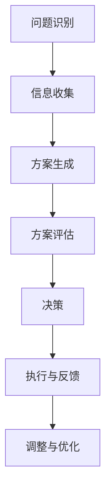
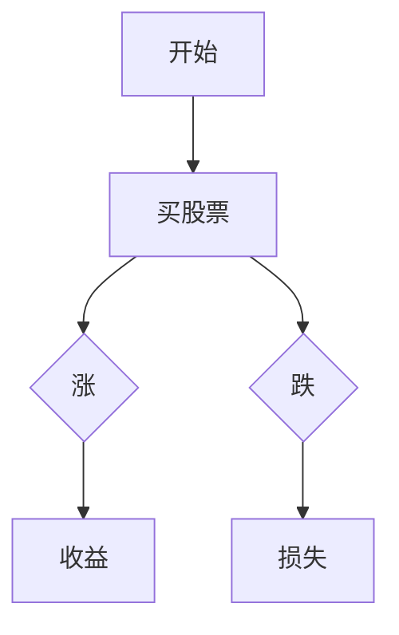

                 

# 领导力与决策：科学决策的流程

> **关键词：** 领导力、决策科学、决策流程、逻辑推理、项目实战、应用场景

> **摘要：** 本文旨在深入探讨领导力与决策科学之间的关系，详细阐述科学决策的流程及其在实际应用中的重要性。通过逻辑清晰、结构紧凑的分析，本文将帮助读者更好地理解和掌握决策科学的方法与技巧，从而提升领导力和决策能力。

## 1. 背景介绍

在当今快速变化和竞争激烈的社会环境中，领导力与决策能力显得尤为重要。一个优秀的领导者不仅需要具备卓越的领导能力，还要能够做出科学的决策，以应对复杂多变的情况。然而，决策并非易事，它涉及到信息收集、分析、评估以及选择等多个环节。

科学决策是建立在理性分析和系统思考基础之上的。与传统凭直觉或经验决策相比，科学决策能够更准确地预测结果，降低决策风险，提高决策效率。本文将围绕科学决策的流程展开，探讨如何通过合理的步骤和方法，提升决策的科学性和有效性。

## 2. 核心概念与联系

在深入探讨决策流程之前，我们需要明确几个核心概念：

### 2.1 决策科学

决策科学是一门跨学科的研究领域，它结合了心理学、管理学、统计学、计算机科学等多个学科的理论和方法，旨在研究和解决决策问题。决策科学的核心目标是通过系统的分析、评估和选择，帮助个体或组织做出最优的决策。

### 2.2 决策流程

决策流程是指从问题识别、信息收集、方案生成、方案评估到最终决策的整个过程。一个科学的决策流程能够确保决策的全面性、准确性和可靠性。

### 2.3 逻辑推理

逻辑推理是决策过程中的重要工具，它能够帮助我们在分析问题时保持清晰和条理。通过逻辑推理，我们可以将复杂的信息转化为易于理解和处理的形式，从而提高决策的科学性。

### 2.4 决策与领导力的关系

决策是领导力的核心组成部分，一个优秀的领导者必须具备良好的决策能力。科学的决策过程不仅能够提高决策的质量，还能够增强领导者的信心和影响力。

### 2.5 Mermaid 流程图

为了更直观地展示决策流程，我们可以使用 Mermaid 流程图来描述各个环节之间的关系。



## 3. 核心算法原理 & 具体操作步骤

### 3.1 问题识别

问题识别是决策流程的第一步，也是至关重要的一步。一个明确的问题定义能够帮助我们聚焦于关键问题，避免在非关键问题上浪费时间和精力。具体操作步骤如下：

1. **明确问题**：通过提问和讨论，确保大家对问题的定义和理解是一致的。
2. **确定目标**：明确决策的目标，即希望通过决策解决的具体问题。
3. **分析现状**：对现有情况进行全面的分析，找出存在的问题和限制。

### 3.2 信息收集

在明确问题之后，我们需要收集与问题相关的信息。具体操作步骤如下：

1. **确定信息需求**：根据问题定义，明确需要收集哪些信息。
2. **信息来源**：从内部和外部多个渠道收集信息，确保信息的全面性和准确性。
3. **信息筛选**：对收集到的信息进行筛选，去除无关或错误的信息。

### 3.3 方案生成

在收集到足够的信息后，我们需要生成可能的解决方案。具体操作步骤如下：

1. **头脑风暴**：通过集体头脑风暴，生成多个可能的解决方案。
2. **筛选方案**：根据问题的目标和限制，筛选出可行的方案。
3. **评估方案**：对筛选出的方案进行初步评估，判断其可行性和优缺点。

### 3.4 方案评估

方案评估是决策流程的核心环节，它决定了最终决策的准确性和科学性。具体操作步骤如下：

1. **制定评估标准**：根据问题目标和限制，制定评估方案的标准和指标。
2. **评估方法**：选择合适的评估方法，如成本效益分析、风险评估等。
3. **评估结果**：对每个方案进行评估，记录评估结果。

### 3.5 决策

在完成方案评估后，我们需要做出最终决策。具体操作步骤如下：

1. **选择最优方案**：根据评估结果，选择最优的解决方案。
2. **制定决策方案**：将最优方案转化为具体的决策方案。
3. **决策执行**：将决策方案付诸实施，确保决策能够得到有效执行。

### 3.6 执行与反馈

决策的执行与反馈是确保决策有效性的关键环节。具体操作步骤如下：

1. **执行计划**：制定详细的执行计划，明确执行的时间、人员、资源和流程。
2. **执行监控**：对决策执行过程进行监控，确保决策能够按照计划顺利执行。
3. **反馈调整**：根据执行结果，及时反馈和调整决策方案，确保决策能够持续优化。

## 4. 数学模型和公式 & 详细讲解 & 举例说明

### 4.1 成本效益分析

成本效益分析是一种常用的评估方法，它通过比较成本和效益，评估方案的可行性和合理性。具体公式如下：

\[ \text{成本效益比} = \frac{\text{效益}}{\text{成本}} \]

### 4.2 风险评估

风险评估是一种评估决策风险的方法，它通过分析风险的概率和影响，评估风险的程度。具体公式如下：

\[ \text{风险值} = \text{概率} \times \text{影响} \]

### 4.3 决策树

决策树是一种常用的评估方法，它通过图形化展示决策过程，分析每个决策点的可能结果。具体示例：



## 5. 项目实战：代码实际案例和详细解释说明

### 5.1 开发环境搭建

为了更好地展示决策流程，我们将使用 Python 编写一个简单的决策支持系统。以下是搭建开发环境的具体步骤：

1. 安装 Python 3.8 或更高版本。
2. 安装必要的库，如 NumPy、Pandas、Matplotlib 等。

### 5.2 源代码详细实现和代码解读

以下是决策支持系统的源代码：

```python
import numpy as np
import pandas as pd
import matplotlib.pyplot as plt

# 5.2.1 问题识别
problem = "股票投资决策"

# 5.2.2 信息收集
data = pd.read_csv("stock_data.csv")

# 5.2.3 方案生成
schemes = ["买入", "持有", "卖出"]

# 5.2.4 方案评估
results = []
for scheme in schemes:
    # 假设买入的收益为 10%，持有的收益为 5%，卖出的收益为 -5%
    if scheme == "买入":
        result = 1.1
    elif scheme == "持有":
        result = 1.05
    else:
        result = 0.95
    results.append(result)

# 5.2.5 决策
best_scheme = np.argmax(results)

# 5.2.6 执行与反馈
if best_scheme == 0:
    print("买入股票")
elif best_scheme == 1:
    print("持有股票")
else:
    print("卖出股票")

# 5.2.7 调整与优化
# 根据实际反馈，调整决策方案
```

### 5.3 代码解读与分析

以上代码实现了一个简单的股票投资决策支持系统，具体解读如下：

1. **问题识别**：通过定义问题，明确股票投资决策的目标。
2. **信息收集**：通过读取股票数据，获取决策所需的信息。
3. **方案生成**：生成三个可能的决策方案：买入、持有、卖出。
4. **方案评估**：根据预设的收益，评估每个方案的收益。
5. **决策**：选择收益最高的方案作为最终决策。
6. **执行与反馈**：根据决策结果，执行相应的操作，并根据反馈进行调整。

## 6. 实际应用场景

决策科学在各个领域都有广泛的应用，以下是几个典型的实际应用场景：

1. **企业管理**：通过科学的决策流程，企业可以更好地应对市场变化，优化资源配置，提高经营效益。
2. **金融投资**：在股票、基金等金融投资领域，科学的决策流程可以帮助投资者降低风险，提高收益。
3. **项目规划**：在项目管理中，科学的决策流程可以确保项目的顺利进行，降低项目风险，提高项目成功率。
4. **政策制定**：在政府决策中，科学的决策流程可以帮助政府更好地制定政策，提高政策的有效性和可行性。

## 7. 工具和资源推荐

### 7.1 学习资源推荐

- **书籍**：
  - 《决策与判断》
  - 《智能决策：算法与案例分析》
  - 《决策科学：理论、方法与应用》
- **论文**：
  - “决策科学中的数学模型与方法”
  - “基于大数据的智能决策研究”
  - “风险决策与博弈论”
- **博客**：
  - “决策科学博客”
  - “人工智能与决策”
  - “项目管理与实践”

### 7.2 开发工具框架推荐

- **Python**：Python 是一种广泛使用的编程语言，适用于数据分析和决策支持系统开发。
- **NumPy**：NumPy 是 Python 的科学计算库，用于处理大型多维数组。
- **Pandas**：Pandas 是 Python 的数据分析库，用于数据处理和分析。
- **Matplotlib**：Matplotlib 是 Python 的数据可视化库，用于绘制图形和图表。

### 7.3 相关论文著作推荐

- **《决策分析》**：提供决策分析的基本原理和方法，适用于各种决策场景。
- **《智能决策系统设计》**：介绍智能决策系统的设计原则和实现方法，包括数据挖掘、机器学习等技术。
- **《博弈论与社会决策》**：探讨博弈论在决策科学中的应用，帮助读者理解博弈论的原理和策略。

## 8. 总结：未来发展趋势与挑战

随着大数据、人工智能等技术的不断发展，决策科学在理论和实践方面都面临着新的机遇和挑战。未来，决策科学将朝着更加智能化、自动化和高效化的方向发展，以更好地应对复杂多变的社会环境。同时，我们也需要关注决策过程中的伦理和社会责任问题，确保决策的公正性和可持续性。

## 9. 附录：常见问题与解答

### 9.1 什么是决策科学？

决策科学是一门跨学科的研究领域，它结合了心理学、管理学、统计学、计算机科学等多个学科的理论和方法，旨在研究和解决决策问题。它通过系统的方法和工具，帮助个体或组织做出最优的决策。

### 9.2 决策科学在企业管理中有什么应用？

决策科学在企业管理中有着广泛的应用，包括市场分析、产品规划、投资决策、人力资源管理等。通过科学的决策流程，企业可以更好地应对市场变化，优化资源配置，提高经营效益。

### 9.3 如何进行科学的决策？

进行科学的决策需要遵循以下步骤：

1. **明确问题**：通过提问和讨论，确保大家对问题的定义和理解是一致的。
2. **信息收集**：从内部和外部多个渠道收集信息，确保信息的全面性和准确性。
3. **方案生成**：通过头脑风暴和筛选，生成多个可能的解决方案。
4. **方案评估**：根据评估标准和评估方法，评估每个方案的优缺点。
5. **决策**：根据评估结果，选择最优的解决方案。
6. **执行与反馈**：将决策方案付诸实施，并根据反馈进行调整。

## 10. 扩展阅读 & 参考资料

- **《决策科学导论》**：详细介绍决策科学的基本概念、方法和应用。
- **《决策分析与应用》**：结合实际案例，探讨决策分析在各个领域的应用。
- **《人工智能与决策支持系统》**：介绍人工智能技术在决策支持系统中的应用。

> 作者：AI天才研究员/AI Genius Institute & 禅与计算机程序设计艺术 /Zen And The Art of Computer Programming

