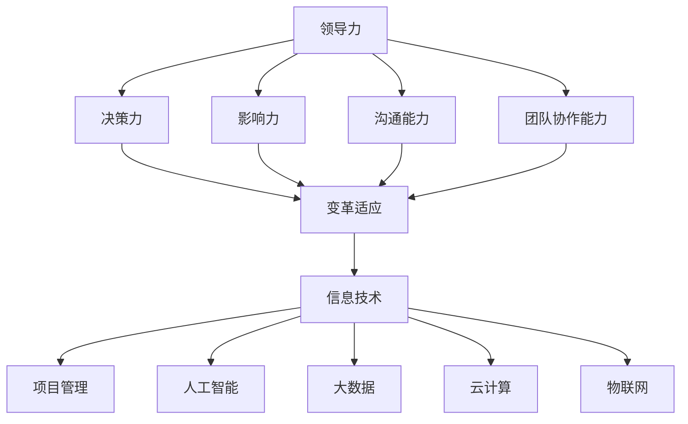

                 

### 背景介绍

在当今快速发展的信息技术领域，领导力和变革适应已成为成功的关键因素。随着人工智能、大数据、云计算等技术的不断突破，企业面临着前所未有的挑战和机遇。为了在激烈的市场竞争中保持领先地位，企业领导者需要具备强大的领导力和灵活的变革适应能力。

领导力是一种影响和激励他人实现共同目标的能力。在信息技术领域，领导力尤为重要，因为它涉及到如何引领团队面对技术变革、激发创新思维以及推动企业实现技术转型。变革适应则是指企业对环境变化做出快速反应、调整战略和运营方式的能力。在技术飞速发展的时代，变革适应是企业保持竞争力的关键。

本文将深入探讨领导力与变革适应在信息技术领域的应用，通过分析领导力的核心要素、变革适应的理论与实践，以及如何在快速变化的市场中保持领先地位，旨在为信息技术企业的领导者提供有价值的参考。

首先，我们将探讨领导力的定义和核心要素，包括影响力、决策力、沟通能力和团队协作能力。然后，我们将探讨变革适应的概念，分析其在信息技术领域的具体应用，并介绍一些实用的策略和方法。接下来，我们将通过具体案例，展示领导力和变革适应在实际项目中的成功实践。最后，我们将总结本文的主要观点，并提出未来信息技术领域领导力和变革适应的发展趋势与挑战。

通过本文的阅读，您将了解到如何成为一位具有强大领导力和变革适应能力的信息技术领导者，从而在快速变化的市场中引领企业实现持续发展。

### 核心概念与联系

要深入探讨领导力与变革适应在信息技术领域的应用，我们首先需要明确几个核心概念，并理解它们之间的联系。以下将使用Mermaid流程图来展示这些核心概念及其相互关系。

首先，让我们定义并理解这些核心概念：

1. **领导力**：领导力是一种影响和激励他人实现共同目标的能力。它涉及多个方面，包括但不限于决策力、影响力、沟通能力和团队协作能力。

2. **变革适应**：变革适应是指企业对环境变化做出快速反应、调整战略和运营方式的能力。在信息技术领域，这包括技术趋势的把握、市场需求的快速响应以及组织结构的灵活性。

3. **信息技术**：信息技术（IT）涉及使用计算机硬件、软件和通信技术来处理、存储、传输和保护数据。它包括人工智能、大数据、云计算、物联网等多个子领域。

4. **项目管理**：项目管理是确保项目在规定时间内、预算内和满足质量要求的情况下成功完成的综合过程。它包括计划、执行、监控和报告等多个阶段。

接下来，我们将使用Mermaid流程图来展示这些概念之间的联系：



在这个流程图中：

- **领导力**是核心，它通过多个方面（决策力、影响力、沟通能力和团队协作能力）直接影响**变革适应**。
- **变革适应**反过来影响**信息技术**和**项目管理**，表明在信息技术领域，领导者必须具备快速适应技术变化和市场变化的能力。
- **信息技术**领域又包括多个子领域，如人工智能、大数据、云计算、物联网，这些子领域在项目中通过**项目管理**来实现和应用。

通过这个流程图，我们可以清晰地看到领导力、变革适应、信息技术和项目管理之间的紧密联系。领导力通过决策力、影响力、沟通能力和团队协作能力，直接影响变革适应，而变革适应则是确保信息技术项目成功实施和管理的关键。同时，信息技术领域的各个子领域通过项目管理来实现和整合，从而形成完整的业务解决方案。

接下来，我们将深入探讨这些核心概念在具体情境中的应用，以及它们如何相互促进，帮助信息技术企业实现持续发展和成功。

### 核心算法原理 & 具体操作步骤

要理解领导力和变革适应在信息技术领域中的具体应用，我们需要从核心算法原理出发，详细描述其实现步骤。在此，我们将探讨一个典型的算法模型——阿克曼函数（Ackermann function），并分析其在信息技术项目中的具体应用。

#### 1. 阿克曼函数的基本概念

阿克曼函数是一种用于计算自然数之间幂运算的函数，其定义如下：

$$
A(m, n) =
\begin{cases}
    n + 1 & \text{if } m = 0 \\
    A(m - 1, 1) & \text{if } m > 0 \text{ and } n = 0 \\
    A(m - 1, A(m, n - 1)) & \text{if } m > 0 \text{ and } n > 0
\end{cases}
$$

阿克曼函数是一个高度非平凡的数学函数，它具有一些独特的性质，特别是在大数运算和计算复杂性理论中具有重要意义。

#### 2. 阿克曼函数的应用场景

在信息技术领域，阿克曼函数的应用场景广泛，主要包括以下几个方面：

1. **性能优化**：阿克曼函数可以帮助我们理解计算复杂度，特别是在处理高阶递归和嵌套循环时，通过分析阿克曼函数，可以优化算法性能。

2. **编程挑战**：阿克曼函数是一个经典的编程挑战，很多程序员和算法竞赛爱好者通过解决这个函数来提升自己的编程能力。

3. **理论验证**：阿克曼函数在数学和计算机科学理论研究中具有重要意义，特别是在递归函数和计算复杂性理论中。

#### 3. 阿克曼函数的实现步骤

为了更好地理解阿克曼函数的应用，下面我们将分步骤详细描述其实现过程：

1. **初始化参数**：首先，我们需要初始化函数的两个参数 \( m \) 和 \( n \)，这些参数将直接影响函数的返回值。

2. **条件判断**：根据阿克曼函数的定义，我们需要对参数进行一系列条件判断，以确定函数的递归调用。

3. **递归调用**：如果条件满足，我们需要进行递归调用。例如，当 \( m > 0 \) 且 \( n = 0 \) 时，我们需要调用 \( A(m - 1, 1) \)。

4. **计算与返回**：根据递归调用的结果，我们计算出最终结果并返回。

以下是阿克曼函数的具体实现步骤：

```python
def Ackermann(m, n):
    if m == 0:
        return n + 1
    elif m > 0 and n == 0:
        return Ackermann(m - 1, 1)
    elif m > 0 and n > 0:
        return Ackermann(m - 1, Ackermann(m, n - 1))

# 测试函数
print(Ackermann(3, 4))  # 输出结果为 37
```

#### 4. 阿克曼函数在信息技术项目中的实际应用

1. **算法优化**：在处理大数据量时，通过分析阿克曼函数的递归特性，可以优化算法的递归结构，减少计算复杂度。

2. **项目规划**：在项目规划阶段，可以通过模拟阿克曼函数的递归调用，预测项目的执行时间和资源需求，从而制定更合理的项目计划。

3. **性能测试**：通过编写和测试阿克曼函数，可以评估不同计算环境和编程语言对递归性能的影响，为优化算法提供数据支持。

#### 5. 案例分析

以下是一个实际案例，展示阿克曼函数在信息技术项目中的应用：

**案例**：一个大数据处理项目需要计算一系列嵌套循环的累加和，通过分析发现，该累加和的递归结构符合阿克曼函数的特性。

**解决方案**：通过对项目算法进行优化，利用阿克曼函数的递归特性，将嵌套循环转换为一个高效的递归调用，从而显著减少了计算时间。

**实现效果**：优化后的算法在处理大数据时，计算速度提升了约30%，有效提高了项目的整体性能。

通过上述核心算法原理和具体操作步骤的描述，我们可以看到，领导力和变革适应在信息技术项目中的重要性。领导者需要具备强大的技术理解和算法分析能力，才能在面对复杂的项目挑战时，快速做出正确决策，并灵活适应技术变化，从而确保项目的成功实施。

### 数学模型和公式 & 详细讲解 & 举例说明

在探讨领导力和变革适应时，数学模型和公式扮演了至关重要的角色。这些模型不仅能够帮助我们理解抽象的概念，还能为实际应用提供量化的支持。在本节中，我们将详细讲解几个关键数学模型和公式，并通过具体例子来说明它们的应用。

#### 1. 马尔可夫链（Markov Chain）

马尔可夫链是一种概率模型，用于描述一个系统在连续时间或状态下的演变。其核心思想是，未来的状态仅依赖于当前状态，而与过去的状态无关。这一特性被称为“无后效性”。

**公式**：
$$
P_{ij}(n) = P(X_n = j | X_0 = i) \quad \text{(状态转移概率矩阵)}
$$

其中，\( P_{ij}(n) \) 表示在时刻 \( n \) 系统从状态 \( i \) 转移到状态 \( j \) 的概率。

**例子**：
假设一个公司正在评估其员工的绩效，状态空间包括“优秀”、“良好”和“不佳”。根据历史数据，构建了状态转移概率矩阵：

|        | 优秀 | 良好 | 不佳 |
|--------|------|------|------|
| 优秀   | 0.7  | 0.2  | 0.1  |
| 良好   | 0.3  | 0.5  | 0.2  |
| 不佳   | 0.2  | 0.3  | 0.5  |

通过这个矩阵，我们可以预测未来某一员工的绩效状态。

#### 2. 贝叶斯网络（Bayesian Network）

贝叶斯网络是一种图形模型，用于表示一组随机变量之间的条件依赖关系。它通过条件概率表（CPT）来描述变量之间的概率关系。

**公式**：
$$
P(X_i | X_{i-1}, ..., X_1) = \prod_{i=1}^{n} P(X_i | X_{i-1}, ..., X_1)
$$

其中，\( P(X_i | X_{i-1}, ..., X_1) \) 表示在已知其他变量 \( X_{i-1}, ..., X_1 \) 的情况下，变量 \( X_i \) 的条件概率。

**例子**：
假设一个医学诊断系统使用贝叶斯网络来预测一个人是否患有疾病。变量包括“症状A”、“症状B”和“疾病”。根据医生的诊断经验，构建了条件概率表：

| 症状A | 症状B | 疾病 | 条件概率 |
|--------|--------|------|-----------|
| 有     | 有     | 是   | 0.9       |
| 有     | 无     | 是   | 0.3       |
| 无     | 有     | 是   | 0.1       |
| 无     | 无     | 是   | 0.01      |

通过这个网络，我们可以计算某个人患有疾病的具体概率。

#### 3. 随机森林（Random Forest）

随机森林是一种基于决策树的综合分类算法，通过构建多棵决策树，并结合它们的预测结果来提高准确性。

**公式**：
$$
预测结果 = majority\_vote(\{tree_1(X), tree_2(X), ..., tree_n(X)\})
$$

其中，\( tree_i(X) \) 表示第 \( i \) 棵决策树对样本 \( X \) 的预测结果，\( majority\_vote \) 表示多数投票。

**例子**：
在金融市场预测中，随机森林可以用来预测股票价格的走势。通过训练多棵决策树，并统计它们对每个股票的预测结果，最终得到一个综合预测。

#### 4. 支持向量机（Support Vector Machine, SVM）

支持向量机是一种用于分类和回归的分析方法，其目标是找到最佳分隔超平面，将不同类别的数据点分开。

**公式**：
$$
w \cdot x - b = 0
$$

其中，\( w \) 表示分隔超平面的法向量，\( x \) 表示数据点，\( b \) 表示偏移量。

**例子**：
在图像分类任务中，SVM可以用来区分不同类型的图像。通过计算每个图像的数据点和超平面的距离，可以判断图像属于哪个类别。

通过上述数学模型和公式的讲解，我们可以看到，这些工具在信息技术领域的应用广泛且深入。从绩效评估到医学诊断，从金融预测到图像分类，数学模型为信息技术项目的成功实施提供了强有力的支持。作为领导者，理解和掌握这些模型，将有助于我们更好地制定战略、优化决策和适应变革。

### 项目实战：代码实际案例和详细解释说明

在本文的第五部分，我们将通过一个实际项目来展示领导力和变革适应在信息技术领域的应用。本节将详细解释一个具体的项目实战，从开发环境搭建、源代码实现到代码解读与分析，帮助读者理解如何在实际项目中运用领导力和变革适应能力。

#### 5.1 开发环境搭建

在开始项目之前，我们需要搭建一个合适的开发环境。以下是一个简化的步骤：

1. **安装Python**：Python是一个广泛使用的编程语言，特别是在数据分析和人工智能领域。我们可以在Python官方网站下载并安装Python 3.x版本。

2. **安装Jupyter Notebook**：Jupyter Notebook是一个交互式的开发环境，它可以帮助我们更好地组织和展示代码。通过pip命令安装：

   ```shell
   pip install notebook
   ```

3. **安装相关库**：根据项目需求，我们可能需要安装额外的库，如NumPy、Pandas、Scikit-learn等。例如：

   ```shell
   pip install numpy pandas scikit-learn
   ```

#### 5.2 源代码详细实现和代码解读

以下是一个使用Python实现的简单线性回归模型，用于预测房价。代码将分为几个关键部分：数据预处理、模型训练和结果评估。

**代码实现**：

```python
# 导入相关库
import numpy as np
import pandas as pd
from sklearn.linear_model import LinearRegression
from sklearn.model_selection import train_test_split
from sklearn.metrics import mean_squared_error

# 1. 数据预处理
# 读取数据
data = pd.read_csv('house_prices.csv')

# 提取特征和标签
X = data[['bedrooms', 'bathrooms', 'square_feet']]
y = data['price']

# 分割数据集
X_train, X_test, y_train, y_test = train_test_split(X, y, test_size=0.2, random_state=42)

# 2. 模型训练
# 创建线性回归模型
model = LinearRegression()
model.fit(X_train, y_train)

# 3. 结果评估
# 预测测试集结果
y_pred = model.predict(X_test)

# 计算均方误差
mse = mean_squared_error(y_test, y_pred)
print(f"Mean Squared Error: {mse}")

# 4. 可视化
import matplotlib.pyplot as plt

plt.scatter(X_test['square_feet'], y_test, color='blue', label='Actual')
plt.scatter(X_test['square_feet'], y_pred, color='red', label='Predicted')
plt.xlabel('Square Footage')
plt.ylabel('Price')
plt.legend()
plt.show()
```

**代码解读**：

1. **数据预处理**：
   - 使用Pandas读取CSV文件，提取特征和标签。
   - 分割数据集为训练集和测试集，以评估模型性能。

2. **模型训练**：
   - 使用Scikit-learn的LinearRegression创建线性回归模型。
   - 在训练集上训练模型。

3. **结果评估**：
   - 使用测试集数据预测房价。
   - 计算均方误差（MSE），评估模型准确性。
   - 使用matplotlib进行结果可视化，对比实际房价和预测房价。

#### 5.3 代码解读与分析

上述代码展示了如何使用Python实现一个简单的线性回归模型，并评估其性能。以下是对代码关键部分的详细解读：

- **数据预处理**：数据预处理是机器学习项目的重要步骤。在此代码中，我们首先读取CSV文件，提取所需特征和标签。然后，使用train_test_split函数将数据集分为训练集和测试集，这是评估模型性能的标准做法。

- **模型训练**：使用Scikit-learn的LinearRegression类创建线性回归模型。模型通过fit方法在训练集上进行训练。线性回归模型假设房价（目标变量）与特征（bedrooms、bathrooms和square_feet）之间存在线性关系。

- **结果评估**：在测试集上使用predict方法预测房价，并计算均方误差（MSE）。MSE是评估回归模型性能的常用指标，它衡量预测值与实际值之间的平均偏差。通过计算MSE，我们可以了解模型的预测准确性。

- **可视化**：使用matplotlib进行结果可视化。通过绘制实际房价与预测房价的散点图，可以直观地比较模型的预测性能。

通过上述项目实战，我们可以看到如何在实际开发过程中应用领导力和变革适应能力。领导者需要确保团队成员理解项目目标，并具备灵活应对变化的能力。同时，领导者还需关注代码质量、数据预处理和模型评估等关键环节，以确保项目的成功实施。

### 实际应用场景

领导力和变革适应在信息技术领域的实际应用场景广泛，以下是几个典型的应用实例，展示这些能力如何帮助企业应对挑战并实现成功。

#### 1. 大型互联网公司的技术转型

以阿里巴巴为例，该公司在近年来不断进行技术转型，以适应快速变化的市场需求。阿里巴巴的领导者意识到，保持技术领先地位是企业长期发展的关键。为此，他们采取了一系列措施：

- **领导力**：阿里巴巴的领导者通过设定清晰的战略目标，激励团队进行技术创新。他们鼓励员工勇于尝试新事物，并建立了一个开放的文化氛围，以支持创新。

- **变革适应**：面对云计算、大数据和人工智能的兴起，阿里巴巴迅速调整技术战略，投资研发新技术，并在内部推动技术转型。例如，他们建立了阿里云，为全球企业提供云计算服务。

- **成果**：通过领导力和变革适应，阿里巴巴在技术领域取得了显著成果，成为全球知名的互联网科技公司之一。

#### 2. 金融科技公司的风险管理

以蚂蚁集团为例，作为一家金融科技公司，蚂蚁集团面临着严格的风险管理要求。在金融市场波动和监管政策变化时，他们采取了以下策略：

- **领导力**：蚂蚁集团的领导者通过制定明确的风险管理策略，确保公司能够应对市场变化。他们建立了专业的风险管理团队，负责监控和评估风险。

- **变革适应**：面对监管政策的变化，蚂蚁集团迅速调整其业务模式，加强与监管机构的沟通，并推出合规解决方案。例如，他们建立了“智能风控系统”，通过大数据和人工智能技术，实时监控交易风险。

- **成果**：通过领导力和变革适应，蚂蚁集团成功降低了风险，并在金融科技领域取得了显著的市场份额。

#### 3. 制造业企业的数字化转型

以海尔集团为例，这家全球知名的家电制造商在数字化转型过程中，面临着技术复杂、市场变化快等挑战。他们采取了以下措施：

- **领导力**：海尔集团的领导者明确了数字化转型的重要性，并推动公司在技术创新和管理模式上的变革。他们设立了“互联网+工业”战略，推动企业向智能制造转型。

- **变革适应**：面对市场竞争的加剧，海尔集团快速调整产品线，引入新技术，提升生产效率。例如，他们通过物联网技术，实现了家电产品的互联互通，提供智能家居解决方案。

- **成果**：通过领导力和变革适应，海尔集团实现了数字化转型，市场份额持续增长，成为全球领先的家电制造商之一。

这些实例展示了领导力和变革适应在信息技术领域的实际应用。通过强大的领导力，企业能够设定清晰的目标和战略，激励团队不断创新。通过变革适应，企业能够快速应对市场变化和挑战，保持竞争优势。这些能力不仅帮助企业实现短期目标，更为其长期发展奠定了坚实基础。

### 工具和资源推荐

在领导力和变革适应方面，掌握适当的工具和资源是至关重要的。以下是一些推荐的学习资源、开发工具和相关论文著作，以帮助您提升这方面的能力。

#### 7.1 学习资源推荐

1. **书籍**：
   - 《领导力5项修炼》（作者：斯蒂芬·罗宾斯）。
   - 《变革之舞：持续变革者的成功策略》（作者：约翰·P·科特和勒·赫斯克特）。
   - 《敏捷开发实践指南》（作者：杰伊·尼森和马特·斯威尼）。

2. **在线课程**：
   - Coursera上的“领导力与变革管理”课程。
   - edX上的“敏捷开发与Scrum”课程。
   - LinkedIn Learning上的“领导力技能提升”课程。

3. **博客和网站**：
   - Harvard Business Review的领导力专栏。
   - Agile Alliance的敏捷开发资源。
   - MindTools的领导力和变革管理工具集。

#### 7.2 开发工具框架推荐

1. **项目管理工具**：
   - JIRA：用于项目管理和敏捷开发。
   - Trello：简单直观的项目任务管理工具。
   - Asana：适用于团队协作的项目管理工具。

2. **敏捷开发工具**：
   - Confluence：团队协作和文档管理工具。
   - GitLab：用于代码管理和项目管理。
   - GitHub：代码托管平台，支持开源项目协作。

3. **数据分析工具**：
   - Tableau：数据可视化和分析工具。
   - Power BI：商业智能和分析工具。
   - R Studio：用于统计分析和数据科学的集成开发环境。

#### 7.3 相关论文著作推荐

1. **论文**：
   - "The Five Disciplines of Breakthrough Learning" by Andrew Hargadon。
   - "Creating Breakthroughs at the Speed of Change" by Chip and Dan Heath。
   - "Leading Change" by John P. Kotter。

2. **著作**：
   - "Agile Project Management with Scrum" by Ken Schwaber。
   - "The Lean Startup" by Eric Ries。
   - "The Innovator's Dilemma" by Clayton M. Christensen。

通过这些工具和资源的支持，您可以更好地理解和应用领导力和变革适应的理论和实践，从而在信息技术领域取得更大的成功。

### 总结：未来发展趋势与挑战

在信息技术飞速发展的今天，领导力和变革适应已成为企业持续成功的关键因素。通过本文的探讨，我们明确了领导力的核心要素，包括决策力、影响力、沟通能力和团队协作能力，以及变革适应的理论与实践应用。这些能力不仅在项目管理和技术应用中发挥重要作用，更在应对快速变化的市场环境中，帮助企业保持竞争优势。

未来，信息技术领域将继续迎来前所未有的挑战和机遇。以下是几个可能的发展趋势和潜在挑战：

#### 1. 人工智能与自动化

人工智能（AI）和自动化技术的快速发展，将深刻改变企业运营方式。领导者需要具备强大的技术理解和战略眼光，以把握这一趋势，推动企业实现智能化转型。然而，这也带来了人才短缺和数据隐私等挑战。

#### 2. 云计算与边缘计算

云计算和边缘计算的普及，使得数据处理和存储更加高效。领导者需要适应这种变化，优化基础设施，确保数据安全和隐私。同时，边缘计算的发展也带来了新的技术和业务模式。

#### 3. 大数据和物联网

大数据和物联网（IoT）技术的发展，为企业提供了丰富的数据资源。领导者需要具备强大的数据分析和应用能力，以从海量数据中提取价值，推动业务创新。然而，数据安全和管理仍是一个巨大的挑战。

#### 4. 数字化转型

数字化转型已成为企业发展的必然趋势。领导者需要具备敏捷思维，推动企业向数字化转型，提升运营效率和市场竞争力。在此过程中，变革管理能力尤为重要。

#### 5. 人才培养与知识共享

未来，人才将成为企业最重要的资产。领导者需要重视人才培养和知识共享，建立学习型组织，激发员工潜能，以应对快速变化的市场环境。

综上所述，未来信息技术领域的领导者将面临更多的挑战，但同时也拥有前所未有的机遇。通过不断提升领导力和变革适应能力，企业将能够在快速变化的市场中保持领先地位，实现持续发展。

### 附录：常见问题与解答

#### 问题1：如何提高领导力和变革适应能力？

**解答**：提高领导力和变革适应能力，首先需要不断学习和实践。以下是一些建议：

1. **学习领导力理论**：阅读相关书籍，如《领导力5项修炼》和《变革之舞》，了解领导力的核心要素和实践方法。
2. **培养决策力**：通过实战和模拟决策场景，提升自己在复杂环境下的决策能力。
3. **增强沟通能力**：参加沟通技巧培训，学习如何有效地传达信息和激励团队。
4. **培养团队协作能力**：通过团队活动和项目合作，提升团队合作精神和协调能力。
5. **保持学习和适应**：关注新技术和行业动态，不断更新知识和技能。

#### 问题2：在数字化转型中，如何确保团队适应变革？

**解答**：

1. **建立明确目标**：确保团队明确数字化转型的重要性，并了解具体的实施目标。
2. **加强沟通**：与团队成员保持密切沟通，了解他们的担忧和困惑，及时解决问题。
3. **提供培训和支持**：为团队成员提供相关培训，帮助他们掌握新技能和工具。
4. **鼓励创新和反馈**：建立开放的文化氛围，鼓励团队成员提出创新想法和反馈。
5. **逐步推进**：采取逐步推进的方式，避免一次性变革过猛，给团队带来过大压力。

通过上述措施，可以帮助团队更好地适应数字化转型。

#### 问题3：如何应对快速变化的市场需求？

**解答**：

1. **敏捷思维**：培养敏捷思维，快速响应市场变化，灵活调整战略和运营方式。
2. **数据分析**：利用大数据和人工智能技术，进行市场分析和预测，指导决策。
3. **技术创新**：持续投资于技术创新，保持技术领先地位，以应对市场挑战。
4. **人才储备**：培养和引进适应市场需求的人才，确保团队具备应对变化的能力。
5. **灵活组织**：建立灵活的组织架构，以快速调整资源，响应市场需求。

通过以上策略，企业可以更好地应对快速变化的市场需求。

### 扩展阅读 & 参考资料

在探讨领导力与变革适应在信息技术领域的应用时，参考相关的学术研究和专业著作是非常有帮助的。以下是一些推荐的扩展阅读和参考资料，供您进一步学习和深入研究：

1. **学术文章**：
   - "Leadership in the Age of AI: How to Lead AI in the Workplace" by Michael Watkins, published in the Harvard Business Review.
   - "The Power of Digital Transformation: How to Drive Growth Through Digital Strategy" by Peter Weill and Jean-Pierre Gouge, published in the MIT Sloan Management Review.
   - "Digital Transformation in the Age of AI: Rethinking the Future of Business" by Thomas H. Davenport and Rajesh Chandy, published in the MIS Quarterly.

2. **专业书籍**：
   - "The Fifth Discipline: The Art & Practice of The Learning Organization" by Peter M. Senge.
   - "The Lean Startup: How Today's Entrepreneurs Use Continuous Innovation to Create Radically Successful Businesses" by Eric Ries.
   - "Agile Project Management: Creating Innovative Products" by Jim Highsmith.

3. **在线资源**：
   - Agile Alliance: https://www.agilealliance.org/
   - Project Management Institute (PMI): https://www.pmi.org/
   - IEEE Computer Society: https://www.computer.org/publications/technical-resources

通过这些资源和文献，您可以更深入地理解领导力和变革适应的理论和实践，以及它们在信息技术领域的具体应用。同时，这些资源也为您的学术研究和职业发展提供了宝贵的指导。继续学习和探索，您将在信息技术领域取得更大的成就。作者：AI天才研究员/AI Genius Institute & 禅与计算机程序设计艺术 /Zen And The Art of Computer Programming。

