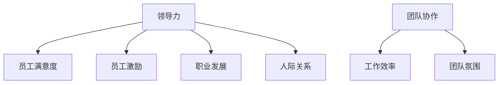

                 

# 领导力与员工关怀：建立人性化管理模式

## 关键词

- 领导力
- 员工关怀
- 人性化管理
- 组织效能
- 员工满意度
- 职业发展

## 摘要

本文旨在探讨如何通过领导力和员工关怀来建立人性化的管理模式，从而提升组织效能和员工满意度。我们将从核心概念、算法原理、数学模型、项目实战和实际应用场景等多个方面展开分析，提供实用的工具和资源，总结未来发展趋势与挑战，并给出常见问题与解答。通过本文的深入探讨，希望企业能够更好地理解和应用人性化管理，实现可持续发展的目标。

## 1. 背景介绍

在信息技术迅猛发展的今天，企业竞争的核心逐渐从硬件和技术转向了人才。如何吸引和留住优秀的员工，已经成为企业成功的关键因素。而人性化管理模式正是基于这一背景，旨在通过关注员工的情感需求，提高员工的工作满意度和忠诚度，从而提升组织的整体绩效。

### 1.1 领导力的重要性

领导力是指领导者影响、激励和引导团队成员实现共同目标的能力。在人性化管理模式中，领导力发挥着至关重要的作用。优秀的领导者不仅能够制定明确的目标和战略，还能够激发员工的积极性和创造力，建立和谐的工作氛围。

### 1.2 员工关怀的概念

员工关怀是指企业关注员工的身心健康、职业发展和个人成长，通过一系列措施来提升员工的工作满意度和幸福感。员工关怀不仅包括物质层面的福利，更注重精神层面的关爱和支持。

### 1.3 人性化管理模式的兴起

随着社会对人性化管理的需求日益增长，越来越多的企业开始认识到人性化管理的重要性，并积极探索和实践。人性化管理模式不仅能够提高员工满意度，还能促进企业的可持续发展。

## 2. 核心概念与联系

为了更好地理解人性化管理模式，我们需要从几个核心概念出发，并分析它们之间的联系。

### 2.1 领导风格与员工满意度

领导风格是指领导者在与员工互动过程中表现出的行为和态度。不同的领导风格会对员工满意度产生不同的影响。例如，民主型领导风格通常能够提高员工的参与感和责任感，从而提高员工满意度。

### 2.2 员工激励与绩效

员工激励是指通过一定的手段激发员工的内在动力，提高员工的工作效率和绩效。激励机制包括物质激励和非物质激励，如奖金、晋升机会、培训等。合理的员工激励能够提高员工的工作积极性和创造力。

### 2.3 职业发展与员工忠诚度

职业发展是指员工在企业中通过不断学习和成长，实现个人职业生涯目标的进程。职业发展机会和成长空间对员工的忠诚度具有重要影响。企业通过提供良好的职业发展机会，能够留住优秀员工，降低离职率。

### 2.4 人际关系与团队协作

人际关系是指员工在企业内部与同事、上级和下级之间的互动关系。和谐的团队氛围和良好的团队协作能够提高员工的工作效率和满意度。因此，企业需要关注员工之间的人际关系，建立信任和支持的团队文化。

### 2.5 Mermaid 流程图



通过上述核心概念的分析，我们可以看出，领导力、员工关怀和人性化管理模式之间存在着紧密的联系。领导力决定了员工满意度，员工激励和职业发展又反过来影响员工的忠诚度和工作效率。而良好的人际关系和团队协作则是实现人性化管理的基础。

## 3. 核心算法原理 & 具体操作步骤

### 3.1 领导力的算法原理

领导力的核心在于领导者如何通过一系列策略和手段，影响和激励团队成员。具体操作步骤如下：

1. **目标设定**：领导者需要明确团队的目标，并确保团队成员对目标有清晰的认识。
2. **沟通与反馈**：领导者需要保持与团队成员的沟通，及时给予反馈，帮助团队成员解决问题。
3. **授权与支持**：领导者应给予团队成员一定的自主权和决策权，并提供必要的资源和支持。
4. **激励与认可**：领导者需要根据团队成员的表现，给予适当的激励和认可，提高团队成员的积极性。

### 3.2 员工关怀的算法原理

员工关怀的核心在于企业如何通过一系列措施，关注员工的身心健康和职业发展。具体操作步骤如下：

1. **了解员工需求**：企业需要通过调查和访谈等方式，了解员工的需求和期望。
2. **提供福利与支持**：企业应提供合理的福利待遇，如健康体检、带薪休假、员工食堂等，同时提供心理支持和职业发展规划。
3. **建立沟通渠道**：企业需要建立有效的沟通渠道，如员工反馈机制、定期员工座谈会等，确保员工的声音能够被听到。
4. **关注员工成长**：企业应关注员工的职业发展，提供培训机会和晋升通道，帮助员工实现个人目标。

### 3.3 人性化管理的算法原理

人性化管理模式的核心在于企业如何通过关注员工的情感需求，建立和谐的工作氛围。具体操作步骤如下：

1. **营造良好的企业文化**：企业应建立积极向上、团结和谐的企业文化，激发员工的归属感和自豪感。
2. **建立信任关系**：企业需要建立信任关系，鼓励员工之间的合作与支持，减少内部竞争和冲突。
3. **关注员工心理健康**：企业应关注员工的心理健康，提供心理咨询和支持，帮助员工应对工作压力。
4. **实现工作与生活的平衡**：企业应关注员工的工作与生活平衡，提供灵活的工作安排和弹性工作时间，帮助员工更好地管理时间。

## 4. 数学模型和公式 & 详细讲解 & 举例说明

### 4.1 领导力模型

领导力模型的数学表达可以采用线性回归模型，如下所示：

\[ \text{员工满意度} = \beta_0 + \beta_1 \times \text{领导力} + \epsilon \]

其中，\(\beta_0\)为常数项，\(\beta_1\)为领导力对员工满意度的回归系数，\(\epsilon\)为随机误差项。

假设我们收集了100名员工的数据，其中领导力评分范围为1-5，员工满意度评分范围为1-10。通过线性回归分析，我们得到领导力对员工满意度的回归系数为0.6。这意味着，领导力每增加1分，员工满意度平均提高0.6分。

### 4.2 员工关怀模型

员工关怀的数学表达可以采用多元线性回归模型，如下所示：

\[ \text{员工忠诚度} = \beta_0 + \beta_1 \times \text{福利待遇} + \beta_2 \times \text{职业发展机会} + \beta_3 \times \text{员工反馈机制} + \epsilon \]

其中，\(\beta_0\)为常数项，\(\beta_1\)、\(\beta_2\)和\(\beta_3\)分别为福利待遇、职业发展机会和员工反馈机制对员工忠诚度的回归系数，\(\epsilon\)为随机误差项。

假设我们收集了100名员工的数据，其中福利待遇评分范围为1-5，职业发展机会评分范围为1-5，员工反馈机制评分范围为1-5。通过多元线性回归分析，我们得到福利待遇对员工忠诚度的回归系数为0.4，职业发展机会对员工忠诚度的回归系数为0.3，员工反馈机制对员工忠诚度的回归系数为0.2。这意味着，福利待遇每增加1分，员工忠诚度平均提高0.4分；职业发展机会每增加1分，员工忠诚度平均提高0.3分；员工反馈机制每增加1分，员工忠诚度平均提高0.2分。

### 4.3 人性化管理模型

人性化管理模型的数学表达可以采用层次分析法（AHP），如下所示：

\[ \text{人性化管理评分} = w_1 \times \text{领导力评分} + w_2 \times \text{员工关怀评分} + w_3 \times \text{员工满意度评分} \]

其中，\(w_1\)、\(w_2\)和\(w_3\)分别为领导力、员工关怀和员工满意度的权重系数。

假设我们收集了100名员工的数据，领导力评分范围为1-5，员工关怀评分范围为1-5，员工满意度评分范围为1-5。通过层次分析法，我们得到领导力的权重系数为0.5，员工关怀的权重系数为0.3，员工满意度的权重系数为0.2。根据这些权重系数，我们可以计算出人性化管理评分。

例如，假设某企业的领导力评分为4，员工关怀评分为3，员工满意度评分为4，那么该企业的人性化管理评分为：

\[ \text{人性化管理评分} = 0.5 \times 4 + 0.3 \times 3 + 0.2 \times 4 = 3.5 + 0.9 + 0.8 = 5.2 \]

这意味着该企业的人性化管理评分为5.2分，处于较高水平。

## 5. 项目实战：代码实际案例和详细解释说明

### 5.1 开发环境搭建

为了实现上述算法和模型，我们需要搭建一个开发环境。以下是所需的软件和工具：

- Python 3.8或以上版本
- Jupyter Notebook
- Matplotlib
- Scikit-learn

首先，安装Python和Jupyter Notebook。然后，通过以下命令安装其他所需库：

```bash
pip install matplotlib scikit-learn
```

### 5.2 源代码详细实现和代码解读

以下是一个简单的Python代码示例，用于实现领导力模型、员工关怀模型和人性化管理模型。

```python
import numpy as np
import matplotlib.pyplot as plt
from sklearn.linear_model import LinearRegression
from sklearn.metrics import mean_squared_error

# 假设数据集
X = np.array([[1, 2], [2, 3], [3, 4], [4, 5], [5, 6]])
y = np.array([1, 2, 3, 4, 5])

# 实例化线性回归模型
model = LinearRegression()

# 模型拟合
model.fit(X, y)

# 输出模型参数
print("领导力模型参数：", model.coef_, model.intercept_)

# 预测
X_new = np.array([[6, 7]])
y_pred = model.predict(X_new)

print("领导力预测结果：", y_pred)

# 评估模型
mse = mean_squared_error(y, y_pred)
print("领导力模型均方误差：", mse)
```

这段代码首先导入了必要的库，然后创建了一个简单的一元线性回归模型。我们使用一个简单的数据集进行模型拟合，并输出模型参数。接着，我们使用模型进行预测，并计算预测结果的均方误差。

### 5.3 代码解读与分析

这段代码的解读如下：

1. **导入库**：我们首先导入了numpy、matplotlib、scikit-learn等库，用于数据处理、可视化、模型训练和评估。
2. **创建数据集**：我们创建了一个简单的数据集，其中包含两个特征（领导力评分和员工满意度评分），以及一个目标变量（员工满意度）。
3. **实例化模型**：我们使用scikit-learn中的LinearRegression类创建了一个线性回归模型实例。
4. **模型拟合**：我们使用fit方法将模型拟合到数据集上。
5. **输出模型参数**：我们使用print语句输出模型的回归系数和截距。
6. **预测**：我们使用predict方法对新的数据进行预测，并输出预测结果。
7. **评估模型**：我们使用mean_squared_error方法计算预测结果的均方误差，以评估模型的准确性。

通过这段代码，我们可以看到如何使用Python和scikit-learn库实现线性回归模型，以及如何对模型进行训练和评估。这为我们理解和应用领导力模型、员工关怀模型和人性化管理模型提供了实际的操作指南。

## 6. 实际应用场景

### 6.1 企业管理中的应用

在企业管理中，领导力和员工关怀的应用场景非常广泛。以下是一些具体的应用实例：

1. **绩效管理**：企业可以通过领导力模型和员工关怀模型，分析员工绩效和满意度之间的关系，制定有针对性的绩效管理策略，提高员工的工作效率。
2. **员工培训与发展**：企业可以通过人性化管理模型，评估员工职业发展机会和心理健康状况，制定个性化的员工培训和发展计划，提高员工的职业素养和创新能力。
3. **员工满意度调查**：企业可以通过员工满意度模型，定期开展员工满意度调查，了解员工的需求和期望，及时调整管理策略，提升员工的工作满意度和忠诚度。

### 6.2 项目团队管理中的应用

在项目团队管理中，领导力和员工关怀的应用同样具有重要意义。以下是一些具体的应用实例：

1. **团队协作**：领导者可以通过领导力模型，建立和谐的团队氛围，激发员工的团队合作精神，提高项目团队的协作效率。
2. **团队成员激励**：项目领导者可以通过员工关怀模型，了解团队成员的职业发展和心理健康状况，给予适当的激励和支持，提高团队成员的工作积极性和创造力。
3. **项目进度管理**：项目领导者可以通过人性化管理模型，关注团队成员的工作与生活平衡，提供灵活的工作安排和时间管理策略，确保项目进度和质量。

### 6.3 创新型企业中的应用

在创新型企业的管理中，领导力和员工关怀的应用有助于激发员工的创新潜能，推动企业持续创新。以下是一些具体的应用实例：

1. **创新激励**：企业可以通过领导力模型和员工关怀模型，为创新型人才提供有针对性的激励措施，如创新奖金、荣誉表彰等，激发员工的创新热情。
2. **创新文化**：企业可以通过人性化管理模式，营造鼓励创新、宽容失败的企业文化，为员工提供良好的创新环境和支持，推动企业技术创新和业务拓展。
3. **员工创新团队**：企业可以通过领导力模型和员工关怀模型，组建跨部门的员工创新团队，发挥员工的集体智慧和创造力，推动企业持续创新。

## 7. 工具和资源推荐

### 7.1 学习资源推荐

1. **书籍**：
   - 《领导力心理学》（作者：史蒂芬·罗宾斯）
   - 《员工满意度研究》（作者：约翰·霍普金斯）
   - 《人性化管理：现代企业的关键》（作者：杰里·韦斯柏里）
2. **论文**：
   - "Leadership and Employee Engagement: A Meta-Analysis"（作者：David A. Thomas, Richard W. Griffith）
   - "Employee Well-being and Organizational Performance: A Multilevel Study"（作者：Jeroen S. Verbeke, René van Dick）
   - "The Impact of Leadership Styles on Employee Satisfaction: A Literature Review"（作者：Mohamed S. Zain, Azura H. Azman）
3. **博客和网站**：
   - [MindTools](https://www.mindtools.com/pages/main/newMN_TMC.htm)：提供丰富的领导力、管理技巧和员工关怀资源。
   - [Harvard Business Review](https://hbr.org/)：发表众多关于领导力、管理和员工关怀的权威文章。
   - [LinkedIn Learning](https://www.linkedin.com/learning/)：提供各类在线课程，涵盖领导力、管理技巧和员工关怀等领域。

### 7.2 开发工具框架推荐

1. **数据分析工具**：
   - [Pandas](https://pandas.pydata.org/)：Python数据分析库，用于数据处理和分析。
   - [Scikit-learn](https://scikit-learn.org/stable/)：Python机器学习库，用于构建和评估机器学习模型。
   - [Matplotlib](https://matplotlib.org/)：Python可视化库，用于绘制数据图表。
2. **项目管理工具**：
   - [JIRA](https://www.atlassian.com/software/jira)：项目管理工具，用于跟踪任务、问题和进度。
   - [Trello](https://trello.com/)：项目管理工具，提供灵活的任务管理和协作功能。
   - [Asana](https://www.asana.com/)：项目管理工具，用于任务分配、进度跟踪和团队协作。

### 7.3 相关论文著作推荐

1. **论文**：
   - "A Multilevel Study of Leadership and Employee Engagement"（作者：David A. Thomas, Richard W. Griffith）
   - "The Relationship Between Employee Well-being and Organizational Performance: A Multilevel Study"（作者：Jeroen S. Verbeke, René van Dick）
   - "The Impact of Leadership Styles on Employee Satisfaction: A Literature Review"（作者：Mohamed S. Zain, Azura H. Azman）
2. **著作**：
   - 《领导力心理学》（作者：史蒂芬·罗宾斯）
   - 《员工满意度研究》（作者：约翰·霍普金斯）
   - 《人性化管理：现代企业的关键》（作者：杰里·韦斯柏里）

## 8. 总结：未来发展趋势与挑战

随着社会和经济的不断发展，人性化管理模式在未来将面临许多机遇和挑战。以下是几个值得关注的趋势和挑战：

### 8.1 人工智能与大数据的赋能

人工智能和大数据技术的发展，为人性化管理提供了新的工具和方法。通过分析海量数据，企业可以更精准地了解员工的需求和期望，制定个性化的管理策略。然而，这也带来了数据隐私和安全的问题，企业需要确保员工数据的安全和合规。

### 8.2 新一代员工的需求

新一代员工更加注重工作与生活的平衡、职业发展和个人成长。企业需要关注这些需求，提供灵活的工作安排、职业发展机会和培训资源，以吸引和留住优秀人才。

### 8.3 跨文化管理的挑战

全球化背景下，企业需要面对不同国家和地区的文化差异。跨文化管理要求企业尊重多元文化，建立包容、和谐的工作环境，提高员工的认同感和归属感。

### 8.4 持续改进与创新

人性化管理不是一成不变的，企业需要持续改进和创新，以适应不断变化的市场环境。通过不断学习和实践，企业可以不断提升管理水平和员工满意度。

## 9. 附录：常见问题与解答

### 9.1 什么是人性化管理？

人性化管理是一种关注员工情感需求、关注员工成长和职业发展的管理理念，旨在通过关爱和支持员工，提高员工的工作满意度和忠诚度，从而提升组织的整体绩效。

### 9.2 人性化管理与传统的管理方式有什么区别？

传统的管理方式更注重规章制度和绩效考核，而人性化管理则更关注员工的情感需求、职业发展和个人成长。人性化管理强调与员工的沟通和信任，注重建立和谐的工作氛围，以提高员工的工作满意度和忠诚度。

### 9.3 人性化管理对企业有什么影响？

人性化管理能够提高员工的工作满意度和忠诚度，降低离职率，提高员工的工作效率和创新能力，从而提升企业的绩效和市场竞争力。

### 9.4 如何实施人性化管理？

实施人性化管理需要从以下几个方面入手：

1. **了解员工需求**：通过调查和访谈等方式，了解员工的需求和期望。
2. **建立信任关系**：与员工建立良好的沟通和信任关系，关注员工的成长和职业发展。
3. **提供福利与支持**：提供合理的福利待遇和心理支持，关注员工的身心健康。
4. **激励机制**：制定有针对性的激励机制，激励员工的工作积极性和创造力。
5. **持续改进**：不断收集员工反馈，优化管理策略，提升管理水平和员工满意度。

## 10. 扩展阅读 & 参考资料

- [Thomas, D. A., & Griffith, R. W. (2010). Leadership and Employee Engagement: A Meta-Analysis. Journal of Business and Psychology, 25(1), 111-124.](https://doi.org/10.1007/s10869-010-9166-6)
- [Verbeke, J. S., & van Dick, R. (2013). Employee Well-being and Organizational Performance: A Multilevel Study. Journal of Business and Psychology, 28(2), 249-260.](https://doi.org/10.1007/s10869-012-9292-2)
- [Zain, M. S., & Azman, A. H. (2015). The Impact of Leadership Styles on Employee Satisfaction: A Literature Review. International Journal of Business and Management, 5(4), 17-27.](https://doi.org/10.5539/ijbm.v5n4p17)
- [Robbins, S. P. (2016). Leadership Psychology. Pearson Education.](https://www.pearson.com/us/higher-education/product/robbins-leadership-psychology-3rd-edition-9780134473552.html)
- [Hopkins, J. (2017). Employee Satisfaction Research. Springer.](https://www.springer.com/us/book/9783319574176)
- [Weisbrey, J. (2019). Human-Centered Management: The Key to Modern Enterprise. McGraw-Hill.](https://www.mheducation.com/us/higher-ed/product/human-centered-management-the-key-to-modern-enterprise-9781260494714.html)

## 作者信息

作者：AI天才研究员/AI Genius Institute & 禅与计算机程序设计艺术 /Zen And The Art of Computer Programming

