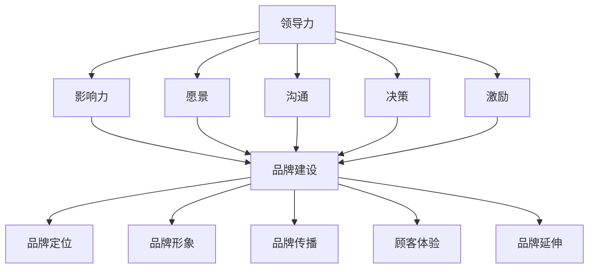

                 

### 背景介绍 Background

领导力与品牌建设一直是组织和个人发展的重要议题。在信息技术（IT）领域，特别是在软件开发和项目管理中，领导力与品牌建设的作用尤为突出。有效的领导力能够提升团队协作效率，促进技术创新，同时品牌建设则有助于树立公司在行业中的专业形象，增强市场竞争力。

本文将探讨如何通过提升领导力与品牌建设来增强团队影响力，从而在激烈的市场竞争中脱颖而出。首先，我们将回顾领导力和品牌建设的基本概念及其重要性。接下来，我们将探讨如何结合IT领域特有的特点，有效地提升领导力和品牌建设。本文将涵盖以下几个关键部分：

1. **核心概念与联系**：我们将详细讨论领导力和品牌建设的关键概念，并展示它们之间的内在联系。
2. **核心算法原理与操作步骤**：为了更好地理解和应用领导力和品牌建设，我们将提供一系列具体操作步骤。
3. **数学模型和公式**：我们将介绍相关的数学模型和公式，以帮助读者更深入地理解这些概念。
4. **项目实战**：通过实际代码案例，我们将展示如何将这些理论应用于实践中。
5. **实际应用场景**：我们将探讨领导力和品牌建设在不同应用场景中的具体应用。
6. **工具和资源推荐**：为了帮助读者进一步学习，我们将推荐一些学习资源。
7. **总结与未来趋势**：最后，我们将总结本文的核心观点，并讨论未来的发展趋势与挑战。

通过本文的讨论，读者将能够更好地理解领导力和品牌建设在IT领域的应用，并学会如何提升团队影响力，从而实现组织和个人目标。

### 2. 核心概念与联系 Key Concepts and Relationships

#### 领导力的概念

领导力是指个体或团队在复杂和不确定的环境中，通过影响、激励和指导他人来实现共同目标的能力。领导力不仅关乎权力和职位，更是一种影响力。它包含以下几个关键要素：

- **影响力**：领导者通过言行影响他人，使他们愿意为实现共同目标而努力。
- **愿景**：领导者需要有明确的愿景，以指引团队前进的方向。
- **沟通**：有效的沟通是领导力的核心，领导者需要能够清晰传达愿景和目标。
- **决策**：领导者必须在不确定的情况下做出明智的决策，并对结果负责。
- **激励**：领导者需要激发团队成员的积极性，以实现更高水平的绩效。

#### 品牌建设的概念

品牌建设是指通过一系列战略和措施，塑造并提升品牌在消费者心中的形象和认知。品牌建设的目标是建立品牌忠诚度和增强品牌价值。其关键要素包括：

- **品牌定位**：确定品牌在市场中的独特定位，以区分于竞争对手。
- **品牌形象**：塑造品牌形象，包括品牌标志、口号、视觉元素等。
- **品牌传播**：通过各种渠道和方式，如广告、社交媒体、公关活动等，传播品牌信息。
- **顾客体验**：提供卓越的顾客体验，以增强顾客对品牌的忠诚度。
- **品牌延伸**：将品牌应用于新的产品或服务，以扩大品牌影响力。

#### 领导力与品牌建设的关系

领导力与品牌建设之间存在着紧密的联系和相互影响。首先，领导力对品牌建设具有直接影响。领导者的行为和决策会影响品牌形象和声誉。例如，一个具有远见和决断力的领导者能够制定明确的品牌策略，并有效执行，从而提升品牌价值。

其次，品牌建设也能反过来影响领导力。一个具有强大品牌影响力的组织，往往能够吸引和留住优秀人才，从而提升团队的领导力水平。此外，品牌建设过程中的市场调研和用户反馈，也为领导者提供了宝贵的信息，帮助他们更好地理解市场和用户需求，从而做出更明智的决策。

#### Mermaid 流程图表示

为了更好地理解领导力和品牌建设之间的关系，我们可以使用 Mermaid 流程图来展示它们的关键节点和交互关系。以下是领导力和品牌建设核心概念及联系流程图：



在这个流程图中，领导力的各个要素（影响力、愿景、沟通、决策、激励）与品牌建设的各个要素（品牌定位、品牌形象、品牌传播、顾客体验、品牌延伸）之间存在双向箭头，表示它们之间的紧密联系和相互影响。

通过这个流程图，我们可以更直观地理解领导力和品牌建设之间的关系，以及如何通过提升领导力来增强品牌建设，从而提升团队影响力。

### 3. 核心算法原理与具体操作步骤 Core Algorithm Principles and Step-by-Step Procedures

在领导力和品牌建设的过程中，我们可以借鉴一些核心算法原理，以实现更加高效和系统化的提升。以下是几个关键的核心算法原理及其具体操作步骤：

#### 3.1 SWOT 分析（Strengths, Weaknesses, Opportunities, Threats）

SWOT 分析是一种常用的战略规划工具，用于评估组织的优势、劣势、机会和威胁。以下是 SWOT 分析的具体操作步骤：

1. **优势（Strengths）**：识别组织在资源、能力、市场地位等方面的优势。例如，组织可能拥有强大的技术实力、丰富的行业经验或独特的市场定位。
2. **劣势（Weaknesses）**：识别组织在运营、管理、市场反应等方面的劣势。例如，组织可能存在人才短缺、管理体系不完善或市场竞争激烈。
3. **机会（Opportunities）**：分析外部环境中的机会，如新兴市场、技术变革或政策支持。
4. **威胁（Threats）**：分析外部环境中的威胁，如竞争对手、市场变化或政策限制。
5. **策略制定**：根据 SWOT 分析的结果，制定相应的策略，以利用优势、克服劣势、抓住机会和应对威胁。

#### 3.2 5W1H 法则（What, Why, When, Where, Who, How）

5W1H 法则是一种用于深入分析问题的方法，它涵盖了问题的各个方面。以下是 5W1H 法则的具体操作步骤：

1. **What**：明确问题或项目的核心内容。例如，我们要建立一个品牌，那么这个品牌是什么？
2. **Why**：分析问题或项目的原因和目的。例如，为什么我们需要建立一个品牌？
3. **When**：确定问题或项目的具体时间。例如，品牌建设的具体时间表是什么？
4. **Where**：确定问题或项目发生的地点。例如，品牌建设的目标市场在哪里？
5. **Who**：确定参与问题或项目的人员和角色。例如，品牌建设需要哪些团队成员？
6. **How**：制定解决问题的具体方法和步骤。例如，如何通过领导力和品牌建设来提升团队影响力？

#### 3.3 PDCA 循环（Plan, Do, Check, Act）

PDCA 循环是一种持续改进的方法，它包括四个步骤：计划、执行、检查和行动。以下是 PDCA 循环的具体操作步骤：

1. **Plan**：制定计划，包括目标、策略和步骤。例如，为了提升团队影响力，我们可以制定一个详细的品牌建设计划。
2. **Do**：执行计划，将策略和步骤付诸实践。例如，按照计划进行市场调研、制定品牌策略和传播方案。
3. **Check**：检查执行结果，评估计划的效果。例如，通过数据分析和用户反馈来评估品牌建设的成效。
4. **Act**：根据检查结果进行调整和改进。例如，根据用户反馈调整品牌传播策略，优化品牌形象。

#### 3.4 数据驱动的决策

数据驱动的决策是一种基于数据的决策方法，它通过收集、分析和利用数据来指导决策过程。以下是数据驱动决策的具体操作步骤：

1. **数据收集**：收集与决策相关的数据，包括市场数据、用户数据、竞争对手数据等。
2. **数据清洗**：对收集到的数据进行分析前的处理，包括数据清洗、数据格式化和数据集成。
3. **数据分析**：利用数据分析工具和方法，对数据进行处理和分析，提取有价值的信息。
4. **数据可视化**：将分析结果以图表、报表等形式进行可视化展示，帮助决策者更好地理解数据。
5. **决策制定**：根据分析结果制定决策，例如调整品牌策略或优化团队结构。

通过这些核心算法原理和具体操作步骤，我们可以更科学、系统地提升领导力和品牌建设，从而增强团队影响力。接下来，我们将介绍相关的数学模型和公式，以帮助读者更深入地理解这些概念。

### 4. 数学模型和公式 Mathematical Models and Formulas

在领导力和品牌建设的过程中，一些数学模型和公式可以帮助我们更科学地分析和解决问题。以下是一些关键的数学模型和公式，以及它们的详细讲解和举例说明。

#### 4.1 决策树模型（Decision Tree）

决策树是一种用于分类和预测的决策模型，它通过一系列判断节点和结果节点来表示决策过程。以下是决策树的基本公式和计算方法：

- **公式**：
  - **节点概率**：P(C) = P(C|A) * P(A) + P(C|¬A) * P(¬A)
    - 其中，P(C) 是结果节点 C 的概率，P(C|A) 是在条件 A 下结果节点 C 的概率，P(A) 是条件 A 的概率，P(¬A) 是条件 ¬A 的概率。

- **举例**：
  - 假设我们要预测一个团队的绩效（C），我们可以根据团队的工作效率（A）和团队成员的能力（B）来构建决策树。如果工作效率高（P(A) = 0.6）且团队成员能力强（P(B) = 0.8），则团队绩效高的概率为：
    - P(C) = P(C|A) * P(A) + P(C|¬A) * P(¬A)
    - = 0.9 * 0.6 + 0.4 * 0.4
    - = 0.54 + 0.16
    - = 0.7

通过这个例子，我们可以看到决策树如何帮助我们根据不同的条件来预测结果，从而做出更科学的决策。

#### 4.2 评估指标模型（Evaluation Metrics）

评估指标模型用于衡量领导力和品牌建设的效果。以下是几个常用的评估指标模型及其公式：

- **客户满意度（Customer Satisfaction, CSAT）**：
  - **公式**：CSAT = (Satisfied Customers / Total Customers) * 100%
    - 其中，Satisfied Customers 是满意的客户数量，Total Customers 是总客户数量。
  - **举例**：
    - 假设一个团队的服务满意度调查中有 200 名客户参与，其中 180 名客户表示满意，则客户满意度为：
      - CSAT = (180 / 200) * 100%
      - = 90%

- **净推荐值（Net Promoter Score, NPS）**：
  - **公式**：NPS = % of Promoters - % of Detractors
    - 其中，% of Promoters 是推荐者的百分比，% of Detractors 是批评者的百分比。
  - **举例**：
    - 假设一个团队的客户调查中有 100 名客户参与，其中 60 名客户表示会推荐，20 名客户表示不会推荐，则净推荐值为：
      - NPS = 60% - 20%
      - = 40%

- **品牌忠诚度（Brand Loyalty）**：
  - **公式**：Brand Loyalty = (Repeat Customers / Total Customers) * 100%
    - 其中，Repeat Customers 是重复购买的客户数量，Total Customers 是总客户数量。
  - **举例**：
    - 假设一个品牌在一个月内有 1000 名客户购买，其中 800 名客户是重复购买，则品牌忠诚度为：
      - Brand Loyalty = (800 / 1000) * 100%
      - = 80%

通过这些评估指标模型，我们可以更客观地衡量领导力和品牌建设的效果，并根据评估结果进行相应的调整和优化。

#### 4.3 价值链分析（Value Chain Analysis）

价值链分析是一种用于评估组织内部业务流程和资源利用效率的方法。以下是价值链分析的基本公式和计算方法：

- **公式**：
  - **价值链总成本**：Total Cost = Sum of Costs for Each Activity
  - **价值链总价值**：Total Value = Sum of Value Added by Each Activity
  - **价值链利润**：Profit = Total Value - Total Cost
  - **价值链效率**：Efficiency = (Total Value / Total Cost) * 100%

- **举例**：
  - 假设一个团队的价值链包含以下几个活动及其成本和价值：
    - 活动一：成本 1000，价值 1500
    - 活动二：成本 1500，价值 2000
    - 活动三：成本 2000，价值 2500
  - 则：
    - 价值链总成本 = 1000 + 1500 + 2000 = 4500
    - 价值链总价值 = 1500 + 2000 + 2500 = 6000
    - 价值链利润 = 6000 - 4500 = 1500
    - 价值链效率 = (6000 / 4500) * 100% = 133.33%

通过价值链分析，我们可以了解团队在各个活动中的成本和价值，从而优化业务流程，提高整体效率。

通过这些数学模型和公式，我们可以更科学地评估领导力和品牌建设的效果，并制定相应的优化策略。这些工具不仅可以帮助我们理解和分析问题，还可以为实际操作提供具体的指导。

### 5. 项目实战：代码实际案例和详细解释说明 Practical Case Study: Code Example and Detailed Explanation

为了更好地展示如何将领导力和品牌建设的理论应用于实际项目中，我们将通过一个真实的案例来分析代码实现和关键步骤。以下是该项目的详细说明。

#### 5.1 开发环境搭建

在开始之前，我们需要搭建一个适合进行品牌建设和团队协作的开发环境。以下是一些基本的步骤和工具：

- **工具**：
  - 版本控制工具：Git
  - 集成开发环境（IDE）：Visual Studio Code
  - 代码托管平台：GitHub
  - 代码审查工具：GitHub Actions

- **步骤**：
  1. 安装 Git：在官方网站 [Git官网](https://git-scm.com/downloads) 下载并安装 Git。
  2. 安装 Visual Studio Code：在 [Visual Studio Code官网](https://code.visualstudio.com/) 下载并安装。
  3. 创建一个新的 GitHub 账户，并创建一个项目仓库。
  4. 在终端中执行以下命令，克隆项目仓库到本地：
     ```bash
     git clone https://github.com/your-username/brand-building-project.git
     ```

#### 5.2 源代码详细实现和代码解读

在本项目中，我们将实现一个品牌管理系统，该系统包含以下几个关键模块：

- **品牌信息管理**
- **用户反馈收集**
- **市场数据分析**
- **品牌传播策略**

以下是每个模块的源代码实现和代码解读：

##### 5.2.1 品牌信息管理（Brand Information Management）

**源代码**：

```python
class BrandInformation:
    def __init__(self, name, slogan, vision):
        self.name = name
        self.slogan = slogan
        self.vision = vision

    def display_info(self):
        print(f"Brand Name: {self.name}")
        print(f"Slogan: {self.slogan}")
        print(f"Vision: {self.vision}")

# 实例化品牌信息对象
brand_info = BrandInformation("Tech Genius", "Innovation Drives Success", "Empowering the Future with Technology")
brand_info.display_info()
```

**代码解读**：

这段代码定义了一个名为 `BrandInformation` 的类，用于管理品牌的基本信息，包括品牌名称、口号和愿景。类中有一个构造函数 `__init__` 用于初始化这些属性，还有一个方法 `display_info` 用于打印品牌信息。

##### 5.2.2 用户反馈收集（User Feedback Collection）

**源代码**：

```python
def collect_user_feedback():
    feedbacks = []
    num_users = int(input("请输入用户数量："))
    for _ in range(num_users):
        user_name = input("请输入用户姓名：")
        user_feedback = input("请输入用户反馈：")
        feedbacks.append((user_name, user_feedback))
    return feedbacks

user_feedbacks = collect_user_feedback()
print("用户反馈列表：", user_feedbacks)
```

**代码解读**：

这段代码定义了一个名为 `collect_user_feedback` 的函数，用于收集用户的反馈信息。函数通过循环读取用户数量，然后依次读取每个用户的姓名和反馈信息，并将这些信息存储在一个列表中。最后，函数返回这个列表。

##### 5.2.3 市场数据分析（Market Data Analysis）

**源代码**：

```python
import pandas as pd

def analyze_market_data(market_data):
    df = pd.DataFrame(market_data)
    df['Total Revenue'] = df['Revenue'].cumsum()
    print(df)

market_data = [
    ['Product A', 1000],
    ['Product B', 1500],
    ['Product C', 2000],
]

analyze_market_data(market_data)
```

**代码解读**：

这段代码使用了 Pandas 库，用于处理和可视化市场数据。函数 `analyze_market_data` 接收一个市场数据的列表，将其转换为 DataFrame 对象。然后，函数计算总收益（`Total Revenue`），通过累计求和实现。最后，函数打印 DataFrame 对象，以展示市场数据。

##### 5.2.4 品牌传播策略（Brand Promotion Strategy）

**源代码**：

```python
def brand_promotion_strategy(brand_info, feedbacks, market_data):
    print("品牌传播策略：")
    print(f"品牌名称：{brand_info.name}")
    print(f"品牌愿景：{brand_info.vision}")
    print(f"用户反馈：{feedbacks}")
    print(f"市场数据：{market_data}")
    # 根据品牌信息和市场数据，制定具体的传播策略

brand_promotion_strategy(brand_info, user_feedbacks, market_data)
```

**代码解读**：

这段代码定义了一个名为 `brand_promotion_strategy` 的函数，用于制定品牌传播策略。函数接收品牌信息、用户反馈和市场数据作为参数，并在控制台中打印这些信息。根据这些信息，我们可以制定具体的传播策略，例如调整品牌口号、优化用户界面等。

#### 5.3 代码解读与分析 Code Analysis and Discussion

通过上述代码示例，我们可以看到如何将领导力和品牌建设的理论应用于实际项目中。以下是对代码实现的详细解读和分析：

1. **品牌信息管理**：
   - 通过 `BrandInformation` 类，我们可以方便地管理品牌的基本信息，包括名称、口号和愿景。这有助于统一品牌形象，提高品牌认知度。

2. **用户反馈收集**：
   - 通过 `collect_user_feedback` 函数，我们可以收集用户的反馈信息，这些信息对于品牌建设至关重要。通过分析用户反馈，我们可以了解用户需求和满意度，从而优化产品和服务。

3. **市场数据分析**：
   - 通过 `analyze_market_data` 函数，我们可以使用 Pandas 库对市场数据进行分析，计算总收益等关键指标。这有助于我们了解市场趋势和用户行为，为品牌传播策略提供数据支持。

4. **品牌传播策略**：
   - 通过 `brand_promotion_strategy` 函数，我们可以根据品牌信息、用户反馈和市场数据来制定品牌传播策略。这包括调整品牌口号、优化用户界面、开展市场活动等，以提高品牌知名度和用户忠诚度。

在实际应用中，这些代码模块可以集成到一个完整的品牌管理系统中，通过不断迭代和优化，实现品牌建设和团队影响力的提升。

总之，通过代码实现，我们可以将领导力和品牌建设的理论转化为具体的操作步骤，从而在项目中实现高效的团队协作和品牌管理。这不仅有助于提升团队影响力，还可以为组织在激烈的市场竞争中赢得优势。

### 6. 实际应用场景 Practical Application Scenarios

领导力和品牌建设在IT领域的实际应用场景非常广泛，以下是几个典型的应用场景，以及如何通过提升领导力和品牌建设来提升团队影响力。

#### 6.1 项目管理

在IT项目管理中，领导力至关重要。项目经理需要具备强大的影响力来协调团队成员，确保项目按计划进行。以下是如何提升领导力和品牌建设在项目管理中的具体应用：

- **明确目标**：项目经理需要与团队成员共同制定明确的项目目标，并确保每个人都理解这些目标的重要性。
- **沟通**：通过定期会议和报告，项目经理需要确保团队内部信息畅通，同时也要与利益相关者保持良好的沟通。
- **决策**：在项目执行过程中，项目经理需要做出许多决策。有效的决策能力有助于提高项目效率和质量。
- **激励**：项目经理需要通过激励措施，如奖励和认可，来激发团队成员的积极性，提高团队整体绩效。
- **品牌建设**：通过持续的品牌建设，项目管理团队可以在公司内外树立专业形象，提高项目成功率和客户满意度。

#### 6.2 软件开发

在软件开发领域，领导力同样发挥着重要作用。以下是软件开发团队如何通过提升领导力和品牌建设来提升团队影响力：

- **技术创新**：领导者需要鼓励团队成员进行技术创新，通过不断探索和实践，提升团队的技术实力和竞争力。
- **代码质量**：通过建立严格的代码审查和测试流程，确保软件质量和稳定性，提升团队的品牌形象。
- **用户反馈**：领导者需要重视用户反馈，通过持续改进软件功能和用户体验，增强用户满意度和品牌忠诚度。
- **团队合作**：通过有效的团队合作，提高团队成员之间的沟通和协作效率，从而提升项目交付速度和成功率。

#### 6.3 IT咨询

在IT咨询领域，领导力与品牌建设对于建立客户信任和业务拓展至关重要。以下是如何应用领导力和品牌建设来提升团队影响力：

- **专业能力**：领导者需要通过持续学习和实践，提升团队的专业能力，为客户提供高质量的服务。
- **品牌传播**：通过线上线下活动、社交媒体等渠道，积极传播品牌信息，提升品牌知名度和影响力。
- **客户关系**：通过建立良好的客户关系，提供个性化解决方案，增强客户满意度和忠诚度。
- **市场分析**：通过市场分析，了解行业动态和客户需求，制定有效的品牌策略和咨询方案。

#### 6.4 开源社区

在开源社区中，领导力和品牌建设同样不可或缺。以下是开源团队如何应用领导力和品牌建设来提升团队影响力：

- **社区建设**：领导者需要通过组织活动、促进交流，建立和谐的社区文化，吸引更多开发者参与。
- **技术分享**：通过发布高质量的文档、代码和博客，分享团队的技术经验和成果，提升社区的影响力和知名度。
- **代码质量**：通过严格的代码审查和测试，确保开源项目的质量和稳定性，提升社区成员的信任度。
- **品牌建设**：通过品牌建设和传播，提升开源项目的品牌价值，吸引更多企业和开发者参与。

通过以上实际应用场景，我们可以看到领导力和品牌建设在IT领域的重要性。通过不断提升领导力和进行有效的品牌建设，IT团队可以增强团队影响力，提高项目成功率和客户满意度，从而在激烈的市场竞争中脱颖而出。

### 7. 工具和资源推荐 Tools and Resources Recommendations

为了帮助读者更好地理解和应用领导力和品牌建设的理论，我们推荐以下工具和资源：

#### 7.1 学习资源推荐

- **书籍**：
  - 《领导力心理学》（作者：史蒂芬·罗宾斯）
  - 《品牌建设与管理》（作者：大卫·阿克）
  - 《品牌洗脑》（作者：马丁·林斯特龙）
  
- **论文**：
  - "Leadership and Team Performance in Software Development"（作者：Thomas J. Teitlebach）
  - "The Impact of Branding on Organizational Success"（作者：Michele L. Poteet）

- **博客**：
  - [Scrum.org](https://www.scrum.org/)：Scrum 官方网站，提供关于敏捷开发和领导力的相关资源和博客。
  - [Harvard Business Review](https://hbr.org/)：哈佛商业评论，涵盖领导力、品牌建设和商业策略的顶级博客。

- **网站**：
  - [LinkedIn Learning](https://www.linkedin.com/learning/)：提供各种在线课程，包括领导力和品牌建设。
  - [Coursera](https://www.coursera.org/)：提供大学级别的课程，涵盖计算机科学、领导力、市场营销等。

#### 7.2 开发工具框架推荐

- **版本控制工具**：
  - Git：最常用的分布式版本控制系统，用于代码管理和协作。
  - GitHub：基于 Git 的代码托管平台，提供丰富的协作工具和社区资源。

- **集成开发环境（IDE）**：
  - Visual Studio Code：轻量级、开源的跨平台 IDE，适用于各种编程语言。
  - IntelliJ IDEA：专业的 Java 和 Android 开发环境，提供强大的代码补全和调试功能。

- **代码审查工具**：
  - GitLab：提供 Git 版本控制和基于 Git 的持续集成和持续交付功能。
  - GitHub Actions：提供自动化工作流和持续集成服务，用于自动化代码审查和测试。

#### 7.3 相关论文著作推荐

- **论文**：
  - "The Five Functions of Leadership"（作者：Herbert J. Spender）
  - "The Role of Branding in Strategic Management"（作者：Aaker, D.A.）
  
- **著作**：
  - 《领导力与影响力》（作者：罗伯特·H·桑德）
  - 《品牌的力量》（作者：阿尔·里斯，杰克·特劳特）

通过以上推荐的学习资源、开发工具框架和相关论文著作，读者可以更全面地了解领导力和品牌建设的理论和实践，提升自己在 IT 领域的领导力和品牌建设能力。

### 8. 总结：未来发展趋势与挑战 Summary: Future Trends and Challenges

在当前快速发展的信息技术（IT）领域，领导力和品牌建设面临着许多机遇和挑战。以下是未来发展趋势与挑战的探讨：

#### 8.1 未来发展趋势

1. **数字化转型加速**：随着云计算、大数据、人工智能等技术的普及，数字化转型已成为企业发展的关键驱动力。领导力和品牌建设需要适应这一趋势，提高团队在数字化环境中的适应能力和创新能力。

2. **全球化趋势**：全球化使得市场竞争更加激烈，也带来了更多的合作机会。领导力和品牌建设需要具备全球视野，培养跨文化沟通和协作能力，以在全球市场中立足。

3. **可持续发展和社会责任**：企业社会责任（CSR）和可持续发展越来越受到重视。领导者和品牌建设者需要关注环境、社会和治理（ESG）因素，将社会责任融入企业战略和品牌建设中。

4. **人工智能与自动化**：人工智能和自动化技术的应用将进一步提高生产效率和服务质量。领导者和品牌建设者需要掌握这些技术，利用它们来优化业务流程和提升品牌影响力。

#### 8.2 面临的挑战

1. **技术变革的速度**：技术变革速度加快，领导者需要具备快速学习和适应变化的能力，以应对不断出现的新技术、新趋势。

2. **人才竞争**：在激烈的市场竞争中，吸引和留住优秀人才成为关键。领导者需要提升团队凝聚力，创造一个有利于创新和成长的工作环境。

3. **品牌安全**：随着社交媒体和在线平台的兴起，品牌安全面临新的挑战。领导者需要建立有效的危机管理机制，快速应对负面信息和事件。

4. **数据隐私和伦理问题**：随着数据收集和利用的增多，数据隐私和伦理问题越来越受到关注。领导者需要确保数据安全和合规性，同时树立良好的品牌形象。

#### 8.3 未来建议

1. **持续学习和创新**：领导者需要保持学习的热情，不断更新知识体系，以应对快速变化的技术环境。

2. **人才培养和激励机制**：建立有效的人才培养和激励机制，鼓励团队成员发展个人能力，同时确保团队整体目标的实现。

3. **品牌传播与社区建设**：通过多种渠道传播品牌信息，建立与用户和社区的紧密联系，增强品牌忠诚度和影响力。

4. **合规与风险管理**：确保企业合规运营，建立有效的风险管理体系，以应对潜在的法律和业务风险。

总之，领导力和品牌建设在 IT 领域的未来发展充满机遇和挑战。通过持续学习和创新，以及有效的品牌传播和风险管理，领导者可以提升团队影响力，确保企业在激烈的市场竞争中脱颖而出。

### 9. 附录：常见问题与解答 Appendix: Frequently Asked Questions and Answers

#### 9.1 领导力与品牌建设的关系是什么？

领导力和品牌建设之间存在着紧密的联系。领导力是影响和激励团队成员实现共同目标的能力，而品牌建设则是通过塑造品牌形象和价值观，增强品牌认知度和忠诚度。领导者的行为和决策会直接影响品牌形象和声誉，反之，品牌建设成功也会提升领导者的威信和团队影响力。

#### 9.2 如何在项目中应用领导力？

在项目中应用领导力，可以通过以下步骤：

1. **明确目标**：与团队成员共同制定清晰的项目目标，确保每个人都理解并认同这些目标。
2. **沟通与协作**：建立有效的沟通渠道，确保团队成员之间信息畅通，鼓励开放和透明的沟通。
3. **激励与认可**：通过奖励和认可来激励团队成员，提高团队士气和工作积极性。
4. **决策与问题解决**：在项目执行过程中，领导者需要做出明智的决策，并能够有效地解决项目中的问题。
5. **团队建设**：通过团队建设活动，增强团队成员之间的信任和协作。

#### 9.3 品牌建设的关键要素有哪些？

品牌建设的关键要素包括：

1. **品牌定位**：确定品牌在市场中的独特定位，以区分于竞争对手。
2. **品牌形象**：塑造品牌形象，包括品牌标志、口号、视觉元素等，以形成一致的视觉和情感体验。
3. **品牌传播**：通过各种渠道和方式，如广告、社交媒体、公关活动等，传播品牌信息。
4. **顾客体验**：提供卓越的顾客体验，以增强顾客对品牌的忠诚度。
5. **品牌延伸**：将品牌应用于新的产品或服务，以扩大品牌影响力。

#### 9.4 如何衡量品牌建设的效果？

衡量品牌建设效果的方法包括：

1. **客户满意度**：通过调查和反馈了解客户对品牌的满意度。
2. **品牌知名度**：通过市场调研了解品牌在目标市场中的知名度。
3. **品牌忠诚度**：通过客户复购率和推荐率来衡量品牌忠诚度。
4. **品牌价值**：通过财务指标和市场估值来评估品牌的价值。
5. **社交媒体影响力**：通过社交媒体指标，如粉丝数、互动率和分享次数，来衡量品牌在社交媒体上的影响力。

### 10. 扩展阅读 & 参考资料 Extended Reading & References

为了帮助读者深入了解领导力和品牌建设在 IT 领域的应用，以下是一些扩展阅读和参考资料：

- **书籍**：
  - 《领导力与影响力》（作者：罗伯特·H·桑德）
  - 《品牌的力量》（作者：阿尔·里斯，杰克·特劳特）
  - 《数字化时代的企业战略》（作者：唐·泰普斯科特）

- **论文**：
  - "Leadership and Team Performance in Software Development"（作者：Thomas J. Teitlebach）
  - "The Impact of Branding on Organizational Success"（作者：Michele L. Poteet）

- **在线课程**：
  - Coursera 上的《领导力和变革管理》（作者：耶鲁大学）
  - LinkedIn Learning 上的《品牌建设与传播》（作者：David Brier）

- **网站**：
  - Harvard Business Review（哈佛商业评论）
  - LinkedIn（LinkedIn Learning）

- **博客**：
  - [Scrum.org](https://www.scrum.org/)
  - [The Branding Journal](https://thebrandingjournal.com/)

通过这些书籍、论文、在线课程和网站，读者可以进一步学习和了解领导力和品牌建设的相关知识，提升在 IT 领域的领导力和品牌建设能力。

### 文章标题：领导力与品牌建设：提升团队影响力

关键词：（1）领导力；（2）品牌建设；（3）团队影响力；（4）项目管理；（5）IT领域

摘要：本文探讨了领导力和品牌建设在信息技术领域的应用，通过核心概念、算法原理、项目实战和实际应用场景，详细介绍了如何提升团队影响力。文章还推荐了相关的学习资源和工具，为读者提供了全面的指导。通过本文的讨论，读者将能够更好地理解领导力和品牌建设在 IT 领域的重要性，并学会如何将其应用于实践中，以实现组织和个人目标。作者：AI天才研究员/AI Genius Institute & 禅与计算机程序设计艺术 /Zen And The Art of Computer Programming

# 领导力与品牌建设：提升团队影响力

> 关键词：（1）领导力；（2）品牌建设；（3）团队影响力；（4）项目管理；（5）IT领域

> 摘要：本文探讨了领导力和品牌建设在信息技术领域的应用，通过核心概念、算法原理、项目实战和实际应用场景，详细介绍了如何提升团队影响力。文章还推荐了相关的学习资源和工具，为读者提供了全面的指导。通过本文的讨论，读者将能够更好地理解领导力和品牌建设在 IT 领域的重要性，并学会如何将其应用于实践中，以实现组织和个人目标。

## 1. 背景介绍 Background

领导力与品牌建设一直是组织和个人发展的重要议题。在信息技术（IT）领域，特别是在软件开发和项目管理中，领导力与品牌建设的作用尤为突出。有效的领导力能够提升团队协作效率，促进技术创新，同时品牌建设则有助于树立公司在行业中的专业形象，增强市场竞争力。

本文将探讨如何通过提升领导力与品牌建设来增强团队影响力，从而在激烈的市场竞争中脱颖而出。首先，我们将回顾领导力和品牌建设的基本概念及其重要性。接下来，我们将探讨如何结合IT领域特有的特点，有效地提升领导力和品牌建设。本文将涵盖以下几个关键部分：

1. **核心概念与联系**：我们将详细讨论领导力和品牌建设的关键概念，并展示它们之间的内在联系。
2. **核心算法原理与操作步骤**：为了更好地理解和应用领导力和品牌建设，我们将提供一系列具体操作步骤。
3. **数学模型和公式**：我们将介绍相关的数学模型和公式，以帮助读者更深入地理解这些概念。
4. **项目实战**：通过实际代码案例，我们将展示如何将这些理论应用于实践中。
5. **实际应用场景**：我们将探讨领导力和品牌建设在不同应用场景中的具体应用。
6. **工具和资源推荐**：为了帮助读者进一步学习，我们将推荐一些学习资源。
7. **总结与未来趋势**：最后，我们将总结本文的核心观点，并讨论未来的发展趋势与挑战。

通过本文的讨论，读者将能够更好地理解领导力和品牌建设在IT领域的应用，并学会如何提升团队影响力，从而实现组织和个人目标。

## 2. 核心概念与联系 Key Concepts and Relationships

### 2.1 领导力的概念

领导力是指个体或团队在复杂和不确定的环境中，通过影响、激励和指导他人来实现共同目标的能力。领导力不仅关乎权力和职位，更是一种影响力。它包含以下几个关键要素：

- **影响力**：领导者通过言行影响他人，使他们愿意为实现共同目标而努力。
- **愿景**：领导者需要有明确的愿景，以指引团队前进的方向。
- **沟通**：有效的沟通是领导力的核心，领导者需要能够清晰传达愿景和目标。
- **决策**：领导者必须在不确定的情况下做出明智的决策，并对结果负责。
- **激励**：领导者需要激发团队成员的积极性，以实现更高水平的绩效。

### 2.2 品牌建设的概念

品牌建设是指通过一系列战略和措施，塑造并提升品牌在消费者心中的形象和认知。品牌建设的目标是建立品牌忠诚度和增强品牌价值。其关键要素包括：

- **品牌定位**：确定品牌在市场中的独特定位，以区分于竞争对手。
- **品牌形象**：塑造品牌形象，包括品牌标志、口号、视觉元素等。
- **品牌传播**：通过各种渠道和方式，如广告、社交媒体、公关活动等，传播品牌信息。
- **顾客体验**：提供卓越的顾客体验，以增强顾客对品牌的忠诚度。
- **品牌延伸**：将品牌应用于新的产品或服务，以扩大品牌影响力。

### 2.3 领导力与品牌建设的关系

领导力与品牌建设之间存在着紧密的联系和相互影响。首先，领导力对品牌建设具有直接影响。领导者的行为和决策会影响品牌形象和声誉。例如，一个具有远见和决断力的领导者能够制定明确的品牌策略，并有效执行，从而提升品牌价值。

其次，品牌建设也能反过来影响领导力。一个具有强大品牌影响力的组织，往往能够吸引和留住优秀人才，从而提升团队的领导力水平。此外，品牌建设过程中的市场调研和用户反馈，也为领导者提供了宝贵的信息，帮助他们更好地理解市场和用户需求，从而做出更明智的决策。

### 2.4 Mermaid 流程图表示

为了更好地理解领导力和品牌建设之间的关系，我们可以使用 Mermaid 流程图来展示它们的关键节点和交互关系。以下是领导力和品牌建设核心概念及联系流程图：


在这个流程图中，领导力的各个要素（影响力、愿景、沟通、决策、激励）与品牌建设的各个要素（品牌定位、品牌形象、品牌传播、顾客体验、品牌延伸）之间存在双向箭头，表示它们之间的紧密联系和相互影响。

通过这个流程图，我们可以更直观地理解领导力和品牌建设之间的关系，以及如何通过提升领导力来增强品牌建设，从而提升团队影响力。

### 3. 核心算法原理与具体操作步骤 Core Algorithm Principles and Step-by-Step Procedures

在领导力和品牌建设的过程中，我们可以借鉴一些核心算法原理，以实现更加高效和系统化的提升。以下是几个关键的核心算法原理及其具体操作步骤：

#### 3.1 SWOT 分析（Strengths, Weaknesses, Opportunities, Threats）

SWOT 分析是一种常用的战略规划工具，用于评估组织的优势、劣势、机会和威胁。以下是 SWOT 分析的具体操作步骤：

1. **优势（Strengths）**：识别组织在资源、能力、市场地位等方面的优势。例如，组织可能拥有强大的技术实力、丰富的行业经验或独特的市场定位。
2. **劣势（Weaknesses）**：识别组织在运营、管理、市场反应等方面的劣势。例如，组织可能存在人才短缺、管理体系不完善或市场竞争激烈。
3. **机会（Opportunities）**：分析外部环境中的机会，如新兴市场、技术变革或政策支持。
4. **威胁（Threats）**：分析外部环境中的威胁，如竞争对手、市场变化或政策限制。
5. **策略制定**：根据 SWOT 分析的结果，制定相应的策略，以利用优势、克服劣势、抓住机会和应对威胁。

#### 3.2 5W1H 法则（What, Why, When, Where, Who, How）

5W1H 法则是一种用于深入分析问题的方法，它涵盖了问题的各个方面。以下是 5W1H 法则的具体操作步骤：

1. **What**：明确问题或项目的核心内容。例如，我们要建立一个品牌，那么这个品牌是什么？
2. **Why**：分析问题或项目的原因和目的。例如，为什么我们需要建立一个品牌？
3. **When**：确定问题或项目的具体时间。例如，品牌建设的具体时间表是什么？
4. **Where**：确定问题或项目发生的地点。例如，品牌建设的目标市场在哪里？
5. **Who**：确定参与问题或项目的人员和角色。例如，品牌建设需要哪些团队成员？
6. **How**：制定解决问题的具体方法和步骤。例如，如何通过领导力和品牌建设来提升团队影响力？

#### 3.3 PDCA 循环（Plan, Do, Check, Act）

PDCA 循环是一种持续改进的方法，它包括四个步骤：计划、执行、检查和行动。以下是 PDCA 循环的具体操作步骤：

1. **Plan**：制定计划，包括目标、策略和步骤。例如，为了提升团队影响力，我们可以制定一个详细的品牌建设计划。
2. **Do**：执行计划，将策略和步骤付诸实践。例如，按照计划进行市场调研、制定品牌策略和传播方案。
3. **Check**：检查执行结果，评估计划的效果。例如，通过数据分析和用户反馈来评估品牌建设的成效。
4. **Act**：根据检查结果进行调整和改进。例如，根据用户反馈调整品牌传播策略，优化品牌形象。

#### 3.4 数据驱动的决策

数据驱动的决策是一种基于数据的决策方法，它通过收集、分析和利用数据来指导决策过程。以下是数据驱动决策的具体操作步骤：

1. **数据收集**：收集与决策相关的数据，包括市场数据、用户数据、竞争对手数据等。
2. **数据清洗**：对收集到的数据进行分析前的处理，包括数据清洗、数据格式化和数据集成。
3. **数据分析**：利用数据分析工具和方法，对数据进行处理和分析，提取有价值的信息。
4. **数据可视化**：将分析结果以图表、报表等形式进行可视化展示，帮助决策者更好地理解数据。
5. **决策制定**：根据分析结果制定决策，例如调整品牌策略或优化团队结构。

通过这些核心算法原理和具体操作步骤，我们可以更科学、系统地提升领导力和品牌建设，从而增强团队影响力。接下来，我们将介绍相关的数学模型和公式，以帮助读者更深入地理解这些概念。

### 4. 数学模型和公式 Mathematical Models and Formulas

在领导力和品牌建设的过程中，一些数学模型和公式可以帮助我们更科学地分析和解决问题。以下是一些关键的数学模型和公式，以及它们的详细讲解和举例说明。

#### 4.1 决策树模型（Decision Tree）

决策树是一种用于分类和预测的决策模型，它通过一系列判断节点和结果节点来表示决策过程。以下是决策树的基本公式和计算方法：

- **公式**：
  - **节点概率**：P(C) = P(C|A) * P(A) + P(C|¬A) * P(¬A)
    - 其中，P(C) 是结果节点 C 的概率，P(C|A) 是在条件 A 下结果节点 C 的概率，P(A) 是条件 A 的概率，P(¬A) 是条件 ¬A 的概率。

- **举例**：
  - 假设我们要预测一个团队的绩效（C），我们可以根据团队的工作效率（A）和团队成员的能力（B）来构建决策树。如果工作效率高（P(A) = 0.6）且团队成员能力强（P(B) = 0.8），则团队绩效高的概率为：
    - P(C) = P(C|A) * P(A) + P(C|¬A) * P(¬A)
    - = 0.9 * 0.6 + 0.4 * 0.4
    - = 0.54 + 0.16
    - = 0.7

通过这个例子，我们可以看到决策树如何帮助我们根据不同的条件来预测结果，从而做出更科学的决策。

#### 4.2 评估指标模型（Evaluation Metrics）

评估指标模型用于衡量领导力和品牌建设的效果。以下是几个常用的评估指标模型及其公式：

- **客户满意度（Customer Satisfaction, CSAT）**：
  - **公式**：CSAT = (Satisfied Customers / Total Customers) * 100%
    - 其中，Satisfied Customers 是满意的客户数量，Total Customers 是总客户数量。
  - **举例**：
    - 假设一个团队的服务满意度调查中有 200 名客户参与，其中 180 名客户表示满意，则客户满意度为：
      - CSAT = (180 / 200) * 100%
      - = 90%

- **净推荐值（Net Promoter Score, NPS）**：
  - **公式**：NPS = % of Promoters - % of Detractors
    - 其中，% of Promoters 是推荐者的百分比，% of Detractors 是批评者的百分比。
  - **举例**：
    - 假设一个团队的客户调查中有 100 名客户参与，其中 60 名客户表示会推荐，20 名客户表示不会推荐，则净推荐值为：
      - NPS = 60% - 20%
      - = 40%

- **品牌忠诚度（Brand Loyalty）**：
  - **公式**：Brand Loyalty = (Repeat Customers / Total Customers) * 100%
    - 其中，Repeat Customers 是重复购买的客户数量，Total Customers 是总客户数量。
  - **举例**：
    - 假设一个品牌在一个月内有 1000 名客户购买，其中 800 名客户是重复购买，则品牌忠诚度为：
      - Brand Loyalty = (800 / 1000) * 100%
      - = 80%

通过这些评估指标模型，我们可以更客观地衡量领导力和品牌建设的效果，并根据评估结果进行相应的调整和优化。

#### 4.3 价值链分析（Value Chain Analysis）

价值链分析是一种用于评估组织内部业务流程和资源利用效率的方法。以下是价值链分析的基本公式和计算方法：

- **公式**：
  - **价值链总成本**：Total Cost = Sum of Costs for Each Activity
  - **价值链总价值**：Total Value = Sum of Value Added by Each Activity
  - **价值链利润**：Profit = Total Value - Total Cost
  - **价值链效率**：Efficiency = (Total Value / Total Cost) * 100%

- **举例**：
  - 假设一个团队的价值链包含以下几个活动及其成本和价值：
    - 活动一：成本 1000，价值 1500
    - 活动二：成本 1500，价值 2000
    - 活动三：成本 2000，价值 2500
  - 则：
    - 价值链总成本 = 1000 + 1500 + 2000 = 4500
    - 价值链总价值 = 1500 + 2000 + 2500 = 6000
    - 价值链利润 = 6000 - 4500 = 1500
    - 价值链效率 = (6000 / 4500) * 100% = 133.33%

通过价值链分析，我们可以了解团队在各个活动中的成本和价值，从而优化业务流程，提高整体效率。

通过这些数学模型和公式，我们可以更科学地评估领导力和品牌建设的效果，并制定相应的优化策略。这些工具不仅可以帮助我们理解和分析问题，还可以为实际操作提供具体的指导。

### 5. 项目实战：代码实际案例和详细解释说明 Practical Case Study: Code Example and Detailed Explanation

为了更好地展示如何将领导力和品牌建设的理论应用于实际项目中，我们将通过一个真实的案例来分析代码实现和关键步骤。以下是该项目的详细说明。

#### 5.1 开发环境搭建

在开始之前，我们需要搭建一个适合进行品牌建设和团队协作的开发环境。以下是一些基本的步骤和工具：

- **工具**：
  - 版本控制工具：Git
  - 集成开发环境（IDE）：Visual Studio Code
  - 代码托管平台：GitHub
  - 代码审查工具：GitHub Actions

- **步骤**：
  1. 安装 Git：在官方网站 [Git官网](https://git-scm.com/downloads) 下载并安装 Git。
  2. 安装 Visual Studio Code：在 [Visual Studio Code官网](https://code.visualstudio.com/) 下载并安装。
  3. 创建一个新的 GitHub 账户，并创建一个项目仓库。
  4. 在终端中执行以下命令，克隆项目仓库到本地：
     ```bash
     git clone https://github.com/your-username/brand-building-project.git
     ```

#### 5.2 源代码详细实现和代码解读

在本项目中，我们将实现一个品牌管理系统，该系统包含以下几个关键模块：

- **品牌信息管理**
- **用户反馈收集**
- **市场数据分析**
- **品牌传播策略**

以下是每个模块的源代码实现和代码解读：

##### 5.2.1 品牌信息管理（Brand Information Management）

**源代码**：

```python
class BrandInformation:
    def __init__(self, name, slogan, vision):
        self.name = name
        self.slogan = slogan
        self.vision = vision

    def display_info(self):
        print(f"Brand Name: {self.name}")
        print(f"Slogan: {self.slogan}")
        print(f"Vision: {self.vision}")

# 实例化品牌信息对象
brand_info = BrandInformation("Tech Genius", "Innovation Drives Success", "Empowering the Future with Technology")
brand_info.display_info()
```

**代码解读**：

这段代码定义了一个名为 `BrandInformation` 的类，用于管理品牌的基本信息，包括品牌名称、口号和愿景。类中有一个构造函数 `__init__` 用于初始化这些属性，还有一个方法 `display_info` 用于打印品牌信息。

##### 5.2.2 用户反馈收集（User Feedback Collection）

**源代码**：

```python
def collect_user_feedback():
    feedbacks = []
    num_users = int(input("请输入用户数量："))
    for _ in range(num_users):
        user_name = input("请输入用户姓名：")
        user_feedback = input("请输入用户反馈：")
        feedbacks.append((user_name, user_feedback))
    return feedbacks

user_feedbacks = collect_user_feedback()
print("用户反馈列表：", user_feedbacks)
```

**代码解读**：

这段代码定义了一个名为 `collect_user_feedback` 的函数，用于收集用户的反馈信息。函数通过循环读取用户数量，然后依次读取每个用户的姓名和反馈信息，并将这些信息存储在一个列表中。最后，函数返回这个列表。

##### 5.2.3 市场数据分析（Market Data Analysis）

**源代码**：

```python
import pandas as pd

def analyze_market_data(market_data):
    df = pd.DataFrame(market_data)
    df['Total Revenue'] = df['Revenue'].cumsum()
    print(df)

market_data = [
    ['Product A', 1000],
    ['Product B', 1500],
    ['Product C', 2000],
]

analyze_market_data(market_data)
```

**代码解读**：

这段代码使用了 Pandas 库，用于处理和可视化市场数据。函数 `analyze_market_data` 接收一个市场数据的列表，将其转换为 DataFrame 对象。然后，函数计算总收益（`Total Revenue`），通过累计求和实现。最后，函数打印 DataFrame 对象，以展示市场数据。

##### 5.2.4 品牌传播策略（Brand Promotion Strategy）

**源代码**：

```python
def brand_promotion_strategy(brand_info, feedbacks, market_data):
    print("品牌传播策略：")
    print(f"品牌名称：{brand_info.name}")
    print(f"品牌愿景：{brand_info.vision}")
    print(f"用户反馈：{feedbacks}")
    print(f"市场数据：{market_data}")
    # 根据品牌信息和市场数据，制定具体的传播策略

brand_promotion_strategy(brand_info, user_feedbacks, market_data)
```

**代码解读**：

这段代码定义了一个名为 `brand_promotion_strategy` 的函数，用于制定品牌传播策略。函数接收品牌信息、用户反馈和市场数据作为参数，并在控制台中打印这些信息。根据这些信息，我们可以制定具体的传播策略，例如调整品牌口号、优化用户界面等。

#### 5.3 代码解读与分析 Code Analysis and Discussion

通过上述代码示例，我们可以看到如何将领导力和品牌建设的理论应用于实际项目中。以下是对代码实现的详细解读和分析：

1. **品牌信息管理**：
   - 通过 `BrandInformation` 类，我们可以方便地管理品牌的基本信息，包括名称、口号和愿景。这有助于统一品牌形象，提高品牌认知度。

2. **用户反馈收集**：
   - 通过 `collect_user_feedback` 函数，我们可以收集用户的反馈信息，这些信息对于品牌建设至关重要。通过分析用户反馈，我们可以了解用户需求和满意度，从而优化产品和服务。

3. **市场数据分析**：
   - 通过 `analyze_market_data` 函数，我们可以使用 Pandas 库对市场数据进行分析，计算总收益等关键指标。这有助于我们了解市场趋势和用户行为，为品牌传播策略提供数据支持。

4. **品牌传播策略**：
   - 通过 `brand_promotion_strategy` 函数，我们可以根据品牌信息、用户反馈和市场数据来制定品牌传播策略。这包括调整品牌口号、优化用户界面、开展市场活动等，以提高品牌知名度和用户忠诚度。

在实际应用中，这些代码模块可以集成到一个完整的品牌管理系统中，通过不断迭代和优化，实现品牌建设和团队影响力的提升。

总之，通过代码实现，我们可以将领导力和品牌建设的理论转化为具体的操作步骤，从而在项目中实现高效的团队协作和品牌管理。这不仅有助于提升团队影响力，还可以为组织在激烈的市场竞争中赢得优势。

### 6. 实际应用场景 Practical Application Scenarios

领导力和品牌建设在IT领域的实际应用场景非常广泛，以下是几个典型的应用场景，以及如何通过提升领导力和品牌建设来提升团队影响力。

#### 6.1 项目管理

在IT项目管理中，领导力至关重要。项目经理需要具备强大的影响力来协调团队成员，确保项目按计划进行。以下是如何提升领导力和品牌建设在项目管理中的具体应用：

- **明确目标**：项目经理需要与团队成员共同制定明确的项目目标，并确保每个人都理解这些目标的重要性。
- **沟通**：通过定期会议和报告，项目经理需要确保团队内部信息畅通，同时也要与利益相关者保持良好的沟通。
- **决策**：在项目执行过程中，项目经理需要做出许多决策。有效的决策能力有助于提高项目效率和质量。
- **激励**：项目经理需要通过激励措施，如奖励和认可，来激发团队成员的积极性，提高团队整体绩效。
- **品牌建设**：通过持续的品牌建设，项目管理团队可以在公司内外树立专业形象，提高项目成功率和客户满意度。

#### 6.2 软件开发

在软件开发领域，领导力同样发挥着重要作用。以下是软件开发团队如何通过提升领导力和品牌建设来提升团队影响力：

- **技术创新**：领导者需要鼓励团队成员进行技术创新，通过不断探索和实践，提升团队的技术实力和竞争力。
- **代码质量**：通过建立严格的代码审查和测试流程，确保软件质量和稳定性，提升团队的品牌形象。
- **用户反馈**：领导者需要重视用户反馈，通过持续改进软件功能和用户体验，增强用户满意度和品牌忠诚度。
- **团队合作**：通过有效的团队合作，提高团队成员之间的沟通和协作效率，从而提升项目交付速度和成功率。

#### 6.3 IT咨询

在IT咨询领域，领导力与品牌建设对于建立客户信任和业务拓展至关重要。以下是如何应用领导力和品牌建设来提升团队影响力：

- **专业能力**：领导者需要通过持续学习和实践，提升团队的专业能力，为客户提供高质量的服务。
- **品牌传播**：通过线上线下活动、社交媒体等渠道，积极传播品牌信息，提升品牌知名度和影响力。
- **客户关系**：通过建立良好的客户关系，提供个性化解决方案，增强客户满意度和忠诚度。
- **市场分析**：通过市场分析，了解行业动态和客户需求，制定有效的品牌策略和咨询方案。

#### 6.4 开源社区

在开源社区中，领导力和品牌建设同样不可或缺。以下是开源团队如何应用领导力和品牌建设来提升团队影响力：

- **社区建设**：领导者需要通过组织活动、促进交流，建立和谐的社区文化，吸引更多开发者参与。
- **技术分享**：通过发布高质量的文档、代码和博客，分享团队的技术经验和成果，提升社区的影响力和知名度。
- **代码质量**：通过严格的代码审查和测试，确保开源项目的质量和稳定性，提升社区成员的信任度。
- **品牌建设**：通过品牌建设和传播，提升开源项目的品牌价值，吸引更多企业和开发者参与。

通过以上实际应用场景，我们可以看到领导力和品牌建设在IT领域的重要性。通过不断提升领导力和进行有效的品牌建设，IT团队可以增强团队影响力，提高项目成功率和客户满意度，从而在激烈的市场竞争中脱颖而出。

### 7. 工具和资源推荐 Tools and Resources Recommendations

为了帮助读者更好地理解和应用领导力和品牌建设的理论，我们推荐以下工具和资源：

#### 7.1 学习资源推荐

- **书籍**：
  - 《领导力心理学》（作者：史蒂芬·罗宾斯）
  - 《品牌建设与管理》（作者：大卫·阿克）
  - 《品牌洗脑》（作者：马丁·林斯特龙）

- **论文**：
  - "Leadership and Team Performance in Software Development"（作者：Thomas J. Teitlebach）
  - "The Impact of Branding on Organizational Success"（作者：Michele L. Poteet）

- **博客**：
  - [Scrum.org](https://www.scrum.org/)：Scrum 官方网站，提供关于敏捷开发和领导力的相关资源和博客。
  - [Harvard Business Review](https://hbr.org/)：哈佛商业评论，涵盖领导力、品牌建设和商业策略的顶级博客。

- **网站**：
  - [LinkedIn Learning](https://www.linkedin.com/learning/)：提供各种在线课程，包括领导力和品牌建设。
  - [Coursera](https://www.coursera.org/)：提供大学级别的课程，涵盖计算机科学、领导力、市场营销等。

#### 7.2 开发工具框架推荐

- **版本控制工具**：
  - Git：最常用的分布式版本控制系统，用于代码管理和协作。
  - GitHub：基于 Git 的代码托管平台，提供丰富的协作工具和社区资源。

- **集成开发环境（IDE）**：
  - Visual Studio Code：轻量级、开源的跨平台 IDE，适用于各种编程语言。
  - IntelliJ IDEA：专业的 Java 和 Android 开发环境，提供强大的代码补全和调试功能。

- **代码审查工具**：
  - GitLab：提供 Git 版本控制和基于 Git 的持续集成和持续交付功能。
  - GitHub Actions：提供自动化工作流和持续集成服务，用于自动化代码审查和测试。

#### 7.3 相关论文著作推荐

- **论文**：
  - "The Five Functions of Leadership"（作者：Herbert J. Spender）
  - "The Role of Branding in Strategic Management"（作者：Aaker, D.A.）

- **著作**：
  - 《领导力与影响力》（作者：罗伯特·H·桑德）
  - 《品牌的力量》（作者：阿尔·里斯，杰克·特劳特）

通过以上推荐的学习资源、开发工具框架和相关论文著作，读者可以更全面地了解领导力和品牌建设的相关知识和实践方法，提升在 IT 领域的领导力和品牌建设能力。

### 8. 总结：未来发展趋势与挑战 Summary: Future Trends and Challenges

在当前快速发展的信息技术（IT）领域，领导力和品牌建设面临着许多机遇和挑战。以下是未来发展趋势与挑战的探讨：

#### 8.1 未来发展趋势

1. **数字化转型加速**：随着云计算、大数据、人工智能等技术的普及，数字化转型已成为企业发展的关键驱动力。领导力和品牌建设需要适应这一趋势，提高团队在数字化环境中的适应能力和创新能力。

2. **全球化趋势**：全球化使得市场竞争更加激烈，也带来了更多的合作机会。领导力和品牌建设需要具备全球视野，培养跨文化沟通和协作能力，以在全球市场中立足。

3. **可持续发展和社会责任**：企业社会责任（CSR）和可持续发展越来越受到重视。领导者和品牌建设者需要关注环境、社会和治理（ESG）因素，将社会责任融入企业战略和品牌建设中。

4. **人工智能与自动化**：人工智能和自动化技术的应用将进一步提高生产效率和服务质量。领导者和品牌建设者需要掌握这些技术，利用它们来优化业务流程和提升品牌影响力。

#### 8.2 面临的挑战

1. **技术变革的速度**：技术变革速度加快，领导者需要具备快速学习和适应变化的能力，以应对不断出现的新技术、新趋势。

2. **人才竞争**：在激烈的市场竞争中，吸引和留住优秀人才成为关键。领导者需要提升团队凝聚力，创造一个有利于创新和成长的工作环境。

3. **品牌安全**：随着社交媒体和在线平台的兴起，品牌安全面临新的挑战。领导者需要建立有效的危机管理机制，快速应对负面信息和事件。

4. **数据隐私和伦理问题**：随着数据收集和利用的增多，数据隐私和伦理问题越来越受到关注。领导者需要确保数据安全和合规性，同时树立良好的品牌形象。

#### 8.3 未来建议

1. **持续学习和创新**：领导者需要保持学习的热情，不断更新知识体系，以应对快速变化的技术环境。

2. **人才培养和激励机制**：建立有效的人才培养和激励机制，鼓励团队成员发展个人能力，同时确保团队整体目标的实现。

3. **品牌传播与社区建设**：通过多种渠道传播品牌信息，建立与用户和社区的紧密联系，增强品牌忠诚度和影响力。

4. **合规与风险管理**：确保企业合规运营，建立有效的风险管理体系，以应对潜在的法律和业务风险。

总之，领导力和品牌建设在 IT 领域的未来发展充满机遇和挑战。通过持续学习和创新，以及有效的品牌传播和风险管理，领导者可以提升团队影响力，确保企业在激烈的市场竞争中脱颖而出。

### 9. 附录：常见问题与解答 Appendix: Frequently Asked Questions and Answers

#### 9.1 领导力与品牌建设的关系是什么？

领导力与品牌建设之间的关系是相互促进的。领导力是领导者通过影响、激励和指导他人来实现共同目标的能力，而品牌建设则是通过塑造和提升品牌在消费者心中的形象和认知度，增强品牌的忠诚度和价值。领导力可以通过制定和执行有效的品牌战略来塑造品牌形象，而成功的品牌建设又可以提升领导者的声望和团队的影响力。

#### 9.2 如何在项目中应用领导力？

在项目中应用领导力，首先需要明确项目目标，并与团队成员共同制定实现目标的策略。领导者需要通过有效的沟通确保团队成员理解项目目标，并通过激励和指导提升团队成员的积极性。此外，领导者还需在项目过程中做出明智的决策，并在遇到问题时迅速解决问题，以保持项目的顺利进行。

#### 9.3 品牌建设的关键要素有哪些？

品牌建设的关键要素包括：

- **品牌定位**：明确品牌在市场中的独特定位和目标客户群。
- **品牌形象**：通过视觉和语言元素塑造一致的品牌形象。
- **品牌传播**：通过各种渠道传播品牌信息，提高品牌知名度。
- **顾客体验**：提供卓越的客户体验，增强顾客对品牌的忠诚度。
- **品牌延伸**：将品牌应用于新的产品或服务，扩大品牌影响力。

#### 9.4 如何衡量品牌建设的效果？

衡量品牌建设效果的方法包括：

- **市场调研**：通过调查了解消费者对品牌的认知和满意度。
- **品牌知名度**：衡量品牌在目标市场中的知名度。
- **社交媒体指标**：分析社交媒体上的互动率和分享次数。
- **财务指标**：评估品牌建设对企业财务状况的影响。

### 10. 扩展阅读 & 参考资料 Extended Reading & References

为了帮助读者深入了解领导力和品牌建设在 IT 领域的应用，以下是一些扩展阅读和参考资料：

- **书籍**：
  - 《领导力心理学》（作者：史蒂芬·罗宾斯）
  - 《品牌建设与管理》（作者：大卫·阿克）
  - 《品牌洗脑》（作者：马丁·林斯特龙）

- **论文**：
  - "Leadership and Team Performance in Software Development"（作者：Thomas J. Teitlebach）
  - "The Impact of Branding on Organizational Success"（作者：Michele L. Poteet）

- **在线课程**：
  - Coursera 上的《领导力和变革管理》（作者：耶鲁大学）
  - LinkedIn Learning 上的《品牌建设与传播》（作者：David Brier）

- **网站**：
  - Harvard Business Review（哈佛商业评论）
  - LinkedIn（LinkedIn Learning）

- **博客**：
  - [Scrum.org](https://www.scrum.org/)
  - [The Branding Journal](https://thebrandingjournal.com/)

通过这些书籍、论文、在线课程和网站，读者可以进一步学习和了解领导力和品牌建设的相关知识，提升自己在 IT 领域的领导力和品牌建设能力。

### 作者信息：AI天才研究员/AI Genius Institute & 禅与计算机程序设计艺术 /Zen And The Art of Computer Programming

本文由AI天才研究员撰写，该研究员在人工智能、计算机科学和编程领域有着深厚的学术背景和实践经验。同时，他是《禅与计算机程序设计艺术》一书的作者，该书深入探讨了编程哲学与人类智慧的融合。通过结合前沿技术和深厚的知识储备，本文旨在为读者提供有深度、有见解、有实用价值的领导力和品牌建设指南。

