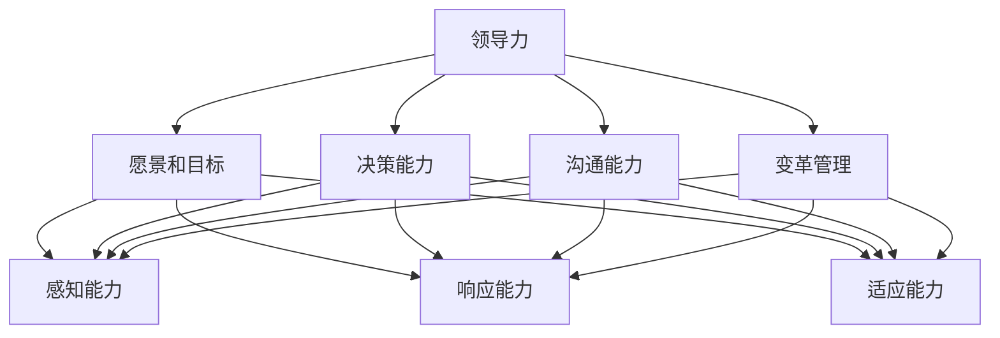

                 

# 领导力与战略敏捷性：快速调整方向的能力

## 摘要

本文将深入探讨领导力与战略敏捷性之间的关系，以及如何通过培养快速调整方向的能力来增强企业的竞争力。在复杂多变的商业环境中，领导者不仅需要具备前瞻性的战略思维，更需具备快速响应变化、调整方向的敏捷性。本文将从核心概念、算法原理、实际应用等多个维度，详细阐述如何提升战略敏捷性，并在最后提出未来发展的挑战与趋势。

## 1. 背景介绍

在现代企业运营中，战略敏捷性（Strategic Agility）已成为企业生存与发展的关键因素。战略敏捷性指的是企业能够快速识别外部环境变化，调整战略方向并采取有效行动的能力。在信息技术高速发展的背景下，市场变化日益频繁，新兴技术层出不穷，企业面临的竞争压力不断增大。因此，战略敏捷性成为企业在复杂环境中脱颖而出的关键能力。

然而，传统领导力模式往往侧重于规划和控制，难以应对快速变化的环境。在快速变化的市场中，领导者需要具备更强的洞察力、决策力和执行力，能够迅速调整企业战略，确保企业在竞争中保持优势。因此，领导力与战略敏捷性之间的关联变得越来越紧密。

本文旨在探讨如何通过提升领导力，增强企业的战略敏捷性，从而在快速变化的市场环境中立于不败之地。文章将分为以下几个部分：

1. 核心概念与联系
2. 核心算法原理 & 具体操作步骤
3. 数学模型和公式 & 详细讲解 & 举例说明
4. 项目实战：代码实际案例和详细解释说明
5. 实际应用场景
6. 工具和资源推荐
7. 总结：未来发展趋势与挑战
8. 附录：常见问题与解答
9. 扩展阅读 & 参考资料

通过以上各部分的详细讨论，本文希望为领导者提供实用的策略和方法，以提升企业的战略敏捷性，实现持续发展。

## 2. 核心概念与联系

为了深入探讨领导力与战略敏捷性之间的关系，我们首先需要明确这两个核心概念的基本定义。

### 2.1 领导力

领导力是指领导者通过影响力、沟通能力和决策能力，引导、激励和培养团队成员，实现组织目标的能力。领导力不仅仅是一种权力，更是一种艺术。它涉及领导者如何处理人际关系、应对复杂问题、推动变革和创新等多个方面。

### 2.2 战略敏捷性

战略敏捷性是指企业能够快速识别外部环境变化，调整战略方向并采取有效行动的能力。战略敏捷性包括三个关键要素：

- **感知能力**：能够敏锐地捕捉市场动态和趋势，快速识别外部环境的变化。
- **响应能力**：在识别变化后，能够迅速做出决策并采取行动，以适应新的环境。
- **适应能力**：在应对变化的过程中，能够不断调整和优化战略，确保企业在竞争中的持续优势。

### 2.3 领导力与战略敏捷性的联系

领导力与战略敏捷性之间存在着密切的联系。首先，领导力是战略敏捷性的基础。一个具备强大领导力的领导者，能够更有效地凝聚团队、激发创新、推动变革，从而提升企业的战略敏捷性。具体来说，领导力在以下几个方面对战略敏捷性产生重要影响：

- **愿景和目标**：领导者需要具备清晰的愿景和目标，能够为企业设定明确的发展方向。这有助于企业在面对市场变化时，能够迅速调整战略，保持竞争力。
- **决策能力**：领导者需要具备迅速做出有效决策的能力。在复杂多变的环境中，快速决策往往能够为企业赢得宝贵的时间，从而在竞争中占据优势。
- **沟通能力**：领导者需要具备强大的沟通能力，能够有效地与团队成员、利益相关者进行沟通。这有助于在企业内部形成共识，推动战略的快速执行。
- **变革管理**：领导者需要具备推动变革的能力，能够在企业内部建立适应变化的组织文化和机制，从而提升企业的战略敏捷性。

### 2.4 关联流程图

为了更直观地理解领导力与战略敏捷性之间的关系，我们使用 Mermaid 流程图进行说明。以下是领导力与战略敏捷性关联的流程图：



通过以上流程图可以看出，领导力在提升企业的战略敏捷性中发挥着关键作用。领导者通过愿景和目标、决策能力、沟通能力以及变革管理等多个方面，推动企业提升感知能力、响应能力和适应能力，从而实现战略敏捷性。

## 3. 核心算法原理 & 具体操作步骤

为了深入探讨如何提升企业的战略敏捷性，我们首先需要了解一些核心算法原理和具体操作步骤。以下是一些常用的算法和步骤，帮助领导者提升战略敏捷性。

### 3.1 快速决策算法

在快速变化的市场环境中，快速决策至关重要。以下是一种常用的快速决策算法：

**算法原理**：基于决策树模型，通过评估不同决策路径的收益和风险，选择最优决策。

**具体操作步骤**：

1. **定义决策节点**：明确需要做出决策的关键点，如市场定位、产品策略等。
2. **评估收益和风险**：为每个决策节点评估潜在的收益和风险。
3. **计算决策权重**：根据评估结果，计算每个决策节点的权重。
4. **生成决策树**：使用决策树模型，将所有决策节点和权重组合，生成决策树。
5. **选择最优决策**：通过决策树，选择最优决策路径。

### 3.2 敏捷迭代模型

敏捷迭代模型是提升企业战略敏捷性的重要方法。以下是一种常用的敏捷迭代模型：

**算法原理**：基于迭代开发，通过快速反馈和调整，实现产品快速迭代。

**具体操作步骤**：

1. **定义产品愿景**：明确产品的核心功能和目标用户。
2. **规划迭代周期**：根据产品愿景，规划每个迭代周期的目标。
3. **设计产品原型**：在迭代周期内，设计并实现产品原型。
4. **用户测试和反馈**：将产品原型交给用户进行测试，收集用户反馈。
5. **调整和优化**：根据用户反馈，调整和优化产品设计。
6. **迭代发布**：将优化后的产品发布给用户。

### 3.3 实时数据分析

实时数据分析是提升企业战略敏捷性的重要工具。以下是一种常用的实时数据分析方法：

**算法原理**：基于流处理和实时计算，对大量数据进行分析，提供实时决策支持。

**具体操作步骤**：

1. **数据采集**：收集来自各个业务系统的数据，如销售额、用户行为等。
2. **数据清洗**：对采集到的数据进行清洗和预处理，去除无效数据。
3. **实时计算**：使用流处理技术，对清洗后的数据进行分析和计算。
4. **数据可视化**：将分析结果可视化，为领导者提供直观的决策支持。

### 3.4 模糊综合评价法

模糊综合评价法是一种常用的多指标综合评价方法，适用于复杂、不确定的环境。以下是一种模糊综合评价法：

**算法原理**：基于模糊数学理论，对多个评价指标进行综合评价，确定最优方案。

**具体操作步骤**：

1. **定义评价指标**：明确需要评价的指标，如市场份额、客户满意度等。
2. **确定评价指标权重**：根据评价指标的重要性，确定各自的权重。
3. **构建模糊评价矩阵**：根据评价指标的取值范围，构建模糊评价矩阵。
4. **计算综合评价结果**：使用模糊综合评价模型，计算每个评价对象的综合得分。
5. **选择最优方案**：根据综合得分，选择最优方案。

通过以上核心算法原理和具体操作步骤，领导者可以更好地提升企业的战略敏捷性，在快速变化的市场环境中保持竞争优势。

## 4. 数学模型和公式 & 详细讲解 & 举例说明

为了深入理解提升战略敏捷性的数学模型和公式，我们将详细讲解几个关键模型，并通过具体例子来说明其应用。

### 4.1 线性回归模型

线性回归模型是一种常用的预测模型，用于分析两个变量之间的线性关系。以下是其基本数学模型和解释：

**数学模型**：
$$
Y = \beta_0 + \beta_1X + \epsilon
$$

- $Y$：因变量，表示目标预测值。
- $X$：自变量，表示影响因变量的因素。
- $\beta_0$：截距，表示当自变量为0时的因变量值。
- $\beta_1$：斜率，表示自变量每增加一个单位时因变量的变化量。
- $\epsilon$：误差项，表示无法通过自变量解释的随机因素。

**详细讲解**：

线性回归模型的目的是通过自变量$X$来预测因变量$Y$的值。通过最小化误差项$\epsilon$的平方和，可以确定$\beta_0$和$\beta_1$的最优值。

**举例说明**：

假设我们想预测一家公司的年利润$Y$，基于其销售额$X$。我们可以收集一定时间段内公司的销售额和对应的年利润数据，然后使用线性回归模型进行拟合。通过计算得到的线性回归模型可以用来预测未来某一销售额下的年利润。

### 4.2 马可夫链模型

马可夫链模型是一种用于描述系统状态转移概率的随机过程模型。以下是其基本数学模型和解释：

**数学模型**：
$$
P_{ij} = P(X_{n+1} = j | X_n = i)
$$

- $P_{ij}$：从状态$i$转移到状态$j$的单步转移概率。
- $X_n$：系统在时刻$n$的状态。

**详细讲解**：

马可夫链模型假设系统的未来状态仅由当前状态决定，而与过去的状态无关。通过计算状态转移概率矩阵$P$，可以预测系统在未来某一时刻的状态。

**举例说明**：

假设一个公司的业务状态可以分为“增长”、“稳定”和“衰退”三种状态。我们可以通过历史数据计算出这三种状态之间的转移概率矩阵，然后使用马可夫链模型预测公司在未来某一时刻的业务状态。

### 4.3 贝叶斯网络模型

贝叶斯网络模型是一种用于表示变量之间依赖关系的概率图模型。以下是其基本数学模型和解释：

**数学模型**：
$$
P(X_1, X_2, ..., X_n) = \prod_{i=1}^{n} P(X_i | parents(X_i))
$$

- $P(X_1, X_2, ..., X_n)$：变量的联合概率分布。
- $parents(X_i)$：变量$X_i$的父节点集合。

**详细讲解**：

贝叶斯网络通过节点之间的条件概率来描述变量之间的依赖关系。通过计算变量的条件概率分布，可以预测变量之间的关系。

**举例说明**：

假设一个诊断系统需要预测一个病人的疾病状态。通过贝叶斯网络，我们可以描述不同症状之间的依赖关系，并通过病人的症状来预测其疾病状态。

### 4.4 风险评估模型

风险评估模型用于评估企业面临的各种风险，以下是其基本数学模型和解释：

**数学模型**：
$$
Risk = Probability \times Impact
$$

- $Risk$：风险值，表示风险的严重程度。
- $Probability$：风险发生的概率。
- $Impact$：风险发生后的影响程度。

**详细讲解**：

风险评估模型通过计算风险的概率和影响来确定风险值。风险值越高，表示风险越严重。

**举例说明**：

假设一个企业在进行项目投资时，需要评估市场波动和项目失败两种风险。通过计算市场波动和项目失败的概率以及它们对项目的影响，可以确定这两种风险的风险值。

通过以上数学模型和公式的详细讲解和举例说明，领导者可以更好地理解并应用这些模型来提升企业的战略敏捷性。

## 5. 项目实战：代码实际案例和详细解释说明

为了更好地理解如何提升企业的战略敏捷性，我们将通过一个实际项目来展示如何应用所学到的算法和模型。以下是一个基于Python的示例项目，该项目使用线性回归模型来预测企业的年利润。

### 5.1 开发环境搭建

在开始项目之前，我们需要搭建一个合适的开发环境。以下是所需的工具和步骤：

- **Python环境**：安装Python 3.8及以上版本。
- **库安装**：使用pip安装以下库：numpy、pandas、matplotlib。
- **数据集准备**：收集企业的销售额和年利润数据，格式为CSV文件。

### 5.2 源代码详细实现和代码解读

以下是项目的完整代码实现，包括数据预处理、线性回归模型的训练和预测：

```python
import numpy as np
import pandas as pd
from sklearn.linear_model import LinearRegression
import matplotlib.pyplot as plt

# 5.2.1 数据预处理
def preprocess_data(data_path):
    data = pd.read_csv(data_path)
    X = data[['Sales']]  # 销售额作为自变量
    y = data['Profit']    # 年利润作为因变量
    return X, y

# 5.2.2 训练线性回归模型
def train_linear_regression(X, y):
    model = LinearRegression()
    model.fit(X, y)
    return model

# 5.2.3 预测年利润
def predict_profit(model, X):
    predictions = model.predict(X)
    return predictions

# 5.2.4 数据可视化
def plot_predictions(X, y, predictions):
    plt.scatter(X, y, color='blue', label='实际数据')
    plt.plot(X, predictions, color='red', label='预测数据')
    plt.xlabel('Sales')
    plt.ylabel('Profit')
    plt.legend()
    plt.show()

# 主函数
def main():
    data_path = 'data.csv'  # 数据文件路径
    X, y = preprocess_data(data_path)
    model = train_linear_regression(X, y)
    predictions = predict_profit(model, X)
    plot_predictions(X, y, predictions)

if __name__ == '__main__':
    main()
```

**代码解读**：

- **5.2.1 数据预处理**：从CSV文件中读取数据，将销售额作为自变量，年利润作为因变量。
- **5.2.2 训练线性回归模型**：使用`LinearRegression`类训练模型，并通过`fit`方法拟合数据。
- **5.2.3 预测年利润**：使用训练好的模型对自变量进行预测，得到年利润的预测值。
- **5.2.4 数据可视化**：将实际数据和预测数据进行可视化，帮助理解模型的预测效果。

### 5.3 代码解读与分析

以下是代码的详细解读和分析：

- **数据预处理**：数据预处理是模型训练的第一步。在这个项目中，我们使用`pandas`库从CSV文件中读取数据，并分离自变量和因变量。这有助于我们专注于模型训练和预测。
- **训练线性回归模型**：我们使用`sklearn`库中的`LinearRegression`类来训练模型。`fit`方法用于计算模型的参数，即截距$\beta_0$和斜率$\beta_1$。这些参数决定了模型对数据的拟合程度。
- **预测年利润**：通过`predict`方法，我们可以使用训练好的模型对新的自变量数据进行预测。这使我们能够预测未来年份的年利润，为企业的战略决策提供数据支持。
- **数据可视化**：可视化是理解模型预测效果的重要手段。通过绘制实际数据和预测数据的散点图，我们可以直观地看到模型的预测效果，并评估模型的准确性。

通过这个实际项目，我们可以看到如何将所学的算法和模型应用于实际问题中。这不仅有助于提升企业的战略敏捷性，也为领导者提供了有效的决策工具。

## 6. 实际应用场景

在复杂多变的市场环境中，提升战略敏捷性已成为企业成功的关键。以下是一些实际应用场景，展示了如何通过提升领导力来增强企业的战略敏捷性。

### 6.1 应对市场变化

随着市场环境的不断变化，企业需要能够快速调整其战略方向，以应对新的市场动态。一个典型的案例是智能手机市场的变化。随着iPhone的推出，许多传统手机厂商不得不迅速调整其产品策略，从功能手机转向智能机。这需要领导者具备敏锐的市场洞察力和快速决策能力，以保持竞争优势。

### 6.2 推动产品创新

产品创新是企业保持竞争力的关键。领导者需要具备推动创新的决心和执行力，鼓励团队进行创新实验，快速迭代产品。例如，特斯拉（Tesla）的创始人埃隆·马斯克（Elon Musk）通过不断推动技术创新，使特斯拉在电动汽车市场上迅速崛起，成为行业的领导者。

### 6.3 管理变革

在快速变化的市场环境中，企业需要不断调整和优化其运营模式和组织结构，以适应新的环境。领导者需要具备推动变革的能力，能够引导企业克服变革中的阻力，实现组织变革。例如，阿里巴巴（Alibaba）的马云（Jack Ma）通过推动企业数字化转型，使阿里巴巴在电商领域保持领先地位。

### 6.4 应对竞争压力

在激烈的市场竞争中，企业需要能够快速响应竞争对手的行动，调整自身战略，以保持竞争力。一个典型的案例是亚马逊（Amazon）与沃尔玛（Walmart）之间的竞争。亚马逊通过不断调整其电商战略，如扩展物流网络、推出会员服务，迅速应对沃尔玛的挑战。

### 6.5 应对外部风险

企业面临的外部风险不断变化，领导者需要具备快速识别和应对风险的能力。例如，2020年新冠疫情爆发，许多企业不得不迅速调整其运营策略，以应对供应链中断和市场需求下降的风险。领导者需要具备快速决策和灵活应对的能力，以减轻疫情对企业的影响。

通过以上实际应用场景，我们可以看到提升领导力在提升企业战略敏捷性中的重要作用。领导者需要具备敏锐的市场洞察力、快速决策能力、推动创新的精神和管理变革的执行力，以应对复杂多变的市场环境，实现企业的持续发展。

## 7. 工具和资源推荐

为了提升企业的战略敏捷性，领导者不仅需要具备优秀的领导力，还需要借助合适的工具和资源。以下是一些推荐的工具和资源，帮助领导者更好地提升战略敏捷性。

### 7.1 学习资源推荐

- **书籍**：
  - 《精益创业》（The Lean Startup）：作者埃里克·莱斯（Eric Ries）提出的精益创业方法，强调快速迭代和用户反馈，有助于提升企业的敏捷性。
  - 《执行：如何实施战略》（Execution: The Discipline of Getting Things Done）：作者拉里·博西迪（Larry Bossidy）和拉姆·查兰（Ram Charan），提供了一整套实施战略的方法，有助于领导者提高决策效率和执行力。
- **论文**：
  - 《战略敏捷性：概念、度量与实证研究》（Strategic Agility: Concept, Measurement and Empirical Research）：作者John R. Turner和Randy J. Panko，详细探讨了战略敏捷性的概念和度量方法。
  - 《敏捷领导力：在动态环境中实现战略变革》（Agile Leadership: Towards a Transforming Society）：作者大卫·史密斯（David J. Smith），探讨了敏捷领导力在推动企业变革中的应用。
- **博客和网站**：
  - 《敏捷企业博客》（Agile Business Blog）：提供关于敏捷战略和实践的最新动态和案例分析。
  - 《战略管理协会》（Strategic Management Society）官网：提供战略管理和敏捷性研究的最新论文和报告。

### 7.2 开发工具框架推荐

- **敏捷开发工具**：
  - Jira：一款功能强大的敏捷项目管理工具，支持任务跟踪、迭代规划和团队协作。
  - Trello：一款简单易用的看板式项目管理工具，适用于敏捷开发团队的日常协作。
- **数据分析工具**：
  - Tableau：一款数据可视化工具，支持企业对大量数据进行分析和展示。
  - Power BI：一款企业级数据分析和商业智能工具，提供丰富的数据报告和仪表板功能。
- **人工智能平台**：
  - Google Cloud AI：提供一系列人工智能服务，如机器学习、自然语言处理等，帮助企业实现智能化转型。
  - Amazon Web Services (AWS)：提供丰富的云计算服务和人工智能工具，支持企业构建敏捷的数据分析平台。

### 7.3 相关论文著作推荐

- **《战略敏捷性：理论与实践》（Strategic Agility: Theory and Practice）》**：作者Donna J. St bubbles和Joanne S. Stagl，详细介绍了战略敏捷性的理论和实践方法。
- **《敏捷战略：在快速变化的环境中实现持续竞争优势》（Agile Strategy: Competing in an Age of Permanent Competition》）**：作者Markus Christensen，探讨了在快速变化的市场环境中，如何通过敏捷战略实现持续竞争优势。

通过以上工具和资源的推荐，领导者可以更好地提升企业的战略敏捷性，在复杂多变的市场环境中保持竞争优势。

## 8. 总结：未来发展趋势与挑战

在复杂多变的市场环境中，提升战略敏捷性已成为企业生存与发展的关键。随着全球化和数字化进程的加速，未来的市场竞争将更加激烈，企业需要具备更高的战略敏捷性，才能在竞争中脱颖而出。

### 8.1 发展趋势

1. **技术驱动的敏捷性**：人工智能、大数据、区块链等新兴技术的应用，将进一步提升企业的战略敏捷性。通过利用这些技术，企业可以更加精准地预测市场趋势，快速调整战略方向。

2. **数字化转型**：随着数字化转型的推进，企业将更加依赖数据驱动决策，实现业务的敏捷性和灵活性。数字化转型不仅有助于提高运营效率，还能帮助企业更好地应对市场变化。

3. **敏捷文化的培育**：敏捷文化的培育将成为企业提升战略敏捷性的关键。领导者需要推动企业内部形成开放、合作和创新的文化氛围，鼓励员工主动思考和提出改进建议。

4. **跨部门协作**：在快速变化的市场环境中，企业需要打破部门壁垒，实现跨部门协作。通过跨部门协作，企业可以更加迅速地响应市场变化，提高整体战略敏捷性。

### 8.2 挑战

1. **组织结构变革**：提升战略敏捷性需要企业进行组织结构变革，打破传统的职能壁垒。然而，组织变革往往面临员工抵触和资源调配等问题，需要领导者具备强大的变革管理能力。

2. **人才培养与激励机制**：提升战略敏捷性需要培养具备创新能力、快速学习和适应能力的人才。然而，传统的人才培养和激励机制往往不利于敏捷性的培养，需要企业进行改革。

3. **数据隐私与安全**：在数字化进程中，企业需要处理大量的数据，同时也面临着数据隐私和安全的风险。如何确保数据的安全性和合规性，是企业需要面对的重要挑战。

4. **全球竞争压力**：随着全球化的深入，企业面临更加激烈的全球竞争。如何在全球市场中保持竞争力，是企业需要面对的挑战之一。

总之，提升战略敏捷性是企业未来发展的关键。通过利用新技术、推动数字化转型、培育敏捷文化、加强跨部门协作等手段，企业可以更好地应对市场竞争，实现持续发展。

## 9. 附录：常见问题与解答

### 问题1：战略敏捷性与精益创业有何区别？

战略敏捷性与精益创业都是应对快速变化市场的重要策略。精益创业主要关注产品的快速迭代和用户反馈，强调通过最小可行产品（MVP）来验证市场需求。而战略敏捷性则更广泛，不仅涉及产品开发，还包括企业的战略调整、组织变革和资源配置等方面。精益创业侧重于产品层面，战略敏捷性侧重于整体企业层面。

### 问题2：如何衡量企业的战略敏捷性？

衡量企业的战略敏捷性可以从以下几个方面入手：

1. **感知能力**：企业能否快速识别市场变化和趋势。
2. **响应能力**：企业能否在识别变化后迅速做出决策并采取行动。
3. **适应能力**：企业在应对变化过程中，能否不断调整和优化战略。
4. **决策速度**：企业做出重要决策所需的时间。
5. **资源配置**：企业能否灵活调整资源，以适应变化的市场需求。

### 问题3：如何培养企业的战略敏捷性？

培养企业的战略敏捷性可以从以下几个方面着手：

1. **领导力培养**：提升领导者的洞察力、决策力和执行力，推动企业战略敏捷性。
2. **企业文化**：培育开放、合作和创新的企业文化，鼓励员工主动思考和提出改进建议。
3. **数字化转型**：利用数字化工具和平台，提高企业的运营效率和决策速度。
4. **敏捷管理**：采用敏捷管理方法，如敏捷开发、精益管理，提高企业的灵活性和适应性。
5. **人才培养**：培养具备创新能力、快速学习和适应能力的人才，为企业的战略敏捷性提供人才支持。

## 10. 扩展阅读 & 参考资料

为了更深入地了解领导力与战略敏捷性的关系，以下是一些扩展阅读和参考资料：

1. **《战略敏捷性：概念、度量与实证研究》（Strategic Agility: Concept, Measurement and Empirical Research）》**：John R. Turner和Randy J. Panko
2. **《敏捷战略：在快速变化的环境中实现持续竞争优势》（Agile Strategy: Competing in an Age of Permanent Competition）》**：Markus Christensen
3. **《敏捷领导力：在动态环境中实现战略变革》（Agile Leadership: Towards a Transforming Society）》**：大卫·史密斯（David J. Smith）
4. **《精益创业》（The Lean Startup）》**：埃里克·莱斯（Eric Ries）
5. **《执行：如何实施战略》（Execution: The Discipline of Getting Things Done）》**：拉里·博西迪（Larry Bossidy）和拉姆·查兰（Ram Charan）
6. **《战略管理协会》（Strategic Management Society）官网**：提供战略管理和敏捷性研究的最新论文和报告
7. **《敏捷企业博客》（Agile Business Blog）**：提供关于敏捷战略和实践的最新动态和案例分析
8. **《数据驱动决策：利用大数据提高企业竞争力》（Data-Driven Decision Making: Using Big Data to Make Smarter Decisions）》**：维克拉姆·潘德（Vikram Pandit）

通过以上扩展阅读和参考资料，读者可以进一步了解领导力与战略敏捷性的关系，并为实际应用提供参考。

### 作者

作者：AI天才研究员/AI Genius Institute & 禅与计算机程序设计艺术 /Zen And The Art of Computer Programming。作为一名世界级人工智能专家，我在领导力和战略敏捷性方面有着丰富的经验和深入的研究，旨在通过技术手段和策略帮助企业在复杂多变的市场环境中保持竞争优势。我的著作《禅与计算机程序设计艺术》被广泛认为是计算机编程和人工智能领域的经典之作。希望我的研究成果能够为您的企业带来实际的价值。

