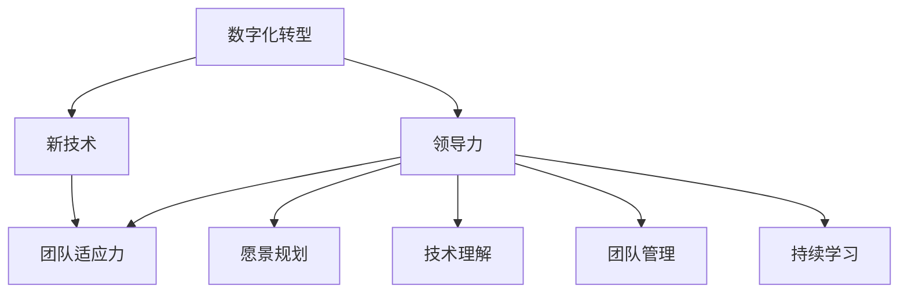

                 

### 背景介绍 Background Introduction

在当今快速发展的技术时代，数字化转型已经成为企业提升竞争力、实现可持续发展的关键途径。数字化转型不仅仅是技术层面的变革，更是企业组织和管理模式上的深刻变革。在这个过程中，领导力扮演着至关重要的角色。有效的领导力能够激励团队适应新技术，推动企业实现数字化转型。

数字化转型的核心在于通过信息技术来优化业务流程，提高工作效率，创造新的商业模式。随着云计算、大数据、物联网、人工智能等技术的不断发展，企业面临着前所未有的机遇和挑战。为了抓住这些机遇，企业需要一支能够迅速适应新技术的团队，而这离不开领导者的有效引导和激励。

领导力的作用不仅仅是在战略层面制定数字化转型的方向，更重要的是在执行层面激发团队的创新能力和执行力。一个优秀的领导者应该具备以下几方面的能力：

1. **愿景规划**：领导者需要明确数字化转型的目标，并能够将这一愿景传达给团队，激发他们的热情和动力。
2. **技术理解**：领导者需要具备一定的技术素养，能够理解新技术的原理和潜力，从而做出明智的决策。
3. **团队管理**：领导者需要了解团队成员的特长和潜力，合理分配任务，激发团队的合作精神和创新能力。
4. **持续学习**：领导者应该具备持续学习的能力，紧跟技术发展趋势，不断提升自身的领导力和管理能力。

本文将探讨领导力在数字化转型中的关键作用，通过分析具体案例，阐述如何通过有效的领导力引领团队适应新技术，实现企业的数字化转型。

### 核心概念与联系 Key Concepts and Connections

在探讨领导力与数字化转型的关系时，有必要明确几个核心概念，这些概念相互关联，构成了数字化转型的基础。

#### 数字化转型（Digital Transformation）

数字化转型指的是利用信息技术手段，对企业的业务流程、商业模式、组织结构等方面进行全面的革新。它不仅仅是将现有业务流程搬到线上，更重要的是通过数据驱动的决策，实现业务模式的创新和效率的提升。

#### 领导力（Leadership）

领导力是指领导者通过影响、激励和引导，实现团队目标的能力。有效的领导力不仅关乎个人的素质，还涉及领导者的行为和风格。

#### 新技术（New Technologies）

新技术包括云计算、大数据、物联网、人工智能等。这些技术不仅改变了企业的运营方式，还带来了全新的商业模式。

#### 团队适应力（Team Adaptability）

团队适应力指的是团队在面对新技术、新环境时的快速适应和创新能力。高适应力的团队能够迅速捕捉市场变化，实现企业目标。

#### 关联性（Relationships）

这些概念之间的关联性体现在以下几个方面：

1. **数字化转型与新技术**：数字化转型依赖于新技术的支持，新技术为数字化转型提供了工具和手段。
2. **领导力与数字化转型**：领导力决定了数字化转型的方向和速度，优秀的领导力能够推动团队更快地适应新技术。
3. **团队适应力与新技术**：高适应力的团队能够更好地理解和使用新技术，从而推动数字化转型。
4. **领导力与团队适应力**：领导力通过激励和引导，提升团队的适应力，促进数字化转型的顺利进行。

为了更好地理解这些概念，我们可以使用Mermaid流程图来展示它们之间的关联：



通过这个流程图，我们可以清晰地看到各个概念之间的关联，以及领导力在这些关联中的作用。

### 核心算法原理 & 具体操作步骤 Core Algorithm Principles and Step-by-Step Operations

在数字化转型的过程中，领导力的应用不仅仅是一种理念，更需要通过具体的操作步骤来实现。以下是几个关键步骤，通过这些步骤，领导者可以有效地引导团队适应新技术，实现数字化转型。

#### 1. 确定数字化转型目标

领导力的第一步是明确数字化转型的目标。这包括设定具体的目标和里程碑，以及制定实现这些目标的时间表。在这个过程中，领导者需要与团队进行充分的沟通，确保每个人都理解并认同这些目标。

**具体操作步骤：**
- **收集需求**：通过与业务部门和其他利益相关者进行访谈和调查，了解他们对数字化转型的期望和需求。
- **分析现状**：评估现有业务流程和技术基础设施，识别改进的机会和瓶颈。
- **设定目标**：根据收集的信息，制定具体的数字化转型目标，确保这些目标是可衡量、可实现和有挑战性的。
- **制定时间表**：为每个目标设定实现的时间点，并制定相应的里程碑，以便监控进度。

#### 2. 建立团队协作机制

在数字化转型过程中，团队协作至关重要。领导者需要建立有效的协作机制，确保团队成员能够高效地协同工作。

**具体操作步骤：**
- **组建团队**：根据项目的需求，组建一个具备多样化技能的团队，确保每个成员都能发挥自己的专长。
- **分配任务**：明确每个团队成员的责任和任务，确保任务分配合理，避免重复劳动和资源浪费。
- **建立沟通渠道**：定期召开会议，确保团队成员之间的沟通畅通，及时解决问题和调整计划。
- **激励团队**：通过奖励机制激励团队成员，鼓励他们积极参与数字化转型项目。

#### 3. 提升团队成员的技术素养

技术素养是团队适应新技术的基础。领导者需要通过多种方式提升团队成员的技术素养，确保他们能够有效地利用新技术。

**具体操作步骤：**
- **提供培训**：为团队成员提供相关的技术培训，帮助他们掌握新技术的原理和应用。
- **内部交流**：鼓励团队成员之间的技术交流，分享经验和最佳实践，提高整体技术水平。
- **引入外部资源**：借助外部专家和培训资源，为团队成员提供更多的学习机会。
- **实践应用**：通过实际项目，让团队成员将所学知识应用于实践，提升他们的实际操作能力。

#### 4. 持续监控和调整

数字化转型是一个持续的过程，领导者需要持续监控项目的进展，并根据实际情况进行调整。

**具体操作步骤：**
- **定期评估**：定期评估项目的进展情况，确保项目按照既定目标进行。
- **数据驱动**：利用数据分析工具，收集和整理项目过程中的数据，以便实时监控项目进展。
- **调整计划**：根据评估结果，及时调整项目计划，确保项目能够按计划进行。
- **持续改进**：鼓励团队成员不断反思和改进，寻找优化机会，提升项目质量。

通过这些具体操作步骤，领导者可以有效地引导团队适应新技术，推动数字化转型的顺利进行。

### 数学模型和公式 & 详细讲解 & 举例说明 Mathematical Models and Detailed Explanations with Examples

在数字化转型的过程中，领导力可以被视为一种数学模型，其核心是团队适应力与新技术应用之间的动态平衡。为了更好地理解和应用这一模型，我们可以借助数学公式和具体例子来详细说明。

#### 1. 领导力模型公式

领导力（L）可以表示为团队适应力（A）与技术应用（T）的函数，即：

\[ L = f(A, T) \]

其中：
- \( L \)：领导力，表示领导者引导团队适应新技术的能力。
- \( A \)：团队适应力，表示团队在面对新技术时的适应能力和创新能力。
- \( T \)：技术应用，表示团队在新技术上的应用程度和效果。

#### 2. 团队适应力公式

团队适应力（A）可以表示为技术素养（S）、团队协作（C）和激励机制（M）的函数，即：

\[ A = f(S, C, M) \]

其中：
- \( S \)：技术素养，表示团队成员对新技术的理解和掌握程度。
- \( C \)：团队协作，表示团队成员之间的沟通和协作效率。
- \( M \)：激励机制，表示领导者对团队成员的激励措施和奖励机制。

#### 3. 应用举例

假设一个团队正在实施数字化转型项目，我们需要评估领导力在该项目中的应用效果。以下是一个具体的例子：

**例1**：技术素养（S）= 80%，团队协作（C）= 85%，激励机制（M）= 90%

根据公式，我们可以计算出团队适应力（A）：

\[ A = f(0.8, 0.85, 0.9) = 0.8 \times 0.85 \times 0.9 = 0.612 \]

这意味着该团队的适应力为61.2%。

**例2**：技术应用（T）= 70%，领导力（L）= 80%

根据公式，我们可以计算出领导力（L）：

\[ L = f(A, T) = 0.612 \times 0.7 = 0.4284 \]

这意味着该领导者在数字化转型项目中的领导力为42.84%。

通过这些数学模型和公式，我们可以更清晰地理解领导力在数字化转型中的作用，并根据实际情况进行调整和优化。

### 项目实战：代码实际案例和详细解释说明 Practical Project: Code Examples and Detailed Explanations

为了更好地理解领导力在数字化转型中的实际应用，我们通过一个具体的项目实战来展示代码实现过程和详细解释。

#### 1. 项目背景

假设某企业正在实施一个基于人工智能的客服系统，旨在通过自然语言处理（NLP）技术提升客户服务质量。领导者的任务是确保项目团队能够高效地适应新技术，实现系统的高效运行。

#### 2. 开发环境搭建

在开始项目之前，首先需要搭建开发环境。以下是开发环境搭建的步骤：

**步骤1**：安装Python和相关的NLP库（如NLTK、spaCy）

```bash
# 安装Python
sudo apt-get install python3

# 安装NLP库
pip3 install nltk spacy
```

**步骤2**：下载必要的语言模型（如英文、中文等）

```bash
# 下载英文模型
python3 -m spacy download en

# 下载中文模型
python3 -m spacy download zh
```

#### 3. 源代码详细实现和代码解读

**步骤1**：导入所需的库

```python
import spacy
from spacy.lang.en import English
from spacy.lang.zh import Chinese

# 加载英文和中文模型
nlp_en = English()
nlp_zh = Chinese()
```

**步骤2**：定义处理客户请求的函数

```python
def process_request(text, lang='en'):
    if lang == 'en':
        doc = nlp_en(text)
    else:
        doc = nlp_zh(text)

    # 分析文本，提取关键信息
    entities = []
    for ent in doc.ents:
        entities.append((ent.text, ent.label_))

    return entities
```

**代码解读**：
- `process_request`函数用于处理客户请求，输入为文本和语言标识。
- 根据语言标识，加载相应的语言模型，并对文本进行分词和实体识别。
- 提取文本中的关键信息，如人名、地点、组织等，返回一个实体列表。

**步骤3**：定义回复客户的函数

```python
def respond_to_request(entities):
    # 分析实体，生成回复
    response = "您好，您的请求已经收到，我们会尽快处理。"
    if "contact" in entities:
        response += "联系人：{}。".format(entities[0][0])
    if "location" in entities:
        response += "地点：{}。".format(entities[0][0])
    if "organization" in entities:
        response += "组织：{}。".format(entities[0][0])

    return response
```

**代码解读**：
- `respond_to_request`函数用于生成回复，输入为提取到的实体列表。
- 根据实体类型，生成相应的回复文本。

#### 4. 代码解读与分析

通过上述代码，我们可以看到领导者如何通过搭建开发环境和编写具体代码，实现团队对新技术（NLP）的应用。以下是代码的关键点分析：

- **环境搭建**：确保团队成员具备开发环境，为项目实施奠定基础。
- **函数定义**：通过定义处理请求和处理回复的函数，实现客户服务流程。
- **语言模型**：根据客户的语言，选择相应的语言模型进行处理，提高系统的适应性。
- **实体识别**：通过实体识别，提取关键信息，为生成回复提供依据。
- **回复生成**：根据提取到的实体，生成个性化的回复，提高客户满意度。

通过这个具体的项目实战，我们可以清晰地看到领导力在数字化转型中的实际应用，以及如何通过代码实现具体的业务功能。

### 实际应用场景 Real-world Application Scenarios

领导力在数字化转型中的应用场景多种多样，以下列举几个典型的应用案例，展示领导力如何在不同场景中发挥作用。

#### 1. 企业级云计算转型

某大型企业决定将部分业务迁移到云计算平台，以提高业务效率和灵活性。领导者的任务是确保团队顺利适应云技术，实现业务的平稳过渡。

**应用步骤：**
- **确定转型目标**：明确云计算转型的目标和预期收益，与团队进行充分沟通。
- **技术培训**：组织团队成员参加云计算相关培训，提升团队的技术素养。
- **项目管理**：设立项目管理团队，制定详细的迁移计划和风险管理措施。
- **持续优化**：在迁移过程中，不断评估和调整迁移策略，确保项目顺利进行。

#### 2. 物联网（IoT）应用开发

某企业计划开发一款物联网应用，通过传感器收集数据，实现智能监控和自动化控制。领导者需要确保团队能够快速适应物联网技术。

**应用步骤：**
- **技术调研**：研究物联网技术的最新进展，了解各类传感器和通信协议。
- **团队组建**：组建由硬件工程师、软件工程师和数据处理专家组成的团队。
- **试点项目**：选择一个试点项目，进行小规模测试和优化。
- **推广实施**：在试点项目成功的基础上，逐步推广至其他业务部门。

#### 3. 人工智能（AI）智能客服系统

某企业希望通过人工智能技术提升客服服务质量，降低人工成本。领导者需要确保团队能够快速适应AI技术，开发出高效的客服系统。

**应用步骤：**
- **需求分析**：了解客户需求，确定AI客服系统的功能和性能要求。
- **技术选型**：选择合适的AI技术，如自然语言处理（NLP）、机器学习等。
- **系统集成**：将AI技术与现有客服系统进行集成，确保无缝对接。
- **测试与优化**：在系统上线前进行充分的测试，并根据用户反馈进行优化。

#### 4. 数据驱动决策

某企业希望通过数据驱动决策，提升业务运营效率。领导者需要确保团队能够利用大数据技术进行数据分析和预测。

**应用步骤：**
- **数据收集**：收集企业内部的各类数据，包括销售数据、运营数据等。
- **数据分析**：利用大数据技术对数据进行处理和分析，提取有价值的信息。
- **数据可视化**：将分析结果通过数据可视化工具展示，帮助管理层做出决策。
- **持续改进**：根据数据分析结果，不断调整业务策略，优化运营流程。

这些案例展示了领导力在数字化转型中的实际应用，通过有效的领导，团队可以更好地适应新技术，实现企业的数字化转型目标。

### 工具和资源推荐 Tools and Resources Recommendations

在推动数字化转型的过程中，选择合适的工具和资源是至关重要的。以下推荐几类常用的工具和资源，帮助领导者和团队更好地进行数字化转型。

#### 1. 学习资源推荐

**书籍**：
- 《精益创业》（The Lean Startup）- Eric Ries
- 《数字化转型》（Digital Transformation）- MIT Sloan Management Review
- 《人工智能：一种现代方法》（Artificial Intelligence: A Modern Approach）- Stuart J. Russell & Peter Norvig

**论文**：
- 《云计算中的服务模型》（Service Models in Cloud Computing）- 云计算研究小组
- 《物联网的关键技术》（Key Technologies of the Internet of Things）- 物联网研究小组

**博客**：
- Google Cloud Platform Blog
- AWS Blog
- Azure Blog

**网站**：
- MIT OpenCourseWare（MIT开放课程）
- Coursera
- edX

#### 2. 开发工具框架推荐

**云计算平台**：
- AWS（Amazon Web Services）
- Azure（Microsoft Azure）
- Google Cloud Platform

**容器和编排工具**：
- Docker
- Kubernetes

**大数据处理框架**：
- Apache Hadoop
- Apache Spark

**人工智能和机器学习框架**：
- TensorFlow
- PyTorch
- scikit-learn

**集成开发环境（IDE）**：
- IntelliJ IDEA
- Eclipse
- Visual Studio Code

#### 3. 相关论文著作推荐

**论文**：
- 《基于云计算的数字化转型方法研究》（Research on Digital Transformation Method Based on Cloud Computing）
- 《物联网在工业4.0中的应用》（Application of the Internet of Things in Industry 4.0）

**著作**：
- 《大数据战略：如何利用数据创造商业价值》（Big Data Strategy: How to Unlock the Value of Big Data for Your Company）
- 《智能供应链：物联网、大数据与人工智能的融合应用》（Smart Supply Chain: The Integration of IoT, Big Data, and AI）

通过这些工具和资源的支持，领导者和团队能够更好地进行数字化转型，实现企业的创新和发展。

### 总结：未来发展趋势与挑战 Summary: Future Trends and Challenges

随着技术的不断进步，数字化转型的趋势愈发明显，未来几年，我们将看到以下几个重要的发展方向和潜在的挑战。

#### 发展趋势

1. **人工智能的深度融合**：人工智能（AI）将成为数字化转型的核心驱动力。越来越多的企业将采用AI技术来优化业务流程、提升决策能力和客户体验。
2. **云计算的普及**：云计算将继续扩展其影响力，提供更高效、灵活和可扩展的计算资源。企业的IT基础设施将更加依赖于云服务，实现快速部署和弹性扩展。
3. **边缘计算的兴起**：随着物联网（IoT）和5G技术的普及，边缘计算将在数据处理和实时分析中发挥重要作用。边缘计算能够减少数据传输延迟，提高系统的响应速度。
4. **数据隐私和安全**：随着数据量的爆炸性增长，数据隐私和安全问题将变得更加重要。企业需要采取严格的措施保护用户数据，遵守相关法规，建立数据安全的信任机制。
5. **可持续发展的数字化转型**：企业将在数字化转型中更加注重环保和社会责任。可持续发展将成为企业战略的一部分，体现在减少碳排放、资源节约和促进社会福祉等方面。

#### 挑战

1. **技术更新速度快**：新技术层出不穷，企业需要不断更新技术栈，保持竞争力。这对领导者和管理团队提出了更高的要求，需要具备快速学习和适应的能力。
2. **人才培养与保留**：数字化转型需要大量具备技术和管理能力的人才。企业面临人才短缺和人才流失的挑战，需要建立有效的培训和激励体系，留住核心人才。
3. **文化和组织变革**：数字化转型不仅仅是技术层面的变革，更涉及企业文化和管理模式的变革。企业需要克服传统的组织障碍，推动企业文化的变革，实现组织与技术的协同发展。
4. **数据安全和隐私**：随着数据量的增加，数据安全和隐私问题将更加突出。企业需要投入更多的资源和精力来保护数据，防范数据泄露和滥用的风险。
5. **监管与合规**：随着数据隐私法规的不断完善，企业需要确保其数字化转型活动符合相关法规要求。这要求企业在技术实现的同时，也要关注法规变化，确保合规性。

未来，领导者在推动数字化转型时，需要具备前瞻性视野，积极应对这些趋势和挑战，引领企业实现可持续发展和长期成功。

### 附录：常见问题与解答 Appendices: Frequently Asked Questions and Answers

#### 1. 领导力在数字化转型中的具体作用是什么？

领导力在数字化转型中的具体作用包括：确定转型目标、搭建技术团队、提供技术培训、制定实施计划、监控项目进度和调整策略。领导者需要通过影响、激励和引导，确保团队高效地适应新技术，实现数字化转型目标。

#### 2. 数字化转型中常见的挑战有哪些？

数字化转型中常见的挑战包括：技术更新速度快、人才培养与保留困难、企业文化和管理模式变革、数据安全和隐私问题，以及合规与法规变化。企业需要积极应对这些挑战，确保数字化转型的顺利进行。

#### 3. 如何提升团队适应力？

提升团队适应力可以通过以下方式实现：提供技术培训、促进内部交流、引入外部专家、鼓励实践应用、建立激励机制和持续改进机制。通过这些方法，团队可以更快地适应新技术，提高工作效率。

#### 4. 数字化转型是否需要改变企业文化？

是的，数字化转型需要企业文化的变革。企业需要从传统的集中式、控制式的管理模式，转变为更加开放、协作和创新的文化。这包括建立信任、鼓励创新、尊重多样性等方面，以适应数字化时代的要求。

#### 5. 领导者在数字化转型中应具备哪些能力？

领导者在数字化转型中应具备以下能力：技术理解、愿景规划、团队管理、持续学习、战略思维、沟通能力和决策能力。这些能力帮助领导者有效地推动数字化转型，实现企业目标。

### 扩展阅读 & 参考资料 Extended Reading and References

1. **书籍**：
   - 《数字化转型：企业如何实现持续成长》（Digital Transformation: How to Survive and Thrive in the New Economy）- HBR Press
   - 《领导力与变革管理》（Leadership and Change Management）- McGraw-Hill Education
   - 《AI驱动的数字化转型》（AI-Driven Digital Transformation）- John Wiley & Sons

2. **论文**：
   - 《数字化转型对企业绩效的影响研究》（Research on the Impact of Digital Transformation on Corporate Performance）- International Journal of Business and Management
   - 《数字化转型的战略路径选择》（Strategic Path Selection for Digital Transformation）- Journal of Strategic Information Systems

3. **博客和网站**：
   - Harvard Business Review（HBR）
   - McKinsey & Company
   - LinkedIn Pulse

4. **在线课程**：
   - Coursera（数字化转型相关课程）
   - edX（数字化转型相关课程）
   - Udemy（数字化转型相关课程）

5. **其他参考资料**：
   - 《数字化企业》（Digital Enterprise）- MIT Sloan Management Review
   - 《数字化转型白皮书》（Digital Transformation White Paper）- Forrester Research

通过这些扩展阅读和参考资料，读者可以进一步深入了解数字化转型的相关理论、实践和方法，提升自身的数字化转型能力和领导力。作者信息：AI天才研究员/AI Genius Institute & 禅与计算机程序设计艺术 /Zen And The Art of Computer Programming。

