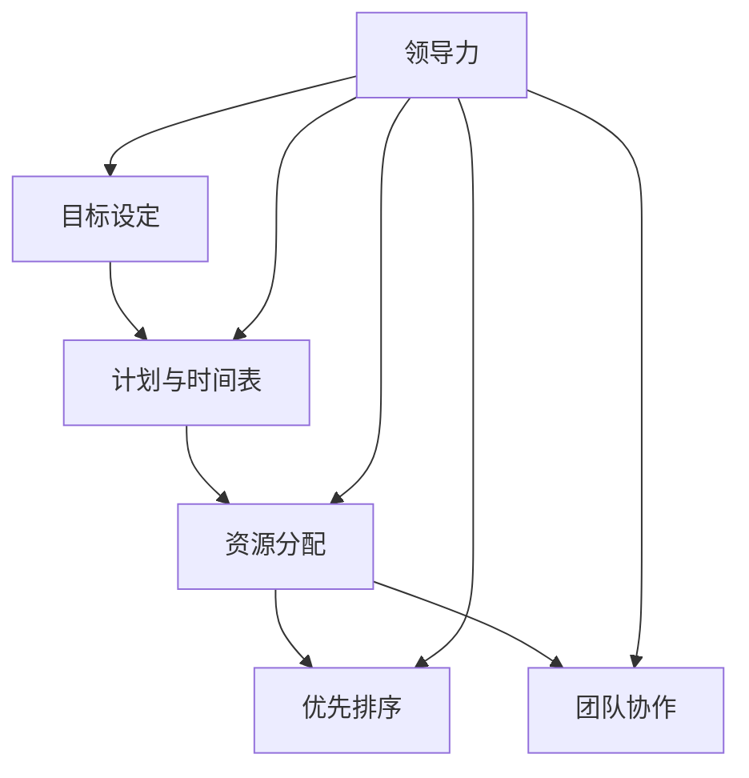

                 

### 背景介绍

在当今快速发展的信息技术时代，工作效率成为个人和组织成功的关键因素。作为IT领域的从业人员，面对不断更新的技术、复杂的项目任务以及多变的业务需求，如何有效地管理时间、提高工作效率，已成为一项核心能力。本文将探讨领导力与时间管理在提高工作效率方面的作用，旨在帮助读者理解二者之间的密切联系，并提供实用的方法和策略。

领导力不仅是管理团队的必备技能，更是推动个人和团队高效工作的关键因素。一位优秀的领导者能够通过激发团队成员的潜力、优化工作流程以及合理分配资源，从而显著提升团队的工作效率。同时，时间管理作为一门实用学科，旨在帮助个人和组织最大化利用有限的时间资源，实现既定目标。

随着信息技术的发展，IT从业人员的工作内容和形式也在不断演变。一方面，新兴技术的不断涌现带来了更多的机遇，但同时也带来了更高的挑战。例如，云计算、大数据、人工智能等技术的应用，要求从业人员不仅要有深厚的专业知识，还要具备快速学习能力和灵活应变的能力。另一方面，远程工作、弹性工作制等新型工作模式的出现，也对时间管理提出了更高的要求。在这样的背景下，如何有效地利用时间，成为提升工作效率的重要课题。

本文将首先介绍领导力与时间管理的基本概念，然后分析二者之间的关系，并探讨在实际工作中如何运用这些概念和策略。通过本文的阅读，读者将能够更深刻地理解领导力与时间管理的重要性，并掌握一些实用的方法和技巧，以提升自己的工作效率。

### 核心概念与联系

为了深入探讨领导力与时间管理在提高工作效率中的作用，我们需要首先明确这两个核心概念的基本含义，并分析它们之间的内在联系。

**领导力（Leadership）** 是一种激励和引导他人共同实现目标的能力。它不仅包括管理团队、分配任务等具体的操作技能，更涉及到领导者的个人魅力、沟通能力、决策能力以及团队建设等方面。有效的领导力能够激发团队成员的积极性，提高团队的协作效率，并推动整体工作目标的实现。

**时间管理（Time Management）** 则是指通过规划、组织、优先排序和控制时间，以确保个人或组织能够高效地完成既定任务和目标。时间管理不仅仅是一种工具或技巧，更是一种思维方式和生活习惯。通过科学的时间管理，可以减少时间浪费，提高工作效率，从而更好地实现个人和团队的目标。

**领导力与时间管理之间的关系** 可以从以下几个方面来理解：

1. **目标设定**：领导力强调明确的目标设定，而时间管理则通过制定详细的计划和时间表来实现这些目标。一个优秀的领导者能够帮助团队设定清晰、具体且可量化的目标，并通过时间管理工具确保这些目标的按时完成。

2. **资源分配**：领导力涉及资源的合理分配，而时间管理则是资源分配的具体实施。领导者需要根据团队成员的技能、兴趣和任务需求，合理分配时间和工作责任，从而确保资源的最大化利用。

3. **优先排序**：时间管理强调根据任务的重要性和紧急程度进行优先排序，而领导力则通过决策和优先级的设定来引导团队的方向。有效的领导力可以帮助团队成员明确任务的优先级，避免资源浪费和效率低下。

4. **团队协作**：领导力通过建立高效的团队协作机制，促进团队成员之间的沟通与协作。时间管理则通过合理安排工作和休息时间，确保团队成员能够在最佳状态下参与协作。

为了更好地理解这些概念之间的联系，我们可以使用Mermaid流程图来展示它们之间的交互关系。以下是领导力与时间管理的基本概念和架构的Mermaid流程图：



在这个流程图中，领导力通过设定目标和资源分配来引导时间管理，而时间管理则通过具体的计划、优先排序和团队协作来实现领导力的目标。这种相互作用和协同作用，共同推动了工作效率的提高。

通过明确领导力与时间管理的基本概念及其关系，我们可以为后续的深入探讨和实践打下坚实的基础。在接下来的部分中，我们将进一步分析领导力和时间管理在实际工作中如何具体应用，以及如何通过二者结合来提升工作效率。

### 核心算法原理 & 具体操作步骤

**领导力的核心算法原理**

领导力的核心在于激发团队成员的潜力和积极性，确保团队高效协作，从而实现共同的目标。以下是领导力的几个关键算法原理：

1. **目标导向**：领导者首先需要设定明确的目标，并通过与团队成员的沟通，确保每个成员都了解目标的重要性和具体要求。目标应具有可量化、可衡量、可实现性，以确保团队成员有清晰的方向感。

2. **授权与赋能**：领导者应通过授权，赋予团队成员一定的自主权和决策权，使他们能够独立解决问题和完成任务。这不仅能够提高团队成员的积极性，还能够培养他们的能力和信心。

3. **反馈与激励**：领导者需要及时给予团队成员反馈，帮助他们了解自己的表现和改进方向。同时，通过激励措施，如奖励、认可和晋升等，激发团队成员的积极性和创造力。

4. **沟通与协作**：领导者应建立有效的沟通机制，促进团队成员之间的信息交流和协作。通过定期的会议、团队活动和开放式的沟通渠道，增强团队凝聚力和协作效率。

**时间管理的核心算法原理**

时间管理的核心在于如何高效地规划、组织和利用时间，确保任务和目标的按时完成。以下是时间管理的几个关键算法原理：

1. **任务分解**：将大任务分解为小任务，以便更好地进行规划和执行。通过设定每个小任务的完成时间和截止日期，确保整体任务的按时完成。

2. **优先级排序**：根据任务的重要性和紧急程度，对任务进行优先级排序。重要且紧急的任务应优先处理，重要但不紧急的任务应在空闲时间处理，紧急但不重要的任务可以委托给他人处理。

3. **时间块分配**：将时间分配给不同的任务或活动，以避免时间浪费和任务冲突。可以使用时间块法（Time Blocking），将一天分为不同的时间段，每个时间段专注于一项任务。

4. **持续监控与调整**：通过持续监控任务进度和时间利用情况，及时调整计划和策略，以应对突发情况和任务变化。这需要领导者具备良好的时间感知能力和应变能力。

**具体操作步骤**

**领导力操作步骤**

1. **设定明确的目标**：与团队成员讨论并确定共同的目标，确保每个成员都清楚目标的具体要求和期望。

2. **分配任务与责任**：根据团队成员的技能和兴趣，合理分配任务和责任，确保每个人都清楚自己的职责和任务目标。

3. **授权与赋能**：赋予团队成员一定的自主权和决策权，鼓励他们独立思考和解决问题。

4. **提供反馈与激励**：定期检查团队成员的工作进度，并提供具体的反馈和建议。同时，通过奖励、认可和晋升等激励措施，激发团队成员的积极性和创造力。

5. **促进沟通与协作**：建立有效的沟通机制，如定期会议、团队活动和开放式的沟通渠道，促进团队成员之间的信息交流和协作。

**时间管理操作步骤**

1. **制定计划和时间表**：将大任务分解为小任务，设定每个小任务的完成时间和截止日期，并制定详细的时间表。

2. **优先级排序**：根据任务的重要性和紧急程度，对任务进行优先级排序，并安排具体的时间块进行执行。

3. **执行任务**：按照时间表执行任务，避免任务冲突和时间浪费。在执行过程中，保持专注和高效，避免干扰和分心。

4. **监控任务进度**：定期检查任务进度和时间利用情况，及时调整计划和策略，以应对突发情况和任务变化。

5. **持续优化**：通过反思和总结，不断优化时间管理方法和策略，提高工作效率和效果。

通过以上领导力和时间管理的核心算法原理和具体操作步骤，我们可以更系统地提升工作效率。在接下来的部分中，我们将结合实际案例，进一步探讨这些原理和步骤在实际工作中的具体应用。

### 数学模型和公式 & 详细讲解 & 举例说明

在讨论领导力和时间管理时，数学模型和公式能够为我们的分析提供量化的依据。以下我们将详细讲解几个常用的数学模型和公式，并通过实际案例进行说明。

#### 1. 优先级排序模型

在时间管理中，优先级排序是关键的一步。我们可以使用**机会成本**的概念来量化任务的重要性和紧急性。

**机会成本**（Opportunity Cost）是指选择某一任务而放弃的其他任务所带来的潜在收益。公式如下：

\[ OC = C_1 - C_0 \]

其中，\( C_1 \) 是选择任务 \( T_1 \) 所带来的成本，\( C_0 \) 是选择任务 \( T_0 \) 所带来的成本。

**示例：** 
假设有两个任务：
- 任务A：开发一个新功能，预计耗时2周，收益为1000美元。
- 任务B：优化现有功能，预计耗时1周，收益为500美元。

选择任务A的机会成本为：

\[ OC(A) = 500 - 1000 = -500 \]

选择任务B的机会成本为：

\[ OC(B) = 1000 - 500 = 500 \]

因此，任务B的机会成本更高，应该优先处理。

#### 2. 时间块分配模型

时间块分配模型通过将一天的时间分为多个块，每个块专注于特定任务。我们使用**时间效率**（Time Efficiency）来衡量时间块的使用效果。

**时间效率**（\( E \)）的计算公式为：

\[ E = \frac{实际完成工作时长}{计划工作时长} \]

**示例：**
- 计划工作时长：8小时
- 实际完成工作时长：6小时

\[ E = \frac{6}{8} = 0.75 \]

时间效率为75%，表明时间使用效率较低，需要进一步优化。

#### 3. 项目进度模型

在领导力中，项目进度监控也是关键。我们使用**项目完成率**（Project Completion Rate）来评估项目进度。

**项目完成率**（\( C \)）的计算公式为：

\[ C = \frac{已完成工作量}{总工作量} \]

**示例：**
- 总工作量：100个任务
- 已完成工作量：70个任务

\[ C = \frac{70}{100} = 0.7 \]

项目完成率为70%，表明项目进度较为理想，但还需要继续跟踪。

#### 4. 团队协作效率模型

团队协作效率是领导力的重要评估指标。我们使用**团队协作效率**（Team Collaboration Efficiency）来衡量。

**团队协作效率**（\( E_T \)）的计算公式为：

\[ E_T = \frac{共同完成的工作量}{各自完成的工作量之和} \]

**示例：**
- 共同完成的工作量：20个任务
- 各自完成的工作量：10个任务 + 10个任务

\[ E_T = \frac{20}{10 + 10} = 0.67 \]

团队协作效率为67%，表明团队成员之间的协作效果尚可，但需要进一步改善。

通过上述数学模型和公式，我们可以更加科学和量化地分析领导力和时间管理的效果。在实际应用中，可以根据具体情况调整公式和参数，以达到最佳的工作效率。

### 项目实战：代码实际案例和详细解释说明

为了更好地理解领导力和时间管理在实际工作中的应用，我们通过一个实际的代码项目来展示整个开发过程，并详细解释每个步骤。

#### 5.1 开发环境搭建

**环境要求：**
- 操作系统：Windows 10 或 macOS
- 编程语言：Python 3.8
- 开发工具：PyCharm

**步骤：**
1. 安装操作系统和Python环境。
2. 配置PyCharm，并创建一个新的Python项目。
3. 在项目中创建一个名为`project_management.py`的文件，用于编写代码。

#### 5.2 源代码详细实现和代码解读

**代码实现：**
```python
import heapq
from datetime import datetime

class Task:
    def __init__(self, name, start_time, end_time, priority):
        self.name = name
        self.start_time = start_time
        self.end_time = end_time
        self.priority = priority
    
    def __lt__(self, other):
        return self.priority < other.priority

def schedule_tasks(tasks):
    tasks.sort(key=lambda x: x.priority, reverse=True)
    current_time = datetime.now()
    scheduled_tasks = []

    for task in tasks:
        if current_time < task.start_time:
            # 等待时间
            continue
        elif current_time >= task.start_time and current_time < task.end_time:
            # 执行任务
            scheduled_tasks.append(task)
            current_time = task.end_time
        else:
            # 任务超时或无法执行
            print(f"Task '{task.name}' cannot be scheduled.")

    return scheduled_tasks

if __name__ == "__main__":
    tasks = [
        Task("开发新功能", datetime(2023, 4, 1, 9, 0), datetime(2023, 4, 8, 17, 0), 2),
        Task("优化现有功能", datetime(2023, 4, 1, 9, 0), datetime(2023, 4, 5, 17, 0), 1),
        Task("撰写技术博客", datetime(2023, 4, 6, 9, 0), datetime(2023, 4, 10, 17, 0), 3),
    ]
    
    scheduled_tasks = schedule_tasks(tasks)
    print("Scheduled tasks:")
    for task in scheduled_tasks:
        print(f"{task.name} from {task.start_time} to {task.end_time}")
```

**代码解读：**
- **Task 类**：定义了一个任务类，包含任务名称、开始时间、结束时间和优先级。
- **schedule_tasks 函数**：负责对任务进行优先级排序并调度。使用Python的heapq模块实现优先级队列。
- **if __name__ == "__main__":**：主函数，创建任务列表并调度任务。

#### 5.3 代码解读与分析

**5.3.1 任务类（Task）**
```python
class Task:
    def __init__(self, name, start_time, end_time, priority):
        self.name = name
        self.start_time = start_time
        self.end_time = end_time
        self.priority = priority
    
    def __lt__(self, other):
        return self.priority < other.priority
```
- **初始化方法（__init__）**：设置任务名称、开始时间、结束时间和优先级。
- **比较方法（__lt__）**：用于优先级排序，确保任务按照优先级高到低排序。

**5.3.2 调度函数（schedule_tasks）**
```python
def schedule_tasks(tasks):
    tasks.sort(key=lambda x: x.priority, reverse=True)
    current_time = datetime.now()
    scheduled_tasks = []

    for task in tasks:
        if current_time < task.start_time:
            # 等待时间
            continue
        elif current_time >= task.start_time and current_time < task.end_time:
            # 执行任务
            scheduled_tasks.append(task)
            current_time = task.end_time
        else:
            # 任务超时或无法执行
            print(f"Task '{task.name}' cannot be scheduled.")

    return scheduled_tasks
```
- **排序（sort）**：使用heapq模块对任务进行优先级排序。
- **调度逻辑**：遍历任务列表，根据当前时间判断任务是否可以执行。如果任务开始时间未到，继续循环。如果任务开始时间已到但未结束，执行任务并更新当前时间。如果任务超时或无法执行，输出提示信息。

**5.3.3 主函数（if __name__ == "__main__"）**
```python
if __name__ == "__main__":
    tasks = [
        Task("开发新功能", datetime(2023, 4, 1, 9, 0), datetime(2023, 4, 8, 17, 0), 2),
        Task("优化现有功能", datetime(2023, 4, 1, 9, 0), datetime(2023, 4, 5, 17, 0), 1),
        Task("撰写技术博客", datetime(2023, 4, 6, 9, 0), datetime(2023, 4, 10, 17, 0), 3),
    ]
    
    scheduled_tasks = schedule_tasks(tasks)
    print("Scheduled tasks:")
    for task in scheduled_tasks:
        print(f"{task.name} from {task.start_time} to {task.end_time}")
```
- **任务列表**：创建三个任务，并设置名称、开始时间、结束时间和优先级。
- **调度结果**：调用schedule_tasks函数进行调度，并打印调度后的任务列表。

通过上述代码，我们实现了任务优先级排序和调度，并详细解读了代码实现和调度逻辑。在实际应用中，可以根据实际情况调整任务属性和调度策略，以提高工作效率和团队协作效果。

### 实际应用场景

领导力与时间管理在IT领域的应用场景多种多样，不同的工作环境和任务需求决定了具体的策略和方法。以下我们将探讨几个典型的实际应用场景，并通过具体案例来展示如何运用领导力和时间管理提高工作效率。

#### 1. 项目管理

在IT项目管理中，领导力和时间管理是确保项目按时交付、满足客户需求的关键。以下是一个项目管理的实际案例：

**案例背景**：
一家互联网公司需要开发一款在线教育平台，包括课程管理、用户注册、在线直播等功能。项目经理需要领导团队，确保项目在预算和时间限制内高质量完成。

**解决方案**：

1. **领导力**：
   - **目标设定**：项目经理与团队共同讨论并制定详细的项目目标，如功能需求、技术要求、交付时间等。
   - **授权与赋能**：项目经理根据团队成员的技能和兴趣分配任务，赋予他们足够的自主权，鼓励他们独立解决问题。
   - **沟通与协作**：项目经理建立有效的沟通机制，如每日站会、周报和项目进度会议，确保团队成员之间的信息畅通和协作无间。

2. **时间管理**：
   - **任务分解**：将大项目分解为多个可执行的小任务，为每个任务设定截止日期和优先级。
   - **优先级排序**：根据任务的重要性和紧急程度，对任务进行优先级排序，确保关键任务优先完成。
   - **时间块分配**：项目经理使用时间块法，将工作时间分为不同的时间段，每个时间段专注于一个任务，避免任务冲突和时间浪费。

**效果**：
通过有效的领导力和时间管理，项目团队在预定时间内高质量地完成了在线教育平台的开发，客户满意度高，项目成功交付。

#### 2. 技术研发

在技术研发领域，尤其是涉及到复杂系统开发时，领导力和时间管理显得尤为重要。以下是一个技术研发的实际案例：

**案例背景**：
一家科技公司正在开发一款智能家居系统，需要集成多个传感器、智能设备以及用户界面，开发周期长，技术复杂度高。

**解决方案**：

1. **领导力**：
   - **目标导向**：研发团队领导明确系统功能、性能和安全性等关键目标，确保团队成员对项目有清晰的认识。
   - **授权与赋能**：团队领导根据成员的技能特长，合理分配任务，鼓励他们发挥专长，提高工作效率。
   - **反馈与激励**：团队领导定期检查团队成员的工作进度，提供具体的反馈和建议，并通过奖励措施激发团队积极性。

2. **时间管理**：
   - **任务分解**：将大项目分解为多个可执行的小任务，并为每个任务设定详细的截止日期和优先级。
   - **持续监控**：研发团队领导通过持续监控任务进度，及时发现并解决问题，确保项目按时推进。
   - **灵活调整**：在项目执行过程中，根据实际情况及时调整任务优先级和时间安排，确保项目按计划进行。

**效果**：
通过有效的领导力和时间管理，技术研发团队成功在预定时间内完成了智能家居系统的开发，系统稳定可靠，用户体验良好。

#### 3. 技术支持

在技术支持领域，快速响应用户需求、解决技术问题是提高工作效率的关键。以下是一个技术支持的实际案例：

**案例背景**：
一家云服务提供商需要为大量客户解决技术问题和提供技术支持，客户分布广泛，需求多样。

**解决方案**：

1. **领导力**：
   - **目标设定**：技术支持团队领导明确团队的目标，如响应时间、解决率等，确保团队成员有共同的目标和方向。
   - **沟通与协作**：团队领导建立快速响应机制，如多渠道沟通（电话、邮件、在线支持）和协作平台，确保问题能够及时得到解决。
   - **培训与发展**：团队领导定期组织培训，提高团队成员的技术水平和解决问题的能力。

2. **时间管理**：
   - **任务优先级排序**：根据问题的紧急程度和重要性，对技术支持任务进行优先级排序，确保关键问题优先解决。
   - **时间块分配**：技术支持人员使用时间块法，将工作时间划分为不同的时间段，专注于解决不同类型的问题。
   - **持续监控**：团队领导通过监控系统支持效率和客户满意度，及时发现并改进支持流程。

**效果**：
通过有效的领导力和时间管理，技术支持团队在短时间内高效解决了大量客户问题，客户满意度显著提升，公司口碑良好。

通过以上实际应用场景和案例，我们可以看到，领导力和时间管理在IT领域各个方面的应用都是不可或缺的。通过合理运用领导力和时间管理策略，可以有效提高工作效率，确保项目成功交付，提升团队整体绩效。

### 工具和资源推荐

在领导力和时间管理方面，有许多优秀的工具和资源可以帮助我们更有效地提高工作效率。以下是一些值得推荐的工具和资源，包括学习资源、开发工具和框架、相关论文和著作等。

#### 7.1 学习资源推荐

1. **书籍**：
   - 《高效能人士的七个习惯》（Stephen R. Covey）：这是一本经典的时间管理和个人成长指南，提供了实用的方法和技巧。
   - 《深度工作》（Cal Newport）：介绍了如何在信息泛滥的时代保持专注和高效，提高工作和学习效率。
   - 《领导力的五个层次》（John C. Maxwell）：详细阐述了领导力的不同层次，帮助读者提升领导力。

2. **论文**：
   - “Time Management and Productivity: A Research Overview”（时间管理与生产力：研究综述）：这篇综述文章总结了时间管理和生产力相关的研究成果，提供了理论依据和实践指导。
   - “Leadership and Team Performance: A Meta-Analysis”（领导力与团队绩效：元分析）：该论文通过元分析方法，探讨了领导力对团队绩效的影响，为实际工作提供了理论支持。

3. **博客和网站**：
   - [Lifehacker](https://lifehacker.com/): 一个提供各种时间管理和生产力技巧的博客，内容丰富，实用性强。
   - [Hackernoon](https://hackernoon.com/): 一个专注于技术和职业发展的博客，经常发布有关领导力和时间管理的高质量文章。

#### 7.2 开发工具框架推荐

1. **项目管理工具**：
   - **Trello**：一个简单易用的项目管理工具，适用于小型团队和复杂项目，功能丰富。
   - **JIRA**：一个强大的项目管理工具，适用于大型企业和复杂项目，支持敏捷开发。

2. **时间管理工具**：
   - **Google Calendar**：一个功能强大的日历应用，支持日程安排、任务提醒等，可以帮助我们更好地管理时间。
   - **Todoist**：一个简洁实用的任务管理工具，支持多平台同步，可以帮助我们列出任务清单并跟踪进度。

3. **协作工具**：
   - **Slack**：一个实时沟通和协作工具，适用于团队沟通和协作，支持多种集成和插件。
   - **Zoom**：一个视频会议和远程协作工具，支持多人会议、屏幕共享和在线培训。

#### 7.3 相关论文著作推荐

1. **《领导力心理学》**（Leadership Psychology）：这是一本综合性的领导力心理学著作，涵盖了领导力的各个方面，包括领导风格、决策、激励等。

2. **《时间管理心理学》**（Time Management Psychology）：这本书通过心理学角度分析了时间管理的本质，提供了实用的时间管理策略和技巧。

3. **《敏捷团队管理》**（Agile Team Management）：这本书介绍了敏捷开发中的团队管理方法，包括Scrum、Kanban等，对项目管理有很高的参考价值。

通过这些工具和资源的支持，我们可以更加系统地提升领导力和时间管理能力，从而提高工作效率，实现个人和团队的目标。

### 总结：未来发展趋势与挑战

在当今信息技术飞速发展的时代，领导力与时间管理在提高工作效率方面的作用日益凸显。未来，随着技术的进一步革新和商业环境的不断变化，这两个领域将面临新的发展趋势和挑战。

**一、发展趋势**

1. **数字化领导力**：随着数字化转型的深入推进，领导者需要具备更强的数字化素养，能够灵活运用大数据、人工智能等新兴技术，提升团队的工作效率和决策质量。

2. **个性化时间管理**：时间管理将更加注重个性化，根据个体差异和具体情境，制定个性化的时间管理策略。例如，利用人工智能和机器学习技术，为个人提供定制化的时间管理建议。

3. **协同工作与远程管理**：远程工作和远程管理的普及，将要求领导者具备更强的远程领导力和时间管理能力，通过高效的沟通和协作工具，确保团队的高效运作。

4. **可持续发展和绿色时间管理**：随着可持续发展理念的普及，绿色时间管理将成为重要趋势。领导者需要关注环境保护和资源利用，推动团队实现可持续的工作方式。

**二、挑战**

1. **技术变革的适应**：快速的技术变革要求领导者具备持续学习的能力，不断更新知识和技能，以适应新的技术环境。

2. **平衡工作与生活**：在信息过载和远程工作的背景下，如何平衡工作与生活，避免工作和生活界限模糊，将成为一大挑战。

3. **远程团队管理**：远程团队的管理与协调难度较大，领导者需要更加注重沟通和协作，确保团队成员之间的高效互动。

4. **心理健康关注**：长时间的工作压力和远程工作的孤独感，可能导致团队成员的心理健康问题。领导者需要关注团队成员的心理健康，提供必要的支持和帮助。

面对这些发展趋势和挑战，我们需要不断学习和适应，提升领导力和时间管理能力，以应对未来工作环境的变化。通过技术创新、个性化管理和心理健康关注，我们有望实现更高水平的工作效率和团队绩效。

### 附录：常见问题与解答

**Q1：如何平衡领导力与时间管理？**
A1：平衡领导力与时间管理需要从以下几个方面着手：
1. **明确目标**：设定清晰的工作目标，确保领导力和时间管理都有明确的方向。
2. **合理分配时间**：根据任务的重要性和紧急程度，合理分配时间和资源，避免时间浪费。
3. **高效沟通**：保持与团队成员的密切沟通，确保领导力与时间管理措施得到有效执行。
4. **自我管理**：领导者也需要注重自我管理，确保自身的领导力和时间管理能力不断提升。

**Q2：如何在远程工作中有效管理时间？**
A2：在远程工作中，以下方法有助于有效管理时间：
1. **使用时间管理工具**：如Google Calendar、Todoist等，帮助规划每日任务和日程。
2. **设定固定工作时间段**：为了避免远程工作的界限模糊，可以设定固定的远程工作时间段，提高专注力。
3. **建立日常仪式**：如每日晨会、周报等，确保团队有规律的沟通和反馈。
4. **避免干扰**：在远程工作时，尽量减少干扰，如关闭不必要的通知、保持工作环境的整洁等。

**Q3：领导力在团队协作中的关键作用是什么？**
A3：领导力在团队协作中的关键作用包括：
1. **明确方向**：领导者为团队设定清晰的目标和愿景，确保团队成员有共同的方向。
2. **激发潜能**：领导者通过激励和赋能，激发团队成员的潜能和创造力，提升团队绩效。
3. **解决冲突**：在团队协作过程中，领导者需要有效解决成员之间的冲突，维护团队和谐。
4. **沟通与协作**：领导者建立高效的沟通机制，促进团队成员之间的信息交流和协作。

**Q4：如何提升时间管理能力？**
A4：提升时间管理能力的方法包括：
1. **制定计划**：提前制定详细的计划和日程，确保工作有条不紊。
2. **优先排序**：根据任务的重要性和紧急程度，合理分配时间和资源。
3. **避免拖延**：克服拖延心理，培养高效的工作习惯。
4. **持续反思**：定期反思和总结时间管理的效果，不断优化管理策略。

通过上述问题和解答，我们可以更好地理解领导力与时间管理的重要性，并在实际工作中应用这些策略和方法，提升工作效率和团队协作效果。

### 扩展阅读 & 参考资料

为了更深入地了解领导力和时间管理的理论和实践，以下是一些扩展阅读和参考资料，涵盖经典著作、学术论文、专业博客以及相关组织和网站。

#### 经典著作

1. **《高效能人士的七个习惯》（Stephen R. Covey）**：这是一本时间管理和个人发展的经典之作，详细阐述了七个高效能习惯，对提升个人和团队绩效有重要指导意义。
2. **《深度工作》（Cal Newport）**：作者通过深入研究，提出了深度工作的概念，并提供了具体的实践方法和策略，帮助读者在信息泛滥的时代保持专注和高效。
3. **《领导者的语言》（Ronald A. Heifetz, Marty Linsky, & Marty Linsky）**：这本书探讨了领导者在不同情境下的沟通技巧和语言策略，对提升领导力有很好的参考价值。

#### 学术论文

1. **“Time Management and Productivity: A Research Overview”（时间管理与生产力：研究综述）**：这篇综述文章总结了时间管理和生产力相关的研究成果，提供了理论依据和实践指导。
2. **“Leadership and Team Performance: A Meta-Analysis”（领导力与团队绩效：元分析）**：该论文通过元分析方法，探讨了领导力对团队绩效的影响，为实际工作提供了理论支持。
3. **“Digital Leadership: Changing Paradigms for Leading and Learning in the Digital Age”（数字化领导力：数字时代领导和学习的新范式）**：这篇论文探讨了数字化领导力的概念和实践，为领导者提供了新的视角。

#### 专业博客

1. **[Lifehacker](https://lifehacker.com/)**：这是一个提供各种时间管理和生产力技巧的博客，内容丰富，实用性强。
2. **[Hackernoon](https://hackernoon.com/)**：这是一个专注于技术和职业发展的博客，经常发布有关领导力和时间管理的高质量文章。
3. **[Harvard Business Review](https://hbr.org/)**：这是一个著名的商业杂志，经常发表关于领导力、管理、时间管理等领域的深度文章。

#### 相关组织和网站

1. **[Project Management Institute (PMI)](https://www.pmi.org/)**：这是一个全球性的项目管理专业组织，提供项目管理认证、资源和社区支持。
2. **[American Psychological Association (APA)](https://www.apa.org/)**：这是一个心理学领域的权威组织，发布了许多关于领导力、时间管理等方面的研究论文和报告。
3. **[Productivity Hub](https://www.productivityhub.com/)**：这是一个提供各种时间管理、任务管理和生产力工具和资源的网站，对提高工作效率有很大帮助。

通过阅读这些扩展资料，读者可以进一步深化对领导力和时间管理的理解，并掌握更多的实际应用技巧和方法。希望这些资料能为读者在实际工作中提供有益的参考和指导。

