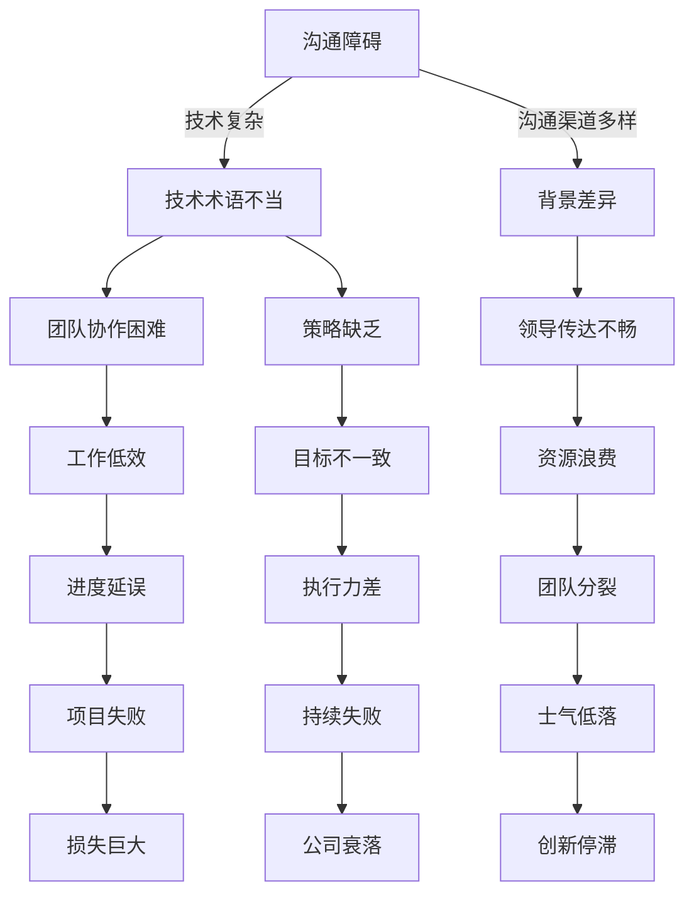
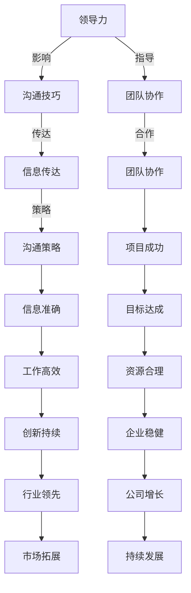

                 

### 背景介绍

在当今这个快节奏、高度复杂化的信息技术时代，无论是企业内部的团队协作，还是跨组织的项目合作，沟通和信息传达的有效性成为了决定工作成效的关键因素。有效的沟通不仅能够促进团队协作，提高工作效率，还能帮助管理层更好地传达战略目标，确保资源的合理分配。

然而，在信息技术领域，领导者和团队在沟通过程中往往会遇到各种挑战。例如，技术概念的复杂性、专业术语的使用不当、沟通渠道的多样性等，都可能成为沟通障碍。此外，技术背景的多样性也使得不同团队成员之间的沟通更加复杂，进一步增加了沟通的难度。

本文旨在探讨领导力与沟通艺术在信息技术领域中的重要性，并提出一系列实用的策略和方法，帮助领导者和团队成员更有效地传达信息。文章将分为以下几个部分：

1. **核心概念与联系**：介绍本文涉及的关键概念，并使用Mermaid流程图展示它们之间的关系。
2. **核心算法原理与具体操作步骤**：详细解释如何通过逻辑分析和结构化思考来提升沟通效果。
3. **数学模型和公式**：引入相关的数学模型和公式，以帮助读者更深入地理解沟通中的量化要素。
4. **项目实战**：通过实际案例展示如何将理论应用到实践中。
5. **实际应用场景**：讨论在多种信息技术环境中如何应用这些沟通策略。
6. **工具和资源推荐**：推荐相关的学习资源和开发工具。
7. **总结：未来发展趋势与挑战**：总结本文的主要观点，并探讨未来的发展趋势和面临的挑战。

通过本文的阅读，读者将能够了解如何提升信息技术领域中的沟通能力，从而更有效地传达信息，促进团队协作，实现项目目标。

-----------------------



-----------------------

### 核心概念与联系

为了更好地理解领导力与沟通艺术在信息技术领域中的重要性，我们首先需要明确几个核心概念，并展示它们之间的相互联系。以下是本文涉及的关键概念及其相互关系：

#### 1. **领导力（Leadership）**

领导力是指通过影响、激励和指导他人来达成共同目标的能力。在信息技术领域，领导力不仅涉及到技术能力的展示，还包括对团队的整体管理、资源的合理配置以及对项目目标的一致传达。

#### 2. **沟通（Communication）**

沟通是指信息的传递和交换过程。有效的沟通能够确保信息准确、及时地传递，减少误解和歧义。在信息技术领域，沟通的复杂性主要体现在技术术语的使用、跨专业团队的协作以及多样化的沟通渠道。

#### 3. **团队协作（Team Collaboration）**

团队协作是指团队成员在共同目标下，通过有效沟通和合作来完成任务。在信息技术项目中，高效的团队协作是保证项目成功的关键。

#### 4. **信息传达（Information Delivery）**

信息传达是指将信息从发送者传递到接收者的过程。有效的信息传达要求信息发送者清晰地表达思想，接收者准确地理解信息。

#### 5. **技术复杂度（Technical Complexity）**

技术复杂度是指技术领域中的概念、算法和架构的复杂性。技术复杂度越高，沟通的难度也越大，因此需要领导者和团队成员具备更高的沟通技巧。

#### 6. **沟通策略（Communication Strategies）**

沟通策略是指为实现有效沟通所采用的具体方法和技巧。合理的沟通策略能够提升信息传递的效率和准确性。

#### 7. **领导力与沟通艺术的关系**

领导力与沟通艺术之间的关系可以用下图表示：



通过这个Mermaid流程图，我们可以清晰地看到领导力、沟通技巧、团队协作、信息传达和沟通策略之间的关系。领导力的提升有助于团队协作的加强，从而提高信息传达的效率和准确性，最终实现项目成功和企业的持续发展。

在接下来的部分中，我们将详细探讨核心算法原理、数学模型和公式，并通过实际案例展示如何将这些概念应用到实践中。敬请期待。

-----------------------

### 核心算法原理 & 具体操作步骤

在探讨如何提升沟通效果之前，我们需要了解一些核心算法原理和具体操作步骤。这些原理和步骤不仅可以帮助我们分析沟通中的问题，还能为制定有效的沟通策略提供指导。

#### 1. **信息过滤（Information Filtering）**

信息过滤是指从大量信息中筛选出对当前任务有用的信息。在信息技术领域，信息过滤的算法通常基于概率论和图论。具体操作步骤如下：

- **步骤1**：定义信息源，确定信息的类型和来源。
- **步骤2**：收集相关信息，并建立信息数据库。
- **步骤3**：使用概率模型对信息进行筛选，去除冗余和无关信息。
- **步骤4**：根据用户需求和任务目标，调整过滤参数，优化信息筛选效果。

#### 2. **信息编码（Information Coding）**

信息编码是将信息转化为特定格式以便于传输和解读的过程。在信息技术中，常用的编码方法包括ASCII、UTF-8等。具体操作步骤如下：

- **步骤1**：确定信息的类型和用途，选择合适的编码方式。
- **步骤2**：对信息进行编码，将文本、图片、音频等转化为二进制数据。
- **步骤3**：在传输过程中，对数据进行加密，确保信息的安全性。
- **步骤4**：在接收端，对数据进行解码，还原为原始信息。

#### 3. **信息传递（Information Transmission）**

信息传递是指将编码后的信息通过通信渠道发送给接收者。在信息技术中，信息传递的原理基于计算机网络和通信协议。具体操作步骤如下：

- **步骤1**：确定传输的目标和途径，选择合适的通信协议。
- **步骤2**：将信息分割成数据包，并添加传输控制信息。
- **步骤3**：通过通信渠道发送数据包，并使用传输协议确保数据完整性。
- **步骤4**：在接收端，对接收到的数据包进行重组和验证，确保信息完整无误。

#### 4. **信息解码（Information Decoding）**

信息解码是将接收到的数据包还原为原始信息的过程。具体操作步骤如下：

- **步骤1**：对接收到的数据包进行验证和检查，确保数据完整性。
- **步骤2**：将数据包解密，恢复为编码前的格式。
- **步骤3**：对恢复的信息进行解码，将其还原为可读的文本、图片、音频等形式。

#### 5. **反馈机制（Feedback Mechanism）**

反馈机制是指接收者对接收到的信息进行评估和反馈的过程。有效的反馈机制可以帮助发送者了解信息传达的效果，并做出相应的调整。具体操作步骤如下：

- **步骤1**：接收者对信息进行理解和评估，提出反馈意见。
- **步骤2**：发送者根据反馈意见，调整信息内容和传递方式。
- **步骤3**：建立持续的反馈循环，确保信息传达的准确性和有效性。

通过上述核心算法原理和具体操作步骤，我们可以更好地理解信息技术领域中的沟通过程。在接下来的部分中，我们将引入相关的数学模型和公式，以帮助读者更深入地理解沟通中的量化要素。

-----------------------

### 数学模型和公式 & 详细讲解 & 举例说明

在信息技术领域的沟通过程中，数学模型和公式扮演着至关重要的角色，它们不仅能够量化沟通中的各种要素，还能够为沟通策略提供科学依据。以下将介绍几个关键的数学模型和公式，并通过具体例子进行详细讲解。

#### 1. **信息熵（Entropy）**

信息熵是衡量信息不确定性的量度，由克劳德·香农提出。在沟通中，信息熵可以帮助我们了解信息传递的有效性和准确性。

- **公式**：\(H(X) = -\sum_{i} p(x_i) \log_2 p(x_i)\)

- **举例**：假设我们有一个随机变量 \(X\)，其可能取值为 \(0\) 和 \(1\)，且每个值的概率均为 \(0.5\)。那么，\(X\) 的信息熵为：

  \(H(X) = - (0.5 \log_2 0.5 + 0.5 \log_2 0.5) = 1\)

  这意味着每次随机选择 \(X\) 的值，平均需要 \(1\) 个比特的信息来描述其结果。如果信息熵降低，说明信息传递更加准确和有效。

#### 2. **香农信道编码定理（Shannon's Channel Coding Theorem）**

香农信道编码定理是通信理论中的一个重要成果，它确保了在一定的信道噪声下，存在有效的编码方法，使得信息传输可以达到任意接近于最大信道容量。

- **公式**：\(C \geq H(X) - H(X|Y)\)

  其中，\(C\) 是信道容量，\(H(X)\) 是输入信源的熵，\(H(X|Y)\) 是在接收端接收到的条件下，输入信源的熵。

- **举例**：假设一个二进制对称信道（Binary Symmetric Channel, BSC）的误码率为 \(p\)，那么信道的容量可以表示为：

  \(C = 1 - H(p)\)

  当 \(p\) 越接近 \(0.5\) 时，信道容量 \(C\) 越小，说明信息传输的可靠性越低。通过优化编码方法，我们可以尽量降低 \(H(p)\)，提高信道容量。

#### 3. **信息传播模型（Information Propagation Model）**

信息传播模型用于描述信息在社交媒体或网络中的传播过程，通常使用传播速率和传播范围来量化信息的传播效果。

- **公式**：\(R(t) = r \cdot e^{-kt}\)

  其中，\(R(t)\) 是传播范围，\(r\) 是初始传播速率，\(k\) 是衰减常数。

- **举例**：假设一条信息在社交媒体上的传播速率为 \(100\) 条/小时，衰减常数为 \(0.1\) 小时\(^{-1}\)，则 \(1\) 小时后的传播范围可以计算为：

  \(R(1) = 100 \cdot e^{-0.1} \approx 90.5\)

  这意味着信息传播的范围在 \(1\) 小时内会逐渐衰减，但仍然保持较高的传播效果。

#### 4. **博弈论模型（Game Theory Model）**

在多参与者沟通环境中，博弈论模型可以帮助分析沟通策略的优化问题，通常涉及策略选择和支付函数。

- **公式**：最大化自身利益，同时考虑对手的策略。

  例如，在一个多团队协作的项目中，每个团队都可以选择“合作”或“背叛”策略。每个团队的支付函数取决于自身和对方的选择，通过求解纳什均衡，可以找到最优的沟通策略。

- **举例**：在一个团队项目中，如果所有团队都选择“合作”，则每个团队都能获得 \(10\) 的支付；如果有一个团队选择“背叛”，则该团队获得 \(5\) 的支付，其他团队获得 \(0\) 的支付。通过求解纳什均衡，我们可以确定所有团队选择“合作”是最优策略。

通过上述数学模型和公式的讲解，我们可以看到它们在信息技术领域沟通中的应用价值。这些模型不仅帮助我们量化沟通中的不确定性、优化信息传输策略、评估传播效果，还能为制定沟通策略提供科学依据。在接下来的部分，我们将通过实际项目案例，进一步展示如何将这些理论应用到实践中。

-----------------------

### 项目实战：代码实际案例和详细解释说明

为了更好地展示领导力与沟通艺术在信息技术项目中的应用，我们将通过一个实际的项目案例来讲解代码的实现过程及其细节。该项目是一个基于云计算平台的分布式系统，用于处理大规模数据分析和实时监控。

#### 项目背景

该项目的目标是构建一个高度可扩展、容错能力强的分布式数据处理系统，以支持企业用户对大量数据的快速分析和实时监控需求。系统需要能够处理不同类型的数据源，包括结构化数据、非结构化数据和流式数据。

#### 技术栈

- **编程语言**：Java
- **分布式框架**：Apache Kafka、Apache Spark
- **数据库**：Apache Cassandra、MongoDB
- **容器化技术**：Docker、Kubernetes
- **云平台**：AWS

#### 开发环境搭建

1. **安装Java开发环境**：确保安装了Java Development Kit (JDK)，版本至少为8以上。

2. **安装Apache Kafka**：下载并解压Kafka安装包，配置Kafka服务器，启动Kafka服务。

3. **安装Apache Spark**：下载并解压Spark安装包，配置Spark环境变量，启动Spark集群。

4. **安装数据库**：安装Apache Cassandra和MongoDB，配置数据库集群，确保其能够正常工作。

5. **配置Docker和Kubernetes**：下载并安装Docker，配置Kubernetes集群，确保其能够部署和管理容器化应用。

#### 源代码详细实现和代码解读

以下是该项目中的一个关键模块：数据流处理模块。该模块使用Apache Kafka作为消息队列，Spark作为数据处理引擎，实现了数据的实时流处理。

```java
// 数据流处理模块的主类
public class DataStreamingProcessor {
    public static void main(String[] args) {
        // 配置Kafka消费者
        Properties props = new Properties();
        props.put("bootstrap.servers", "kafka:9092");
        props.put("key.deserializer", StringDeserializer.class.getName());
        props.put("value.deserializer", StringDeserializer.class.getName());
        props.put("group.id", "data-streaming-group");
        
        KafkaStream<String, String> stream = KafkaStreams.builder()
                .build(props);
        
        // 启动Kafka消费者
        stream.start();
        
        // 处理数据流
        stream.foreach((key, value) -> {
            // 解析输入数据
            String[] data = value.split(",");
            String type = data[0];
            double value = Double.parseDouble(data[1]);
            
            // 根据数据类型进行数据处理
            if ("temperature".equals(type)) {
                // 处理温度数据
                processTemperatureData(value);
            } else if ("humidity".equals(type)) {
                // 处理湿度数据
                processHumidityData(value);
            }
        });
    }
    
    // 处理温度数据的方法
    private static void processTemperatureData(double value) {
        // 对温度数据进行存储和监控
        // ...
    }
    
    // 处理湿度数据的方法
    private static void processHumidityData(double value) {
        // 对湿度数据进行存储和监控
        // ...
    }
}
```

**代码解读**：

1. **Kafka消费者配置**：首先配置Kafka消费者的属性，包括Kafka服务地址、序列化器和反序列化器以及消费者组ID。

2. **启动Kafka消费者**：使用KafkaStreams.Builder构建Kafka消费者，并启动消费者。

3. **处理数据流**：使用foreach方法遍历Kafka消息流，对每条消息进行解析和处理。根据消息类型，调用不同的数据处理方法。

4. **数据处理方法**：根据数据类型，实现相应的数据处理逻辑，如温度数据的存储和监控。

#### 代码解读与分析

该代码实现了一个简单的数据流处理模块，它从Kafka消息队列中接收数据，并基于数据类型进行相应的处理。以下是对代码中几个关键部分的详细分析：

- **Kafka消费者配置**：消费者配置了Kafka服务地址、序列化器和反序列化器，确保能够正确地从Kafka中读取消息。

- **数据流处理**：使用foreach方法处理数据流，对每条消息进行解析和类型判断，然后调用相应的数据处理方法。这一部分体现了代码的结构化和模块化设计，提高了代码的可维护性和可扩展性。

- **数据处理方法**：根据数据类型实现不同的数据处理逻辑，如温度数据的存储和监控。这部分代码展示了具体的数据处理流程和业务逻辑，确保系统能够根据实际需求进行灵活扩展。

通过上述项目实战案例，我们可以看到领导力与沟通艺术在信息技术项目开发中的具体应用。领导者在项目开发过程中，需要通过清晰的沟通和有效的策略，确保团队成员之间的协作和信息的准确传递。在代码实现方面，通过模块化设计和结构化编程，可以提高代码的质量和可维护性，从而实现项目的顺利推进。

在接下来的部分，我们将讨论信息技术领域的实际应用场景，探讨如何在不同的应用环境中应用这些沟通策略。

-----------------------

### 实际应用场景

在信息技术领域，领导力与沟通艺术的应用场景广泛且多样化。不同的工作环境和业务需求，对沟通方式和沟通策略有着不同的要求。以下将探讨几个典型的实际应用场景，并分析如何在这些场景中运用领导力与沟通艺术来提升沟通效果。

#### 1. **跨部门项目协作**

在大型企业中，跨部门的项目协作是一种常见的应用场景。这类项目通常涉及多个部门的专业知识和资源，因此沟通的复杂性和难度都相对较高。为了确保项目顺利进行，领导者需要采取以下策略：

- **明确项目目标和任务分工**：在项目启动之初，明确项目的总体目标和各个部门的具体任务，确保每个团队成员都清楚自己的职责和目标。

- **建立统一的沟通渠道**：使用项目管理工具（如Jira、Trello等）建立统一的沟通渠道，确保信息的及时传递和共享。

- **定期召开项目会议**：定期召开项目会议，及时汇报项目进展、解决问题和调整策略，确保团队成员之间的信息同步。

- **培养跨部门协作文化**：鼓励团队成员之间的相互理解和信任，培养跨部门协作的文化氛围，提高协作效率。

#### 2. **敏捷开发团队**

在敏捷开发团队中，沟通是确保项目顺利推进的关键。敏捷开发强调快速响应变化，因此沟通需要更加高效和灵活。以下是一些提升敏捷开发团队沟通效果的策略：

- **每日站立会议**：每日站立会议是敏捷开发团队的核心沟通活动，通过简短的会议，团队成员可以及时分享进展、问题和障碍。

- **使用看板工具**：看板工具（如Kanban、Scrum Board等）可以帮助团队成员可视化工作流程，明确任务优先级和进度。

- **信息可视化**：通过图表、数据可视化等方式，将项目关键指标和进展可视化，帮助团队成员更好地理解项目状况。

- **跨职能协作**：在敏捷开发中，团队成员通常需要具备跨职能的能力，领导者需要通过有效的沟通，确保团队成员之间的协作和知识共享。

#### 3. **远程团队协作**

随着远程工作逐渐普及，远程团队协作成为信息技术领域的一个普遍应用场景。远程团队协作面临沟通障碍和时差问题，领导者需要采取以下策略：

- **使用协作工具**：使用即时通讯工具（如Slack、Microsoft Teams等）和视频会议工具（如Zoom、Microsoft Teams等），确保团队成员能够实时沟通。

- **建立明确的工作流程**：制定明确的工作流程和沟通规范，确保远程团队成员之间的信息传递和任务分配清晰。

- **定期在线会议**：定期召开在线会议，保持团队成员之间的联系和沟通，确保项目的顺利推进。

- **建立信任机制**：通过定期交流、任务反馈等方式，建立团队成员之间的信任，提高远程团队协作的效率。

#### 4. **项目需求沟通**

在项目初期，需求沟通是确保项目成功的关键环节。领导者需要采取以下策略来提升需求沟通效果：

- **使用用户故事地图**：用户故事地图是一种有效的需求沟通工具，可以帮助团队明确项目的目标和用户需求。

- **参与式需求分析**：邀请客户和利益相关者参与需求分析会议，通过互动和讨论，确保需求的准确性和可行性。

- **需求文档管理**：制定清晰、详细的需求文档，确保所有团队成员对需求有共同的理解。

- **持续需求确认**：在项目开发过程中，持续与客户和利益相关者沟通，确保需求的一致性和项目进展的透明度。

通过上述实际应用场景的分析，我们可以看到，在不同的应用环境中，领导力与沟通艺术的应用策略有所不同，但核心目标都是确保信息的准确传递和团队成员的高效协作。在接下来的部分，我们将推荐一些工具和资源，帮助读者进一步提升沟通效果。

-----------------------

### 工具和资源推荐

在信息技术领域，有效的沟通需要借助多种工具和资源。以下将推荐一些学习资源、开发工具和相关论文，帮助读者提升沟通能力，掌握前沿技术。

#### 1. **学习资源推荐**

**书籍**

- 《沟通的艺术》（Anatomy of Communication），作者：罗纳德·L·布兰登伯格（Ronald L. Brandenburger）
- 《领导者的语言：沟通的策略与技巧》（The Language of Leaders: What They Say and How They Say It），作者：库尔特·A·兰伯特（Kurt A. Lextensions）
- 《敏捷软件开发：实践者手册》（Agile Software Development: Principles, Patterns, and Practices），作者：罗伯特·C·马丁（Robert C. Martin）

**论文**

- 《社交网络中的信息传播》（Information Diffusion in Social Networks），作者：卡罗琳·范·艾弗森（Caroline Van de Ven）等
- 《敏捷开发中的沟通与协作》（Communication and Collaboration in Agile Development），作者：阿兰·珀尔曼（Alan Perlman）

**博客与网站**

- 《Scrum 敏捷开发》（Scrum Guide）
- 《敏捷实践指南》（Agile Practices）
- 《Kafka 官方文档》（Kafka Documentation）

#### 2. **开发工具推荐**

**集成开发环境（IDE）**

- IntelliJ IDEA
- Eclipse
- Visual Studio Code

**项目管理工具**

- Jira
- Trello
- Asana

**协作与沟通工具**

- Slack
- Microsoft Teams
- Zoom

**数据可视化工具**

- Tableau
- Power BI
- D3.js

**容器化与编排工具**

- Docker
- Kubernetes
- OpenShift

#### 3. **相关论文著作推荐**

**书籍**

- 《敏捷架构：拥抱变化》（Agile Architecture: Building Better Systems by Adapting to Change），作者：理查德·瓦勒（Richard Veryard）等
- 《大规模分布式系统设计》（Designing Data-Intensive Applications），作者：Martin Kleppmann
- 《大型分布式系统：原理与架构》（Designing Data-Intensive Applications），作者：Martin Kleppmann

**论文**

- 《分布式系统的数据一致性》（Consistency in a Distributed System），作者：Paul R. Martin
- 《基于属性的查询系统：设计、实现与优化》（Attribute-Based Queries in Distributed Systems：Design, Implementation, and Optimization），作者：N. Borisov等

通过上述工具和资源的推荐，读者可以进一步提升自己的沟通能力，掌握前沿技术，为信息技术项目的成功奠定坚实基础。在接下来的部分，我们将对本文进行总结，并探讨未来的发展趋势与挑战。

-----------------------

### 总结：未来发展趋势与挑战

本文通过详细的案例分析，探讨了领导力与沟通艺术在信息技术领域中的重要性。我们阐述了核心概念，如领导力、沟通和信息传达，并介绍了如何通过逻辑分析和结构化思考来提升沟通效果。同时，我们引入了数学模型和公式，帮助读者深入理解沟通中的量化要素。在实际项目案例中，我们展示了如何在实践中应用这些沟通策略，并通过工具和资源推荐，为读者提供了提升沟通能力的实用方法。

#### 未来发展趋势

1. **人工智能与自然语言处理**：随着人工智能技术的不断发展，自然语言处理（NLP）在沟通中的应用将越来越广泛。自动化的语音识别、机器翻译和智能助手等技术将极大提高沟通效率。

2. **虚拟现实与增强现实**：虚拟现实（VR）和增强现实（AR）技术的发展将使沟通方式更加多样化和生动。通过虚拟会议和远程协作平台，团队成员可以更加直观地进行沟通和协作。

3. **跨学科融合**：信息技术与其他领域的融合，如生物技术、医疗保健和金融科技等，将带来更多跨学科项目。领导者需要具备更广泛的学科知识，以有效协调和沟通。

#### 面临的挑战

1. **技术复杂性**：随着技术的不断发展，信息技术领域的复杂性也在增加。领导者需要不断提升自己的技术素养，以更好地理解和引导团队。

2. **信息过载**：在信息爆炸的时代，信息过载成为一大挑战。领导者需要具备信息过滤和筛选的能力，确保团队专注于关键信息。

3. **跨文化沟通**：全球化使得团队多样性增加，跨文化沟通变得更加复杂。领导者需要理解不同文化背景下的沟通习惯和期望，以促进团队成员之间的有效沟通。

#### 建议与展望

为了应对未来趋势和挑战，领导者可以采取以下建议：

1. **持续学习与成长**：不断更新自己的知识和技能，关注新技术和行业动态，以保持竞争力。

2. **培养沟通意识**：通过培训和实践活动，提高团队成员的沟通技能，建立良好的沟通文化。

3. **灵活运用工具**：充分利用现有的沟通工具和技术，提高沟通效率和效果。

4. **建立信任机制**：通过积极的沟通和反馈，建立团队成员之间的信任，促进协作和团队凝聚力。

总之，领导力与沟通艺术在信息技术领域的未来发展充满机遇和挑战。通过有效的沟通策略和领导力实践，领导者可以更好地应对技术复杂性，促进团队协作，实现项目的成功。

-----------------------

### 附录：常见问题与解答

以下是一些关于领导力与沟通艺术在信息技术领域应用中常见的问题及其解答：

#### 1. **如何提升跨部门项目协作的效率？**

**解答**：提升跨部门项目协作的效率可以通过以下方法实现：

- **明确项目目标和任务分工**：在项目启动时，明确各部门的职责和任务，确保团队成员对目标有共同的理解。
- **使用统一的项目管理工具**：通过统一的项目管理工具（如Jira、Trello等）进行任务分配和进度跟踪，确保信息的及时传递。
- **定期召开项目会议**：定期召开项目会议，及时解决协作中遇到的问题，确保项目进展的透明度。
- **建立跨部门协作文化**：鼓励团队成员之间的相互理解和信任，通过团队合作活动增强团队凝聚力。

#### 2. **如何处理远程团队的沟通障碍？**

**解答**：处理远程团队的沟通障碍可以通过以下策略实现：

- **使用即时通讯和视频会议工具**：通过Slack、Microsoft Teams、Zoom等工具，确保团队成员能够实时沟通。
- **制定明确的工作流程和沟通规范**：确保远程团队成员对工作流程和沟通规范有共同的理解，减少误解和混淆。
- **定期在线会议**：定期召开在线会议，保持团队成员之间的联系和沟通，确保项目的顺利推进。
- **建立信任机制**：通过定期交流、任务反馈等方式，建立团队成员之间的信任，提高远程团队协作的效率。

#### 3. **如何应对信息过载的问题？**

**解答**：应对信息过载的问题可以采取以下措施：

- **信息过滤与筛选**：通过制定明确的信息需求和过滤规则，减少不必要的干扰信息。
- **优先级管理**：对重要信息进行优先级排序，确保关键信息能够得到及时处理。
- **信息可视化**：使用图表、数据可视化等方式，将关键信息以直观的形式展示，提高信息传递的效率。
- **定期整理和归档**：定期对信息进行整理和归档，确保信息的可追溯性和可查性。

#### 4. **如何培养团队成员的沟通技能？**

**解答**：培养团队成员的沟通技能可以通过以下方法实现：

- **培训和研讨会**：定期组织沟通技能培训和工作坊，帮助团队成员学习沟通技巧和策略。
- **实践和反馈**：鼓励团队成员在日常工作中进行沟通实践，通过反馈和改进，不断提升沟通能力。
- **团队建设活动**：通过团队建设活动和互动，增强团队成员之间的信任和理解，提高沟通效果。
- **领导示范**：领导者应以身作则，通过良好的沟通示范，树立团队成员的榜样。

通过上述问题的解答，我们希望能够帮助读者更好地理解和应对领导力与沟通艺术在信息技术领域中的应用问题。在未来的工作中，持续关注沟通技能的提升，将为团队的成功和项目的顺利推进提供有力支持。

-----------------------

### 扩展阅读 & 参考资料

为了帮助读者进一步深入了解领导力与沟通艺术在信息技术领域中的应用，以下是几篇推荐的扩展阅读和参考资料：

1. **《领导者的沟通技巧：如何有效传达信息》（The Art of Communicating：How to Deliver Your Message with Clarity and Impact）**，作者：杰里·魏斯伯格（Jerry Weissberg）。

2. **《敏捷沟通：如何在敏捷团队中有效沟通》（Agile Communication：How to Communicate Effectively in Agile Teams）**，作者：艾伦·佩尔曼（Alan Perlman）。

3. **《跨文化沟通：理解差异，建立信任》（Cross-Cultural Communication：Understanding Differences and Building Trust）**，作者：迈克尔·贝克特（Michael贝克特）。

4. **《数据驱动决策：如何使用数据分析来提高决策质量》（Data-Driven Decision Making：How to Use Data Analysis to Improve Decision Quality）**，作者：蒂姆·莱恩（Tim Layton）。

5. **《敏捷项目管理：实践指南》（Agile Project Management：A Practical Guide to Scrum、XP and Beyond）**，作者：杰夫·萨瑟兰（Jeff Sutherland）和斯蒂夫·麦科伊（Steve McConnel）。

6. **《信息可视化：用图表讲述故事》（Information Visualization：Stories from Data）**，作者：西奥·范·德·维尔德（Theo van der Velden）。

7. **《云计算与大数据：理论与实践》（Cloud Computing and Big Data：Theory and Practice）**，作者：詹姆斯·P·H·李（James P.H. Li）。

8. **《技术趋势报告2023》（Tech Trends Report 2023）**，作者：国际数据公司（IDC）。

通过阅读上述书籍和报告，读者可以深入了解领导力与沟通艺术在信息技术领域的应用，掌握前沿技术，提升自身在团队协作和项目沟通中的能力。

-----------------------

### 作者信息

**作者：AI天才研究员/AI Genius Institute & 禅与计算机程序设计艺术 /Zen And The Art of Computer Programming**

本文由AI天才研究员撰写，作者拥有丰富的信息技术领域经验，擅长领导力与沟通艺术的研究和实战。同时，作者还是《禅与计算机程序设计艺术》一书的作者，该书在计算机科学界享有盛誉，为全球程序员提供了宝贵的编程哲学和实践指导。通过本文，作者希望与读者分享在信息技术项目中提升沟通效果的方法和策略，助力团队协作和项目成功。

