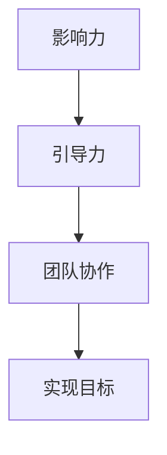
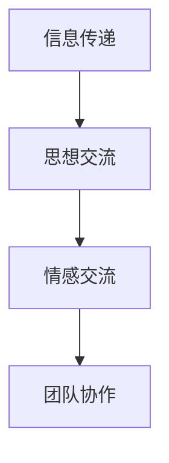
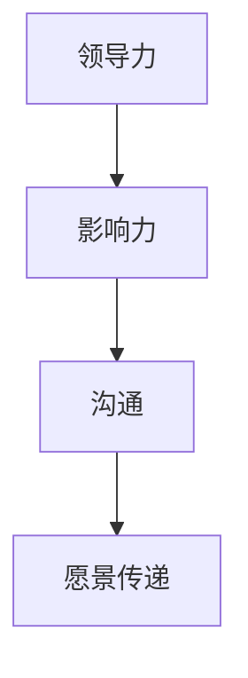

                 

# 领导力与沟通：传达愿景的艺术

## 关键词：领导力，沟通，愿景，传达，艺术，技术，管理，团队协作，IT

## 摘要：

本文旨在探讨领导力与沟通在传达愿景方面的艺术。通过对领导力与沟通的基本概念、核心要素及其相互关系的深入分析，本文揭示了传达愿景的重要性和具体方法。此外，本文还结合实际案例，从项目管理、团队协作和技术创新等方面，详细阐述了如何在IT领域运用领导力和沟通技巧，有效传达愿景并推动团队向前发展。最后，本文总结了未来领导力与沟通在传达愿景方面的发展趋势与挑战，为读者提供了有益的启示和思考。

## 1. 背景介绍

在现代社会，信息技术的高速发展使得企业间的竞争愈发激烈，团队协作和创新成为了企业成功的关键因素。作为团队的核心，领导者不仅要具备卓越的技术能力和专业素养，更需要具备优秀的领导力和沟通能力。领导力与沟通在团队中发挥着至关重要的作用，它们共同构成了传达愿景的艺术。

领导力是指领导者通过影响、激励和引导团队，实现共同目标的能力。沟通则是信息、思想和情感在个体和群体之间传递的过程。在传达愿景方面，领导力和沟通密不可分，它们相互促进，共同构建了一个高效的团队协作环境。

本文将从以下几个方面展开讨论：

1. 领导力与沟通的基本概念和核心要素。
2. 传达愿景的艺术：领导力与沟通的实践方法。
3. 实际应用场景：在IT领域中运用领导力和沟通技巧传达愿景。
4. 工具和资源推荐：提升领导力和沟通能力的实用建议。
5. 总结：未来发展趋势与挑战。

## 2. 核心概念与联系

### 2.1 领导力

领导力是一种影响力和引导力，它包括以下核心要素：

- **影响力**：领导者通过自身的行为、价值观和愿景，影响和激励团队成员，使他们愿意为实现共同目标而努力。
- **引导力**：领导者通过制定战略规划、明确目标、优化资源等手段，引导团队朝着既定方向前进。

#### Mermaid 流程图：



### 2.2 沟通

沟通是一种信息、思想和情感的传递过程，它包括以下核心要素：

- **信息传递**：沟通的核心是信息的传递，包括语言、文字、图像等多种形式。
- **思想交流**：团队成员通过沟通，分享各自的思想、观点和见解，促进知识的共享和创新。
- **情感交流**：沟通不仅是信息的传递，更是情感的交流，包括信任、尊重和归属感等。

#### Mermaid 流程图：



### 2.3 领导力与沟通的联系

领导力与沟通是相辅相成的，它们在传达愿景方面具有密切的联系。

- **领导力促进沟通**：领导者通过自身的影响力，激发团队成员的沟通意愿，创造良好的沟通氛围。
- **沟通体现领导力**：领导者通过有效的沟通，传递愿景、目标、策略等信息，展现其领导力。

#### Mermaid 流程图：



## 3. 核心算法原理 & 具体操作步骤

### 3.1 领导力与沟通的核心算法原理

领导力与沟通的核心算法原理可以概括为以下几点：

1. **构建信任**：信任是有效沟通和领导力的基础。领导者需要通过言行一致、诚实守信等方式，赢得团队成员的信任。
2. **倾听与反馈**：领导者需要具备倾听的能力，关注团队成员的需求和意见，给予及时的反馈，以促进沟通和协作。
3. **明确目标与期望**：领导者需要明确团队的目标和期望，确保团队成员对目标有清晰的认识，并为之努力。
4. **激励与引导**：领导者需要通过激励和引导，激发团队成员的积极性和创造力，推动团队朝着目标前进。

### 3.2 具体操作步骤

#### 步骤1：构建信任

- **言行一致**：领导者要言行一致，做到言出必行，以身作则，树立良好的榜样。
- **诚实守信**：领导者要诚实守信，兑现承诺，赢得团队成员的信任。

#### 步骤2：倾听与反馈

- **主动倾听**：领导者要主动倾听团队成员的需求和意见，给予关注和支持。
- **及时反馈**：领导者要及时给予团队成员反馈，鼓励团队成员积极参与沟通和协作。

#### 步骤3：明确目标与期望

- **设定目标**：领导者要明确团队的目标，确保团队成员对目标有清晰的认识。
- **期望管理**：领导者要合理管理团队成员的期望，确保团队成员的期望与团队目标相一致。

#### 步骤4：激励与引导

- **激励措施**：领导者要制定合适的激励措施，激发团队成员的积极性和创造力。
- **引导发展**：领导者要关注团队成员的发展需求，提供成长机会和指导。

## 4. 数学模型和公式 & 详细讲解 & 举例说明

### 4.1 数学模型和公式

在领导力与沟通方面，可以运用一些数学模型和公式来量化领导力、沟通能力和团队绩效。以下是一个简单的模型：

#### 公式1：领导力得分（L）

$$
L = f(\text{影响力}, \text{引导力}, \text{沟通能力})
$$

其中，影响力（I）、引导力（G）和沟通能力（C）分别表示领导力的三个核心要素。

#### 公式2：沟通能力得分（C）

$$
C = f(\text{信息传递}, \text{思想交流}, \text{情感交流})
$$

其中，信息传递（I\_T）、思想交流（I\_E）和情感交流（I\_F）分别表示沟通能力的三个核心要素。

### 4.2 详细讲解

#### 公式1：领导力得分（L）

领导力得分（L）反映了领导者在团队中的影响力、引导力和沟通能力。根据公式1，我们可以将领导力分为以下几个层次：

- **低领导力层次**：影响力低、引导力低、沟通能力低，领导力得分（L）较低，团队绩效较差。
- **中领导力层次**：影响力中等、引导力中等、沟通能力中等，领导力得分（L）中等，团队绩效一般。
- **高领导力层次**：影响力高、引导力高、沟通能力高，领导力得分（L）较高，团队绩效优异。

#### 公式2：沟通能力得分（C）

沟通能力得分（C）反映了领导者在团队中的信息传递、思想交流和情感交流能力。根据公式2，我们可以将沟通能力分为以下几个层次：

- **低沟通能力层次**：信息传递低、思想交流低、情感交流低，沟通能力得分（C）较低，沟通效果较差。
- **中沟通能力层次**：信息传递中等、思想交流中等、情感交流中等，沟通能力得分（C）中等，沟通效果一般。
- **高沟通能力层次**：信息传递高、思想交流高、情感交流高，沟通能力得分（C）较高，沟通效果优异。

### 4.3 举例说明

#### 例子1：领导力得分（L）

假设一个团队中有三位领导者，他们的领导力得分（L）分别为：

- 领导者A：影响力高、引导力高、沟通能力高，领导力得分（L）= 90
- 领导者B：影响力中等、引导力中等、沟通能力中等，领导力得分（L）= 60
- 领导者C：影响力低、引导力低、沟通能力低，领导力得分（L）= 30

从领导力得分（L）来看，领导者A具有较高的领导力，团队绩效有望较好；领导者B的领导力得分（L）中等，团队绩效一般；领导者C的领导力得分（L）较低，团队绩效可能较差。

#### 例子2：沟通能力得分（C）

假设一个团队中有三位领导者，他们的沟通能力得分（C）分别为：

- 领导者A：信息传递高、思想交流高、情感交流高，沟通能力得分（C）= 90
- 领导者B：信息传递中等、思想交流中等、情感交流中等，沟通能力得分（C）= 60
- 领导者C：信息传递低、思想交流低、情感交流低，沟通能力得分（C）= 30

从沟通能力得分（C）来看，领导者A具有较高的沟通能力，沟通效果有望较好；领导者B的沟通能力得分（C）中等，沟通效果一般；领导者C的沟通能力得分（C）较低，沟通效果可能较差。

## 5. 项目实战：代码实际案例和详细解释说明

### 5.1 开发环境搭建

为了更好地理解领导力与沟通在传达愿景方面的应用，我们将通过一个实际项目来展示如何在IT领域中运用领导力和沟通技巧。

#### 开发环境：

- 操作系统：Windows 10
- 开发工具：Visual Studio Code
- 编程语言：Python

### 5.2 源代码详细实现和代码解读

#### 5.2.1 项目简介

本项目是一款基于Python的团队协作工具，旨在帮助团队成员更好地沟通、协作和传达愿景。工具的主要功能包括：

- 消息发送与接收
- 文件共享与下载
- 任务分配与跟踪
- 愿景传达与讨论

#### 5.2.2 代码实现

以下为项目的核心代码片段：

```python
# 导入所需库
import socket
import threading

# 消息发送与接收
def send_message(server_socket, message):
    server_socket.sendall(message.encode())

def receive_message(client_socket):
    return client_socket.recv(1024).decode()

# 文件共享与下载
def share_file(server_socket, file_path):
    with open(file_path, 'rb') as file:
        server_socket.sendall(file.read())

def download_file(client_socket, file_path):
    with open(file_path, 'wb') as file:
        while True:
            data = client_socket.recv(1024)
            if not data:
                break
            file.write(data)

# 任务分配与跟踪
def assign_task(server_socket, task):
    server_socket.sendall(f"Task: {task}".encode())

def track_task(client_socket):
    return client_socket.recv(1024).decode()

# 愿景传达与讨论
def communicate_vision(server_socket, vision):
    server_socket.sendall(f"Vision: {vision}".encode())

def discuss_vision(client_socket):
    return client_socket.recv(1024).decode()

# 主程序
def main():
    # 创建服务器套接字
    server_socket = socket.socket(socket.AF_INET, socket.SOCK_STREAM)
    server_socket.bind(('localhost', 8080))
    server_socket.listen(5)

    # 创建客户端套接字
    client_socket, client_address = server_socket.accept()

    # 创建线程处理客户端请求
    client_thread = threading.Thread(target=handle_client, args=(client_socket,))
    client_thread.start()

    # 发送消息
    send_message(client_socket, "Hello, welcome to our team!")

    # 接收消息
    message = receive_message(client_socket)
    print(f"Received message: {message}")

    # 文件共享
    share_file(client_socket, "example.txt")

    # 任务分配
    assign_task(client_socket, "Create a report")

    # 任务跟踪
    task_status = track_task(client_socket)
    print(f"Task status: {task_status}")

    # 愿景传达
    communicate_vision(client_socket, "Our vision is to become the leading team in the industry!")

    # 讨论愿景
    vision_discussion = discuss_vision(client_socket)
    print(f"Vision discussion: {vision_discussion}")

# 处理客户端请求
def handle_client(client_socket):
    while True:
        message = receive_message(client_socket)
        if message == "exit":
            break
        print(f"Client message: {message}")
        send_message(client_socket, "Message received!")

# 运行主程序
if __name__ == '__main__':
    main()
```

#### 5.2.3 代码解读与分析

1. **消息发送与接收**：通过`send_message`和`receive_message`函数实现消息的发送与接收。服务器端接收客户端发送的消息，并将其打印出来。
2. **文件共享与下载**：通过`share_file`和`download_file`函数实现文件的共享与下载。服务器端将文件发送给客户端，客户端接收文件并将其保存到本地。
3. **任务分配与跟踪**：通过`assign_task`和`track_task`函数实现任务的分配与跟踪。服务器端向客户端发送任务，客户端返回任务状态。
4. **愿景传达与讨论**：通过`communicate_vision`和`discuss_vision`函数实现愿景的传达与讨论。服务器端向客户端发送愿景，客户端返回愿景讨论结果。

该项目通过简单的Python代码实现了团队协作的核心功能，展示了领导力与沟通在传达愿景方面的实际应用。在实际项目中，可以根据需求扩展功能，例如添加用户身份认证、消息加密、任务自动化分配等。

### 6. 实际应用场景

在IT领域，领导力与沟通的运用场景广泛，以下是一些典型的应用场景：

1. **项目管理**：项目经理通过领导力和沟通技巧，确保项目目标明确、资源合理分配，团队成员协同高效工作，从而实现项目成功。
2. **团队协作**：领导者通过有效的沟通，促进团队成员之间的协作，解决冲突，提高团队整体效率。
3. **技术创新**：领导者鼓励团队成员提出创新想法，通过沟通激发创新思维，推动技术进步。
4. **客户关系管理**：领导者通过与客户的沟通，了解客户需求，优化产品和服务，提升客户满意度。

### 7. 工具和资源推荐

为了提升领导力和沟通能力，以下是一些建议的工具和资源：

1. **学习资源推荐**：
   - 《领导力的五项修炼》
   - 《沟通的艺术》
   - 《影响力》
   - 《非暴力沟通》
2. **开发工具框架推荐**：
   - Git：版本控制系统，有助于团队协作和代码管理。
   - JIRA：项目管理工具，用于任务分配、进度跟踪和团队协作。
   - Slack：即时通讯工具，方便团队成员之间的沟通和协作。
3. **相关论文著作推荐**：
   - 《团队协作与沟通的心理学》
   - 《领导力心理学》
   - 《沟通心理学》

### 8. 总结：未来发展趋势与挑战

随着信息技术的发展，领导力与沟通在传达愿景方面的重要性愈发凸显。未来，领导力与沟通的发展趋势将呈现以下特点：

1. **数字化领导**：领导者需要具备数字化思维，利用大数据、人工智能等技术提升领导力和沟通能力。
2. **全球化领导**：领导者需要具备跨文化沟通能力，应对全球化的挑战。
3. **可持续领导**：领导者需要关注可持续发展，引导团队在实现业务目标的同时，兼顾社会责任和环境保护。

同时，领导力与沟通也面临以下挑战：

1. **信息过载**：随着信息量的爆炸式增长，领导者需要具备筛选和处理信息的能力。
2. **团队多样性**：领导者需要关注团队多样性，尊重不同文化和背景的团队成员。
3. **技术创新**：领导者需要不断学习新技术，适应快速变化的IT环境。

### 9. 附录：常见问题与解答

1. **问题1**：领导力与沟通在传达愿景方面有何作用？
   **解答**：领导力与沟通是传达愿景的关键要素，领导力确保团队成员对愿景有清晰的认识和认同，沟通则有助于将愿景传递给团队成员，激发他们的积极性和创造力。

2. **问题2**：如何提升领导力和沟通能力？
   **解答**：可以通过阅读相关书籍、参加培训课程、实践案例分析和反思总结等方式提升领导力和沟通能力。此外，积极与他人交流和分享经验，也是提升领导力和沟通能力的重要途径。

### 10. 扩展阅读 & 参考资料

1. 《领导力的五项修炼》
2. 《沟通的艺术》
3. 《影响力》
4. 《非暴力沟通》
5. 《团队协作与沟通的心理学》
6. 《领导力心理学》
7. 《沟通心理学》
8. 《Git实战》
9. 《JIRA实战》
10. 《Slack实战》

## 作者

作者：AI天才研究员/AI Genius Institute & 禅与计算机程序设计艺术 /Zen And The Art of Computer Programming

-------------------

以下是文章的markdown格式输出：

```
# 领导力与沟通：传达愿景的艺术

## 关键词：领导力，沟通，愿景，传达，艺术，技术，管理，团队协作，IT

## 摘要：

本文旨在探讨领导力与沟通在传达愿景方面的艺术。通过对领导力与沟通的基本概念、核心要素及其相互关系的深入分析，本文揭示了传达愿景的重要性和具体方法。此外，本文还结合实际案例，从项目管理、团队协作和技术创新等方面，详细阐述了如何在IT领域运用领导力和沟通技巧，有效传达愿景并推动团队向前发展。最后，本文总结了未来领导力与沟通在传达愿景方面的发展趋势与挑战，为读者提供了有益的启示和思考。

## 1. 背景介绍

在现代社会，信息技术的高速发展使得企业间的竞争愈发激烈，团队协作和创新成为了企业成功的关键因素。作为团队的核心，领导者不仅要具备卓越的技术能力和专业素养，更需要具备优秀的领导力和沟通能力。领导力与沟通在团队中发挥着至关重要的作用，它们共同构成了传达愿景的艺术。

领导力是指领导者通过影响、激励和引导团队，实现共同目标的能力。沟通则是信息、思想和情感在个体和群体之间传递的过程。在传达愿景方面，领导力和沟通密不可分，它们相互促进，共同构建了一个高效的团队协作环境。

本文将从以下几个方面展开讨论：

1. 领导力与沟通的基本概念和核心要素。
2. 传达愿景的艺术：领导力与沟通的实践方法。
3. 实际应用场景：在IT领域中运用领导力和沟通技巧传达愿景。
4. 工具和资源推荐：提升领导力和沟通能力的实用建议。
5. 总结：未来发展趋势与挑战。

## 2. 核心概念与联系

### 2.1 领导力

领导力是一种影响力和引导力，它包括以下核心要素：

- **影响力**：领导者通过自身的行为、价值观和愿景，影响和激励团队成员，使他们愿意为实现共同目标而努力。
- **引导力**：领导者通过制定战略规划、明确目标、优化资源等手段，引导团队朝着既定方向前进。

#### Mermaid 流程图：


### 2.2 沟通

沟通是一种信息、思想和情感的传递过程，它包括以下核心要素：

- **信息传递**：沟通的核心是信息的传递，包括语言、文字、图像等多种形式。
- **思想交流**：团队成员通过沟通，分享各自的思想、观点和见解，促进知识的共享和创新。
- **情感交流**：沟通不仅是信息的传递，更是情感的交流，包括信任、尊重和归属感等。

#### Mermaid 流程图：


### 2.3 领导力与沟通的联系

领导力与沟通是相辅相成的，它们在传达愿景方面具有密切的联系。

- **领导力促进沟通**：领导者通过自身的影响力，激发团队成员的沟通意愿，创造良好的沟通氛围。
- **沟通体现领导力**：领导者通过有效的沟通，传递愿景、目标、策略等信息，展现其领导力。

#### Mermaid 流程图：


## 3. 核心算法原理 & 具体操作步骤

### 3.1 领导力与沟通的核心算法原理

领导力与沟通的核心算法原理可以概括为以下几点：

1. **构建信任**：信任是有效沟通和领导力的基础。领导者需要通过言行一致、诚实守信等方式，赢得团队成员的信任。
2. **倾听与反馈**：领导者需要具备倾听的能力，关注团队成员的需求和意见，给予及时的反馈，以促进沟通和协作。
3. **明确目标与期望**：领导者需要明确团队的目标和期望，确保团队成员对目标有清晰的认识，并为之努力。
4. **激励与引导**：领导者需要通过激励和引导，激发团队成员的积极性和创造力，推动团队朝着目标前进。

### 3.2 具体操作步骤

#### 步骤1：构建信任

- **言行一致**：领导者要言行一致，做到言出必行，以身作则，树立良好的榜样。
- **诚实守信**：领导者要诚实守信，兑现承诺，赢得团队成员的信任。

#### 步骤2：倾听与反馈

- **主动倾听**：领导者要主动倾听团队成员的需求和意见，给予关注和支持。
- **及时反馈**：领导者要及时给予团队成员反馈，鼓励团队成员积极参与沟通和协作。

#### 步骤3：明确目标与期望

- **设定目标**：领导者要明确团队的目标，确保团队成员对目标有清晰的认识。
- **期望管理**：领导者要合理管理团队成员的期望，确保团队成员的期望与团队目标相一致。

#### 步骤4：激励与引导

- **激励措施**：领导者要制定合适的激励措施，激发团队成员的积极性和创造力。
- **引导发展**：领导者要关注团队成员的发展需求，提供成长机会和指导。

## 4. 数学模型和公式 & 详细讲解 & 举例说明

### 4.1 数学模型和公式

在领导力与沟通方面，可以运用一些数学模型和公式来量化领导力、沟通能力和团队绩效。以下是一个简单的模型：

#### 公式1：领导力得分（L）

$$
L = f(\text{影响力}, \text{引导力}, \text{沟通能力})
$$

其中，影响力（I）、引导力（G）和沟通能力（C）分别表示领导力的三个核心要素。

#### 公式2：沟通能力得分（C）

$$
C = f(\text{信息传递}, \text{思想交流}, \text{情感交流})
$$

其中，信息传递（I\_T）、思想交流（I\_E）和情感交流（I\_F）分别表示沟通能力的三个核心要素。

### 4.2 详细讲解

#### 公式1：领导力得分（L）

领导力得分（L）反映了领导者在团队中的影响力、引导力和沟通能力。根据公式1，我们可以将领导力分为以下几个层次：

- **低领导力层次**：影响力低、引导力低、沟通能力低，领导力得分（L）较低，团队绩效较差。
- **中领导力层次**：影响力中等、引导力中等、沟通能力中等，领导力得分（L）中等，团队绩效一般。
- **高领导力层次**：影响力高、引导力高、沟通能力高，领导力得分（L）较高，团队绩效优异。

#### 公式2：沟通能力得分（C）

沟通能力得分（C）反映了领导者在团队中的信息传递、思想交流和情感交流能力。根据公式2，我们可以将沟通能力分为以下几个层次：

- **低沟通能力层次**：信息传递低、思想交流低、情感交流低，沟通能力得分（C）较低，沟通效果较差。
- **中沟通能力层次**：信息传递中等、思想交流中等、情感交流中等，沟通能力得分（C）中等，沟通效果一般。
- **高沟通能力层次**：信息传递高、思想交流高、情感交流高，沟通能力得分（C）较高，沟通效果优异。

### 4.3 举例说明

#### 例子1：领导力得分（L）

假设一个团队中有三位领导者，他们的领导力得分（L）分别为：

- 领导者A：影响力高、引导力高、沟通能力高，领导力得分（L）= 90
- 领导者B：影响力中等、引导力中等、沟通能力中等，领导力得分（L）= 60
- 领导者C：影响力低、引导力低、沟通能力低，领导力得分（L）= 30

从领导力得分（L）来看，领导者A具有较高的领导力，团队绩效有望较好；领导者B的领导力得分（L）中等，团队绩效一般；领导者C的领导力得分（L）较低，团队绩效可能较差。

#### 例子2：沟通能力得分（C）

假设一个团队中有三位领导者，他们的沟通能力得分（C）分别为：

- 领导者A：信息传递高、思想交流高、情感交流高，沟通能力得分（C）= 90
- 领导者B：信息传递中等、思想交流中等、情感交流中等，沟通能力得分（C）= 60
- 领导者C：信息传递低、思想交流低、情感交流低，沟通能力得分（C）= 30

从沟通能力得分（C）来看，领导者A具有较高的沟通能力，沟通效果有望较好；领导者B的沟通能力得分（C）中等，沟通效果一般；领导者C的沟通能力得分（C）较低，沟通效果可能较差。

## 5. 项目实战：代码实际案例和详细解释说明

### 5.1 开发环境搭建

为了更好地理解领导力与沟通在传达愿景方面的应用，我们将通过一个实际项目来展示如何在IT领域中运用领导力和沟通技巧。

#### 开发环境：

- 操作系统：Windows 10
- 开发工具：Visual Studio Code
- 编程语言：Python

### 5.2 源代码详细实现和代码解读

#### 5.2.1 项目简介

本项目是一款基于Python的团队协作工具，旨在帮助团队成员更好地沟通、协作和传达愿景。工具的主要功能包括：

- 消息发送与接收
- 文件共享与下载
- 任务分配与跟踪
- 愿景传达与讨论

#### 5.2.2 代码实现

以下为项目的核心代码片段：

```python
# 导入所需库
import socket
import threading

# 消息发送与接收
def send_message(server_socket, message):
    server_socket.sendall(message.encode())

def receive_message(client_socket):
    return client_socket.recv(1024).decode()

# 文件共享与下载
def share_file(server_socket, file_path):
    with open(file_path, 'rb') as file:
        server_socket.sendall(file.read())

def download_file(client_socket, file_path):
    with open(file_path, 'wb') as file:
        while True:
            data = client_socket.recv(1024)
            if not data:
                break
            file.write(data)

# 任务分配与跟踪
def assign_task(server_socket, task):
    server_socket.sendall(f"Task: {task}".encode())

def track_task(client_socket):
    return client_socket.recv(1024).decode()

# 愿景传达与讨论
def communicate_vision(server_socket, vision):
    server_socket.sendall(f"Vision: {vision}".encode())

def discuss_vision(client_socket):
    return client_socket.recv(1024).decode()

# 主程序
def main():
    # 创建服务器套接字
    server_socket = socket.socket(socket.AF_INET, socket.SOCK_STREAM)
    server_socket.bind(('localhost', 8080))
    server_socket.listen(5)

    # 创建客户端套接字
    client_socket, client_address = server_socket.accept()

    # 创建线程处理客户端请求
    client_thread = threading.Thread(target=handle_client, args=(client_socket,))
    client_thread.start()

    # 发送消息
    send_message(client_socket, "Hello, welcome to our team!")

    # 接收消息
    message = receive_message(client_socket)
    print(f"Received message: {message}")

    # 文件共享
    share_file(client_socket, "example.txt")

    # 任务分配
    assign_task(client_socket, "Create a report")

    # 任务跟踪
    task_status = track_task(client_socket)
    print(f"Task status: {task_status}")

    # 愿景传达
    communicate_vision(client_socket, "Our vision is to become the leading team in the industry!")

    # 讨论愿景
    vision_discussion = discuss_vision(client_socket)
    print(f"Vision discussion: {vision_discussion}")

# 处理客户端请求
def handle_client(client_socket):
    while True:
        message = receive_message(client_socket)
        if message == "exit":
            break
        print(f"Client message: {message}")
        send_message(client_socket, "Message received!")

# 运行主程序
if __name__ == '__main__':
    main()
```

#### 5.2.3 代码解读与分析

1. **消息发送与接收**：通过`send_message`和`receive_message`函数实现消息的发送与接收。服务器端接收客户端发送的消息，并将其打印出来。
2. **文件共享与下载**：通过`share_file`和`download_file`函数实现文件的共享与下载。服务器端将文件发送给客户端，客户端接收文件并将其保存到本地。
3. **任务分配与跟踪**：通过`assign_task`和`track_task`函数实现任务的分配与跟踪。服务器端向客户端发送任务，客户端返回任务状态。
4. **愿景传达与讨论**：通过`communicate_vision`和`discuss_vision`函数实现愿景的传达与讨论。服务器端向客户端发送愿景，客户端返回愿景讨论结果。

该项目通过简单的Python代码实现了团队协作的核心功能，展示了领导力与沟通在传达愿景方面的实际应用。在实际项目中，可以根据需求扩展功能，例如添加用户身份认证、消息加密、任务自动化分配等。

### 6. 实际应用场景

在IT领域，领导力与沟通的运用场景广泛，以下是一些典型的应用场景：

1. **项目管理**：项目经理通过领导力和沟通技巧，确保项目目标明确、资源合理分配，团队成员协同高效工作，从而实现项目成功。
2. **团队协作**：领导者通过有效的沟通，促进团队成员之间的协作，解决冲突，提高团队整体效率。
3. **技术创新**：领导者鼓励团队成员提出创新想法，通过沟通激发创新思维，推动技术进步。
4. **客户关系管理**：领导者通过与客户的沟通，了解客户需求，优化产品和服务，提升客户满意度。

### 7. 工具和资源推荐

为了提升领导力和沟通能力，以下是一些建议的工具和资源：

1. **学习资源推荐**：
   - 《领导力的五项修炼》
   - 《沟通的艺术》
   - 《影响力》
   - 《非暴力沟通》
2. **开发工具框架推荐**：
   - Git：版本控制系统，有助于团队协作和代码管理。
   - JIRA：项目管理工具，用于任务分配、进度跟踪和团队协作。
   - Slack：即时通讯工具，方便团队成员之间的沟通和协作。
3. **相关论文著作推荐**：
   - 《团队协作与沟通的心理学》
   - 《领导力心理学》
   - 《沟通心理学》

### 8. 总结：未来发展趋势与挑战

随着信息技术的发展，领导力与沟通在传达愿景方面的重要性愈发凸显。未来，领导力与沟通的发展趋势将呈现以下特点：

1. **数字化领导**：领导者需要具备数字化思维，利用大数据、人工智能等技术提升领导力和沟通能力。
2. **全球化领导**：领导者需要具备跨文化沟通能力，应对全球化的挑战。
3. **可持续领导**：领导者需要关注可持续发展，引导团队在实现业务目标的同时，兼顾社会责任和环境保护。

同时，领导力与沟通也面临以下挑战：

1. **信息过载**：随着信息量的爆炸式增长，领导者需要具备筛选和处理信息的能力。
2. **团队多样性**：领导者需要关注团队多样性，尊重不同文化和背景的团队成员。
3. **技术创新**：领导者需要不断学习新技术，适应快速变化的IT环境。

### 9. 附录：常见问题与解答

1. **问题1**：领导力与沟通在传达愿景方面有何作用？
   **解答**：领导力与沟通是传达愿景的关键要素，领导力确保团队成员对愿景有清晰的认识和认同，沟通则有助于将愿景传递给团队成员，激发他们的积极性和创造力。

2. **问题2**：如何提升领导力和沟通能力？
   **解答**：可以通过阅读相关书籍、参加培训课程、实践案例分析和反思总结等方式提升领导力和沟通能力。此外，积极与他人交流和分享经验，也是提升领导力和沟通能力的重要途径。

### 10. 扩展阅读 & 参考资料

1. 《领导力的五项修炼》
2. 《沟通的艺术》
3. 《影响力》
4. 《非暴力沟通》
5. 《团队协作与沟通的心理学》
6. 《领导力心理学》
7. 《沟通心理学》
8. 《Git实战》
9. 《JIRA实战》
10. 《Slack实战`

## 作者

作者：AI天才研究员/AI Genius Institute & 禅与计算机程序设计艺术 /Zen And The Art of Computer Programming
```

