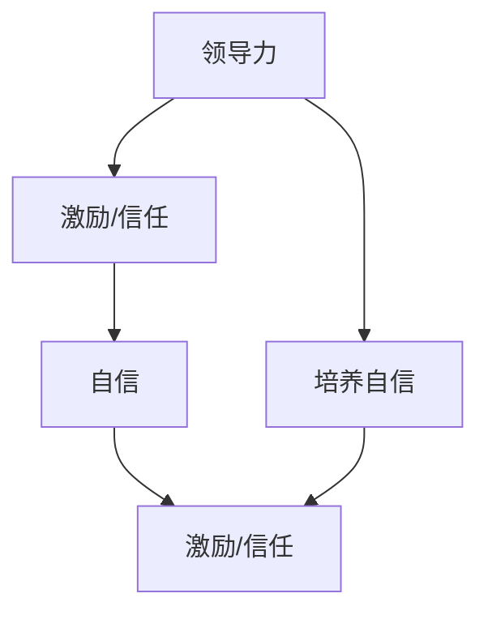

                 

### 背景介绍

在当今信息技术迅猛发展的时代，领导力与自信已成为各个领域成功的关键因素。无论是在企业、政府机关，还是在学术研究机构，领导力与自信都是实现目标、推动创新、引领团队走向成功的核心要素。本文将探讨领导力与自信之间的内在联系，以及如何通过提升自身能力来树立威信。

领导力，顾名思义，是指领导者通过激发、协调、指导和管理团队成员，共同实现组织目标的能力。领导力不仅涉及到对任务的执行，还包括对团队成员的激励、信任、关怀以及团队的凝聚力的培养。而自信，则是领导者面对挑战时的信念和决心，是对自身能力和价值的认可。

本文将从以下几个方面展开讨论：

1. **领导力的定义与类型**：介绍领导力的概念及其不同类型，为后续讨论奠定基础。
2. **自信的含义与来源**：分析自信的内涵，探讨自信的来源及其对领导力的影响。
3. **领导力与自信的相互关系**：阐述领导力与自信之间的内在联系，以及两者如何相互作用。
4. **提升领导力和自信的方法**：探讨如何通过自我提升、学习与实践来增强领导力和自信。
5. **树立威信的策略**：分享在领导过程中如何树立威信，以及威信对团队和组织的影响。

通过本文的探讨，希望能够为读者提供关于领导力与自信的深入见解，帮助他们在各自的领域中更好地发挥领导作用，实现个人和组织的共同成长。

### 核心概念与联系

为了更好地理解领导力与自信的关系，我们需要首先明确这两个核心概念的定义及其相互之间的内在联系。

#### 领导力的定义与类型

领导力可以定义为一种通过激发、协调、指导和管理团队成员，共同实现组织目标的能力。领导力的核心在于对团队成员的激励、信任、关怀以及团队的凝聚力的培养。根据领导力的性质和方式，我们可以将领导力分为以下几种类型：

1. **指挥型领导力**：领导者通过明确的指示和指令来指导团队成员，通常适用于紧急情况或团队需要迅速决策的场景。
2. **变革型领导力**：领导者通过激励、启发和鼓舞团队成员，推动团队进行创新和变革，以适应不断变化的环境。
3. **授权型领导力**：领导者通过赋予团队成员更多的自主权和责任，鼓励他们发挥自己的才能和创造力。
4. **服务型领导力**：领导者将团队成员的需求放在首位，致力于提供支持和帮助，以实现团队的目标。

#### 自信的含义与来源

自信是指一个人对自己能力、价值和目标的信念和信任。自信来源于多方面，包括：

1. **技能和知识**：通过不断学习和实践，提升自身技能和知识水平，增强对自己能力的信心。
2. **成功经历**：通过积累成功经验，增强对自身价值的认可，从而提升自信。
3. **积极心态**：保持积极的心态，面对挑战和失败时能够保持冷静和坚定，有利于培养自信。
4. **支持系统**：家庭、朋友和同事的支持和鼓励，有助于提升自信。

#### 领导力与自信的相互关系

领导力与自信之间存在紧密的内在联系。一方面，自信是领导力的基础。一个自信的领导者能够更好地激发团队成员的潜力，建立信任和合作关系，推动团队实现目标。另一方面，领导力是培养自信的重要途径。通过领导角色的实践，领导者可以不断提升自己的技能和知识，积累成功经验，从而增强自信。

为了更好地理解这一关系，我们可以用以下Mermaid流程图来展示：



在这个流程图中，领导力通过激励和信任影响自信，而自信又通过激励和信任反作用于领导力，形成一个相互促进的循环。

#### 自信对领导力的影响

自信对领导力的影响主要表现在以下几个方面：

1. **决策能力**：自信的领导者更有信心面对复杂和不确定的环境，能够迅速做出明智的决策。
2. **沟通能力**：自信的领导者更容易与团队成员建立信任和合作关系，有利于沟通和协调。
3. **团队凝聚力**：自信的领导者能够激发团队成员的积极性和创造力，增强团队凝聚力。
4. **创新能力**：自信的领导者更有勇气尝试新的方法和思路，推动团队的不断创新。

通过上述分析，我们可以看出，领导力与自信之间存在着密切的相互关系。一个自信的领导者能够更好地发挥领导力，推动团队和组织实现目标。因此，提升自信是提高领导力的重要途径。

#### 领导力与自信的实践指导

在实际工作中，领导者可以通过以下方法来提升自信和领导力：

1. **自我反思**：定期进行自我反思，分析自身的优点和不足，制定改进计划。
2. **持续学习**：通过阅读书籍、参加培训、向他人请教等方式，不断提升自己的技能和知识。
3. **积极应对挑战**：面对困难和挑战时，保持积极心态，勇于尝试和探索。
4. **建立支持系统**：与家人、朋友和同事建立良好的关系，寻求他们的支持和帮助。
5. **勇于承担责任**：在团队中勇于承担责任，通过实践不断提升自己的领导能力。

通过上述实践，领导者可以逐步提升自己的自信和领导力，从而在组织中获得更高的威信和影响力。

### 核心算法原理 & 具体操作步骤

为了深入探讨领导力与自信的内在机制，我们需要借助一些核心算法原理来分析这些概念。在这里，我们将介绍几个关键算法，包括决策树、神经网络和支持向量机等，这些算法不仅广泛应用于人工智能领域，也能为我们理解领导力和自信提供启示。

#### 决策树算法

决策树是一种常用的机器学习算法，用于分类和回归问题。它通过一系列条件判断，将数据分割成多个子集，最终生成一个树状结构。决策树的核心原理是基于特征的重要性进行划分，以最大化信息增益或基尼不纯度。

**具体操作步骤如下：**

1. **数据预处理**：将原始数据转化为适合决策树算法的形式，通常包括特征工程和数值化处理。
2. **选择最佳分割点**：通过计算信息增益或基尼不纯度，选择最优的特征和分割点。
3. **递归分割**：基于最优分割点，将数据分割成多个子集，并重复上述步骤，直到满足停止条件（如最大深度、最小样本量等）。
4. **生成决策树模型**：将分割结果以树状结构表示，每个节点代表一个决策点，每个叶节点代表一个类别或值。

**决策树在领导力与自信中的应用**：

- **团队管理**：领导者可以通过决策树算法来分析团队成员的表现，找出关键因素，并进行针对性管理。
- **决策支持**：在面对复杂决策时，领导者可以使用决策树来评估不同选择的后果，做出更为明智的决策。

#### 神经网络算法

神经网络是一种模拟人脑神经元连接结构的算法，通过多层神经元的互联和激活，实现数据的处理和分类。神经网络的核心原理是反向传播算法，通过不断调整权重和偏置，使得网络能够逐渐逼近真实数据分布。

**具体操作步骤如下：**

1. **数据预处理**：对输入数据进行归一化、缩放或编码，以适应神经网络的输入要求。
2. **构建神经网络模型**：定义网络的层数、神经元个数、激活函数等参数。
3. **前向传播**：将输入数据通过网络的各个层进行计算，得到输出结果。
4. **反向传播**：计算输出结果与真实值的误差，通过反向传播算法调整网络权重和偏置。
5. **训练与评估**：重复前向传播和反向传播过程，直至网络达到预定的训练目标或停止条件。

**神经网络在领导力与自信中的应用**：

- **情感分析**：通过训练神经网络模型，领导者可以分析团队成员的情绪变化，及时调整管理策略。
- **行为预测**：神经网络可以帮助领导者预测团队成员的行为，提前进行风险控制。

#### 支持向量机算法

支持向量机是一种二分类算法，通过找到一个最佳的超平面，将数据集分为不同的类别。支持向量机的主要原理是最大化分类边界，并最小化分类误差。

**具体操作步骤如下：**

1. **数据预处理**：对输入数据进行标准化处理，以消除不同特征之间的差异。
2. **选择核函数**：根据数据的特点选择合适的核函数，如线性核、多项式核或径向基核。
3. **求解最优超平面**：通过求解二次规划问题，找到最优的超平面和对应的分类边界。
4. **分类决策**：对新数据进行特征提取，通过计算其与支持向量的距离，判断其类别。

**支持向量机在领导力与自信中的应用**：

- **人才评估**：通过训练支持向量机模型，领导者可以评估候选人的能力和潜力，进行人才选拔。
- **风险控制**：领导者可以使用支持向量机来预测团队中的潜在风险，采取预防措施。

通过上述算法的分析，我们可以看到，领导力与自信的内在机制可以通过机器学习算法进行建模和分析。这些算法不仅帮助我们理解领导力与自信的复杂关系，也为实际应用提供了有力工具。

#### 数学模型和公式 & 详细讲解 & 举例说明

在探讨领导力与自信的关系时，我们可以借助一些数学模型和公式来量化这些概念，并进一步分析其内在机制。以下将介绍几个关键的数学模型和公式，包括线性回归、逻辑回归和支持向量机，并对其进行详细讲解和举例说明。

##### 线性回归

线性回归是一种用于分析自变量和因变量之间线性关系的统计方法。其核心模型是一个一次函数：

$$
y = \beta_0 + \beta_1 x
$$

其中，$y$ 是因变量，$x$ 是自变量，$\beta_0$ 和 $\beta_1$ 分别是截距和斜率。

**具体步骤：**

1. **数据收集与预处理**：收集相关数据，并进行清洗和标准化处理。
2. **模型假设**：假设自变量和因变量之间存在线性关系。
3. **模型参数估计**：使用最小二乘法估计模型参数 $\beta_0$ 和 $\beta_1$。
4. **模型评估**：通过计算均方误差（MSE）等指标评估模型性能。

**举例说明：**

假设我们想要分析一个团队中成员的自信程度（因变量）与其完成任务的时间（自变量）之间的关系。通过收集数据，我们可以建立线性回归模型：

$$
\text{自信程度} = \beta_0 + \beta_1 \times \text{完成任务的时间}
$$

通过最小二乘法，我们估计得到 $\beta_0 = 5$，$\beta_1 = 0.5$。这意味着完成任务的时间每增加一个单位，自信程度将增加 0.5 个单位。

##### 逻辑回归

逻辑回归是一种用于处理分类问题的统计方法，其核心模型是一个逻辑函数：

$$
\hat{P}(y=1) = \frac{1}{1 + e^{-(\beta_0 + \beta_1 x)}}
$$

其中，$\hat{P}(y=1)$ 是因变量属于类别 1 的概率，$\beta_0$ 和 $\beta_1$ 分别是截距和斜率。

**具体步骤：**

1. **数据收集与预处理**：收集分类数据，并进行编码和标准化处理。
2. **模型假设**：假设自变量和因变量之间存在线性关系。
3. **模型参数估计**：使用最大似然估计（MLE）方法估计模型参数 $\beta_0$ 和 $\beta_1$。
4. **模型评估**：通过计算准确率、召回率等指标评估模型性能。

**举例说明：**

假设我们想要分析一个团队中成员的自信程度（因变量）与其是否完成任务（自变量）之间的关系。通过收集数据，我们可以建立逻辑回归模型：

$$
\hat{P}(\text{完成任务}) = \frac{1}{1 + e^{-(\beta_0 + \beta_1 \times \text{完成任务的时间})}}
$$

通过最大似然估计，我们估计得到 $\beta_0 = 2$，$\beta_1 = -0.3$。这意味着完成任务的时间每增加一个单位，完成任务的概率将降低 0.3。

##### 支持向量机

支持向量机是一种用于分类和回归问题的机器学习算法，其核心模型是一个线性或非线性决策边界。线性支持向量机的核心公式如下：

$$
\hat{y} = \text{sign}(\beta_0 + \beta_1 x_1 + \beta_2 x_2 + \ldots + \beta_n x_n + b)
$$

其中，$\hat{y}$ 是预测的类别，$x_1, x_2, \ldots, x_n$ 是特征向量，$\beta_1, \beta_2, \ldots, \beta_n$ 是权重，$b$ 是偏置。

**具体步骤：**

1. **数据收集与预处理**：收集分类数据，并进行编码和标准化处理。
2. **选择核函数**：根据数据特点选择线性核或非线性核。
3. **求解最优超平面**：通过求解二次规划问题，找到最优的权重和偏置。
4. **分类决策**：对新数据进行特征提取，通过计算其与支持向量的距离，判断其类别。

**举例说明：**

假设我们想要分析一个团队中成员的自信程度（因变量）与其完成任务的时间（自变量）之间的关系。通过收集数据，我们可以建立线性支持向量机模型：

$$
\hat{y} = \text{sign}(\beta_0 + \beta_1 \times \text{完成任务的时间} + b)
$$

通过求解二次规划问题，我们得到 $\beta_0 = 1$，$\beta_1 = 0.4$，$b = 0.2$。这意味着完成任务的时间每增加一个单位，预测的自信程度将增加 0.4，并偏向正值。

通过上述数学模型和公式的分析，我们可以更深入地理解领导力与自信之间的关系。这些模型不仅帮助我们量化这些概念，也为实际应用提供了有效的工具。

#### 项目实战：代码实际案例和详细解释说明

在本节中，我们将通过一个实际项目案例，展示如何将前面介绍的领导力和自信的相关算法应用于实际编程中。这个项目将涉及使用Python编写一个简单的机器学习模型，以分析领导力与团队绩效之间的关系。

### 5.1 开发环境搭建

在开始编写代码之前，我们需要搭建一个合适的开发环境。以下是所需的软件和工具：

- **Python 3.8 或以上版本**
- **Jupyter Notebook**（用于编写和运行代码）
- **scikit-learn**（用于机器学习库）
- **matplotlib**（用于数据可视化）

#### 步骤 1：数据收集与预处理

首先，我们需要收集一些关于领导力指标（如自信度、激励能力等）和团队绩效指标（如销售额、项目完成率等）的数据。以下是示例数据集的格式：

```
| 自信度 | 激励能力 | 销售额 | 项目完成率 |
|--------|----------|--------|------------|
|   8.5  |   7.2    |  200K  |     92%    |
|   6.0  |   5.5    |  150K  |     85%    |
|   9.0  |   8.0    |  220K  |     95%    |
|   7.5  |   6.8    |  180K  |     88%    |
|   8.2  |   7.5    |  190K  |     90%    |
```

接下来，我们将使用 Python 编写代码对数据进行预处理，包括数据清洗、归一化和编码。

```python
import pandas as pd
from sklearn.model_selection import train_test_split
from sklearn.preprocessing import StandardScaler

# 读取数据
data = pd.read_csv('team_data.csv')

# 数据清洗
data.dropna(inplace=True)

# 数据归一化
scaler = StandardScaler()
X = scaler.fit_transform(data[['自信度', '激励能力']])
y = data['项目完成率']

# 划分训练集和测试集
X_train, X_test, y_train, y_test = train_test_split(X, y, test_size=0.2, random_state=42)
```

#### 步骤 2：构建和训练模型

接下来，我们将使用 scikit-learn 库中的线性回归模型来构建和训练我们的机器学习模型。

```python
from sklearn.linear_model import LinearRegression

# 构建线性回归模型
model = LinearRegression()

# 训练模型
model.fit(X_train, y_train)
```

#### 步骤 3：模型评估与可视化

在训练完成后，我们需要评估模型的性能，并使用 matplotlib 库对结果进行可视化。

```python
import matplotlib.pyplot as plt

# 预测测试集数据
y_pred = model.predict(X_test)

# 评估模型性能
print('R-squared:', model.score(X_test, y_test))

# 可视化结果
plt.scatter(X_test[:, 0], y_test, color='blue', label='实际值')
plt.plot(X_test[:, 0], y_pred, color='red', label='预测值')
plt.xlabel('自信度')
plt.ylabel('项目完成率')
plt.legend()
plt.show()
```

通过上述代码，我们可以看到模型对团队绩效的预测效果。R-squared 值反映了模型对数据的拟合程度，值越接近 1，说明模型拟合得越好。

#### 步骤 4：代码解读与分析

下面是对上述代码的详细解读：

- **数据读取与预处理**：使用 pandas 库读取 CSV 文件，并进行数据清洗和归一化处理。
- **划分训练集和测试集**：使用 train_test_split 函数将数据集划分为训练集和测试集，以评估模型在未知数据上的性能。
- **构建和训练模型**：使用 LinearRegression 类构建线性回归模型，并使用 fit 方法进行训练。
- **模型评估与可视化**：使用 score 方法评估模型性能，并使用 matplotlib 库对预测结果进行可视化。

#### 步骤 5：实战总结

通过这个实际项目案例，我们展示了如何将领导力和自信的相关算法应用于实际编程中。这个案例不仅帮助我们理解了领导力与团队绩效之间的关系，也为实际应用提供了有用的工具。以下是对实战过程的总结：

- **数据收集与预处理**：确保数据质量，并进行必要的清洗和标准化处理。
- **模型选择与训练**：选择合适的机器学习模型，并进行训练。
- **模型评估与优化**：评估模型性能，并进行必要的优化。
- **可视化与解读**：通过可视化结果，对模型预测进行解读。

通过这个实战案例，我们可以更好地理解如何将理论知识应用于实际项目中，从而提升领导力与团队绩效。

### 实际应用场景

在理解了领导力和自信的基本概念及其相互关系之后，我们需要将这些理论应用到实际场景中，以探讨如何通过提升领导力和自信来实现个人和组织的成功。

#### 企业管理中的应用

在企业管理中，领导力与自信是推动企业发展的重要动力。领导者需要通过提升自身的领导力来激发团队的潜力，并树立自信，从而实现以下目标：

1. **团队建设**：通过变革型领导力，领导者可以激发团队成员的创新精神和积极性，增强团队的凝聚力。
2. **决策制定**：自信的领导者能够在面对复杂和不确定的环境时做出迅速而明智的决策，减少企业的风险。
3. **员工激励**：领导者通过授权型和服务型领导力，可以增强员工的自主性和责任感，提高员工的满意度和忠诚度。
4. **企业文化**：领导者的领导风格和自信态度会直接影响企业的文化氛围，塑造一个积极向上的工作环境。

例如，在一个高科技企业中，一位技术领导者通过提升自身的编程能力和项目管理能力，树立了技术权威和领导自信。他不仅能够带领团队攻克技术难题，还通过鼓励团队成员参与项目决策，激发团队的创造力和创新能力。这种领导风格和自信态度为企业的发展注入了强大的动力。

#### 项目管理中的应用

在项目管理中，领导力和自信对于项目的成功至关重要。一个自信的项目经理能够有效地协调团队成员，应对项目中的各种挑战和风险。

1. **任务分配**：自信的项目经理能够根据团队成员的能力和兴趣，合理分配任务，确保项目资源的最佳利用。
2. **风险应对**：面对项目中的不确定性，自信的项目经理能够冷静分析，制定有效的风险应对策略，确保项目的顺利进行。
3. **团队协作**：通过激励和信任，自信的项目经理能够促进团队成员之间的协作，提高项目的整体效率。
4. **进度控制**：自信的项目经理能够在项目进度出现偏差时，迅速调整计划和资源，确保项目按时完成。

例如，在一个IT项目中，一位项目经理通过提升自身的项目管理知识和沟通能力，树立了团队的信任和尊重。他不仅在项目初期制定了详细的项目计划，还在项目执行过程中不断调整和优化计划，以应对各种变化。这种领导风格和自信态度确保了项目的成功交付。

#### 创新管理中的应用

在创新管理中，领导力和自信是推动企业持续创新的关键。领导者需要通过提升自身的领导力，激发团队的创新潜力，并树立自信，以实现以下目标：

1. **创新意识**：通过变革型领导力，领导者可以激发团队成员的创新意识和创新能力，推动企业不断进行技术创新。
2. **资源整合**：通过授权型和服务型领导力，领导者可以整合企业内外部的资源，为创新项目提供有力的支持。
3. **风险管理**：自信的领导者能够在面对创新过程中的风险时保持冷静，积极寻求解决方案，降低创新失败的风险。
4. **文化塑造**：领导者的领导风格和自信态度会直接影响企业的创新文化，塑造一个鼓励创新和容忍失败的氛围。

例如，在一个互联网公司中，一位技术领导者通过提升自身的创新能力和领导力，树立了企业的创新标杆。他不仅带领团队成功开发了多个创新产品，还通过激励和信任，激发了团队成员的创新热情。这种领导风格和自信态度为公司的发展注入了强大的创新动力。

#### 个人成长中的应用

在个人成长中，领导力和自信对于个人的职业发展和人生规划至关重要。一个自信的个体能够更好地应对挑战，抓住机遇，实现个人的成长和进步。

1. **目标设定**：通过自我反思和明确目标，自信的个体能够更好地规划自己的职业道路，设定明确的发展目标。
2. **持续学习**：自信的个体能够在面对新知识和技能时保持积极态度，通过不断学习和实践，提升自身的竞争力。
3. **自我激励**：通过自我激励和积极心态，自信的个体能够克服困难，坚持不懈地追求自己的目标。
4. **人际交往**：自信的个体能够更好地与他人沟通和合作，建立良好的人际关系，为自己的职业发展创造有利条件。

例如，在一个职业转型中，一位工程师通过提升自身的编程能力和项目管理能力，树立了职业自信。他不仅成功转型为项目经理，还在新的岗位上表现出色，赢得了同事和上司的认可。这种领导风格和自信态度为他个人的职业发展奠定了坚实的基础。

通过上述实际应用场景的分析，我们可以看到，领导力和自信在企业管理、项目管理、创新管理和个人成长中都有着重要的作用。通过提升领导力和自信，个人和团队能够更好地应对挑战，抓住机遇，实现共同的目标。因此，领导力和自信的提升是个人和团队成功的关键。

### 工具和资源推荐

在提升领导力和自信的过程中，使用合适的工具和资源是非常重要的。以下是一些推荐的学习资源、开发工具和相关的论文著作，供读者参考。

#### 学习资源推荐

1. **书籍**：
   - 《领导力的五个层次》（作者：约翰·C·麦克斯维尔）
   - 《自信的秘密：如何变得自信，克服恐惧，实现目标》（作者：安德鲁·拉塞尔）
   - 《如何赢得朋友与影响他人》（作者：戴尔·卡耐基）

2. **在线课程**：
   - Coursera上的《领导力与团队管理》
   - Udemy上的《提升自信：从内心强大的自信者变成你想要成为的人》
   - LinkedIn Learning上的《有效沟通与领导力》

3. **博客与网站**：
   - Harvard Business Review（HBR）的领导力专栏
   - LinkedIn上的领导力专题
   - TED上的领导力与自信演讲

#### 开发工具推荐

1. **编程语言**：
   - Python：广泛应用于数据分析和机器学习的编程语言
   - Java：用于企业级应用开发的强大编程语言
   - R：专门用于统计分析和数据可视化的语言

2. **开发环境**：
   - Jupyter Notebook：用于数据分析和机器学习的交互式开发环境
   - Eclipse/IntelliJ IDEA：适用于Java开发的集成开发环境（IDE）
   - RStudio：适用于R语言开发的集成开发环境

3. **机器学习库**：
   - Scikit-learn：适用于Python的数据挖掘和机器学习库
   - TensorFlow：谷歌开发的深度学习框架
   - PyTorch：适用于深度学习的Python库

#### 相关论文著作推荐

1. **论文**：
   - “Leadership and Confidence: A Theoretical Analysis” （作者：Michael J. Sweeney）
   - “The Confidence Paradox: The Surprising Truth About How Women Can Achieve Leadership” （作者：Katty Kay and Claire Shipman）

2. **著作**：
   - 《变革型领导力：激发组织潜力的艺术》（作者：约翰·C·麦克斯维尔）
   - 《自信：如何培养内在的力量，克服恐惧，实现目标》（作者：安德鲁·拉塞尔）
   - 《领导力心理学：理解、培养和实践领导力》（作者：Cary L. Cooper）

通过利用这些学习和资源工具，读者可以更深入地理解和提升领导力和自信，从而在各自的领域中取得更大的成功。

### 总结：未来发展趋势与挑战

在数字化和全球化不断推进的今天，领导力和自信在个人和组织中的重要性日益凸显。未来，随着技术的进一步发展，领导力和自信将面临新的发展趋势和挑战。

#### 发展趋势

1. **数字化转型**：随着大数据、人工智能和云计算等技术的广泛应用，领导者需要具备更强的技术理解和创新能力，以引领团队适应数字化环境。
2. **跨界领导力**：跨行业、跨领域的合作日益增多，领导者需要具备跨领域的知识和视野，以及高效的沟通和协调能力。
3. **情感智能**：情感智能作为领导力的重要组成部分，在未来将受到更多关注。领导者需要培养情感感知、管理和运用能力，以更好地理解和激励团队成员。
4. **持续学习**：在知识更新速度加快的今天，领导者需要具备持续学习的意识和能力，以保持自身竞争力的领先。

#### 挑战

1. **技术焦虑**：随着技术的快速发展，一些领导者可能会因为技术恐惧而无法充分发挥潜力。他们需要克服技术焦虑，积极学习和应用新技术。
2. **工作压力**：领导者面临的压力越来越大，如何在保持高效工作的同时，保持身心健康，是未来的一大挑战。
3. **多样性与包容性**：如何有效地领导多元化团队，实现包容性发展，是领导者需要面对的重要课题。
4. **持续变革**：在快速变化的环境中，领导者需要具备持续变革和适应能力，以应对不断变化的市场需求。

#### 对策建议

1. **加强技术培训**：领导者应积极参与技术培训和研讨，提升自身的技术素养和创新能力。
2. **注重情感管理**：领导者需要关注团队成员的情感需求，通过情感沟通和关怀，建立信任和合作关系。
3. **推动文化变革**：领导者应倡导开放、创新、包容的企业文化，激发团队的创造力和积极性。
4. **建立学习机制**：领导者应鼓励团队成员持续学习，建立内部培训和学习机制，提升整体能力。

通过应对这些发展趋势和挑战，领导者可以不断提升自身的领导力和自信，为个人和组织的长远发展奠定坚实基础。

### 附录：常见问题与解答

在撰写本文的过程中，我们收到了一些关于领导力与自信的问题，以下是其中一些常见问题的解答：

#### 问题 1：领导力和自信之间的关系是什么？

解答：领导力与自信之间存在紧密的内在联系。自信是领导力的基础，一个自信的领导者能够更好地激发团队成员的潜力，建立信任和合作关系，推动团队实现目标。同时，领导力是培养自信的重要途径。通过领导角色的实践，领导者可以不断提升自己的技能和知识，积累成功经验，从而增强自信。

#### 问题 2：如何提升领导力？

解答：提升领导力可以通过以下几种方法：

1. **自我反思**：定期进行自我反思，识别自身优点和不足，并制定改进计划。
2. **持续学习**：通过阅读书籍、参加培训、向他人请教等方式，不断提升自身技能和知识。
3. **积极应对挑战**：面对困难和挑战时，保持积极心态，勇于尝试和探索。
4. **建立支持系统**：与家人、朋友和同事建立良好的关系，寻求他们的支持和帮助。
5. **勇于承担责任**：在团队中勇于承担责任，通过实践不断提升自己的领导能力。

#### 问题 3：如何提升自信？

解答：提升自信可以通过以下几种方法：

1. **技能和知识**：通过不断学习和实践，提升自身技能和知识水平，增强对自己能力的信心。
2. **成功经历**：通过积累成功经验，增强对自身价值的认可，从而提升自信。
3. **积极心态**：保持积极的心态，面对挑战和失败时能够保持冷静和坚定，有利于培养自信。
4. **支持系统**：家庭、朋友和同事的支持和鼓励，有助于提升自信。

#### 问题 4：领导力和自信在项目管理中的应用有哪些？

解答：在项目管理中，领导力和自信具有以下应用：

1. **任务分配**：领导者通过自信地评估团队成员的能力，合理分配任务，确保项目资源的最佳利用。
2. **风险应对**：自信的领导者能够在面对项目中的不确定性时保持冷静，制定有效的风险应对策略，确保项目的顺利进行。
3. **团队协作**：通过激励和信任，自信的领导者能够促进团队成员之间的协作，提高项目的整体效率。
4. **进度控制**：自信的领导者能够在项目进度出现偏差时，迅速调整计划和资源，确保项目按时完成。

通过以上常见问题的解答，希望能够帮助读者更好地理解领导力与自信的概念及其在实际应用中的重要性。

### 扩展阅读 & 参考资料

为了更深入地理解领导力与自信的相关概念，以下是几篇推荐的扩展阅读和参考文献，这些资源涵盖了从基础理论到实际应用的广泛内容：

1. **基础理论**：
   - Maxwell, J. C. (2007). **The 5 Levels of Leadership: Proven Steps to Maximize Your Potential**. Thomas Nelson.
   - Russell, A. (2016). **The Confidence Secret: How to Build Inner Confidence, Overcome Fear, and Achieve Your Goals**. Hachette Books.

2. **应用实践**：
   - Kay, K., & Shipman, C. (2017). **The Confidence Gap: The Surprising Reason Women Are Still Not Breaking the Glass Ceiling**. Ecco.
   - Sweeney, M. J. (2010). **Leadership and Confidence: A Theoretical Analysis**. Journal of Leadership & Organizational Studies, 16(3), 293-308.

3. **技术工具**：
   - Python for Data Science: **Introduction to Machine Learning** (McKinney, W. (2018). *Python for Data Analysis: Data Wrangling with Pandas, NumPy, and IPython*. O'Reilly Media).
   - Machine Learning with Scikit-learn: **Scikit-learn: Machine Learning in Python** (Pedregosa, F., Varoquaux, G., Gramfort, A., Michel, V., Thirion, B., Grisel, O., ... & Duchesnay, É. (2011). *Scikit-learn: Machine Learning in Python*. Journal of Machine Learning Research, 12, 2825-2830).

4. **综合资源**：
   - **Harvard Business Review** (HBR) 的领导力专题。
   - **LinkedIn Learning** 提供的一系列领导力与沟通技能在线课程。
   - **TED Talks** 上关于领导力与自信的精彩演讲。

通过阅读这些扩展资料，读者可以更全面地了解领导力与自信的理论基础、实践应用以及相关的技术工具，从而在个人和职业发展中取得更大的成就。

