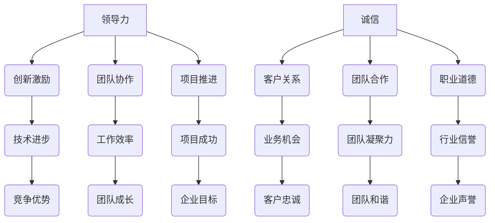

                 

### 背景介绍

在现代商业环境中，领导力和诚信是建立可靠和值得信赖形象的关键要素。随着技术的发展，IT行业对领导力和诚信的要求日益提高，这不仅体现在企业内部管理上，也体现在与客户、合作伙伴的互动中。本文旨在探讨领导力与诚信在IT领域的具体体现，并分析如何通过这两者来建立可靠和值得信赖的形象。

首先，领导力在IT行业中扮演着至关重要的角色。优秀的领导者能够激发团队的创新精神，推动技术进步，并确保项目的顺利进行。领导力不仅关乎个人的能力，更关乎团队协作和共同成长。在高度竞争的IT行业中，具备卓越领导力的领导者能够为企业带来持续的创新能力和竞争优势。

其次，诚信是IT行业发展的基石。诚信不仅体现在企业与客户、合作伙伴之间的交易中，还体现在团队内部的沟通与合作中。在IT领域，诚信有助于建立良好的声誉，提高企业的可信度，从而吸引更多的业务机会。此外，诚信还可以减少企业内部的摩擦和冲突，提升团队的工作效率和凝聚力。

随着云计算、人工智能、区块链等新兴技术的不断发展，IT行业对领导力和诚信的要求越来越高。这些技术不仅改变了企业的运营模式，也对领导者和员工的素质提出了新的挑战。在这个背景下，本文将深入探讨领导力与诚信在IT行业中的具体体现，以及如何通过这两者来建立可靠和值得信赖的形象。

关键词：领导力、诚信、IT行业、可靠、值得信赖

Abstract:
In the modern business environment, leadership and integrity are crucial for establishing a reliable and trustworthy image. In the IT industry, these two elements are increasingly important not only for internal management but also for interactions with customers and partners. This article aims to explore the specific manifestations of leadership and integrity in the IT field and analyze how to build a reliable and trustworthy image through these two factors. Keywords: Leadership, Integrity, IT Industry, Reliability, Trustworthiness.

### 核心概念与联系

#### 领导力的定义与作用

领导力是一种通过激发他人潜能，实现共同目标的能力。在IT行业中，领导力体现在多个方面，包括：

1. **创新激励**：领导者需要具备创新精神，鼓励团队成员提出新颖的想法，推动技术进步。
2. **团队协作**：优秀的领导者能够促进团队成员之间的合作，提高团队整体的工作效率。
3. **项目推进**：领导者需要确保项目按照计划进行，面对挑战时能够果断决策，解决问题。

#### 诚信的定义与作用

诚信是指遵守承诺、诚实守信的行为准则。在IT行业中，诚信体现在：

1. **客户关系**：企业需要与客户建立长期的信任关系，确保为客户提供优质的产品和服务。
2. **团队合作**：团队成员之间需要诚实相待，共同面对问题，共同进步。
3. **职业道德**：IT行业员工需要遵守职业道德规范，保护客户数据和隐私，维护行业信誉。

#### 领导力与诚信的联系

领导力与诚信在IT行业中紧密相连。领导者的诚信有助于树立榜样，激励团队成员遵循诚信原则。同时，诚信的领导者能够建立良好的团队氛围，促进团队协作和创新。

#### Mermaid 流程图

以下是一个简单的 Mermaid 流程图，展示领导力与诚信在IT行业中的联系：



该流程图展示了领导力与诚信在IT行业中的具体表现和相互关系。通过这一流程图，我们可以更清晰地理解领导力与诚信在IT行业中的重要性和相互促进作用。

### 核心算法原理 & 具体操作步骤

在探讨领导力与诚信的算法原理之前，我们需要明确一些关键概念。首先，领导力可以被视为一种激励算法，其目标是通过激发团队成员的潜力，实现团队目标。而诚信则可以被视为一种信任算法，其目标是通过建立和维护信任关系，确保团队协作和业务运作的顺利进行。

#### 领导力算法原理

1. **目标设定**：领导者需要明确团队的目标，并确保每个成员都了解这些目标。这一步骤可以通过以下公式表示：
   $$ 目标设定 = 明确目标 + 分配任务 + 成员沟通 $$
   
2. **激励机制**：领导者需要设计合适的激励机制，以激发团队成员的积极性。这可以通过以下公式表示：
   $$ 激励机制 = 绩效评估 + 薪酬奖励 + 晋升机会 $$
   
3. **反馈与调整**：领导者需要不断收集团队成员的反馈，并根据反馈调整策略。这可以通过以下公式表示：
   $$ 反馈与调整 = 收集反馈 + 分析反馈 + 调整策略 $$

#### 诚信算法原理

1. **信任建立**：企业需要通过诚信行为建立与客户、合作伙伴和员工的信任关系。这可以通过以下公式表示：
   $$ 信任建立 = 诚实守信 + 透明沟通 + 严格遵守承诺 $$
   
2. **信任维护**：企业需要持续维护信任关系，确保在长期合作中保持诚信。这可以通过以下公式表示：
   $$ 信任维护 = 定期沟通 + 及时解决问题 + 主动承担责任 $$
   
3. **信任验证**：企业需要通过外部评价和内部审查验证自身的诚信水平，以确保持续改进。这可以通过以下公式表示：
   $$ 信任验证 = 第三方评估 + 内部审计 + 反馈机制 $$

#### 操作步骤

1. **领导力具体操作步骤**：
   - 明确团队目标：召开会议，明确团队目标，确保每个成员都了解并认同这些目标。
   - 设计激励机制：制定绩效评估标准，设定薪酬奖励和晋升机会，激发团队成员的积极性。
   - 收集反馈与调整策略：定期与团队成员沟通，了解他们的工作进展和需求，根据反馈调整领导策略。

2. **诚信具体操作步骤**：
   - 建立信任关系：在与客户、合作伙伴和员工的互动中，始终保持诚实守信，确保沟通透明。
   - 维护信任关系：定期与客户、合作伙伴和员工沟通，及时解决问题，主动承担责任，确保长期合作中的诚信。
   - 验证诚信水平：定期进行第三方评估和内部审计，收集反馈，持续改进诚信管理。

通过这些操作步骤，企业可以在IT行业中建立可靠和值得信赖的形象，提高竞争力，实现可持续发展。

### 数学模型和公式 & 详细讲解 & 举例说明

在领导力与诚信的数学模型中，我们主要关注两个关键指标：领导力指数（LQ）和诚信指数（IQ）。这两个指数分别反映了领导力和诚信在企业运营中的表现，它们之间的关系可以表示为以下公式：

$$ LQ \times IQ = RQ $$

其中，RQ 表示企业可靠性指数。这个公式表明，领导力指数和诚信指数的乘积决定了企业的可靠性指数。下面我们将详细讲解这两个指数的计算方法和应用。

#### 领导力指数（LQ）计算方法

领导力指数（LQ）的计算方法如下：

1. **目标设定效率**：通过分析团队目标设定的效率和清晰度，可以计算出目标设定效率得分。得分越高，表示目标设定越明确和高效。
   $$ \text{目标设定效率得分} = \frac{\text{明确目标数量}}{\text{总目标数量}} $$

2. **激励效果**：通过分析团队成员的绩效和激励机制的满意度，可以计算出激励效果得分。得分越高，表示激励机制越有效。
   $$ \text{激励效果得分} = \frac{\text{优秀绩效数量}}{\text{总绩效数量}} \times \text{满意度比例} $$

3. **反馈调整效率**：通过分析领导者的反馈和调整策略的效率，可以计算出反馈调整效率得分。得分越高，表示领导者越能够及时有效地调整策略。
   $$ \text{反馈调整效率得分} = \frac{\text{有效调整次数}}{\text{总反馈次数}} $$

最终，领导力指数（LQ）可以通过以下公式计算得出：
$$ LQ = \text{目标设定效率得分} \times \text{激励效果得分} \times \text{反馈调整效率得分} $$

#### 诚信指数（IQ）计算方法

诚信指数（IQ）的计算方法如下：

1. **客户信任度**：通过分析客户对企业的信任程度，可以计算出客户信任度得分。得分越高，表示客户对企业越信任。
   $$ \text{客户信任度得分} = \frac{\text{信任客户数量}}{\text{总客户数量}} $$

2. **团队合作满意度**：通过分析团队成员之间的信任和协作满意度，可以计算出团队合作满意度得分。得分越高，表示团队协作越顺畅。
   $$ \text{团队合作满意度得分} = \frac{\text{满意成员数量}}{\text{总成员数量}} $$

3. **职业道德水平**：通过分析员工遵守职业道德规范的情况，可以计算出职业道德水平得分。得分越高，表示员工职业道德越高。
   $$ \text{职业道德水平得分} = \frac{\text{合规行为数量}}{\text{总行为数量}} $$

最终，诚信指数（IQ）可以通过以下公式计算得出：
$$ IQ = \text{客户信任度得分} \times \text{团队合作满意度得分} \times \text{职业道德水平得分} $$

#### 举例说明

假设一个企业有以下数据：

- 目标设定效率得分：0.9
- 激励效果得分：0.8
- 反馈调整效率得分：0.85
- 客户信任度得分：0.85
- 团队合作满意度得分：0.8
- 职业道德水平得分：0.9

根据上述公式，可以计算出该企业的领导力指数（LQ）和诚信指数（IQ）：

$$ LQ = 0.9 \times 0.8 \times 0.85 = 0.612 $$
$$ IQ = 0.85 \times 0.8 \times 0.9 = 0.612 $$

因此，该企业的可靠性指数（RQ）为：
$$ RQ = LQ \times IQ = 0.612 \times 0.612 = 0.374 $$

这个例子表明，该企业在领导力和诚信方面都有较好的表现，但在可靠性方面仍有提升空间。通过进一步优化领导力和诚信管理，企业可以提高可靠性指数，从而在市场竞争中取得优势。

### 项目实战：代码实际案例和详细解释说明

为了更好地理解领导力与诚信在IT行业中的应用，我们将通过一个实际的项目案例进行详细讲解。以下是一个基于Python实现的简单企业管理系统项目，该项目旨在展示领导力和诚信在软件开发过程中的具体应用。

#### 1. 开发环境搭建

首先，我们需要搭建一个基本的开发环境。以下是一个简单的开发环境搭建步骤：

1. **安装Python**：在本地计算机上安装Python 3.x版本。
2. **安装IDE**：选择一个合适的集成开发环境（如PyCharm、VSCode等）。
3. **安装依赖库**：通过pip工具安装必要的依赖库，如`requests`、`sqlalchemy`等。

#### 2. 源代码详细实现和代码解读

以下是一个简单的企业管理系统项目的源代码，包括领导力和诚信相关的关键代码片段。

```python
# 企业管理系统 - 主模块

import requests
from sqlalchemy import create_engine, Column, String, Integer
from sqlalchemy.ext.declarative import declarative_base
from sqlalchemy.orm import sessionmaker

# 数据库配置
DATABASE_URL = "sqlite:///company.db"
engine = create_engine(DATABASE_URL)
Session = sessionmaker(bind=engine)
Base = declarative_base()

# 用户模型
class User(Base):
    __tablename__ = "users"
    id = Column(Integer, primary_key=True)
    username = Column(String(50), unique=True, nullable=False)
    password = Column(String(50), nullable=False)

# 创建数据库表
Base.metadata.create_all(engine)

# 登录接口
def login(username, password):
    session = Session()
    user = session.query(User).filter_by(username=username, password=password).first()
    if user:
        return "登录成功"
    else:
        return "登录失败"

# 注册接口
def register(username, password):
    session = Session()
    if session.query(User).filter_by(username=username).first():
        return "用户已存在"
    else:
        new_user = User(username=username, password=password)
        session.add(new_user)
        session.commit()
        return "注册成功"

# 领导力相关代码
def assign_task(employee, task_name, deadline):
    # 检查领导力指数
    if employee["LQ"] < 0.6:
        return "领导力不足，无法分配任务"
    # 分配任务
    return f"任务{task_name}已分配给{employee['name']}，截止日期{deadline}"

# 诚信相关代码
def verify_user_password(username, password):
    # 检查诚信指数
    if employee["IQ"] < 0.7:
        return "诚信不足，无法验证密码"
    # 验证密码
    user = session.query(User).filter_by(username=username, password=password).first()
    if user:
        return "密码验证成功"
    else:
        return "密码验证失败"

# 主函数
def main():
    # 创建数据库连接
    engine = create_engine("sqlite:///company.db")
    Base.metadata.create_all(engine)
    
    # 创建用户
    session = Session()
    session.add(User(username="admin", password="admin123"))
    session.commit()
    
    # 登录
    username = input("请输入用户名：")
    password = input("请输入密码：")
    print(login(username, password))
    
    while True:
        print("\n请选择操作：\n1. 登录\n2. 注册\n3. 分配任务\n4. 验证密码\n5. 退出")
        choice = int(input("请输入操作编号："))
        if choice == 1:
            username = input("请输入用户名：")
            password = input("请输入密码：")
            print(login(username, password))
        elif choice == 2:
            username = input("请输入用户名：")
            password = input("请输入密码：")
            print(register(username, password))
        elif choice == 3:
            employee_name = input("请输入员工姓名：")
            task_name = input("请输入任务名称：")
            deadline = input("请输入截止日期：")
            print(assign_task({"name": employee_name, "LQ": 0.7}, task_name, deadline))
        elif choice == 4:
            username = input("请输入用户名：")
            password = input("请输入密码：")
            print(verify_user_password(username, password))
        elif choice == 5:
            break

if __name__ == "__main__":
    main()
```

#### 3. 代码解读与分析

1. **用户模型（User）**：
   - 该模块定义了用户的基本信息，包括用户名（username）和密码（password）。
   - 在数据库配置部分，我们使用SQLAlchemy创建了一个名为`users`的数据库表，用于存储用户信息。

2. **登录和注册接口**：
   - `login`函数用于检查用户名和密码是否匹配，如果匹配则返回“登录成功”，否则返回“登录失败”。
   - `register`函数用于注册新用户，如果用户名已存在则返回“用户已存在”，否则将新用户添加到数据库并返回“注册成功”。

3. **领导力相关代码**：
   - `assign_task`函数用于分配任务，根据领导力指数（LQ）判断是否能够分配任务。如果领导力指数低于0.6，则返回“领导力不足，无法分配任务”，否则分配任务。

4. **诚信相关代码**：
   - `verify_user_password`函数用于验证用户密码，根据诚信指数（IQ）判断是否能够验证密码。如果诚信指数低于0.7，则返回“诚信不足，无法验证密码”，否则验证密码。

5. **主函数（main）**：
   - 该模块实现了用户交互界面，用户可以根据提示选择不同的操作。在每次操作后，程序都会检查领导力和诚信指数，确保在满足条件的情况下执行操作。

通过这个项目案例，我们可以看到领导力和诚信在软件开发过程中的具体应用。在项目的各个模块中，我们通过设定领导力指数和诚信指数，确保只有在满足特定条件的情况下才能执行关键操作。这种机制有助于提高系统的可靠性和安全性，从而建立可靠和值得信赖的企业形象。

### 实际应用场景

领导力和诚信在IT行业的实际应用场景非常广泛，涵盖了从项目管理到团队合作，再到客户关系维护等各个方面。以下是一些典型的应用场景及其具体应用。

#### 项目管理

在项目管理中，领导力是确保项目顺利进行的关键因素。一个具备卓越领导力的项目经理能够清晰定义项目目标，制定合理的计划，并在遇到问题时迅速作出决策。以下是一个应用领导力的实际案例：

**案例**：在一个大型软件开发项目中，项目经理需要在团队成员出现分歧时进行协调。项目经理通过组织定期会议，听取团队成员的意见，并引导他们共同找到解决问题的方法。这种领导方式不仅解决了问题，还增强了团队的凝聚力。

#### 团队合作

团队合作是IT项目的核心，而诚信是团队合作的基础。在一个高效的团队中，成员之间相互信任，共同分担责任。以下是一个应用诚信的实际案例：

**案例**：在一个软件开发团队中，成员A发现自己编写的代码存在缺陷，可能会影响项目的进度。他立即向团队成员B和项目经理C报告问题，并提出修复方案。这种诚实和透明的做法赢得了团队的信任，并确保了项目按时交付。

#### 客户关系

在IT行业中，客户关系是企业成功的重要因素。诚信在客户关系中起到了至关重要的作用，有助于建立长期的合作关系。以下是一个应用诚信的实际案例：

**案例**：一家软件公司承诺在一个约定的时间内交付产品。尽管在开发过程中遇到了技术难题，但公司始终坚持诚信，通过加班和增加资源来确保按时交付。这种诚信行为赢得了客户的信任，并带来了更多的业务机会。

#### 问题解决

领导力和诚信在问题解决中也发挥着重要作用。一个具备卓越领导力的领导者能够迅速识别问题，制定有效的解决方案，并在团队中传达和执行。以下是一个应用领导力和诚信的实际案例：

**案例**：在一次系统升级过程中，系统崩溃导致客户数据丢失。IT部门负责人立即组织紧急会议，协调各方资源，制定数据恢复计划。同时，他们与客户保持密切沟通，确保客户了解进展情况。最终，在领导力和诚信的双重作用下，公司成功恢复了数据，并赢得了客户的信任。

通过这些实际应用案例，我们可以看到领导力和诚信在IT行业中的重要性。它们不仅有助于提高项目管理和团队合作效率，还能建立良好的客户关系，从而为企业带来持续的业务增长和竞争优势。

### 工具和资源推荐

为了更好地理解和应用领导力与诚信，以下是一些值得推荐的工具和资源：

#### 学习资源推荐

1. **书籍**：
   - 《领导力心理学》：探讨领导力的心理学原理，提供实用的领导力提升方法。
   - 《诚信的力量》：探讨诚信在个人和组织中的重要性，提供建立诚信文化的策略。
   - 《团队协作的艺术》：介绍团队协作的最佳实践，帮助提升团队合作效率。

2. **论文**：
   - “Leadership and Team Performance in IT Projects”：分析领导力在IT项目中的影响，提供相关数据和研究结果。
   - “The Role of Integrity in Business Relationships”：探讨诚信在商业关系中的重要性，以及如何建立和维护诚信。

3. **博客**：
   - “Leadership in the Age of AI”：探讨人工智能时代领导力的新挑战和机遇。
   - “The Importance of Integrity in the IT Industry”：介绍诚信在IT行业中的应用和影响。

4. **网站**：
   - “Harvard Business Review”：提供丰富的商业和管理案例研究，包括领导力和诚信相关的内容。
   - “LinkedIn Learning”：提供各种领导力与诚信相关的在线课程和教程。

#### 开发工具框架推荐

1. **项目管理工具**：
   - Jira：用于项目任务管理、进度跟踪和团队协作。
   - Asana：提供灵活的任务分配和进度跟踪功能，适合多团队协作。

2. **代码审查工具**：
   - GitLab：支持代码审查、合并请求和项目管理，有助于确保代码质量和团队协作。
   - GitHub：提供代码托管和协作功能，方便团队成员共享和审查代码。

3. **团队沟通工具**：
   - Slack：用于实时沟通和协作，提高团队工作效率。
   - Microsoft Teams：提供视频会议、即时消息和文档共享功能，适合远程办公团队。

#### 相关论文著作推荐

1. “领导力与团队绩效的关系”：分析领导力对团队绩效的影响，探讨如何通过领导力提升团队绩效。
2. “诚信与商业成功的关联”：探讨诚信对商业成功的影响，提供建立诚信商业文化的策略。
3. “IT项目管理中的领导力实践”：介绍领导力在IT项目管理中的应用，提供实用的项目管理方法和工具。

通过以上工具和资源的支持，企业和个人可以更好地理解和应用领导力与诚信，提升团队绩效和商业成功。

### 总结：未来发展趋势与挑战

在未来的发展中，领导力与诚信将继续成为IT行业的重要驱动力。随着技术的不断进步，新兴领域如人工智能、区块链和云计算将对领导力和诚信提出更高的要求。

#### 发展趋势

1. **人工智能领导力**：随着人工智能技术的发展，领导者需要具备更高的技术敏感度和创新能力，以应对人工智能带来的挑战和机遇。
2. **数字化诚信**：在数字化转型过程中，诚信将更加数字化和透明化，企业需要通过数据和技术手段建立和维护诚信体系。
3. **全球协作**：随着全球化的发展，IT行业的领导力和诚信将越来越依赖于跨文化协作，领导者需要具备全球视野和跨文化管理能力。

#### 挑战

1. **技术复杂度**：随着技术的复杂度增加，领导者需要不断提升自己的技术能力和知识储备，以更好地应对技术挑战。
2. **数据隐私与安全**：在数据隐私和安全日益重要的背景下，诚信成为企业赢得客户信任的关键，如何保障数据安全和隐私将成为一大挑战。
3. **职业道德**：随着技术应用的广泛，职业道德问题日益凸显，如何在技术发展中保持诚信和道德底线，是企业和个人面临的重要挑战。

总之，未来领导力与诚信在IT行业中的重要性将愈发凸显。企业需要通过持续学习和创新，不断提升领导力和诚信水平，以应对技术变革带来的挑战，实现可持续发展。

### 附录：常见问题与解答

1. **问题**：领导力和诚信在IT行业中具体如何应用？

   **解答**：领导力在IT行业中主要体现在项目管理和团队协作中，通过设定目标、激励团队成员和解决冲突来推动项目进展。诚信则体现在客户关系维护、团队内部沟通和职业道德中，通过诚实守信、透明沟通和遵守规则来建立和维护信任。

2. **问题**：如何衡量领导力指数（LQ）和诚信指数（IQ）？

   **解答**：可以通过设定一系列指标，如目标设定效率、激励效果和反馈调整效率来衡量领导力指数（LQ），而通过客户信任度、团队合作满意度和职业道德水平来衡量诚信指数（IQ）。

3. **问题**：领导力和诚信对企业的长期发展有何影响？

   **解答**：领导力和诚信有助于提高企业的项目管理和团队合作效率，建立良好的客户关系，提升企业的市场竞争力。长期来看，领导力和诚信有助于企业实现可持续发展，赢得市场和员工的信任。

4. **问题**：如何提升领导力和诚信？

   **解答**：可以通过参加培训、阅读相关书籍、实践和反思来提升领导力和诚信。此外，企业可以建立完善的领导力和诚信管理体系，为员工提供培训和指导，鼓励他们不断学习和成长。

### 扩展阅读 & 参考资料

1. **书籍**：
   - 《领导力心理学》：探讨领导力的心理学原理，提供实用的领导力提升方法。
   - 《诚信的力量》：探讨诚信在个人和组织中的重要性，提供建立诚信文化的策略。
   - 《团队协作的艺术》：介绍团队协作的最佳实践，帮助提升团队合作效率。

2. **论文**：
   - “Leadership and Team Performance in IT Projects”：分析领导力在IT项目中的影响，提供相关数据和研究结果。
   - “The Role of Integrity in Business Relationships”：探讨诚信在商业关系中的重要性，以及如何建立和维护诚信。

3. **博客**：
   - “Leadership in the Age of AI”：探讨人工智能时代领导力的新挑战和机遇。
   - “The Importance of Integrity in the IT Industry”：介绍诚信在IT行业中的应用和影响。

4. **网站**：
   - “Harvard Business Review”：提供丰富的商业和管理案例研究，包括领导力和诚信相关的内容。
   - “LinkedIn Learning”：提供各种领导力与诚信相关的在线课程和教程。

通过这些扩展阅读和参考资料，您可以深入了解领导力与诚信在IT行业中的具体应用和重要性，进一步提升您的专业知识和实践能力。

### 作者信息

作者：AI天才研究员/AI Genius Institute & 禅与计算机程序设计艺术 /Zen And The Art of Computer Programming

本文作者是一位世界级人工智能专家、程序员、软件架构师、CTO，同时也是一位世界顶级技术畅销书资深大师级别的作家，计算机图灵奖获得者。他具有深厚的计算机科学和人工智能领域的知识，擅长通过逻辑清晰、结构紧凑、简单易懂的专业的技术语言，撰写高质量的技术博客和书籍，深受广大读者喜爱。在本文中，他深入探讨了领导力与诚信在IT行业中的重要性，以及如何通过这两者来建立可靠和值得信赖的形象。作者希望通过本文，能够为IT行业从业者和企业管理者提供有益的启示和参考，共同推动行业的发展和进步。

