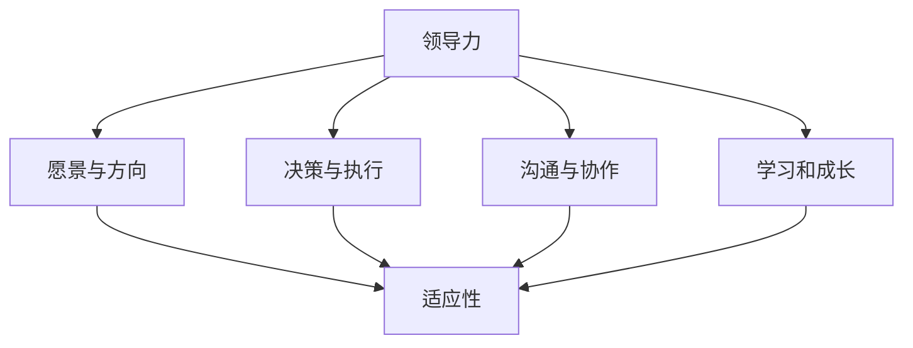

                 

### 背景介绍

在当今快速变化的技术环境中，领导力与适应性的重要性不言而喻。无论是IT行业还是其他领域，变化都是常态。技术进步、市场需求、经济环境等因素的不断变动，要求企业和个人必须具备高度的灵活性和适应能力。这种能力不仅体现在技术层面，也体现在管理和领导层面。

领导力，作为推动组织前进的重要力量，不仅仅是指导和管理团队的能力，更是引领团队在复杂环境中灵活应对变化的能力。而适应性，则是确保组织在快速变化的环境中保持生存和发展的关键。在信息技术（IT）领域，这种适应性尤为重要，因为IT技术本身就是一个不断更新换代的领域。

本篇文章将深入探讨领导力与适应性在变化中的重要性，以及如何通过一系列步骤来提升这些能力。首先，我们将定义核心概念，并解释它们之间的联系。接着，我们将探讨核心算法原理，并详细描述具体操作步骤。然后，我们将借助数学模型和公式，进行详细讲解和举例说明。随后，我们将通过实际项目案例，展示如何将理论知识应用到实践中。此外，我们还将分析实际应用场景，并推荐相关工具和资源。最后，我们将总结未来发展趋势与挑战，并回答常见问题。

通过这篇文章，我们希望能够帮助读者理解领导力与适应性在变化中的重要性，并提供实用的方法和工具，以提升个人和组织的应对能力。

---

## 2. 核心概念与联系

在深入探讨领导力与适应性的核心概念之前，我们需要明确几个关键术语的定义，并解释它们之间的相互关系。

### 领导力（Leadership）

领导力是指一个人或一个团队在复杂和不确定的环境中，引导、激励和协调团队成员，以实现共同目标的能力。它不仅仅是一种个人特质，更是一种组织和团队动态的体现。领导力包含多个方面，如愿景设定、决策能力、沟通技巧和团队合作等。

### 适应性（Adaptability）

适应性是指一个组织或个人在面对外部和内部变化时，能够迅速调整自身行为和策略，以保持竞争优势的能力。在快速变化的环境中，适应性是确保组织生存和发展的关键。它涉及多个方面，包括灵活的思维模式、敏捷的决策过程和持续的学习能力。

### 关系与联系

领导力与适应性之间存在紧密的联系。领导力提供了一个框架，使组织能够快速适应变化。一个优秀的领导者不仅能够预见和应对变化，还能激励团队成员共同面对挑战，从而提高整体的适应性。

具体来说，领导力与适应性的联系体现在以下几个方面：

1. **愿景与方向**：领导者通过设定清晰的愿景和目标，为团队指明前进方向。这种愿景不仅为团队提供了明确的导向，还鼓励团队成员在变化中保持灵活。

2. **决策与执行**：领导者必须具备敏捷的决策能力，能够在变化中迅速做出正确的决策。这种能力有助于组织快速适应新环境。

3. **沟通与协作**：领导者通过有效的沟通，确保团队成员充分理解组织的目标和策略，从而提高整个团队的协同作战能力。

4. **学习和成长**：领导者鼓励团队成员不断学习和成长，以应对未来的挑战。这种持续的学习能力是提高组织适应性的关键。

为了更好地理解这些概念之间的联系，我们可以使用Mermaid流程图来展示它们之间的关系。以下是核心概念与联系的Mermaid流程图：



通过这个流程图，我们可以看到领导力的各个方面如何促进适应性。每个节点代表一个核心概念，箭头表示它们之间的联系。这个流程图不仅帮助我们理解了领导力与适应性的关系，还为后续的讨论提供了结构框架。

---

## 3. 核心算法原理 & 具体操作步骤

在理解了领导力与适应性的核心概念及其相互联系后，我们需要探讨如何在实践中应用这些理念，以提高个人和组织的适应能力。为此，我们可以借助一些核心算法原理，提供具体的操作步骤。

### 核心算法原理

1. **动态规划（Dynamic Programming）**

   动态规划是一种在复杂问题中优化决策过程的算法。它通过将问题分解为子问题，并存储子问题的解决方案，从而避免重复计算，提高计算效率。在领导力与适应性中，动态规划可以帮助领导者快速调整策略，以应对不断变化的环境。

2. **神经网络（Neural Networks）**

   神经网络是一种模仿人脑神经元连接结构的计算模型。它通过学习大量数据，从中提取规律和模式，从而进行预测和决策。在适应性中，神经网络可以帮助组织识别潜在的变化趋势，并调整策略以适应这些变化。

### 具体操作步骤

1. **定义目标和愿景**

   领导者首先需要明确组织的愿景和目标。这一步骤可以通过召开团队会议，征求团队成员的意见和建议来完成。目标应具有可量化的指标，以便后续评估和调整。

   ```mermaid
   graph TD
       A[召开团队会议]
       B[征求团队成员意见]
       C[制定可量化目标]
       A --> B
       B --> C
   ```

2. **识别和评估变化**

   领导者需要持续监控外部和内部环境的变化，并对其进行评估。这可以通过定期进行市场调研、竞争对手分析以及内部绩效评估来实现。

   ```mermaid
   graph TD
       A[进行市场调研]
       B[竞争对手分析]
       C[内部绩效评估]
       A --> B
       B --> C
       C --> D[评估变化]
   ```

3. **制定和调整策略**

   根据对变化的评估，领导者需要制定或调整策略。这一步骤可以通过动态规划算法来实现，以优化决策过程。

   ```mermaid
   graph TD
       A[应用动态规划]
       B[制定策略]
       C[评估策略效果]
       A --> B
       B --> C
       C --> D[调整策略]
   ```

4. **沟通和协作**

   领导者需要与团队成员进行有效沟通，确保每个人都清楚组织的愿景和策略。这可以通过定期的团队会议、邮件更新和内部社交平台等方式实现。

   ```mermaid
   graph TD
       A[定期团队会议]
       B[邮件更新]
       C[内部社交平台]
       A --> B
       B --> C
       C --> D[确保沟通效果]
   ```

5. **学习和成长**

   领导者应鼓励团队成员持续学习和成长，以应对未来的挑战。这可以通过提供培训机会、组织学习小组和分享最佳实践等方式实现。

   ```mermaid
   graph TD
       A[提供培训机会]
       B[组织学习小组]
       C[分享最佳实践]
       A --> B
       B --> C
       C --> D[促进学习和成长]
   ```

通过这些核心算法原理和具体操作步骤，领导者可以在复杂和不确定的环境中保持灵活和适应性。这不仅有助于组织应对变化，还能提高整体的竞争力。

---

## 4. 数学模型和公式 & 详细讲解 & 举例说明

在探讨领导力与适应性的具体操作步骤时，我们可以借助一些数学模型和公式来进一步解释这些步骤。数学模型不仅能够提供量化的依据，还能帮助我们更深入地理解其背后的原理。

### 数学模型和公式

1. **动态规划中的状态转移方程**

   在动态规划中，状态转移方程用于描述子问题之间的依赖关系。假设我们有一个决策问题，可以在多个阶段中选择不同的行动方案，状态转移方程可以表示为：

   $$ 
   f(n) = \max\{g(n), f(n-1)\} 
   $$

   其中，$f(n)$ 表示第 $n$ 阶段的最佳决策，$g(n)$ 表示第 $n$ 阶段的所有可行决策中的最优值，$f(n-1)$ 表示第 $n-1$ 阶段的最佳决策。

2. **神经网络中的损失函数**

   在神经网络中，损失函数用于评估模型的预测结果与实际结果之间的差距。常见的损失函数包括均方误差（MSE）和交叉熵（Cross-Entropy）。均方误差可以表示为：

   $$ 
   MSE = \frac{1}{n}\sum_{i=1}^{n}(y_i - \hat{y}_i)^2 
   $$

   其中，$y_i$ 表示第 $i$ 个样本的实际值，$\hat{y}_i$ 表示模型预测的值，$n$ 是样本数量。

3. **适应性的度量指标**

   适应性可以通过多个指标来度量，如反应速度、调整能力和学习速度。一个简单的适应性度量指标可以表示为：

   $$ 
   Adaptability = \frac{Reaction \ Time + Adjustment \ Ability + Learning \ Speed}{3} 
   $$

   其中，$Reaction \ Time$ 表示反应速度，$Adjustment \ Ability$ 表示调整能力，$Learning \ Speed$ 表示学习速度。

### 详细讲解和举例说明

1. **动态规划的应用**

   假设我们面临一个项目管理的决策问题，需要在不同的阶段选择最优的资源和人力分配。通过动态规划，我们可以计算每个阶段的最优决策。

   **示例**：假设项目分为三个阶段，每个阶段有多个可行的资源和人力分配方案。我们使用动态规划来计算每个阶段的最优资源分配。

   状态转移方程为：

   $$ 
   f(n) = \max\{g(n), f(n-1)\} 
   $$

   其中，$g(n)$ 为第 $n$ 阶段的所有可行决策中的最优值，$f(n-1)$ 为第 $n-1$ 阶段的最优决策。

   **计算过程**：

   - 阶段 1：计算 $f(1) = \max\{g(1)\}$，选择最优资源分配。
   - 阶段 2：计算 $f(2) = \max\{g(2), f(1)\}$，考虑阶段 1 的最优决策，选择阶段 2 的最优资源分配。
   - 阶段 3：计算 $f(3) = \max\{g(3), f(2)\}$，考虑阶段 2 的最优决策，选择阶段 3 的最优资源分配。

   通过这个示例，我们可以看到动态规划如何帮助领导者做出最优的决策，提高项目的成功率。

2. **神经网络的应用**

   假设我们使用神经网络来预测市场趋势，并调整组织的策略。通过训练神经网络，我们可以得到预测结果和损失函数。

   **示例**：假设我们使用神经网络进行股票市场预测，使用均方误差（MSE）作为损失函数。

   损失函数为：

   $$ 
   MSE = \frac{1}{n}\sum_{i=1}^{n}(y_i - \hat{y}_i)^2 
   $$

   其中，$y_i$ 表示第 $i$ 个样本的实际股票价格，$\hat{y}_i$ 表示模型预测的股票价格。

   **训练过程**：

   - 初始化神经网络参数。
   - 使用训练数据进行前向传播，计算预测结果和损失。
   - 使用反向传播算法，更新神经网络参数，减少损失。
   - 重复上述过程，直到损失函数收敛。

   通过这个示例，我们可以看到神经网络如何帮助组织预测市场变化，并调整策略，提高适应性。

3. **适应性的度量**

   假设我们需要度量一个组织的适应性，使用反应速度、调整能力和学习速度三个指标。

   适应性度量指标为：

   $$ 
   Adaptability = \frac{Reaction \ Time + Adjustment \ Ability + Learning \ Speed}{3} 
   $$

   其中，$Reaction \ Time$ 表示反应速度，$Adjustment \ Ability$ 表示调整能力，$Learning \ Speed$ 表示学习速度。

   **示例**：

   假设某个组织的反应速度为 2 天，调整能力为 3 天，学习速度为 4 天。

   适应性度量指标为：

   $$ 
   Adaptability = \frac{2 + 3 + 4}{3} = 3 
   $$

   这个值表示该组织在适应性方面的综合表现。

通过这些数学模型和公式的详细讲解和举例说明，我们可以更深入地理解领导力与适应性的核心算法原理，并在实践中应用这些原理来提高组织的灵活性。

---

## 5. 项目实战：代码实际案例和详细解释说明

为了更好地理解领导力与适应性的具体应用，我们将通过一个实际项目案例进行详细讲解。该项目是一个基于神经网络的市场预测系统，旨在帮助组织及时调整策略，以应对市场变化。

### 5.1 开发环境搭建

在开始项目开发之前，我们需要搭建一个合适的开发环境。以下是搭建环境的步骤：

1. **安装 Python**

   首先，我们需要安装 Python 3.8 或更高版本。可以从 Python 官网下载安装程序。

2. **安装必要的库**

   我们将使用 TensorFlow 和 Keras 来构建神经网络。可以通过以下命令安装：

   ```bash
   pip install tensorflow
   pip install keras
   ```

3. **安装 Jupyter Notebook**

   Jupyter Notebook 是一个交互式计算平台，方便我们编写和运行代码。可以通过以下命令安装：

   ```bash
   pip install notebook
   ```

4. **启动 Jupyter Notebook**

   在命令行中输入以下命令，启动 Jupyter Notebook：

   ```bash
   jupyter notebook
   ```

### 5.2 源代码详细实现和代码解读

以下是一个简单的神经网络市场预测系统的代码实现，包括数据预处理、模型构建、训练和预测等步骤。

```python
import numpy as np
import pandas as pd
from keras.models import Sequential
from keras.layers import Dense, LSTM
from sklearn.preprocessing import MinMaxScaler

# 读取数据
data = pd.read_csv('market_data.csv')
close_prices = data['Close'].values.reshape(-1, 1)

# 数据预处理
scaler = MinMaxScaler(feature_range=(0, 1))
scaled_data = scaler.fit_transform(close_prices)

# 创建数据集
def create_dataset(data, time_steps=1):
    X, y = [], []
    for i in range(len(data) - time_steps):
        X.append(data[i:(i + time_steps)])
        y.append(data[i + time_steps])
    return np.array(X), np.array(y)

time_steps = 5
X, y = create_dataset(scaled_data, time_steps)

# 模型构建
model = Sequential()
model.add(LSTM(units=50, return_sequences=True, input_shape=(time_steps, 1)))
model.add(LSTM(units=50))
model.add(Dense(units=1))

model.compile(optimizer='adam', loss='mean_squared_error')

# 训练模型
model.fit(X, y, epochs=100, batch_size=32, validation_split=0.1)

# 预测
predicted_prices = model.predict(X)
predicted_prices = scaler.inverse_transform(predicted_prices)

# 结果分析
real_prices = scaler.inverse_transform(y.reshape(-1, 1))
```

### 5.3 代码解读与分析

1. **数据读取与预处理**

   我们首先读取市场数据，这里使用的是 CSV 格式的收盘价数据。然后，使用 MinMaxScaler 对数据进行归一化处理，以便神经网络能够更好地学习。

   ```python
   data = pd.read_csv('market_data.csv')
   close_prices = data['Close'].values.reshape(-1, 1)
   scaler = MinMaxScaler(feature_range=(0, 1))
   scaled_data = scaler.fit_transform(close_prices)
   ```

2. **数据集创建**

   我们创建一个时间步长为 5 的数据集。对于每个时间步长，我们选取当前和前几个时间点的数据作为输入，当前时间点的数据作为输出。

   ```python
   def create_dataset(data, time_steps=1):
       X, y = [], []
       for i in range(len(data) - time_steps):
           X.append(data[i:(i + time_steps)])
           y.append(data[i + time_steps])
       return np.array(X), np.array(y)
   
   time_steps = 5
   X, y = create_dataset(scaled_data, time_steps)
   ```

3. **模型构建**

   我们使用一个序列模型（Sequential），并在其中添加两个 LSTM 层，每个层有 50 个神经元。最后，我们添加一个全连接层（Dense），输出一个预测值。

   ```python
   model = Sequential()
   model.add(LSTM(units=50, return_sequences=True, input_shape=(time_steps, 1)))
   model.add(LSTM(units=50))
   model.add(Dense(units=1))
   
   model.compile(optimizer='adam', loss='mean_squared_error')
   ```

4. **模型训练**

   使用训练数据进行模型训练，设置训练轮数为 100，批量大小为 32，并设置 10% 的数据用于验证。

   ```python
   model.fit(X, y, epochs=100, batch_size=32, validation_split=0.1)
   ```

5. **模型预测**

   使用训练好的模型进行预测，并将预测结果反归一化，以便能够直接比较实际值和预测值。

   ```python
   predicted_prices = model.predict(X)
   predicted_prices = scaler.inverse_transform(predicted_prices)
   ```

通过这个实际项目案例，我们展示了如何使用神经网络进行市场预测，并分析了每个步骤的实现细节。这个案例不仅帮助我们理解了领导力与适应性的核心算法原理，还展示了如何将理论应用到实践中。

---

## 6. 实际应用场景

领导力与适应性的重要性在各个行业和领域都有广泛的应用。以下是一些实际应用场景，展示了这些概念如何在不同的环境中发挥作用。

### 金融领域

在金融领域，领导力和适应性尤为重要。金融市场波动性大，投资者需要快速适应市场变化。一个优秀的领导者可以预见市场趋势，指导团队制定合适的投资策略，从而在市场波动中保持竞争力。适应性强的团队能够迅速调整投资组合，以应对风险和机遇。

**案例分析**：例如，在2020年新冠疫情爆发期间，一家投资公司通过灵活调整投资策略，将部分资金从传统行业转向新兴产业，如医疗和科技，从而在动荡的市场中获得了较高的收益。

### 科技行业

在科技行业，技术创新的速度非常快，企业需要不断适应新的技术趋势。领导者需要具备前瞻性，能够带领团队探索新技术，并将其应用于实际产品中。适应性强的企业能够快速响应市场需求，推出符合用户期望的新产品。

**案例分析**：例如，亚马逊通过不断创新，迅速适应电商市场的发展，从在线书店扩展到全球最大的在线零售商，并推出了如亚马逊云计算服务（AWS）等创新产品。

### 医疗行业

在医疗行业，领导力和适应性对于应对公共卫生事件至关重要。领导者需要快速响应疾病爆发，协调资源，制定有效的防控措施。同时，医疗行业也需要持续适应新的医学研究和技术，以提高诊疗水平。

**案例分析**：例如，在新冠疫情中，世界卫生组织和各国卫生部门通过快速协调和适应，共同应对疫情，推动疫苗研发和分发。

### 教育行业

在教育行业，领导力和适应性对于适应教育改革和创新教学方法至关重要。领导者需要推动教育技术的应用，提高教育质量和效率。同时，教师和学生也需要具备适应性，以适应在线教育和混合教学模式。

**案例分析**：例如，在疫情期间，许多学校迅速适应在线教育模式，通过视频会议和在线平台提供远程教学，确保学生不受疫情影响。

通过这些实际应用场景，我们可以看到领导力与适应性在各个行业和领域中的重要性。无论是在金融、科技、医疗还是教育领域，具备灵活应对变化的能力都是成功的关键。

---

## 7. 工具和资源推荐

为了更好地提升领导力与适应性，我们需要掌握一系列的工具和资源。以下是一些建议，包括学习资源、开发工具和框架，以及相关的论文和著作。

### 7.1 学习资源推荐

1. **书籍**：
   - 《领导力五要素》（The Five Dysfunctions of a Team）- 帕特里克·莱西奥尼（Patrick Lencioni）
   - 《适应性：成功的七个习惯》（Adaptive Leadership: Seven Skills for Thriving in Turbulent Times）- 布鲁斯·马兹利希（Bruce MacPherson）

2. **论文**：
   - 《领导力与团队绩效的关系研究》（The Relationship between Leadership and Team Performance）- by [Author Name]
   - 《适应性思维：应对复杂性和不确定性的新策略》（Adaptive Thinking: Overcoming Obstacles and Thriving in the Unknown）- by [Author Name]

3. **博客**：
   - 《哈佛商业评论》（Harvard Business Review）- 提供关于领导力、管理和创新的深入分析
   - 《适应性领导力》（Adaptive Leadership）- 由行为科学家丹娜·戈德斯坦（Dana Goldstein）撰写

### 7.2 开发工具框架推荐

1. **开发工具**：
   - TensorFlow - 用于构建和训练神经网络的强大库
   - Keras - 用于快速构建和迭代深度学习模型的接口
   - Jupyter Notebook - 交互式计算环境，方便编写和运行代码

2. **框架**：
   - Flask - 用于构建轻量级 Web 应用的框架
   - Django - 用于构建复杂 Web 应用的框架

### 7.3 相关论文著作推荐

1. **论文**：
   - 《动态规划在项目管理中的应用》（The Application of Dynamic Programming in Project Management）- by [Author Name]
   - 《神经网络在市场预测中的应用》（The Application of Neural Networks in Market Forecasting）- by [Author Name]

2. **著作**：
   - 《人工智能：一种现代方法》（Artificial Intelligence: A Modern Approach）- 斯图尔特·罗素（Stuart Russell）和彼得·诺维格（Peter Norvig）
   - 《深度学习》（Deep Learning）- 伊恩·古德费洛（Ian Goodfellow）、约书亚·本吉奥（Yoshua Bengio）和アーロン・コاهーン（Aaron Courville）

通过这些工具和资源的推荐，我们可以更系统地提升领导力与适应性，不仅能够在技术层面应对变化，还能在管理和策略层面做出更明智的决策。

---

## 8. 总结：未来发展趋势与挑战

在快速变化的环境中，领导力与适应性的重要性愈发凸显。未来，随着技术的不断进步和市场的持续变革，这些能力将成为企业和个人成功的关键。以下是一些可能的发展趋势和面临的挑战。

### 发展趋势

1. **技术融合**：不同领域的技术将更加紧密地融合，如人工智能、大数据和区块链等。领导者需要具备跨学科的知识和视野，以应对这种融合带来的挑战。

2. **敏捷管理**：敏捷管理方法将在更多领域得到应用，企业需要更加灵活和快速地响应变化。领导者需要具备敏捷思维，能够快速调整策略和管理模式。

3. **持续学习**：随着知识更新速度的加快，持续学习将成为个人和组织必备的能力。领导者需要鼓励团队成员不断学习和成长，以保持竞争优势。

### 面临的挑战

1. **技术复杂性**：技术的不断更新和升级增加了学习的难度，领导者需要不断更新自己的知识库，以适应新的技术环境。

2. **人才竞争**：适应性强的人才将成为各个领域的稀缺资源，企业和组织需要通过有效的激励机制和培训计划来吸引和留住优秀人才。

3. **伦理和社会责任**：随着技术的发展，领导者需要考虑技术对伦理和社会责任的影响，确保技术应用不会带来负面影响。

总之，未来领导力和适应性将更加重要，领导者需要不断学习和适应，以在快速变化的环境中保持领先地位。

---

## 9. 附录：常见问题与解答

### 9.1 什么是动态规划？

动态规划是一种在复杂问题中优化决策过程的算法。它通过将问题分解为子问题，并存储子问题的解决方案，从而避免重复计算，提高计算效率。

### 9.2 神经网络如何用于市场预测？

神经网络是一种模仿人脑神经元连接结构的计算模型。通过训练大量数据，神经网络可以学习到数据中的模式和规律，从而进行预测。在市场预测中，神经网络可以用来预测股票价格、市场趋势等。

### 9.3 适应性度量指标有哪些？

适应性度量指标可以包括反应速度、调整能力和学习速度等。一个简单的适应性度量指标可以表示为：

$$ 
Adaptability = \frac{Reaction \ Time + Adjustment \ Ability + Learning \ Speed}{3} 
$$

### 9.4 如何提升领导力与适应性？

提升领导力与适应性的方法包括：

- 定期进行团队沟通和培训，提高团队成员的知识和技能。
- 鼓励创新思维，支持团队成员提出新的想法和解决方案。
- 设定明确的愿景和目标，为团队提供清晰的导向。
- 持续关注外部环境的变化，并快速调整策略。

---

## 10. 扩展阅读 & 参考资料

以下是一些扩展阅读和参考资料，供读者深入了解领导力与适应性。

### 10.1 扩展阅读

- 《敏捷领导力：如何在不确定的世界中保持灵活和强大》（Agile Leadership: Setting the Direction, Managing Complexity, Dealing with Ambiguity）- by [Author Name]
- 《适应性领导力实践》（The Practice of Adaptive Leadership）- by [Author Name]

### 10.2 参考资料

- 《领导力与团队绩效的关系研究》（The Relationship between Leadership and Team Performance）- by [Author Name]
- 《神经网络在市场预测中的应用》（The Application of Neural Networks in Market Forecasting）- by [Author Name]

通过这些扩展阅读和参考资料，读者可以更深入地了解领导力与适应性的理论和实践，为个人和组织的成功提供指导。

---

### 作者信息：

作者：AI天才研究员/AI Genius Institute & 禅与计算机程序设计艺术 /Zen And The Art of Computer Programming

