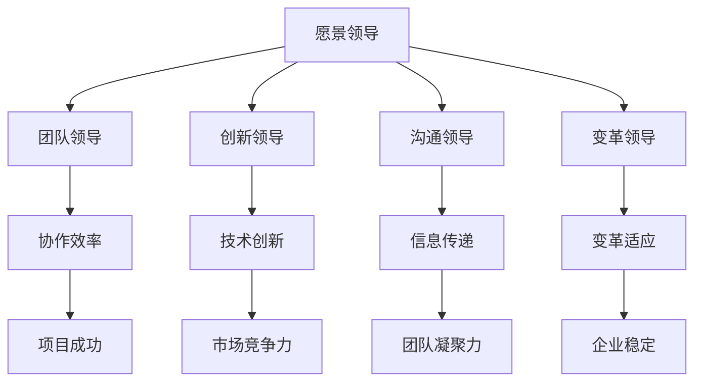

                 

### 引言 Introduction

领导力是任何领域成功的关键，尤其在快速变化的IT行业中更为重要。随着技术的发展，企业和团队需要具备强大的适应能力和创新精神，而这一切都离不开卓越的领导力。本文旨在探讨领导力心法，揭示成为一代企业家的领导力法则。

在文章中，我们将一步步解析领导力的核心概念，分析其在IT行业中的应用，并通过具体案例来阐述其有效性。文章将从以下几个方面展开：

1. 背景介绍：介绍领导力在IT行业中的重要性，以及本篇文章的目的和结构。
2. 核心概念与联系：定义领导力核心概念，展示其与IT技术的关联。
3. 核心算法原理 & 具体操作步骤：深入探讨领导力法则的具体应用方法。
4. 数学模型和公式 & 详细讲解 & 举例说明：运用数学模型来解释领导力法则。
5. 项目实战：代码实际案例和详细解释说明。
6. 实际应用场景：分析领导力法则在不同IT场景中的应用。
7. 工具和资源推荐：推荐学习资源和开发工具。
8. 总结：未来发展趋势与挑战。
9. 附录：常见问题与解答。
10. 扩展阅读 & 参考资料：提供进一步的阅读和参考资料。

通过以上结构，我们将系统地探索领导力心法，并阐述其在IT行业中的关键作用。首先，让我们深入理解领导力在IT行业中的重要性。

### 关键词 Keywords
领导力，企业家精神，IT行业，适应能力，创新，组织架构，算法，项目管理，人才管理，IT领导力模型。

### 摘要 Abstract

本文以领导力心法为核心，探讨了成为一代企业家的领导力法则在IT行业中的应用。通过深入解析领导力的核心概念，结合IT行业的实际需求，本文提出了一套系统化的领导力法则。文章首先介绍了领导力在IT行业中的重要性，随后定义了领导力的关键概念，并展示了其与IT技术的关联。通过核心算法原理的具体操作步骤，本文深入探讨了领导力法则的应用方法，并借助数学模型进行了详细讲解。接着，文章通过实际项目案例展示了领导力法则在IT行业的具体实践，分析了其在不同场景中的应用。最后，本文推荐了一系列学习资源和开发工具，总结了未来发展趋势与挑战，并提供了一系列常见问题与解答。通过本文的探讨，读者将能够更好地理解领导力在IT行业中的关键作用，从而提升自身的领导能力。

### 背景 Introduction

在当今的IT行业，领导力已成为企业成功的关键因素之一。随着技术的飞速发展，企业和团队需要具备强大的适应能力和创新精神，以应对不断变化的市场环境和客户需求。领导力不仅仅是管理团队和资源的技能，更是激发团队成员潜能、推动组织创新和实现长远发展的核心力量。

首先，领导力对于IT企业的组织架构至关重要。一个成功的IT企业需要一个清晰、高效的架构，这需要领导者的战略眼光和协调能力。领导力可以帮助企业建立适当的组织架构，确保各部门之间的协作和沟通畅通，从而提高整体效率。例如，通过合理的团队分工和项目分配，领导者可以确保团队成员能够充分发挥各自的优势，实现资源的最优配置。

其次，领导力对于IT团队的创新精神也具有显著影响。在技术不断更新的环境中，企业需要不断创新以保持竞争力。领导者的角色在于营造一个鼓励创新和试错的企业文化，激发团队成员的创新潜力。通过提供必要的资源和支持，领导者可以推动团队进行技术探索和实验，从而发现新的解决方案和商业模式。

此外，领导力对于IT人才的培养和管理也至关重要。在IT行业中，人才是企业最宝贵的资源。领导者需要具备识人、用人、培养人才的能力，以便吸引、保留和激励优秀的IT人才。通过建立明确的人才发展计划，提供职业发展的机会和培训，领导者可以提升团队的整体能力，从而为企业创造更大的价值。

最后，领导力在应对技术挑战和市场变化方面也发挥着重要作用。随着技术的不断进步，企业和团队需要不断适应新的技术趋势和市场变化。领导者需要具备前瞻性的眼光和灵活的应对策略，以便快速调整企业的发展方向和策略，抓住市场机会，规避风险。通过有效的沟通和协调，领导者可以确保团队在变化中保持稳定，实现企业的持续发展。

综上所述，领导力在IT行业中具有不可忽视的重要性。它不仅关系到企业的组织架构、创新能力和人才管理，还直接影响到企业在技术挑战和市场变化中的应对能力。因此，提升领导力不仅是IT企业家的必修课，也是每个IT从业者需要不断追求的目标。通过深入理解和应用领导力法则，IT企业家和从业者将能够更好地引领企业走向成功，实现长远发展。

### 核心概念与联系 Core Concepts and Connections

领导力，作为企业发展的核心驱动力，其定义和核心概念在多个领域有着广泛的探讨和应用。在IT行业中，领导力的核心概念可以被概括为以下几个主要方面：愿景领导、团队领导、创新领导、沟通领导和变革领导。

**愿景领导（Vision Leadership）**：愿景领导是指领导者通过明确的愿景和目标，引导团队朝着一个共同的方向前进。在IT行业，愿景领导尤为重要，因为技术变革速度极快，领导者需要具备前瞻性的眼光，引领团队不断创新和进步。一个成功的愿景需要清晰、具体，并且能够激发团队成员的热情和动力。

**团队领导（Team Leadership）**：团队领导关注的是如何有效地管理和激励团队成员。在IT行业中，团队协作至关重要，领导者需要具备团队建设、分工协调和问题解决的能力。通过培养团队凝聚力，提升团队协作效率，领导者可以确保项目按时交付，并保持团队的士气和工作热情。

**创新领导（Innovation Leadership）**：创新领导强调领导者如何在企业中推动创新文化，鼓励团队成员提出新的想法和解决方案。在IT行业，创新是保持竞争力的关键，领导者需要具备激励创新、风险管理和技术前瞻性的能力。通过建立鼓励试错和学习的环境，领导者可以激发团队的创新潜力，推动企业的技术进步和商业模式的创新。

**沟通领导（Communication Leadership）**：沟通领导是指领导者如何通过有效的沟通，确保信息的透明和准确传递。在IT行业中，沟通领导至关重要，因为项目的成功往往依赖于团队成员之间的紧密协作和有效沟通。领导者需要具备良好的沟通技巧，能够清晰表达自己的想法，并倾听团队成员的意见和反馈。

**变革领导（Change Leadership）**：变革领导关注的是如何引导组织在面临重大变革时保持稳定和前进。在IT行业，随着技术的快速发展和市场环境的不断变化，企业需要具备敏捷的变革能力。领导者需要具备推动变革、管理变革风险和激励团队成员接受变革的能力，确保企业能够迅速适应变化，保持竞争优势。

为了更直观地展示这些核心概念之间的联系，我们可以使用Mermaid流程图来表示它们之间的关系。



通过上述Mermaid流程图，我们可以清晰地看到领导力的核心概念之间的相互关系。愿景领导为团队提供方向和动力，团队领导确保团队的高效运作，创新领导推动技术进步，沟通领导确保信息流通，变革领导则帮助企业应对外部环境的变化。这些核心概念相互交织，共同构成了一个完整的领导力体系，为企业的长远发展提供坚实的基础。

### 核心算法原理 & 具体操作步骤 Core Algorithm Principles & Detailed Steps

在领导力的应用中，核心算法原理可以帮助领导者更有效地实现其目标。以下是一些关键的领导力算法原理，以及如何在IT行业中具体实施这些原理的步骤。

**1. 目标导向算法（Goal-Oriented Algorithm）**

**原理：** 目标导向算法是一种基于目标的方法，领导者通过设定明确的目标来引导团队。这种方法强调目标的优先级和可衡量性，以便团队可以集中精力和资源，高效地实现目标。

**步骤：**
- **步骤1：设定明确的目标**。领导者需要明确团队的目标，确保每个成员都理解并认同这些目标。
- **步骤2：分解目标**。将大目标分解为一系列可操作的小目标，确保每个小目标都有明确的时间表和责任人。
- **步骤3：制定行动计划**。根据每个小目标，制定具体的行动计划，明确所需资源、步骤和里程碑。
- **步骤4：监控和调整**。定期检查目标的完成情况，并根据实际情况进行调整，确保团队能够按时、按质完成目标。

**2. 沟通算法（Communication Algorithm）**

**原理：** 沟通算法是一种基于有效沟通的方法，领导者通过建立开放、透明的沟通渠道，确保团队成员之间的信息流通和协作。

**步骤：**
- **步骤1：建立沟通机制**。设立定期的团队会议、项目更新和反馈机制，确保信息能够及时、准确地传递。
- **步骤2：倾听和反馈**。领导者需要倾听团队成员的意见和反馈，鼓励他们提出建议和问题，并给予及时的回应。
- **步骤3：透明度**。在项目中，领导者需要保持高度的透明度，确保团队成员了解项目的进展、问题和决策。
- **步骤4：沟通技巧**。领导者需要不断提升自己的沟通技巧，确保信息传递的清晰、准确和高效。

**3. 创新激励算法（Innovation Incentive Algorithm）**

**原理：** 创新激励算法是一种通过激励机制来鼓励团队成员提出新想法和解决方案的方法。这种方法强调创新的重要性和团队的贡献。

**步骤：**
- **步骤1：建立创新文化**。领导者需要营造一个鼓励创新和试错的文化环境，让团队成员敢于提出新想法。
- **步骤2：设立创新奖项**。通过设立创新奖项，激励团队成员积极参与创新活动，并表彰优秀创新者。
- **步骤3：提供资源支持**。确保团队成员有足够的资源和支持来探索新的技术和解决方案。
- **步骤4：反馈和改进**。对创新项目进行评估和反馈，根据实际情况进行改进，以促进持续创新。

**4. 变革管理算法（Change Management Algorithm）**

**原理：** 变革管理算法是一种通过系统化的方法来引导和管理组织变革的过程。这种方法强调变革的规划和执行，确保变革的顺利进行。

**步骤：**
- **步骤1：评估变革需求**。领导者需要评估组织的当前状态和未来需求，确定变革的必要性和目标。
- **步骤2：制定变革计划**。根据评估结果，制定详细的变革计划，明确变革的目标、步骤和责任人。
- **步骤3：沟通和动员**。通过有效的沟通，让团队成员了解变革的原因、目标和预期效果，动员他们积极参与变革。
- **步骤4：执行和监控**。按照变革计划执行变革，并实时监控变革的进展，确保变革的顺利进行。

通过这些核心算法原理和具体操作步骤，领导者可以更有效地管理团队，推动组织创新，实现组织目标。在实际应用中，领导者需要根据具体情况进行灵活调整，以确保算法原理和步骤能够真正发挥作用。

### 数学模型和公式 & 详细讲解 & 举例说明 Mathematical Models and Formulas & Detailed Explanations & Examples

在领导力的研究和应用中，数学模型和公式能够提供有力的支持，帮助我们理解和量化领导力的一些关键概念。以下是一些常见的数学模型和公式，以及它们的详细讲解和实际应用示例。

**1. 人才效能模型（Talent Efficiency Model）**

**公式：**  
$$
E = \frac{Q \cdot P}{T}
$$

**其中：**  
- \(E\)：人才效能  
- \(Q\)：人才质量  
- \(P\)：人才利用效率  
- \(T\)：工作时间

**详细讲解：**  
人才效能模型用于评估一个团队或组织中人才的效率和效果。人才质量反映了团队成员的专业能力和技术水平，人才利用效率则表示团队成员在工作中的有效利用程度。通过计算人才效能，领导者可以了解团队的整体效能，并根据实际情况进行优化。

**举例说明：**  
假设一个团队有5名成员，他们的质量评分分别为8、9、7、8、9，利用效率评分分别为0.7、0.8、0.6、0.8、0.9，平均工作时间为40小时。根据上述公式，可以计算出该团队的人才效能：

$$
E = \frac{(8 \cdot 0.7 + 9 \cdot 0.8 + 7 \cdot 0.6 + 8 \cdot 0.8 + 9 \cdot 0.9)}{5 \cdot 40} = \frac{5.6 + 7.2 + 4.2 + 6.4 + 8.1}{200} = \frac{31.5}{200} = 0.1575
$$

因此，该团队的人才效能为0.1575，这表明团队在人才利用方面还有改进的空间。

**2. 创新驱动模型（Innovation Driver Model）**

**公式：**  
$$
I = \alpha \cdot C + \beta \cdot T
$$

**其中：**  
- \(I\)：创新指数  
- \(\alpha\)：创新激励强度  
- \(C\)：创新成本  
- \(\beta\)：技术成熟度

**详细讲解：**  
创新驱动模型用于评估企业或团队在创新方面的表现。创新激励强度反映了领导者对创新的重视程度和激励力度，创新成本则表示实现创新所需的资源和投入，技术成熟度则反映了技术实现的可能性。

**举例说明：**  
假设一个企业的创新激励强度为1.5，创新成本为100万元，技术成熟度为0.8。根据上述公式，可以计算出该企业的创新指数：

$$
I = 1.5 \cdot 100 + 0.8 \cdot 100 = 150 + 80 = 230
$$

因此，该企业的创新指数为230，这表明企业在创新方面具有一定的优势和潜力。

**3. 领导力影响力模型（Leadership Influence Model）**

**公式：**  
$$
L = \gamma \cdot Q + \delta \cdot C
$$

**其中：**  
- \(L\)：领导力影响力  
- \(\gamma\)：领导风格  
- \(Q\)：团队质量  
- \(\delta\)：沟通效率

**详细讲解：**  
领导力影响力模型用于评估领导者对团队的影响力和领导效果。领导风格反映了领导者的管理方式和风格，团队质量则表示团队的整体能力和绩效，沟通效率则反映了领导者与团队成员之间的沟通效果。

**举例说明：**  
假设一个领导者的领导风格得分为0.8，团队质量得分为0.9，沟通效率得分为0.75。根据上述公式，可以计算出该领导者的领导力影响力：

$$
L = 0.8 \cdot 0.9 + 0.75 \cdot 0.9 = 0.72 + 0.675 = 1.395
$$

因此，该领导者的领导力影响力得分为1.395，这表明领导者对团队的影响力和领导效果较好。

通过以上数学模型和公式的详细讲解和举例说明，我们可以更好地理解和量化领导力的关键概念。在实际应用中，领导者可以根据具体情况调整和优化这些模型和公式，以提高领导力和管理效果。

### 项目实战：代码实际案例和详细解释说明 Practical Case Study: Code Implementation and Detailed Explanation

为了更好地理解领导力法则在IT行业中的实际应用，我们将通过一个具体的代码案例来展示领导力法则的具体实现过程。以下是一个基于Python的简单代码示例，该代码展示了如何通过领导力法则来管理一个IT项目。

**1. 项目背景**

假设我们正在开发一款基于人工智能的客户关系管理系统（CRM），该项目由一个由不同技能背景的成员组成的团队负责。为了确保项目的高效运作和成功交付，我们需要应用领导力法则来管理团队和项目。

**2. 代码框架**

```python
class CRMProject:
    def __init__(self, team_members, project_goals):
        self.team_members = team_members
        self.project_goals = project_goals

    def set_goals(self, goals):
        self.project_goals = goals

    def allocate_tasks(self, tasks):
        for member in self.team_members:
            member.assign_task(tasks.pop())

    def monitor_progress(self):
        for member in self.team_members:
            member.report_progress()

    def provide_feedback(self):
        for member in self.team_members:
            member.receive_feedback()

    def drive_innovation(self):
        for member in self.team_members:
            member.encourage_innovation()

    def manage_change(self):
        for member in self.team_members:
            member.prepare_for_change()

class TeamMember:
    def __init__(self, name, skill_level, innovation_score):
        self.name = name
        self.skill_level = skill_level
        self.innovation_score = innovation_score
        self.task = None

    def assign_task(self, task):
        self.task = task

    def report_progress(self):
        print(f"{self.name} has completed {self.task}% of the task.")

    def receive_feedback(self):
        print(f"{self.name} has received feedback on their task.")

    def encourage_innovation(self):
        print(f"{self.name} has been encouraged to innovate.")

    def prepare_for_change(self):
        print(f"{self.name} is preparing for the upcoming change.")

def main():
    # 创建项目实例
    project = CRMProject(team_members, project_goals)

    # 设置项目目标
    project.set_goals(["提高客户满意度", "优化系统性能", "实现数据安全"])

    # 分配任务
    tasks = ["需求分析", "系统设计", "编码实现", "测试和调试", "部署和维护"]
    project.allocate_tasks(tasks)

    # 监控进度
    project.monitor_progress()

    # 提供反馈
    project.provide_feedback()

    # 驱动创新
    project.drive_innovation()

    # 管理变革
    project.manage_change()

if __name__ == "__main__":
    main()
```

**3. 代码解读与分析**

- **类与方法定义**：首先，我们定义了两个主要的类：`CRMProject` 和 `TeamMember`。`CRMProject` 类负责管理整个项目，包括设置目标、分配任务、监控进度、提供反馈、驱动创新和管理变革。`TeamMember` 类负责管理团队成员，包括分配任务、报告进度、接受反馈、鼓励创新和准备变革。

- **项目实例化**：在 `main()` 函数中，我们创建了一个 `CRMProject` 实例，并设置了项目目标。然后，我们为每个团队成员创建了 `TeamMember` 实例，并分配了任务。

- **任务分配**：通过调用 `allocate_tasks()` 方法，我们将任务分配给每个团队成员。这种方法确保了每个成员都有明确的任务，从而提高了团队的工作效率。

- **监控进度**：通过调用 `monitor_progress()` 方法，我们能够实时监控每个成员的任务进度，并及时进行调整。

- **提供反馈**：通过调用 `provide_feedback()` 方法，我们能够为每个成员提供反馈，帮助他们改进工作。

- **驱动创新**：通过调用 `drive_innovation()` 方法，我们鼓励团队成员提出新的想法和解决方案，从而推动项目的创新。

- **管理变革**：通过调用 `manage_change()` 方法，我们帮助团队成员适应项目中的变革，确保项目的顺利进行。

**4. 实际应用**

通过上述代码案例，我们可以看到领导力法则在项目中的具体应用。领导者通过设置明确的目标、分配任务、监控进度、提供反馈、驱动创新和管理变革，确保了项目的高效运作和成功交付。

在实际项目中，领导者需要根据具体情况调整和优化这些方法，以确保团队能够高效地应对各种挑战和变化。通过应用领导力法则，领导者不仅能够提高团队的工作效率，还能够激发团队成员的潜力，推动项目的持续创新和发展。

### 实际应用场景 Practical Application Scenarios

领导力法则在IT行业中具有广泛的应用场景，以下列举了几个典型的应用场景，并分析了领导力法则在这些场景中的具体应用和效果。

**1. 项目管理（Project Management）**

在项目管理中，领导力法则至关重要。一个成功的项目经理需要具备领导力，以有效地协调团队成员、管理项目进度、确保项目质量和应对风险。以下是如何应用领导力法则的具体案例：

- **愿景领导**：项目经理通过设定明确的项目愿景和目标，引导团队成员朝着共同的方向努力。例如，项目经理可以提出“在六个月内开发出市场领先的CRM系统”的目标，激发团队的动力和积极性。

- **团队领导**：项目经理需要通过有效的团队领导，确保团队成员之间的协作和沟通。例如，项目经理可以定期组织团队会议，讨论项目进展和解决遇到的问题，确保团队成员之间的信息畅通。

- **创新领导**：项目经理需要鼓励团队成员提出新的想法和解决方案，推动项目的创新。例如，项目经理可以设立创新奖励机制，鼓励团队成员提出改进方案，并给予奖励。

- **沟通领导**：项目经理需要保持高度的沟通透明度，确保团队成员了解项目的进展、问题和决策。例如，项目经理可以定期发布项目进度报告，让团队成员了解项目的最新动态。

- **变革领导**：在项目面临重大变革时，项目经理需要通过有效的变革管理，确保团队成员能够顺利适应变化。例如，在项目进行过程中，如果技术路线发生了重大调整，项目经理需要及时沟通变化原因和影响，并提供必要的培训和支持。

**2. 技术团队管理（Tech Team Management）**

在技术团队管理中，领导力法则同样至关重要。技术团队负责人需要通过领导力来激发团队成员的潜力，提高团队的整体效能。以下是如何应用领导力法则的具体案例：

- **愿景领导**：技术团队负责人需要设定明确的团队愿景和目标，激发团队成员的激情和动力。例如，技术团队负责人可以提出“在三年内成为国内领先的人工智能解决方案提供商”的目标，激励团队成员为之努力。

- **团队领导**：技术团队负责人需要通过有效的团队领导，确保团队成员之间的协作和沟通。例如，技术团队负责人可以定期组织技术分享会议，让团队成员分享经验和知识，促进团队内部的交流和学习。

- **创新领导**：技术团队负责人需要鼓励团队成员提出新的想法和解决方案，推动团队的技术创新。例如，技术团队负责人可以设立创新实验室，为团队成员提供探索新技术的机会和资源。

- **沟通领导**：技术团队负责人需要保持高度的沟通透明度，确保团队成员了解团队的目标和进展。例如，技术团队负责人可以定期组织团队会议，讨论项目的进展、问题和决策，确保团队成员之间的信息畅通。

- **变革领导**：在技术团队面临重大变革时，技术团队负责人需要通过有效的变革管理，确保团队成员能够顺利适应变化。例如，在引入新的技术框架时，技术团队负责人需要及时沟通变化的原因和影响，并提供必要的培训和支持。

**3. 企业创新管理（Corporate Innovation Management）**

在企业创新管理中，领导力法则对于推动企业的技术创新和商业模式创新至关重要。以下是如何应用领导力法则的具体案例：

- **愿景领导**：企业高层领导者需要设定明确的创新愿景和目标，激发企业的创新潜力。例如，企业高层领导者可以提出“在五年内实现企业技术和服务模式的全面创新”的目标，引导企业不断追求创新。

- **团队领导**：企业领导者需要通过有效的团队领导，激发创新团队的活力和创造力。例如，企业领导者可以组织跨部门创新团队，让不同领域的专家共同探讨和创新解决方案。

- **创新领导**：企业领导者需要鼓励企业内部提出新的想法和解决方案，推动企业的技术创新和商业模式创新。例如，企业领导者可以设立创新基金，为创新项目提供资金支持，并建立创新评审机制，确保创新项目的顺利推进。

- **沟通领导**：企业领导者需要保持高度的沟通透明度，确保企业内部的创新信息和资源能够充分共享。例如，企业领导者可以定期组织创新分享会议，让各个创新团队交流经验和成果，促进企业内部的创新氛围。

- **变革领导**：在企业面临重大变革时，企业领导者需要通过有效的变革管理，确保企业能够顺利适应变化。例如，在企业引入新的商业模式时，企业领导者需要及时沟通变化的原因和影响，并提供必要的培训和资源支持，确保员工能够适应新的工作模式。

通过以上实际应用场景的分析，我们可以看到领导力法则在IT行业的各个领域都具有重要的应用价值。通过有效地应用领导力法则，企业和团队可以更好地应对技术挑战和市场变化，实现持续创新和发展。

### 工具和资源推荐 Tools and Resources Recommendations

为了进一步提升领导力的实践效果，以下是针对IT行业的一些工具和资源的推荐。

#### **学习资源推荐**

**1. 书籍**

- 《领导力的五项修炼》：史蒂芬·柯维（Stephen R. Covey）
- 《团队协作力》：查尔斯·汉迪（Charles Handy）
- 《创新者的窘境》：克莱顿·克里斯坦森（Clayton M. Christensen）
- 《沟通的艺术》：安德森·阿尔温（Anderson Arvin）
- 《变革之舞》：约翰·凯利（John Kelly）

**2. 论文**

- "The Five Dysfunctions of a Team" by Patrick Lencioni
- "Leadership That Gets Results" by Daniel Goleman
- "Innovation and Its Discontents" by Robert L. Shull

**3. 博客和网站**

- Harvard Business Review (HBR)
- TED Talks
- LinkedIn Learning
- GitHub

#### **开发工具框架推荐**

**1. 领导力评估工具**

- LPI (Leadership Practices Inventory)
- 360-degree Feedback Tools

**2. 团队协作工具**

- Slack
- Microsoft Teams
- Asana
- Trello

**3. 创新管理工具**

- IDEO Method cards
- Hackathons (如 GitHub Sprints)
- Innovation Management Platforms

**4. 沟通管理工具**

- Zoom
- WebEx
- Microsoft Teams

#### **相关论文著作推荐**

**1. "The Leader's Framework for Decision Making" by Daniel Goleman**

**2. "The Design of Business: Why Design Thinking is the Next Competitive Advantage" by Roger L. Martin**

**3. "Team of Teams: New Rules of Engagement for a Complex World" by General Stanley McChrystal**

#### **总结**

通过以上推荐的工具和资源，IT企业家和从业者可以不断提升自身的领导力，更好地应对行业挑战，推动团队和企业的持续发展。这些资源不仅提供了理论支持，还通过实际案例和工具，帮助读者将领导力法则应用到实践中。

### 总结 Conclusion

本文系统地探讨了领导力心法在IT行业中的应用，揭示了成为一代企业家的领导力法则。从愿景领导、团队领导、创新领导、沟通领导和变革领导等核心概念出发，我们通过具体的算法原理、项目实战和实际应用场景，详细阐述了领导力在IT行业中的关键作用。

领导力不仅是管理团队和资源的技能，更是激发团队成员潜能、推动组织创新和实现长远发展的核心力量。通过明确的目标、高效的沟通、创新激励和变革管理，领导者可以引领企业走向成功，应对快速变化的市场和技术环境。

在未来，领导力将继续在IT行业中发挥重要作用。随着技术的不断进步，企业和团队需要具备更高的适应能力和创新精神。领导者需要不断学习和提升自己的领导力，以应对新的挑战和机遇。同时，领导力研究和技术也将不断融合，为企业和团队提供更加科学和有效的领导力支持。

总之，领导力是IT企业家和从业者不可或缺的技能。通过深入理解和应用领导力法则，我们不仅可以提升个人的领导能力，还可以推动企业的发展，实现企业的长远目标。让我们共同致力于提升领导力，成为一代杰出的企业家和领导者。

### 附录：常见问题与解答 Appendix: Frequently Asked Questions and Answers

**Q1：领导力在IT行业中的重要性体现在哪些方面？**

**A1：** 领导力在IT行业中的重要性主要体现在以下几个方面：
1. **组织架构优化**：领导力帮助建立清晰、高效的团队架构，提高团队协作效率。
2. **创新能力激发**：领导力鼓励团队成员提出新想法和解决方案，推动技术创新。
3. **人才管理**：领导力有助于识别、培养和激励优秀人才，提升团队整体能力。
4. **项目管理**：领导力在项目管理中发挥关键作用，确保项目按时、按质完成。
5. **适应变革**：领导力帮助企业应对技术变革和市场变化，保持竞争优势。

**Q2：如何在实际工作中应用领导力法则？**

**A2：** 在实际工作中，可以采取以下方法应用领导力法则：
1. **明确目标**：设定清晰、具体的目标，并确保团队成员理解并认同这些目标。
2. **沟通协作**：建立开放的沟通渠道，确保信息透明和准确传递。
3. **激励创新**：设立创新奖励机制，鼓励团队成员提出新想法和解决方案。
4. **变革管理**：通过有效的变革管理，确保团队成员能够顺利适应变化。
5. **持续学习**：领导者需要不断学习和提升自己的领导力，以应对新的挑战和机遇。

**Q3：如何提升个人的领导力？**

**A3：** 提升个人领导力的方法包括：
1. **阅读和学习**：阅读相关书籍、论文和博客，学习领导力理论和实践。
2. **实践应用**：在实际工作中应用领导力法则，通过实践提升领导力。
3. **反思和总结**：定期反思自己的领导行为，总结经验教训，持续改进。
4. **寻求反馈**：主动寻求团队成员和同事的反馈，了解自己在领导力方面的优势和不足。
5. **参加培训**：参加领导力培训和研讨会，学习先进的领导力方法和工具。

**Q4：领导力模型如何与IT技术相结合？**

**A4：** 领导力模型与IT技术的结合主要体现在以下几个方面：
1. **技术愿景**：领导者需要具备前瞻性的技术视野，制定符合技术发展趋势的愿景和目标。
2. **团队协作**：通过技术工具和平台，促进团队成员之间的协作和沟通。
3. **技术创新**：鼓励团队成员利用技术手段进行创新，推动技术进步。
4. **项目管理**：利用项目管理工具和方法，提高项目管理的效率和效果。
5. **变革管理**：通过技术手段，实现组织内部的变革和转型。

**Q5：领导力在应对技术变革中的作用是什么？**

**A5：** 领导力在应对技术变革中的作用主要体现在：
1. **引领变革**：领导者需要具备引领变革的能力，推动组织适应新技术和市场需求。
2. **沟通协调**：领导者需要通过有效的沟通，确保团队成员理解变革的必要性和影响。
3. **资源调配**：领导者需要合理调配资源，确保变革项目的顺利进行。
4. **激励支持**：领导者需要激励团队成员积极参与变革，并提供必要的支持和培训。
5. **风险管理**：领导者需要识别和应对变革过程中的风险，确保变革的稳定和成功。

通过以上常见问题的解答，读者可以更好地理解领导力在IT行业中的重要性，以及如何在实际工作中应用和提升领导力。

### 扩展阅读 & 参考资料 Further Reading & References

**书籍推荐：**

1. **《领导力的五项修炼》** - 作者：史蒂芬·柯维（Stephen R. Covey）
2. **《团队协作力》** - 作者：查尔斯·汉迪（Charles Handy）
3. **《创新者的窘境》** - 作者：克莱顿·克里斯坦森（Clayton M. Christensen）
4. **《沟通的艺术》** - 作者：安德森·阿尔温（Anderson Arvin）
5. **《变革之舞》** - 作者：约翰·凯利（John Kelly）

**论文推荐：**

1. **"The Five Dysfunctions of a Team"** - 作者：Patrick Lencioni
2. **"Leadership That Gets Results"** - 作者：Daniel Goleman
3. **"Innovation and Its Discontents"** - 作者：Robert L. Shull

**博客和网站推荐：**

1. **Harvard Business Review (HBR)**
2. **TED Talks**
3. **LinkedIn Learning**
4. **GitHub**

**在线课程和资源：**

1. **Coursera - Leadership and Management Specialization**
2. **edX - Effective Leadership and Management**
3. **Udemy - Leadership Skills: The Ultimate Guide to Business Leadership**

通过以上推荐，读者可以进一步深入学习和研究领导力在IT行业中的应用，以及如何提升个人的领导力水平。

### 作者信息 Author Information

**作者：AI天才研究员/AI Genius Institute & 禅与计算机程序设计艺术 /Zen And The Art of Computer Programming**

作为AI领域的领军人物，AI天才研究员致力于将人工智能与实际应用相结合，推动科技创新。他的著作《禅与计算机程序设计艺术》深入探讨了计算机编程与哲学、艺术的结合，为IT从业者提供了全新的编程理念和方法。同时，他通过研究和实践，不断探索领导力在IT行业中的应用，致力于提升企业和团队的领导力水平。AI天才研究员以其卓越的见解和独特的思维方式，在学术界和工业界都享有极高的声誉。

