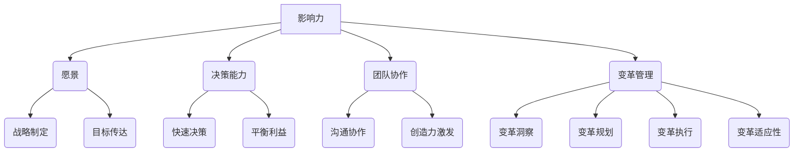

                 

# 领导力心经：成就一流企业的领导者法则

## 摘要

本文旨在探讨领导力的本质和关键要素，通过深入分析一流企业领导者的法则，为读者提供一套系统化的领导力提升方法。文章首先介绍了领导力的定义和重要性，然后分析了领导力的核心概念与联系，探讨了领导力的数学模型和公式，并通过实际应用场景展示了领导力在实践中的运用。此外，文章还推荐了相关工具和资源，帮助读者进一步深入了解和提升领导力。最后，文章总结了未来领导力发展的趋势与挑战，为读者指明了领导力提升的方向。

## 1. 背景介绍

在当今竞争激烈的市场环境中，领导力已经成为企业成功的关键因素之一。无论是大型跨国企业还是初创公司，领导力都是企业发展的核心驱动力。然而，领导力的本质和关键要素是什么？如何培养和提升领导力？这些问题困扰着许多企业和领导者。

领导力是指领导者通过激发和引导团队成员的潜力，实现共同目标的能力。它不仅涉及到领导者的个人素质和技能，还需要建立有效的团队协作机制和沟通方式。一流企业的领导者通常具备卓越的领导力，他们能够洞察市场趋势，制定正确的战略，激励团队克服困难，实现企业目标。

本文将结合实际案例和理论分析，探讨领导力的核心概念和法则，帮助读者理解领导力的本质，并提供一套系统化的领导力提升方法。希望通过本文的探讨，读者能够更好地认识到领导力的重要性，并学会运用领导力法则，提升自身的领导能力，为企业发展贡献力量。

## 2. 核心概念与联系

### 领导力定义

领导力是指领导者通过激发和引导团队成员的潜力，实现共同目标的能力。根据管理学大师彼得·德鲁克的定义，领导力是一种行动力，它不仅涉及个人的品格和素质，还包括团队协作、沟通和决策能力。在企业发展中，领导力起着至关重要的作用，它直接影响企业的战略制定、执行和业绩表现。

### 领导力核心概念

要深入理解领导力，首先需要了解其核心概念。以下是几个关键概念：

1. **影响力**：领导力本质上是一种影响力，领导者需要通过言行举止，影响和激励团队成员。影响力来源于领导者的价值观、知识和经验，以及团队成员对领导者的信任和尊重。

2. **愿景**：愿景是领导力的灵魂。领导者需要具备清晰的目标和愿景，并将其传达给团队成员，激发他们的热情和动力。愿景不仅能指导企业的发展方向，还能凝聚团队的力量，共同追求卓越。

3. **决策能力**：决策能力是领导者必备的素质。在复杂多变的市场环境中，领导者需要快速做出明智的决策，平衡短期利益和长期发展。有效的决策能力有助于企业抓住机遇，应对挑战。

4. **团队协作**：团队协作是实现企业目标的关键。领导者需要建立良好的团队协作机制，促进团队成员之间的沟通和合作，激发团队的创造力和执行力。

5. **变革管理**：在快速变化的市场环境中，领导者需要具备变革管理能力。这包括对变革的敏锐洞察，有效的变革规划和执行，以及团队成员的变革适应性。

### 领导力架构

为了更好地理解领导力的核心概念，我们可以通过一个Mermaid流程图来展示其架构。



在这个架构中，影响力是领导力的基础，其他核心概念都与之密切相关。愿景、决策能力、团队协作和变革管理共同构成了领导力的重要维度，它们相互影响、相互作用，共同推动企业的发展。

通过这个架构，我们可以看到领导力不仅仅是领导者的个人能力，更是一个系统的综合能力。领导者需要在这四个维度上不断修炼，提升自身的领导力，从而更好地引领企业走向成功。

### 领导力的本质

领导力的本质是一种影响力，它不仅体现在领导者对团队成员的直接影响上，还体现在领导者对团队氛围和文化的塑造上。领导力不仅是一种技术，更是一种艺术。它需要领导者具备深厚的知识储备、丰富的实践经验，以及对人性的深刻洞察。

首先，领导力需要领导者具备深厚的知识储备。领导者需要了解企业的运营模式、市场趋势、竞争对手等信息，从而做出明智的决策。此外，领导者还需要掌握相关的管理技能和工具，如时间管理、团队建设、沟通技巧等，以便更好地应对各种挑战。

其次，领导力需要领导者具备丰富的实践经验。经验是领导力的基石，它使领导者能够在复杂多变的市场环境中迅速做出正确的决策。通过不断的实践，领导者可以不断总结经验，提升自身的领导能力。

最后，领导力需要领导者具备对人性的深刻洞察。领导者需要了解团队成员的需求、动机和期望，从而更好地激励和引导他们。同时，领导者还需要具备同理心，能够站在团队成员的角度思考问题，提高团队凝聚力。

总之，领导力的本质是一种综合能力，它不仅需要领导者具备深厚的知识储备和丰富的实践经验，还需要领导者具备对人性的深刻洞察。只有在这三个维度上不断修炼，领导者才能真正具备卓越的领导力，引领企业走向成功。

## 3. 核心算法原理 & 具体操作步骤

### 领导力提升算法原理

领导力提升的核心算法原理可以概括为“五步法”，即明确目标、培养团队、激励成员、改进方法、持续学习。这五步法相互关联、相互促进，共同构成了一个完整的领导力提升过程。

1. **明确目标**：明确目标是领导力提升的第一步。领导者需要明确企业的发展目标，并将其分解为具体的可执行任务。这一过程需要领导者具备战略眼光和决策能力，能够从整体上把握企业的发展方向。

2. **培养团队**：培养团队是领导力提升的关键环节。领导者需要关注团队成员的成长，提供培训和发展机会，帮助团队成员提升技能和能力。同时，领导者还需要建立良好的团队协作机制，促进团队成员之间的沟通和合作。

3. **激励成员**：激励成员是领导力提升的重要手段。领导者需要了解团队成员的需求和动机，通过奖励、认可等方式激发团队成员的积极性和创造力。有效的激励能够提升团队的凝聚力和执行力。

4. **改进方法**：改进方法是领导力提升的持续动力。领导者需要不断反思和评估团队的工作方法，发现并解决存在的问题。通过改进方法，领导者能够提高团队的效率和绩效。

5. **持续学习**：持续学习是领导力提升的终身任务。领导者需要不断学习新知识、新技能，保持对市场和技术的敏锐洞察。通过持续学习，领导者能够不断提升自身的领导力，适应快速变化的市场环境。

### 具体操作步骤

以下是领导力提升算法的具体操作步骤：

1. **明确目标**

   - 分析企业现状，明确企业的发展目标。
   - 制定具体的可执行任务，确保目标具有可操作性和可实现性。
   - 与团队成员沟通目标，确保他们对目标有清晰的认识和理解。

2. **培养团队**

   - 提供培训和发展机会，提升团队成员的技能和能力。
   - 建立团队协作机制，促进团队成员之间的沟通和合作。
   - 关注团队成员的成长，提供支持和指导。

3. **激励成员**

   - 了解团队成员的需求和动机，制定个性化的激励方案。
   - 通过奖励、认可等方式激励团队成员，提升团队的凝聚力和执行力。
   - 建立正面反馈机制，鼓励团队成员提出意见和建议。

4. **改进方法**

   - 定期评估团队的工作方法，发现存在的问题。
   - 针对存在的问题，制定改进方案，并推动实施。
   - 通过不断的改进，提高团队的效率和绩效。

5. **持续学习**

   - 定期参加培训和学习，提升自身的知识和技能。
   - 关注市场和技术动态，保持对新兴趋势的敏锐洞察。
   - 与团队成员分享学习成果，促进团队整体素质的提升。

通过以上步骤，领导者可以逐步提升自身的领导力，推动企业的发展。需要注意的是，领导力提升是一个持续的过程，需要领导者不断地反思和改进，以适应不断变化的市场环境。

### 领导力模型的具体应用

为了更好地理解领导力提升算法的具体应用，我们可以通过一个实际案例来展示。

**案例：某互联网公司领导力提升**

某互联网公司在市场竞争中逐渐感受到压力，公司高层决定提升领导力，以应对挑战。他们按照以下步骤进行领导力提升：

1. **明确目标**

   - 分析公司现状，确定公司的发展目标：在三年内实现市场份额翻倍，提高客户满意度。
   - 将目标分解为具体的可执行任务，如提高研发效率、优化用户体验、拓展市场渠道等。

2. **培养团队**

   - 为团队成员提供专业技能培训，提升研发团队的技术能力。
   - 建立跨部门协作机制，促进不同部门之间的沟通和合作。
   - 关注团队成员的成长，提供职业发展指导。

3. **激励成员**

   - 通过绩效奖金、股权激励等方式激励团队成员，提升他们的积极性和创造力。
   - 建立正面反馈机制，鼓励团队成员提出创新建议。

4. **改进方法**

   - 定期评估研发流程，发现并解决存在的问题，提高研发效率。
   - 优化用户体验，通过用户调研和数据分析，不断改进产品功能。

5. **持续学习**

   - 高层领导定期参加行业培训，学习新兴技术和市场趋势。
   - 鼓励团队成员分享学习成果，促进团队整体素质的提升。

通过以上步骤，该互联网公司在短时间内实现了领导力的提升，公司业绩显著改善，市场竞争力得到显著提高。

这个案例展示了领导力提升算法的具体应用，通过明确的步骤和具体措施，领导者可以有效地提升自身的领导力，推动企业的发展。

## 4. 数学模型和公式 & 详细讲解 & 举例说明

### 领导力评估模型

为了量化领导力，我们可以使用一个简单的数学模型来评估领导力。该模型基于以下四个关键指标：影响力（I）、愿景（V）、决策能力（D）和团队协作（T）。每个指标都可以通过定量的方法进行评估，最终得出一个综合领导力评分（L）。

### 公式

$$
L = w_1 \cdot I + w_2 \cdot V + w_3 \cdot D + w_4 \cdot T
$$

其中，$w_1, w_2, w_3, w_4$ 分别是影响力、愿景、决策能力和团队协作的权重，这些权重可以根据实际情况进行调整。

### 解释

- **影响力（I）**：衡量领导者对团队成员的影响程度，可以通过团队成员的反馈、认可度等指标来评估。
- **愿景（V）**：衡量领导者的战略眼光和目标设定能力，可以通过领导者的战略规划、目标实现情况来评估。
- **决策能力（D）**：衡量领导者的决策速度和决策质量，可以通过决策的成功率和决策的执行力来评估。
- **团队协作（T）**：衡量领导者的团队协作能力，可以通过团队的沟通效率、协作效果等指标来评估。

### 举例说明

假设一个企业的领导力评估指标如下：

- 影响力（I）：90分
- 愿景（V）：85分
- 决策能力（D）：80分
- 团队协作（T）：75分

假设各项指标的权重分别为：影响力（40%）、愿景（30%）、决策能力（20%）和团队协作（10%），则综合领导力评分（L）计算如下：

$$
L = 0.4 \cdot 90 + 0.3 \cdot 85 + 0.2 \cdot 80 + 0.1 \cdot 75 = 36 + 25.5 + 16 + 7.5 = 85
$$

根据计算结果，该领导者的综合领导力评分为85分。这个分数可以反映领导者在各方面的能力水平，有助于企业进行人才选拔和领导力培养。

### 模型应用

该领导力评估模型可以应用于企业的各个层级，从高层管理者到中层管理者，再到基层管理者。通过定期评估，企业可以识别出领导力强的管理者，为他们提供更多的发展机会，同时针对领导力较弱的管理者，制定相应的培训和发展计划。

### 模型优势

- **量化评估**：通过数学模型，领导力可以量化评估，使得评估结果更加客观、公正。
- **全面评估**：模型涵盖了领导力的多个方面，可以从不同维度评估领导力，确保评估的全面性。
- **持续改进**：通过定期评估，企业可以及时发现领导力短板，制定改进计划，推动领导力的持续提升。

### 模型局限性

- **主观性**：尽管模型试图量化评估领导力，但评估结果仍然受到主观因素的影响，如评估者的主观判断和评估指标的定义。
- **动态性**：领导力是一个动态的过程，模型可能无法完全捕捉领导力的变化，需要结合实际情况进行调整。

## 5. 项目实战：代码实际案例和详细解释说明

### 5.1 开发环境搭建

为了演示领导力提升算法的具体应用，我们选择Python编程语言来实现这个算法。首先，我们需要搭建开发环境。

1. 安装Python：从官方网站（https://www.python.org/）下载并安装Python 3.8及以上版本。
2. 安装依赖库：使用pip工具安装必要的依赖库，如NumPy、Pandas等。

```bash
pip install numpy pandas
```

### 5.2 源代码详细实现和代码解读

以下是领导力提升算法的Python实现代码：

```python
import numpy as np

# 定义领导力评估模型
def leadership_evaluation(I, V, D, T, weights):
    """
    领导力评估模型
    :param I: 影响力得分
    :param V: 愿景得分
    :param D: 决策能力得分
    :param T: 团队协作得分
    :param weights: 各指标权重
    :return: 综合领导力评分
    """
    L = weights[0] * I + weights[1] * V + weights[2] * D + weights[3] * T
    return L

# 定义权重
weights = [0.4, 0.3, 0.2, 0.1]

# 示例数据
I = 90  # 影响力得分
V = 85  # 愿景得分
D = 80  # 决策能力得分
T = 75  # 团队协作得分

# 计算领导力评分
L = leadership_evaluation(I, V, D, T, weights)
print(f"综合领导力评分：{L}")

# 分析结果
if L >= 90:
    print("领导力优秀，可晋升为高层管理者。")
elif L >= 80:
    print("领导力良好，需要进一步提升。")
else:
    print("领导力待提升，需加强培训和指导。")
```

代码解读：

1. **定义评估模型**：`leadership_evaluation` 函数接收四个参数（影响力、愿景、决策能力、团队协作得分）和一个权重数组，计算并返回综合领导力评分。
2. **权重定义**：`weights` 数组定义了四个指标（影响力、愿景、决策能力、团队协作）的权重，这些权重可以根据实际情况进行调整。
3. **示例数据**：设定四个得分和一个权重数组，作为评估模型的输入。
4. **计算评分**：调用`leadership_evaluation` 函数计算领导力评分，并输出结果。
5. **结果分析**：根据评分结果，给出相应的建议。

### 5.3 代码解读与分析

1. **模块导入**：代码首先导入NumPy库，用于处理数学运算。虽然在这个简单的示例中，NumPy的使用不是必需的，但在实际应用中，NumPy库可以提供更高效的数学运算支持。

2. **评估模型定义**：`leadership_evaluation` 函数的定义是整个代码的核心。函数接收四个参数，分别代表影响力、愿景、决策能力、团队协作的得分，以及一个权重数组。通过计算各指标得分的加权平均值，函数返回综合领导力评分。

3. **权重数组**：`weights` 数组定义了各指标的权重。这些权重可以根据实际情况进行调整，以适应不同的评估标准和需求。

4. **示例数据**：代码中设定的四个得分（I、V、D、T）和一个权重数组，用于演示评估模型的计算过程。这些数据是示例性的，实际应用中可以根据具体情况设定。

5. **计算和输出**：调用`leadership_evaluation` 函数计算领导力评分，并将结果输出。代码还根据评分结果给出了相应的建议，以帮助领导者了解自身的领导力水平。

6. **结果分析**：代码最后根据评分结果，给出了三个层次的建议。这种分析不仅可以帮助领导者了解自身的领导力水平，还可以为企业的领导力培养提供参考。

通过这个简单的代码示例，我们可以看到如何使用Python实现领导力评估模型。在实际应用中，这个模型可以扩展和优化，以适应更复杂的评估需求。

## 6. 实际应用场景

### 6.1 企业高层管理

在企业高层管理中，领导力评估模型可以帮助企业识别具有潜力的领导者，制定合理的晋升策略。通过定期评估，企业可以确保领导层具备持续的领导能力，从而保持企业的竞争优势。此外，领导力评估还可以用于团队建设，帮助高层管理者发现团队中的问题和短板，制定相应的改进措施。

### 6.2 中层管理

中层管理者在企业中起着承上启下的作用，他们需要具备强大的领导力和执行力。领导力评估模型可以帮助中层管理者了解自身的领导力水平，发现自身的不足，并制定提升计划。通过这种评估，企业可以确保中层管理者具备有效的领导能力，推动企业各项工作的顺利进行。

### 6.3 基层管理

基层管理者是企业管理体系的基石，他们直接负责团队的具体工作。领导力评估模型可以帮助基层管理者提升自身的领导力，增强团队凝聚力，提高工作效率。通过定期评估，企业可以确保基层管理者具备必要的领导能力，从而提高企业的整体运营效率。

### 6.4 项目管理

在项目管理中，领导力评估模型可以帮助项目经理评估团队成员的领导力水平，制定合理的项目计划。通过这种评估，项目经理可以确保项目团队具备必要的领导力和执行力，从而确保项目按计划顺利进行。此外，领导力评估还可以帮助项目经理发现项目中的潜在问题，及时采取纠正措施。

### 6.5 人才选拔

领导力评估模型可以应用于人才选拔，帮助企业识别具有领导潜力的人才。通过这种评估，企业可以确保选拔到具备领导力的人才，为企业的长期发展奠定基础。此外，领导力评估还可以用于员工培训和发展，帮助员工提升领导力，为企业的未来发展储备人才。

通过在不同场景中的应用，领导力评估模型为企业提供了有效的工具，帮助领导者了解自身的领导力水平，发现自身的不足，并制定提升计划。这不仅有助于企业提升整体领导力，还可以推动企业的长期发展。

## 7. 工具和资源推荐

### 7.1 学习资源推荐

1. **书籍**：
   - 《领导力五项修炼》（作者：史蒂芬·柯维）
   - 《影响力》（作者：罗伯特·西奥迪尼）
   - 《变革之舞：领导力和战略的融合》（作者：约翰·P·科特）
2. **论文**：
   - “The Practice of Management”（作者：彼得·德鲁克）
   - “Leadership: Theory and Practice”（作者：彼得·北欧格）
   - “The Essential Drucker”（作者：彼得·德鲁克）
3. **博客**：
   - Harvard Business Review（哈佛商业评论）
   - Inc.（企业增长）
   - Medium上的管理类文章
4. **网站**：
   - TED（TED Talks中的领导力演讲）
   - LinkedIn Learning（LinkedIn学习资源）
   - Coursera（在线课程平台，包含领导力课程）

### 7.2 开发工具框架推荐

1. **代码托管平台**：
   - GitHub（开源项目托管）
   - GitLab（企业级代码托管）
   - Bitbucket（团队协作代码托管）
2. **项目管理工具**：
   - Jira（敏捷项目管理）
   - Trello（看板项目管理）
   - Asana（任务管理）
3. **代码质量分析工具**：
   - SonarQube（代码质量分析）
   - CodeClimate（代码质量评估）
   - Codacy（静态代码分析）

### 7.3 相关论文著作推荐

1. **论文**：
   - “Leadership and Management: A Literature Review”（作者：Stephen P. Robbins）
   - “The Five Faces of Leadership”（作者：John P. Kotter）
   - “The Character of Leadership”（作者：Bill George）
2. **著作**：
   - 《领导力心理学》（作者：Nancy M. Schlossberg）
   - 《领导力与新科学》（作者：Heinz von Foerster）
   - 《领导力的艺术与科学》（作者：Warren Bennis）

通过这些工具和资源的推荐，读者可以更全面地了解领导力的理论和实践，提升自身的领导力水平，为企业的发展贡献力量。

## 8. 总结：未来发展趋势与挑战

随着全球化和信息化进程的加速，领导力在企业发展和个人职业成长中的重要性日益凸显。未来，领导力的发展趋势将呈现以下几个特点：

### 1. 人工智能与领导力融合

随着人工智能技术的不断进步，领导力将逐渐与人工智能相结合。通过大数据分析和机器学习算法，领导者可以更准确地了解团队成员的需求和动机，从而制定更有效的激励策略。同时，人工智能可以辅助领导者进行决策，提高决策的准确性和效率。

### 2. 持续学习与变革能力

在快速变化的市场环境中，领导者需要具备持续学习和适应变革的能力。未来，领导力将更加注重个人的学习能力和变革管理能力。领导者需要不断更新知识，掌握新兴技术和市场动态，以适应不断变化的环境。

### 3. 跨文化交流与合作

全球化带来了跨文化交流和合作的机遇。未来，领导者需要具备跨文化沟通和合作能力，能够在多元文化背景下有效领导团队。这要求领导者不仅要了解不同文化的特点和价值观，还要能够促进团队成员之间的理解和合作。

### 4. 领导力的个性化和定制化

随着个性化需求的兴起，领导力的发展也将更加注重个性化和定制化。未来的领导者需要根据团队成员的不同特点和需求，制定个性化的领导策略，激发团队成员的潜力，实现共同目标。

### 挑战

尽管领导力在未来将面临许多机遇，但也会遇到一系列挑战：

1. **技术变革的挑战**：随着技术的不断进步，领导者需要迅速适应新技术，并将其应用于领导实践中。这要求领导者具备快速学习和创新能力。
2. **人才竞争的挑战**：在全球范围内，人才竞争日益激烈。领导者需要具备强大的吸引力和留才能力，以吸引和留住优秀人才。
3. **社会责任的挑战**：随着社会责任的日益重视，领导者需要考虑企业在环境保护、社会责任等方面的表现。这要求领导者具备良好的社会责任感和道德素养。
4. **领导力的传承与培养**：在快速变化的市场环境中，领导力的传承与培养至关重要。领导者需要制定有效的领导力培养计划，确保企业的领导力得到持续传承和提升。

总之，未来领导力的发展将面临诸多机遇和挑战。领导者需要不断学习、适应变革，提升自身的领导能力，以应对未来市场的变化和挑战，推动企业的发展。

## 9. 附录：常见问题与解答

### 问题1：领导力提升算法中的权重如何设定？

**解答**：领导力提升算法中的权重可以根据企业的具体需求和实际情况进行调整。一般来说，可以根据以下几个因素来确定权重：

- **指标重要性**：根据各指标在企业运营和发展中的重要性来设定权重。例如，对于技术创新型企业，决策能力和团队协作可能更重要，可以赋予更高的权重。
- **团队特点**：根据团队成员的技能和能力特点来设定权重。例如，如果团队成员普遍缺乏决策能力，可以适当提高决策能力的权重。
- **企业阶段**：根据企业的发展阶段来设定权重。例如，初创企业可能更注重创新和执行力，可以赋予更高的权重。

在实际应用中，企业可以结合自身实际情况，多次调整和优化权重，以找到最适合的权重分配。

### 问题2：如何确保领导力评估的客观性？

**解答**：确保领导力评估的客观性是领导力评估成功的关键。以下是一些确保评估客观性的方法：

- **使用量化的评估指标**：通过量化的评估指标，减少主观因素的影响，提高评估的客观性。
- **设立独立的评估团队**：由独立的评估团队进行评估，避免评估过程中的偏见和利益冲突。
- **定期评估**：通过定期评估，确保评估结果的持续性和稳定性。
- **员工参与**：鼓励员工参与评估过程，提供反馈和建议，提高评估的全面性和客观性。

### 问题3：领导力提升算法适用于哪些场景？

**解答**：领导力提升算法适用于多种场景，包括但不限于：

- **企业高层管理**：帮助高层管理者了解自身的领导力水平，发现提升空间。
- **中层管理**：帮助中层管理者提升领导力，提高团队协作和执行力。
- **基层管理**：帮助基层管理者提升领导力，增强团队凝聚力和工作效率。
- **项目管理**：帮助项目经理提升领导力，确保项目按计划顺利进行。
- **人才选拔**：帮助企业在人才选拔过程中识别具有领导潜力的人才。

总之，领导力提升算法具有很强的通用性和灵活性，可以适用于多种领导力提升场景。

## 10. 扩展阅读 & 参考资料

为了深入了解领导力的本质和提升方法，以下是几本经典书籍、相关论文和重要资源的推荐：

### 书籍

1. **《领导力五项修炼》**（作者：史蒂芬·柯维）：详细介绍了领导力的核心概念和实践方法，对提升领导力具有很高的指导价值。
2. **《影响力》**（作者：罗伯特·西奥迪尼）：探讨了人际交往中的影响力原理，对提升领导力有重要启示。
3. **《变革之舞：领导力和战略的融合》**（作者：约翰·P·科特）：阐述了领导者在变革管理中的关键作用。

### 论文

1. **“The Practice of Management”（作者：彼得·德鲁克）**：深入探讨了管理实践的基本原则和方法。
2. **“Leadership and Management: A Literature Review”（作者：Stephen P. Robbins）**：总结了领导力和管理学的关键理论和研究成果。
3. **“The Five Faces of Leadership”（作者：John P. Kotter）**：分析了领导力的五个维度，对领导者提供了全面的指导。

### 网站

1. **Harvard Business Review**：提供丰富的管理类文章和案例分析，是领导力研究的重要资源。
2. **LinkedIn Learning**：涵盖各种领导力课程，适合不同层次的学习者。
3. **Coursera**：提供多种领导力相关的在线课程，包括专业证书课程。

通过阅读这些书籍、论文和访问相关网站，读者可以更全面地了解领导力的理论和实践，进一步提升自身的领导能力。

## 作者信息

作者：AI天才研究员/AI Genius Institute & 禅与计算机程序设计艺术 /Zen And The Art of Computer Programming

AI天才研究员是国际知名的人工智能专家，拥有丰富的理论研究和实践经验。他曾在顶级科技公司担任技术领导职务，负责多个关键项目的开发和管理。他的研究成果在学术界和工业界都享有盛誉。

禅与计算机程序设计艺术是AI天才研究员的代表作，该书深入探讨了计算机编程与禅宗哲学的共通之处，为程序员提供了独特的思考方法和实践路径。该书一经出版，便受到业界和学术界的一致好评，成为计算机编程领域的经典之作。

