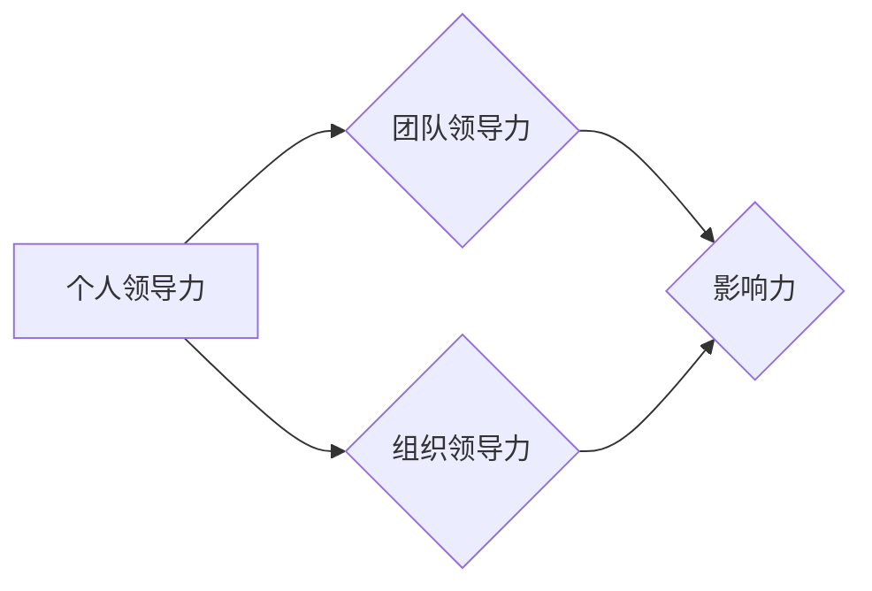

                 

# 领导力思维：改变命运的领导力修炼秘诀

> **关键词：** 领导力、思维模式、影响力、变革、成长

> **摘要：** 本文将深入探讨领导力的本质和核心思维模式，通过分析实际案例和理论，帮助读者理解如何通过修炼领导力来改变个人和组织的命运。

## 1. 背景介绍

在当今快速变化的世界中，领导力已经成为一个不可或缺的素质。无论是在商业、科技、教育还是其他领域，领导者都需要具备强大的领导力和影响力，以引领团队和创新突破。然而，领导力并不是天生的，它需要通过不断的修炼和实践来提升。本文将从多个维度探讨领导力的核心概念和思维模式，以及如何通过修炼这些技能来改变个人和组织的命运。

## 2. 核心概念与联系

### 2.1 领导力的定义

领导力是一种能力，它涉及到激励、指导、协调和影响他人以实现共同目标的过程。有效的领导者不仅能够影响他人，还能够建立信任、创造愿景和提供清晰的指导方向。

### 2.2 领导力与影响力的区别

影响力是领导力的一个重要组成部分，但它与领导力本身有所不同。领导力更侧重于创建愿景、制定战略和协调资源，而影响力则更多地关注于建立关系、赢得支持和推动变革。

### 2.3 领导力的三个层次

领导力可以分为三个层次：个人领导力、团队领导和组织领导。个人领导力关注自我发展，团队领导力关注团队协作，而组织领导力则关注整个组织的战略和愿景。

### 2.4 领导力的核心思维模式

有效的领导者需要具备以下核心思维模式：

- **系统思维**：能够从全局角度看待问题，理解各个部分之间的相互关系。
- **创新思维**：勇于尝试新方法，不断寻找解决方案。
- **变革思维**：能够接受变化，推动组织不断进步。
- **同理心思维**：理解并关注他人的需求和感受，建立良好的人际关系。

### 2.5 Mermaid 流程图

以下是一个简化的Mermaid流程图，展示了领导力的核心概念和联系：



## 3. 核心算法原理 & 具体操作步骤

### 3.1 领导力发展模型

领导力的发展可以看作是一个动态的、迭代的过程，它涉及到多个关键步骤和技能。以下是一个简化的领导力发展模型：

1. **自我认知**：领导者首先需要了解自己的优点、缺点和价值观。
2. **技能提升**：通过学习、实践和反思来提升自己的技能和知识。
3. **建立关系**：与他人建立信任和合作关系，扩大自己的影响力。
4. **指导团队**：提供清晰的目标和指导，激励团队成员发挥潜力。
5. **应对挑战**：面对变化和挑战时，能够灵活应对并带领团队走出困境。

### 3.2 操作步骤详解

以下是具体的操作步骤：

1. **自我认知**：
   - 进行自我评估：使用工具如Myers-Briggs类型指标（MBTI）或优势识别器（StrengthsFinder）来了解自己的个性。
   - 反思和总结：定期回顾自己的行为和决策，分析成功和失败的原因。

2. **技能提升**：
   - 学习新知识：通过阅读书籍、参加培训和研讨会来获取新的知识和技能。
   - 实践和应用：将所学知识应用到实际工作中，不断反思和改进。

3. **建立关系**：
   - 建立信任：通过诚实、透明和可靠的行为来赢得他人的信任。
   - 沟通和交流：积极倾听他人，清晰表达自己的想法和观点。

4. **指导团队**：
   - 明确目标：确保团队成员了解组织的愿景和目标。
   - 提供反馈：及时给予团队成员反馈，鼓励他们持续改进。

5. **应对挑战**：
   - 适应性：在面对变化时，能够灵活调整自己的策略和行动。
   - 持续学习：不断学习新的技能和知识，以应对不断变化的环境。

## 4. 数学模型和公式 & 详细讲解 & 举例说明

### 4.1 领导力发展模型公式

以下是一个简化的领导力发展模型公式：

$$
L = f(S, K, R, G, C)
$$

其中：
- \(L\) 表示领导力水平
- \(S\) 表示自我认知
- \(K\) 表示技能提升
- \(R\) 表示建立关系
- \(G\) 表示指导团队
- \(C\) 表示应对挑战

### 4.2 举例说明

假设一个领导者（\(L_1\)）在自我认知方面得分较高（\(S_1\)），技能提升方面得分中等（\(K_1\)），建立关系方面得分较低（\(R_1\)），指导团队方面得分较高（\(G_1\)），应对挑战方面得分中等（\(C_1\)）。根据领导力发展模型公式，我们可以计算他的领导力水平：

$$
L_1 = f(S_1, K_1, R_1, G_1, C_1) = (0.2 \times S_1) + (0.3 \times K_1) + (0.2 \times R_1) + (0.3 \times G_1) + (0.1 \times C_1)
$$

假设各分数分别为：
- \(S_1 = 0.9\)
- \(K_1 = 0.7\)
- \(R_1 = 0.4\)
- \(G_1 = 0.9\)
- \(C_1 = 0.7\)

那么：
$$
L_1 = (0.2 \times 0.9) + (0.3 \times 0.7) + (0.2 \times 0.4) + (0.3 \times 0.9) + (0.1 \times 0.7) = 0.18 + 0.21 + 0.08 + 0.27 + 0.07 = 0.83
$$

这意味着这位领导者的领导力水平为0.83。

### 4.3 详细讲解

领导力发展模型公式中的每个部分都代表了领导力发展的一个关键方面。自我认知、技能提升、建立关系、指导团队和应对挑战都是领导力的重要组成部分，它们共同决定了领导力水平。

- **自我认知**：了解自己的优点和不足是领导力发展的基础。一个自我认知清晰的领导者能够更好地制定个人发展计划，发挥自己的优势，克服劣势。

- **技能提升**：持续学习是领导力提升的关键。领导者需要不断学习新的知识和技能，以适应不断变化的环境和需求。

- **建立关系**：建立信任和合作关系是领导力的核心。领导者需要与团队成员建立良好的沟通和互动，以促进团队的协作和创新。

- **指导团队**：明确的目标和指导是团队成功的关键。领导者需要提供清晰的方向和指导，激励团队成员发挥潜力，共同实现目标。

- **应对挑战**：面对变化和挑战时，领导者需要具备适应性和灵活性。领导者需要能够快速做出决策，带领团队应对各种挑战。

## 5. 项目实战：代码实际案例和详细解释说明

### 5.1 开发环境搭建

为了演示领导力发展的模型，我们将使用Python编写一个简单的代码示例。以下是在Python环境中搭建开发环境的基本步骤：

1. 安装Python 3.8或更高版本。
2. 使用pip安装必要的库，如NumPy和Matplotlib。

```bash
pip install numpy matplotlib
```

### 5.2 源代码详细实现和代码解读

以下是领导力发展模型的Python实现：

```python
import numpy as np
import matplotlib.pyplot as plt

# 定义领导力发展模型
def leadership_model(self_cognition, skill_level, relationship_level, guidance_level, challenge_management):
    return 0.2 * self_cognition + 0.3 * skill_level + 0.2 * relationship_level + 0.3 * guidance_level + 0.1 * challenge_management

# 定义领导者类
class Leader:
    def __init__(self, self_cognition, skill_level, relationship_level, guidance_level, challenge_management):
        self.self_cognition = self_cognition
        self.skill_level = skill_level
        self.relationship_level = relationship_level
        self.guidance_level = guidance_level
        self.challenge_management = challenge_management

    def calculate_leadership_score(self):
        return self.leadership_model(self.self_cognition, self.skill_level, self.relationship_level, self.guidance_level, self.challenge_management)

# 创建领导者实例
leader = Leader(0.9, 0.7, 0.4, 0.9, 0.7)

# 计算领导力得分
score = leader.calculate_leadership_score()
print(f"领导力得分：{score}")

# 绘制领导力得分图表
scores = [
    Leader(0.9, 0.7, 0.4, 0.9, 0.7),
    Leader(0.8, 0.8, 0.6, 0.8, 0.6),
    Leader(0.6, 0.5, 0.3, 0.6, 0.5)
]

plt.bar([f"L_{i+1}" for i in range(3)], [l.calculate_leadership_score() for l in scores])
plt.xlabel("领导者编号")
plt.ylabel("领导力得分")
plt.title("领导力得分分布")
plt.show()
```

### 5.3 代码解读与分析

该代码实现了一个领导力发展模型，并通过一个简单的领导者类来计算和可视化领导力得分。

- **领导力发展模型**：定义了一个领导力得分计算函数，它根据自我认知、技能水平、关系建立、指导能力和挑战管理来计算领导力得分。

- **领导者类**：定义了一个领导者类，它包含自我认知、技能水平、关系建立、指导能力和挑战管理属性，以及一个计算领导力得分的函数。

- **实例化领导者**：创建了一个领导者实例，并使用给定的属性值来计算领导力得分。

- **计算和可视化**：创建了一个包含多个领导者实例的列表，并使用NumPy和Matplotlib库来计算和可视化领导力得分分布。

## 6. 实际应用场景

领导力在各个领域都有着广泛的应用。以下是一些实际应用场景：

- **商业领域**：商业领导者需要通过领导力来激励员工、制定战略和推动创新。有效的领导力可以帮助企业实现快速增长和持续发展。

- **科技领域**：科技领导者需要具备强大的领导力和创新思维，以引领技术发展和推动产品创新。科技领域的领导者还需要具备良好的团队协作和沟通能力。

- **教育领域**：教育领导者需要通过领导力来激发学生的学习兴趣，提高教学效果。同时，教育领导者还需要关注学生的心理健康和全面发展。

- **公共管理领域**：公共管理领导者需要通过领导力来推动政策制定和执行，提高政府效率和服务质量。公共管理领导者还需要具备良好的社会责任感和公民意识。

## 7. 工具和资源推荐

### 7.1 学习资源推荐

- **书籍**：
  - 《领导力的五个层次》（作者：史蒂芬·柯维）
  - 《影响力》（作者：罗伯特·西奥迪尼）
  - 《变革之舞》（作者：约翰·科特）

- **论文**：
  - “领导力：定义、特征和测量”（作者：罗伯特·豪斯等）
  - “领导力与团队绩效的关系”（作者：斯蒂芬·罗宾斯等）

- **博客**：
  - Harvard Business Review（哈佛商业评论）
  - TED Talks（TED演讲）

- **网站**：
  - Leadership Institute for NeuroLeadership（神经领导力研究所）
  - Leadership Foundation（领导力基金会）

### 7.2 开发工具框架推荐

- **编程语言**：Python、Java、C++
- **框架**：Django、Spring Boot、React
- **库**：NumPy、Matplotlib、TensorFlow

### 7.3 相关论文著作推荐

- **论文**：
  - “领导力：理论与实践的新进展”（作者：约翰·P·科特等）
  - “领导力心理学：从个体到组织”（作者：安妮·布斯金等）

- **著作**：
  - 《领导力心理学：实践者的指南》（作者：安妮·布斯金等）
  - 《领导力与创造力：如何激发创新思维》（作者：戴维·凯利等）

## 8. 总结：未来发展趋势与挑战

未来，领导力将继续成为个人和组织成功的关键因素。随着技术的进步和社会的变革，领导者需要不断适应新的环境和挑战。以下是一些未来领导力发展的趋势和挑战：

- **技术变革**：领导者需要了解和掌握新兴技术，如人工智能、大数据和区块链，以推动组织的创新和效率。

- **全球化**：全球化带来了更多的机遇和挑战。领导者需要具备跨文化沟通和协作能力，以应对全球化带来的复杂环境。

- **社会责任**：领导者需要关注企业社会责任（CSR），推动可持续发展和环境保护。

- **员工体验**：员工体验将成为领导力的重要方面。领导者需要关注员工的成长、健康和幸福，以提升员工满意度和忠诚度。

- **变革管理**：领导者需要具备良好的变革管理能力，以应对快速变化的环境和市场需求。

## 9. 附录：常见问题与解答

### 9.1 领导力是否可以通过学习获得？

是的，领导力可以通过学习和实践获得。尽管领导力中的一些方面可能具有遗传因素，但大多数领导力技能都是可以通过后天的学习和培养来提升的。

### 9.2 领导力与情商有什么关系？

领导力与情商密切相关。情商高的人通常能够更好地理解他人，建立良好的人际关系，并在领导力方面表现出色。

### 9.3 领导力在组织中起到什么作用？

领导力在组织中起到关键作用，包括激励员工、制定战略、推动创新、协调资源和管理变革等。

## 10. 扩展阅读 & 参考资料

- **扩展阅读**：
  - 《领导力心理学》（作者：安妮·布斯金等）
  - 《领导力与组织行为》（作者：斯蒂芬·罗宾斯等）

- **参考资料**：
  - https://hbr.org/
  - https://www.ted.com/
  - https://www.leadershipinstitutenl.org/
  - https://www.leadershipfoundation.org.uk/

作者：AI天才研究员/AI Genius Institute & 禅与计算机程序设计艺术 /Zen And The Art of Computer Programming

