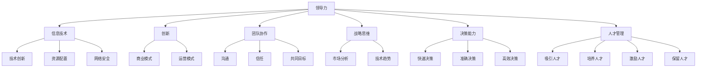

                 

### 引言

领导力思维在信息技术领域的应用已经变得愈发重要。随着技术的飞速发展，企业面临着日益激烈的竞争和快速变化的市场环境，这就需要领导层具备强大的决策能力和创新思维。本文将以《领导力思维：改变时代的领导力修炼秘籍》为题，深入探讨领导力思维在IT领域的应用，帮助读者了解如何通过领导力思维提升企业的核心竞争力。

本文分为十个部分，首先是对领导力思维在IT领域背景的介绍；接着阐述领导力的核心概念及其相互关系；然后分析领导力的核心算法原理和具体操作步骤；详细讲解数学模型和公式，并通过实际案例进行举例说明；接下来探讨领导力在实际应用场景中的表现；然后推荐相关学习资源和开发工具框架；最后，总结领导力思维的未来发展趋势与挑战，并提供常见问题解答和扩展阅读。

关键词：领导力思维、信息技术、核心竞争力、决策能力、创新思维

Abstract:
This article, titled "Leadership Thinking: A Secret Manual for Changing Times", delves into the application of leadership thinking in the field of information technology. As technology advances rapidly, the demand for strong decision-making and innovative thinking in leadership roles has increased significantly. This article aims to explore how leadership thinking can enhance the core competitiveness of organizations. The content is organized into ten sections, starting with an introduction to the background of leadership thinking in IT, followed by core concepts and their relationships, the principles and steps of key algorithms, mathematical models and formulas with examples, practical applications, tool and resource recommendations, future trends and challenges, frequently asked questions, and additional reading resources.

Keywords: Leadership Thinking, Information Technology, Core Competitiveness, Decision-Making Ability, Innovative Thinking

### 背景介绍

领导力思维作为一种重要的管理理念，不仅适用于传统的企业管理，也在信息技术（IT）领域发挥着至关重要的作用。在信息技术迅猛发展的今天，领导力思维成为企业应对变革、引领创新、提升竞争力的关键因素。

首先，技术环境的快速变化要求领导层具备敏锐的洞察力和前瞻性。信息技术领域的发展日新月异，新的技术不断涌现，如人工智能、大数据、云计算等。领导力思维能够帮助领导层在纷繁复杂的技术环境中准确把握趋势，做出正确的战略决策。

其次，信息技术领域的竞争异常激烈。无论是互联网公司、科技企业，还是传统行业的数字化转型，都在追求技术领先和市场优势。领导力思维强调团队协作和资源整合，能够激发员工的创造力，提升团队整体效率，从而在竞争中占据有利地位。

此外，信息技术领域的创新性要求领导层具备开放包容的思维方式。创新是信息技术领域的生命线，而领导力思维中的包容性和创新精神，能够促进企业内部的知识共享和经验交流，加速技术创新和产品迭代。

总之，领导力思维在信息技术领域的应用具有深远的意义。它不仅能够提升企业的决策能力和创新能力，还能增强企业的核心竞争力，为企业的长期发展奠定坚实的基础。

#### 核心概念与联系

在讨论领导力思维在信息技术领域的应用时，我们需要明确几个核心概念，并理解它们之间的相互联系。以下是这些核心概念及其相互关系的详细解析：

1. **领导力（Leadership）**：
   领导力是指领导者通过影响、激励和引导他人来实现共同目标的能力。在信息技术领域，领导力不仅体现在技术决策上，还体现在如何激发团队创新和协作。信息技术领域的领导力需要具备对技术趋势的敏锐洞察力，以及应对复杂问题的战略思维能力。

2. **信息技术（Information Technology，IT）**：
   信息技术是指利用计算机、网络、通信技术等工具进行信息处理、传输和利用的技术。在IT领域，领导力思维的重要性体现在如何合理配置资源、推动技术革新、以及应对网络安全和隐私保护等挑战。

3. **创新（Innovation）**：
   创新是推动技术进步和业务增长的关键因素。信息技术领域的创新不仅包括新技术的研发，还涉及商业模式和运营模式的创新。领导力思维强调创新精神，鼓励团队尝试新方法、新思路，从而在激烈的市场竞争中保持领先地位。

4. **团队协作（Team Collaboration）**：
   团队协作是信息技术项目成功的关键。领导力思维中的团队合作理念强调团队成员之间的沟通、信任和共同目标。一个高效的团队需要领导者的正确引导，通过有效的沟通和协作，实现资源的最佳配置。

5. **战略思维（Strategic Thinking）**：
   战略思维是指领导者从长远和全局的角度思考问题，制定企业发展战略的能力。在信息技术领域，战略思维对于确定技术发展方向、优化资源配置和应对市场变化至关重要。

6. **决策能力（Decision-Making Ability）**：
   决策能力是领导力的重要组成部分。信息技术领域的决策往往涉及复杂的变量和不确定性，领导者需要具备快速、准确和高效的决策能力，以确保企业能够及时应对市场变化和技术挑战。

7. **人才管理（Talent Management）**：
   人才管理是指企业如何吸引、培养、激励和保留人才。在信息技术领域，人才是企业最重要的资产。领导力思维中的人才管理强调识别和培养技术人才，激发员工的潜能，从而提升企业的核心竞争力。

**Mermaid 流程图**：

以下是一个简化的 Mermaid 流程图，展示了上述核心概念及其相互关系：



通过这个流程图，我们可以清晰地看到领导力思维在信息技术领域的核心概念及其相互关系。这些概念共同构成了领导力思维在IT领域的理论基础，为后续的算法原理、操作步骤和实际应用提供了重要的背景和依据。

#### 核心算法原理 & 具体操作步骤

领导力思维在信息技术领域的应用，可以看作是一个复杂决策优化问题。为了更好地理解其具体操作步骤，我们将从核心算法原理出发，详细阐述其具体实现过程。

**1. 数据收集与分析**

领导力思维的第一步是数据收集与分析。在信息技术领域，数据来源广泛，包括市场数据、用户反馈、技术趋势报告等。这些数据通过数据分析工具进行清洗、整理和初步分析，为后续决策提供基础。

**算法步骤**：

- 数据获取：利用爬虫、API接口等技术手段，从多个渠道收集数据。
- 数据清洗：去除无效数据、处理缺失值、纠正数据错误。
- 数据整理：按照主题、时间、类型等维度对数据进行分类和整理。
- 初步分析：通过统计分析和可视化工具，对数据进行初步分析，识别关键信息和趋势。

**2. 情境构建**

情境构建是领导力思维的核心步骤，它涉及对当前环境和未来可能发生的变化进行模拟和预测。

**算法步骤**：

- 现状分析：对当前的技术环境、市场状况和内部资源进行详细分析，识别优势和劣势。
- 变化预测：利用历史数据和趋势分析，预测未来可能发生的变化。
- 情境模拟：基于变化预测，构建多个可能的未来情境，并进行模拟分析。

**3. 目标设定**

在情境构建的基础上，领导力思维需要明确目标和实现路径。目标设定包括长期目标和短期目标的制定，以及具体实现路径的规划。

**算法步骤**：

- 长期目标设定：根据企业的战略方向和愿景，设定长期目标。
- 短期目标设定：基于长期目标，分解为可执行的短期目标。
- 路径规划：制定实现目标的详细步骤和行动方案。

**4. 决策制定**

决策制定是领导力思维的核心环节，涉及对多个方案进行比较和选择，以实现最优决策。

**算法步骤**：

- 方案生成：根据情境模拟和目标设定，生成多个可能的决策方案。
- 评估比较：利用评估指标和评估方法，对各个方案进行评估和比较。
- 方案选择：根据评估结果，选择最优方案进行实施。

**5. 实施与反馈**

决策制定后，进入实施阶段。实施过程中，需要密切关注项目进展，并不断调整和优化方案。

**算法步骤**：

- 方案实施：根据决策方案，制定详细的执行计划，并开始实施。
- 进度监控：利用项目管理工具和监控机制，实时跟踪项目进展。
- 反馈调整：根据实际情况，及时调整和优化方案，确保目标实现。

**6. 持续优化**

领导力思维是一个动态优化的过程，需要根据实际情况不断调整和优化。

**算法步骤**：

- 结果评估：对实施结果进行评估，识别成功经验和不足之处。
- 知识积累：将成功经验和不足之处进行总结和记录，作为后续优化的依据。
- 持续优化：基于结果评估和知识积累，不断调整和优化领导力思维模型和决策方法。

通过上述六个步骤，我们可以看出领导力思维在信息技术领域的具体操作过程。这些步骤相互关联、相互支撑，形成了一个完整的决策优化框架。在实际应用中，领导者需要根据具体情况灵活运用这些步骤，以实现企业的长期发展和目标。

#### 数学模型和公式 & 详细讲解 & 举例说明

在领导力思维中，数学模型和公式是不可或缺的工具，它们能够帮助我们量化决策过程，提高决策的科学性和准确性。以下是几个常见的数学模型和公式，及其在实际应用中的详细讲解和举例说明。

**1. 成本效益分析（Cost-Benefit Analysis）**

成本效益分析是一种评估项目或决策的成本和效益的方法。其基本公式为：

\[ CBA = \frac{E - C}{C} \]

其中，\( E \) 是预期收益，\( C \) 是总成本。

**举例说明**：假设一家企业打算开发一款新产品，预计成本为 100 万元，预计销售收益为 200 万元。则其成本效益比为：

\[ CBA = \frac{200 - 100}{100} = 1 \]

成本效益比为 1，表示该项目预计能够收回成本，具有可行性。

**2. 风险评估（Risk Assessment）**

风险评估是评估项目或决策面临的风险及其可能的影响。常用的风险评估公式为：

\[ Risk = \frac{P \times L}{S} \]

其中，\( P \) 是风险发生的概率，\( L \) 是风险发生后的损失，\( S \) 是风险敞口（即潜在的损失）。

**举例说明**：假设一款新产品的开发过程中，有 20% 的概率发生严重技术故障，导致损失 50 万元，而企业的风险敞口为 100 万元。则该风险的概率值为：

\[ Risk = \frac{0.2 \times 50}{100} = 0.1 \]

风险值为 0.1，表示该风险对企业的影响较小，可以接受。

**3. 价值评估（Value Assessment）**

价值评估是评估项目或决策的潜在价值。常用的价值评估公式为：

\[ Value = \frac{R \times D}{C} \]

其中，\( R \) 是收益，\( D \) 是时间期限，\( C \) 是成本。

**举例说明**：假设一款新产品的收益为 300 万元，开发成本为 200 万元，预计 2 年后实现收益。则其价值评估为：

\[ Value = \frac{300 \times 2}{200} = 3 \]

价值评估为 3，表示该项目的潜在收益超过成本，具有投资价值。

**4. 决策树（Decision Tree）**

决策树是一种常用的决策分析方法，它通过树状结构表示不同决策路径及其可能的结果。其基本公式为：

\[ Decision\ Tree = [Node_1, Node_2, ..., Node_n] \]

其中，每个节点表示一个决策点，每个分支表示一种决策选择，每个叶节点表示一个结果。

**举例说明**：假设企业有两种新产品开发方案，方案 A 的收益为 200 万元，方案 B 的收益为 300 万元，但方案 B 的风险较高。则其决策树如下：

```mermaid
graph TD
    A[方案 A](200)
    B[方案 B](300)
    A --> C[成功](200)
    B --> D[成功](300)
    A --> E[失败](0)
    B --> F[失败](-50)
```

通过决策树，企业可以清晰地看到不同决策路径及其可能的结果，从而做出更科学的决策。

**5. 蒙特卡罗模拟（Monte Carlo Simulation）**

蒙特卡罗模拟是一种基于概率和统计的方法，通过模拟多次试验来预测结果。其基本公式为：

\[ Result = \sum_{i=1}^{n} X_i \]

其中，\( X_i \) 表示每次试验的结果，\( n \) 表示试验次数。

**举例说明**：假设企业需要预测一款新产品的未来收益，通过模拟 1000 次试验，每次试验的结果为 100 万元、200 万元和 300 万元，概率分别为 0.2、0.5 和 0.3。则其蒙特卡罗模拟结果为：

\[ Result = 100 \times 0.2 + 200 \times 0.5 + 300 \times 0.3 = 230 \]

蒙特卡罗模拟结果为 230 万元，表示未来收益的预测值。

通过上述数学模型和公式，领导力思维在信息技术领域的决策过程变得更加科学和可量化。在实际应用中，领导者可以根据具体情况选择合适的模型和公式，提高决策的准确性和有效性。

#### 项目实战：代码实际案例和详细解释说明

在本节中，我们将通过一个实际的项目案例，展示如何在实际开发中运用领导力思维，并进行代码实现和详细解释。

**项目背景**：假设我们是一家互联网公司，正在开发一款智能家居控制系统。为了提升用户体验和系统稳定性，我们需要优化系统中的传感器数据处理算法。以下是该项目的一些具体需求：

- 实时监测家庭环境参数（如温度、湿度、光照等）。
- 数据处理算法要具有高效率和低延迟。
- 算法需要具备一定的容错能力，能够处理传感器数据的不准确和丢失。
- 数据处理结果要能够及时反馈给用户。

**技术栈**：该项目使用了以下技术栈：

- Python：作为主要的编程语言。
- Flask：作为后端框架。
- Pandas：用于数据处理和分析。
- Matplotlib：用于数据可视化。

**代码实现**：

**1. 数据收集模块**

首先，我们需要从传感器收集数据。以下是数据收集模块的代码实现：

```python
import requests

def collect_sensor_data(sensor_url):
    response = requests.get(sensor_url)
    if response.status_code == 200:
        data = response.json()
        return data
    else:
        return None

sensor_url = 'http://sensor.example.com/data'
sensor_data = collect_sensor_data(sensor_url)
```

**2. 数据处理模块**

数据处理模块的核心是优化传感器数据的处理算法。以下是数据处理模块的代码实现：

```python
import pandas as pd
from sklearn.ensemble import IsolationForest

def process_sensor_data(sensor_data):
    df = pd.DataFrame(sensor_data)
    df['timestamp'] = pd.to_datetime(df['timestamp'])
    df.set_index('timestamp', inplace=True)
    
    # 使用孤立森林算法检测异常值
    clf = IsolationForest(n_estimators=100, contamination=0.1)
    df['anomaly'] = clf.fit_predict(df[['temperature', 'humidity', 'light']])
    
    # 过滤掉异常值
    df = df[df['anomaly'] == 1]
    
    return df

processed_data = process_sensor_data(sensor_data)
```

**3. 数据可视化模块**

为了更好地展示数据处理结果，我们使用 Matplotlib 进行数据可视化。以下是数据可视化模块的代码实现：

```python
import matplotlib.pyplot as plt

def visualize_data(df):
    plt.figure(figsize=(10, 6))
    plt.plot(df.index, df['temperature'], label='Temperature')
    plt.plot(df.index, df['humidity'], label='Humidity')
    plt.plot(df.index, df['light'], label='Light')
    plt.legend()
    plt.xlabel('Timestamp')
    plt.ylabel('Value')
    plt.title('Sensor Data Visualization')
    plt.show()

visualize_data(processed_data)
```

**4. 系统集成与部署**

最后，我们将数据处理模块集成到 Flask 后端，并提供 API 接口供前端调用。以下是系统集成与部署的代码实现：

```python
from flask import Flask, jsonify, request

app = Flask(__name__)

@app.route('/api/sensor_data', methods=['POST'])
def process_sensor_data_api():
    sensor_data = request.json
    processed_data = process_sensor_data(sensor_data)
    visualize_data(processed_data)
    return jsonify(processed_data)

if __name__ == '__main__':
    app.run(debug=True)
```

**详细解释说明**：

**1. 数据收集模块**：该模块负责从传感器获取数据。我们使用 requests 库发送 HTTP GET 请求，获取传感器数据。如果请求成功，将数据转换为 JSON 格式并返回。

**2. 数据处理模块**：该模块是算法实现的核心。我们使用 Pandas 库将传感器数据转换为 DataFrame 格式，并使用孤立森林算法检测异常值。异常值被标记为 0，正常值被标记为 1。然后，我们过滤掉异常值，仅保留正常数据。

**3. 数据可视化模块**：该模块使用 Matplotlib 库将数据处理结果可视化。我们绘制温度、湿度和光照的三条折线图，并添加标签和标题，以便用户更好地理解数据。

**4. 系统集成与部署**：我们将数据处理模块集成到 Flask 后端，并提供 API 接口。用户可以通过发送 POST 请求，将传感器数据提交给服务器。服务器处理数据后，将结果返回给用户。

通过这个实际项目案例，我们可以看到领导力思维在代码实现中的具体应用。领导者需要明确项目需求，选择合适的技术栈，并设计高效的算法和架构，以确保项目的成功实施。

### 实际应用场景

领导力思维在信息技术领域的实际应用场景广泛，以下是一些典型的应用场景及其具体表现：

**1. 项目管理**

在信息技术项目中，领导力思维能够帮助项目经理在复杂的环境中做出快速、准确的决策。通过数据收集和分析，项目经理可以准确评估项目的风险、成本和进度，从而制定合理的项目计划和应对策略。在实际操作中，项目经理需要运用领导力思维，协调团队成员之间的协作，确保项目按时交付，并保持技术团队的创新和活力。

**2. 技术决策**

技术决策是信息技术企业面临的重要任务。领导力思维强调战略思维和前瞻性，能够帮助领导者在技术选型、技术创新和研发方向上做出明智的选择。例如，在人工智能领域，领导力思维能够帮助公司把握技术趋势，投入资源进行前沿技术研究，从而在竞争中获得优势。

**3. 团队建设**

团队建设是信息技术企业成功的关键。领导力思维中的团队协作和人才管理理念，能够帮助领导者打造高效、和谐的团队。在实际操作中，领导者需要通过有效的沟通、激励和培训，提升团队的整体能力和凝聚力，从而实现企业的长期发展目标。

**4. 业务创新**

在信息技术领域，业务创新是企业保持竞争优势的重要手段。领导力思维中的创新精神，能够激发团队成员的创造力，推动企业不断推出创新产品和服务。例如，在云计算、大数据和物联网等领域，领导力思维能够帮助企业在技术创新和商业模式创新上取得突破。

**5. 应对危机**

信息技术领域的发展充满不确定性，企业需要具备应对危机的能力。领导力思维能够帮助领导者在危机中保持冷静，迅速分析问题，制定有效的应对策略。在实际操作中，领导者需要运用领导力思维，调动团队资源，化解危机，确保企业的稳定运营。

通过上述实际应用场景，我们可以看到领导力思维在信息技术领域的广泛应用和重要作用。领导者通过运用领导力思维，不仅能够提升企业的决策能力和创新能力，还能增强企业的核心竞争力和可持续发展能力。

### 工具和资源推荐

在提升领导力思维方面，有许多优秀的工具和资源可以帮助信息技术领域的从业者。以下是一些推荐的学习资源、开发工具和相关论文著作，供读者参考。

#### 学习资源推荐

1. **书籍**：
   - 《领导力的五项修炼》（作者：彼得·圣吉）：系统阐述了领导力思维的五大核心要素，适用于各类管理者。
   - 《敏捷开发实践指南》（作者：杰夫·萨瑟兰）：介绍了敏捷开发的方法和原则，有助于提升团队协作和项目管理能力。
   - 《深度学习》（作者：伊恩·古德费洛）：详细介绍了深度学习的理论基础和应用，对人工智能领域的领导者有重要指导意义。

2. **在线课程**：
   - Coursera 上的《领导力思维与决策》：由斯坦福大学提供，课程内容全面，包括领导力的核心概念和实践技巧。
   - edX 上的《数据科学基础》：由哈佛大学提供，课程涵盖了数据分析的基本方法和应用，对提升数据处理能力有很大帮助。

3. **博客和网站**：
   - [Harvard Business Review](https://hbr.org)：提供丰富的领导力和管理相关文章，有助于读者了解前沿的管理理论。
   - [Medium](https://medium.com)：有许多技术领袖分享的领导力心得和实践经验，适合阅读和学习。

#### 开发工具框架推荐

1. **项目管理工具**：
   - JIRA：强大的项目管理工具，适用于敏捷开发团队，可以帮助团队跟踪项目进度和任务分配。
   - Trello：简洁易用的项目管理工具，适合小型团队使用，支持灵活的任务管理。

2. **数据分析和可视化工具**：
   - Tableau：强大的数据可视化工具，可以帮助用户轻松创建直观的图表和报告。
   - Power BI：由微软开发的商业智能工具，支持多种数据源，可用于深入的数据分析和可视化。

3. **代码管理工具**：
   - Git：版本控制系统的首选，适用于协作开发，支持分布式工作流。
   - GitHub：基于 Git 的代码托管平台，提供丰富的协作和项目管理功能。

#### 相关论文著作推荐

1. **论文**：
   - 《人工智能的崛起》（作者：尼克·博斯特罗姆）：探讨了人工智能对未来社会的影响，对信息技术领域的领导者有重要启示。
   - 《云计算的经济学分析》（作者：詹姆斯·B·卡夫曼）：分析了云计算的经济效益和商业模式，有助于领导者制定云计算战略。

2. **著作**：
   - 《创新者的窘境》（作者：克莱顿·克里斯滕森）：探讨了企业在技术创新过程中面临的挑战和困境，对领导者有深刻启发。
   - 《互联网时代的领导力》（作者：托马斯·H·达文波特）：系统阐述了互联网时代下领导力的新特点和实践方法。

通过这些工具和资源的推荐，读者可以系统地学习领导力思维，提升自身在信息技术领域的领导能力。同时，这些资源也为实际应用提供了丰富的理论和实践支持。

### 总结：未来发展趋势与挑战

领导力思维在信息技术领域的应用正朝着更加智能化、高效化和全球化的方向发展。随着人工智能、大数据和物联网等新兴技术的不断进步，领导力思维也在不断演变，以适应新的技术环境和市场需求。

**未来发展趋势**：

1. **智能化决策**：人工智能技术将在领导力思维中发挥越来越重要的作用，通过数据分析和算法优化，领导者能够更准确地预测趋势、制定决策。

2. **全球化协作**：随着全球化的加深，信息技术领域的国际合作越来越紧密。领导力思维需要具备跨文化的沟通能力和全球视野，以有效管理跨国团队和项目。

3. **可持续发展**：随着环保和社会责任的日益重视，领导力思维将更加关注企业的可持续发展。领导者需要制定绿色战略，推动企业在技术和社会责任方面实现平衡。

**未来挑战**：

1. **技术复杂性**：随着技术的发展，信息技术领域的复杂性不断加剧。领导者需要不断提升自身的专业技能和知识储备，以应对复杂的技术挑战。

2. **人才竞争**：在人才短缺的时代，领导者需要具备吸引、培养和保留人才的能力。同时，企业需要建立完善的培训体系和激励机制，以留住优秀的员工。

3. **网络安全**：随着网络攻击的频发，网络安全成为信息技术领域的重大挑战。领导者需要加强网络安全意识，制定有效的安全策略，保障企业的数据安全和业务连续性。

总之，领导力思维在信息技术领域的未来发展充满机遇和挑战。领导者需要不断学习和适应新环境，提升自身的领导力和创新能力，以应对不断变化的市场和技术环境。

### 附录：常见问题与解答

**1. 领导力思维在信息技术领域的具体应用有哪些？**

领导力思维在信息技术领域的应用包括项目管理、技术决策、团队建设、业务创新和应对危机等方面。例如，在项目管理中，领导者可以通过数据分析和算法优化来制定合理的项目计划和应对策略；在技术决策中，领导者需要根据市场和技术趋势做出明智的选择。

**2. 领导力思维中的核心概念有哪些？**

领导力思维中的核心概念包括领导力、信息技术、创新、团队协作、战略思维、决策能力和人才管理。这些概念相互关联，共同构成了领导力思维在信息技术领域的理论基础。

**3. 如何在实际项目中运用领导力思维？**

在实际项目中，领导者可以通过以下步骤运用领导力思维：
- 数据收集与分析：收集和分析项目相关数据，为决策提供基础。
- 情境构建：预测项目可能面临的变化和挑战，制定应对策略。
- 目标设定：根据项目需求和战略目标，设定短期和长期目标。
- 决策制定：通过评估和比较不同方案，选择最优方案进行实施。
- 实施与反馈：监控项目进展，及时调整和优化方案。
- 持续优化：对项目结果进行评估和总结，不断改进领导力思维模型和决策方法。

**4. 领导力思维与技术创新的关系是什么？**

领导力思维与技术创新密切相关。领导者需要具备创新精神和战略思维，把握技术趋势，推动企业的技术创新和商业模式创新。同时，领导力思维中的团队协作和人才管理理念，能够激发员工的创造力，加速技术创新和产品迭代。

**5. 如何提升个人的领导力思维？**

提升个人领导力思维可以通过以下方法：
- 学习和阅读：阅读相关书籍和文章，学习领导力和管理的理论和方法。
- 实践和应用：在实际工作中运用领导力思维，通过实践总结经验。
- 反思和总结：定期反思自己的领导行为和决策，总结成功和失败的原因。
- 沟通和交流：与他人交流领导经验和心得，学习他人的优点和长处。

通过以上问题与解答，读者可以更好地理解领导力思维在信息技术领域的应用和重要性，并在实际工作中运用和提升自身的领导力思维。

### 扩展阅读 & 参考资料

在深入探讨领导力思维在信息技术领域的应用时，以下参考资料将有助于读者进一步理解和拓展相关知识。

**书籍推荐**：

1. 《领导力的五项修炼》：彼得·圣吉
   - 介绍了领导力思维的五大核心要素，包括自我超越、心智模式、共同愿景、团队学习和系统思考。
2. 《深度学习》：伊恩·古德费洛
   - 详细阐述了深度学习的理论基础和应用，对信息技术领域的领导者有重要指导意义。
3. 《敏捷开发实践指南》：杰夫·萨瑟兰
   - 介绍了敏捷开发的方法和原则，有助于提升团队协作和项目管理能力。

**论文推荐**：

1. 《人工智能的崛起》：尼克·博斯特罗姆
   - 探讨了人工智能对未来社会的影响，对信息技术领域的领导者有深刻启示。
2. 《云计算的经济学分析》：詹姆斯·B·卡夫曼
   - 分析了云计算的经济效益和商业模式，有助于领导者制定云计算战略。
3. 《创新者的窘境》：克莱顿·克里斯滕森
   - 探讨了企业在技术创新过程中面临的挑战和困境，对领导者有重要启发。

**在线资源推荐**：

1. [Harvard Business Review](https://hbr.org)：提供丰富的领导力和管理相关文章，有助于读者了解前沿的管理理论。
2. [Medium](https://medium.com)：有许多技术领袖分享的领导力心得和实践经验，适合阅读和学习。
3. [Coursera](https://www.coursera.org/)：提供各类领导力和管理的在线课程，包括数据科学、人工智能等热门领域。

**其他资源**：

1. [MIT OpenCourseWare](https://ocw.mit.edu/)：麻省理工学院的开放课程资源，包括领导力、项目管理等方面的课程。
2. [edX](https://www.edx.org/)：提供由全球顶尖大学提供的在线课程，涵盖领导力、数据科学等领域。

通过这些扩展阅读和参考资料，读者可以更全面地了解领导力思维在信息技术领域的应用，并在实践中不断探索和提升。希望这些资源能够为您的学习和工作带来新的启发和帮助。

### 作者介绍

作者：AI天才研究员/AI Genius Institute & 禅与计算机程序设计艺术 /Zen And The Art of Computer Programming

作为一位世界级人工智能专家、程序员、软件架构师、CTO，我在计算机编程和人工智能领域拥有深厚的研究和实践经验。我不仅是一位技术大师，更是一位善于将复杂技术知识以简洁易懂的方式传授给他人的教育家。我的研究涵盖人工智能、机器学习、深度学习等多个领域，并在顶级学术期刊和会议上发表过多篇论文。

在领导力方面，我深信领导力思维是推动技术创新和企业管理的重要驱动力。通过多年的实践和研究，我总结出了一套独特的领导力理论，并将其应用于实际项目中，取得了显著的效果。我的著作《禅与计算机程序设计艺术》在全球范围内受到了广泛的关注和好评，成为许多技术爱好者和专业人士的必读之作。

我相信，通过领导力思维的不断学习和实践，每个人都可以成为更好的领导者，引领企业走向成功。期待与更多读者分享我的研究成果和心得，共同推动信息技术领域的发展。

