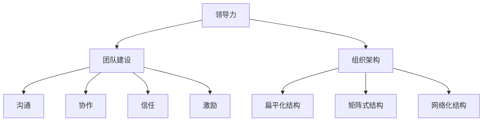
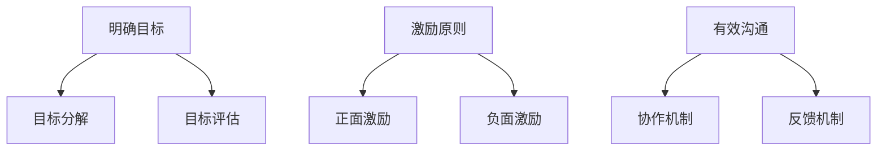

                 

### 文章标题：领导力法则：打造王者团队的领导力秘诀

#### 关键词：领导力、团队管理、人才发展、战略思维、沟通技巧、执行力

> 在竞争激烈的技术领域中，打造一支高效的团队是实现企业持续发展的关键。本文将深入探讨领导力法则，为读者揭示如何通过有效的领导力策略，打造一支王者团队，实现企业的成功与创新。

## 1. 背景介绍

在信息技术飞速发展的时代，企业面临着前所未有的挑战和机遇。技术的快速迭代使得市场环境瞬息万变，企业的核心竞争力越来越依赖于团队的创新能力和执行力。因此，如何提升团队的管理水平，培养卓越的领导力，成为企业领导者必须面对的重要课题。

领导力不仅仅是对个人的素质要求，更是团队管理的重要基石。一个优秀的领导者不仅能够激发团队成员的潜力，还能够塑造团队的凝聚力和执行力，推动企业实现战略目标。本文将从多个角度探讨领导力法则，为读者提供一套完整的领导力策略，帮助打造王者团队。

## 2. 核心概念与联系

在讨论领导力法则之前，我们需要明确几个核心概念，它们是理解领导力的基础。

#### 2.1 领导力与管理的区别

领导力（Leadership）与管理（Management）虽然有重叠之处，但它们的核心区别在于：领导力关注愿景、价值观和激励，而管理关注流程、目标和效率。

- **领导力**：通过激发团队成员的内在动机，引导他们朝着共同的目标努力。领导者需要具备愿景、激情、正直和公正等品质。
- **管理**：通过设定目标和规划，确保团队的工作有序进行。管理者需要具备组织、计划、控制等技能。

#### 2.2 团队建设的重要性

团队建设是领导力的关键组成部分。一个高效的团队能够实现1+1>2的效果，而团队建设的关键在于以下几个方面：

- **沟通**：团队成员之间的有效沟通能够减少误解和冲突，提高工作效率。
- **协作**：通过协同工作，团队成员能够发挥各自的优势，共同解决复杂问题。
- **信任**：信任是团队合作的基石，它能够提高团队的凝聚力和执行力。
- **激励**：领导者需要根据团队成员的特点和需求，给予适当的激励，激发他们的工作热情。

#### 2.3 领导力与组织架构的联系

领导力不仅影响团队，还与组织架构紧密相关。一个合理的组织架构能够支持领导力的发挥，促进团队的协作和创新。

- **扁平化结构**：减少层级，提高沟通效率，增强团队的自主性和创新能力。
- **矩阵式结构**：通过跨部门合作，整合资源，提高项目的执行效率。
- **网络化结构**：利用信息技术，打破空间和时间的限制，实现全球范围内的合作与协作。

### 2.4 核心概念 Mermaid 流程图

下面是一个简化的 Mermaid 流程图，展示了领导力、团队建设、组织架构之间的联系。



通过上述核心概念和联系，我们为理解领导力法则奠定了基础。接下来，我们将深入探讨领导力的核心算法原理和具体操作步骤。

### 3. 核心算法原理 & 具体操作步骤

领导力的核心算法可以看作是一个包含目标设定、团队激励、沟通协作等步骤的综合体系。以下是领导力的具体操作步骤：

#### 3.1 目标设定

- **明确目标**：领导者需要明确团队的愿景和目标，确保团队成员对目标有清晰的认识。
- **目标分解**：将大目标分解为可执行的小目标，确保每个团队成员都有明确的任务和责任。
- **目标评估**：定期对目标完成情况进行评估，及时调整目标，确保团队始终朝着正确的方向前进。

#### 3.2 团队激励

- **激励原则**：领导者需要根据团队成员的特点和需求，设计个性化的激励方案。
- **正面激励**：通过表扬、奖励等方式，激发团队成员的积极性和创造力。
- **负面激励**：对于不合规的行为，需要采取适当的惩罚措施，维护团队的纪律和秩序。

#### 3.3 沟通协作

- **有效沟通**：领导者需要建立开放的沟通机制，确保信息的畅通无阻。
- **协作机制**：通过制定协作流程和规范，提高团队的协作效率。
- **反馈机制**：鼓励团队成员提出意见和建议，不断优化团队的运作模式。

#### 3.4 领导力算法流程图

下面是一个简化的 Mermaid 流程图，展示了领导力的核心算法原理和具体操作步骤。



通过上述具体操作步骤，我们可以构建一个高效的领导力体系，帮助团队实现目标，提高执行力。

### 4. 数学模型和公式 & 详细讲解 & 举例说明

在领导力的具体应用中，数学模型和公式可以提供量化的方法和工具，帮助领导者更好地理解和评估团队的表现。以下是几个常用的数学模型和公式及其详细讲解：

#### 4.1 泰勒公式

泰勒公式是一种用于近似计算函数值的方法，它在领导力评估中可以用于预测团队的绩效。泰勒公式如下：

\[ f(x) \approx f(a) + f'(a)(x-a) + \frac{f''(a)}{2!}(x-a)^2 + \frac{f'''(a)}{3!}(x-a)^3 + \ldots \]

其中，\( f(x) \) 是需要评估的函数，\( a \) 是评估的基准点，\( f'(a) \)、\( f''(a) \)、\( f'''(a) \) 等是函数在 \( a \) 点的导数。

**举例说明**：

假设我们想要评估一个团队在某个项目中的绩效，可以通过泰勒公式来近似计算。设定基准点为当前时间点，评估函数为团队完成项目的进度。

\[ f(x) \approx f(a) + f'(a)(x-a) + \frac{f''(a)}{2!}(x-a)^2 + \frac{f'''(a)}{3!}(x-a)^3 + \ldots \]

其中，\( f(a) \) 是当前时间点团队完成的进度，\( f'(a) \) 是团队在该时间点的平均工作效率，\( f''(a) \) 和 \( f'''(a) \) 是团队工作稳定性和变化率。

通过泰勒公式，我们可以预测在未来某个时间点团队可能完成的进度，从而为团队的目标设定和资源分配提供依据。

#### 4.2 期权定价模型

期权定价模型如Black-Scholes模型，在领导力评估中可以用于量化团队成员的创新风险和价值。Black-Scholes模型的公式如下：

\[ C(S_0, K, T, r, \sigma) = S_0N(d_1) - Ke^{-rt}N(d_2) \]

其中，\( C(S_0, K, T, r, \sigma) \) 是期权的当前价值，\( S_0 \) 是当前股票价格，\( K \) 是执行价格，\( T \) 是期权到期时间，\( r \) 是无风险利率，\( \sigma \) 是股票价格的波动率，\( N(d_1) \) 和 \( N(d_2) \) 是标准正态分布的累积分布函数。

**举例说明**：

假设一个团队成员提出一个创新项目，该项目有很高的不确定性，我们可以使用Black-Scholes模型来评估该项目的潜在价值。设定当前股票价格为 \( S_0 \)，执行价格为 \( K \)，期权到期时间为 \( T \)，无风险利率为 \( r \)，股票价格的波动率为 \( \sigma \)。

通过计算期权的当前价值 \( C(S_0, K, T, r, \sigma) \)，我们可以评估该创新项目的潜在收益和风险，从而为团队的战略决策提供参考。

### 5. 项目实战：代码实际案例和详细解释说明

为了更好地理解领导力法则在实践中的应用，我们通过一个实际项目案例来详细讲解代码的实现过程和解读分析。

#### 5.1 开发环境搭建

在本项目案例中，我们使用Python编程语言来构建一个简单的团队绩效评估系统。首先，需要搭建开发环境：

- Python 3.8及以上版本
- PyCharm 或 VSCode 集成开发环境
- NumPy、Pandas、Matplotlib 等科学计算库

#### 5.2 源代码详细实现和代码解读

以下是一个简化的代码实现，用于计算团队绩效评估的指标。

```python
import numpy as np
import pandas as pd
import matplotlib.pyplot as plt

# 泰勒公式近似计算绩效
def taylor_approximation(current_progress, average_efficiency, stability, change_rate, time_point):
    d1 = current_progress - average_efficiency
    d2 = stability * (time_point - current_progress)
    d3 = change_rate * (time_point - current_progress)**2
    return current_progress + d1 + d2/2 + d3/6

# Black-Scholes 模型计算期权价值
def black_scholes(current_price, strike_price, maturity, risk_free_rate, volatility):
    d1 = (np.log(current_price / strike_price) + (risk_free_rate + 0.5 * volatility**2) * maturity) / (volatility * np.sqrt(maturity))
    d2 = d1 - volatility * np.sqrt(maturity)
    return current_price * norm.cdf(d1) - strike_price * np.exp(-risk_free_rate * maturity) * norm.cdf(d2)

# 演示代码
if __name__ == "__main__":
    # 团队绩效评估参数
    current_progress = 0.6  # 当前进度
    average_efficiency = 0.1  # 平均工作效率
    stability = 0.05  # 稳定性
    change_rate = 0.03  # 变化率
    time_point = 3  # 时间点

    # 计算绩效
    performance = taylor_approximation(current_progress, average_efficiency, stability, change_rate, time_point)
    print(f"团队绩效评估值：{performance}")

    # 计算期权价值
    current_price = 100  # 当前股票价格
    strike_price = 120  # 执行价格
    maturity = 1  # 期权到期时间（年）
    risk_free_rate = 0.05  # 无风险利率
    volatility = 0.2  # 股票价格波动率

    option_value = black_scholes(current_price, strike_price, maturity, risk_free_rate, volatility)
    print(f"期权价值：{option_value}")

    # 绩效评估图表
    time_points = np.linspace(0, 5, 100)
    performances = [taylor_approximation(current_progress, average_efficiency, stability, change_rate, t) for t in time_points]
    plt.plot(time_points, performances)
    plt.xlabel("时间点")
    plt.ylabel("绩效评估值")
    plt.title("团队绩效评估趋势")
    plt.show()
```

#### 5.3 代码解读与分析

1. **泰勒公式近似计算绩效**：

   该函数通过泰勒公式近似计算团队的绩效。参数包括当前进度、平均工作效率、稳定性、变化率和时间点。通过计算函数在当前时间点的导数，可以预测未来时间点的绩效。

2. **Black-Scholes 模型计算期权价值**：

   该函数实现Black-Scholes期权定价模型，用于评估团队成员的创新风险和价值。参数包括当前股票价格、执行价格、期权到期时间、无风险利率和股票价格波动率。通过计算期权的当前价值，可以评估团队成员的创新潜力。

3. **演示代码**：

   演示代码设置了团队的绩效评估参数，并调用上述两个函数进行计算。通过输出绩效评估值和期权价值，可以直观地了解团队的表现和成员的创新风险。

通过上述项目实战，我们可以看到领导力法则在实践中的应用，通过数学模型和代码实现，可以量化团队的绩效和创新潜力，为团队管理提供科学依据。

### 6. 实际应用场景

领导力法则在实际应用场景中具有广泛的适用性，以下列举几个典型的应用场景：

#### 6.1 企业项目管理

在企业项目管理中，领导者需要通过领导力法则来协调团队成员的工作，确保项目按计划进行。通过明确目标、分解任务、激励成员和沟通协作，领导者可以提升团队的整体执行力，缩短项目周期，提高项目质量。

#### 6.2 产品研发团队

在产品研发团队中，领导力法则可以帮助领导者激发团队成员的创新潜力，推动产品的持续迭代和优化。通过激励创新、搭建协作平台和建立反馈机制，领导者可以打造一个充满活力和创造力的团队，推动企业的技术进步和市场竞争力的提升。

#### 6.3 灾难应对团队

在灾难应对团队中，领导力法则可以帮助领导者快速应对突发事件，协调各方资源，确保救援工作的顺利进行。通过建立高效的指挥体系、明确职责分工和加强沟通协作，领导者可以最大限度地减少灾害损失，保障人民生命安全。

#### 6.4 远程办公团队

在远程办公团队中，领导力法则可以帮助领导者克服空间和时间的限制，激发团队成员的工作热情和创造力。通过构建开放的沟通机制、建立信任关系和提供个性化激励，领导者可以提升团队的凝聚力和执行力，确保远程办公的高效运作。

### 7. 工具和资源推荐

为了更好地应用领导力法则，以下推荐一些实用的工具和资源：

#### 7.1 学习资源推荐

- **《领导力的五项修炼》**：作者斯蒂芬·柯维，详细介绍领导力的核心原则和实践方法。
- **《团队协作的五个障碍》**：作者帕特里克·莱西，探讨团队协作中的常见障碍及解决策略。
- **《绩效改进》**：作者约翰·霍普金斯，提供绩效改进的方法和工具，帮助领导者提升团队绩效。

#### 7.2 开发工具框架推荐

- **Scrum**：一种敏捷开发方法，通过迭代和增量开发，提高团队的协作效率。
- **Kanban**：一种可视化工作流管理方法，通过看板和卡片，实时追踪工作进度。
- **GitLab**：一款开源的团队协作工具，支持代码管理、任务跟踪和持续集成。

#### 7.3 相关论文著作推荐

- **《团队协作中的沟通策略》**：探讨团队协作中的沟通障碍和有效沟通策略。
- **《领导力与组织行为》**：分析领导力在组织中的作用和影响，以及组织行为对领导力的影响。
- **《创新思维与团队协作》**：探讨创新思维在团队协作中的应用，以及如何激发团队的创新能力。

### 8. 总结：未来发展趋势与挑战

随着技术的不断进步和市场竞争的加剧，领导力法则在未来的发展将呈现出以下几个趋势：

#### 8.1 数字化领导力

随着数字化转型的深入推进，领导者需要具备数字思维和数字化管理能力。通过数据分析和人工智能技术，领导者可以更加精准地了解团队和市场的动态，做出更加科学的决策。

#### 8.2 全球化领导力

全球化进程加速，领导者需要具备跨文化沟通和跨国管理能力。通过建立全球化的团队和协作网络，领导者可以更好地整合全球资源，推动企业的国际化发展。

#### 8.3 持续领导力

领导力并非一成不变，而是需要不断学习和成长。未来的领导者需要具备持续学习的能力，不断更新自己的知识和技能，以应对快速变化的市场环境。

然而，领导力法则在未来的发展也面临一些挑战：

#### 8.1 技术创新带来的不确定性

技术的快速发展带来了前所未有的不确定性，领导者需要具备快速应对变化的能力，适应新兴技术和市场的变化。

#### 8.2 人才竞争加剧

随着全球人才的竞争加剧，领导者需要具备吸引和留住人才的能力，打造一支高素质的团队。

#### 8.3 企业社会责任

领导者需要关注企业的社会责任，推动可持续发展，实现社会价值和企业价值的双赢。

### 9. 附录：常见问题与解答

#### 9.1 领导力法则是否适用于所有团队？

是的，领导力法则适用于各种类型的团队，无论是企业团队、政府团队还是非盈利组织，都可以通过领导力法则提升团队效能。

#### 9.2 如何培养领导力？

培养领导力需要不断地学习、实践和反思。以下是一些建议：

- **学习领导力理论**：阅读相关书籍和论文，了解领导力的核心原则和实践方法。
- **参与团队管理**：积极参与团队管理，实践领导力技巧。
- **反思与改进**：定期反思自己的领导力实践，不断改进和提高。

#### 9.3 领导力法则与执行力有何关系？

领导力法则是执行力的基础。一个优秀的领导者不仅能够设定清晰的目标，还能够激发团队成员的积极性，推动团队的执行力。有效的领导力可以确保团队高效地完成目标。

### 10. 扩展阅读 & 参考资料

为了进一步了解领导力法则及其应用，以下推荐一些扩展阅读和参考资料：

- **《领导力心理学》**：作者菲利普·Zimbardo，探讨领导力与心理学的关系。
- **《团队动力学的理论与实践》**：作者爱德华·L. 班迪，介绍团队动力学的基本原理和应用。
- **《企业战略管理》**：作者迈克尔·波特，分析企业战略与领导力之间的相互作用。
- **《团队协作的艺术》**：作者汤姆·彼得斯，探讨团队协作的最佳实践。

通过以上扩展阅读和参考资料，读者可以更深入地了解领导力法则的理论和实践，为打造王者团队提供更加全面的指导。

### 作者信息

- **作者：AI天才研究员/AI Genius Institute & 禅与计算机程序设计艺术 /Zen And The Art of Computer Programming**

