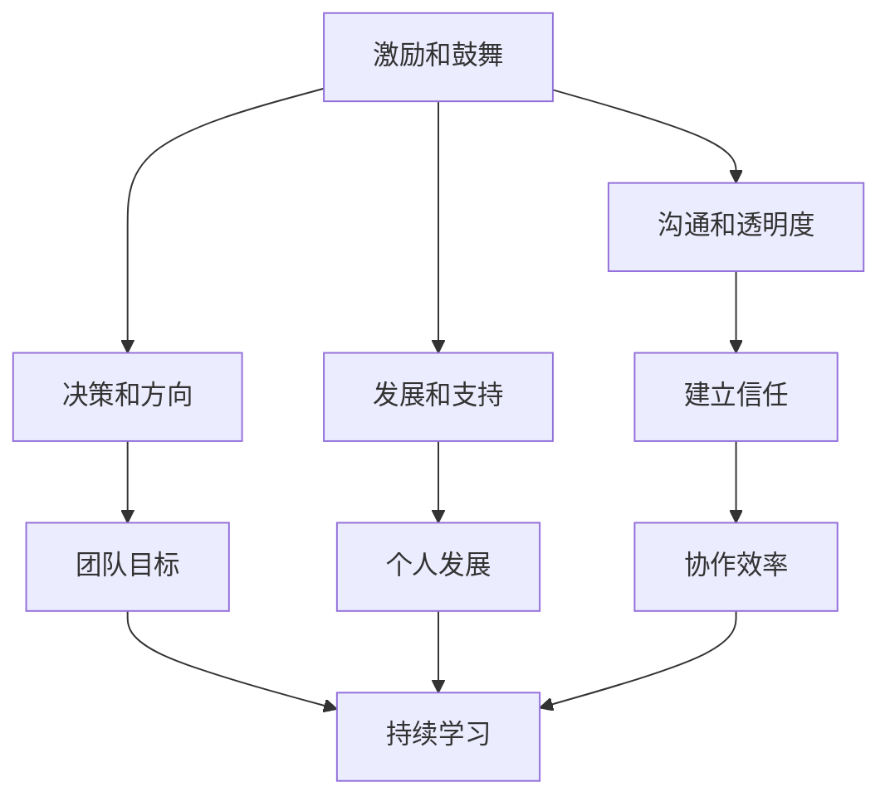

                 

# 领导力法则：打造黄金团队的领导力秘诀

> **关键词**：领导力、团队管理、团队建设、团队协作、黄金团队、领导技巧
>
> **摘要**：本文将深入探讨领导力的核心法则，分析如何通过有效的领导技巧打造出一支高效的黄金团队。通过理论结合实际案例，提供一套实用的领导力框架，助力管理者提升团队的整体表现。

## 1. 背景介绍

在当今快速变化和高度竞争的商业环境中，团队的成功与否在很大程度上取决于团队领导者的能力和技巧。有效的领导力不仅是激励团队成员的关键，也是实现团队目标、提高团队效率和创造力的核心。本文将探讨领导力的关键法则，并提供实用的策略，帮助领导者打造一支高效的黄金团队。

### 团队领导力的核心

团队领导力不仅仅是指发号施令和指导团队成员，更重要的是理解团队的动态、激发团队成员的潜力、建立团队信任和共同目标。以下是一些团队领导力的核心方面：

- **激励和鼓舞**：领导者需要能够激励团队成员，让他们保持积极的态度和高度的敬业精神。
- **沟通和透明度**：有效的沟通是建立信任和团队协作的基础。领导者需要确保信息的透明传递。
- **决策和方向**：领导者需要有能力做出明智的决策，并明确团队的目标和方向。
- **发展和支持**：领导者应该关注团队成员的个人和职业发展，并提供必要的支持。

### 黄金团队的特征

黄金团队通常具有以下特征：

- **共同的目标**：团队成员对团队目标有清晰的理解，并致力于实现这些目标。
- **高效的协作**：团队成员之间相互支持，协作效率高。
- **持续的学习和改进**：团队成员愿意不断学习和改进，以提高团队的总体绩效。
- **积极的氛围**：团队氛围积极向上，成员之间相互尊重和支持。

## 2. 核心概念与联系

### 领导力的核心概念

领导力是一个多维度的概念，涉及多个核心要素。以下是一个简化的 Mermaid 流程图，展示了领导力的几个关键要素及其相互关系。



### 黄金团队的核心特征

黄金团队的核心特征可以归纳为以下几点：

- **共同目标**：团队成员对团队的目标有清晰的认识，并共同努力实现这些目标。
- **高效协作**：团队成员之间能够高效地协作，共同完成任务。
- **持续学习**：团队成员愿意不断学习新知识和技能，以提高团队的整体绩效。
- **积极氛围**：团队成员之间相互尊重和支持，创造一个积极的工作环境。

## 3. 核心算法原理 & 具体操作步骤

### 领导力法则的算法原理

领导力的核心在于激励和引导团队成员，以下是一种简化的算法原理，用于实现这一目标：

1. **了解团队成员**：通过观察和沟通，了解团队成员的兴趣、优点和弱点。
2. **设定明确的目标**：确保团队成员对团队目标有清晰的理解。
3. **提供支持和资源**：为团队成员提供必要的支持和资源，帮助他们实现目标。
4. **激励和奖励**：通过正面的激励和奖励机制，鼓励团队成员保持积极性和创造力。
5. **持续反馈和改进**：定期与团队成员进行沟通，提供反馈，并鼓励他们提出改进建议。

### 操作步骤

1. **建立信任**：通过透明沟通和诚实的行为建立信任。
    - **沟通**：保持信息的透明传递，确保团队成员了解团队的情况。
    - **行为**：通过诚实和一致的行为赢得团队成员的信任。

2. **激励团队成员**：
    - **目标设定**：与团队成员一起设定可实现的短期和长期目标。
    - **奖励机制**：根据团队和个人的绩效，提供适当的奖励和认可。

3. **提供发展机会**：
    - **培训**：为团队成员提供培训和学习机会，以帮助他们提高技能和知识。
    - **职业规划**：帮助团队成员制定职业规划，并提供必要的支持。

4. **促进团队协作**：
    - **共同目标**：确保团队成员对共同目标有清晰的认识。
    - **沟通与协作工具**：利用适当的工具和平台，促进团队成员之间的沟通和协作。

5. **持续反馈和改进**：
    - **定期回顾**：定期与团队成员进行绩效回顾，提供具体的反馈。
    - **改进建议**：鼓励团队成员提出改进建议，并实施可行的建议。

## 4. 数学模型和公式 & 详细讲解 & 举例说明

### 领导力效能模型

领导力效能可以通过以下数学模型来衡量：

$$
效能 = \frac{目标达成率 \times 团队协作效率 \times 团队成员满意度}{资源投入}
$$

### 详细讲解

1. **目标达成率**：衡量团队实现目标的程度，是领导力效能的核心指标之一。
2. **团队协作效率**：衡量团队成员之间协作的效率，包括沟通、协作和共同完成任务的能力。
3. **团队成员满意度**：衡量团队成员对团队工作的满意度和工作环境的满意度。
4. **资源投入**：包括时间、人力、资金等资源投入，用于实现团队目标和提高团队效能。

### 举例说明

假设一个团队在一个月内完成了90%的目标，团队协作效率为80%，团队成员满意度为85%，资源投入为1000小时。那么，该团队的领导力效能为：

$$
效能 = \frac{0.9 \times 0.8 \times 0.85}{1} = 0.612
$$

这意味着该团队的领导力效能约为61.2%。

### 数学模型的应用

通过上述数学模型，领导者可以定量地评估团队的表现，识别需要改进的领域，并制定相应的策略。例如，如果团队协作效率较低，领导者可以采取措施改进团队协作，如提供更多的沟通工具或进行协作培训。

## 5. 项目实战：代码实际案例和详细解释说明

### 5.1 开发环境搭建

为了更好地理解和应用领导力法则，我们将通过一个简单的项目实战来展示如何搭建一个开发环境。以下是一个使用 Python 编写的简单聊天应用，用于展示如何通过代码实现领导力法则中的沟通和协作。

#### 工具和框架

- **Python**：编程语言
- **Flask**：Web 框架
- **Socket.IO**：实时通信库

#### 步骤

1. 安装 Python 和 Flask

   ```bash
   pip install python
   pip install flask
   ```

2. 安装 Socket.IO

   ```bash
   pip install flask-socketio
   ```

### 5.2 源代码详细实现和代码解读

以下是一个简单的聊天应用的代码实现，包含客户端和服务器端的代码。

#### 服务器端代码

```python
from flask import Flask, render_template
from flask_socketio import SocketIO, send, emit

app = Flask(__name__)
socketio = SocketIO(app)

@app.route('/')
def index():
    return render_template('index.html')

@socketio.on('connect')
def handle_connect():
    emit('message', {'msg': 'Connected to the chat server'})

@socketio.on('chat_message')
def handle_message(message):
    send(message['msg'], broadcast=True)

if __name__ == '__main__':
    socketio.run(app)
```

#### 客户端代码

```html
<!DOCTYPE html>
<html>
<head>
    <title>Chat Application</title>
    <script src="/static/socket.io/socket.io.js"></script>
    <script>
        document.addEventListener('DOMContentLoaded', (event) => {
            var socket = io.connect('http://' + document.domain + ':' + location.port);
            socket.on('connect', function() {
                socket.emit('chat_message', {'msg': 'Hello, World!'});
            });
            socket.on('message', function(msg) {
                console.log(msg);
            });
        });
    </script>
</head>
<body>
    <h1>Chat Application</h1>
    <div id="chat"></div>
</body>
</html>
```

### 5.3 代码解读与分析

1. **服务器端代码解读**：

   - 导入 Flask 和 Socket.IO 库。

   - 创建 Flask 应用和 Socket.IO 实例。

   - 定义一个路由，用于渲染前端页面。

   - 定义连接事件，当客户端连接到服务器时，发送一条连接消息。

   - 定义聊天消息事件，当接收到客户端发送的聊天消息时，广播给所有客户端。

2. **客户端代码解读**：

   - 导入 Socket.IO 库。

   - 在 DOMContentLoaded 事件中创建 Socket.IO 连接。

   - 当连接成功时，发送一条初始消息。

   - 接收服务器广播的聊天消息，并打印在控制台中。

通过这个简单的聊天应用，我们可以看到如何使用代码实现领导力法则中的沟通和协作。服务器端代码实现了消息的广播功能，而客户端代码可以发送和接收消息。这种实时通信机制有助于团队成员之间的实时沟通，提高团队协作效率。

## 6. 实际应用场景

### 6.1 教育行业

在教育行业，领导力法则可以应用于学校、大学和在线教育平台。有效的领导力可以帮助学校建立积极的校园文化，提高教师的教学质量和学生的学术成绩。例如，通过设定明确的教育目标、提供教师培训和发展机会、鼓励学生之间的协作和沟通，学校可以打造一支高效的黄金团队。

### 6.2 企业

在企业中，领导力法则可以帮助企业管理者提升团队绩效、改善员工满意度，并实现企业的长期战略目标。通过有效的领导力，企业可以建立高效的团队，提高创新能力和市场竞争力。例如，通过设定明确的企业愿景和目标、提供员工培训和发展机会、鼓励团队合作和沟通，企业可以打造一支黄金团队。

### 6.3 科技公司

在科技公司中，领导力法则对于打造高效的研发团队和产品团队尤为重要。有效的领导力可以帮助科技公司的领导者激发团队的创新潜力，提高产品质量和开发效率。例如，通过设定明确的产品目标、提供技术培训和发展机会、鼓励团队成员之间的协作和沟通，科技公司可以打造出一支高效的黄金团队。

## 7. 工具和资源推荐

### 7.1 学习资源推荐

- **书籍**：
  - 《领导力的五个层次》（John C. Maxwell）
  - 《高效能人士的七个习惯》（Stephen R. Covey）
  - 《团队协作工具：高效团队的沟通与协作》（Linda Hill & Kent Lineback）

- **论文**：
  - 《团队协作与领导力：构建高效的团队》（David L. Cooperrider & Adam M. Grant）
  - 《团队协作中的沟通障碍与策略》（Sandra J. Suchman）

- **博客**：
  - Harvard Business Review（HBR）
  - Inc. Magazine
  - Medium（搜索关键词：leadership, team management）

- **网站**：
  - TED Talks（搜索关键词：leadership, team management）
  - Coursera（搜索相关课程：Leadership, Team Management）

### 7.2 开发工具框架推荐

- **项目管理工具**：
  - Trello
  - Asana
  - Jira

- **协作工具**：
  - Slack
  - Microsoft Teams
  - Zoom

- **实时通信库**：
  - Socket.IO
  - WebSockets
  - SignalR

### 7.3 相关论文著作推荐

- **论文**：
  - “Team Effectiveness: Assessing, Building, and Sustaining High-Performance Teams” by Douglas W. Ready and Timothy J. Butterworth
  - “The Five Dysfunctions of a Team” by Patrick Lencioni

- **著作**：
  - “The Power of Feedback: How We Can Learn to Get It and Use It to Improve Our Lives” by Douglas Stone and Sheila Heen
  - “The Fifth Discipline: The Art & Practice of The Learning Organization” by Peter Senge

## 8. 总结：未来发展趋势与挑战

### 未来发展趋势

- **数字化领导力**：随着数字化转型的加速，领导者需要掌握数字技能和数字领导力，以应对快速变化的商业环境。
- **远程领导**：远程工作的普及使得领导力法则在远程团队中的应用变得更加重要，领导者需要适应远程沟通和管理的挑战。
- **个性化和多样性领导**：领导者需要关注团队成员的个性差异和多样性，以激发不同背景和技能的潜力。

### 挑战

- **复杂性管理**：领导者需要处理复杂的项目和团队，提高决策质量和团队协作效率。
- **持续学习**：领导者需要不断学习新技能和知识，以保持竞争力并适应快速变化的环境。
- **文化塑造**：领导者需要塑造积极向上的团队文化，鼓励创新和协作。

## 9. 附录：常见问题与解答

### 问题 1：如何建立有效的沟通机制？

**答案**：建立有效的沟通机制需要以下几个步骤：

1. 设定明确的沟通目标和规则。
2. 使用适当的沟通工具和平台。
3. 定期组织团队会议和回顾。
4. 鼓励团队成员提出问题和反馈。

### 问题 2：如何激励团队成员？

**答案**：以下方法可以帮助领导者激励团队成员：

1. 设定明确的个人和团队目标。
2. 提供积极的反馈和认可。
3. 提供发展机会和培训。
4. 建立公平的奖励机制。

### 问题 3：如何提高团队协作效率？

**答案**：以下策略可以帮助领导者提高团队协作效率：

1. 设定清晰的共同目标。
2. 建立有效的沟通机制。
3. 利用协作工具和平台。
4. 鼓励团队成员之间的协作和分享。

## 10. 扩展阅读 & 参考资料

- **书籍**：
  - 《精益创业》（Eric Ries）
  - 《深度工作》（Cal Newport）
  - 《创新者的窘境》（Clayton M. Christensen）

- **论文**：
  - “Digital Leadership: The New Role of the Teacher in a Digital World” by Eric Sheninger
  - “The Impact of Remote Work on Team Collaboration” by S. J. Hardie and M. S. Smith

- **网站**：
  - Leadershipquotient.com
  - Leadershipinsights.org
  - Harvard Business Review

- **博客**：
  - Inc.com（搜索关键词：leadership, team management）
  - Forbes.com（搜索关键词：leadership, team management）

- **TED Talks**：
  - “The Power of Vulnerability” by Brene Brown
  - “The Gift and Power of Emotional Intelligence” by Daniel Goleman

**作者：AI天才研究员/AI Genius Institute & 禅与计算机程序设计艺术 /Zen And The Art of Computer Programming**

