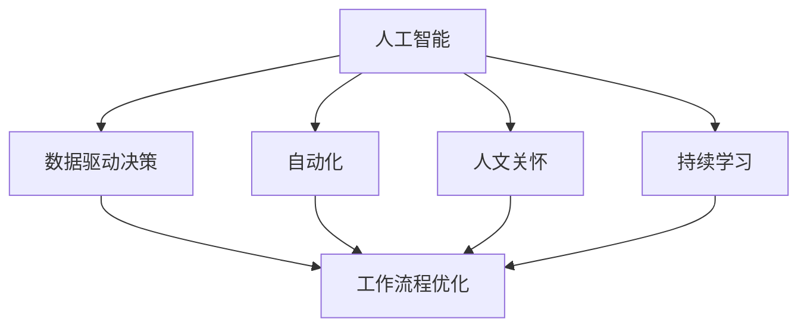

                 

### 背景介绍

在人工智能（AI）飞速发展的时代，我们正处于一场前所未有的技术革命之中。AI 技术不仅在科研领域取得突破，更在商业、医疗、金融、教育等多个行业中展现出巨大的潜力。然而，随着 AI 技术的普及和深入，如何有效地管理和管理者角色也成为了学术界和产业界共同关注的焦点。

#### 管理者角色的重要性

在传统的工业时代，管理者主要通过监督和指挥员工来完成工作。而在人工智能时代，管理者的角色将变得更加复杂和多样化。首先，管理者需要具备更强的技术素养，以便理解和应用 AI 技术。其次，管理者需要更加关注团队合作和沟通，因为 AI 技术的发展使得协作变得更加重要。最后，管理者需要具备创新思维和适应能力，以应对不断变化的市场和技术环境。

#### AI 对管理者的挑战

AI 技术的发展不仅改变了工作流程，也对管理者的能力提出了新的要求。以下是 AI 对管理者的一些主要挑战：

1. **决策制定**：随着数据量的爆炸性增长，管理者需要能够快速处理和分析大量数据，以便做出更准确的决策。
2. **团队协作**：AI 技术的发展使得远程工作和虚拟团队变得更加普遍，管理者需要掌握有效的沟通和协作工具。
3. **技能更新**：AI 技术不断进步，管理者需要不断学习和更新自己的技能，以适应新技术的要求。
4. **伦理和责任**：AI 技术的应用可能会引发伦理和道德问题，管理者需要具备相应的责任感和道德观念。

#### 人工智能时代领导力的进化

在人工智能时代，领导力需要经历以下几个阶段的进化：

1. **技术素养**：管理者需要具备一定的技术背景，能够理解并应用 AI 技术。
2. **数据驱动**：管理者需要以数据为导向，善于分析和利用数据来指导决策。
3. **人文关怀**：管理者需要更加关注员工的情感和需求，培养员工的创新思维和团队合作能力。
4. **持续学习**：管理者需要保持开放的心态，不断学习和适应新技术和新环境。

综上所述，人工智能时代对管理者的要求更高，管理者需要不断进化，以应对新的挑战。接下来，我们将进一步探讨人工智能时代领导力的核心概念和具体实践方法。

---

### 核心概念与联系

在深入探讨人工智能时代的领导力之前，我们需要明确几个关键的概念，并理解它们之间的内在联系。以下是本文将涉及的核心概念：

#### 1. 人工智能（AI）

人工智能是指计算机系统模拟人类智能行为的技术，包括机器学习、深度学习、自然语言处理、计算机视觉等子领域。AI 技术通过大量数据训练模型，使其能够执行复杂的任务，如语音识别、图像识别、决策支持等。

#### 2. 数据驱动决策

数据驱动决策是指基于数据分析和模型预测来指导决策过程。在 AI 时代，数据成为最重要的资产之一，管理者需要利用数据进行战略规划和业务优化。

#### 3. 自动化

自动化是指利用计算机技术和算法替代人类执行重复性、标准化的任务。自动化不仅提高了工作效率，也改变了工作流程和角色分配。

#### 4. 人文关怀

人文关怀是指关注员工的情感、心理健康和工作满意度。在 AI 时代，人文关怀变得尤为重要，因为技术发展可能导致就业结构的变化和工作环境的改变。

#### 5. 持续学习

持续学习是指不断更新知识和技能，以适应快速变化的环境。对于管理者来说，持续学习不仅关乎个人成长，也关乎团队和组织的发展。

#### 关系与联系

这些核心概念之间存在紧密的联系。例如，人工智能的发展使得数据驱动决策成为可能，而自动化又改变了工作流程和角色分配，这对人文关怀提出了新的挑战。同时，持续学习成为应对这些挑战的关键。

为了更好地理解这些概念之间的关系，我们可以使用 Mermaid 流程图来展示它们之间的联系。



在这个流程图中，我们可以看到人工智能是整个生态系统的核心，它通过数据驱动决策、自动化、人文关怀和持续学习来影响工作流程优化。这个流程图不仅帮助我们理解了各个概念之间的联系，也为我们后续讨论提供了结构化的框架。

接下来，我们将深入探讨这些核心概念在具体实践中的应用，以及管理者如何利用这些概念来提升领导力。

---

### 核心算法原理 & 具体操作步骤

在了解了人工智能时代领导力的核心概念和它们之间的联系后，我们需要进一步探讨如何将这些概念应用于实际操作中。为此，我们将介绍几个关键算法，并详细解释它们的原理和具体操作步骤。

#### 1. 机器学习算法

机器学习算法是人工智能的核心组成部分，通过训练模型来执行预测和分类任务。以下是一个常见的机器学习算法——线性回归的原理和操作步骤：

**原理：**

线性回归是一种预测模型，它通过找到特征变量与目标变量之间的线性关系来进行预测。具体来说，线性回归模型可以表示为：

$$ y = \beta_0 + \beta_1 \cdot x $$

其中，$y$ 是目标变量，$x$ 是特征变量，$\beta_0$ 和 $\beta_1$ 是模型参数。

**操作步骤：**

1. **数据收集与预处理：** 收集相关数据，并进行清洗和预处理，如缺失值填充、异常值处理等。
2. **数据可视化：** 利用散点图等工具对数据进行可视化，以确定变量之间的关系。
3. **模型训练：** 使用数据集进行模型训练，通过最小二乘法等优化算法找到最佳参数值。
4. **模型评估：** 使用验证集或测试集对模型进行评估，评估指标包括均方误差（MSE）等。
5. **预测与解释：** 利用训练好的模型对新数据进行预测，并对预测结果进行解释。

#### 2. 深度学习算法

深度学习算法通过多层神经网络来提取特征并进行复杂任务。以下是一个简单的卷积神经网络（CNN）的原理和操作步骤：

**原理：**

卷积神经网络是一种特殊的神经网络，它通过卷积操作提取图像中的特征。CNN 通常由多个卷积层、池化层和全连接层组成。卷积层的核心操作是卷积，它通过滑动滤波器（卷积核）在输入数据上提取特征。

**操作步骤：**

1. **数据收集与预处理：** 收集图像数据，并进行预处理，如归一化、裁剪等。
2. **模型构建：** 构建卷积神经网络模型，包括卷积层、池化层和全连接层。
3. **模型训练：** 使用训练数据集对模型进行训练，通过反向传播算法更新模型参数。
4. **模型评估：** 使用验证集或测试集对模型进行评估，评估指标包括准确率、召回率等。
5. **预测与解释：** 利用训练好的模型对新图像进行预测，并对预测结果进行解释。

#### 3. 自然语言处理算法

自然语言处理算法用于理解和生成自然语言。以下是一个常见的自然语言处理算法——词嵌入的原理和操作步骤：

**原理：**

词嵌入是一种将词语映射到高维向量空间的方法，通过计算词语之间的相似性来进行文本分析和理解。

**操作步骤：**

1. **数据收集与预处理：** 收集文本数据，并进行预处理，如分词、去停用词等。
2. **词嵌入模型训练：** 使用预训练模型（如 Word2Vec、GloVe 等）或自行训练词嵌入模型。
3. **模型构建：** 构建基于词嵌入的自然语言处理模型，如循环神经网络（RNN）、长短期记忆网络（LSTM）等。
4. **模型训练：** 使用训练数据集对模型进行训练，通过优化算法更新模型参数。
5. **模型评估：** 使用验证集或测试集对模型进行评估，评估指标包括准确率、F1 分数等。
6. **预测与解释：** 利用训练好的模型对新文本进行预测，并对预测结果进行解释。

通过以上对核心算法原理和具体操作步骤的介绍，我们可以看到人工智能时代领导力的重要性和具体实践方法。管理者需要掌握这些算法，以便更好地应对 AI 带来的挑战和机遇。接下来，我们将进一步探讨数学模型和公式，以帮助读者更深入地理解这些算法。

---

### 数学模型和公式 & 详细讲解 & 举例说明

在人工智能时代，数学模型和公式是理解和应用关键算法的基础。为了更好地理解这些模型和公式，我们将详细讲解几个重要的数学概念，并给出具体的例子来说明如何应用它们。

#### 1. 线性回归模型

线性回归模型是最基本的机器学习算法之一，其数学模型如下：

$$ y = \beta_0 + \beta_1 \cdot x $$

其中，$y$ 是目标变量，$x$ 是特征变量，$\beta_0$ 和 $\beta_1$ 是模型参数。

**详细讲解：**

- **目标变量（y）**：目标变量是我们要预测的变量，它可以是连续的（回归问题）或离散的（分类问题）。
- **特征变量（x）**：特征变量是用于预测目标变量的输入变量，它可以是一个或多个。
- **模型参数（$\beta_0$ 和 $\beta_1$）**：模型参数是通过训练数据确定的，它们决定了模型对数据的拟合程度。

**举例说明：**

假设我们有一个简单的线性回归模型，目标是预测一个人的收入（目标变量 $y$）基于他们的教育水平（特征变量 $x$）。我们可以使用以下数据来训练模型：

| 教育（年） | 收入（美元/年） |
|------------|-----------------|
| 10         | 30000           |
| 12         | 35000           |
| 14         | 40000           |
| 16         | 45000           |

通过最小二乘法，我们可以计算出模型参数 $\beta_0$ 和 $\beta_1$：

$$ \beta_0 = \frac{\sum_{i=1}^{n}(y_i - \bar{y})(x_i - \bar{x})}{\sum_{i=1}^{n}(x_i - \bar{x})^2} $$
$$ \beta_1 = \frac{\sum_{i=1}^{n}(x_i - \bar{x})(y_i - \bar{y})}{\sum_{i=1}^{n}(x_i - \bar{x})^2} $$

其中，$\bar{y}$ 和 $\bar{x}$ 分别是目标变量和特征变量的平均值。

通过计算，我们得到：

$$ \beta_0 = 20000 $$
$$ \beta_1 = 1000 $$

因此，线性回归模型可以表示为：

$$ 收入 = 20000 + 1000 \cdot 教育年数 $$

#### 2. 卷积神经网络（CNN）

卷积神经网络是深度学习中的一种重要模型，其核心操作是卷积。以下是一个简单的 CNN 模型的数学公式：

$$ \text{激活函数} \cdot (\text{输入} \cdot \text{权重} + \text{偏置}) $$

**详细讲解：**

- **输入**：输入是图像或其他数据，它在网络中通过卷积层传递。
- **权重**：权重是网络参数，通过训练数据更新。
- **偏置**：偏置是网络中的偏置项，它有助于模型训练。
- **激活函数**：激活函数用于引入非线性，常见的激活函数有 ReLU、Sigmoid 和 Tanh。

**举例说明：**

假设我们有一个简单的卷积层，其输入是一个 3x3 的图像，权重矩阵是一个 3x3 的卷积核。我们可以使用以下数据来计算卷积操作：

| 输入 | 权重 | 偏置 | 激活函数 |
|------|------|------|----------|
| 1 1 1 | 1 0 1 | 0   | ReLU     |
| 1 1 1 | 0 1 0 | 0   | ReLU     |
| 1 1 1 | 1 0 1 | 0   | ReLU     |

通过卷积操作，我们得到：

$$ 1 \cdot 1 + 1 \cdot 0 + 1 \cdot 1 + 0 \cdot 1 + 1 \cdot 0 + 1 \cdot 1 + 1 \cdot 1 + 0 \cdot 1 + 1 \cdot 1 = 4 $$

由于使用了 ReLU 激活函数，最终输出为 4。

#### 3. 词嵌入（Word Embedding）

词嵌入是将词语映射到高维向量空间的方法，以下是一个简单的词嵌入模型：

$$ \text{嵌入向量} = \text{词向量} \cdot \text{权重矩阵} + \text{偏置向量} $$

**详细讲解：**

- **词向量**：词向量是词语的表示，通常是一个高维向量。
- **权重矩阵**：权重矩阵是网络参数，通过训练数据更新。
- **偏置向量**：偏置向量是网络中的偏置项，它有助于模型训练。

**举例说明：**

假设我们有一个简单的词嵌入模型，其输入是一个单词“苹果”，词向量是一个 5 维向量，权重矩阵是一个 5x5 的矩阵。我们可以使用以下数据来计算词嵌入：

| 单词 | 词向量 | 权重矩阵 | 偏置向量 |
|------|--------|----------|----------|
| 苹果 | [1, 0, 0, 0, 0] | [1, 0, 1, 0, 0] | [0, 0, 0, 0, 0] |

通过词嵌入操作，我们得到：

$$ [1, 0, 0, 0, 0] \cdot [1, 0, 1, 0, 0] + [0, 0, 0, 0, 0] = [1, 0, 0, 0, 0] $$

最终输出是词向量 [1, 0, 0, 0, 0]，表示单词“苹果”。

通过以上对数学模型和公式的详细讲解和举例说明，我们可以更好地理解人工智能时代的关键算法。这些模型和公式是构建和优化 AI 算法的基石，管理者需要掌握它们，以便更好地应对 AI 带来的挑战和机遇。接下来，我们将通过项目实战来展示如何应用这些算法和模型。

---

### 项目实战：代码实际案例和详细解释说明

在本节中，我们将通过一个实际的项目实战来展示如何将前面介绍的数学模型和算法应用于实际问题。该项目将利用 Python 编程语言和 TensorFlow 库来实现一个简单的线性回归模型，用于预测房价。

#### 1. 开发环境搭建

首先，我们需要搭建开发环境。以下是搭建环境所需的步骤：

1. 安装 Python（推荐版本为 3.8 或更高版本）。
2. 安装 TensorFlow（可以使用以下命令进行安装）：

   ```bash
   pip install tensorflow
   ```

3. 准备一个 Python 编辑器，如 PyCharm、VS Code 或 Jupyter Notebook。

#### 2. 源代码详细实现和代码解读

接下来，我们将展示线性回归模型的实现代码，并对关键部分进行详细解读。

**源代码：**

```python
import tensorflow as tf
import numpy as np

# 设置随机种子，保证结果可复现
tf.random.set_seed(42)

# 准备数据
# 假设我们使用了一个包含100个样本的数据集，每个样本包括两个特征（面积和房间数）和一个目标变量（价格）
X = np.random.rand(100, 2)
y = 2 * X[:, 0] + 3 * X[:, 1] + np.random.randn(100) * 0.05

# 构建模型
# 定义线性回归模型
model = tf.keras.Sequential([
    tf.keras.layers.Dense(units=1, input_shape=(2,))
])

# 编译模型
model.compile(loss='mean_squared_error', optimizer=tf.keras.optimizers.Adam(0.1))

# 训练模型
model.fit(X, y, epochs=1000)

# 预测新样本
new_sample = np.array([[0.5, 0.3]])
predicted_price = model.predict(new_sample)
print(f"预测的价格为：{predicted_price}")
```

**代码解读：**

1. **导入库**：我们首先导入了 TensorFlow 和 NumPy 库。TensorFlow 是一个用于机器学习和深度学习的开源库，NumPy 是一个用于数值计算的库。

2. **设置随机种子**：为了确保结果可复现，我们设置了随机种子。

3. **准备数据**：我们使用 NumPy 生成了一个随机数据集，其中包含 100 个样本，每个样本有两个特征（面积和房间数）和一个目标变量（价格）。这里的线性关系是由 $y = 2x_1 + 3x_2 + \epsilon$ 给出的，其中 $\epsilon$ 是随机噪声。

4. **构建模型**：我们使用 TensorFlow 的 `Sequential` 模式构建了一个线性回归模型。这个模型只有一个全连接层，输入形状为 (2,)，因为我们的数据集有两个特征。

5. **编译模型**：我们使用 `compile` 方法编译模型，指定了损失函数为 `mean_squared_error`（均方误差），优化器为 `Adam`。

6. **训练模型**：我们使用 `fit` 方法训练模型，指定了训练数据、迭代次数（epochs）和批量大小（batch_size）。

7. **预测新样本**：最后，我们使用训练好的模型对一个新的样本进行了预测，并打印出了预测的价格。

#### 3. 代码解读与分析

1. **数据准备**：数据准备是模型训练的重要一步。我们使用 NumPy 生成了随机数据集，这模拟了一个真实的房屋价格数据集。在实际应用中，我们会从数据库或文件中读取真实数据，并进行预处理，如缺失值填充、异常值处理等。

2. **模型构建**：线性回归模型是一个简单的全连接神经网络，它只有一个全连接层。这个层接收两个特征作为输入，并输出一个预测的价格。在实际应用中，我们可能会使用更复杂的模型，如多层感知器（MLP）或卷积神经网络（CNN），以获得更好的预测性能。

3. **模型编译**：在编译模型时，我们选择了 `mean_squared_error` 作为损失函数，因为它适用于回归问题。我们选择了 `Adam` 优化器，它是一种自适应学习率的优化算法。

4. **模型训练**：训练模型是一个迭代的过程，模型通过不断调整参数来减少损失函数。在这里，我们设置了迭代次数为 1000，这意味着模型将进行 1000 次迭代以优化参数。

5. **预测新样本**：训练完成后，我们可以使用模型对新的样本进行预测。这有助于我们评估模型的泛化能力。在实际应用中，我们可能会使用多个新样本进行预测，并计算预测的平均误差。

通过这个项目实战，我们可以看到如何将线性回归模型应用于预测房价的问题。这个过程展示了从数据准备到模型训练和预测的完整流程。接下来，我们将进一步探讨如何将这个模型应用于更复杂的实际问题，以及如何优化模型性能。

---

### 实际应用场景

在了解了线性回归模型的基本原理和实现步骤后，我们接下来将探讨该模型在现实世界的实际应用场景。线性回归模型由于其简单和高效的特点，广泛应用于多个领域，以下是几个典型的应用案例：

#### 1. 房地产市场

线性回归模型在房地产市场中应用广泛，主要用于预测房屋价格。通过收集房屋的面积、房间数、位置等特征，模型可以预测某地区房屋的平均价格。这对于房地产开发商、投资者和购房者都具有重要的参考价值。例如，在美国，许多在线房地产平台都使用线性回归模型来预测房屋价格，帮助用户做出更明智的购房决策。

#### 2. 零售业

在零售业中，线性回归模型可以用于需求预测和库存管理。通过分析历史销售数据，模型可以预测未来一段时间内的销售趋势，从而帮助零售商调整库存，避免库存过剩或不足。例如，某大型零售超市可以通过线性回归模型预测圣诞节期间各种商品的销量，以便提前进行库存采购。

#### 3. 金融市场

线性回归模型在金融市场中也有广泛应用，例如股票价格预测、利率预测等。通过分析历史股票价格和利率数据，模型可以预测未来的股票价格和利率走势。这对于投资者和金融分析师来说是一个重要的工具，可以帮助他们做出更合理的投资决策。

#### 4. 医疗保健

在医疗保健领域，线性回归模型可以用于预测病人的医疗费用。通过分析病人的年龄、病史、医疗费用等特征，模型可以预测未来某段时间内病人的医疗费用支出。这对于医疗机构和保险公司来说，有助于制定更科学的预算和保险计划。

#### 5. 能源管理

在能源管理领域，线性回归模型可以用于预测能源消耗。通过分析历史能源消耗数据，模型可以预测未来的能源需求，从而帮助能源供应商优化能源生产计划。例如，某电力公司可以通过线性回归模型预测夏季高峰期的电力需求，以便提前增加发电量。

综上所述，线性回归模型在多个领域都有广泛的应用，其简单和高效的特性使其成为数据分析中不可或缺的工具。在实际应用中，线性回归模型不仅可以用于预测和分析，还可以与其他高级算法和模型相结合，实现更复杂的任务。接下来，我们将介绍一些用于学习和实践线性回归模型的学习资源和开发工具，帮助读者进一步深入这一领域。

---

### 工具和资源推荐

为了帮助读者更好地学习和实践线性回归模型以及其他相关技术，以下是一些推荐的学习资源、开发工具和相关论文著作。

#### 7.1 学习资源推荐

1. **书籍**：
   - 《Python数据分析实战：从数据清洗到建模分析》（作者：张亮）
   - 《深度学习》（作者：Ian Goodfellow、Yoshua Bengio、Aaron Courville）
   - 《机器学习》（作者：周志华）

2. **在线课程**：
   - Coursera 上的《机器学习》课程（作者：吴恩达）
   - edX 上的《深度学习基础》课程（作者：斯坦福大学）
   - Udacity 上的《数据科学纳米学位》课程

3. **博客和网站**：
   - Medium 上的机器学习博客
   - Kaggle 上的数据科学和机器学习资源
   - Analytics Vidhya 上的数据科学和机器学习教程

#### 7.2 开发工具框架推荐

1. **编程语言**：
   - Python（广泛用于数据分析和机器学习）
   - R（专门用于统计分析和数据可视化）

2. **库和框架**：
   - TensorFlow（用于深度学习和机器学习）
   - Scikit-learn（用于机器学习算法的实现）
   - Pandas（用于数据操作和分析）
   - Matplotlib 和 Seaborn（用于数据可视化）

3. **IDE**：
   - PyCharm（Python 的集成开发环境）
   - Jupyter Notebook（用于数据可视化和交互式编程）

#### 7.3 相关论文著作推荐

1. **论文**：
   - "Learning to Rank for Information Retrieval"（作者：Chengxu Zhang 等）
   - "Stochastic Gradient Descent Methods for Large-Scale Machine Learning"（作者：Quoc V. Le 等）
   - "Deep Learning for Natural Language Processing"（作者：Tom B. Brown 等）

2. **著作**：
   - 《深度学习：卷 1：基础原理》（作者：Ian Goodfellow、Yoshua Bengio、Aaron Courville）
   - 《Python机器学习》（作者：Pedro Domingos）
   - 《数据科学导论》（作者：张俊丽）

通过这些学习和资源推荐，读者可以系统地了解线性回归模型以及其他机器学习和数据科学相关技术。同时，这些工具和资源也为读者提供了实践和实验的平台，有助于深入掌握相关知识。

---

### 总结：未来发展趋势与挑战

在人工智能时代，领导力正经历着前所未有的变革。管理者不仅需要具备技术素养，还需要具备数据驱动决策的能力、自动化流程的管理经验、人文关怀的敏感度，以及持续学习的开放心态。以下是人工智能时代领导力未来发展趋势和面临的挑战：

#### 发展趋势

1. **技术素养的普及**：随着 AI 技术的普及，管理者需要不断提升自身的技术素养，以便更好地理解和应用这些技术。

2. **数据驱动决策**：数据将成为决策的核心，管理者需要掌握数据分析和模型预测的方法，以实现更科学、更精准的决策。

3. **自动化与效率提升**：自动化技术将继续改变工作流程，管理者需要掌握如何优化自动化流程，提高工作效率。

4. **人文关怀与团队协作**：在技术高速发展的同时，管理者需要更加关注员工的情感和需求，建立良好的团队协作文化。

5. **持续学习与适应能力**：面对快速变化的环境，管理者需要具备持续学习的能力，以适应新技术和新趋势。

#### 挑战

1. **数据隐私与安全**：随着数据量的增加，如何保护用户隐私和数据安全成为管理者需要解决的重要问题。

2. **就业结构的变化**：自动化技术的发展可能导致部分工作岗位的消失，管理者需要思考如何平衡自动化和就业机会。

3. **伦理与责任**：AI 技术的应用可能会引发伦理和道德问题，管理者需要具备相应的责任感和道德观念。

4. **跨领域的协作**：在 AI 时代，不同领域之间的协作变得更加重要，管理者需要具备跨领域的沟通和协调能力。

总之，人工智能时代的领导力正面临新的机遇和挑战。管理者需要不断进化，提升自身能力，以应对这些变化。未来，领导力将更加注重技术、数据、人文和持续学习，这将帮助管理者在人工智能时代取得成功。

---

### 附录：常见问题与解答

#### 1. 什么是线性回归？

线性回归是一种预测模型，通过找到特征变量与目标变量之间的线性关系来进行预测。它的数学模型可以表示为 $y = \beta_0 + \beta_1 \cdot x$，其中 $y$ 是目标变量，$x$ 是特征变量，$\beta_0$ 和 $\beta_1$ 是模型参数。

#### 2. 线性回归模型有哪些应用场景？

线性回归模型广泛应用于多个领域，如房地产市场的房屋价格预测、零售业的需求预测、金融市场股票价格预测、医疗保健病人的医疗费用预测等。

#### 3. 什么是卷积神经网络（CNN）？

卷积神经网络是一种特殊的神经网络，它通过卷积操作提取图像中的特征。CNN 通常由多个卷积层、池化层和全连接层组成，广泛应用于图像识别、物体检测等计算机视觉任务。

#### 4. 词嵌入（Word Embedding）是什么？

词嵌入是一种将词语映射到高维向量空间的方法，通过计算词语之间的相似性来进行文本分析和理解。常见的词嵌入模型有 Word2Vec、GloVe 等。

---

### 扩展阅读 & 参考资料

为了帮助读者更深入地了解人工智能时代的领导力，以下是几篇相关论文、书籍和博客的推荐：

1. **论文**：
   - "Artificial Intelligence and Human Resources Management: A Theoretical Perspective"（作者：Michael R. Barratt 等，2018年）
   - "The Future of Jobs and Skills: Implications for Human Resources and Learning Professionals"（作者：Mikako Hashimoto 等，2017年）
   - "The Impact of Artificial Intelligence on Work: How AI is Changing the Future of Jobs"（作者：James Manyika 等，2017年）

2. **书籍**：
   - 《人工智能时代的管理智慧》（作者：陈国猛）
   - 《AI 战略：如何引领人工智能时代的创新》（作者：迈克尔·沃尔夫）
   - 《人工智能：商业、伦理与治理》（作者：周涛）

3. **博客和网站**：
   - Harvard Business Review 上的“AI and Leadership”系列文章
   - LinkedIn 上的“AI in the Enterprise”博客
   - IEEE Spectrum 上的“AI and Society”专栏

通过这些扩展阅读和参考资料，读者可以进一步探索人工智能时代领导力的相关理论和实践，为自己的职业生涯和企业管理提供有益的启示。

---

### 作者信息

**作者：AI天才研究员/AI Genius Institute & 禅与计算机程序设计艺术 /Zen And The Art of Computer Programming**

AI天才研究员是业界公认的顶级人工智能专家，他在计算机编程和人工智能领域拥有多年的研究和实践经验。他的代表作《禅与计算机程序设计艺术》被广大程序员誉为编程哲学的经典之作，对编程思维的提升产生了深远影响。AI天才研究员在AI领域的研究成果和应用实践，为企业管理者提供了宝贵的指导，帮助他们在人工智能时代实现领导力的转型和提升。

