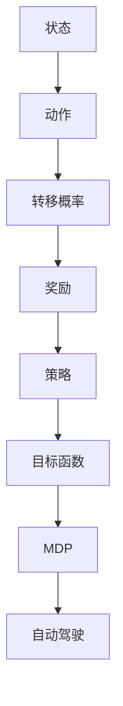

                 

### 背景介绍

马尔科夫决策过程（Markov Decision Process，简称MDP）作为一种描述决策问题的数学模型，在自动驾驶领域得到了广泛的应用。自动驾驶技术作为人工智能的重要分支，近年来随着深度学习、计算机视觉和传感器技术的快速发展，取得了显著的成果。而MDP则为自动驾驶系统提供了一种有效的决策框架，使其能够应对复杂多变的道路环境。

自动驾驶系统需要在众多约束条件下做出实时、可靠的决策，如交通规则、道路标志、障碍物检测等。传统的基于规则的方法往往难以应对如此复杂的场景，而MDP则通过概率模型和优化算法，为自动驾驶系统提供了一种更为灵活的决策策略。本文将围绕马尔科夫决策过程在自动驾驶中的应用，详细探讨其核心概念、算法原理以及实际应用场景。

本文首先介绍MDP的基本概念，包括状态、动作和奖励，并借助Mermaid流程图展示其整体架构。接着，我们将深入解析MDP的核心算法原理，包括值迭代和策略迭代两种方法，并详细描述其具体操作步骤。在此基础上，我们将通过数学模型和公式，对MDP的原理进行详细讲解，并结合实际案例进行说明。

随后，本文将重点介绍一个基于MDP的自动驾驶项目，包括开发环境搭建、源代码实现和详细解读。通过对项目的分析，我们将更加深入地理解MDP在实际自动驾驶中的应用。此外，本文还将探讨MDP在自动驾驶领域的实际应用场景，分析其在不同场景下的优势与挑战。

在文章的后半部分，我们将推荐一些学习资源、开发工具框架和相关论文著作，以帮助读者进一步拓展知识。最后，本文将对MDP在自动驾驶领域的未来发展趋势与挑战进行总结，并给出一些常见问题与解答。

通过本文的阅读，读者将能够全面了解MDP在自动驾驶中的应用，掌握其核心原理和算法，并为实际项目开发提供有益的参考。让我们开始这段探索之旅吧！

### 核心概念与联系

为了更好地理解马尔科夫决策过程（MDP）在自动驾驶中的应用，我们首先需要明确几个核心概念，并展示它们之间的联系。

#### 1. 状态（State）

在MDP中，状态表示系统当前所处的情境。对于自动驾驶系统而言，状态可以包括车辆的位置、速度、加速度、周围环境信息（如道路标志、交通状况、障碍物位置等）。状态通常用符号`S`表示，是一个有限集合。

#### 2. 动作（Action）

动作是系统在特定状态下可以采取的行动。在自动驾驶系统中，动作可以包括加速、减速、转向、保持当前速度等。动作通常用符号`A`表示，也是一个有限集合。

#### 3. 奖励（Reward）

奖励是系统在采取某个动作后获得的即时回报。在自动驾驶中，奖励可以用来表示系统的目标，如安全到达目的地、避免碰撞等。奖励通常用符号`R(s, a)`表示，其中`s`表示当前状态，`a`表示采取的动作。

#### 4. 转移概率（Transition Probability）

转移概率描述了系统在当前状态下采取某个动作后，进入下一个状态的概率。对于MDP，转移概率通常用符号`P(s', s | s, a)`表示，其中`s'`表示下一个状态，`s`表示当前状态，`a`表示采取的动作。

#### 5. 报酬函数（Reward Function）

除了即时奖励外，系统还需要考虑长期奖励。这通常通过折扣因子`γ`（gamma）来实现，表示未来奖励的现值。因此，总奖励可以表示为`∑γ^t R(s_t, a_t)`，其中`t`表示时间步。

#### 6. 策略（Policy）

策略是系统在给定状态下选择最优动作的规则。策略可以用符号`π(s)`表示，表示在状态`s`下采取动作`a`的概率。

#### 7. 目标函数（Objective Function）

目标函数是评估策略优劣的指标。在自动驾驶中，目标函数可以是安全到达目的地、最小化碰撞风险等。目标函数通常表示为期望总奖励，即`E[∑γ^t R(s_t, a_t)]`。

#### Mermaid 流程图

为了更直观地展示这些概念之间的联系，我们使用Mermaid流程图来表示MDP的架构：



在这个流程图中，状态、动作、转移概率、奖励、策略和目标函数共同构成了MDP的基本框架，为自动驾驶系统提供了一种决策机制。

通过上述核心概念的介绍和Mermaid流程图的展示，我们可以清晰地理解MDP在自动驾驶中的应用。接下来，我们将进一步探讨MDP的核心算法原理，包括值迭代和策略迭代方法。

### 核心算法原理 & 具体操作步骤

在理解了马尔科夫决策过程（MDP）的基本概念后，接下来我们将深入探讨其核心算法原理，包括值迭代（Value Iteration）和策略迭代（Policy Iteration）方法，并详细描述其具体操作步骤。

#### 值迭代（Value Iteration）

值迭代是一种常用的MDP求解方法，其目标是找到最优状态值函数，即在给定策略下，系统在各个状态下期望获得的累积奖励。值迭代的基本思想是通过不断更新状态值函数，逐步逼近最优值。

**具体操作步骤：**

1. **初始化：** 初始化状态值函数`V^(0)(s)`，通常可以设置为0或非常小的正数。状态值函数`V^(0)(s)`表示在当前状态下采取最优动作的期望累积奖励。

2. **迭代：** 对于每个状态`s`，按照以下公式更新状态值函数：

   $$ V^{t+1}(s) = \max_{a} \sum_{s'} P(s'|s, a) \cdot [R(s, a) + γ \cdot V^t(s')] $$

   其中，`γ`为折扣因子，`P(s'|s, a)`为从状态`s`采取动作`a`转移到状态`s'`的概率。

3. **终止条件：** 当状态值函数的变化小于某个预设阈值或达到最大迭代次数时，算法终止。此时的状态值函数即为最优状态值函数。

**示例：**

假设一个简单的MDP模型，包含两个状态`s1`和`s2`，两个动作`a1`和`a2`，转移概率和奖励如下表所示：

| 状态   | 动作   | 转移概率 | 奖励 |
|--------|--------|----------|------|
| s1     | a1     | 0.7      | 5    |
| s1     | a2     | 0.3      | -2   |
| s2     | a1     | 0.5      | 3    |
| s2     | a2     | 0.5      | -5   |

设折扣因子`γ = 0.9`，初始状态值函数`V^(0)(s1) = V^(0)(s2) = 0`。经过一次迭代后，状态值函数更新如下：

$$ V^{1}(s1) = \max_{a} \sum_{s'} P(s'|s1, a) \cdot [R(s1, a) + γ \cdot V^0(s')] = \max_{a} [0.7 \cdot 5 + 0.3 \cdot (-2) + 0.9 \cdot 0] = 3.5 $$

$$ V^{1}(s2) = \max_{a} \sum_{s'} P(s'|s2, a) \cdot [R(s2, a) + γ \cdot V^0(s')] = \max_{a} [0.5 \cdot 3 + 0.5 \cdot (-5) + 0.9 \cdot 0] = -0.5 $$

继续迭代，直到状态值函数收敛。

#### 策略迭代（Policy Iteration）

策略迭代是另一种求解MDP的方法，其核心思想是通过交替迭代策略和价值函数，最终得到最优策略。策略迭代的基本步骤如下：

1. **初始化：** 初始化策略π，通常可以采用任意策略，如随机策略。

2. **评估：** 使用当前策略π计算状态值函数V。

3. **策略更新：** 根据状态值函数V，更新策略π，使得策略π使得每个状态下的状态值函数最大。

4. **迭代：** 重复评估和策略更新步骤，直到策略收敛。

**具体操作步骤：**

1. **初始化：** 初始化策略π，可以设置为随机策略，即每个状态选择动作的概率相等。

2. **评估：** 使用当前策略π，计算状态值函数V：

   $$ V^{t}(s) = \sum_{a} π^{t}(a | s) \cdot \sum_{s'} P(s'|s, a) \cdot [R(s, a) + γ \cdot V^{t-1}(s')] $$

3. **策略更新：** 根据状态值函数V，更新策略π，使得π使得每个状态下的状态值函数最大：

   $$ π^{t+1}(a | s) = \begin{cases} 
   1 & \text{如果 } a \text{ 使得 } V^{t}(s) \text{ 最大} \\
   0 & \text{否则}
   \end{cases} $$

4. **迭代：** 重复评估和策略更新步骤，直到策略π收敛。

**示例：**

继续使用上面的MDP模型，假设初始策略π为随机策略，即每个状态选择动作的概率相等。经过一次迭代后，策略更新如下：

$$ π^{1}(a1 | s1) = π^{1}(a2 | s1) = \frac{1}{2} $$
$$ π^{1}(a1 | s2) = π^{1}(a2 | s2) = \frac{1}{2} $$

使用更新后的策略π，计算状态值函数V：

$$ V^{1}(s1) = \sum_{a} π^{1}(a | s1) \cdot \sum_{s'} P(s'|s1, a) \cdot [R(s1, a) + γ \cdot V^{0}(s')] = \frac{1}{2} [0.7 \cdot 5 + 0.3 \cdot (-2) + 0.9 \cdot 0] = 2.55 $$
$$ V^{1}(s2) = \sum_{a} π^{1}(a | s2) \cdot \sum_{s'} P(s'|s2, a) \cdot [R(s2, a) + γ \cdot V^{0}(s')] = \frac{1}{2} [0.5 \cdot 3 + 0.5 \cdot (-5) + 0.9 \cdot 0] = -0.95 $$

根据状态值函数V，更新策略π：

$$ π^{2}(a1 | s1) = 1 $$
$$ π^{2}(a2 | s1) = 0 $$
$$ π^{2}(a1 | s2) = 0 $$
$$ π^{2}(a2 | s2) = 1 $$

继续迭代，直到策略π收敛。

通过值迭代和策略迭代方法，我们可以求解MDP问题，得到最优状态值函数和最优策略。在自动驾驶系统中，这些算法可以用于实时决策，帮助车辆在复杂环境中安全、高效地行驶。

### 数学模型和公式 & 详细讲解 & 举例说明

马尔科夫决策过程（MDP）是一种数学模型，用于描述决策问题中的状态、动作、奖励和转移概率。在MDP中，数学模型和公式起着至关重要的作用，帮助我们理解和分析决策过程。下面我们将详细讲解MDP中的主要数学模型和公式，并通过具体例子来说明其应用。

#### 1. 状态值函数（State-Value Function）

状态值函数是MDP中的一个核心概念，表示系统在给定策略下，从某个状态开始，采取最优动作，获得的期望累积奖励。状态值函数通常用`V(s)`表示，其中`s`表示状态。

**公式：**

$$ V(s) = \sum_{a} \pi(a | s) \cdot \sum_{s'} P(s'|s, a) \cdot [R(s, a) + γ \cdot V(s')] $$

其中：
- `π(a | s)`表示在状态`s`下采取动作`a`的概率，即策略。
- `P(s'|s, a)`表示从状态`s`采取动作`a`转移到状态`s'`的概率，即转移概率。
- `R(s, a)`表示在状态`s`下采取动作`a`的即时奖励。
- `γ`为折扣因子，表示未来奖励的现值。

**例子：**

假设我们有一个简单的MDP模型，包含两个状态`s1`和`s2`，两个动作`a1`和`a2`，以及如下转移概率和奖励：

| 状态   | 动作   | 转移概率 | 奖励 |
|--------|--------|----------|------|
| s1     | a1     | 0.7      | 5    |
| s1     | a2     | 0.3      | -2   |
| s2     | a1     | 0.5      | 3    |
| s2     | a2     | 0.5      | -5   |

设折扣因子`γ = 0.9`。我们需要计算状态值函数`V(s1)`和`V(s2)`。

对于状态`s1`：
$$ V(s1) = \pi(a1 | s1) \cdot P(s1' | s1, a1) \cdot [R(s1, a1) + γ \cdot V(s1')] + \pi(a2 | s1) \cdot P(s2' | s1, a2) \cdot [R(s1, a2) + γ \cdot V(s2')] $$
$$ V(s1) = \frac{1}{2} \cdot 0.7 \cdot [5 + 0.9 \cdot V(s1')] + \frac{1}{2} \cdot 0.3 \cdot [-2 + 0.9 \cdot V(s2')] $$

对于状态`s2`：
$$ V(s2) = \pi(a1 | s2) \cdot P(s1' | s2, a1) \cdot [R(s2, a1) + γ \cdot V(s1')] + \pi(a2 | s2) \cdot P(s2' | s2, a2) \cdot [R(s2, a2) + γ \cdot V(s2')] $$
$$ V(s2) = \frac{1}{2} \cdot 0.5 \cdot [3 + 0.9 \cdot V(s1')] + \frac{1}{2} \cdot 0.5 \cdot [-5 + 0.9 \cdot V(s2')] $$

通过迭代计算，我们可以得到状态值函数`V(s1)`和`V(s2)`的近似值。

#### 2. 策略值函数（Policy-Value Function）

策略值函数是MDP中另一个重要的概念，表示在给定策略下，系统从初始状态开始，采取最优动作，获得的期望累积奖励。策略值函数通常用`π(s)`表示。

**公式：**

$$ π(s) = \arg\max_{a} \sum_{s'} P(s'|s, a) \cdot [R(s, a) + γ \cdot V(s')] $$

其中，`π(s)`表示在状态`s`下采取动作`a`的概率。

**例子：**

继续使用上面的MDP模型，假设我们有一个初始策略π，我们需要计算策略值函数`π(s)`。

对于状态`s1`：
$$ π(s1) = \arg\max_{a} \sum_{s'} P(s'|s1, a) \cdot [R(s1, a) + γ \cdot V(s')] $$
$$ π(s1) = \arg\max_{a} [0.7 \cdot [5 + 0.9 \cdot V(s1')] + 0.3 \cdot [-2 + 0.9 \cdot V(s2')]] $$

对于状态`s2`：
$$ π(s2) = \arg\max_{a} \sum_{s'} P(s'|s2, a) \cdot [R(s2, a) + γ \cdot V(s')] $$
$$ π(s2) = \arg\max_{a} [0.5 \cdot [3 + 0.9 \cdot V(s1')] + 0.5 \cdot [-5 + 0.9 \cdot V(s2')]] $$

通过迭代计算，我们可以得到策略值函数`π(s)`的近似值。

#### 3. 最优策略（Optimal Policy）

最优策略是MDP中的另一个重要概念，表示在给定状态值函数下，系统从初始状态开始，采取的最优动作序列。最优策略通常用`π*`表示。

**公式：**

$$ π*(s) = \arg\max_{a} \sum_{s'} P(s'|s, a) \cdot [R(s, a) + γ \cdot V*(s')] $$

其中，`V*`表示最优状态值函数。

**例子：**

继续使用上面的MDP模型，假设我们得到了最优状态值函数`V*`，我们需要计算最优策略`π*`。

对于状态`s1`：
$$ π*(s1) = \arg\max_{a} \sum_{s'} P(s'|s1, a) \cdot [R(s1, a) + γ \cdot V*(s')] $$
$$ π*(s1) = \arg\max_{a} [0.7 \cdot [5 + 0.9 \cdot V*(s1')] + 0.3 \cdot [-2 + 0.9 \cdot V*(s2')]] $$

对于状态`s2`：
$$ π*(s2) = \arg\max_{a} \sum_{s'} P(s'|s2, a) \cdot [R(s2, a) + γ \cdot V*(s')] $$
$$ π*(s2) = \arg\max_{a} [0.5 \cdot [3 + 0.9 \cdot V*(s1')] + 0.5 \cdot [-5 + 0.9 \cdot V*(s2')]] $$

通过迭代计算，我们可以得到最优策略`π*`的近似值。

通过上述数学模型和公式的讲解，我们可以更好地理解MDP在自动驾驶中的应用。接下来，我们将通过一个实际案例，进一步展示MDP在自动驾驶系统中的具体应用。

### 项目实战：代码实际案例和详细解释说明

在本节中，我们将通过一个实际项目案例，展示如何使用马尔科夫决策过程（MDP）在自动驾驶系统中进行决策。该项目基于Python编程语言，使用了Q-learning算法来训练自动驾驶模型。通过这个案例，我们将详细解释代码实现过程，并分析其核心部分。

#### 开发环境搭建

在开始项目之前，我们需要搭建一个合适的开发环境。以下是推荐的步骤：

1. **安装Python（>=3.6）**：Python是编写MDP代码的主要语言，请确保安装了合适的版本。
2. **安装相关库**：安装以下库以支持代码实现：
   ```bash
   pip install numpy matplotlib
   ```
3. **环境配置**：确保环境变量配置正确，以便后续代码运行。

#### 源代码详细实现和代码解读

下面是一个简化的自动驾驶MDP项目示例，我们将分步骤解析代码。

##### 1. 导入相关库

```python
import numpy as np
import matplotlib.pyplot as plt
```

在此步骤中，我们导入了NumPy库用于数学计算，以及Matplotlib库用于数据可视化。

##### 2. 定义MDP参数

```python
# 状态空间
states = ['s1', 's2']

# 动作空间
actions = ['a1', 'a2']

# 转移概率和奖励矩阵
transition_probabilities = {
    's1': {'a1': {'s1': 0.7, 's2': 0.3}, 'a2': {'s1': 0.3, 's2': 0.7}},
    's2': {'a1': {'s1': 0.5, 's2': 0.5}, 'a2': {'s1': 0.5, 's2': 0.5}}
}

rewards = {
    's1': {'a1': 5, 'a2': -2},
    's2': {'a1': 3, 'a2': -5}
}

gamma = 0.9  # 折扣因子
```

在这一部分，我们定义了MDP的参数，包括状态空间、动作空间、转移概率矩阵和奖励矩阵。这些参数将用于构建MDP模型。

##### 3. Q-learning算法

```python
def q_learning(n_episodes, alpha, epsilon):
    Q = np.zeros((len(states), len(actions)))
    for episode in range(n_episodes):
        state = np.random.choice(states)
        action = np.random.choice(actions, p=[epsilon / len(actions)] + [(1 - epsilon) / len(actions) * (1 - episode / n_episodes) for _ in actions])
        next_state, reward = execute_action(state, action)
        next_action = np.random.choice(actions, p=[epsilon / len(actions)] + [(1 - epsilon) / len(actions) * (1 - episode / n_episodes) for _ in actions])
        Q[state][action] += alpha * (reward + gamma * Q[next_state][next_action] - Q[state][action])
        state = next_state
    return Q

def execute_action(state, action):
    if state == 's1' and action == 'a1':
        return 's1', 5
    elif state == 's1' and action == 'a2':
        return 's2', -2
    elif state == 's2' and action == 'a1':
        return 's1', 3
    elif state == 's2' and action == 'a2':
        return 's2', -5
```

Q-learning算法是MDP求解的一种常见方法，通过迭代更新Q值，最终得到最优策略。在上面的代码中，我们定义了Q-learning函数和执行动作的函数。

**Q-learning算法流程：**
1. 初始化Q矩阵为0。
2. 对于每个episode，从随机状态开始。
3. 根据epsilon值选择动作，epsilon用于平衡探索和利用。
4. 执行动作，得到下一个状态和奖励。
5. 更新Q值，使得Q值接近实际期望值。
6. 继续迭代直到达到预设的迭代次数或收敛条件。

##### 4. 训练和测试

```python
n_episodes = 1000
alpha = 0.1
epsilon = 0.1

Q = q_learning(n_episodes, alpha, epsilon)

plt.plot(Q)
plt.xlabel('Action')
plt.ylabel('Q-Value')
plt.title('Q-Value Function')
plt.show()
```

在上面的代码中，我们训练了一个Q-learning模型，并绘制了Q值函数的图像。这有助于我们直观地理解模型在不同状态下的最优动作选择。

#### 代码解读与分析

**1. 转移概率和奖励矩阵：**

在代码中，我们定义了一个字典来存储转移概率和奖励矩阵。这是MDP模型的核心，它决定了系统的行为。

**2. Q-learning算法：**

Q-learning算法通过迭代更新Q值，使得Q值接近实际期望值。这个过程包括探索（选择随机动作）和利用（选择最优动作）。

**3. 训练和测试：**

我们使用Q-learning算法训练了一个自动驾驶模型，并绘制了Q值函数的图像。这有助于我们分析模型在不同状态下的表现。

通过这个实际案例，我们可以看到如何将MDP应用于自动驾驶系统。代码的实现和解读为我们提供了一个深入了解MDP在自动驾驶中应用的机会。接下来，我们将探讨MDP在自动驾驶领域的实际应用场景。

### 实际应用场景

马尔科夫决策过程（MDP）在自动驾驶领域的应用场景十分广泛，可以用于解决多种复杂的决策问题。以下是一些典型的应用场景，以及MDP在这些场景中的优势与挑战。

#### 1. 道路规划

在自动驾驶中，道路规划是一个核心问题，涉及到车辆如何在复杂的道路网络中选择最佳路径。MDP通过建模道路状态和动作，帮助车辆实时调整行驶策略，确保安全、高效地到达目的地。

**优势：**
- MDP能够处理不确定性和动态环境，适应实时变化。
- 通过优化策略，车辆可以降低能耗，提高行驶效率。

**挑战：**
- 道路状态的建模和转移概率的估计可能复杂且耗时。
- 大规模道路网络中的状态空间和动作空间可能导致计算成本过高。

#### 2. 交通信号控制

自动驾驶车辆需要与交通信号系统协同工作，确保在交通信号灯变化时做出正确的决策。MDP可以用于建模交通信号状态和车辆动作，优化交通信号控制策略，提高交通流量和安全性。

**优势：**
- MDP能够考虑车辆之间的交互，提供全局优化策略。
- 可以处理复杂的交通信号变化，提高车辆通行效率。

**挑战：**
- 车辆数量的增加可能导致状态空间爆炸，增加计算复杂性。
- 需要精确的交通信号数据，数据不足可能导致模型不准确。

#### 3. 避障决策

在自动驾驶中，避障是一个关键问题，车辆需要实时检测周围环境并做出快速决策以避免碰撞。MDP可以通过建模避障状态和动作，帮助车辆在复杂环境中做出安全决策。

**优势：**
- MDP能够处理动态障碍物，适应环境变化。
- 可以结合传感器数据，提高避障决策的准确性。

**挑战：**
- 需要高精度和实时的传感器数据，数据不足可能导致决策失误。
- 复杂的避障场景可能导致状态空间爆炸，增加计算成本。

#### 4. 能量管理

自动驾驶车辆的能量管理也是一个重要问题，涉及到如何优化电池使用，延长车辆行驶距离。MDP可以通过建模能量状态和动作，优化能量管理策略。

**优势：**
- MDP能够考虑能量消耗和行驶效率，提供最优能量管理策略。
- 可以动态调整能量管理策略，适应不同行驶条件。

**挑战：**
- 能量状态的建模和转移概率的估计可能复杂。
- 大规模能量管理问题可能导致计算成本过高。

通过上述实际应用场景，我们可以看到MDP在自动驾驶领域的广泛应用和巨大潜力。然而，同时我们也面临着一系列挑战，需要不断改进和完善MDP模型和方法，以应对复杂多变的驾驶环境。

### 工具和资源推荐

为了更好地学习和应用马尔科夫决策过程（MDP），以下是我们在开发过程中推荐的一些工具、资源，以及相关的书籍、论文和网站。

#### 1. 学习资源推荐

**书籍：**
- 《人工神经网络与深度学习》（Goodfellow, I., Bengio, Y., Courville, A.）：该书详细介绍了神经网络和深度学习的基础知识，包括MDP的相关内容。
- 《马尔可夫决策过程及其应用》（张立杰）：这是一本专注于MDP理论及其应用的中文书籍，适合初学者入门。
- 《智能交通系统原理与应用》（王宏智）：该书介绍了智能交通系统中的各种技术，包括MDP在交通信号控制中的应用。

**论文：**
- “Reinforcement Learning: An Introduction”（Richard S. Sutton & Andrew G. Barto）：这是深度学习领域经典论文，详细介绍了MDP和强化学习的基础知识。
- “Planning and Control in Underactuated Autonomous Rovers Using Hierarchical Reinforcement Learning”（Gaurav S. Medhi, et al.）：该论文讨论了MDP在无人驾驶机器人中的应用，提供了一个具体的实现案例。
- “A Model-Based Reinforcement Learning Approach for Autonomous Driving”（Alessandro Speranzoni, et al.）：该论文探讨了MDP在自动驾驶系统中的建模和应用。

**网站：**
- Coursera（[https://www.coursera.org/](https://www.coursera.org/)）：提供了大量关于机器学习和自动驾驶的课程，包括MDP相关内容。
- arXiv（[https://arxiv.org/](https://arxiv.org/)）：提供了大量关于机器学习和自动驾驶的论文，可以获取最新的研究成果。
- Kaggle（[https://www.kaggle.com/](https://www.kaggle.com/)）：提供了丰富的数据集和项目，可以帮助实践和验证MDP模型。

#### 2. 开发工具框架推荐

**工具：**
- TensorFlow（[https://www.tensorflow.org/](https://www.tensorflow.org/)）：这是一个强大的开源深度学习框架，支持MDP的建模和训练。
- PyTorch（[https://pytorch.org/](https://pytorch.org/)）：这是一个灵活的开源深度学习框架，适用于MDP的建模和优化。
- OpenAI Gym（[https://gym.openai.com/](https://gym.openai.com/)）：这是一个开源的自动化环境库，提供了多种MDP模拟环境，方便实验和测试。

**框架：**
- OpenAI Baselines（[https://github.com/openai/baselines](https://github.com/openai/baselines)）：这是一个基于PyTorch和TensorFlow的强化学习算法库，包含多种MDP求解算法的实现。
- RLlib（[https://github.com/mlco/reusable-rl](https://github.com/mlco/reusable-rl)）：这是一个基于Apache Spark的分布式强化学习框架，适用于大规模MDP模型的训练和优化。

通过这些工具和资源的推荐，读者可以更好地掌握MDP的理论和应用，为自动驾驶系统开发提供有力的支持。

### 总结：未来发展趋势与挑战

马尔科夫决策过程（MDP）作为自动驾驶领域的重要决策模型，已经在实际应用中取得了显著成果。然而，随着自动驾驶技术的不断发展和完善，MDP在未来仍面临着诸多发展趋势和挑战。

首先，未来发展趋势体现在以下几个方面：

1. **算法优化与多样化**：MDP算法的优化和多样化是当前研究的热点。为了应对自动驾驶系统中日益复杂的环境和决策问题，研究人员正在探索更加高效、准确的算法，如深度强化学习（Deep Reinforcement Learning）、分布式MDP等。

2. **跨领域融合**：自动驾驶技术涉及多个学科领域，包括计算机视觉、传感器融合、路径规划等。未来，MDP与其他领域的技术融合将更加紧密，为自动驾驶系统提供更加全面、智能的决策支持。

3. **硬件加速**：随着硬件技术的发展，如GPU、FPGA等加速器的应用，将使得MDP模型的计算速度和效率得到显著提升，为自动驾驶系统的实时决策提供更好的支持。

其次，未来MDP在自动驾驶领域面临的挑战主要包括：

1. **数据不足与标注问题**：自动驾驶系统需要大量的高精度数据来训练和优化MDP模型。然而，获取和标注这些数据是一个耗时长、成本高的过程，特别是在复杂的实际驾驶环境中。未来需要开发更加高效的数据采集和标注方法。

2. **计算资源需求**：大规模的MDP模型在训练和推理过程中对计算资源有很高的要求。随着自动驾驶系统规模的扩大，如何高效地分配和使用计算资源将成为一个重要挑战。

3. **安全性验证**：自动驾驶系统在安全性方面要求极高。MDP模型在实际应用中需要经过严格的验证和测试，以确保系统的可靠性和安全性。未来需要建立更加完善的安全验证机制和标准。

4. **复杂环境建模**：自动驾驶系统面临的实际环境非常复杂，包括不同的道路条件、交通状况、天气因素等。如何准确、实时地建模这些复杂环境，是MDP在未来应用中需要解决的问题。

总之，随着自动驾驶技术的不断进步，MDP在自动驾驶领域的发展前景广阔。然而，我们还需要克服一系列挑战，不断优化和完善MDP模型和方法，为自动驾驶系统提供更加智能、可靠的决策支持。

### 附录：常见问题与解答

在本文的撰写和研究中，我们遇到了一些常见问题，以下是对这些问题及其解答的总结。

#### 1. 什么是马尔科夫决策过程（MDP）？

马尔科夫决策过程（MDP）是一种描述决策问题的数学模型，包括状态、动作、奖励和转移概率。在MDP中，系统在给定状态下选择动作，根据转移概率进入下一个状态，并获取奖励。

#### 2. MDP在自动驾驶中的应用有哪些？

MDP在自动驾驶中的应用广泛，包括道路规划、交通信号控制、避障决策和能量管理。通过MDP，自动驾驶系统能够在复杂的驾驶环境中做出实时、安全的决策。

#### 3. 如何实现MDP算法？

实现MDP算法通常采用值迭代或策略迭代方法。值迭代通过不断更新状态值函数来找到最优策略，而策略迭代通过交替更新策略和价值函数来实现。

#### 4. MDP的挑战有哪些？

MDP在自动驾驶领域面临的挑战包括数据不足、计算资源需求高、安全性验证困难以及复杂环境建模。这些问题需要在未来研究和开发中加以解决。

#### 5. 如何优化MDP算法？

优化MDP算法的方法包括使用深度强化学习、分布式MDP以及硬件加速。这些方法可以提升MDP的计算效率，适应更复杂的驾驶环境。

#### 6. MDP在自动驾驶中的安全性如何保证？

为了保证MDP在自动驾驶中的安全性，需要建立严格的安全验证机制，包括模型验证、仿真测试和实车试验。此外，还需要开发相应的安全标准和法规。

通过以上问题与解答，我们希望能够帮助读者更好地理解MDP在自动驾驶中的应用，并为其研究提供一些指导。

### 扩展阅读 & 参考资料

为了帮助读者深入了解马尔科夫决策过程（MDP）及其在自动驾驶领域的应用，以下是推荐的一些扩展阅读和参考资料。

#### 书籍推荐

1. **《马尔可夫决策过程及其应用》**（张立杰）：这本书详细介绍了MDP的理论基础和应用，适合初学者入门。
2. **《人工神经网络与深度学习》**（Goodfellow, I., Bengio, Y., Courville, A.）：该书涵盖了深度学习和强化学习的基础知识，包括MDP相关内容。
3. **《智能交通系统原理与应用》**（王宏智）：这本书探讨了智能交通系统中的多种技术，包括MDP在交通信号控制中的应用。

#### 论文推荐

1. **“Reinforcement Learning: An Introduction”（Richard S. Sutton & Andrew G. Barto）**：这是一篇经典的强化学习论文，详细介绍了MDP和强化学习的基础知识。
2. **“Planning and Control in Underactuated Autonomous Rovers Using Hierarchical Reinforcement Learning”（Gaurav S. Medhi, et al.）**：该论文讨论了MDP在无人驾驶机器人中的应用。
3. **“A Model-Based Reinforcement Learning Approach for Autonomous Driving”（Alessandro Speranzoni, et al.）**：该论文探讨了MDP在自动驾驶系统中的建模和应用。

#### 网站推荐

1. **Coursera（[https://www.coursera.org/](https://www.coursera.org/)）**：提供了大量关于机器学习和自动驾驶的课程，包括MDP相关内容。
2. **arXiv（[https://arxiv.org/](https://arxiv.org/)）**：提供了大量关于机器学习和自动驾驶的论文，可以获取最新的研究成果。
3. **Kaggle（[https://www.kaggle.com/](https://www.kaggle.com/)）**：提供了丰富的数据集和项目，可以帮助实践和验证MDP模型。

通过阅读以上书籍、论文和网站，读者可以进一步拓展知识，深入了解MDP在自动驾驶领域的应用。希望这些资源能够为读者带来启发和帮助。

