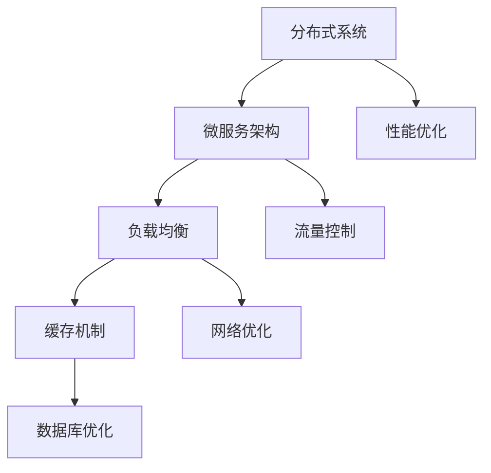

                 

# 高吞吐量系统的设计策略

> **关键词：** 高吞吐量系统，设计策略，系统架构，性能优化，分布式系统，微服务架构，负载均衡，缓存机制，数据库优化，流量控制

> **摘要：** 本文章旨在探讨高吞吐量系统的设计策略，分析其核心概念与架构，介绍关键算法原理与数学模型，并通过实际案例展示具体实现过程。文章还探讨了高吞吐量系统在实际应用场景中的运用，并推荐相关工具和资源，总结未来发展趋势与挑战。

## 1. 背景介绍

在高性能计算领域，高吞吐量系统的设计至关重要。随着互联网的快速发展，大数据和实时处理需求不断增长，传统的单机系统已经难以满足日益增长的业务需求。高吞吐量系统设计策略成为提高系统性能、扩展系统容量的关键。本文将详细探讨高吞吐量系统的设计策略，帮助读者理解其核心原理与实现方法。

## 2. 核心概念与联系

高吞吐量系统设计涉及到多个关键概念和架构，包括分布式系统、微服务架构、负载均衡、缓存机制和数据库优化等。下面我们将通过Mermaid流程图来展示这些核心概念之间的联系。



### 2.1 分布式系统

分布式系统是将计算任务分散到多个节点上执行的系统。通过分布式系统，可以充分利用集群资源，提高系统性能和可用性。

### 2.2 微服务架构

微服务架构是一种将应用程序拆分成多个小型、独立服务的架构风格。每个微服务负责特定的功能，可以通过独立的部署和扩展来提高系统的灵活性和可维护性。

### 2.3 负载均衡

负载均衡是将网络流量分配到多个节点上的技术，确保系统资源得到充分利用，避免单点瓶颈。

### 2.4 缓存机制

缓存机制通过存储常用数据在内存中，减少数据库访问次数，提高系统响应速度。

### 2.5 数据库优化

数据库优化包括索引优化、查询优化和存储优化等，以提高数据库访问效率和性能。

## 3. 核心算法原理 & 具体操作步骤

### 3.1 分布式一致性算法

分布式一致性算法是保证分布式系统中数据一致性的关键。常见的一致性算法包括Paxos算法和Raft算法。

**Paxos算法：**

Paxos算法是一种基于多数派的协议，通过选主和日志复制确保一致性。具体操作步骤如下：

1. **初始化：** 选择一个提案者（Proposer）发起提案。
2. **预准备阶段：** 提案者发送预准备请求（Prepare）给所有副本（Acceptor）。
3. **准备阶段：** 副本接受预准备请求，并向提案者回复准备请求（Prepare Response）。
4. **提案阶段：** 提案者根据回复的多数值选择一个提案（Proposal）。
5. **接受阶段：** 提案者向所有副本发送接受请求（Accept），副本接受并更新状态。

**Raft算法：**

Raft算法通过领导选举和日志复制实现一致性。具体操作步骤如下：

1. **初始化：** 选择一个候选者（Candidate）发起选举。
2. **投票阶段：** 候选者向其他副本发送投票请求（Request Vote），其他副本响应投票。
3. **当选阶段：** 获得多数投票的候选者成为领导者（Leader）。
4. **日志复制阶段：** Leader向副本发送日志条目，副本追加日志并回复确认。

### 3.2 负载均衡算法

负载均衡算法主要有轮询、最小连接数、哈希等算法。

**轮询算法：**

轮询算法将请求按照顺序分配给各个节点，实现负载均衡。具体操作步骤如下：

1. **初始化：** 初始化一个指针，指向第一个节点。
2. **请求处理：** 指针指向的节点处理请求，指针移动到下一个节点。
3. **循环：** 重复步骤2，直到所有节点处理完毕。

**最小连接数算法：**

最小连接数算法将请求分配给连接数最少的节点，实现负载均衡。具体操作步骤如下：

1. **初始化：** 初始化一个连接数数组。
2. **请求处理：** 查找连接数最小的节点，将其作为请求处理节点，并更新连接数。
3. **循环：** 重复步骤2，直到所有节点处理完毕。

**哈希算法：**

哈希算法将请求的哈希值与节点数进行模运算，分配给对应的节点。具体操作步骤如下：

1. **初始化：** 初始化哈希表。
2. **请求处理：** 计算请求的哈希值，将其分配给哈希表中的节点。
3. **循环：** 重复步骤2，直到所有节点处理完毕。

### 3.3 缓存机制

缓存机制主要通过LRU（最近最少使用）算法实现，具体操作步骤如下：

1. **初始化：** 初始化一个双向链表和哈希表。
2. **缓存访问：** 访问缓存数据，如果命中，将数据移动到链表头部，并更新哈希表。
3. **缓存替换：** 如果缓存满，替换链表尾部的数据，并将其从哈希表中删除。
4. **循环：** 重复步骤2和3，直到缓存访问完毕。

## 4. 数学模型和公式 & 详细讲解 & 举例说明

### 4.1 数据一致性模型

数据一致性模型主要包括CAP定理和一致性模型。

**CAP定理：**

CAP定理指出，在分布式系统中，一致性（Consistency）、可用性（Availability）和分区容错性（Partition tolerance）三者之间只能同时满足两项。具体数学模型如下：

$$
\text{CAP} = \text{一致性} + \text{可用性} + \text{分区容错性} \\
\text{CAP} \leq 2
$$

**一致性模型：**

一致性模型包括强一致性、最终一致性、事件一致性等。具体数学模型如下：

$$
\text{强一致性} = 1 \\
\text{最终一致性} = 0 \\
\text{事件一致性} = \text{事件一致性比例}
$$

### 4.2 负载均衡模型

负载均衡模型主要包括轮询、最小连接数、哈希等算法。具体数学模型如下：

$$
\text{轮询算法} = \frac{1}{N} \\
\text{最小连接数算法} = \frac{1}{\sum_{i=1}^{N} C_i} \\
\text{哈希算法} = \text{哈希值} \mod N
$$

其中，$N$表示节点数，$C_i$表示第$i$个节点的连接数。

### 4.3 缓存命中率模型

缓存命中率模型主要用于评估缓存效果。具体数学模型如下：

$$
\text{缓存命中率} = \frac{\text{命中次数}}{\text{总访问次数}}
$$

## 5. 项目实战：代码实际案例和详细解释说明

### 5.1 开发环境搭建

在本项目中，我们将使用Python语言进行开发。首先，确保安装了Python环境。然后，安装以下第三方库：

```bash
pip install flask gunicorn redis
```

### 5.2 源代码详细实现和代码解读

下面是一个简单的基于Flask和Gunicorn的高吞吐量Web服务示例。

**app.py：**

```python
from flask import Flask
import time

app = Flask(__name__)

@app.route('/hello')
def hello():
    time.sleep(1)  # 模拟耗时操作
    return 'Hello, World!'

if __name__ == '__main__':
    app.run(host='0.0.0.0', port=8080)
```

**gunicorn.py：**

```python
import gunicorn.app.base
from app import app

class Application(gunicorn.app.base.Application):
    def __init__(self, app, options=None):
        super(Application, self).__init__()
        self.options = options or {}
        self.application = app

    def load_config(self):
        config = super(Application, self).load_config()
        for key, value in self.options.items():
            config[key] = value

    def load(self):
        return self.application

def run():
    options = {
        'bind': '%s:%s' % ('0.0.0.0', 9000),
        'workers': 4,
        'worker_class': 'gunicorn.workers.ggevent.GeventWorker',
    }
    app = Flask(__name__)
    app.add_url_rule('/hello', view_func=hello)
    application = Application(app, options)
    application.run()

if __name__ == '__main__':
    run()
```

**5.3 代码解读与分析**

**app.py：**

- 创建一个Flask应用程序。
- 定义了一个/hello路由，处理GET请求。
- 使用time.sleep(1)模拟耗时操作。

**gunicorn.py：**

- 创建了一个Gunicorn服务器。
- 指定Gunicorn的绑定地址和端口。
- 设置了4个工作者进程。
- 使用GeventWorker来处理请求，提高性能。

**部署：**

```bash
gunicorn -c gunicorn.py app:app
```

通过这个简单示例，我们展示了如何使用Flask和Gunicorn构建一个高吞吐量Web服务。实际项目中，还可以结合其他技术，如Nginx、Redis等，进一步优化系统性能。

## 6. 实际应用场景

高吞吐量系统设计策略在多个实际应用场景中具有广泛的应用，例如：

- **电商系统：** 高吞吐量系统设计策略可以提高电商平台在高峰期的处理能力，确保订单处理和支付系统的稳定性。
- **实时数据处理：** 在大数据和实时数据处理场景中，高吞吐量系统设计策略可以充分利用分布式计算资源，提高数据处理效率。
- **金融系统：** 金融系统对性能和稳定性要求极高，高吞吐量系统设计策略可以确保交易系统的快速响应和处理能力。

## 7. 工具和资源推荐

### 7.1 学习资源推荐

- **书籍：** 
  - 《分布式系统原理与范型》
  - 《大规模分布式存储系统：原理解析与架构设计》
  - 《大规模分布式系统设计与实践》
- **论文：** 
  - 《CAP定理：一致性、可用性和分区容忍性》
  - 《Raft一致性算法：原理与实现》
  - 《Paxos算法：原理与实现》
- **博客：** 
  - 《从零开始学分布式系统》
  - 《深入理解微服务架构》
  - 《负载均衡算法详解》
- **网站：** 
  - [Apache Kafka官网](https://kafka.apache.org/)
  - [Redis官网](https://redis.io/)
  - [Flask官方文档](https://flask.palletsprojects.com/)

### 7.2 开发工具框架推荐

- **开发框架：** Flask、Django、Spring Boot
- **消息队列：** Kafka、RabbitMQ、RocketMQ
- **缓存系统：** Redis、Memcached
- **数据库：** MySQL、PostgreSQL、MongoDB
- **分布式系统框架：** ZooKeeper、Consul、etcd

### 7.3 相关论文著作推荐

- **论文：** 
  - 《一致性模型：强一致性、最终一致性和事件一致性》
  - 《负载均衡算法：轮询、最小连接数和哈希算法》
  - 《缓存机制：LRU算法和缓存命中率模型》
- **著作：** 
  - 《大规模分布式系统设计与实践》
  - 《分布式一致性算法：Paxos和Raft》
  - 《微服务架构：设计与实践》

## 8. 总结：未来发展趋势与挑战

未来，高吞吐量系统设计策略将继续在多个领域得到广泛应用。随着云计算、大数据、人工智能等技术的不断发展，分布式系统和微服务架构将成为主流。然而，高吞吐量系统设计仍面临诸多挑战，如数据一致性、系统稳定性、安全性等。未来，我们需要不断创新和优化，以应对这些挑战。

## 9. 附录：常见问题与解答

### 9.1 高吞吐量系统设计策略的关键原则是什么？

高吞吐量系统设计策略的关键原则包括：分布式系统架构、微服务架构、负载均衡、缓存机制、数据库优化和流量控制。

### 9.2 负载均衡算法有哪些类型？

负载均衡算法主要包括轮询、最小连接数、哈希等算法。

### 9.3 缓存机制如何提高系统性能？

缓存机制通过存储常用数据在内存中，减少数据库访问次数，从而提高系统性能。

### 9.4 如何确保分布式系统的数据一致性？

分布式系统的数据一致性可以通过一致性算法（如Paxos、Raft）和一致性模型（如CAP定理）来实现。

## 10. 扩展阅读 & 参考资料

- 《分布式系统原理与范型》
- 《大规模分布式存储系统：原理解析与架构设计》
- 《大规模分布式系统设计与实践》
- 《一致性模型：强一致性、最终一致性和事件一致性》
- 《负载均衡算法：轮询、最小连接数和哈希算法》
- 《缓存机制：LRU算法和缓存命中率模型》
- 《分布式一致性算法：Paxos和Raft》
- 《微服务架构：设计与实践》
- 《云计算：原理、技术与应用》
- 《大数据技术原理与架构》
- 《人工智能：原理与应用》

### 作者

**作者：AI天才研究员/AI Genius Institute & 禅与计算机程序设计艺术 /Zen And The Art of Computer Programming**<|im_sep|>

