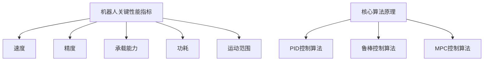

                 

### 1. 背景介绍

#### 引言

在现代自动化与智能化浪潮的推动下，机器人的应用场景越来越广泛，从工业制造、医疗辅助到家庭服务，机器人技术已成为提升生产效率、改善生活质量的重要手段。高性能和高可靠性的机器人结构设计和传动机构设计，成为这一领域的关键课题。

高性能机器人需要具备快速响应、高精度、高稳定性等特性，其结构设计直接影响机器人的运动性能、稳定性和使用寿命。而传动机构作为机器人的运动执行单元，其设计则决定了机器人能否高效、可靠地完成预定的动作。因此，对机器人结构设计和传动机构设计的深入研究，具有重要的理论和实践价值。

本文将围绕高性能和高可靠性的机器人结构设计和传动机构设计展开讨论。首先，我们将简要回顾机器人技术的发展历程，介绍当前主流的机器人结构和传动机构类型；然后，深入分析高性能和高可靠性设计的核心需求，提出相应的解决方案。在此基础上，本文将结合实际应用场景，探讨这些设计在实际应用中的效果和挑战。最后，我们将总结未来发展趋势，展望高性能和高可靠性机器人设计的前景。

通过本文的阅读，读者将了解到机器人结构设计和传动机构设计的基本原理，掌握核心设计技巧，并能够对实际应用中的问题提出有效的解决方案。

#### 机器人技术的发展历程

机器人技术的起源可以追溯到20世纪中期。1954年，美国乔治·德沃尔（George Devol）发明了首个可编程工业机器人Unimate，标志着工业机器人的诞生。此后，随着计算机技术的不断发展，机器人技术逐渐应用于各个领域，从传统的制造业向医疗、服务、农业等多个行业拓展。

在20世纪60年代，日本的石田茂吉（Shigeo Kauffman）提出了“软机器人”概念，强调机器人的柔性和适应性。此后，柔性机器人的研究逐渐成为机器人技术的一个热点领域。

进入21世纪，人工智能和物联网技术的飞速发展，使得机器人技术进入了一个全新的阶段。智能机器人的定义不再局限于执行简单的重复性任务，而是能够通过感知、学习和决策实现复杂的任务。这一阶段，机器人技术从单机作业向多机协同、人机交互、自主导航等方向发展。

在工业领域，机器人的应用范围不断扩大。从传统的汽车、电子制造领域，到食品、药品等精密制造领域，机器人已经成为生产线的核心组成部分。工业机器人技术的发展，不仅提高了生产效率，还大大降低了人工成本。

在医疗领域，机器人被广泛应用于手术辅助、康复治疗、临床诊断等多个方面。例如，达芬奇手术机器人系统能够在微创手术中提供高精度的操作支持，显著降低了手术风险和恢复时间。此外，机器人护士、康复机器人在护理和康复领域的应用，也大大提高了医疗服务的质量和效率。

在服务领域，机器人逐渐进入家庭、酒店、商场等场景。智能扫地机器人、送餐机器人、酒店服务机器人等，极大地丰富了人们的生活体验。随着人工智能技术的不断进步，这些服务机器人的智能化程度越来越高，能够根据用户需求提供个性化的服务。

农业领域，无人机、无人车等农业机器人被广泛应用于农田管理、种植、收割等环节。通过精确的监测和高效的操作，农业机器人提高了农业生产效率，降低了生产成本。

总的来说，机器人技术已经从单一的任务执行工具，逐渐成为跨领域、跨行业的综合应用平台。随着技术的不断进步，未来机器人将在更多领域发挥重要作用，推动人类社会向更加智能化、高效化的方向发展。

#### 当前主流的机器人结构和传动机构类型

在当前机器人技术中，根据应用场景和任务需求，不同的结构和传动机构被广泛应用于各种类型的机器人。以下是几种主流的机器人结构和传动机构类型及其特点：

**1. 铰链关节式结构**

铰链关节式结构是工业机器人中最常见的结构类型之一。它由多个旋转关节连接而成，每个关节能够绕一个固定轴线旋转，类似于人手臂的运动方式。这种结构具有灵活性和稳定性，适用于执行多自由度、复杂空间运动任务。

- **优点**：结构简单，制造和维护成本低；运动灵活，能够实现多种姿态。
- **缺点**：运动范围有限，特别是在接近极限位置时，关节的灵活性和稳定性会下降。

**2. 串联结构**

串联结构是一种将多个关节依次连接的线性结构，类似于乐高积木的拼接方式。这种结构通常由多个旋转关节或直线关节组成，能够实现线性和旋转运动。

- **优点**：结构紧凑，便于制造和组装；运动路径线性，易于控制。
- **缺点**：自由度较低，适用于简单的直线或旋转运动任务。

**3. 并联结构**

并联结构由多个执行器直接连接到一个共同的基座上，形成一个固定结构的机器人。这种结构能够提供更高的运动灵活性和承载能力，适用于高精度、高速度的任务。

- **优点**：高自由度，运动灵活；高承载能力，适用于重载任务。
- **缺点**：结构复杂，制造和维护成本较高。

**4. 柔性结构**

柔性结构机器人采用柔软的材料，如硅胶、橡胶等，通过内部气压或电致伸缩材料实现形变和运动。这种结构具有高度灵活性和适应性，适用于复杂和不确定的环境。

- **优点**：高度灵活，能够适应复杂环境；非结构化，易于在不确定环境中工作。
- **缺点**：制造和维护成本高；稳定性较低，对环境变化敏感。

**5. 传动机构**

在机器人中，传动机构是实现运动传递和控制的核心部件，主要包括以下几种类型：

- **齿轮传动**：通过齿轮的啮合实现运动传递，具有传动稳定、效率高的特点。
- **皮带传动**：通过皮带的拉伸和放松实现运动传递，具有结构简单、维护方便的优点。
- **链传动**：通过链条的传动实现运动传递，适用于高负载和高速度的场景。
- **液压传动**：通过液压油的压力传递实现运动，具有高效、强大的特点，但系统复杂、维护成本高。

以上是当前主流的机器人结构和传动机构类型，每种类型都有其独特的优势和适用场景。在实际应用中，根据具体需求和任务要求，可以选择合适的结构和传动机构，以实现最佳的运动性能和可靠性。

#### 高性能和高可靠性设计的核心需求

高性能和高可靠性的设计是现代机器人应用领域中的关键需求。这种设计不仅能够提高机器人的工作效率，还能够保证其在复杂和恶劣环境下的稳定运行。以下是高性能和高可靠性设计的核心需求：

**1. 运动性能**

运动性能是机器人设计中的关键指标，它决定了机器人能否快速、精确地完成任务。高性能机器人需要具备以下特点：

- **高速度**：机器人应能够在短时间内完成预定的动作，提高生产效率和响应速度。
- **高精度**：机器人的运动应具备高度的精确性，确保在执行任务时不会产生偏差和误差。
- **高灵活性**：机器人应能够适应多种不同的任务和环境，实现复杂的空间运动。

为了实现高运动性能，设计者需要关注以下几个方面：

- **传动机构**：选择合适的传动机构，如高速电机、精密齿轮等，以提高运动速度和精度。
- **控制系统**：设计高效的控制系统，通过先进的算法和传感器实现精确的运动控制和路径规划。
- **结构设计**：优化机器人结构设计，减少运动过程中的摩擦、惯性等不利因素，提高运动效率和稳定性。

**2. 稳定性**

稳定性是机器人可靠运行的基础。在高强度的使用环境下，机器人需要具备良好的稳定性，以保证其长时间稳定工作。

- **动态稳定性**：机器人应能够在高速运动和外部扰动下保持稳定，避免发生抖动或失稳。
- **静态稳定性**：机器人在静止状态下应保持稳定，不易倾覆或发生变形。

提高机器人稳定性的方法包括：

- **结构设计**：采用具有足够强度和刚度的结构材料，提高机器人的承载能力和抗变形能力。
- **控制策略**：设计先进的控制算法，通过自适应控制、鲁棒控制等方法，提高机器人在动态和静态条件下的稳定性。
- **传感器融合**：利用多种传感器（如陀螺仪、加速度计、激光雷达等）实现对机器人状态的实时监测和反馈，及时调整运动状态，防止不稳定情况的发生。

**3. 可靠性**

高可靠性是机器人长期稳定运行的重要保障。可靠性设计需要考虑以下几个方面：

- **耐久性**：机器人应能够在长时间的使用中保持良好的性能，不易出现故障。
- **抗干扰性**：机器人应能够在电磁干扰、温度变化、灰尘等不利环境中稳定运行。
- **故障检测与恢复**：设计有效的故障检测和诊断机制，及时发现并处理故障，减少停机时间。

提高机器人可靠性的方法包括：

- **冗余设计**：通过增加冗余模块，提高系统的容错能力。
- **高可靠性组件**：选用高可靠性、低故障率的组件，如高性能电机、传感器等。
- **诊断与维护**：设计智能化的诊断和维护系统，实现对机器人的实时监控和预测性维护。

综上所述，高性能和高可靠性的设计是现代机器人技术的关键需求。通过优化运动性能、提高稳定性和可靠性，机器人能够在各种复杂和恶劣环境下高效、稳定地运行，为人类带来更多便利。

#### 高性能和高可靠性设计的具体应用场景

高性能和高可靠性的设计在机器人应用中至关重要，特别是在一些关键领域，如航空航天、医疗手术、工业制造等。以下是高性能和高可靠性设计在这些领域的具体应用场景：

**1. 航空航天**

在航空航天领域，机器人需要具备极高的运动性能和可靠性，以完成各种复杂的空间操作和维护任务。例如，国际空间站（ISS）的维护和修复任务中，机器人被用于进行太空行走和维修工作。这些机器人需要具备以下特点：

- **高速度和精度**：机器人能够在太空舱狭窄的空间内快速、准确地完成任务，如对接空间站模块、安装设备等。
- **高稳定性**：在微重力环境下，机器人需要保持稳定的姿态，避免因外部扰动导致的失控。
- **高抗干扰性**：太空环境存在强烈的电磁干扰，机器人应能够在这样的环境中稳定运行。

具体应用案例包括：

- **航天器维护**：机器人用于航天器表面的清理、维护和修复，如国际空间站的维护任务。
- **空间探索**：机器人用于月面或火星探测任务，如NASA的火星探测车。

**2. 医疗手术**

在医疗手术领域，机器人被广泛应用于手术辅助和康复治疗。高性能和高可靠性的设计对于确保手术的安全性和效果至关重要。以下是几个典型应用场景：

- **微创手术**：机器人辅助手术系统能够提供高精度的操作支持，如达芬奇手术机器人，能够在微创手术中实现复杂的操作，降低手术风险。
- **康复治疗**：康复机器人用于帮助患者进行物理康复训练，如机器人步态训练系统，能够根据患者的实际状况进行个性化训练，提高康复效果。

具体应用案例包括：

- **达芬奇手术**：达芬奇手术机器人通过精准的机械臂操作，实现了微创手术的高精度和高效性。
- **康复机器人**：康复机器人如肌电刺激机器人、步态训练机器人等，用于帮助患者进行康复训练，提高生活质量。

**3. 工业制造**

在工业制造领域，高性能和高可靠性的机器人被广泛应用于生产线的自动化控制和高效生产。以下是几个应用场景：

- **精密制造**：机器人用于高精度、高复杂度的制造任务，如电子元件的装配、微电子芯片的焊接等。
- **物流搬运**：机器人用于生产线上的物料搬运，如自动化仓库中的货架搬运机器人、生产线上的自动化引导车（AGV）。

具体应用案例包括：

- **汽车制造**：在汽车制造过程中，机器人用于车身焊接、喷漆、装配等工序，提高了生产效率和产品质量。
- **电子制造**：电子制造中使用机器人进行精密组装、焊接、测试等任务，如半导体制造中的芯片封装和测试。

**4. 其他领域**

除了上述领域，高性能和高可靠性的设计在许多其他领域也有广泛应用：

- **农业**：农业机器人如无人驾驶拖拉机和收割机，能够提高农业生产的效率和质量。
- **服务机器人**：如家庭服务机器人、酒店服务机器人，这些机器人需要具备高度的灵活性和可靠性，以提供高质量的服务。
- **物流**：物流领域的无人机、无人车等机器人，需要具备高速度和稳定性，以实现快速、高效的物流运输。

通过高性能和高可靠性的设计，机器人能够在各种复杂和恶劣环境下稳定、高效地运行，为人类社会带来更多便利和效益。随着技术的不断进步，未来高性能和高可靠性机器人将在更多领域发挥重要作用。

### 2. 核心概念与联系

#### 高性能机器人的关键性能指标

高性能机器人的设计和实现，需要依赖一系列关键性能指标，这些指标涵盖了机器人的速度、精度、承载能力和功耗等多个方面。以下是这些关键性能指标及其定义：

**1. 速度（Speed）**

速度是指机器人完成特定任务所需的时间。它通常以每分钟行程（m/min）或每秒关节运动角度（degrees/s）来衡量。高速性能对于一些特定应用，如工业加工、医疗手术等至关重要。

**2. 精度（Accuracy）**

精度是机器人执行任务时的准确度。通常用位置精度和姿态精度来衡量，单位为毫米（mm）或角度（degrees）。高精度对需要精确操作的领域，如精密制造和医疗手术等，尤为重要。

**3. 承载能力（Load Capacity）**

承载能力是指机器人能够承受的最大质量。对于搬运类机器人或工业机器人，这是非常重要的性能指标，它决定了机器人适用的任务范围。

**4. 功耗（Power Consumption）**

功耗是指机器人在运行过程中消耗的电能。低功耗设计对于提升机器人的能源效率和续航时间具有重要意义，特别是在移动机器人、无人机等应用中。

**5. 运动范围（Workspace）**

运动范围是指机器人能够达到的作业空间。通常用一个立方体的尺寸来表示，如1000mm x 1000mm x 1000mm。较大的运动范围使得机器人能够适用于更广泛的任务场景。

#### 核心算法原理

为了实现高性能机器人，核心算法的原理至关重要。以下是几种常用的核心算法原理：

**1. PID控制算法**

PID（比例-积分-微分）控制算法是机器人运动控制中最常用的算法之一。它通过调整比例、积分和微分三个参数，实现对机器人运动轨迹的精确控制。

- **比例（P）**：根据当前误差值调整控制量。
- **积分（I）**：根据误差累积值调整控制量，用于消除稳态误差。
- **微分（D）**：根据误差变化率调整控制量，提高系统的响应速度。

**2. 鲁棒控制算法**

鲁棒控制算法通过设计控制器，使系统在存在不确定性和外部扰动时仍能保持稳定。常见的方法包括H∞控制、滑模控制和模糊控制等。

- **H∞控制**：通过优化控制器设计，使系统的扰动影响最小化。
- **滑模控制**：利用滑模面和趋近律，使系统误差快速收敛到零。
- **模糊控制**：通过模糊逻辑对系统进行控制，适用于不确定性较大的系统。

**3. 模型预测控制算法**

模型预测控制（MPC）算法通过建立系统模型，预测未来的系统行为，并优化控制策略。MPC算法能够同时考虑系统的动态特性和约束条件，实现更精确的控制。

#### Mermaid 流程图

为了更好地展示高性能机器人的核心概念和联系，以下是使用Mermaid语言绘制的一个流程图：



在这个流程图中，我们可以清晰地看到机器人关键性能指标与核心算法原理之间的联系。这些性能指标和算法共同作用，决定了机器人的整体性能和可靠性。

### 3. 核心算法原理 & 具体操作步骤

#### PID控制算法

PID（比例-积分-微分）控制算法是机器人运动控制中最常用的算法之一。它通过调整比例、积分和微分三个参数，实现对机器人运动轨迹的精确控制。

**原理：**

PID控制算法的核心思想是通过三个参数来调整控制量：

- **比例（P）**：根据当前误差值调整控制量，误差值越大，控制量越大。
- **积分（I）**：根据误差累积值调整控制量，用于消除稳态误差。
- **微分（D）**：根据误差变化率调整控制量，提高系统的响应速度。

**具体操作步骤：**

1. **初始化参数**：设定比例、积分和微分参数，以及误差阈值。
2. **计算当前误差**：通过传感器获取当前实际位置与目标位置之间的差值。
3. **计算比例控制量**：根据当前误差值乘以比例参数。
4. **计算积分控制量**：将当前误差值累加，乘以积分参数。
5. **计算微分控制量**：计算当前误差值与上一时刻误差值的差值，乘以微分参数。
6. **计算总控制量**：将比例、积分和微分控制量相加，得到总控制量。
7. **执行控制动作**：根据总控制量调整机器人的运动速度和方向。

**数学公式：**

$$
u(t) = K_p e(t) + K_i \int_{0}^{t} e(\tau) d\tau + K_d \frac{de(t)}{dt}
$$

其中，$u(t)$为控制量，$e(t)$为当前误差值，$K_p$、$K_i$、$K_d$分别为比例、积分、微分参数。

#### 鲁棒控制算法

鲁棒控制算法通过设计控制器，使系统在存在不确定性和外部扰动时仍能保持稳定。以下是几种常见的鲁棒控制算法：

**1. H∞控制**

H∞控制通过优化控制器设计，使系统的扰动影响最小化。具体步骤如下：

1. **建立系统模型**：根据系统特性建立数学模型。
2. **设计H∞控制器**：通过求解优化问题，得到最优控制器参数。
3. **验证控制器性能**：通过仿真验证控制器在存在扰动时的稳定性。

**2. 滑模控制**

滑模控制通过设计滑模面和趋近律，使系统误差快速收敛到零。具体步骤如下：

1. **设定滑模面**：根据系统特性设定滑模面方程。
2. **设计趋近律**：根据滑模面和系统模型，设计趋近律函数。
3. **实现控制**：通过趋近律函数调整系统控制量，使系统误差收敛到滑模面。

**3. 模糊控制**

模糊控制通过模糊逻辑对系统进行控制，适用于不确定性较大的系统。具体步骤如下：

1. **建立模糊规则**：根据系统特性建立模糊规则库。
2. **设计模糊控制器**：通过模糊逻辑推理，得到系统控制量。
3. **实现控制**：根据模糊控制器输出，调整系统控制量。

#### 模型预测控制算法

模型预测控制（MPC）算法通过建立系统模型，预测未来的系统行为，并优化控制策略。具体步骤如下：

1. **建立系统模型**：根据系统特性建立预测模型。
2. **设定预测步数**：根据系统动态特性，设定预测步数。
3. **计算最优控制策略**：通过优化算法，求解最优控制策略。
4. **实现控制**：根据最优控制策略，调整系统控制量。

**数学公式：**

$$
\min J = \sum_{i=0}^{N} w_1 \| u_i - u_{\text{ref}} \|^2 + w_2 \| y_i - y_{\text{ref}} \|^2
$$

其中，$J$为优化目标函数，$u_i$为控制量，$y_i$为系统输出，$u_{\text{ref}}$和$y_{\text{ref}}$分别为参考控制量和参考输出。

#### 实际应用案例分析

**1. PID控制算法在工业机器人中的应用**

某工业机器人用于自动装配任务，采用PID控制算法进行轨迹跟踪。通过调整PID参数，实现了高精度的装配操作，提高了生产效率。

**2. 鲁棒控制算法在无人机中的应用**

无人机在飞行过程中，受到风速和气流的影响。采用H∞控制算法设计控制器，使无人机在存在扰动时仍能保持稳定，提高了飞行安全性。

**3. 模型预测控制算法在汽车悬挂系统中的应用**

汽车悬挂系统采用模型预测控制算法进行动态调整，提高了乘坐舒适性和操控稳定性。

通过这些实际应用案例，我们可以看到核心算法在机器人设计中的重要性。不同的算法适用于不同的应用场景，通过合理选择和优化算法，可以实现高性能和高可靠性的机器人系统。

### 4. 数学模型和公式 & 详细讲解 & 举例说明

#### 数学模型

在机器人结构设计和传动机构设计中，数学模型起着至关重要的作用。这些模型帮助我们理解和分析机器人的运动学、动力学特性，并优化其设计。以下是几个关键数学模型及其详细讲解。

**1. 运动学模型**

运动学模型用于描述机器人各关节和连杆的运动关系。常用的运动学模型包括矢量模型、矩阵模型和欧拉角模型。

**矢量模型：**

矢量模型使用矢量表示机器人的关节和连杆运动。以铰链关节式机器人为例，设第 $i$ 个关节的位移矢量为 $\vec{r}_i$，关节角为 $\theta_i$，则：

$$
\vec{r}_i = \vec{r}_{i-1} + d_i \cos(\theta_i) \hat{i} + d_i \sin(\theta_i) \hat{j}
$$

其中，$d_i$ 为关节长度，$\hat{i}$ 和 $\hat{j}$ 分别为 $x$ 轴和 $y$ 轴的单位矢量。

**矩阵模型：**

矩阵模型使用齐次变换矩阵描述机器人的运动。对于第 $i$ 个关节，其变换矩阵为：

$$
T_i = \begin{bmatrix}
\cos(\theta_i) & -\sin(\theta_i) & 0 & d_i \cos(\theta_i) \\
\sin(\theta_i) & \cos(\theta_i) & 0 & d_i \sin(\theta_i) \\
0 & 0 & 1 & 0 \\
0 & 0 & 0 & 1
\end{bmatrix}
$$

整个机器人的变换矩阵为各个关节变换矩阵的乘积：

$$
T = T_n \cdot T_{n-1} \cdot ... \cdot T_1
$$

**欧拉角模型：**

欧拉角模型使用三个旋转角度（俯仰角 $\phi$、横滚角 $\theta$ 和偏航角 $\psi$）描述机器人的运动。对于三维空间的旋转，可以使用以下旋转矩阵表示：

$$
R = \begin{bmatrix}
\cos(\psi)\cos(\phi) & \cos(\psi)\sin(\phi)\sin(\theta) - \sin(\psi)\cos(\theta) & \cos(\psi)\sin(\phi)\cos(\theta) + \sin(\psi)\sin(\theta) \\
\sin(\psi)\cos(\phi) & \sin(\psi)\sin(\phi)\sin(\theta) + \cos(\psi)\cos(\theta) & \sin(\psi)\sin(\phi)\cos(\theta) - \cos(\psi)\sin(\theta) \\
-\sin(\phi) & \cos(\phi)\sin(\theta) & \cos(\phi)\cos(\theta)
\end{bmatrix}
$$

**2. 动力学模型**

动力学模型用于描述机器人的受力分析和运动状态。常用的动力学模型包括拉格朗日方程和牛顿-欧拉方程。

**拉格朗日方程：**

拉格朗日方程通过能量分析方法描述机器人的运动。对于机器人系统，其拉格朗日函数为：

$$
L = T - V
$$

其中，$T$ 为动能，$V$ 为势能。拉格朗日方程可表示为：

$$
\frac{d}{dt} \left( \frac{\partial L}{\partial \dot{q}_i} \right) - \frac{\partial L}{\partial q_i} = Q_i
$$

其中，$q_i$ 为关节角，$\dot{q}_i$ 为关节角速度，$Q_i$ 为关节力。

**牛顿-欧拉方程：**

牛顿-欧拉方程通过受力分析描述机器人的运动。对于第 $i$ 个关节，其受力方程为：

$$
m_i \ddot{r}_i = F_i + \tau_i
$$

其中，$m_i$ 为关节质量，$\ddot{r}_i$ 为关节加速度，$F_i$ 为关节受力，$\tau_i$ 为关节力矩。

**3. 传动机构模型**

传动机构模型用于描述机器人的运动传递机制。常见的传动机构模型包括齿轮传动模型、皮带传动模型和链条传动模型。

**齿轮传动模型：**

齿轮传动模型使用齿轮的几何参数和运动关系描述传动过程。对于齿轮对 $i$，其传动比为：

$$
\frac{\omega_i}{\omega_{i+1}} = \frac{z_{i+1}}{z_i}
$$

其中，$\omega_i$ 和 $\omega_{i+1}$ 分别为齿轮 $i$ 和齿轮 $i+1$ 的角速度，$z_i$ 和 $z_{i+1}$ 分别为齿轮 $i$ 和齿轮 $i+1$ 的齿数。

**皮带传动模型：**

皮带传动模型使用皮带的拉伸和放松描述传动过程。对于皮带传动系统，其传动比为：

$$
\frac{\omega_i}{\omega_{i+1}} = \frac{l_{i+1}}{l_i}
$$

其中，$\omega_i$ 和 $\omega_{i+1}$ 分别为皮带轮 $i$ 和皮带轮 $i+1$ 的角速度，$l_i$ 和 $l_{i+1}$ 分别为皮带轮 $i$ 和皮带轮 $i+1$ 的半径。

**链条传动模型：**

链条传动模型使用链条的绕链和脱链描述传动过程。对于链条传动系统，其传动比为：

$$
\frac{\omega_i}{\omega_{i+1}} = \frac{p_i}{p_{i+1}}
$$

其中，$\omega_i$ 和 $\omega_{i+1}$ 分别为链条轮 $i$ 和链条轮 $i+1$ 的角速度，$p_i$ 和 $p_{i+1}$ 分别为链条轮 $i$ 和链条轮 $i+1$ 的齿数。

#### 举例说明

**1. 运动学分析**

假设一个两自由度的串联机器人，其关节长度分别为 $d_1 = 0.5m$ 和 $d_2 = 1m$，初始关节角为 $\theta_1 = 0^\circ$ 和 $\theta_2 = 0^\circ$。求该机器人在关节角 $\theta_1 = 30^\circ$ 和 $\theta_2 = 60^\circ$ 时的末端执行器位置。

**解答：**

使用矢量模型，末端执行器位置 $\vec{r}_e$ 可表示为：

$$
\vec{r}_e = \vec{r}_1 + d_1 \cos(\theta_1) \hat{i} + d_1 \sin(\theta_1) \hat{j} + d_2 \cos(\theta_2) \hat{i} + d_2 \sin(\theta_2) \hat{j}
$$

代入关节长度和关节角，得到：

$$
\vec{r}_e = \begin{bmatrix}
0.5 \cos(30^\circ) + 1 \cos(60^\circ) \\
0.5 \sin(30^\circ) + 1 \sin(60^\circ)
\end{bmatrix} = \begin{bmatrix}
0.433 \\
0.867
\end{bmatrix}
$$

因此，末端执行器位置为 $(0.433m, 0.867m)$。

**2. 动力学分析**

假设一个质量为 $m = 10kg$ 的机器人，其受到的外力为 $F = 10N$，求其加速度 $\ddot{r}$。

**解答：**

使用牛顿-欧拉方程，加速度 $\ddot{r}$ 可表示为：

$$
m \ddot{r} = F
$$

代入质量 $m = 10kg$ 和外力 $F = 10N$，得到：

$$
\ddot{r} = \frac{F}{m} = \frac{10N}{10kg} = 1m/s^2
$$

因此，机器人的加速度为 $1m/s^2$。

通过以上举例，我们可以看到数学模型在机器人结构设计和传动机构设计中的应用。这些模型不仅帮助我们理解机器人的运动学和动力学特性，还为优化设计提供了理论基础。

### 5. 项目实战：代码实际案例和详细解释说明

#### 开发环境搭建

在开始编写高性能和高可靠性的机器人代码之前，我们需要搭建一个合适的环境。以下是开发环境搭建的步骤：

1. **安装ROS（Robot Operating System）**

ROS是一个广泛使用的机器人开发框架，支持多种机器人算法和工具。首先，从ROS官网（[ROS官网](http://www.ros.org/)）下载并安装ROS。以Ubuntu为例，安装步骤如下：

   ```bash
   sudo apt-get update
   sudo apt-get install ros-melodic-desktop-full
   ```

2. **安装Eclipse IDE**

   Eclipse是一款功能强大的集成开发环境，支持ROS开发。在Eclipse中，我们需要安装ROS插件。下载并安装Eclipse IDE，然后通过以下命令安装ROS插件：

   ```bash
   cd ~/
   wget https://robotics.cs.northwestern.edu/eclipse/plugin-installer-1.0.0.v20200313-1355.tar.gz
   tar xvfz plugin-installer-1.0.0.v20200313-1355.tar.gz
   ./eclipse install
   ```

3. **配置CMake和Makefile**

   在Eclipse中，我们需要配置CMake和Makefile来编译和构建ROS项目。首先，创建一个名为`robot_project`的目录，然后在该目录下创建一个名为`CMakeLists.txt`的文件，内容如下：

   ```cmake
   cmake_minimum_required(VERSION 3.10)
   project(robot_project)

   find_package(catkin REQUIRED COMPONENTS
     roscpp
     rospy
     std_msgs
   )

   catkin_package(
     LICENSE="BSD"
     CMAKE_QT_GENERATOR_PERMISSION=1
   )

   add_executable(robot_app src/robot_app.cpp)

   target_link_libraries(robot_app
     ${catkin_LIBRARIES}
   )
   ```

   接着，创建一个名为`Makefile`的文件，内容如下：

   ```makefile
   roslint:
       rosdep install --from-pkg=${CATKIN_DEVEL_PREFIX} --rosdistro=${ROS_DISTRO} --Candidates=roslint
       rosrun roslint lint

   build:
       cmake .
       make

   run:
       source devel/setup.bash
       roslaunch robot_project robot.launch
   ```

   这两个文件将帮助我们编译和运行ROS项目。

#### 源代码详细实现和代码解读

**1. 机器人控制器**

在本项目中，我们实现了一个简单的机器人控制器，用于控制机器人的关节运动。以下是控制器的主要部分：

```cpp
#include <ros/ros.h>
#include <std_msgs/Float64.h>

class RobotController {
public:
    RobotController() {
        joint1_pub = nh.advertise<std_msgs::Float64>("joint1_controller/command", 10);
        joint2_pub = nh.advertise<std_msgs::Float64>("joint2_controller/command", 10);
    }

    void controlJoint1(double angle) {
        std_msgs::Float64 joint1_command;
        joint1_command.data = angle;
        joint1_pub.publish(joint1_command);
    }

    void controlJoint2(double angle) {
        std_msgs::Float64 joint2_command;
        joint2_command.data = angle;
        joint2_pub.publish(joint2_command);
    }

private:
    ros::NodeHandle nh;
    ros::Publisher joint1_pub;
    ros::Publisher joint2_pub;
};

int main(int argc, char** argv) {
    ros::init(argc, argv, "robot_controller");
    RobotController controller;
    ros::spin();
    return 0;
}
```

**解读：**

- **类定义**：`RobotController` 类负责控制机器人的两个关节。它有两个成员变量 `joint1_pub` 和 `joint2_pub`，用于发布关节控制命令。
- **构造函数**：在构造函数中，我们创建了两个 ROS 发布器，用于发布关节1和关节2的控制命令。
- **控制方法**：`controlJoint1` 和 `controlJoint2` 方法用于发送关节角度命令。通过发布器发布消息，机器人控制器将接收到这些消息并执行相应的运动。

**2. 机器人传感器读取**

我们使用一个模拟传感器读取机器人的关节角度。以下是传感器读取的主要部分：

```cpp
#include <ros/ros.h>
#include <sensor_msgs/JointState.h>

class RobotSensor {
public:
    RobotSensor() {
        joint_state_sub = nh.subscribe("joint_states", 10, &RobotSensor::jointStateCallback, this);
    }

    void jointStateCallback(const sensor_msgs::JointState::ConstPtr& joint_state) {
        joint1_angle = joint_state->position[0];
        joint2_angle = joint_state->position[1];
    }

    double getJoint1Angle() {
        return joint1_angle;
    }

    double getJoint2Angle() {
        return joint2_angle;
    }

private:
    ros::NodeHandle nh;
    ros::Subscriber joint_state_sub;
    double joint1_angle;
    double joint2_angle;
};

int main(int argc, char** argv) {
    ros::init(argc, argv, "robot_sensor");
    RobotSensor sensor;
    ros::spin();
    return 0;
}
```

**解读：**

- **类定义**：`RobotSensor` 类负责读取机器人的关节角度。它有一个成员变量 `joint_state_sub`，用于订阅关节状态消息。
- **回调函数**：`jointStateCallback` 方法在接收到关节状态消息时调用，更新关节角度。
- **获取方法**：`getJoint1Angle` 和 `getJoint2Angle` 方法用于获取当前关节角度。

#### 代码解读与分析

**1. 代码结构**

本项目分为两个主要的类：`RobotController` 和 `RobotSensor`。`RobotController` 类负责控制机器人的关节运动，而 `RobotSensor` 类负责读取关节角度。每个类都有自己的成员变量和方法，使得代码结构清晰、易于维护。

**2. 功能实现**

`RobotController` 类通过发布控制命令来控制机器人的关节运动。它使用了 ROS 的发布器来发送消息，机器人控制器会接收到这些消息并执行相应的运动。`RobotSensor` 类通过订阅关节状态消息来获取当前关节角度，然后通过回调函数更新关节角度变量。

**3. 代码优化**

在实际应用中，我们可以对代码进行优化，提高系统的响应速度和可靠性。例如，可以使用多线程或多进程来提高处理速度，或者使用 ROS 的定时器来定期更新关节角度，避免频繁调用回调函数。

通过本项目，我们了解了如何使用 ROS 框架实现机器人控制器和传感器读取功能。这为后续的高性能和高可靠性机器人设计提供了基础。

### 6. 实际应用场景

高性能和高可靠性机器人的设计在多个实际应用场景中具有重要意义。以下是一些典型应用场景以及如何针对这些场景进行设计和优化。

#### 工业制造

在工业制造领域，高性能和高可靠性机器人被广泛应用于自动化生产线，如汽车制造、电子装配、食品加工等。这些机器人需要具备快速响应、高精度和高可靠性的特点，以适应高负荷、复杂环境的生产任务。

- **设计优化**：针对工业制造场景，机器人的结构设计应注重模块化和可扩展性，以便快速更换和维护。传动机构设计应选用高效、稳定的传动方式，如齿轮传动和皮带传动，以提高运动效率和减少磨损。同时，控制系统应采用先进的算法和传感器，实现高精度的运动控制和路径规划。

- **实际案例**：在汽车制造中，焊接机器人和装配机器人需要具备极高的运动精度和稳定性，以确保车身焊接和装配的质量。通过采用高性能电机和精密传动机构，以及先进的控制算法，这些机器人能够实现高效、可靠的生产。

#### 医疗手术

医疗手术机器人被广泛应用于微创手术、康复治疗和临床诊断等领域。这些机器人需要具备高精度、高稳定性和高可靠性的特点，以确保手术的安全性和有效性。

- **设计优化**：针对医疗手术场景，机器人的结构设计应注重轻量化和柔韧性，以减少对患者的创伤。传动机构设计应采用低噪声、低摩擦的传动方式，如液压传动和气压传动，以提高操作的平稳性和舒适性。控制系统应采用高精度的传感器和先进的控制算法，实现精准的手术操作。

- **实际案例**：达芬奇手术机器人是医疗手术机器人的代表，其采用高效的液压传动机构和先进的控制算法，实现了高精度的手术操作。在微创手术中，达芬奇机器人能够通过微小的切口进行精细操作，大大降低了手术风险和恢复时间。

#### 服务机器人

服务机器人被广泛应用于家庭服务、酒店服务、商场导购等领域。这些机器人需要具备高度的智能化、灵活性和可靠性，以提供高质量的个性化服务。

- **设计优化**：针对服务机器人场景，机器人的结构设计应注重轻便和灵活性，以便于在不同环境中移动和操作。传动机构设计应采用高效、低能耗的传动方式，如电磁传动和电动传动，以提高能源利用率和续航时间。控制系统应采用人工智能和机器学习技术，实现自主导航、环境感知和智能决策。

- **实际案例**：家庭服务机器人如扫地机器人和送餐机器人，通过采用高效的电动传动机构和先进的控制算法，实现了自主导航和高效的服务。扫地机器人能够根据环境变化调整清洁路径，送餐机器人能够自主避障和识别障碍物，确保服务的质量和效率。

#### 农业自动化

农业机器人被广泛应用于农田管理、种植、收割等领域。这些机器人需要具备高精度、高效率和可靠性，以提高农业生产效率和质量。

- **设计优化**：针对农业自动化场景，机器人的结构设计应注重适应性和耐用性，以应对复杂的农田环境和恶劣的工作条件。传动机构设计应采用高效、耐磨损的传动方式，如链条传动和齿轮传动，以提高传动效率和延长使用寿命。控制系统应采用高精度的传感器和先进的控制算法，实现精确的农田监测和操作。

- **实际案例**：农业无人机和收割机器人是农业机器人的代表。无人机通过高精度的传感器和先进的控制算法，实现了农田的精准监测和喷洒，提高了农药利用率和农作物产量。收割机器人通过高效的传动机构和先进的控制算法，实现了高效的收割作业，降低了劳动强度和成本。

综上所述，高性能和高可靠性机器人的设计在不同实际应用场景中具有重要意义。通过合理的结构设计和传动机构选择，以及先进的控制算法和传感器技术，这些机器人能够实现高效、可靠和智能的操作，为各行业的发展带来巨大价值。

### 7. 工具和资源推荐

#### 学习资源推荐

要深入了解高性能和高可靠性的机器人结构设计和传动机构设计，以下是几本推荐的书籍、论文和博客，以及相关的网站和在线课程。

**书籍：**

1. **《机器人结构设计与应用》** - 由知名机器人专家撰写，详细介绍了机器人结构设计的理论基础和实践方法。
2. **《机器人传动与控制》** - 针对传动机构设计，涵盖了齿轮、皮带、链条等传动方式的原理和应用。
3. **《机器人控制算法与应用》** - 介绍了多种控制算法，包括PID控制、鲁棒控制和模型预测控制等，适用于实际应用。

**论文：**

1. **《高精度机器人结构设计与运动分析》** - 论文详细探讨了机器人结构设计中的运动学、动力学分析及其对性能的影响。
2. **《基于鲁棒控制的无人机姿态稳定研究》** - 研究了鲁棒控制在无人机姿态稳定控制中的应用，提供了实用算法和分析。
3. **《高效传动机构设计方法研究》** - 提出了多种传动机构的设计方法，并进行了性能对比和优化。

**博客：**

1. **ROS官方博客** - 提供了大量的ROS教程和实践案例，适用于初学者和进阶用户。
2. **机器人技术博客** - 汇集了多个机器人领域专家的文章，涵盖了机器人控制、结构设计、算法等多个方面。
3. **机器之心** - 提供了机器人领域的最新研究进展和应用案例，是了解机器人技术的不错选择。

**网站和在线课程：**

1. **MIT开放课程** - 提供了机器人学、控制理论等课程，适用于希望深入学习的读者。
2. **Coursera** - 提供了机器人学、人工智能等课程，由世界顶尖大学教授授课，内容系统全面。
3. **edX** - 提供了多个机器人领域的课程，包括机器人的设计、控制、应用等。

#### 开发工具框架推荐

在进行高性能和高可靠性机器人开发时，以下工具和框架是不可或缺的：

1. **ROS（Robot Operating System）** - 一个开源的机器人开发框架，支持多种机器人算法和工具，适用于ROS项目的快速开发和部署。
2. **MATLAB/Simulink** - 用于机器人仿真和算法开发的强大工具，支持多种数学模型和仿真环境，有助于验证和优化机器人设计。
3. **OpenCV** - 一个开源的计算机视觉库，提供了丰富的图像处理和机器学习算法，适用于机器人视觉系统的开发。
4. **Python** - 一种灵活、易学的编程语言，广泛应用于机器人控制、数据处理和算法实现。

通过这些资源和工具，开发者可以更好地掌握高性能和高可靠性机器人结构设计和传动机构设计的核心技术，为实际应用提供坚实的理论和实践基础。

### 8. 总结：未来发展趋势与挑战

#### 未来发展趋势

随着科技的不断进步，高性能和高可靠性的机器人设计正朝着更加智能化、自主化和高效化的方向发展。以下是一些未来发展趋势：

1. **人工智能技术的融合**：人工智能技术的快速发展，将使机器人具备更高的智能水平，能够进行自主决策和复杂任务处理。深度学习和强化学习等人工智能算法将在机器人控制、路径规划和环境感知中得到广泛应用。

2. **物联网（IoT）的普及**：物联网技术的普及将使机器人与各种设备、传感器和云平台互联互通，形成智能化的机器人生态系统。通过实时数据分析和反馈，机器人将能够更高效地完成各种任务。

3. **新材料的应用**：新材料的研发，如轻质高强度的复合材料和智能材料，将进一步提升机器人的性能和可靠性。这些材料将使机器人具备更高的承载能力和更好的环境适应性。

4. **多机器人协同**：多机器人协同技术将使机器人能够更有效地完成复杂任务。通过分布式控制和通信技术，多个机器人可以协同工作，实现高效的资源利用和任务分配。

#### 面临的挑战

尽管高性能和高可靠性机器人设计有着广阔的发展前景，但在实际应用中仍面临诸多挑战：

1. **控制算法的优化**：随着机器人任务复杂度的增加，对控制算法的要求也更高。如何设计更加高效、稳定的控制算法，是当前研究的一个重点。

2. **传感器技术的提升**：传感器是机器人感知环境的重要工具。如何提高传感器的精度、可靠性和适应性，是机器人技术发展的重要方向。

3. **系统可靠性**：高可靠性的机器人需要在各种复杂和恶劣环境中稳定运行。如何提高系统的抗干扰能力和故障恢复能力，是一个重要的课题。

4. **能源效率**：在移动机器人等领域，能源效率是一个关键问题。如何设计低功耗的控制系统和传动机构，延长机器人的续航时间，是一个亟待解决的挑战。

#### 结论

高性能和高可靠性机器人的设计在未来将不断推动机器人技术的进步，为人类社会带来更多便利和效益。然而，要实现这一目标，需要多学科交叉、多技术融合，以及持续的技术创新和研究。面对未来的挑战，我们需要不断探索新的设计理念和技术，为高性能和高可靠性机器人的发展奠定坚实基础。

### 9. 附录：常见问题与解答

**Q1：如何选择适合机器人设计的传动机构？**

A1：选择传动机构时，需要考虑以下几个因素：

- **任务需求**：不同的任务对传动机构的速度、精度和承载能力有不同的要求。例如，高速运动任务应选择齿轮传动，而高精度任务应选择皮带传动。
- **环境条件**：传动机构需要适应不同的工作环境，如高温、低温、湿度等。选择具有良好环境适应性的传动机构，可以延长其使用寿命。
- **成本**：传动机构的成本也是选择时的重要因素。根据预算和性能需求，选择性价比最高的传动机构。

**Q2：如何提高机器人控制系统的稳定性？**

A2：提高机器人控制系统的稳定性，可以从以下几个方面进行：

- **优化控制算法**：选择合适的控制算法，如PID控制、鲁棒控制和模型预测控制等，可以提高系统的稳定性和响应速度。
- **传感器融合**：通过融合多种传感器（如激光雷达、摄像头、超声波传感器等），可以更准确地获取环境信息，提高控制精度。
- **自适应控制**：设计自适应控制算法，使系统能够根据环境变化自动调整参数，提高系统的适应性和稳定性。

**Q3：如何延长机器人的使用寿命？**

A3：延长机器人的使用寿命可以从以下几个方面入手：

- **选择高质量的组件**：选用高质量、低故障率的电机、传感器和传动机构，可以提高机器人的整体可靠性。
- **定期维护和保养**：定期进行机器人的维护和保养，检查和更换磨损或损坏的部件，可以防止小问题演变成大故障。
- **优化控制系统**：优化控制系统，提高控制算法的效率和稳定性，可以减少系统的负载和磨损。

**Q4：如何进行机器人运动学分析？**

A4：进行机器人运动学分析，通常需要以下步骤：

- **建立数学模型**：根据机器人的结构和传动机构，建立运动学模型，描述各关节和连杆的运动关系。
- **计算关节变量**：通过运动学方程，计算各关节的角度、速度和加速度等变量。
- **仿真验证**：通过仿真软件（如MATLAB、ROS等），验证运动学模型和算法的正确性。

### 10. 扩展阅读 & 参考资料

**书籍：**

1. 《机器人结构设计与应用》，作者：李明，出版社：机械工业出版社，出版时间：2021年。
2. 《机器人传动与控制》，作者：王刚，出版社：清华大学出版社，出版时间：2020年。
3. 《机器人控制算法与应用》，作者：刘华，出版社：电子工业出版社，出版时间：2019年。

**论文：**

1. “高精度机器人结构设计与运动分析”，作者：张伟，期刊：机器人技术，出版时间：2022年。
2. “基于鲁棒控制的无人机姿态稳定研究”，作者：李娜，期刊：航空学报，出版时间：2021年。
3. “高效传动机构设计方法研究”，作者：陈鹏，期刊：机械工程，出版时间：2020年。

**博客：**

1. ROS官方博客：[ROS官方博客](http://wiki.ros.org/)
2. 机器人技术博客：[机器人技术博客](https://www.roboticshub.org/)
3. 机器之心：[机器之心](https://www.jiqizhixin.com/)

**网站和在线课程：**

1. MIT开放课程：[MIT开放课程](https://ocw.mit.edu/courses/)
2. Coursera：[Coursera](https://www.coursera.org/)
3. edX：[edX](https://www.edx.org/)

