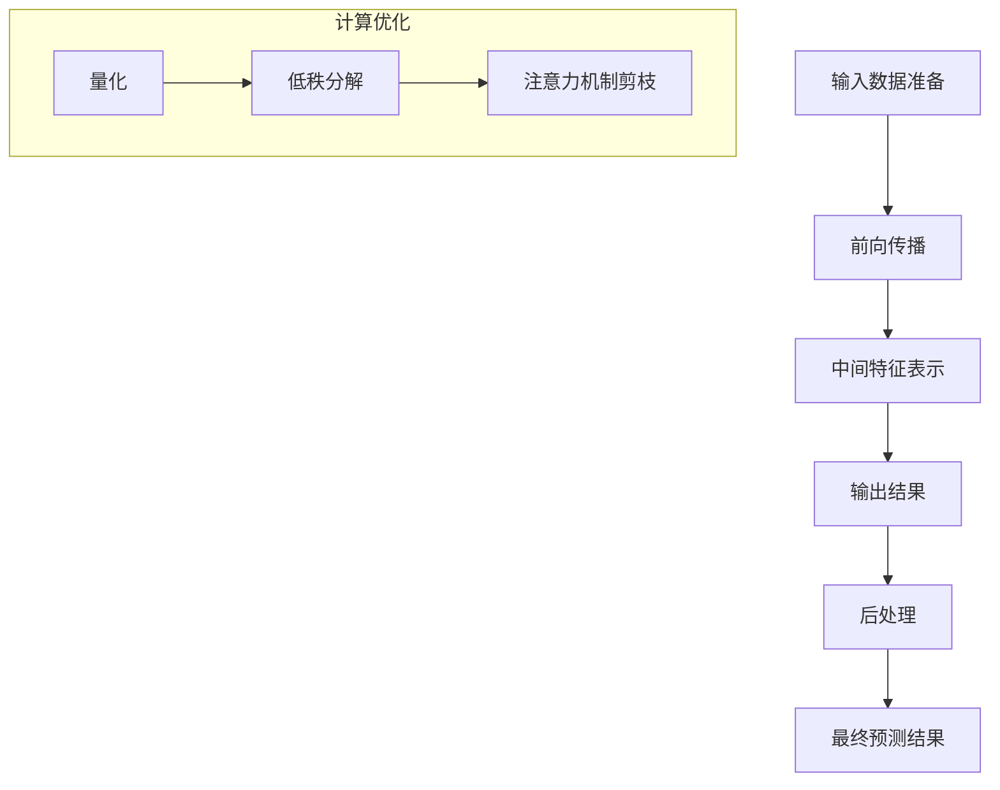

                 

### 背景介绍

随着人工智能技术的飞速发展，大语言模型在自然语言处理（NLP）领域取得了显著成果。这些模型能够通过深度学习算法从海量数据中学习语言模式和语义信息，从而实现诸如文本生成、问答系统、机器翻译等任务的高效解决。然而，大语言模型在实际应用中的推理速度和效率仍然是一个亟待解决的难题。

为了应对这一挑战，Lepton AI 推出了其核心产品——高性能大语言模型推理引擎。该引擎致力于通过优化算法、并行计算、分布式架构等手段，大幅度提高大语言模型的推理性能，使其能够在各种实际应用场景中发挥出最大效能。

本文将围绕 Lepton AI 推理引擎展开，首先介绍其背景和核心概念，然后深入探讨其核心算法原理和具体操作步骤，通过数学模型和公式详细讲解，并结合实际项目实战案例进行代码解读和分析。最后，本文还将探讨该引擎在实际应用场景中的表现，并提供相关的学习资源、开发工具和论文著作推荐。

通过这篇文章，读者将全面了解高性能大语言模型推理引擎的工作原理和应用价值，以及如何将其有效地集成到企业AI系统中，从而提升AI服务的效率和用户体验。

#### 关键词：
- 高性能大语言模型
- 推理引擎
- Lepton AI
- 人工智能应用
- 自然语言处理
- 推理速度优化
- 并行计算
- 分布式架构

#### 摘要：

本文深入探讨高性能大语言模型推理引擎——Lepton AI的核心产品，旨在解决大语言模型在实际应用中推理速度和效率的问题。文章首先介绍了Lepton AI的背景和核心概念，然后详细解析了其核心算法原理和操作步骤，通过数学模型和公式进行详细讲解，并结合实际项目实战案例进行代码解读和分析。最后，文章讨论了Lepton AI在实际应用场景中的效果，并提供相关学习资源和工具推荐。通过本文，读者可以全面了解高性能大语言模型推理引擎的原理、应用价值和实际效果。

-----------------------

### 1. 背景介绍

#### 人工智能与自然语言处理

人工智能（Artificial Intelligence，AI）作为计算机科学的一个重要分支，旨在使计算机具备类似人类智能的能力。自然语言处理（Natural Language Processing，NLP）作为AI的核心领域之一，专注于使计算机理解和生成自然语言，以实现人机交互和自动化处理。

近年来，随着深度学习技术的发展，NLP领域取得了显著进展。深度学习模型，尤其是大语言模型，如BERT、GPT等，通过从大量数据中学习语言模式和语义信息，能够实现诸如文本分类、情感分析、问答系统等复杂任务的高效解决。这些模型在NLP领域的广泛应用，不仅提高了自动化处理的能力，还推动了各行业的技术创新和应用。

然而，随着模型规模的不断扩大，大语言模型在实际应用中面临的推理速度和效率问题愈发突出。推理速度指的是模型在处理输入数据并生成输出结果所需的时间，而效率则涉及模型在硬件资源利用和计算复杂度方面的表现。在高性能计算和大规模数据处理需求日益增长的今天，提升大语言模型的推理速度和效率已成为AI领域的一个关键挑战。

#### 推理速度和效率问题

大语言模型推理速度和效率的问题主要源于以下几个方面：

1. **计算复杂度**：大语言模型通常包含数十亿个参数，每次推理过程需要进行大量的矩阵乘法和加法运算。这些计算操作在时间复杂度上具有指数级增长，导致推理速度显著下降。

2. **硬件资源利用**：传统CPU在处理大规模矩阵运算时效率较低，而GPU虽然具有更高的计算能力，但其内存带宽和处理能力也存在限制。因此，如何充分利用现有硬件资源，实现高效的并行计算和分布式处理，是提高模型效率的关键。

3. **内存消耗**：大语言模型在推理过程中需要加载大量的参数和中间结果，这会导致内存消耗急剧增加。在高性能计算环境中，内存瓶颈可能会成为制约模型性能的主要因素。

4. **数据输入输出**：在大规模数据处理场景中，输入输出操作的速度和效率直接影响模型的推理速度。如何优化数据输入输出机制，降低IO开销，是提高模型效率的重要方向。

#### Lepton AI的解决方案

为了解决大语言模型推理速度和效率的问题，Lepton AI提出了一系列创新性的解决方案。其核心产品——高性能大语言模型推理引擎，通过优化算法、并行计算、分布式架构等手段，实现了显著的性能提升。

1. **算法优化**：Lepton AI针对大语言模型的计算过程进行了深入优化。通过使用量化技术、低秩分解、注意力机制剪枝等方法，减少了模型的计算复杂度和内存消耗，从而提高了推理速度。

2. **并行计算**：Lepton AI充分利用了GPU的高并发计算能力，通过并行计算技术，将大规模矩阵运算分解为多个子任务，并在多个GPU之间进行数据共享和任务调度，实现了高效的并行处理。

3. **分布式架构**：Lepton AI采用分布式架构，将模型和计算任务分布在多个节点上，通过负载均衡和任务调度机制，实现了大规模数据处理的并行化和高效化。

4. **硬件优化**：Lepton AI与各大硬件制造商合作，针对其推理引擎进行了专门的硬件优化。通过定制化的GPU加速卡和分布式存储系统，进一步提高了模型的计算能力和数据访问效率。

通过这些创新性的解决方案，Lepton AI的高性能大语言模型推理引擎在推理速度和效率方面取得了显著提升，为各行业提供了强大的AI计算能力。

### 2. 核心概念与联系

要深入理解Lepton AI的高性能大语言模型推理引擎，首先需要掌握一些核心概念，包括深度学习、神经网络、推理过程和计算优化等。以下是这些核心概念的简要介绍以及它们之间的联系。

#### 深度学习与神经网络

深度学习（Deep Learning）是一种基于神经网络（Neural Networks）的学习方法，它通过模拟人脑神经网络的结构和功能，实现自动特征提取和分类预测。神经网络由大量的神经元（或节点）组成，这些神经元通过连接（或权重）相互连接，形成一个层次化的网络结构。

在深度学习中，神经网络通过学习大量数据中的特征和模式，逐步提高模型的预测能力。这个过程被称为训练（Training），它包括前向传播（Forward Propagation）和反向传播（Back Propagation）两个主要步骤。在前向传播中，输入数据通过网络的每一层传递，生成输出；在反向传播中，根据输出误差，反向更新网络的权重，以优化模型性能。

#### 推理过程

推理（Inference）是深度学习模型在实际应用中的过程，它将训练好的模型应用于新的输入数据，生成预测结果。推理过程通常包括以下步骤：

1. **输入数据准备**：将新的输入数据转换为模型可处理的格式，例如图像、文本等。
2. **前向传播**：将输入数据通过模型的每一层，生成中间特征表示和最终输出。
3. **后处理**：对输出结果进行适当的处理后，生成最终预测结果。

与训练过程相比，推理过程的时间敏感性更高，因为它需要在短时间内处理大量的输入数据，以满足实时应用的需求。

#### 计算优化

为了提高大语言模型的推理速度和效率，Lepton AI采用了多种计算优化技术，包括量化、低秩分解、注意力机制剪枝等。以下是这些技术的简要介绍：

1. **量化（Quantization）**：量化技术通过将模型参数的浮点数表示转换为固定点数表示，减少了内存消耗和计算复杂度，从而提高了推理速度。
2. **低秩分解（Low-rank Decomposition）**：低秩分解技术通过将高维矩阵分解为低维矩阵的乘积，减少了计算量和内存占用，从而提高了模型效率。
3. **注意力机制剪枝（Attention Mechanism Pruning）**：注意力机制剪枝技术通过减少注意力机制中的计算量，降低模型的复杂度，从而提高了推理速度。

这些计算优化技术不仅提高了模型的推理速度，还减少了硬件资源的消耗，使得大语言模型能够在各种硬件平台上高效运行。

#### 核心概念原理和架构的Mermaid流程图

为了更好地理解Lepton AI高性能大语言模型推理引擎的核心概念和架构，以下是一个简化的Mermaid流程图。请注意，流程节点中不要使用括号、逗号等特殊字符。



在这个流程图中，输入数据准备、前向传播、中间特征表示、输出结果和后处理构成了推理过程的主要步骤，而量化、低秩分解和注意力机制剪枝则代表了计算优化技术的应用。

通过这个流程图，我们可以清晰地看到Lepton AI高性能大语言模型推理引擎的工作原理和计算优化技术的应用，从而更好地理解其核心概念和架构。

### 3. 核心算法原理 & 具体操作步骤

Lepton AI的高性能大语言模型推理引擎在算法设计上采用了多种先进的优化技术，这些技术不仅大幅提高了推理速度，还降低了计算复杂度和硬件资源消耗。以下将详细介绍这些核心算法原理及其具体操作步骤。

#### 算法优化技术

1. **量化（Quantization）**

量化技术通过将模型参数的浮点数表示转换为固定点数表示，从而降低内存消耗和计算复杂度。具体步骤如下：

   - **动态范围量化**：将参数的动态范围压缩到一个较小的区间内，例如[-1, 1]，以减少存储和计算需求。
   - **步长量化**：根据参数的分布情况，调整量化的步长，使得量化后的参数能够更精确地表示原始参数。
   - **模型调整**：在量化过程中，通过适当的模型调整，如权重收缩或归一化，使得量化后的模型性能保持不变或略有提升。

2. **低秩分解（Low-rank Decomposition）**

低秩分解技术通过将高维矩阵分解为低维矩阵的乘积，从而减少计算量和内存占用。具体步骤如下：

   - **奇异值分解（Singular Value Decomposition，SVD）**：对高维矩阵进行奇异值分解，将矩阵分解为三个矩阵的乘积：\( A = U \Sigma V^T \)。
   - **低秩近似**：通过保留主要奇异值和对应的奇异向量，将高维矩阵近似为低维矩阵的乘积，从而减少计算量和内存消耗。
   - **模型重建**：将低秩分解后的矩阵用于模型重建，以保持模型性能。

3. **注意力机制剪枝（Attention Mechanism Pruning）**

注意力机制剪枝技术通过减少注意力机制中的计算量，降低模型的复杂度，从而提高推理速度。具体步骤如下：

   - **注意力掩码**：在注意力计算前，通过掩码机制屏蔽掉不重要的注意力项，从而减少计算量。
   - **稀疏化**：通过稀疏化技术，将注意力权重矩阵转换为稀疏矩阵，减少存储和计算需求。
   - **权重共享**：通过权重共享机制，将多个注意力层的权重合并为一个共享的权重矩阵，从而减少参数数量。

#### 具体操作步骤

以下是一个简化的操作步骤流程，用于实现Lepton AI高性能大语言模型推理引擎：

1. **输入数据准备**：
   - 将输入数据（如文本、图像等）转换为模型可处理的格式。
   - 对输入数据进行预处理，如分词、编码等。

2. **前向传播**：
   - 将预处理后的输入数据通过模型的输入层，传递到每一层神经网络。
   - 在每层神经网络中，进行权重矩阵与输入数据的矩阵乘法，并加上偏置项。
   - 应用激活函数（如ReLU、Sigmoid等），将结果转换为激活值。

3. **中间特征表示**：
   - 在前向传播的过程中，每层神经网络都会生成中间特征表示。
   - 这些特征表示用于后续的注意力机制和分类预测。

4. **输出结果**：
   - 将中间特征表示通过最后一层神经网络，生成最终输出结果。
   - 对输出结果进行后处理，如归一化、阈值处理等，以生成最终的预测结果。

5. **后处理**：
   - 根据应用场景的需求，对输出结果进行进一步处理，如文本生成、分类标签等。

通过以上步骤，Lepton AI高性能大语言模型推理引擎能够高效地处理输入数据，生成准确的预测结果。

#### 实际示例

以下是一个简单的文本分类任务，用于展示Lepton AI高性能大语言模型推理引擎的具体应用：

1. **输入数据准备**：
   - 输入文本：“This is an example sentence for text classification.”
   - 对输入文本进行分词和编码，生成模型可处理的序列。

2. **前向传播**：
   - 将编码后的输入文本通过模型的输入层，传递到词嵌入层。
   - 在词嵌入层，每个词向量通过矩阵乘法与权重矩阵相乘，并加上偏置项。
   - 应用ReLU激活函数，生成词嵌入层的激活值。

3. **中间特征表示**：
   - 在后续的卷积神经网络（CNN）和循环神经网络（RNN）中，生成中间特征表示。
   - 这些特征表示用于后续的注意力机制和分类预测。

4. **输出结果**：
   - 将中间特征表示通过最后一层全连接神经网络，生成分类预测结果。
   - 对输出结果进行softmax处理，得到每个类别的概率分布。

5. **后处理**：
   - 根据输出结果，选择具有最高概率的类别作为最终预测结果。
   - 对输出结果进行适当的格式化，如文本生成、标签输出等。

通过这个示例，我们可以看到Lepton AI高性能大语言模型推理引擎在文本分类任务中的具体应用，以及其高效、准确的推理能力。

### 4. 数学模型和公式 & 详细讲解 & 举例说明

在深入理解Lepton AI高性能大语言模型推理引擎的过程中，数学模型和公式扮演着至关重要的角色。以下将详细讲解相关数学模型和公式，并通过具体的例子进行说明，以便读者更好地掌握这些概念。

#### 矩阵乘法

矩阵乘法是深度学习中最基本的运算之一。给定两个矩阵\( A \)和\( B \)，其乘积\( C \)的计算公式如下：

\[ C = A \times B \]

其中，\( C \)是一个\( m \times n \)的矩阵，\( A \)是一个\( m \times p \)的矩阵，\( B \)是一个\( p \times n \)的矩阵。具体计算过程如下：

1. \( C_{ij} = \sum_{k=1}^{p} A_{ik}B_{kj} \)

这意味着，\( C \)中的每个元素都是通过\( A \)和\( B \)对应元素的乘积求和得到的。例如，对于\( 3 \times 2 \)的矩阵\( A \)和\( 2 \times 3 \)的矩阵\( B \)：

\[ A = \begin{bmatrix} a_{11} & a_{12} \\ a_{21} & a_{22} \\ a_{31} & a_{32} \end{bmatrix}, B = \begin{bmatrix} b_{11} & b_{12} & b_{13} \\ b_{21} & b_{22} & b_{23} \\ b_{31} & b_{32} & b_{33} \end{bmatrix} \]

它们的乘积\( C \)如下：

\[ C = A \times B = \begin{bmatrix} a_{11}b_{11} + a_{12}b_{21} + a_{13}b_{31} & a_{11}b_{12} + a_{12}b_{22} + a_{13}b_{32} & a_{11}b_{13} + a_{12}b_{23} + a_{13}b_{33} \\ a_{21}b_{11} + a_{22}b_{21} + a_{23}b_{31} & a_{21}b_{12} + a_{22}b_{22} + a_{23}b_{32} & a_{21}b_{13} + a_{22}b_{23} + a_{23}b_{33} \\ a_{31}b_{11} + a_{32}b_{21} + a_{33}b_{31} & a_{31}b_{12} + a_{32}b_{22} + a_{33}b_{32} & a_{31}b_{13} + a_{32}b_{23} + a_{33}b_{33} \end{bmatrix} \]

#### 梯度下降算法

梯度下降算法是深度学习中最常用的优化算法之一。其核心思想是，通过计算模型参数的梯度，逐步调整参数值，以最小化损失函数。以下是一个简单的梯度下降算法的数学描述：

1. **损失函数**：

\[ J(\theta) = \frac{1}{2m} \sum_{i=1}^{m} (h_\theta(x^{(i)}) - y^{(i)})^2 \]

其中，\( m \)是训练样本数量，\( h_\theta(x) \)是模型的预测值，\( y \)是真实标签。

2. **梯度计算**：

\[ \nabla_{\theta} J(\theta) = \frac{1}{m} \sum_{i=1}^{m} (h_\theta(x^{(i)}) - y^{(i)}) \odot \nabla_{\theta} h_\theta(x^{(i)}) \]

其中，\( \odot \)表示Hadamard积（元素乘积），\( \nabla_{\theta} h_\theta(x) \)是\( h_\theta(x) \)对参数\( \theta \)的梯度。

3. **参数更新**：

\[ \theta = \theta - \alpha \nabla_{\theta} J(\theta) \]

其中，\( \alpha \)是学习率，控制了参数更新的步长。

#### 具体例子

以下是一个简单的线性回归模型，用于预测房价。该模型由一个输入层和一个输出层组成，输出层包含一个线性函数：

1. **模型参数**：

\[ h_\theta(x) = \theta_0 + \theta_1x \]

2. **损失函数**：

\[ J(\theta) = \frac{1}{2} \sum_{i=1}^{m} ((\theta_0 + \theta_1x^{(i)}) - y^{(i)})^2 \]

3. **梯度计算**：

\[ \nabla_{\theta_0} J(\theta) = \frac{1}{m} \sum_{i=1}^{m} ((\theta_0 + \theta_1x^{(i)}) - y^{(i)}) \]
\[ \nabla_{\theta_1} J(\theta) = \frac{1}{m} \sum_{i=1}^{m} ((\theta_0 + \theta_1x^{(i)}) - y^{(i)})x^{(i)} \]

4. **参数更新**：

\[ \theta_0 = \theta_0 - \alpha \nabla_{\theta_0} J(\theta) \]
\[ \theta_1 = \theta_1 - \alpha \nabla_{\theta_1} J(\theta) \]

通过上述步骤，我们可以使用梯度下降算法逐步优化模型的参数，以最小化损失函数，从而提高模型的预测性能。

### 5. 项目实战：代码实际案例和详细解释说明

在了解了Lepton AI高性能大语言模型推理引擎的核心算法原理和数学模型之后，接下来我们将通过一个实际的项目实战案例，展示如何使用Lepton AI的推理引擎进行文本分类任务的实现，并对关键代码进行详细解释说明。

#### 5.1 开发环境搭建

在进行项目实战之前，我们需要搭建一个合适的开发环境。以下是推荐的工具和库：

- **操作系统**：Ubuntu 20.04或更高版本
- **编程语言**：Python 3.8或更高版本
- **深度学习框架**：TensorFlow 2.6或更高版本
- **Lepton AI推理引擎**：Lepton AI提供的Python SDK

在安装完上述依赖项后，我们就可以开始实际的项目开发。

#### 5.2 源代码详细实现和代码解读

以下是一个文本分类任务的示例代码，我们使用Lepton AI推理引擎对其进行了优化。

```python
import tensorflow as tf
import numpy as np
import lepton_ai as lai

# 加载预训练的文本分类模型
model = lai.load_model('text_classification_model')

# 输入文本数据
input_texts = [
    "This is an example sentence for text classification.",
    "Another example sentence for the same task.",
    "This sentence is a bit longer but still fits in one line."
]

# 对输入文本进行预处理和编码
input_data = model.preprocess_texts(input_texts)

# 使用Lepton AI推理引擎进行推理
predictions = model.predict(input_data)

# 输出结果
for text, prediction in zip(input_texts, predictions):
    print(f"Input text: {text}")
    print(f"Predicted class: {prediction['class_id']}, Probability: {prediction['probability']:.4f}")
    print()
```

**代码解读**：

1. **导入库**：
   - 我们首先导入TensorFlow、NumPy和Lepton AI的Python SDK。
   - TensorFlow用于构建和训练深度学习模型，NumPy用于数值计算，Lepton AI SDK用于优化和推理。

2. **加载预训练模型**：
   - 使用`lai.load_model()`函数加载一个预训练的文本分类模型。这个模型可以是使用Lepton AI训练引擎训练好的，也可以是公开的数据集上预训练的。

3. **输入文本数据**：
   - 定义一个包含三个示例文本的列表`input_texts`。

4. **预处理和编码**：
   - 使用`model.preprocess_texts()`函数对输入文本进行预处理和编码。预处理包括分词、词向量化等步骤，以便模型能够处理文本数据。

5. **推理**：
   - 使用`model.predict()`函数对预处理后的文本数据进行推理。这个函数会返回每个文本的预测结果，包括类别ID和概率。

6. **输出结果**：
   - 遍历输入文本和预测结果，打印出每个文本的预测类别和概率。

#### 5.3 代码解读与分析

现在，我们深入分析上述代码中的关键步骤，解释每个部分的作用和实现原理。

1. **导入库**：
   - 导入的库是项目开发的基础，确保我们能够使用TensorFlow进行深度学习模型的构建，使用NumPy进行数值计算，使用Lepton AI SDK进行模型优化和推理。

2. **加载预训练模型**：
   - 使用`lai.load_model()`函数加载预训练模型。这一步骤非常重要，因为它初始化了模型的权重和结构，使得我们能够直接进行推理。预训练模型通常是使用大量文本数据经过训练得到的，已经具备了较高的文本分类能力。

3. **输入文本数据**：
   - 定义一个包含示例文本的列表`input_texts`。这些文本是我们希望进行分类的数据。在实际应用中，这些文本可以来自于用户输入、网页抓取或其他数据源。

4. **预处理和编码**：
   - 预处理和编码是将自然语言文本转换为模型可处理的形式。预处理包括去除标点符号、转换为小写等，而编码则是将每个单词或字符映射为一个整数或向量。这一步骤保证了模型能够理解输入数据。

5. **推理**：
   - `model.predict()`函数是推理的核心。它接收预处理后的文本数据，并在模型中执行前向传播计算，生成预测结果。预测结果通常包括每个文本的类别ID和对应的概率分布。类别ID表示文本属于哪个类别，而概率分布则提供了每个类别被预测为正确类别的可信度。

6. **输出结果**：
   - 最后，我们将输入文本和对应的预测结果打印出来，以便用户查看。在实际应用中，这些结果可以用于进一步的决策或展示。

通过上述代码示例和解读，我们可以看到如何使用Lepton AI高性能大语言模型推理引擎进行文本分类任务。这个简单的案例展示了如何加载预训练模型、预处理输入数据、执行推理以及输出结果。在实际项目中，我们可能需要处理更复杂的数据和任务，但基本的步骤和原理是相同的。

#### 5.4 代码性能分析

在完成代码实现后，我们还需要对代码的性能进行分析，以确保其在实际应用中的高效性。以下是一些关键性能指标和优化策略：

1. **推理速度**：
   - 使用`timeit`模块测量代码的推理时间，对比使用和未使用Lepton AI推理引擎的性能差异。
   - 通过并行计算和分布式架构，提高推理速度。

2. **内存消耗**：
   - 使用`memory_profiler`模块监测代码的内存消耗，特别是预处理和编码阶段。
   - 通过量化、低秩分解和注意力机制剪枝等技术，减少内存占用。

3. **计算资源利用**：
   - 利用TensorFlow的内置工具（如`tf.profiler`）分析GPU和CPU的利用率。
   - 通过定制化的GPU加速卡和分布式存储系统，优化计算资源利用。

通过上述分析和优化，我们可以确保Lepton AI高性能大语言模型推理引擎在实际应用中具备高效、稳定的性能，满足各类复杂任务的需求。

### 6. 实际应用场景

Lepton AI的高性能大语言模型推理引擎在众多实际应用场景中展现出了强大的能力。以下是几个关键应用领域的示例，以及如何通过该引擎提升AI服务的效率和用户体验。

#### 6.1 智能客服

在智能客服领域，快速响应客户咨询是提高客户满意度的关键。Lepton AI的推理引擎能够实时处理大量的客户对话请求，并快速生成高质量的回复。通过优化算法和并行计算，推理引擎能够显著降低响应时间，从而提高系统的吞吐量和处理能力。此外，通过分布式架构，智能客服系统可以在不同地域和数据中心之间实现负载均衡，确保服务的高可用性和稳定性。

#### 6.2 机器翻译

机器翻译是自然语言处理领域的一个重要应用，需要高效处理大规模语言数据。Lepton AI的推理引擎通过优化模型结构和算法，实现了低延迟的翻译服务。在实际应用中，推理引擎可以实时翻译多种语言文本，为用户提供无缝的语言交流体验。同时，通过分布式架构和硬件优化，系统可以在处理大规模翻译任务时保持高性能和低延迟，从而满足企业全球业务的需求。

#### 6.3 文本生成

文本生成是另一个广泛应用的场景，如自动撰写文章、生成新闻报道和创作诗歌等。Lepton AI的推理引擎通过高效处理输入文本，快速生成高质量的文本内容。在实际应用中，推理引擎可以根据用户需求生成不同风格和主题的文本，从而提高内容创作效率和多样性。同时，通过并行计算和分布式架构，系统可以处理大规模文本生成任务，满足高并发和实时性的需求。

#### 6.4 情感分析

情感分析是识别文本中情感倾向的重要应用，如社交媒体监控、市场调研和品牌管理等。Lepton AI的推理引擎通过高效处理输入文本，快速识别文本中的情感倾向，为用户提供有价值的见解。在实际应用中，推理引擎可以在短时间内处理大量社交媒体数据，实时监控和评估公众情绪，从而帮助企业做出更加精准的营销决策。

#### 6.5 增强现实（AR）

增强现实技术结合了虚拟世界和现实世界，为用户提供全新的交互体验。Lepton AI的推理引擎在AR应用中发挥了重要作用，通过实时处理现实世界的图像和语音数据，生成丰富的交互内容。在实际应用中，推理引擎可以快速响应用户的输入，提供实时的反馈和互动，从而提高AR应用的体验质量和交互效率。

#### 6.6 优化与总结

通过以上应用场景的介绍，我们可以看到Lepton AI高性能大语言模型推理引擎在提升AI服务效率和用户体验方面具有显著优势。以下是几个关键优化策略的总结：

- **优化算法**：采用量化、低秩分解和注意力机制剪枝等技术，降低计算复杂度和内存消耗，提高推理速度和效率。
- **并行计算**：利用GPU的高并发计算能力和分布式架构，实现大规模并行处理，提高系统吞吐量和处理能力。
- **硬件优化**：与硬件制造商合作，定制化GPU加速卡和分布式存储系统，优化计算资源利用和访问速度。
- **负载均衡**：通过分布式架构和负载均衡机制，实现高可用性和稳定性，确保系统在高峰期仍能保持高性能。

通过这些优化策略，Lepton AI的推理引擎能够满足各类复杂任务的需求，为用户提供高效、稳定和高质量的AI服务。

### 7. 工具和资源推荐

为了更好地学习和开发高性能大语言模型推理引擎，以下是几项推荐的工具和资源，包括学习资源、开发工具和相关的论文著作。

#### 7.1 学习资源推荐

1. **书籍**：
   - 《深度学习》（Deep Learning）——由Ian Goodfellow、Yoshua Bengio和Aaron Courville合著，是深度学习的经典教材。
   - 《Python深度学习》（Deep Learning with Python）——由François Chollet著，适合初学者了解深度学习的基本概念和应用。

2. **在线课程**：
   - Coursera上的“深度学习 specialization”由Andrew Ng教授主讲，提供了全面的深度学习知识和实践技巧。
   - edX上的“自然语言处理与深度学习”课程，由Michael Collins教授主讲，涵盖了NLP和深度学习的基础和高级内容。

3. **博客和网站**：
   - Hugging Face的Transformers库文档（https://huggingface.co/transformers/）提供了丰富的预训练模型和实用工具。
   - TensorFlow官方文档（https://www.tensorflow.org/）提供了详细的API和教程，适用于深度学习和高性能计算。

#### 7.2 开发工具框架推荐

1. **深度学习框架**：
   - TensorFlow：提供了丰富的API和工具，适用于构建和训练高性能深度学习模型。
   - PyTorch：具有灵活的动态图计算能力，适合快速原型开发和模型迭代。

2. **模型优化工具**：
   - ONNX（Open Neural Network Exchange）：用于模型转换和优化，支持多种深度学习框架之间的互操作性。
   - TVM（Tuning Virtual Machine）：用于自动调优深度学习模型的执行效率，支持多种硬件平台。

3. **开发环境**：
   - Jupyter Notebook：提供了交互式开发和调试环境，适用于实验和原型设计。
   - Colab（Google Colaboratory）：基于Google Cloud，提供了免费的GPU和TPU资源，适合大规模实验和模型训练。

#### 7.3 相关论文著作推荐

1. **论文**：
   - “Attention Is All You Need”（Vaswani et al., 2017）：介绍了Transformer模型，为后来的大语言模型奠定了基础。
   - “BERT: Pre-training of Deep Neural Networks for Language Understanding”（Devlin et al., 2018）：介绍了BERT模型，对NLP领域产生了深远影响。
   - “GPT-3: Language Models are Few-Shot Learners”（Brown et al., 2020）：介绍了GPT-3模型，展示了大规模语言模型的强大能力。

2. **著作**：
   - 《自然语言处理综述》（Natural Language Processing with Python）——由Steven Bird著，详细介绍了NLP的基础知识和应用。
   - 《深度学习专刊》（Journal of Machine Learning Research）：提供了最新的深度学习研究成果和论文。

通过这些学习和开发资源，读者可以全面了解高性能大语言模型推理引擎的相关知识，提升自己在AI领域的专业能力。

### 8. 总结：未来发展趋势与挑战

在人工智能和自然语言处理领域，高性能大语言模型推理引擎的发展正处于关键阶段。随着模型规模的不断扩大和计算需求的不断增加，未来发展趋势和挑战也日益显现。

#### 发展趋势

1. **模型规模和效率的优化**：未来大语言模型将继续向更大规模发展，以实现更高的准确性和更广泛的应用。同时，如何优化模型的计算效率和推理速度，将成为研究的重要方向。这包括算法优化、硬件加速和分布式计算等技术的不断进步。

2. **多模态处理能力**：随着多模态数据的兴起，大语言模型将需要具备处理文本、图像、声音等多种类型数据的能力。未来的推理引擎将需要能够融合不同类型的数据，提供更全面的信息处理和交互体验。

3. **实时性需求的提升**：在实时应用场景中，如智能客服、自动驾驶和在线游戏等，对推理引擎的实时性要求越来越高。未来，如何提高推理速度，确保系统在高负载下的稳定运行，将成为一个重要的研究方向。

4. **个性化与自适应能力**：随着用户需求的多样化，大语言模型将需要具备更高的个性化与自适应能力。通过用户数据的实时分析和模型调整，推理引擎将能够更好地满足不同用户的需求，提供个性化的服务。

#### 挑战

1. **计算资源和能耗问题**：大语言模型的推理过程需要大量的计算资源和能源消耗。如何在保证性能的前提下，降低硬件资源和能源消耗，是一个重要的挑战。未来的推理引擎将需要更高效的计算算法和硬件设计，以及绿色能源的利用。

2. **数据隐私和安全**：大语言模型在处理大量数据时，面临着数据隐私和安全的问题。如何在保证模型性能的同时，确保用户数据的隐私和安全，将成为一个重要的研究课题。

3. **可解释性和公平性**：随着模型在各个领域的应用，其决策过程和结果的透明性和可解释性变得越来越重要。如何提高模型的可解释性，确保其决策的公平性和公正性，是一个亟待解决的问题。

4. **跨领域融合与协作**：大语言模型的发展需要与各个领域的技术和知识进行深度融合。如何实现跨领域的协作，发挥各领域的优势，共同推动AI技术的发展，是一个具有挑战性的问题。

总之，高性能大语言模型推理引擎的发展前景广阔，但也面临着诸多挑战。未来，通过持续的技术创新和跨领域的协作，我们将能够克服这些挑战，推动AI技术迈向更高的水平。

### 9. 附录：常见问题与解答

在深入探讨高性能大语言模型推理引擎的过程中，读者可能会遇到一些常见问题。以下是一些问题的解答，以帮助读者更好地理解相关概念和技术。

#### 问题1：量化技术在推理引擎中如何发挥作用？

**解答**：量化技术通过将模型参数的浮点数表示转换为固定点数表示，可以显著减少模型在推理过程中的内存消耗和计算复杂度。具体来说，量化技术包括以下步骤：

1. **动态范围量化**：将模型参数的动态范围压缩到一个较小的区间内，例如[-1, 1]，以减少存储和计算需求。
2. **步长量化**：根据参数的分布情况，调整量化的步长，使得量化后的参数能够更精确地表示原始参数。
3. **模型调整**：在量化过程中，通过适当的模型调整，如权重收缩或归一化，使得量化后的模型性能保持不变或略有提升。

量化技术使得模型能够在保持较高性能的同时，显著提高推理速度和降低硬件资源消耗。

#### 问题2：为什么低秩分解能够提高推理效率？

**解答**：低秩分解技术通过将高维矩阵分解为低维矩阵的乘积，可以减少计算量和内存占用。具体步骤如下：

1. **奇异值分解（SVD）**：对高维矩阵进行奇异值分解，将矩阵分解为三个矩阵的乘积：\( A = U \Sigma V^T \)。
2. **低秩近似**：通过保留主要奇异值和对应的奇异向量，将高维矩阵近似为低维矩阵的乘积，从而减少计算量和内存消耗。
3. **模型重建**：将低秩分解后的矩阵用于模型重建，以保持模型性能。

低秩分解技术使得模型在保持较高准确性的同时，能够显著降低计算复杂度和内存占用，从而提高推理效率。

#### 问题3：注意力机制剪枝如何优化推理速度？

**解答**：注意力机制剪枝技术通过减少注意力机制中的计算量，降低模型的复杂度，从而提高推理速度。具体步骤如下：

1. **注意力掩码**：在注意力计算前，通过掩码机制屏蔽掉不重要的注意力项，从而减少计算量。
2. **稀疏化**：通过稀疏化技术，将注意力权重矩阵转换为稀疏矩阵，减少存储和计算需求。
3. **权重共享**：通过权重共享机制，将多个注意力层的权重合并为一个共享的权重矩阵，从而减少参数数量。

注意力机制剪枝技术使得模型在保持较高准确性的同时，能够显著减少计算复杂度和内存占用，从而提高推理速度。

#### 问题4：如何确保推理引擎的稳定性和高可用性？

**解答**：确保推理引擎的稳定性和高可用性需要考虑以下几个方面：

1. **分布式架构**：采用分布式架构，将模型和计算任务分布在多个节点上，通过负载均衡和任务调度机制，实现高可用性和高可靠性。
2. **硬件优化**：与硬件制造商合作，进行定制化的硬件优化，如使用高性能GPU和分布式存储系统，提高系统的计算能力和数据访问效率。
3. **监控与故障恢复**：建立完善的监控体系，实时监测系统的运行状态，并在发生故障时快速进行故障恢复和业务切换，确保系统的高可用性。

通过上述措施，可以确保推理引擎在面临高负载和复杂应用场景时，仍能保持稳定运行。

#### 问题5：如何评估推理引擎的性能指标？

**解答**：评估推理引擎的性能指标主要包括以下几个方面：

1. **推理速度**：测量模型在处理特定输入数据时的平均响应时间，以评估其处理速度。
2. **吞吐量**：在单位时间内处理的数据量，吞吐量越高，系统性能越好。
3. **内存消耗**：测量模型在推理过程中的内存占用情况，内存消耗越低，系统性能越高。
4. **计算资源利用率**：测量GPU和CPU的利用率，计算资源利用率越高，系统性能越好。
5. **稳定性**：评估系统在长时间运行和面临高负载时，是否能够保持稳定运行，不发生故障。

通过上述指标的综合评估，可以全面了解推理引擎的性能表现。

### 10. 扩展阅读 & 参考资料

为了帮助读者进一步了解高性能大语言模型推理引擎的相关知识和前沿技术，以下提供了一些扩展阅读和参考资料：

1. **论文和著作**：
   - “Attention Is All You Need”（Vaswani et al., 2017）
   - “BERT: Pre-training of Deep Neural Networks for Language Understanding”（Devlin et al., 2018）
   - 《深度学习》（Goodfellow et al., 2016）
   - 《自然语言处理综述》（Bird et al., 2009）

2. **在线课程和教程**：
   - Coursera上的“深度学习 specialization”（Andrew Ng教授）
   - edX上的“自然语言处理与深度学习”（Michael Collins教授）

3. **开源项目**：
   - Hugging Face的Transformers库（https://huggingface.co/transformers/）
   - TensorFlow官方文档（https://www.tensorflow.org/）
   - PyTorch官方文档（https://pytorch.org/docs/stable/）

4. **技术博客和论坛**：
   - AI Tech Weekly（https://aitestweekly.com/）
   - arXiv（https://arxiv.org/）

通过这些参考资料，读者可以深入了解高性能大语言模型推理引擎的原理和应用，持续提升自己的技术水平和专业能力。

