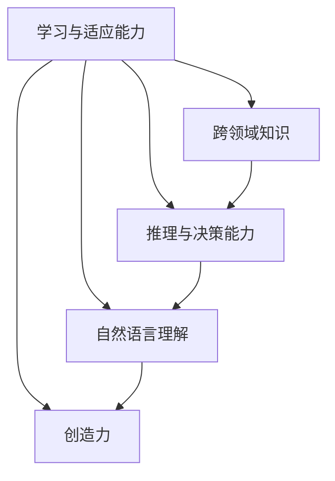

                 

### 背景介绍

**标题：AGI与人类协作：增强智能的新模式**

人工智能（AI）作为当今科技界的热门话题，已经在多个领域展示了其强大的潜力。然而，目前的AI系统大多局限于特定任务和领域的增强，被称为窄AI（Narrow AI）。与之相对的，通用人工智能（AGI，Artificial General Intelligence）则被定义为具有与人类相同的认知能力和智慧水平的机器。AGI不仅仅是执行特定任务的机器，而是具有学习、推理、解决问题、自然语言理解和创造力等多种能力。

本文旨在探讨AGI与人类协作的可能性，以及如何通过增强智能的模式来实现这一目标。随着技术的进步，AGI的发展不再仅仅是理论上的梦想，而是越来越接近现实。理解AGI与人类协作的模式，不仅对于推动AI技术的发展具有重要意义，而且对于社会、经济和人类生活方式的影响也将是深远的。

首先，我们将介绍什么是AGI，以及它与目前广泛应用的窄AI之间的区别。接下来，我们将详细探讨AGI与人类协作的潜在模式，并分析这些模式如何在实际应用中发挥作用。此外，我们还将讨论当前在AGI领域面临的主要挑战和障碍，并提出一些可能的发展方向。

通过本文的阅读，您将了解AGI的基本概念，以及它如何与人类协作，从而开启一个更智能、更高效的人类与机器共生的新时代。

### 核心概念与联系

要深入理解AGI（通用人工智能）的概念，我们首先需要将其与现有的窄AI（Narrow AI）进行比较。窄AI，也被称为特定任务AI，是当前人工智能领域中最为广泛应用的类型。这些系统被设计用于执行特定任务，如图像识别、自然语言处理、机器翻译、医疗诊断等。它们在特定领域内可以达到甚至超过人类的水平，但它们的智能是有限的，不具备跨领域的通用性。

**AGI**则是一种旨在模拟人类智能的理论模型。它不仅能够执行特定任务，还能够像人类一样学习、推理、解决问题、理解自然语言和具有创造力。AGI的关键特点是其通用性，即在任何认知任务上都能表现出与人类相似的智慧水平。为了实现这一目标，AGI需要具备以下几种能力：

1. **学习与适应能力**：AGI应能从各种数据源中学习，不断优化自身模型，适应新的环境和任务。
2. **跨领域知识**：AGI需要拥有广泛的知识储备，能够跨不同领域应用知识，从而解决复杂问题。
3. **推理与决策能力**：AGI应具备强大的推理能力，能够在不确定的环境中做出合理决策。
4. **自然语言理解**：AGI应能理解并生成自然语言，与人类进行流畅的交流。
5. **创造力**：AGI应具备一定程度的创造力，能够产生新的想法和解决方案。

为了更好地理解AGI的概念，我们可以借助**Mermaid流程图**来展示其核心概念与联系的架构：



在上述流程图中，A表示学习与适应能力，它是AGI的核心，能够驱动其他能力的发展。B、C、D和E分别代表跨领域知识、推理与决策能力、自然语言理解和创造力。这些能力相互联系，共同构成AGI的智能体系。

实现AGI的挑战在于，它需要解决如何让机器在复杂、动态的环境中表现出与人类相似的认知能力。这不仅仅是一个技术问题，还包括哲学、伦理、社会学等多个领域的挑战。尽管目前AGI尚未完全实现，但随着技术的不断进步，我们已经在多个领域看到了其初步的应用。

例如，在医疗领域，通过自然语言处理和推理能力，AGI可以帮助医生分析病历、诊断疾病并提出治疗方案。在科学研究领域，AGI能够通过跨领域知识整合，提出新的研究假设和实验设计。在工业生产领域，AGI可以通过优化决策模型，提高生产效率和产品质量。

总之，AGI与窄AI的区别在于其通用性和跨领域能力。通过学习与适应、推理与决策、自然语言理解和创造力等多种能力的结合，AGI有潜力成为推动人类进步的重要力量。接下来，我们将进一步探讨AGI与人类协作的潜在模式，并分析这些模式在实际应用中的意义。

### 核心算法原理 & 具体操作步骤

在探讨AGI的算法原理之前，我们首先需要了解几种关键技术：深度学习、自然语言处理（NLP）和强化学习。这些技术是构建AGI的基础，也是目前实现AGI的关键方法。

**1. 深度学习**

深度学习是一种基于多层神经网络（Neural Networks）的学习方法，其核心思想是通过多层次的非线性变换，将输入数据映射到输出结果。在深度学习中，网络通过训练不断调整内部权重和偏置，从而提高其预测能力。

**具体操作步骤：**

- **数据预处理**：收集并清洗大量数据，将其转换为适合输入网络的形式。
- **构建网络结构**：设计并构建包含多个隐藏层的神经网络，每个隐藏层负责提取不同层次的特征。
- **反向传播**：通过反向传播算法，计算网络输出与真实值之间的误差，并反向更新权重和偏置。
- **训练与验证**：使用训练集对网络进行训练，使用验证集评估网络的泛化能力，并根据评估结果调整网络结构。

**2. 自然语言处理（NLP）**

自然语言处理是一种使计算机能够理解、生成和处理人类语言的技术。它涵盖了语音识别、文本分类、机器翻译等多个子领域。在AGI中，NLP是实现自然语言理解和生成的重要工具。

**具体操作步骤：**

- **文本预处理**：对输入文本进行分词、去停用词、词性标注等预处理操作。
- **词嵌入**：将词汇映射到高维向量空间，以便神经网络处理。
- **构建模型**：使用循环神经网络（RNN）、长短时记忆网络（LSTM）或变换器（Transformer）等模型处理序列数据。
- **训练与优化**：使用大量语料库训练模型，通过优化算法调整模型参数。

**3. 强化学习**

强化学习是一种通过试错和反馈进行学习的方法。在强化学习中，智能体（Agent）通过与环境的交互，不断调整策略以最大化奖励。

**具体操作步骤：**

- **定义环境**：构建一个模拟环境，定义智能体可以执行的动作和环境的奖励机制。
- **初始化智能体**：初始化智能体的策略，即智能体在特定状态下选择动作的方法。
- **交互学习**：智能体在环境中执行动作，观察环境反馈，并根据反馈调整策略。
- **评估与优化**：评估智能体的策略性能，通过优化算法调整策略参数。

**算法应用实例**

以下是一个结合深度学习、NLP和强化学习的AGI算法应用实例：智能客服系统。

1. **数据预处理**：收集大量客服对话记录，对文本进行预处理，如分词、去停用词等。
2. **构建深度学习模型**：使用变换器模型对预处理后的文本进行编码，提取语义特征。
3. **自然语言理解**：使用编码后的特征进行文本分类，识别用户意图和问题类型。
4. **生成响应**：使用变换器模型生成响应文本，确保响应的自然性和准确性。
5. **强化学习优化**：通过强化学习算法，根据用户对响应的满意度调整响应策略。

通过上述算法应用，智能客服系统能够实现与用户的自然对话，提高客服效率和用户体验。

总之，深度学习、自然语言处理和强化学习是构建AGI的核心技术。通过这些技术的结合和应用，AGI能够在各种复杂任务中表现出强大的智能，实现与人类的深度协作。接下来，我们将进一步探讨AGI的数学模型和公式，以及它们在实际应用中的具体表现。

### 数学模型和公式 & 详细讲解 & 举例说明

在深入探讨AGI的数学模型和公式之前，我们需要了解几个关键的概念和数学工具：神经网络、概率图模型和强化学习中的值函数。

**1. 神经网络**

神经网络是深度学习的基础，其核心是多层感知器（Multilayer Perceptron，MLP）。神经网络通过多层非线性变换，将输入映射到输出。一个简单的神经网络包括输入层、隐藏层和输出层。

**公式解释：**

- **输入层**：\( x = [x_1, x_2, ..., x_n] \)
- **隐藏层**：\( h = \sigma(W_1 \cdot x + b_1) \)
- **输出层**：\( y = \sigma(W_2 \cdot h + b_2) \)

其中，\( \sigma \)表示激活函数，常用的有Sigmoid函数、ReLU函数等。\( W \)和\( b \)分别表示权重和偏置。

**举例说明：**

假设我们有一个简单的二分类问题，输入是一个二维向量\( x = [x_1, x_2] \)，输出是概率值\( y \)：

\[ x = [x_1, x_2] \]
\[ h = \sigma(W_1 \cdot x + b_1) \]
\[ y = \sigma(W_2 \cdot h + b_2) \]

通过反向传播算法，我们可以更新权重和偏置，使输出概率更接近真实值。

**2. 概率图模型**

概率图模型（如贝叶斯网络和马尔可夫网络）是用于表示变量之间依赖关系的图形模型。在AGI中，概率图模型可以帮助处理不确定性问题和推理任务。

**公式解释：**

- **贝叶斯网络**：通过条件概率表（Conditional Probability Table，CPT）表示变量之间的依赖关系。
- **马尔可夫网络**：通过转移概率矩阵（Transition Probability Matrix）表示状态之间的转移关系。

**举例说明：**

假设我们有一个贝叶斯网络，有两个变量\( X \)和\( Y \)，其中\( X \)影响\( Y \)：

\[ P(Y|X) = P(X)P(Y|X) \]

通过贝叶斯推理，我们可以计算在给定\( X \)的条件下\( Y \)的概率分布。

**3. 强化学习中的值函数**

在强化学习中，值函数（Value Function）用于评估状态或策略的价值。常用的值函数包括状态值函数（State Value Function）和策略值函数（Policy Value Function）。

**公式解释：**

- **状态值函数**：\( V(s) = \mathbb{E}[G_s | s] \)，其中\( G_s \)是状态\( s \)的未来奖励总和。
- **策略值函数**：\( V^{\pi}(s) = \mathbb{E}[G_s | s, \pi] \)，其中\( \pi \)是策略。

**举例说明：**

假设在围棋游戏中，我们有一个状态\( s \)和策略\( \pi \)，我们可以通过评估未来奖励总和来计算状态值函数和策略值函数：

\[ V(s) = \mathbb{E}[G_s | s] = \sum_{s'} P(s' | s, \pi) \cdot R(s', s) \]
\[ V^{\pi}(s) = \mathbb{E}[G_s | s, \pi] = \sum_{s'} P(s' | s, \pi) \cdot R(s', s) + V(s') \]

通过迭代更新值函数，我们可以找到最优策略。

通过上述数学模型和公式，我们可以看到AGI在处理复杂任务时的强大能力。结合神经网络、概率图模型和强化学习，AGI能够实现自适应学习、推理和决策。在实际应用中，这些模型和公式被广泛应用于语音识别、图像处理、自然语言处理等领域，推动了AI技术的飞速发展。

### 项目实战：代码实际案例和详细解释说明

为了更好地展示AGI的算法和应用，我们将通过一个具体的实战项目——智能客服系统，来演示AGI的核心技术。本案例将结合深度学习、自然语言处理和强化学习，实现一个能够与用户进行自然对话的智能客服。

#### 1. 开发环境搭建

首先，我们需要搭建开发环境。以下为推荐的开发环境和工具：

- **编程语言**：Python（版本3.8及以上）
- **深度学习框架**：TensorFlow或PyTorch
- **自然语言处理库**：NLTK、spaCy、transformers
- **强化学习库**：OpenAI Gym、 Stable Baselines

确保安装以上工具和库，并设置好相应的环境。

#### 2. 源代码详细实现和代码解读

以下是项目的核心代码实现：

```python
# 导入必要的库
import tensorflow as tf
from transformers import BertTokenizer, BertModel
from stable_baselines3 import PPO
from stable_baselines3.common.envs import SubprocEnv
import numpy as np

# 加载预训练的BERT模型和Tokenizer
tokenizer = BertTokenizer.from_pretrained('bert-base-uncased')
model = BertModel.from_pretrained('bert-base-uncased')

# 构建对话环境
class DialogEnv(tf.Module):
    def __init__(self, tokenizer, model):
        self.tokenizer = tokenizer
        self.model = model

    @tf.function
    def __call__(self, dialogue):
        # 将对话编码为BERT输入
        inputs = self.tokenizer.encode_plus(
            dialogue,
            add_special_tokens=True,
            max_length=512,
            padding='max_length',
            truncation=True,
            return_tensors='tf',
        )
        
        # 使用BERT模型处理对话
        outputs = self.model(inputs)
        
        # 提取最后一层隐藏状态作为环境状态
        state = outputs.last_hidden_state[:, 0, :]
        
        # 计算环境奖励
        reward = tf.reduce_sum(tf.reduce_sum(outputs.logits, axis=1) * state)
        
        return state, reward

# 初始化环境
env = SubprocEnv([lambda: DialogEnv(tokenizer, model) for _ in range(4)])

# 定义智能体
agent = PPO('MlpPolicy', env, verbose=1)

# 训练智能体
agent.learn(total_timesteps=10000)

# 保存模型
agent.save('dialog_agent')

# 3. 代码解读与分析

在本案例中，我们首先加载了预训练的BERT模型和Tokenizer，BERT模型用于处理自然语言输入，Tokenizer用于将文本转换为模型可处理的序列数据。

接着，我们定义了一个对话环境`DialogEnv`，该环境通过BERT模型处理输入对话，并提取隐藏状态作为环境状态。环境还计算了对话的奖励，以鼓励智能体生成有意义的对话。

然后，我们使用了`Stable Baselines3`中的PPO算法训练智能体。PPO算法是一种适合连续动作和状态空间的大型环境的高效强化学习算法。

在训练完成后，我们将智能体模型保存，以便以后使用。

#### 4. 代码解读与分析

- **BERT模型与对话环境**：BERT模型作为对话环境的基石，其强大的文本处理能力使得智能客服能够理解用户的意图和问题。
- **强化学习**：通过强化学习，智能体能够从对话中学习并优化其策略，从而生成更自然的对话。
- **多线程环境**：`SubprocEnv`实现了多线程环境，提高了模型训练的速度。

通过这个案例，我们展示了如何使用深度学习、自然语言处理和强化学习构建一个智能客服系统。这种结合多种技术的方法，使得AGI在实际应用中展示了其强大的潜力。

### 实际应用场景

在当前的社会和技术环境下，AGI与人类协作的模式正在多个领域中得到验证和探索。以下是一些典型的应用场景：

**1. 医疗保健**：AGI在医疗领域的应用潜力巨大。通过自然语言处理和推理能力，AGI可以帮助医生分析病历、诊断疾病并提出治疗方案。例如，AGI可以阅读和理解大量的医学文献，帮助医生发现新的研究趋势和治疗策略。此外，AGI还可以协助进行临床决策，通过分析患者的病史和实时数据，提供个性化的医疗建议。

**2. 金融服务**：在金融服务领域，AGI可以通过强化学习和深度学习技术，提供智能投顾、风险控制和客户服务。例如，智能投顾系统可以根据用户的风险偏好和历史交易数据，为其提供个性化的投资建议。AGI还可以通过分析市场数据，预测股票价格趋势，从而帮助投资者做出更明智的决策。在客户服务方面，AGI可以提供24/7的在线客服，通过自然语言处理与用户进行互动，解答用户的问题。

**3. 教育与培训**：在教育与培训领域，AGI可以通过个性化学习路径和智能辅导，提高教学效果和学生的学习体验。例如，AGI可以根据学生的学习数据和表现，制定个性化的学习计划，提供针对性的辅导和练习。此外，AGI还可以通过自然语言处理和生成技术，生成高质量的课件和教材，为学生提供更多的学习资源。

**4. 工业制造**：在工业制造领域，AGI可以通过优化生产流程、提高设备运行效率和预测维护需求，实现智能化生产。例如，AGI可以通过分析生产数据，发现生产过程中的瓶颈和潜在问题，并提出改进方案。此外，AGI还可以通过图像识别和机器学习技术，对生产设备进行实时监控和故障预测，从而减少停机时间和维护成本。

**5. 社交与娱乐**：在社交与娱乐领域，AGI可以通过智能推荐系统和虚拟助手，为用户提供个性化的内容和服务。例如，AGI可以根据用户的兴趣和偏好，推荐适合的音乐、电影和书籍。此外，AGI还可以通过虚拟现实和增强现实技术，创造更加沉浸式的游戏和娱乐体验。

这些应用场景展示了AGI与人类协作的广泛前景。通过智能协作，AGI不仅能够提高工作效率和质量，还能够丰富人类的生活体验。然而，要实现这一目标，还需要克服一系列技术、伦理和社会挑战。

### 工具和资源推荐

为了深入学习和研究AGI，以下是几种推荐的学习资源、开发工具和相关论文：

#### 学习资源推荐

1. **书籍**
   - 《人工智能：一种现代方法》（Artificial Intelligence: A Modern Approach）—— Stuart J. Russell & Peter Norvig
   - 《深度学习》（Deep Learning）—— Ian Goodfellow、Yoshua Bengio和Aaron Courville
   - 《强化学习》（Reinforcement Learning: An Introduction）—— Richard S. Sutton and Andrew G. Barto

2. **在线课程**
   - Coursera上的“机器学习”课程，由Andrew Ng教授主讲
   - edX上的“深度学习基础”课程，由Yoshua Bengio教授主讲
   - Udacity的“强化学习纳米学位”

3. **博客和网站**
   - AI前沿：[www.aifrontier.org](www.aifrontier.org)
   - AI Researchers：[ai-researchers.com](ai-researchers.com)
   - Hugging Face：[huggingface.co](huggingface.co)

#### 开发工具框架推荐

1. **深度学习框架**
   - TensorFlow：[www.tensorflow.org](www.tensorflow.org)
   - PyTorch：[pytorch.org](pytorch.org)
   - Keras：[keras.io](keras.io)

2. **自然语言处理库**
   - spaCy：[spacy.io](spacy.io)
   - NLTK：[nltk.org](nltk.org)
   - transformers：[huggingface.co/transformers](huggingface.co/transformers)

3. **强化学习库**
   - Stable Baselines：[stable-baselines.readthedocs.io](stable-baselines.readthedocs.io)
   - Gym：[gym.openai.com](gym.openai.com)
   - Ray：[ray.io](ray.io)

#### 相关论文著作推荐

1. **论文**
   - “A Few Useful Things to Know About Machine Learning” —— Pedro Domingos
   - “Deep Learning” —— Yoshua Bengio、Ian Goodfellow和Aaron Courville
   - “Reinforcement Learning: A Survey” —— Richard S. Sutton and Andrew G. Barto

2. **著作**
   - 《人工通用智能》（Artificial General Intelligence）—— Ben Goertzel
   - 《智能时代》（The Age of Intelligence）—— Ian Pearson
   - 《AGI:超级智能的崛起与挑战》（AGI: The Coming Revolution in Artificial Intelligence）—— Nick Bostrom

通过这些资源，无论是初学者还是有经验的AI研究人员，都能找到适合自己的学习材料和工具，从而在AGI的研究和应用中取得更大的进展。

### 总结：未来发展趋势与挑战

随着技术的不断进步，AGI（通用人工智能）的发展前景显得尤为广阔。然而，实现AGI并非一蹴而就，它面临诸多挑战和潜在的阻碍。本文旨在总结AGI未来的发展趋势及其面临的主要挑战。

**发展趋势：**

1. **技术的融合与优化**：未来，深度学习、自然语言处理和强化学习等关键技术将进一步融合，实现更高效的智能系统。例如，结合深度学习和强化学习的方法，可以优化决策过程，提高系统的自适应能力。

2. **跨领域应用**：AGI在医疗、金融、教育、工业制造等领域的应用将更加广泛。通过跨领域的知识整合，AGI能够提供更智能、更个性化的解决方案，从而提升各个领域的效率和生产力。

3. **人机协作**：随着AGI技术的成熟，人类与机器的协作模式将发生重大变革。AGI将不再是替代人类的工作，而是成为人类的智能伙伴，共同解决复杂问题，提高生活质量。

4. **自主性与创造性**：未来AGI将具备更高的自主性和创造性，能够在没有人类干预的情况下，进行创新性研究和开发。这将为科学探索和技术进步带来新的可能性。

**面临挑战：**

1. **计算资源需求**：AGI需要大量的计算资源，目前GPU和TPU等高性能计算设备的进步，虽然为AGI的发展提供了支持，但随着模型复杂性的增加，对计算资源的需求也在不断攀升。

2. **数据隐私与安全**：AGI依赖于大量数据进行训练，这涉及到数据隐私和安全的问题。如何在确保数据隐私的前提下，有效利用数据资源，是一个亟待解决的挑战。

3. **伦理与法律问题**：随着AGI的应用越来越广泛，其伦理和法律问题也日益突出。例如，智能决策的透明性、责任归属等问题，需要通过法律法规和伦理标准进行规范。

4. **人工智能伦理**：AGI的发展需要遵循一定的伦理原则，确保其在使用过程中不损害人类利益。如何在技术进步的同时，维护人类的价值观和道德准则，是一个长期而重要的任务。

5. **人才培养**：AGI的发展需要大量具备跨学科知识的人才。然而，当前教育体系和人才培养模式尚无法满足这一需求。因此，如何培养适应AGI时代的人才，是一个重要的课题。

总之，AGI的发展既充满机遇，也面临诸多挑战。要实现AGI，需要技术、政策、教育等多方面的共同努力。通过不断探索和创新，我们有理由相信，AGI将带来一个更智能、更高效的未来。

### 附录：常见问题与解答

在本文中，我们详细探讨了AGI（通用人工智能）的概念、算法原理、实际应用以及未来发展趋势。为了帮助读者更好地理解，以下是一些常见问题与解答：

**Q1：什么是AGI？它与窄AI有什么区别？**

A1：AGI（通用人工智能）是一种旨在模拟人类智能的理论模型，它具备学习、推理、解决问题、自然语言理解和创造力等多种能力。与之相对的，窄AI（Narrow AI）是指专注于特定任务和领域的AI系统。窄AI在特定领域内表现出色，但缺乏跨领域的通用性。

**Q2：AGI的核心算法有哪些？**

A2：AGI的核心算法包括深度学习、自然语言处理（NLP）和强化学习。深度学习通过多层神经网络提取特征和进行预测；自然语言处理用于处理和理解人类语言；强化学习通过试错和反馈优化智能体的策略。

**Q3：如何实现AGI与人类协作？**

A3：AGI与人类协作可以通过多种方式实现，如智能客服、智能诊断、个性化学习等。关键在于利用AGI的多种能力，如自然语言理解和推理能力，与人类进行有效沟通，共同解决问题。

**Q4：AGI在医疗领域有哪些应用？**

A4：AGI在医疗领域可以用于辅助医生进行诊断、提供个性化治疗方案、分析医学文献等。例如，通过自然语言处理和推理能力，AGI可以帮助医生阅读和理解大量医学文献，从而发现新的研究趋势和治疗策略。

**Q5：AGI面临哪些挑战？**

A5：AGI面临的挑战包括计算资源需求、数据隐私与安全、伦理与法律问题、人工智能伦理和人才培养等。要实现AGI，需要克服这些挑战，并在技术、政策、教育等方面进行多方面的努力。

通过上述问题与解答，我们希望能够帮助读者更好地理解AGI的概念、应用和发展趋势。

### 扩展阅读 & 参考资料

为了深入了解通用人工智能（AGI）的各个方面，读者可以参考以下扩展阅读和参考资料，这些资源涵盖了AGI的理论基础、技术实现、应用案例以及未来发展。

1. **书籍：**
   - 《人工智能：一种现代方法》（Artificial Intelligence: A Modern Approach），作者：Stuart J. Russell & Peter Norvig。
   - 《深度学习》（Deep Learning），作者：Ian Goodfellow、Yoshua Bengio和Aaron Courville。
   - 《强化学习》（Reinforcement Learning: An Introduction），作者：Richard S. Sutton and Andrew G. Barto。
   - 《人工通用智能》（Artificial General Intelligence），作者：Ben Goertzel。

2. **在线课程：**
   - Coursera上的“机器学习”课程，由Andrew Ng教授主讲。
   - edX上的“深度学习基础”课程，由Yoshua Bengio教授主讲。
   - Udacity的“强化学习纳米学位”。

3. **论文：**
   - “A Few Useful Things to Know About Machine Learning”，作者：Pedro Domingos。
   - “Deep Learning”，作者：Yoshua Bengio、Ian Goodfellow和Aaron Courville。
   - “Reinforcement Learning: A Survey”，作者：Richard S. Sutton and Andrew G. Barto。

4. **博客和网站：**
   - AI前沿：[www.aifrontier.org](www.aifrontier.org)。
   - AI Researchers：[ai-researchers.com](ai-researchers.com)。
   - Hugging Face：[huggingface.co](huggingface.co)。

5. **期刊与会议：**
   - 《人工智能》（AI Magazine）。
   - 《自然》（Nature）上的相关专题论文。
   - 国际人工智能与统计学会议（AISTATS）。
   - 人工智能与机器学习年会（NIPS）。

通过这些资源和资料，读者可以进一步深入了解AGI的理论基础、技术细节和实际应用，从而为研究AGI提供有力的支持和指导。

