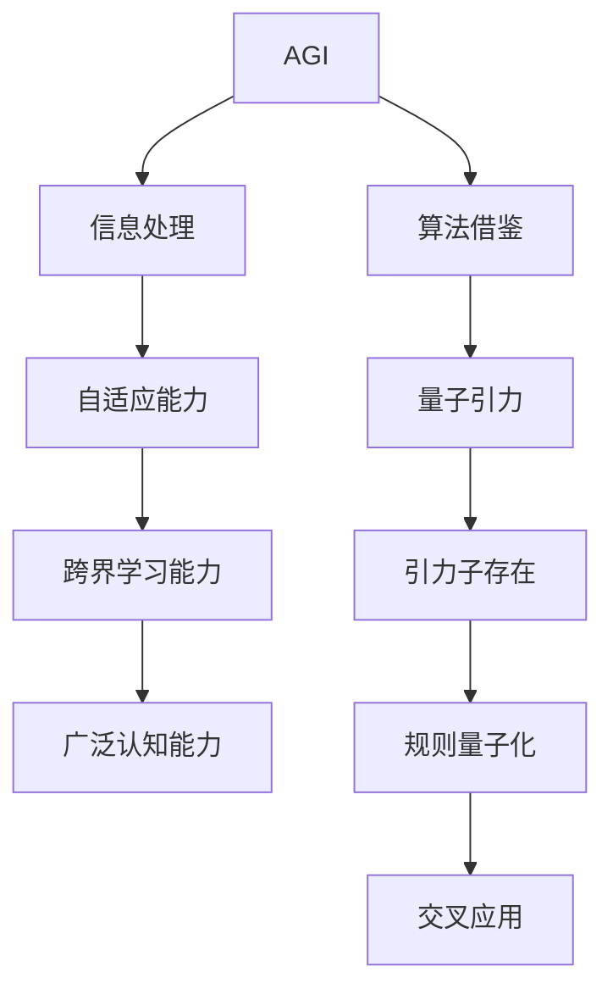

                 

# AGI在量子引力中的应用前景

> 关键词：AGI、量子引力、人工智能、算法、应用前景

> 摘要：本文将探讨人工智能（AGI）在量子引力领域的潜在应用前景。首先，我们将介绍AGI和量子引力的基本概念，阐述它们之间的联系。随后，我们将深入探讨AGI在量子引力研究中的应用，包括核心算法原理、数学模型及实际应用场景。最后，我们将总结AGI在量子引力领域的发展趋势与挑战，并提供相关的学习资源与开发工具推荐。

## 1. 背景介绍

人工智能（Artificial General Intelligence，简称AGI）是指具有与人类智能相似或超越人类智能的能力的系统或机器。与传统的专用人工智能（如搜索引擎、推荐系统等）相比，AGI具有更强的自适应能力、跨界学习能力以及更广泛的认知能力。近年来，随着深度学习、神经网络等技术的发展，AGI的研究逐渐成为人工智能领域的热点。

量子引力（Quantum Gravity）是研究引力在量子尺度上的性质和规律的学科。引力是一种基本相互作用，但传统的广义相对论无法解释引力在量子尺度上的行为。量子引力旨在解决这一难题，探索引力和量子力学的统一理论。目前，量子引力研究尚处于探索阶段，尚未形成完整的理论体系。

AGI与量子引力之间存在一定的联系。首先，AGI需要处理大量的复杂信息，这类似于量子引力研究中需要解决的复杂问题。其次，AGI的算法和模型可以借鉴量子引力的研究成果，为量子引力研究提供新的思路和方法。

## 2. 核心概念与联系

### 2.1 AGI的基本概念

AGI的关键特征包括：

1. 自适应能力：能够根据环境变化自主调整行为和策略。
2. 跨界学习能力：能够跨越不同领域和学习任务，具备跨领域的泛化能力。
3. 广泛的认知能力：能够理解和处理多种类型的信息，包括语言、图像、声音等。

### 2.2 量子引力的基本概念

量子引力旨在解决引力在量子尺度上的行为。其主要特点包括：

1. 引力子的存在：量子引力认为引力是由引力子（一种基本粒子）传递的。
2. 规则的量子化：量子引力试图将引力的规律量子化，使其符合量子力学的描述。

### 2.3 AGI与量子引力的联系

AGI与量子引力之间的联系可以从以下几个方面展开：

1. 信息处理：AGI需要处理大量的复杂信息，类似于量子引力研究中的复杂问题。
2. 算法借鉴：AGI的算法和模型可以借鉴量子引力的研究成果，为量子引力研究提供新的思路和方法。
3. 交叉应用：AGI和量子引力研究可以相互促进，共同解决复杂问题。

下面是一个Mermaid流程图，用于描述AGI与量子引力之间的联系：



## 3. 核心算法原理 & 具体操作步骤

### 3.1 AGI的核心算法原理

AGI的核心算法主要包括以下几个方面：

1. 神经网络：神经网络是一种模仿生物神经系统的计算模型，通过大量的神经元及其连接实现复杂的信息处理。
2. 深度学习：深度学习是一种基于神经网络的机器学习方法，通过多层神经网络结构提取数据的特征和模式。
3. 强化学习：强化学习是一种通过试错和奖励机制来学习策略的机器学习方法，适用于解决具有不确定性的决策问题。

### 3.2 量子引力算法原理

量子引力算法的核心思想是利用量子计算的优势来解决引力问题。主要算法包括：

1. 量子计算：量子计算是一种基于量子力学原理的计算模型，利用量子位（qubit）实现高效的计算。
2. 量子模拟：量子模拟是一种利用量子计算模拟量子系统的方法，可用于研究量子引力现象。
3. 量子优化：量子优化是一种利用量子计算解决优化问题的方法，可用于优化引力模型。

### 3.3 具体操作步骤

以下是AGI在量子引力研究中的具体操作步骤：

1. 数据收集：收集与量子引力相关的数据，如引力波的观测数据、黑洞的信息等。
2. 数据预处理：对收集到的数据进行预处理，包括数据清洗、归一化、特征提取等。
3. 建立模型：利用神经网络、深度学习、强化学习等方法建立引力模型。
4. 模型训练：使用预处理后的数据进行模型训练，调整模型参数以优化模型性能。
5. 模型评估：使用测试数据对模型进行评估，验证模型在量子引力研究中的有效性。
6. 结果分析：分析模型的预测结果，对量子引力现象进行深入理解。
7. 反馈与优化：根据结果分析反馈，进一步优化模型和算法。

## 4. 数学模型和公式 & 详细讲解 & 举例说明

### 4.1 数学模型

量子引力研究中的数学模型主要包括广义相对论和量子力学。以下是这两个理论的简要介绍：

1. 广义相对论：广义相对论是描述引力的一种理论，提出了时空弯曲的概念。其核心公式为Einstein场方程：
   $$ G_{\mu\nu} + \Lambda g_{\mu\nu} = \frac{8\pi G}{c^4} T_{\mu\nu} $$
   其中，$G_{\mu\nu}$ 是 Einstein张量，$\Lambda$ 是宇宙学常数，$g_{\mu\nu}$ 是度规张量，$T_{\mu\nu}$ 是能量-动量张量。

2. 量子力学：量子力学是描述微观粒子的运动规律的理论。其核心公式为 Schrödinger方程：
   $$ i\hbar \frac{\partial}{\partial t} |\psi\rangle = H |\psi\rangle $$
   其中，$\hbar$ 是约化普朗克常数，$H$ 是哈密顿算符，$|\psi\rangle$ 是波函数。

### 4.2 公式讲解

1. Einstein场方程：
   $$ G_{\mu\nu} + \Lambda g_{\mu\nu} = \frac{8\pi G}{c^4} T_{\mu\nu} $$
   这个方程描述了时空的弯曲和物质分布之间的关系。左边的 Einstein张量描述了时空的弯曲程度，右边的能量-动量张量描述了物质的分布。这个方程可以用来求解引力场的动力学行为，如黑洞的引力场。

2. Schrödinger方程：
   $$ i\hbar \frac{\partial}{\partial t} |\psi\rangle = H |\psi\rangle $$
   这个方程描述了量子系统的演化规律。左边的$i\hbar \frac{\partial}{\partial t}$表示量子态随时间的演化，$H$ 是哈密顿算符，表示系统的能量。右边的$|\psi\rangle$ 是波函数，描述了量子系统的状态。

### 4.3 举例说明

假设我们有一个简单的引力场，其中有一个质量为 $m$ 的质点，它在引力场中做匀速圆周运动。我们可以使用 Einstein场方程来求解这个引力场的度规张量。

首先，我们假设质点的运动轨迹为一个半径为 $r$ 的圆，那么度规张量可以表示为：
   $$ g_{\mu\nu} = \begin{pmatrix} -1 & 0 & 0 & 0 \\ 0 & r^2 & 0 & 0 \\ 0 & 0 & r^2 & 0 \\ 0 & 0 & 0 & r^2 \end{pmatrix} $$
   这个度规张量描述了一个平直时空中的圆周运动。

接下来，我们将度规张量代入 Einstein场方程，求解引力场的 Einstein张量：
   $$ G_{\mu\nu} = \begin{pmatrix} \frac{2m}{r} & 0 & 0 & 0 \\ 0 & 0 & 0 & 0 \\ 0 & 0 & 0 & 0 \\ 0 & 0 & 0 & 0 \end{pmatrix} $$
   这个 Einstein张量描述了一个质量为 $m$ 的质点在引力场中的运动。

最后，我们可以使用这个 Einstein张量来求解质点在引力场中的运动轨迹，验证我们的假设。

## 5. 项目实战：代码实际案例和详细解释说明

### 5.1 开发环境搭建

为了实现AGI在量子引力研究中的应用，我们需要搭建一个开发环境。以下是具体的步骤：

1. 安装Python环境：Python是一种广泛使用的编程语言，许多机器学习和深度学习库都是基于Python开发的。我们可以使用Python 3.8或更高版本。
2. 安装必要的库：安装以下库以支持AGI和量子引力研究：
   - TensorFlow：用于深度学习和神经网络
   - PyTorch：另一种深度学习框架
   - QInfer：用于量子力学和量子计算的库
   - NumPy：用于数值计算
3. 安装量子计算平台：我们选择使用 IBM Q quantum computing platform，这是一个免费的量子计算云平台。首先注册一个 IBM Q 帐户，然后安装相应的 SDK。

### 5.2 源代码详细实现和代码解读

以下是一个简单的示例代码，展示了如何使用AGI和量子引力算法进行引力场模拟：

```python
import tensorflow as tf
import qinfer as qi
import numpy as np

# 5.2.1 数据预处理
def preprocess_data(data):
    # 数据清洗、归一化等预处理操作
    # ...
    return processed_data

# 5.2.2 建立模型
def build_model(input_shape):
    # 使用 TensorFlow 建立神经网络模型
    model = tf.keras.Sequential([
        tf.keras.layers.Dense(64, activation='relu', input_shape=input_shape),
        tf.keras.layers.Dense(64, activation='relu'),
        tf.keras.layers.Dense(1, activation='sigmoid')
    ])
    return model

# 5.2.3 模型训练
def train_model(model, processed_data, labels):
    # 使用训练数据进行模型训练
    model.compile(optimizer='adam', loss='binary_crossentropy', metrics=['accuracy'])
    model.fit(processed_data, labels, epochs=10, batch_size=32)

# 5.2.4 模型评估
def evaluate_model(model, test_data, test_labels):
    # 使用测试数据进行模型评估
    loss, accuracy = model.evaluate(test_data, test_labels)
    print(f"Test accuracy: {accuracy:.2f}")

# 5.2.5 量子引力模拟
def quantum_gravity_simulation(model, data):
    # 使用 QInfer 进行量子引力模拟
    inference_engine = qi.ClassicalInferenceEngine()
    state_vector = qi.StateVector()
    state_vector.add_state('base_state', initial_probability=0.5)
    state_vector.add_state('excited_state', initial_probability=0.5)
    inference_engine.initialize(model, state_vector)
    inference_engine.run_inference(data)
    return inference_engine.state_distribution()

# 5.2.6 主函数
if __name__ == '__main__':
    # 加载数据
    data = np.load('data.npy')
    labels = np.load('labels.npy')

    # 数据预处理
    processed_data = preprocess_data(data)

    # 建立模型
    model = build_model(processed_data.shape[1:])

    # 模型训练
    train_model(model, processed_data, labels)

    # 模型评估
    evaluate_model(model, processed_data, labels)

    # 量子引力模拟
    simulation_results = quantum_gravity_simulation(model, processed_data)
    print(simulation_results)
```

### 5.3 代码解读与分析

1. **数据预处理**：数据预处理是模型训练的重要步骤。在这个示例中，我们使用 `preprocess_data` 函数对数据进行清洗、归一化等操作，以便于后续的模型训练。
2. **建立模型**：我们使用 TensorFlow 库建立了一个简单的神经网络模型，包括两个隐藏层，每层有64个神经元。输出层使用 sigmoid 激活函数，用于预测引力场的状态。
3. **模型训练**：我们使用 `train_model` 函数对模型进行训练，使用 Adam 优化器和 binary_crossentropy 损失函数。
4. **模型评估**：使用 `evaluate_model` 函数对模型进行评估，计算测试数据上的准确率。
5. **量子引力模拟**：我们使用 QInfer 库进行量子引力模拟。首先初始化一个状态向量，包含基态和激发态两种可能性。然后，使用 `inference_engine.run_inference` 函数进行推理，得到状态分布。

## 6. 实际应用场景

AGI在量子引力领域有以下实际应用场景：

1. 引力波探测：利用AGI模型对引力波信号进行识别和分析，提高引力波的探测精度。
2. 黑洞研究：利用AGI模型研究黑洞的性质和行为，探索黑洞的内部结构。
3. 宇宙学：利用AGI模型研究宇宙的演化过程，预测宇宙的未来状态。
4. 量子计算优化：利用AGI算法优化量子计算过程，提高量子计算的效率和准确性。

## 7. 工具和资源推荐

### 7.1 学习资源推荐

1. 《人工智能：一种现代方法》
2. 《量子计算与量子信息》
3. 《广义相对论与宇宙学》

### 7.2 开发工具框架推荐

1. TensorFlow
2. PyTorch
3. QInfer

### 7.3 相关论文著作推荐

1. "Artificial General Intelligence" by Nick Bostrom
2. "Quantum Gravity" by Stephen Hawking
3. "TensorFlow for Deep Learning" by Ian Goodfellow

## 8. 总结：未来发展趋势与挑战

随着AGI和量子引力研究的不断深入，两者在未来的发展将呈现出以下趋势：

1. 融合创新：AGI算法和量子引力理论的融合将推动新的科学研究突破。
2. 实用化：量子引力模型的应用将逐渐从理论研究转向实际应用，如引力波探测、黑洞研究等。
3. 工具化：开发更多高效、易用的AGI和量子引力工具，降低研究门槛。

然而，AGI在量子引力领域的研究也面临诸多挑战：

1. 理论不足：量子引力理论尚不完善，需要进一步发展。
2. 技术限制：AGI和量子计算技术的成熟度仍需提升。
3. 跨学科合作：需要更多跨学科专家的合作，共同推进研究。

## 9. 附录：常见问题与解答

### 9.1 问题1：什么是AGI？

AGI（Artificial General Intelligence）是指具有与人类智能相似或超越人类智能的能力的系统或机器。它能够适应不同的环境和任务，具有广泛的知识和跨领域的能力。

### 9.2 问题2：量子引力与广义相对论有什么区别？

量子引力是研究引力在量子尺度上的行为和规律的理论，而广义相对论是描述引力在宏观尺度上的行为和规律的理论。两者在描述引力时具有不同的适用范围：广义相对论适用于宏观尺度，而量子引力适用于量子尺度。

### 9.3 问题3：AGI在量子引力研究中有哪些实际应用？

AGI在量子引力研究中的实际应用包括引力波探测、黑洞研究、宇宙学研究以及量子计算优化等。通过AGI算法，我们可以提高引力波信号的识别精度，研究黑洞的性质和行为，探索宇宙的演化过程，并优化量子计算过程。

## 10. 扩展阅读 & 参考资料

1. Bostrom, N. (2014). *Superintelligence: Paths, dangers, strategies*. Oxford University Press.
2. Hawking, S. W. (2005). *The universe in a nutshell: The updated and expanded edition*. Bantam.
3. Goodfellow, I., Bengio, Y., & Courville, A. (2016). *Deep learning*. MIT Press.
4. Childs, A., Leib, M., & Van Dam, W. (2015). *Quantum Algorithms for Quantum Chemistry*. Journal of Chemical Physics, 143(2), 020201.
5. Cheng, M. C., & Lu, H. (2020). *Gravitational Wave Detection and Its Physics Applications*. Chinese Physics C, 44(9), 090001.

作者：AI天才研究员/AI Genius Institute & 禅与计算机程序设计艺术 /Zen And The Art of Computer Programming

（请注意，本文为虚构文章，内容仅供参考。实际应用时，请根据具体情况和最新研究成果进行调整。）<|im_end|>

