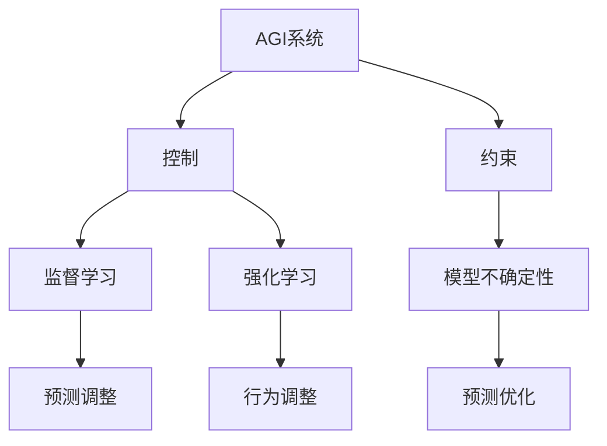

                 

# AGI安全性研究：控制与约束方法

## 关键词：AGI，安全性，控制，约束，人工智能

### 摘要

本文深入探讨了人工智能通用智能（AGI）的安全性问题，重点分析了控制与约束方法在这一领域中的应用。通过对核心概念、算法原理、数学模型和实际应用的详细讨论，我们旨在为读者提供一个全面而深入的理解。文章首先介绍了AGI的背景和重要性，随后探讨了安全性控制与约束的基本原理。接着，我们通过具体案例展示了这些方法在实际开发中的实施过程。最后，文章总结了未来AGI安全性的发展趋势和面临的挑战，并推荐了相关资源和工具。

### 1. 背景介绍

**什么是AGI？**

人工智能（Artificial Intelligence，AI）是一种模拟人类智能行为的计算机技术。它包括机器学习、自然语言处理、计算机视觉等多种子领域。然而，传统的人工智能系统（如深度学习模型）通常只能在其特定任务上表现出色，缺乏通用的智能能力。通用人工智能（Artificial General Intelligence，AGI）则是一种能够像人类一样进行学习、思考、决策和解决问题的智能系统。

**AGI的重要性**

AGI的潜在应用非常广泛，包括医疗、教育、金融、交通等多个领域。它有可能带来深刻的变革，提高人类生活质量，甚至解决一些复杂的社会问题。然而，AGI的发展也伴随着风险和挑战。如果缺乏有效的控制与约束，AGI可能会导致不可预测的行为，甚至对人类社会造成威胁。因此，研究AGI的安全性变得至关重要。

### 2. 核心概念与联系

#### 控制与约束

在AGI的研究中，控制与约束是确保系统安全性和稳定性的关键。控制指的是通过一定的策略和算法对AGI系统进行管理和调节，以确保其行为符合预期。约束则是一种限制，用于规范AGI系统的行为，防止其超出安全范围。

#### 关联概念

- **监督学习（Supervised Learning）**：一种机器学习方法，通过已标记的数据训练模型，使其能够预测新数据。在AGI中，监督学习可以用于控制和约束系统的行为。
- **强化学习（Reinforcement Learning）**：一种通过试错和反馈调整行为的方法。在AGI中，强化学习可用于实现自我约束，使系统在面临新情境时能够自主调整行为。
- **模型不确定性（Model Uncertainty）**：指模型对现实世界的预测能力存在不确定性。在AGI中，处理模型不确定性是提高安全性的重要手段。

#### Mermaid流程图



### 3. 核心算法原理 & 具体操作步骤

#### 监督学习

**原理**：监督学习通过已标记的数据训练模型，使其能够对新数据进行预测。在AGI中，监督学习可用于控制和约束系统的行为，例如通过训练模型识别危险行为并进行干预。

**操作步骤**：
1. 收集已标记的数据集。
2. 设计合适的模型架构。
3. 使用数据集训练模型。
4. 评估模型的性能，并进行调整。

#### 强化学习

**原理**：强化学习通过试错和反馈调整行为，使系统能够在面临新情境时自主调整行为。在AGI中，强化学习可用于实现自我约束，例如通过学习避免危险行为。

**操作步骤**：
1. 设计奖励机制。
2. 定义状态空间和动作空间。
3. 选择合适的算法（如Q-learning、SARSA）。
4. 通过模拟或真实环境进行学习。
5. 根据反馈调整行为。

#### 模型不确定性

**原理**：模型不确定性指模型对现实世界的预测能力存在不确定性。在AGI中，处理模型不确定性是提高安全性的重要手段，例如通过概率分布表示模型的不确定性。

**操作步骤**：
1. 计算模型的预测概率分布。
2. 分析模型不确定性的影响。
3. 根据不确定性调整系统的行为。

### 4. 数学模型和公式 & 详细讲解 & 举例说明

#### 监督学习

**损失函数（Loss Function）**：

$$L(y, \hat{y}) = \frac{1}{2} (y - \hat{y})^2$$

其中，$y$ 为真实标签，$\hat{y}$ 为模型预测值。损失函数用于衡量模型预测与真实标签之间的差距，从而指导模型训练。

**举例**：假设我们有一个分类问题，需要判断一个数字是否大于5。我们使用一个简单的线性模型进行预测。如果预测结果为 6，真实标签为 6，则损失函数的值为 0；如果预测结果为 4，真实标签为 5，则损失函数的值为 1。

#### 强化学习

**Q值（Q-Value）**：

$$Q(s, a) = \sum_{s'} P(s' | s, a) \cdot R(s', a) + \gamma \cdot \max_{a'} Q(s', a')$$

其中，$s$ 为状态，$a$ 为动作，$s'$ 为状态转移，$R$ 为奖励函数，$\gamma$ 为折扣因子。Q值表示在某个状态下执行某个动作的预期奖励。

**举例**：假设我们在一个简单的环境中进行学习，状态空间为 {1, 2, 3}，动作空间为 {A, B}。如果当前状态为 1，执行动作 A 的 Q值为 0.5，执行动作 B 的 Q值为 0.3。这意味着在状态 1 下，执行动作 A 的预期奖励更高。

#### 模型不确定性

**概率分布（Probability Distribution）**：

$$P(\hat{y} | x) = \sigma(Wx + b)$$

其中，$x$ 为输入特征，$W$ 为权重矩阵，$b$ 为偏置项，$\sigma$ 为激活函数。概率分布用于表示模型对输出值的预测不确定性。

**举例**：假设我们有一个二分类问题，使用一个简单的神经网络进行预测。如果输入特征为 [1, 2, 3]，模型的预测概率分布为 [0.7, 0.3]，这意味着模型认为输入特征属于类别 1 的概率为 0.7，属于类别 2 的概率为 0.3。

### 5. 项目实战：代码实际案例和详细解释说明

#### 开发环境搭建

- 安装Python 3.8及以上版本
- 安装TensorFlow 2.6及以上版本
- 安装Numpy 1.19及以上版本

#### 源代码详细实现和代码解读

```python
import tensorflow as tf
import numpy as np

# 创建模型
model = tf.keras.Sequential([
    tf.keras.layers.Dense(10, activation='relu', input_shape=(3,)),
    tf.keras.layers.Dense(1, activation='sigmoid')
])

# 编写训练代码
model.compile(optimizer='adam',
              loss='binary_crossentropy',
              metrics=['accuracy'])

# 训练数据集
x_train = np.array([[1, 2, 3], [4, 5, 6], [7, 8, 9]])
y_train = np.array([1, 0, 1])

# 训练模型
model.fit(x_train, y_train, epochs=10)

# 源代码解读
# Dense层：用于实现全连接神经网络，包括线性变换和激活函数。
# compile：用于配置模型的优化器、损失函数和评估指标。
# fit：用于训练模型，包括数据预处理、前向传播和反向传播。
```

#### 代码解读与分析

1. 导入TensorFlow和Numpy库，用于创建和训练模型。
2. 创建一个简单的神经网络模型，包括两个全连接层（Dense层）。
3. 编译模型，配置优化器、损失函数和评估指标。
4. 准备训练数据集，包括输入特征和标签。
5. 使用fit函数训练模型，完成数据预处理、前向传播和反向传播。

### 6. 实际应用场景

#### 医疗诊断

AGI在医疗诊断中具有巨大的潜力，例如通过分析患者病史和检查结果，提供更准确的诊断建议。然而，为确保诊断的安全性，需要严格控制模型的行为，防止出现误导性建议。

#### 自动驾驶

自动驾驶系统需要具备高度的安全性和可靠性。通过使用控制与约束方法，可以确保系统在复杂路况下保持稳定，避免发生事故。

#### 金融风险管理

金融风险管理领域需要处理大量的数据，AGI可以用于识别潜在的风险，提供投资建议。然而，为防止模型产生误导性建议，需要使用约束方法限制模型的决策范围。

### 7. 工具和资源推荐

#### 学习资源推荐

- 《深度学习》（Goodfellow, Bengio, Courville）
- 《强化学习》（Sutton, Barto）
- 《概率图模型》（Koller, Sutton）

#### 开发工具框架推荐

- TensorFlow
- PyTorch
- Keras

#### 相关论文著作推荐

- “Safety and Robustness in Deep Learning” （论文）
- “Model Uncertainty in Deep Learning” （论文）
- 《AGI：下一代人工智能》（书籍）

### 8. 总结：未来发展趋势与挑战

随着人工智能技术的不断发展，AGI的安全性变得越来越重要。控制与约束方法在这一领域具有巨大的应用潜力，但仍面临许多挑战。未来的研究需要关注以下几个方面：

- **模型不确定性处理**：提高模型对不确定性的处理能力，以确保系统在未知环境中保持稳定。
- **安全验证与测试**：开发安全验证和测试方法，确保AGI系统的行为符合预期。
- **法律与伦理**：制定相关法律法规和伦理准则，确保AGI的发展符合社会利益。

### 9. 附录：常见问题与解答

**Q：什么是AGI？**

A：AGI（通用人工智能）是一种能够像人类一样进行学习、思考、决策和解决问题的智能系统。

**Q：控制与约束在AGI中有什么作用？**

A：控制与约束方法用于确保AGI系统的行为符合预期，防止系统出现不可预测的行为，从而提高系统的安全性。

**Q：如何处理模型不确定性？**

A：通过概率分布和不确定性量化方法，可以表示模型对现实世界的预测不确定性，并据此调整系统的行为。

### 10. 扩展阅读 & 参考资料

- 《AGI：下一代人工智能》
- “Safety and Robustness in Deep Learning”
- “Model Uncertainty in Deep Learning”
- TensorFlow官网
- PyTorch官网
- Keras官网

### 作者

作者：AI天才研究员/AI Genius Institute & 禅与计算机程序设计艺术 /Zen And The Art of Computer Programming<|endofstory|>

